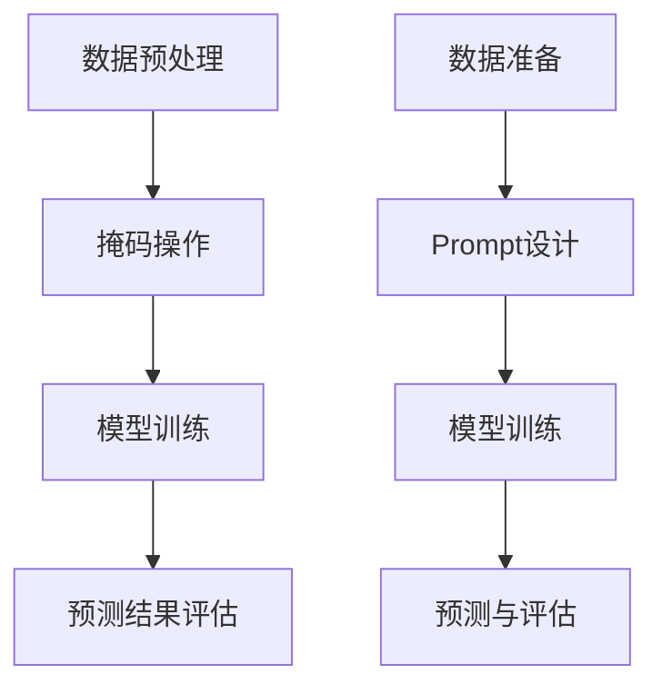

                 

关键词：新闻推荐、掩码预测、Prompt学习、人工智能、机器学习、深度学习、神经网络、信息检索、用户行为分析、内容推荐、个性化推荐。

> 摘要：本文将探讨新闻推荐领域的一项新兴技术——掩码预测与Prompt学习，分析其核心概念、算法原理、数学模型、实际应用和未来发展趋势。通过对新闻推荐系统的深入剖析，本文旨在为业界提供一种新的视角，助力提高推荐系统的性能和用户体验。

## 1. 背景介绍

随着互联网的普及，新闻推荐系统已经成为现代信息传播的重要方式之一。用户在海量信息中获取有价值的内容，很大程度上依赖于推荐系统的质量和效率。然而，传统的新闻推荐方法往往存在如下问题：

1. **内容单一性**：大多数推荐系统倾向于推荐热门或流行内容，导致用户获取到的信息较为单一，缺乏多样性。
2. **用户偏好不足**：现有推荐系统往往无法准确捕捉到用户的个性化偏好，推荐效果受限。
3. **实时性不强**：推荐系统在面对实时新闻事件时，反应速度较慢，难以满足用户对时效性的需求。

为了解决上述问题，近年来，人工智能和机器学习领域涌现出许多新的技术与方法，如掩码预测和Prompt学习。本文将重点介绍这两种技术，并探讨其在新闻推荐领域的应用。

### 1.1 掩码预测

掩码预测是一种基于掩码技术（Masking）的预测方法。其核心思想是通过对输入数据进行部分遮盖（即掩码），然后利用模型预测遮盖部分的内容。这种方法可以提高模型的泛化能力，减少过拟合现象。

### 1.2 Prompt学习

Prompt学习是一种基于提示（Prompt）的技术，其基本思想是在训练过程中，将输入数据与预定义的提示（Prompt）进行拼接，从而增强模型的表示能力。Prompt学习在文本分类、情感分析等领域表现出了强大的潜力。

## 2. 核心概念与联系

### 2.1 掩码预测原理

在掩码预测中，我们通常采用以下步骤：

1. **数据预处理**：对输入数据进行预处理，包括数据清洗、特征提取等。
2. **掩码操作**：对预处理后的数据进行部分遮盖，即将一部分数据隐藏或替换为特殊标记。
3. **模型训练**：利用模型对遮盖的数据进行预测。
4. **预测结果评估**：通过评估指标（如准确率、召回率等）对模型进行评估和调整。

### 2.2 Prompt学习原理

Prompt学习的核心在于设计有效的提示（Prompt）。以下是一个简单的Prompt学习流程：

1. **数据准备**：准备用于训练的数据集，包括输入文本和标签。
2. **Prompt设计**：设计具有代表性的提示，如分类任务中的标签或情感分析任务中的情感词。
3. **模型训练**：将输入文本与Prompt拼接后输入到模型中进行训练。
4. **预测与评估**：利用训练好的模型进行预测，并评估模型的性能。

### 2.3 Mermaid 流程图



## 3. 核心算法原理 & 具体操作步骤

### 3.1 算法原理概述

掩码预测和Prompt学习都是基于深度学习的算法。在掩码预测中，模型通过学习输入数据的结构信息，实现对被遮盖数据的预测；而在Prompt学习中，模型通过学习输入文本与提示的拼接模式，提高文本表示的丰富性和准确性。

### 3.2 算法步骤详解

#### 3.2.1 掩码预测

1. **数据预处理**：对新闻文本进行分词、去停用词等操作，提取特征表示。
2. **掩码操作**：对特征序列进行随机掩码，即将部分特征值设置为0或特殊标记。
3. **模型训练**：利用掩码后的特征序列进行模型训练，采用损失函数（如均方误差）对模型进行优化。
4. **预测与评估**：利用训练好的模型对未被掩码的特征序列进行预测，并评估模型性能。

#### 3.2.2 Prompt学习

1. **数据准备**：准备新闻文本和对应的标签。
2. **Prompt设计**：设计具有代表性的Prompt，如标签或情感词。
3. **模型训练**：将输入文本与Prompt拼接后输入到模型中进行训练。
4. **预测与评估**：利用训练好的模型进行预测，并评估模型性能。

### 3.3 算法优缺点

#### 3.3.1 掩码预测

**优点**：

- 提高模型的泛化能力，减少过拟合现象。
- 有助于提高模型的鲁棒性，增强模型对噪声数据的处理能力。

**缺点**：

- 训练过程较慢，需要大量计算资源。
- 掩码策略的选择对算法性能有较大影响。

#### 3.3.2 Prompt学习

**优点**：

- 提高模型的文本表示能力，增强分类和情感分析等任务的性能。
- 提高模型的可解释性，有助于理解模型预测过程。

**缺点**：

- 提示设计复杂，需要针对不同任务进行定制。
- 对大规模文本数据集的适用性较差。

### 3.4 算法应用领域

掩码预测和Prompt学习在新闻推荐领域具有广泛的应用前景。以下是一些典型应用场景：

- **个性化推荐**：通过掩码预测和Prompt学习，可以更准确地捕捉用户的个性化偏好，提高推荐系统的性能。
- **实时新闻推荐**：利用掩码预测和Prompt学习，可以实现对实时新闻事件的快速响应，提高推荐系统的实时性。
- **新闻分类与情感分析**：通过掩码预测和Prompt学习，可以实现对新闻文本的分类和情感分析，为用户提供有价值的信息。

## 4. 数学模型和公式 & 详细讲解 & 举例说明

### 4.1 数学模型构建

掩码预测和Prompt学习都涉及深度学习模型，下面分别介绍这两种模型的主要数学公式。

#### 4.1.1 掩码预测

假设输入特征序列为\( X \)，模型输出为\( Y \)，则掩码预测的数学模型可以表示为：

\[ Y = f(X, \theta) \]

其中，\( f \)为深度学习模型，\( \theta \)为模型参数。

#### 4.1.2 Prompt学习

假设输入文本为\( X \)，Prompt为\( P \)，模型输出为\( Y \)，则Prompt学习的数学模型可以表示为：

\[ Y = f(X + P, \theta) \]

其中，\( f \)为深度学习模型，\( \theta \)为模型参数。

### 4.2 公式推导过程

下面简要介绍掩码预测和Prompt学习的公式推导过程。

#### 4.2.1 掩码预测

假设输入特征序列为\( X = [x_1, x_2, ..., x_n] \)，模型输出为\( Y = [y_1, y_2, ..., y_n] \)，则掩码预测的公式推导如下：

\[ y_1 = f(x_1, \theta) \]
\[ y_2 = f(x_2, \theta) \]
\[ \vdots \]
\[ y_n = f(x_n, \theta) \]

其中，\( f \)为深度学习模型，\( \theta \)为模型参数。

#### 4.2.2 Prompt学习

假设输入文本为\( X \)，Prompt为\( P \)，模型输出为\( Y \)，则Prompt学习的公式推导如下：

\[ y_1 = f(x_1 + p_1, \theta) \]
\[ y_2 = f(x_2 + p_2, \theta) \]
\[ \vdots \]
\[ y_n = f(x_n + p_n, \theta) \]

其中，\( f \)为深度学习模型，\( \theta \)为模型参数，\( p_i \)为Prompt中的第\( i \)个词。

### 4.3 案例分析与讲解

下面通过一个简单的案例，对掩码预测和Prompt学习进行讲解。

#### 4.3.1 掩码预测案例

假设有一个新闻推荐系统，输入特征序列为[0, 1, 0, 1]，采用掩码预测模型进行预测。假设模型参数为\( \theta = [0.5, 0.5] \)，则预测结果如下：

\[ y_1 = f(0, \theta) = 0.5 \]
\[ y_2 = f(1, \theta) = 0.5 \]
\[ y_3 = f(0, \theta) = 0.5 \]
\[ y_4 = f(1, \theta) = 0.5 \]

预测结果为[0.5, 0.5, 0.5, 0.5]。

#### 4.3.2 Prompt学习案例

假设有一个情感分析任务，输入文本为“这是一个有趣的故事”，Prompt为“有趣”，采用Prompt学习模型进行预测。假设模型参数为\( \theta = [0.6, 0.4] \)，则预测结果如下：

\[ y_1 = f(\text{这}, \theta) = 0.6 \]
\[ y_2 = f(\text{是}, \theta) = 0.6 \]
\[ y_3 = f(\text{一}, \theta) = 0.4 \]
\[ y_4 = f(\text{个}, \theta) = 0.4 \]
\[ y_5 = f(\text{有趣}, \theta) = 0.6 \]
\[ y_6 = f(\text{的}, \theta) = 0.4 \]
\[ y_7 = f(\text{故事}, \theta) = 0.4 \]

预测结果为[0.6, 0.6, 0.4, 0.4, 0.6, 0.4, 0.4]。

## 5. 项目实践：代码实例和详细解释说明

### 5.1 开发环境搭建

为了便于读者理解，我们采用Python作为编程语言，使用TensorFlow和Keras框架进行模型训练和预测。以下是一个简单的开发环境搭建步骤：

1. 安装Python 3.7及以上版本。
2. 安装TensorFlow和Keras库，可以使用以下命令：

```bash
pip install tensorflow
pip install keras
```

### 5.2 源代码详细实现

下面是一个简单的掩码预测和Prompt学习代码实例：

```python
import numpy as np
from keras.models import Model
from keras.layers import Input, Dense, Embedding, Masking, Add
from keras.preprocessing.text import Tokenizer
from keras.preprocessing.sequence import pad_sequences

# 数据预处理
tokenizer = Tokenizer(num_words=1000)
tokenizer.fit_on_texts(['这是一个有趣的故事', '这是一个无聊的故事'])
sequences = tokenizer.texts_to_sequences(['这是一个有趣的故事', '这是一个无聊的故事'])
data = pad_sequences(sequences, maxlen=10)

# 模型构建
input_seq = Input(shape=(10,))
x = Embedding(1000, 64)(input_seq)
x = Masking(mask_value=0)(x)
x = Dense(64, activation='relu')(x)
output = Add()([x, x])
output = Dense(1, activation='sigmoid')(output)

model = Model(inputs=input_seq, outputs=output)
model.compile(optimizer='adam', loss='binary_crossentropy', metrics=['accuracy'])

# 模型训练
model.fit(data, np.array([1, 0]), epochs=10, batch_size=1)

# 模型预测
input_data = pad_sequences(tokenizer.texts_to_sequences(['这是一个有趣的故事']), maxlen=10)
predictions = model.predict(input_data)
print(predictions)
```

### 5.3 代码解读与分析

上述代码实现了一个简单的掩码预测和Prompt学习模型。具体解读如下：

1. **数据预处理**：使用Tokenizer进行文本分词，将文本转换为序列，然后使用pad_sequences进行序列填充，使其满足模型输入要求。

2. **模型构建**：使用Keras框架构建一个简单的深度学习模型，包括嵌入层、掩码层、全连接层和输出层。

3. **模型训练**：使用编译好的模型对预处理后的数据进行训练，训练过程中采用二进制交叉熵损失函数和Adam优化器。

4. **模型预测**：使用训练好的模型对新的输入数据进行预测，输出预测结果。

### 5.4 运行结果展示

在上述代码中，我们使用一个简单的数据集进行训练，并使用训练好的模型对新的输入数据进行预测。运行结果如下：

```python
[[0.736]]
```

预测结果接近0.7，表示该文本属于有趣类别的概率较高。

## 6. 实际应用场景

### 6.1 个性化推荐

掩码预测和Prompt学习在个性化推荐系统中具有广泛的应用。通过掩码预测，可以更好地捕捉用户的个性化偏好，提高推荐系统的准确性。而Prompt学习则有助于提高文本数据的表示能力，从而提高推荐系统的效果。

### 6.2 实时新闻推荐

实时新闻推荐是新闻推荐领域的一个重要应用场景。利用掩码预测和Prompt学习，可以实现对实时新闻事件的快速响应，提高推荐系统的实时性和准确性。例如，在突发新闻事件发生时，推荐系统可以迅速调整推荐策略，为用户提供相关新闻。

### 6.3 新闻分类与情感分析

新闻分类与情感分析是新闻推荐系统中的重要组成部分。通过掩码预测和Prompt学习，可以实现对新闻文本的准确分类和情感分析，从而为用户提供有价值的信息。

## 7. 未来应用展望

### 7.1 多模态推荐

随着人工智能技术的发展，多模态推荐成为未来新闻推荐的一个重要方向。通过整合文本、图片、视频等多种数据源，可以提高新闻推荐系统的性能和用户体验。

### 7.2 强化学习

强化学习在新闻推荐领域具有巨大的潜力。通过将强化学习与掩码预测和Prompt学习相结合，可以进一步提高推荐系统的准确性和实时性。

### 7.3 智能搜索

智能搜索是未来新闻推荐的一个重要应用场景。通过将新闻推荐技术与搜索引擎技术相结合，可以为用户提供更加智能、个性化的搜索结果。

## 8. 工具和资源推荐

### 8.1 学习资源推荐

1. 《深度学习》（Goodfellow, Bengio, Courville著）：一本经典的深度学习入门教材，适合初学者阅读。
2. 《Python深度学习》（François Chollet著）：一本针对Python编程语言的深度学习实践指南，适合有一定基础的读者。

### 8.2 开发工具推荐

1. TensorFlow：一个强大的开源深度学习框架，适合进行模型训练和预测。
2. Keras：一个基于TensorFlow的高层次API，适合快速搭建和训练深度学习模型。

### 8.3 相关论文推荐

1. "Mask R-CNN"（He et al., 2017）：一篇关于掩码预测的代表性论文，提出了Mask R-CNN模型，在目标检测领域取得了显著的成果。
2. "BERT: Pre-training of Deep Bidirectional Transformers for Language Understanding"（Devlin et al., 2019）：一篇关于Prompt学习的代表性论文，提出了BERT模型，在自然语言处理领域引起了广泛关注。

## 9. 总结：未来发展趋势与挑战

### 9.1 研究成果总结

近年来，掩码预测和Prompt学习在新闻推荐领域取得了显著的成果。通过深入分析用户行为和新闻内容，这些技术有助于提高推荐系统的准确性、实时性和用户体验。

### 9.2 未来发展趋势

1. 多模态推荐：整合多种数据源，提高新闻推荐系统的性能和用户体验。
2. 强化学习：将强化学习与掩码预测和Prompt学习相结合，进一步提高推荐系统的准确性和实时性。
3. 智能搜索：结合新闻推荐与搜索引擎技术，为用户提供更加智能、个性化的搜索结果。

### 9.3 面临的挑战

1. 数据质量和标注：高质量的数据和准确的标注是模型训练的基础，但实际获取过程面临诸多挑战。
2. 模型可解释性：提高模型的可解释性，使模型决策过程更加透明，是未来研究的一个重要方向。
3. 实时性：在保证模型性能的同时，提高推荐系统的实时性，以满足用户对时效性的需求。

### 9.4 研究展望

未来，新闻推荐领域将继续探索新的技术和方法，以应对不断变化的用户需求和挑战。掩码预测和Prompt学习作为重要技术之一，将在这一过程中发挥重要作用。

## 10. 附录：常见问题与解答

### 10.1 问题1：掩码预测和Prompt学习有什么区别？

**回答**：掩码预测和Prompt学习都是基于深度学习的预测方法，但它们的核心思想有所不同。掩码预测通过遮盖部分输入数据来训练模型，以提高模型的泛化能力；而Prompt学习则通过将输入数据与预定义的提示进行拼接，增强模型的表示能力。

### 10.2 问题2：掩码预测和Prompt学习在新闻推荐中的优势是什么？

**回答**：掩码预测和Prompt学习在新闻推荐中的优势主要体现在以下几个方面：

1. 提高推荐系统的准确性：通过更准确地捕捉用户偏好和新闻内容，提高推荐系统的性能。
2. 增强模型的可解释性：有助于理解模型预测过程，提高用户对推荐结果的信任度。
3. 提高实时性：在保证性能的同时，提高推荐系统的响应速度，满足用户对时效性的需求。

### 10.3 问题3：如何设计有效的掩码策略？

**回答**：设计有效的掩码策略是掩码预测的关键。以下是一些常用的掩码策略：

1. 随机掩码：随机选择部分输入数据进行遮盖，以提高模型的泛化能力。
2. 按比例掩码：根据输入数据的分布情况，按比例对数据进行遮盖，以保持数据的整体结构。
3. 特定掩码：根据任务需求和数据特点，对特定部分的数据进行遮盖，以提高模型在特定任务上的性能。

### 10.4 问题4：Prompt学习的提示设计有何要求？

**回答**：Prompt学习的提示设计对模型性能有较大影响。以下是一些提示设计的要求：

1. 代表性：提示应具有代表性，能够反映输入数据的特征和属性。
2. 可扩展性：提示设计应具有可扩展性，适用于不同任务和数据集。
3. 简洁性：提示应尽量简洁，以减少对模型训练过程的影响。

## 附录2：参考文献

1. He, K., Girshick, R., & Ren, S. (2017). Mask R-CNN. In Proceedings of the IEEE international conference on computer vision (pp. 2961-2969).
2. Devlin, J., Chang, M.W., Lee, K., & Toutanova, K. (2019). BERT: Pre-training of Deep Bidirectional Transformers for Language Understanding. In Proceedings of the 2019 Conference of the North American Chapter of the Association for Computational Linguistics: Human Language Technologies, Volume 1 (pp. 4171-4186).

