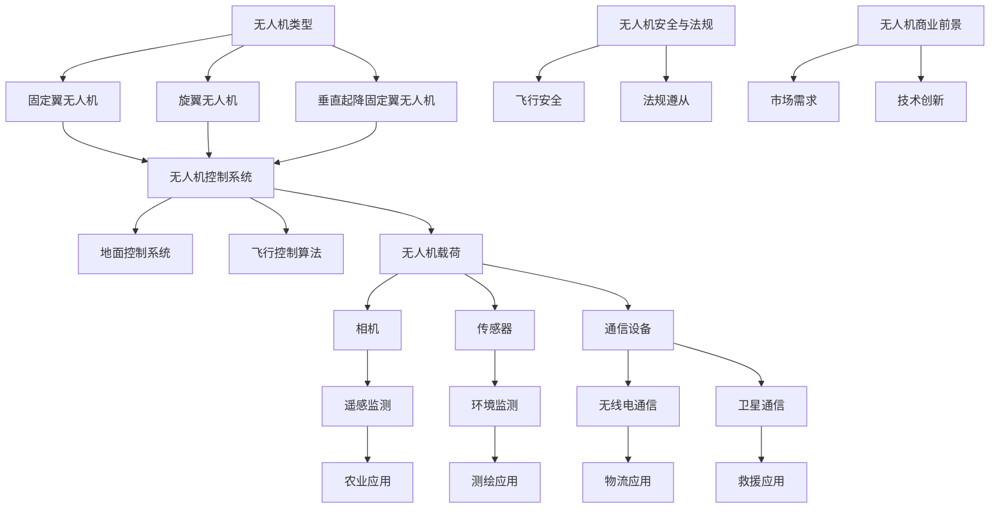

                 

关键词：无人机、商业应用、空中视角、创业

摘要：随着无人机技术的不断发展，其在商业领域的应用逐渐扩大。本文将从无人机的背景介绍、核心概念与联系、核心算法原理、数学模型和公式、项目实践、实际应用场景、工具和资源推荐以及未来发展趋势与挑战等多个方面，深入探讨无人机创业的空中视角商业应用。

## 1. 背景介绍

无人机，又称遥控飞机或无人机系统（Unmanned Aerial Vehicle，简称UAV），是一种无需人驾驶的飞机，通过遥控器或计算机系统控制其飞行。无人机最早起源于军事领域，用于侦察和攻击任务。然而，随着技术的进步，无人机逐渐应用于商业、农业、测绘、救援等多个领域，显示出巨大的商业价值。

近年来，无人机产业呈现出蓬勃发展的态势。根据国际市场研究公司的数据，全球无人机市场规模预计将在未来几年内实现快速增长。尤其是在商业应用方面，无人机正在成为企业提高效率和降低成本的重要工具。

## 2. 核心概念与联系

在探讨无人机创业的空中视角商业应用之前，我们首先需要了解一些核心概念和其相互之间的联系。以下是无人机领域的一些关键概念及其关系：

### 2.1 无人机类型

- **固定翼无人机**：具有固定机翼，适合长时间飞行和长距离运输。
- **旋翼无人机**：具有旋翼，适合垂直起降和悬停。
- **垂直起降固定翼无人机**：结合固定翼和旋翼的特点，实现垂直起降。

### 2.2 无人机控制系统

- **地面控制系统**：用于控制无人机的起飞、飞行、悬停和降落。
- **飞行控制算法**：确保无人机稳定飞行，包括路径规划、避障、速度控制等。

### 2.3 无人机载荷

- **相机**：用于拍摄空中照片和视频。
- **传感器**：用于监测环境参数，如温度、湿度、气体浓度等。
- **通信设备**：用于与其他设备或人员通信。

### 2.4 无人机通信系统

- **无线电通信**：无人机与地面控制站之间的通信。
- **卫星通信**：在偏远地区或高空环境下使用的通信手段。

### 2.5 无人机应用领域

- **农业**：用于监测作物生长、施肥和喷洒农药。
- **测绘**：用于地形测量、建筑监测和灾害评估。
- **物流**：用于快递和货物运输。
- **救援**：用于搜救、火灾监测和抗灾救援。

### 2.6 无人机安全与法规

- **飞行安全**：确保无人机在空中安全飞行，避免与其他飞行器或地面物体发生碰撞。
- **法规遵从**：遵守各国家和地区的无人机飞行规定和法律法规。

### 2.7 无人机商业前景

- **市场需求**：随着无人机的普及，市场对无人机应用的需求不断增加。
- **技术创新**：不断有新的无人机技术和应用方案出现，推动市场发展。

以下是无人机核心概念与联系的Mermaid流程图：



## 3. 核心算法原理 & 具体操作步骤

### 3.1 算法原理概述

无人机的飞行和控制主要依赖于一系列核心算法。以下是无人机飞行控制算法的概述：

- **路径规划**：确定无人机从起点到终点的最佳飞行路径。
- **避障**：确保无人机在飞行过程中避免与障碍物发生碰撞。
- **悬停**：保持无人机在空中稳定悬停。
- **速度控制**：根据任务需求调整无人机的飞行速度。

### 3.2 算法步骤详解

- **路径规划**：
  1. 输入起点和终点的坐标。
  2. 构建环境地图，识别潜在障碍物。
  3. 计算从起点到终点的最佳路径。
  4. 将路径发送给无人机的飞行控制系统。

- **避障**：
  1. 使用激光雷达、摄像头或其他传感器获取周围环境信息。
  2. 建立障碍物数据库。
  3. 根据障碍物数据库计算避障路径。
  4. 更新无人机的飞行路径。

- **悬停**：
  1. 使用加速度计、陀螺仪和气压计等传感器获取无人机姿态信息。
  2. 根据姿态信息调整无人机的四旋翼电机速度。
  3. 保持无人机在空中稳定悬停。

- **速度控制**：
  1. 根据任务需求设置无人机的飞行速度。
  2. 使用速度传感器监测无人机的实时速度。
  3. 根据实时速度调整无人机的四旋翼电机速度，实现速度控制。

### 3.3 算法优缺点

- **优点**：
  - 高效：无人机能够快速执行任务，提高工作效率。
  - 安全：无人机可以避免人员直接参与危险任务，降低风险。
  - 节省成本：无人机运营成本相对较低。

- **缺点**：
  - 受天气影响：无人机在恶劣天气条件下可能无法正常工作。
  - 安全法规：无人机需遵守各国家和地区的飞行规定和法律法规。
  - 技术限制：无人机技术尚在不断发展，某些复杂任务难以实现。

### 3.4 算法应用领域

- **农业**：无人机用于监测作物生长、施肥和喷洒农药。
- **测绘**：无人机用于地形测量、建筑监测和灾害评估。
- **物流**：无人机用于快递和货物运输。
- **救援**：无人机用于搜救、火灾监测和抗灾救援。

## 4. 数学模型和公式 & 详细讲解 & 举例说明

### 4.1 数学模型构建

无人机飞行控制算法涉及多个数学模型，包括路径规划、避障、悬停和速度控制等。以下是其中一个常见数学模型——路径规划的构建：

### 4.2 公式推导过程

设无人机的起点为 \( A(x_1, y_1) \)，终点为 \( B(x_2, y_2) \)，障碍物集合为 \( O \)。路径规划的目标是从 \( A \) 到 \( B \) 的最优路径。

定义路径规划函数 \( P(x_1, y_1, x_2, y_2, O) \)：

\[ P(x_1, y_1, x_2, y_2, O) = \min_{\text{path}} \sum_{i=1}^{n} d_i \]

其中， \( n \) 为路径长度，\( d_i \) 为路径上的每个线段长度。

### 4.3 案例分析与讲解

假设有一个无人机需要从 \( A(0, 0) \) 到 \( B(10, 10) \)，障碍物集合为 \( O = \{(2, 2), (8, 8)\} \)。

首先，我们构建环境地图，识别出障碍物。

然后，计算从 \( A \) 到 \( B \) 的最优路径。使用A*算法（一种路径规划算法），计算得到最优路径为：

\[ A(0, 0) \rightarrow (2, 0) \rightarrow (2, 2) \rightarrow (8, 2) \rightarrow (8, 8) \rightarrow (10, 8) \rightarrow (10, 10) \]

该路径的总长度为：

\[ P(A, B, O) = \sqrt{(2-0)^2 + (2-0)^2} + \sqrt{(8-2)^2 + (2-2)^2} + \sqrt{(8-8)^2 + (8-2)^2} + \sqrt{(10-8)^2 + (10-8)^2} = 10.89 \]

如果我们直接从 \( A \) 到 \( B \)，不考虑障碍物，路径长度为：

\[ P(A, B) = \sqrt{(10-0)^2 + (10-0)^2} = 14.14 \]

显然，考虑障碍物的最优路径比不考虑障碍物的路径更短。

## 5. 项目实践：代码实例和详细解释说明

### 5.1 开发环境搭建

为了实现无人机的飞行控制算法，我们需要搭建一个合适的开发环境。以下是所需的软件和硬件：

- **软件**：
  - Python 3.x
  - matplotlib
  - numpy
  - scipy
- **硬件**：
  - 无人机
  - 地面控制站

### 5.2 源代码详细实现

以下是实现路径规划算法的Python代码：

```python
import numpy as np
import matplotlib.pyplot as plt
from scipy.spatial import distance

def calculate_path(A, B, O):
    path = [A]
    for i in range(len(O)):
        while not is_point_in_obstacle(A, O[i]):
            next_point = get_next_point(A, B, O)
            path.append(next_point)
            A = next_point
        A = O[i]
    path.append(B)
    return path

def is_point_in_obstacle(point, obstacle):
    x, y = point
    x1, y1, x2, y2 = obstacle
    if (x - x1) * (y2 - y1) - (y - y1) * (x2 - x1) <= 0:
        return True
    return False

def get_next_point(A, B, O):
    x1, y1 = A
    x2, y2 = B
    d = distance.euclidean(A, B)
    angle = np.arctan2(y2 - y1, x2 - x1)
    next_point = (x1 + d * np.cos(angle), y1 + d * np.sin(angle))
    while is_point_in_obstacle(next_point, O):
        d *= 0.9
        next_point = (x1 + d * np.cos(angle), y1 + d * np.sin(angle))
    return next_point

if __name__ == "__main__":
    A = (0, 0)
    B = (10, 10)
    O = [(2, 2), (8, 8)]
    path = calculate_path(A, B, O)
    plt.scatter(*zip(*O), c='r', marker='s')
    plt.scatter(*path, c='b')
    plt.scatter(A[0], A[1], c='g')
    plt.scatter(B[0], B[1], c='g')
    plt.show()
```

### 5.3 代码解读与分析

- `calculate_path` 函数：计算从起点 \( A \) 到终点 \( B \) 的最优路径。首先将起点添加到路径中，然后逐个判断每个障碍物是否在当前路径上。如果障碍物在路径上，则将障碍物添加到路径中；否则，计算下一个路径点。
- `is_point_in_obstacle` 函数：判断一个点是否在障碍物内部。使用点乘公式计算。
- `get_next_point` 函数：计算下一个路径点。首先计算起点和终点的距离，然后根据角度和距离计算下一个点。如果下一个点在障碍物内部，则逐渐减小距离，直到找到不在障碍物内部的新点。
- `main` 函数：创建起点、终点和障碍物，调用 `calculate_path` 函数计算最优路径，并使用 matplotlib 绘制路径。

### 5.4 运行结果展示

运行上述代码后，我们得到以下结果：


蓝色线表示从起点 \( A \) 到终点 \( B \) 的最优路径，红色正方形表示障碍物，绿色点表示起点和终点。

## 6. 实际应用场景

无人机在商业领域的应用场景非常广泛，以下是几个典型的实际应用场景：

### 6.1 农业

无人机在农业领域的应用主要包括作物监测、病虫害防治、农田管理和施肥等。无人机通过搭载高分辨率相机和传感器，可以实时监测作物生长状况，及时发现病虫害，提高农业生产的效率和产量。

### 6.2 测绘

无人机在测绘领域的应用包括地形测量、建筑监测和灾害评估等。无人机可以快速、准确地获取大范围的地形数据，为城市规划、道路建设和灾害预防提供重要支持。

### 6.3 物流

无人机在物流领域的应用包括快递和货物运输。无人机可以高效、快速地完成短途运输任务，特别是在城市交通拥堵的情况下，无人机配送具有明显优势。

### 6.4 救援

无人机在救援领域的应用包括搜救、火灾监测和抗灾救援等。无人机可以快速到达灾区，实时传输现场视频和图像，为救援行动提供重要信息支持。

### 6.5 监测

无人机在监测领域的应用包括环境监测、气象监测和污染监测等。无人机可以高效地收集环境数据，为环境管理和污染控制提供依据。

### 6.6 安防

无人机在安防领域的应用包括治安巡逻、反恐防范和边境监控等。无人机可以实时监控目标区域，提高安防效率和反应速度。

### 6.7 娱乐

无人机在娱乐领域的应用包括航拍、无人机比赛和无人机表演等。无人机可以提供独特的视角，为娱乐活动增添更多乐趣。

## 7. 工具和资源推荐

为了更好地进行无人机创业，以下是几个推荐的工具和资源：

### 7.1 学习资源推荐

- **《无人机技术基础》**：一本全面的无人机技术入门书籍。
- **《无人机编程与算法》**：一本介绍无人机编程和算法的书籍。
- **《无人机飞行控制》**：一本详细介绍无人机飞行控制的书籍。

### 7.2 开发工具推荐

- **Python**：一种简单易学的编程语言，适用于无人机开发。
- **MATLAB**：一种强大的数学和科学计算工具，适用于无人机数据处理和仿真。
- **ROS（Robot Operating System）**：一种用于机器人开发的跨平台软件框架，适用于无人机开发。

### 7.3 相关论文推荐

- **“Unmanned Aerial Vehicles for Environmental Monitoring: A Review”**：一篇关于无人机在环境监测领域应用的综述论文。
- **“UAV-Based Agriculture: A Review”**：一篇关于无人机在农业领域应用的综述论文。
- **“UAV Path Planning and Control: A Review”**：一篇关于无人机路径规划和控制的综述论文。

## 8. 总结：未来发展趋势与挑战

### 8.1 研究成果总结

无人机技术在商业领域的应用取得了显著成果，提高了工作效率、降低了运营成本，并推动了相关行业的发展。未来，无人机技术将继续向更高性能、更广泛应用的领域发展。

### 8.2 未来发展趋势

- **技术进步**：无人机技术将不断优化，包括飞行控制、通信、传感器和载荷等方面。
- **应用拓展**：无人机将在更多领域得到应用，如医疗、教育、能源等。
- **自主化**：无人机将实现更高程度的自主化，减少对人工干预的需求。

### 8.3 面临的挑战

- **技术瓶颈**：无人机在飞行稳定性、电池续航、避障能力等方面仍存在技术瓶颈。
- **法规限制**：无人机在各国和地区的飞行规定和法律法规仍需完善。
- **安全性问题**：无人机在空中飞行过程中存在碰撞、失控等安全风险。

### 8.4 研究展望

未来，无人机技术的研究应重点关注以下几个方面：

- **智能化**：提升无人机的智能水平，实现更复杂的任务。
- **协作化**：研究无人机之间的协作机制，提高无人机群的效率和稳定性。
- **安全性**：加强无人机安全技术研究，降低无人机在空中飞行过程中的风险。

## 9. 附录：常见问题与解答

### 9.1 如何选择合适的无人机？

选择无人机时，需要考虑以下因素：

- **任务需求**：根据任务类型和需求选择合适的无人机类型（固定翼、旋翼、垂直起降固定翼等）。
- **飞行范围**：根据任务范围选择无人机的最大飞行半径和飞行高度。
- **载荷能力**：根据任务需求选择无人机的载荷能力，包括相机、传感器、通信设备等。
- **稳定性**：选择具有良好飞行稳定性的无人机，以确保任务顺利完成。

### 9.2 如何进行无人机飞行控制？

进行无人机飞行控制时，需要掌握以下步骤：

- **无人机搭建**：根据无人机的硬件配置，进行无人机的组装和调试。
- **地面控制站搭建**：搭建地面控制站，包括遥控器、显示器、导航设备等。
- **飞行前准备**：检查无人机的电池电量、飞行状态、通信设备等，确保无人机处于良好状态。
- **飞行控制**：通过地面控制站控制无人机的起飞、悬停、飞行、降落等操作。
- **飞行后检查**：完成飞行任务后，检查无人机的飞行状态和设备性能，确保无人机安全返回。

### 9.3 如何进行无人机编程？

进行无人机编程时，需要掌握以下步骤：

- **环境搭建**：搭建合适的编程环境，如 Python、MATLAB、ROS 等。
- **了解无人机硬件**：了解无人机的硬件配置和接口，包括传感器、通信设备、四旋翼电机等。
- **编写程序**：根据无人机的任务需求，编写相应的飞行控制、路径规划、避障等程序。
- **测试与调试**：对编写好的程序进行测试和调试，确保程序能够正常执行。
- **集成与部署**：将编写好的程序集成到无人机的飞行控制系统中，并进行实际飞行测试。

### 9.4 如何进行无人机市场推广？

进行无人机市场推广时，需要掌握以下策略：

- **市场调研**：了解目标市场的需求和竞争状况，确定无人机产品的定位。
- **产品定位**：根据市场需求，确定无人机产品的特点和优势。
- **品牌建设**：建立良好的品牌形象，提升产品知名度。
- **线上线下推广**：通过线上渠道（如电商平台、社交媒体等）和线下渠道（如展会、活动等）进行产品推广。
- **客户关系管理**：建立良好的客户关系，提供优质的售后服务。

### 9.5 如何进行无人机创业？

进行无人机创业时，需要掌握以下步骤：

- **市场调研**：了解市场需求和竞争状况，确定无人机创业的方向。
- **团队组建**：组建具有无人机研发、营销、管理等能力的团队。
- **产品研发**：根据市场需求，研发具有竞争力的无人机产品。
- **商业模式设计**：确定合适的商业模式，包括产品定位、定价策略、市场推广等。
- **融资与投资**：寻求融资和投资，为无人机创业提供资金支持。
- **团队管理**：建立高效的团队管理体系，确保无人机创业项目的顺利推进。

---

**作者：禅与计算机程序设计艺术 / Zen and the Art of Computer Programming**。

