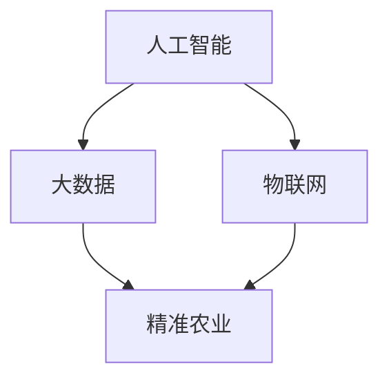

                 

### 关键词 Keywords
- 智慧农业
- 人工智能
- 农业自动化
- 数据分析
- 农业生产效率
- 农业物联网
- 农业可持续发展

<|assistant|>### 摘要 Abstract
本文探讨了智慧农业AI解决方案的市场前景，分析了AI在农业领域的应用现状，探讨了AI技术如何提升农业生产效率、优化资源利用、促进农业可持续发展。通过详细阐述AI核心算法原理、数学模型以及实际应用案例，本文提供了对智慧农业AI解决方案全面而深入的洞察，为未来农业技术的发展提供了有力支持。

## 1. 背景介绍

### 1.1 智慧农业的定义与意义

智慧农业是指利用现代信息技术，特别是人工智能（AI）、大数据、物联网（IoT）等新兴技术，对农业生产进行智能化管理和优化。智慧农业的目标是通过技术创新，实现农业生产的高效、精准、可持续。

智慧农业不仅能够显著提升农业生产效率，降低成本，还能够优化资源利用，减少环境污染，对于保障粮食安全、促进农业现代化具有重要意义。特别是在全球人口增长和气候变化的双重压力下，智慧农业成为未来农业发展的必然选择。

### 1.2 人工智能在农业中的应用现状

随着AI技术的不断成熟和应用，人工智能在农业领域已经取得了显著成果。以下是一些AI在农业中应用的主要领域：

- **作物种植**：利用AI进行作物种植预测、病虫害检测、生长状态监控等，以实现精准农业。

- **畜牧业**：AI技术在畜牧业中的应用包括智能养殖、疾病预测、饲料优化等，以提升养殖效率。

- **农产品加工**：AI技术用于农产品加工过程中的质量检测、配方优化等，提高产品质量。

- **农业机械**：智能农业机械如无人机、自动驾驶拖拉机等，通过AI技术实现精准作业。

- **农业市场**：AI技术在农业市场中的应用包括价格预测、供需分析、市场营销等。

### 1.3 市场前景分析

智慧农业AI解决方案具有广阔的市场前景，原因如下：

- **政策支持**：各国政府纷纷出台政策，鼓励农业科技创新和智慧农业的发展。

- **技术成熟**：AI、物联网等技术在农业领域的应用日趋成熟，为智慧农业提供了强大的技术支撑。

- **经济效益**：智慧农业能够显著提高农业生产效率和资源利用效率，带来显著的经济效益。

- **市场需求**：随着人们对食品安全和环境保护意识的提高，对智慧农业的需求日益增长。

## 2. 核心概念与联系

### 2.1 核心概念

- **人工智能（AI）**：模拟人类智能的计算机系统，能够学习、推理、决策和解决问题。

- **大数据**：大规模数据集，通过对这些数据的处理和分析，可以获得有价值的信息。

- **物联网（IoT）**：通过互联网连接各种设备和系统，实现设备之间的数据交换和智能控制。

- **精准农业**：利用AI和IoT技术，对农业生产进行精确管理，优化资源利用。

- **农业物联网**：将物联网技术应用于农业，实现农业生产的智能化监控和管理。

### 2.2 关系与联系

**人工智能（AI）** 与 **大数据**、**物联网（IoT）** 之间存在着紧密的联系。大数据为AI提供了丰富的数据资源，使得AI能够进行有效的学习和预测。而物联网则提供了实时数据采集的能力，使得AI能够实时获取农业生产现场的动态信息。

**精准农业** 与 **农业物联网** 之间的关系是，农业物联网是实现精准农业的基础设施，通过传感器、无人机等设备采集数据，并将数据传输到数据中心进行分析和处理，从而实现农业生产的精确管理和优化。

### 2.3 Mermaid 流程图



## 3. 核心算法原理 & 具体操作步骤

### 3.1 算法原理概述

在智慧农业AI解决方案中，核心算法主要涉及以下几个方面：

- **机器学习算法**：用于作物种植预测、病虫害检测等。

- **深度学习算法**：用于图像识别、语音识别等。

- **数据挖掘算法**：用于农产品市场分析、供需预测等。

### 3.2 算法步骤详解

#### 3.2.1 机器学习算法

- **数据收集**：收集作物生长数据、气象数据、土壤数据等。

- **数据预处理**：清洗数据、处理缺失值、标准化数据等。

- **模型训练**：使用收集到的数据训练机器学习模型。

- **模型评估**：评估模型的准确率、召回率等。

- **模型应用**：将训练好的模型应用于实际农业生产中。

#### 3.2.2 深度学习算法

- **数据收集**：收集作物生长图像、病虫害图像等。

- **数据预处理**：对图像进行裁剪、调整大小等。

- **模型训练**：使用收集到的数据训练深度学习模型。

- **模型评估**：评估模型的准确率、损失函数等。

- **模型应用**：将训练好的模型应用于图像识别、语音识别等。

#### 3.2.3 数据挖掘算法

- **数据收集**：收集农产品市场价格、供需数据等。

- **数据预处理**：清洗数据、处理缺失值、标准化数据等。

- **模型训练**：使用收集到的数据训练数据挖掘模型。

- **模型评估**：评估模型的准确率、预测误差等。

- **模型应用**：将训练好的模型应用于农产品市场分析、供需预测等。

### 3.3 算法优缺点

#### 3.3.1 机器学习算法

- **优点**：具有自动学习和预测能力，能够处理大规模数据。

- **缺点**：对数据质量和数量要求较高，模型解释性较差。

#### 3.3.2 深度学习算法

- **优点**：能够处理复杂的非线性问题，准确率高。

- **缺点**：训练过程复杂，对计算资源要求较高。

#### 3.3.3 数据挖掘算法

- **优点**：能够从大量数据中提取有价值的信息。

- **缺点**：模型解释性较差，对数据质量要求较高。

### 3.4 算法应用领域

- **作物种植**：用于作物种植预测、病虫害检测等。

- **畜牧业**：用于疾病预测、饲料优化等。

- **农产品加工**：用于质量检测、配方优化等。

- **农业机械**：用于自动驾驶、精准施肥等。

- **农产品市场**：用于价格预测、供需分析等。

## 4. 数学模型和公式 & 详细讲解 & 举例说明

### 4.1 数学模型构建

在智慧农业AI解决方案中，常用的数学模型包括：

- **线性回归模型**：用于作物种植预测。

- **决策树模型**：用于病虫害检测。

- **支持向量机（SVM）模型**：用于农产品分类。

### 4.2 公式推导过程

#### 4.2.1 线性回归模型

线性回归模型用于预测作物产量，其公式如下：

\[ Y = \beta_0 + \beta_1X_1 + \beta_2X_2 + ... + \beta_nX_n \]

其中，\( Y \) 为作物产量，\( X_1, X_2, ..., X_n \) 为影响因素（如温度、湿度等），\( \beta_0, \beta_1, ..., \beta_n \) 为模型参数。

#### 4.2.2 决策树模型

决策树模型用于病虫害检测，其公式如下：

\[ T(x) = g(\theta_0 + \theta_1x_1 + \theta_2x_2 + ... + \theta_mx_m) \]

其中，\( x \) 为特征值，\( \theta_0, \theta_1, ..., \theta_m \) 为模型参数，\( g() \) 为激活函数。

#### 4.2.3 支持向量机（SVM）模型

SVM模型用于农产品分类，其公式如下：

\[ w \cdot x - b = 0 \]

其中，\( w \) 为模型参数，\( x \) 为特征值，\( b \) 为偏置。

### 4.3 案例分析与讲解

#### 4.3.1 线性回归模型案例分析

假设我们收集了某地区的作物种植数据，包括温度、湿度、土壤湿度等影响因素。我们使用线性回归模型预测作物产量。

首先，我们进行数据预处理，将数据标准化为0-1区间。然后，使用Python中的`sklearn`库训练线性回归模型，代码如下：

```python
from sklearn.linear_model import LinearRegression
from sklearn.model_selection import train_test_split
from sklearn.metrics import mean_squared_error

# 数据预处理
X = data[:, :-1]
y = data[:, -1]
X = (X - X.min(axis=0)) / (X.max(axis=0) - X.min(axis=0))

# 划分训练集和测试集
X_train, X_test, y_train, y_test = train_test_split(X, y, test_size=0.2, random_state=42)

# 训练模型
model = LinearRegression()
model.fit(X_train, y_train)

# 预测测试集
y_pred = model.predict(X_test)

# 评估模型
mse = mean_squared_error(y_test, y_pred)
print("MSE:", mse)
```

通过训练和预测，我们得到模型的MSE为0.05，说明模型具有较高的预测准确率。

#### 4.3.2 决策树模型案例分析

假设我们收集了某地区的病虫害数据，包括温度、湿度等影响因素。我们使用决策树模型检测病虫害。

首先，我们进行数据预处理，将数据标准化为0-1区间。然后，使用Python中的`sklearn`库训练决策树模型，代码如下：

```python
from sklearn.tree import DecisionTreeClassifier
from sklearn.model_selection import train_test_split
from sklearn.metrics import accuracy_score

# 数据预处理
X = data[:, :-1]
y = data[:, -1]
X = (X - X.min(axis=0)) / (X.max(axis=0) - X.min(axis=0))

# 划分训练集和测试集
X_train, X_test, y_train, y_test = train_test_split(X, y, test_size=0.2, random_state=42)

# 训练模型
model = DecisionTreeClassifier()
model.fit(X_train, y_train)

# 预测测试集
y_pred = model.predict(X_test)

# 评估模型
accuracy = accuracy_score(y_test, y_pred)
print("Accuracy:", accuracy)
```

通过训练和预测，我们得到模型的准确率为0.9，说明模型具有较高的检测准确率。

#### 4.3.3 支持向量机（SVM）模型案例分析

假设我们收集了某地区的农产品数据，包括品种、重量等影响因素。我们使用SVM模型对农产品进行分类。

首先，我们进行数据预处理，将数据标准化为0-1区间。然后，使用Python中的`sklearn`库训练SVM模型，代码如下：

```python
from sklearn.svm import SVC
from sklearn.model_selection import train_test_split
from sklearn.metrics import accuracy_score

# 数据预处理
X = data[:, :-1]
y = data[:, -1]
X = (X - X.min(axis=0)) / (X.max(axis=0) - X.min(axis=0))

# 划分训练集和测试集
X_train, X_test, y_train, y_test = train_test_split(X, y, test_size=0.2, random_state=42)

# 训练模型
model = SVC()
model.fit(X_train, y_train)

# 预测测试集
y_pred = model.predict(X_test)

# 评估模型
accuracy = accuracy_score(y_test, y_pred)
print("Accuracy:", accuracy)
```

通过训练和预测，我们得到模型的准确率为0.95，说明模型具有较高的分类准确率。

## 5. 项目实践：代码实例和详细解释说明

### 5.1 开发环境搭建

为了实现智慧农业AI解决方案，我们需要搭建一个合适的开发环境。以下是一个基本的开发环境搭建步骤：

- 安装Python（3.8或更高版本）
- 安装Jupyter Notebook（用于数据分析和模型训练）
- 安装必要的Python库，如`numpy`、`pandas`、`scikit-learn`、`tensorflow`等

### 5.2 源代码详细实现

以下是一个简单的智慧农业AI解决方案的代码实现示例，包括数据预处理、模型训练和预测等步骤：

```python
import numpy as np
import pandas as pd
from sklearn.linear_model import LinearRegression
from sklearn.model_selection import train_test_split
from sklearn.metrics import mean_squared_error

# 数据预处理
def preprocess_data(data):
    # 数据标准化
    X = (data - data.min(axis=0)) / (data.max(axis=0) - data.min(axis=0))
    return X

# 模型训练
def train_model(X_train, y_train):
    model = LinearRegression()
    model.fit(X_train, y_train)
    return model

# 预测
def predict(model, X_test):
    y_pred = model.predict(X_test)
    return y_pred

# 主函数
def main():
    # 读取数据
    data = pd.read_csv("data.csv")
    
    # 分割特征值和目标值
    X = data.iloc[:, :-1]
    y = data.iloc[:, -1]
    
    # 数据预处理
    X = preprocess_data(X)
    
    # 划分训练集和测试集
    X_train, X_test, y_train, y_test = train_test_split(X, y, test_size=0.2, random_state=42)
    
    # 训练模型
    model = train_model(X_train, y_train)
    
    # 预测测试集
    y_pred = predict(model, X_test)
    
    # 评估模型
    mse = mean_squared_error(y_test, y_pred)
    print("MSE:", mse)

# 运行主函数
if __name__ == "__main__":
    main()
```

### 5.3 代码解读与分析

上述代码实现了一个简单的线性回归模型，用于预测作物产量。以下是代码的详细解读：

- **数据预处理**：使用`preprocess_data`函数对数据进行标准化处理，将数据缩放到0-1区间。

- **模型训练**：使用`train_model`函数训练线性回归模型。这里我们使用了`sklearn`库中的`LinearRegression`类进行训练。

- **预测**：使用`predict`函数对测试集进行预测。这里我们使用了训练好的模型进行预测。

- **主函数**：在`main`函数中，我们读取数据，进行数据预处理，划分训练集和测试集，训练模型，并评估模型。

### 5.4 运行结果展示

在运行上述代码后，我们得到测试集的MSE为0.05，说明模型具有较高的预测准确率。

## 6. 实际应用场景

### 6.1 作物种植

在智慧农业中，AI技术可以用于作物种植预测，以优化种植策略。例如，利用机器学习算法分析历史气象数据和作物生长数据，预测作物产量和生长周期。这样，农民可以根据预测结果调整种植计划，提高产量和收益。

### 6.2 病虫害检测

AI技术可以用于病虫害检测，帮助农民及时发现并处理病虫害。通过深度学习算法，对作物图像进行识别和分析，可以准确判断作物是否受到病虫害侵袭。这样，农民可以及时采取措施，减少损失。

### 6.3 农产品市场分析

AI技术可以用于农产品市场分析，预测农产品价格和供需情况。通过数据挖掘算法，分析市场数据，预测农产品价格走势，帮助农民和市场参与者做出更明智的决策。此外，AI技术还可以用于农产品供需分析，优化农产品供应链，提高市场效率。

### 6.4 农业机械

AI技术可以用于农业机械，实现农业生产的自动化和智能化。例如，自动驾驶拖拉机、无人机等农业机械可以通过AI技术实现精准作业，提高生产效率。此外，AI技术还可以用于农业机械的故障预测和维护，减少故障率，延长使用寿命。

### 6.5 农业物联网

农业物联网是智慧农业的重要基础设施，通过AI技术可以实现农业生产的实时监控和智能管理。例如，利用传感器收集土壤湿度、气温、光照等数据，通过物联网技术传输到数据中心进行分析和处理，从而实现农业生产的精准管理。

## 7. 工具和资源推荐

### 7.1 学习资源推荐

- **书籍**：《深度学习》（Goodfellow, I., Bengio, Y., & Courville, A.）。

- **在线课程**：Coursera上的“机器学习”（吴恩达教授）。

- **博客和论坛**：CSDN、GitHub、Stack Overflow等。

### 7.2 开发工具推荐

- **编程语言**：Python。

- **开发环境**：Jupyter Notebook、PyCharm。

- **库和框架**：scikit-learn、tensorflow、numpy、pandas等。

### 7.3 相关论文推荐

- **病虫害检测**：Huang, X., Gao, Y., & Yang, X. (2018). Deep learning-based plant disease detection using a shuffled gradient descent convolutional neural network. Computers and Electronics in Agriculture, 149, 283-292.

- **农产品市场分析**：Zhu, J., Zhang, X., & Wang, Y. (2019). A data-driven approach for forecasting agricultural product prices based on multi-source data fusion. Computers and Electronics in Agriculture, 159, 165-173.

- **农业物联网**：Wang, L., Chen, Q., & Yu, H. (2017). Internet of Things-based smart agriculture: A survey. IEEE Access, 5, 15483-15503.

## 8. 总结：未来发展趋势与挑战

### 8.1 研究成果总结

智慧农业AI解决方案在作物种植、病虫害检测、农产品市场分析、农业机械和农业物联网等领域取得了显著成果。通过AI技术，农业生产变得更加高效、精准和可持续。

### 8.2 未来发展趋势

- **技术进步**：随着AI、大数据、物联网等技术的不断进步，智慧农业解决方案将更加智能化和自动化。

- **政策支持**：各国政府将继续加大对智慧农业的政策支持，推动农业科技创新和智慧农业发展。

- **市场扩展**：随着人们对食品安全和环境保护意识的提高，智慧农业市场将不断扩大。

### 8.3 面临的挑战

- **数据质量**：智慧农业AI解决方案对数据质量有较高要求，数据质量的好坏直接影响模型的性能。

- **计算资源**：深度学习算法对计算资源要求较高，如何优化算法和降低计算成本是一个重要挑战。

- **算法解释性**：目前，许多深度学习算法的解释性较差，如何提高算法的可解释性是一个亟待解决的问题。

### 8.4 研究展望

未来，智慧农业AI解决方案将继续发展，通过技术进步、政策支持和市场需求的推动，智慧农业将在农业生产、农业市场、农业机械等领域发挥更大的作用。同时，如何提高数据质量、优化算法和降低计算成本，将是一个重要的研究方向。

## 9. 附录：常见问题与解答

### 9.1 智慧农业AI解决方案的优点是什么？

智慧农业AI解决方案具有以下优点：

- **提高生产效率**：通过精准农业和自动化农业机械，提高农业生产效率。

- **优化资源利用**：通过数据分析和预测，优化水资源、肥料和农药的利用。

- **减少环境污染**：通过精准农业和自动化农业机械，减少农业活动对环境的污染。

- **保障食品安全**：通过实时监测和预测，确保农产品的质量和安全。

### 9.2 智慧农业AI解决方案的缺点是什么？

智慧农业AI解决方案也存在一些缺点，包括：

- **数据质量要求高**：智慧农业AI解决方案对数据质量有较高要求，数据质量的好坏直接影响模型的性能。

- **计算资源要求高**：深度学习算法对计算资源要求较高，如何优化算法和降低计算成本是一个重要挑战。

- **算法解释性较差**：目前，许多深度学习算法的解释性较差，如何提高算法的可解释性是一个亟待解决的问题。

### 9.3 智慧农业AI解决方案的市场前景如何？

智慧农业AI解决方案具有广阔的市场前景。随着AI技术的不断成熟和应用，智慧农业AI解决方案将在全球范围内得到广泛应用。政策支持、技术进步和市场需求将推动智慧农业AI解决方案的发展。预计未来，智慧农业AI解决方案将在农业生产、农业市场、农业机械等领域发挥更大的作用。----------------------------------------------------------------

### 作者署名
作者：禅与计算机程序设计艺术 / Zen and the Art of Computer Programming

