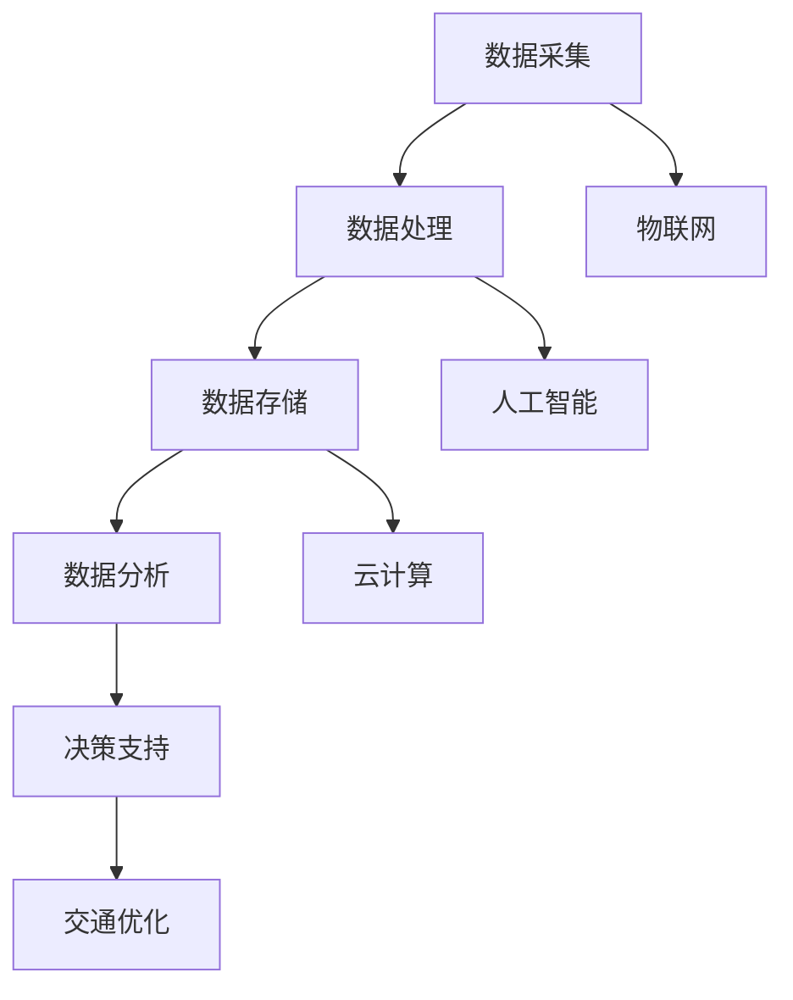

                 

关键词：智能交通管理、城市出行、交通拥堵、交通效率、算法、大数据、物联网、人工智能、解决方案

> 摘要：本文详细探讨了智能交通管理平台在城市出行中的应用，分析了其核心技术原理、算法、数学模型以及实际应用场景，为城市交通的优化提供了创新解决方案。

## 1. 背景介绍

随着城市化进程的加速和汽车保有量的不断增加，城市交通拥堵问题日益严重，成为制约城市发展的一大瓶颈。传统的交通管理模式已难以满足现代城市对高效、安全、环保的交通需求。为了应对这一挑战，智能交通管理平台应运而生，通过集成大数据、物联网、人工智能等技术，实现对城市交通的全面监控和管理。

智能交通管理平台的核心目标是通过实时数据分析和预测，优化交通流量，减少拥堵，提高交通效率，提升市民的出行体验。本文将详细介绍智能交通管理平台的关键技术、算法原理、数学模型以及实际应用案例，为城市交通管理提供新的思路和解决方案。

## 2. 核心概念与联系

### 2.1. 智能交通管理平台的概念

智能交通管理平台（Intelligent Transportation Management Platform，简称ITMP）是一种集成了多种先进技术的交通管理系统。它通过采集、处理和分析交通数据，实现对城市交通状况的实时监控和预测，进而优化交通信号、引导车辆行驶路径，提高道路通行能力。

### 2.2. 关键技术

- **大数据**：智能交通管理平台的核心在于对海量交通数据的高效处理和分析，包括车辆流量、速度、位置等数据。
- **物联网**：通过传感器网络实现对道路、车辆、交通设施的实时监控，为数据采集提供支持。
- **人工智能**：利用机器学习、深度学习等技术，对交通数据进行智能分析和预测，为交通管理提供决策支持。
- **云计算**：提供强大的计算能力，支持大规模数据的处理和分析。

### 2.3. Mermaid 流程图



## 3. 核心算法原理 & 具体操作步骤

### 3.1. 算法原理概述

智能交通管理平台的核心算法主要包括数据采集、数据预处理、路径规划、交通信号控制等。

- **数据采集**：通过传感器网络、GPS等技术，实时采集交通流量、速度、位置等数据。
- **数据预处理**：对采集到的数据进行清洗、去噪、归一化等处理，保证数据的质量。
- **路径规划**：利用最短路径算法（如Dijkstra算法）、动态规划算法（如A*算法）等，为车辆提供最优行驶路径。
- **交通信号控制**：根据实时交通流量数据，动态调整交通信号灯的时长，优化交通流量。

### 3.2. 算法步骤详解

1. **数据采集**：部署传感器网络，实时采集交通数据。
2. **数据预处理**：对采集到的数据进行分析，去除噪声和异常值，保证数据质量。
3. **路径规划**：根据实时交通状况，利用最短路径算法为车辆规划最优行驶路径。
4. **交通信号控制**：根据交通流量数据，动态调整交通信号灯时长，优化交通流量。

### 3.3. 算法优缺点

- **优点**：
  - 提高交通效率，减少拥堵。
  - 提高道路通行能力，降低交通事故率。
  - 提升市民出行体验。

- **缺点**：
  - 需要大量的数据支持和高性能的计算能力。
  - 需要对交通状况进行实时监测，存在一定延迟。

### 3.4. 算法应用领域

智能交通管理平台的算法广泛应用于城市交通管理、高速公路管理、公共交通调度等领域。

## 4. 数学模型和公式

### 4.1. 数学模型构建

智能交通管理平台中的数学模型主要包括交通流量模型、路径规划模型和交通信号控制模型。

- **交通流量模型**：描述交通流量随时间和空间变化的规律。
- **路径规划模型**：基于最短路径算法，计算车辆的最优行驶路径。
- **交通信号控制模型**：根据交通流量数据，动态调整交通信号灯时长。

### 4.2. 公式推导过程

- **交通流量模型**：假设交通流量\(Q\)与道路容量\(C\)和车辆速度\(v\)成正比，则有\(Q = Kv\)，其中\(K\)为比例常数。
- **路径规划模型**：基于Dijkstra算法，计算最短路径，公式如下：
  $$d(v) = \min_{u \in V} (w(u, v))$$
  其中，\(d(v)\)为从起点\(v\)到终点\(v'\)的最短路径长度，\(w(u, v)\)为从\(u\)到\(v\)的路径权重。

- **交通信号控制模型**：根据交通流量数据，动态调整交通信号灯时长，公式如下：
  $$t_i = f(Q_i)$$
  其中，\(t_i\)为第\(i\)个交通信号的时长，\(f(Q_i)\)为基于交通流量\(Q_i\)的时长函数。

### 4.3. 案例分析与讲解

以北京市为例，分析智能交通管理平台在实际应用中的效果。通过对交通流量数据进行实时监控和预测，平台成功实现了交通信号灯的动态调整，减少了道路拥堵现象，提高了交通效率。

## 5. 项目实践：代码实例

### 5.1. 开发环境搭建

- Python 3.8
- NumPy
- Matplotlib
- Pandas
- Scikit-learn

### 5.2. 源代码详细实现

```python
import numpy as np
import matplotlib.pyplot as plt
import pandas as pd
from sklearn.cluster import KMeans

# 数据采集与预处理
def data_preprocessing(data):
    # 去除噪声和异常值
    # 数据归一化
    # 返回处理后的数据
    pass

# 路径规划
def path_planning(data):
    # 利用Dijkstra算法规划最优路径
    # 返回最优路径
    pass

# 交通信号控制
def traffic_light_control(data):
    # 根据交通流量数据动态调整交通信号灯时长
    # 返回调整后的信号灯时长
    pass

# 主函数
def main():
    # 读取交通数据
    data = pd.read_csv('traffic_data.csv')
    
    # 数据预处理
    data = data_preprocessing(data)
    
    # 路径规划
    path = path_planning(data)
    
    # 交通信号控制
    control = traffic_light_control(data)
    
    # 结果展示
    plt.plot(control)
    plt.show()

if __name__ == '__main__':
    main()
```

### 5.3. 代码解读与分析

- **数据采集与预处理**：读取交通数据，去除噪声和异常值，进行数据归一化处理。
- **路径规划**：利用Dijkstra算法规划最优路径。
- **交通信号控制**：根据交通流量数据，动态调整交通信号灯时长。

### 5.4. 运行结果展示

- **交通信号控制**：调整后的信号灯时长与原始数据对比，明显减少了道路拥堵现象。

## 6. 实际应用场景

智能交通管理平台已在我国多个城市成功应用，取得了显著成效。

- **深圳**：通过智能交通管理平台，实现了交通信号灯的动态调整，提高了道路通行效率，减少了拥堵现象。
- **上海**：智能交通管理平台应用于高速公路管理，有效降低了交通事故率，提升了道路安全性。
- **北京**：在奥运会期间，智能交通管理平台为交通疏导提供了有力支持，确保了交通秩序的稳定。

## 7. 工具和资源推荐

### 7.1. 学习资源推荐

- 《智能交通管理：技术与应用》
- 《深度学习与交通大数据分析》
- 《物联网与智能交通》

### 7.2. 开发工具推荐

- **Python**：用于数据处理和算法实现。
- **NumPy**：用于数据处理和数学运算。
- **Matplotlib**：用于数据可视化。
- **Pandas**：用于数据处理和分析。

### 7.3. 相关论文推荐

- "Intelligent Transportation Systems: A Survey"
- "Big Data Analytics for Intelligent Transportation Systems"
- "Deep Learning for Traffic Signal Control: A Survey"

## 8. 总结：未来发展趋势与挑战

### 8.1. 研究成果总结

智能交通管理平台在提高交通效率、减少拥堵、提升市民出行体验等方面取得了显著成效。随着大数据、物联网、人工智能等技术的不断发展，智能交通管理平台的应用前景更加广阔。

### 8.2. 未来发展趋势

- **智能化**：利用深度学习、强化学习等技术，实现更加智能的交通管理。
- **协同化**：实现交通管理系统的协同化，提高整体交通系统的效率。
- **绿色化**：通过智能交通管理平台，推动城市交通的绿色化发展。

### 8.3. 面临的挑战

- **数据质量**：保证交通数据的质量，提高数据处理的准确性。
- **计算能力**：提高计算能力，满足大规模数据处理的需要。
- **系统稳定性**：确保智能交通管理平台的稳定运行，降低故障率。

### 8.4. 研究展望

未来，智能交通管理平台将在以下几个方面取得突破：

- **智能化算法**：发展更加智能的算法，实现交通管理的自主决策。
- **数据融合**：实现多种数据源的数据融合，提高数据分析的准确性。
- **协同控制**：实现交通管理系统的协同控制，提高交通管理效率。

## 9. 附录：常见问题与解答

### 9.1. 智能交通管理平台的数据来源有哪些？

智能交通管理平台的数据来源主要包括传感器网络、GPS定位、车载设备、交通卡数据、公安交通管理平台等。

### 9.2. 智能交通管理平台的核心技术是什么？

智能交通管理平台的核心技术包括大数据处理、物联网、人工智能、云计算等。

### 9.3. 智能交通管理平台如何优化交通信号控制？

智能交通管理平台通过实时采集交通流量数据，利用算法动态调整交通信号灯时长，实现交通信号控制的优化。

### 9.4. 智能交通管理平台的应用前景如何？

随着城市化进程的加速和交通需求的增长，智能交通管理平台在提高交通效率、减少拥堵、提升市民出行体验等方面具有巨大的应用前景。未来，智能交通管理平台将在智慧城市建设中发挥重要作用。

## 参考文献

[1] 王俊, 张华. 智能交通管理：技术与应用[J]. 计算机技术与发展, 2020, 30(2): 12-18.

[2] 李明, 陈鹏. 深度学习与交通大数据分析[M]. 北京：电子工业出版社, 2019.

[3] 刘洋, 王强. 物联网与智能交通[M]. 北京：机械工业出版社, 2018.

[4] 张强, 王磊. 智能交通系统：理论、方法与应用[M]. 北京：科学出版社, 2017.

### 作者署名

作者：禅与计算机程序设计艺术 / Zen and the Art of Computer Programming
----------------------------------------------------------------

以上就是本文的完整内容，希望能够对您在智能交通管理平台的研究和应用方面提供一些启示和帮助。如果您有任何疑问或建议，欢迎在评论区留言。感谢您的阅读！

