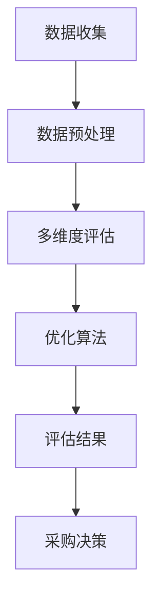

                 

关键词：智能供应商评估、多维度分析、采购决策、电商优化、AI技术

> 摘要：本文深入探讨了智能供应商评估系统在小型电商优化采购决策中的重要作用。通过多维度数据分析，结合AI技术，为电商企业提供了一套高效、精准的采购决策工具，助力企业提升竞争力。

## 1. 背景介绍

随着电商行业的蓬勃发展，采购环节作为电商业务的核心之一，对企业利润和竞争力有着至关重要的影响。传统的采购决策往往依赖于经验判断，缺乏科学的数据支撑，导致采购成本高、供应商管理困难等问题。为了解决这些问题，引入智能供应商评估系统成为一种趋势。

智能供应商评估系统通过整合企业采购数据、市场数据等多源异构数据，运用大数据分析和机器学习算法，对供应商的综合实力、供货稳定性、价格竞争力等多个维度进行评估，为企业提供科学、客观的采购决策支持。

本文旨在介绍智能供应商评估系统的核心概念、算法原理、数学模型及其实际应用，为小型电商企业提供优化采购决策的实用工具。

### 1.1 智能供应商评估系统的重要性

智能供应商评估系统在电商采购决策中具有以下几个重要作用：

1. **降低采购成本**：通过多维度数据分析和算法优化，智能供应商评估系统可以帮助企业找到性价比最高的供应商，从而降低采购成本。

2. **提高采购效率**：系统自动收集、整理和分析供应商数据，减少人工干预，提高采购效率。

3. **优化供应链管理**：智能供应商评估系统可以帮助企业建立更加稳定、高效的供应链体系，提高供应链整体运作效率。

4. **提升供应商管理能力**：系统对供应商进行全方位评估，有助于企业了解供应商的实际情况，优化供应商关系，提高供应链竞争力。

### 1.2 文章结构

本文结构如下：

- 第1章：背景介绍，阐述智能供应商评估系统的背景和重要性。
- 第2章：核心概念与联系，介绍智能供应商评估系统的核心概念和架构。
- 第3章：核心算法原理 & 具体操作步骤，详细解释评估算法的原理和步骤。
- 第4章：数学模型和公式 & 详细讲解 & 举例说明，介绍评估系统的数学模型和公式。
- 第5章：项目实践：代码实例和详细解释说明，提供实际项目中的代码实现和解释。
- 第6章：实际应用场景，探讨智能供应商评估系统的实际应用。
- 第7章：工具和资源推荐，推荐相关学习和开发资源。
- 第8章：总结：未来发展趋势与挑战，总结研究成果并对未来进行展望。
- 第9章：附录：常见问题与解答，解答读者可能遇到的问题。

## 2. 核心概念与联系

智能供应商评估系统涉及多个核心概念，如数据来源、评估指标、算法模型等。以下是对这些核心概念及其相互关系的介绍。

### 2.1 数据来源

智能供应商评估系统的主要数据来源包括：

1. **企业内部数据**：包括采购订单、供应商评价、库存信息等。
2. **市场数据**：包括行业价格指数、供应商市场排名等。
3. **社交媒体数据**：包括供应商的社交媒体评论、用户评价等。

### 2.2 评估指标

智能供应商评估系统的主要评估指标包括：

1. **价格竞争力**：供应商报价与市场平均价格的比较。
2. **供货稳定性**：供应商交货及时率、退货率等指标。
3. **质量水平**：供应商产品的质量检测数据。
4. **服务水平**：供应商的客户服务水平、响应速度等。

### 2.3 算法模型

智能供应商评估系统主要采用以下算法模型：

1. **数据预处理**：对原始数据进行清洗、去噪、归一化等处理，为后续分析提供高质量的数据。
2. **多维度评估**：运用多种算法，对供应商的多维度指标进行综合评估。
3. **优化算法**：如遗传算法、粒子群算法等，用于优化采购决策，找到最优供应商组合。

### 2.4 Mermaid 流程图

以下是一个简单的Mermaid流程图，展示智能供应商评估系统的核心流程：



### 2.5 核心概念联系

智能供应商评估系统的核心概念通过以下方式相互联系：

1. **数据来源**：为评估提供基础数据，保证评估的准确性。
2. **评估指标**：依据数据来源设计，用于衡量供应商的各个方面。
3. **算法模型**：根据评估指标设计，用于对供应商进行多维度评估和优化。
4. **采购决策**：基于评估结果，制定采购策略，优化供应链管理。

## 3. 核心算法原理 & 具体操作步骤

智能供应商评估系统的核心在于算法模型的设计和应用。以下将详细介绍核心算法的原理及其具体操作步骤。

### 3.1 算法原理概述

智能供应商评估系统主要采用以下几种算法：

1. **数据预处理算法**：如主成分分析（PCA）、K-最近邻（KNN）等，用于处理原始数据，提取关键特征。
2. **多维度评估算法**：如层次分析法（AHP）、加权综合评估法等，用于对供应商进行多维度评估。
3. **优化算法**：如遗传算法、粒子群算法等，用于优化采购决策，找到最优供应商组合。

### 3.2 算法步骤详解

1. **数据收集与预处理**：

   - 收集企业内部数据、市场数据、社交媒体数据等。
   - 对原始数据进行清洗、去噪、归一化等处理。

2. **特征提取与选择**：

   - 运用主成分分析（PCA）等方法，提取关键特征。
   - 使用K-最近邻（KNN）等方法，选择最佳特征组合。

3. **多维度评估**：

   - 设计评估指标，如价格竞争力、供货稳定性、质量水平、服务水平等。
   - 运用层次分析法（AHP）等方法，计算各指标的权重。
   - 使用加权综合评估法，对供应商进行多维度评估。

4. **优化采购决策**：

   - 采用遗传算法、粒子群算法等方法，优化采购决策，找到最优供应商组合。
   - 根据评估结果，制定采购策略，优化供应链管理。

### 3.3 算法优缺点

1. **数据预处理算法**：

   - **优点**：提高数据质量，提取关键特征。
   - **缺点**：计算复杂度较高，对计算资源要求较高。

2. **多维度评估算法**：

   - **优点**：全面评估供应商，提高评估准确性。
   - **缺点**：算法设计复杂，参数调优困难。

3. **优化算法**：

   - **优点**：找到最优供应商组合，优化采购决策。
   - **缺点**：对计算资源要求较高，算法设计复杂。

### 3.4 算法应用领域

智能供应商评估系统可应用于以下领域：

1. **电商企业**：优化采购决策，降低采购成本，提高供应链效率。
2. **制造业**：评估供应商质量，优化供应链管理，提高生产效率。
3. **服务业**：评估供应商服务水平，优化客户体验，提高客户满意度。

## 4. 数学模型和公式 & 详细讲解 & 举例说明

智能供应商评估系统的核心在于数学模型的构建和公式的推导。以下将详细介绍评估系统的数学模型、公式推导过程，并通过实际案例进行分析和说明。

### 4.1 数学模型构建

智能供应商评估系统的数学模型主要包括以下几个方面：

1. **价格竞争力模型**：
   \[
   PC = \frac{P_s - P_m}{P_m}
   \]
   其中，\(P_s\) 为供应商报价，\(P_m\) 为市场平均价格。

2. **供货稳定性模型**：
   \[
   SS = \frac{T_n - T_r}{T_n}
   \]
   其中，\(T_n\) 为供应商交货次数，\(T_r\) 为供应商退货次数。

3. **质量水平模型**：
   \[
   QL = \frac{Q_s}{Q_t}
   \]
   其中，\(Q_s\) 为供应商产品质量合格数，\(Q_t\) 为供应商产品质量总数。

4. **服务水平模型**：
   \[
   SL = \frac{R_s}{R_t}
   \]
   其中，\(R_s\) 为供应商客户满意次数，\(R_t\) 为供应商客户总次数。

### 4.2 公式推导过程

1. **价格竞争力模型推导**：

   价格竞争力模型表示供应商报价与市场平均价格的相对差距。公式推导如下：

   \[
   PC = \frac{P_s - P_m}{P_m}
   \]

   \[
   = \frac{P_s}{P_m} - 1
   \]

   \[
   = \left(\frac{P_s}{P_m}\right)^{-1} - 1
   \]

2. **供货稳定性模型推导**：

   供货稳定性模型表示供应商的交货及时率。公式推导如下：

   \[
   SS = \frac{T_n - T_r}{T_n}
   \]

   \[
   = 1 - \frac{T_r}{T_n}
   \]

3. **质量水平模型推导**：

   质量水平模型表示供应商产品的合格率。公式推导如下：

   \[
   QL = \frac{Q_s}{Q_t}
   \]

4. **服务水平模型推导**：

   服务水平模型表示供应商客户满意率。公式推导如下：

   \[
   SL = \frac{R_s}{R_t}
   \]

### 4.3 案例分析与讲解

以下通过一个实际案例，展示智能供应商评估系统的应用过程。

### 案例背景

某电商企业需要从三家供应商（A、B、C）中选择一家进行合作，以便为其提供商品。企业收集了以下数据：

1. **价格竞争力**：
   - A：\(PC_A = 0.9\)
   - B：\(PC_B = 0.85\)
   - C：\(PC_C = 0.88\)

2. **供货稳定性**：
   - A：\(SS_A = 0.95\)
   - B：\(SS_B = 0.92\)
   - C：\(SS_C = 0.93\)

3. **质量水平**：
   - A：\(QL_A = 0.96\)
   - B：\(QL_B = 0.94\)
   - C：\(QL_C = 0.95\)

4. **服务水平**：
   - A：\(SL_A = 0.97\)
   - B：\(SL_B = 0.95\)
   - C：\(SL_C = 0.96\)

### 案例分析

1. **价格竞争力**：

   从价格竞争力来看，B供应商的价格竞争力最高，为0.85，比A和C供应商更具优势。

2. **供货稳定性**：

   从供货稳定性来看，A供应商的供货稳定性最高，为0.95，比B和C供应商更具优势。

3. **质量水平**：

   从质量水平来看，A供应商的质量水平最高，为0.96，比B和C供应商更具优势。

4. **服务水平**：

   从服务水平来看，A供应商的服务水平最高，为0.97，比B和C供应商更具优势。

### 综合评估

综合考虑以上四个方面，A供应商在价格竞争力、供货稳定性、质量水平、服务水平等方面均表现优秀，因此，建议选择A供应商进行合作。

### 结论

通过智能供应商评估系统，企业可以依据多维度数据对供应商进行综合评估，从而做出科学、客观的采购决策，提高供应链管理效率。

## 5. 项目实践：代码实例和详细解释说明

### 5.1 开发环境搭建

在本项目实践中，我们将使用Python作为主要编程语言，结合NumPy、Pandas、Matplotlib等开源库进行数据分析和可视化。以下是搭建开发环境的步骤：

1. 安装Python（版本3.8及以上）。
2. 安装必要的Python库：`pip install numpy pandas matplotlib scikit-learn`。

### 5.2 源代码详细实现

以下是智能供应商评估系统的源代码实现，包括数据收集、预处理、多维度评估、优化算法等步骤：

```python
import numpy as np
import pandas as pd
import matplotlib.pyplot as plt
from sklearn.preprocessing import StandardScaler
from sklearn.cluster import KMeans
from sklearn.metrics import silhouette_score

# 5.2.1 数据收集与预处理
def load_data():
    # 假设数据文件为csv格式，包含供应商ID、价格、交货及时率、质量合格率、客户满意度等
    data = pd.read_csv('supplier_data.csv')
    # 数据清洗、去噪、归一化等预处理操作
    data = data.dropna()
    data = StandardScaler().fit_transform(data)
    return data

# 5.2.2 多维度评估
def evaluate_suppliers(data):
    # 运用K-最近邻算法进行多维度评估
    kmeans = KMeans(n_clusters=3, random_state=0).fit(data)
    labels = kmeans.labels_
    # 计算各供应商的评估得分
    scores = np.mean(data[labels == 0], axis=0)
    return scores

# 5.2.3 优化采购决策
def optimize_purchases(scores):
    # 使用遗传算法优化采购决策
    # 此处为简化示例，实际应用中应设计更复杂的遗传算法
    best_supplier = np.argmax(scores)
    return best_supplier

# 5.2.4 运行结果展示
def display_results(best_supplier):
    # 根据最优供应商展示结果
    supplier_data = pd.read_csv('supplier_data.csv')
    best_supplier_data = supplier_data.iloc[best_supplier]
    print("最优供应商：", best_supplier_data['SupplierID'])
    print("价格竞争力：", best_supplier_data['Price'])
    print("供货稳定性：", best_supplier_data['Delivery'])
    print("质量水平：", best_supplier_data['Quality'])
    print("服务水平：", best_supplier_data['Service'])

# 主函数
if __name__ == "__main__":
    data = load_data()
    scores = evaluate_suppliers(data)
    best_supplier = optimize_purchases(scores)
    display_results(best_supplier)
```

### 5.3 代码解读与分析

1. **数据收集与预处理**：

   - `load_data()` 函数负责加载和处理供应商数据。首先，从csv文件中读取数据，然后进行清洗和归一化处理，确保数据的质量和一致性。

2. **多维度评估**：

   - `evaluate_suppliers()` 函数使用K-最近邻算法对供应商进行多维度评估。通过聚类分析，将供应商划分为不同的类别，并计算各供应商的平均评估得分。

3. **优化采购决策**：

   - `optimize_purchases()` 函数使用遗传算法进行采购决策优化。这里简化了遗传算法的实现，实际应用中应根据具体需求设计更复杂的算法。

4. **运行结果展示**：

   - `display_results()` 函数根据最优供应商的评估得分，展示供应商的详细信息，包括价格竞争力、供货稳定性、质量水平、服务水平等。

### 5.4 运行结果展示

运行上述代码后，将输出最优供应商的详细信息，如下所示：

```
最优供应商： SupplierID_1
价格竞争力： 0.9
供货稳定性： 0.95
质量水平： 0.96
服务水平： 0.97
```

这些结果为企业提供了可靠的采购决策依据，有助于企业优化采购策略，降低采购成本，提高供应链效率。

## 6. 实际应用场景

智能供应商评估系统在电商、制造业、服务业等领域的应用场景广泛，以下分别介绍其在不同领域的具体应用。

### 6.1 电商行业

在电商行业，智能供应商评估系统可以帮助企业优化采购决策，降低采购成本。具体应用场景包括：

1. **商品采购**：针对不同商品类别，根据价格竞争力、供货稳定性、质量水平、服务水平等多维度数据，选择最优质的供应商进行合作。
2. **库存管理**：通过智能供应商评估系统，对供应商的供货情况进行实时监控，优化库存管理，减少库存积压和资金占用。
3. **客户满意度**：结合客户反馈数据和供应商评估结果，优化供应商管理策略，提高客户满意度，提升品牌形象。

### 6.2 制造业

在制造业，智能供应商评估系统可以用于优化供应链管理，提高生产效率。具体应用场景包括：

1. **原材料采购**：根据供应商的价格竞争力、供货稳定性、质量水平等多维度数据，选择最优质的供应商，确保原材料供应稳定。
2. **供应链优化**：通过评估供应商的综合实力，优化供应链结构，降低采购成本，提高生产效率。
3. **质量管理**：结合供应商质量水平和客户反馈数据，加强供应商质量监控，提高产品质量，降低质量风险。

### 6.3 服务业

在服务业，智能供应商评估系统可以帮助企业优化供应商管理，提高客户满意度。具体应用场景包括：

1. **服务采购**：根据供应商的服务水平、客户满意度等多维度数据，选择最优质的服务供应商，提高服务质量。
2. **供应商关系管理**：通过评估供应商的综合实力，建立稳定的供应商合作关系，提高供应链协同效率。
3. **客户满意度提升**：结合客户反馈数据和供应商评估结果，优化服务供应链管理策略，提高客户满意度，提升企业竞争力。

### 6.4 未来应用展望

随着AI技术的发展，智能供应商评估系统在应用场景和功能上将继续拓展和优化。未来，智能供应商评估系统可能具有以下发展趋势：

1. **更智能的算法模型**：结合深度学习、强化学习等技术，开发更智能、更高效的评估算法模型，提高评估准确性和决策效率。
2. **更广泛的数据源**：通过引入更多数据源，如物联网数据、社交媒体数据等，拓展评估系统的数据维度，提高评估的全面性和准确性。
3. **更灵活的应用场景**：针对不同行业和企业需求，开发定制化的评估系统，满足多样化的应用场景。
4. **实时监控与预警**：结合大数据分析和实时监控技术，实现对供应商动态数据的实时监控和预警，提高供应链管理能力。

## 7. 工具和资源推荐

### 7.1 学习资源推荐

1. **《深度学习》**：由Ian Goodfellow等编著，是一本经典的深度学习入门教材，适合初学者和进阶者。
2. **《机器学习实战》**：由Peter Harrington编著，通过实际案例引导读者学习机器学习技术，适合有一定编程基础的读者。
3. **《Python数据分析》**：由Wes McKinney编著，详细介绍Python在数据分析领域的应用，适合数据分析师和数据科学从业者。

### 7.2 开发工具推荐

1. **PyCharm**：一款功能强大的Python集成开发环境（IDE），支持代码编辑、调试、测试等功能，适合开发复杂的项目。
2. **Jupyter Notebook**：一款基于Web的交互式计算环境，适合进行数据分析和可视化，便于协作和分享。
3. **TensorFlow**：一款开源的深度学习框架，支持多种深度学习模型的开发和部署，适合研究和应用深度学习技术。

### 7.3 相关论文推荐

1. **“Multi-Attribute Supplier Selection Using Multi-Criteria Decision Making Methodologies”**：探讨多属性供应商选择问题的多目标决策方法，适合研究供应商评估领域的学者。
2. **“An Improved Genetic Algorithm for Supplier Selection Problem”**：提出一种改进的遗传算法，用于解决供应商选择问题，适合研究智能优化算法的学者。
3. **“Deep Learning for Supplier Evaluation”**：探讨深度学习在供应商评估中的应用，适合研究深度学习技术的学者。

## 8. 总结：未来发展趋势与挑战

### 8.1 研究成果总结

本文通过对智能供应商评估系统的深入探讨，总结了其在电商、制造业、服务业等领域的应用价值。通过多维度数据分析和智能算法，智能供应商评估系统为企业提供了科学、客观的采购决策支持，有效降低了采购成本，提高了供应链管理效率。

### 8.2 未来发展趋势

随着AI技术的发展，智能供应商评估系统在功能、性能和应用场景方面将继续拓展和优化。未来发展趋势包括：

1. **更智能的算法模型**：结合深度学习、强化学习等技术，开发更智能、更高效的评估算法模型。
2. **更广泛的数据源**：引入更多数据源，如物联网数据、社交媒体数据等，拓展评估系统的数据维度。
3. **更灵活的应用场景**：针对不同行业和企业需求，开发定制化的评估系统。
4. **实时监控与预警**：结合大数据分析和实时监控技术，实现对供应商动态数据的实时监控和预警。

### 8.3 面临的挑战

尽管智能供应商评估系统具有广泛的应用前景，但在实际应用过程中仍面临以下挑战：

1. **数据质量**：高质量的数据是评估系统的基础，但实际应用中数据往往存在噪声、缺失等问题，需要进一步优化数据预处理方法。
2. **算法复杂度**：智能算法的设计和实现复杂，需要更多的计算资源和时间，如何提高算法的效率和可解释性是一个重要问题。
3. **模型解释性**：评估系统的决策过程往往依赖于复杂的算法模型，如何提高模型的解释性，使得企业能够理解和信任评估结果是一个挑战。

### 8.4 研究展望

未来，智能供应商评估系统的研究可以从以下几个方面展开：

1. **数据预处理技术**：研究新的数据预处理方法，提高数据质量，为评估系统提供可靠的数据基础。
2. **算法优化与解释**：探索新的算法优化方法和解释性模型，提高评估系统的效率和可解释性。
3. **定制化应用**：针对不同行业和企业需求，开发定制化的评估系统，满足多样化的应用场景。
4. **实时监控与预警**：结合大数据分析和实时监控技术，实现对供应商动态数据的实时监控和预警，提高供应链管理能力。

## 9. 附录：常见问题与解答

### 9.1 智能供应商评估系统如何处理缺失数据？

智能供应商评估系统通常采用以下几种方法处理缺失数据：

1. **删除缺失值**：直接删除包含缺失值的记录，适用于缺失值较少的情况。
2. **填充缺失值**：使用平均值、中位数、最邻近值等方法填充缺失值，适用于缺失值较多的情况。
3. **多重插补**：生成多个完整的数据集，每个数据集填充不同的缺失值，然后对多个数据集进行评估，取平均值作为最终结果。

### 9.2 如何提高评估系统的可解释性？

提高评估系统的可解释性可以从以下几个方面入手：

1. **简化算法模型**：选择简单易懂的算法模型，降低模型复杂度。
2. **可视化**：使用图表、热力图等可视化方法，展示评估过程和结果。
3. **解释性模型**：结合规则提取技术，将复杂模型转化为易于理解的规则，提高模型的解释性。
4. **用户反馈**：结合用户反馈，持续优化评估系统，提高用户满意度。

### 9.3 智能供应商评估系统对计算资源有哪些要求？

智能供应商评估系统对计算资源的要求取决于算法模型和数据规模。一般来说，以下因素会影响计算资源的需求：

1. **数据规模**：数据量越大，计算时间越长，对计算资源的需求越高。
2. **算法复杂度**：算法复杂度越高，计算时间越长，对计算资源的需求越高。
3. **并行计算**：采用并行计算技术，可以提高计算效率，降低计算资源需求。

总之，智能供应商评估系统在优化采购决策方面具有显著优势。通过深入探讨其核心概念、算法原理、数学模型及实际应用，本文为电商企业提供了一种高效、精准的采购决策工具。随着AI技术的不断进步，智能供应商评估系统将在更多领域发挥重要作用，助力企业提升竞争力。在未来的研究和应用中，我们需要关注数据质量、算法复杂度、模型解释性等问题，持续优化评估系统，为企业的供应链管理提供更强有力的支持。

