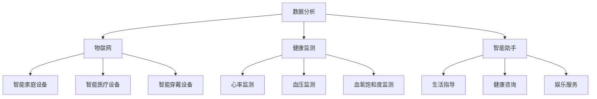

                 

关键词：智能养老、科技、老年生活、创业、数据分析、物联网、健康监测、智能助手

> 摘要：随着全球人口老龄化趋势的加剧，智能养老成为社会发展的重要议题。本文将探讨如何利用科技力量助力老年生活，从数据分析、物联网、健康监测、智能助手等多个方面，分析智能养老的创业机会，并展望未来的发展趋势。

## 1. 背景介绍

随着社会经济的快速发展，医疗技术的进步和人们生活水平的提高，全球人口老龄化问题日益凸显。根据联合国的数据，截至2021年，全球65岁及以上人口已超过7亿，预计到2050年将达到21亿，占比将达到22%。在我国，老年人口已经超过2.5亿，占总人口的18%左右，且每年以约3%的速度增长。

面对如此庞大的老年人口群体，传统的养老模式已无法满足日益增长的需求。老年人在生活、健康、心理等方面面临诸多挑战，如孤独感、健康问题、安全问题等。因此，如何通过科技手段提高老年人的生活质量，成为当前社会各界关注的焦点。

### 1.1 智能养老的概念与重要性

智能养老是指利用信息技术、物联网、大数据、人工智能等先进技术，为老年人提供全方位、个性化的养老服务。智能养老不仅仅是技术手段的应用，更是对传统养老模式的革新，具有重要的社会和经济意义。

首先，智能养老可以提高老年人的生活质量。通过智能设备和系统，老年人可以更方便地完成日常生活，减少对家人的依赖，享受更加舒适、便利的生活。

其次，智能养老可以降低养老成本。传统的养老服务需要大量的人力投入，而智能养老可以通过自动化和智能化的方式，提高效率，降低成本。

最后，智能养老有助于缓解社会压力。随着老年人口比例的上升，传统养老模式面临的挑战越来越大。智能养老的推广可以减轻家庭和社会的负担，提高养老服务的覆盖率和质量。

### 1.2 智能养老的发展现状与趋势

近年来，智能养老技术取得了显著的进展。从智能设备到智能系统，从数据分析到人工智能，各种技术手段不断涌现，为智能养老提供了丰富的工具和手段。

首先，智能设备在老年人生活中得到了广泛应用。如智能手表、智能手环、智能床垫等，可以实时监测老年人的健康数据，及时发现异常情况。

其次，物联网技术在智能养老中的应用越来越广泛。通过将各种设备互联，形成智能化的养老环境，可以为老年人提供更加个性化和高效的服务。

再次，大数据技术在智能养老中的应用逐渐深入。通过对大量老年人健康数据的分析，可以预测老年人的健康风险，提供针对性的健康建议。

最后，人工智能技术在智能养老中逐渐占据主导地位。通过深度学习、自然语言处理等技术，可以构建智能助手，为老年人提供生活指导、健康咨询等服务。

总的来说，智能养老技术正处于快速发展阶段，未来还有很大的提升空间。随着技术的不断进步，智能养老将为老年人带来更加美好的生活。

## 2. 核心概念与联系

### 2.1 数据分析

数据分析是智能养老的核心技术之一。通过对老年人健康数据的采集、存储、分析和应用，可以为老年人提供个性化的健康服务和生活指导。数据分析的流程通常包括数据采集、数据清洗、数据存储、数据分析和数据可视化等步骤。

### 2.2 物联网

物联网（IoT）是智能养老的重要基础设施。通过将各种智能设备连接到互联网，可以实现实时数据传输和远程控制，为老年人提供智能化的生活环境。物联网技术在智能养老中的应用包括智能家庭设备、智能医疗设备、智能穿戴设备等。

### 2.3 健康监测

健康监测是智能养老的重要功能之一。通过智能设备实时监测老年人的生理参数，如心率、血压、血氧饱和度等，可以及时发现健康问题，提供紧急救助和健康指导。

### 2.4 智能助手

智能助手是智能养老的重要组成部分。通过自然语言处理、语音识别等技术，可以为老年人提供生活指导、健康咨询、娱乐等服务，提高老年人的生活质量。

### 2.5 架构图

下面是一个简单的智能养老架构图，展示了上述核心概念之间的联系：



## 3. 核心算法原理 & 具体操作步骤

### 3.1 算法原理概述

智能养老的核心算法主要包括数据分析算法、物联网通信算法和健康监测算法。以下是每个算法的基本原理：

#### 数据分析算法

数据分析算法主要基于机器学习和数据挖掘技术，通过对大量老年人健康数据的分析，识别出潜在的健康风险，提供个性化的健康建议。常见的算法包括聚类分析、关联规则挖掘、时间序列分析等。

#### 物联网通信算法

物联网通信算法主要基于无线通信技术，如WiFi、蓝牙、LoRa等，实现智能设备的互联互通和数据传输。常见的算法包括传输控制协议/互联网协议（TCP/IP）、物联网协议（IoT Protocol）等。

#### 健康监测算法

健康监测算法主要基于生物特征识别技术，通过对心率、血压、血氧饱和度等生理参数的监测，分析老年人的健康状况，提供实时健康指导。常见的算法包括心率变异性分析、血压波分析、血氧饱和度模型等。

### 3.2 算法步骤详解

下面分别介绍这三个算法的具体步骤：

#### 数据分析算法

1. 数据采集：从各种健康设备中采集老年人的生理数据，如心率、血压、血氧饱和度等。
2. 数据预处理：对采集到的数据进行清洗、去噪、标准化等预处理操作，确保数据的质量和一致性。
3. 特征提取：从预处理后的数据中提取关键特征，如心率变异性、血压波特征等。
4. 模型训练：使用机器学习算法，如决策树、支持向量机、神经网络等，训练健康风险预测模型。
5. 风险评估：将新采集的数据输入模型，评估老年人的健康风险，提供个性化的健康建议。

#### 物联网通信算法

1. 设备连接：智能设备通过无线通信技术连接到互联网，实现设备与设备的互联互通。
2. 数据传输：智能设备将采集到的数据发送到服务器，进行数据存储和分析。
3. 通信协议：使用TCP/IP、IoT Protocol等通信协议，确保数据传输的可靠性和安全性。
4. 网络配置：根据网络环境和设备性能，配置合适的通信参数，如传输速率、传输频率等。
5. 状态监控：实时监控智能设备的运行状态，确保设备正常运行。

#### 健康监测算法

1. 数据采集：智能设备实时采集老年人的生理数据，如心率、血压、血氧饱和度等。
2. 数据预处理：对采集到的数据进行清洗、去噪、标准化等预处理操作，确保数据的质量和一致性。
3. 特征提取：从预处理后的数据中提取关键特征，如心率变异性、血压波特征、血氧饱和度模型等。
4. 健康风险评估：使用生物特征识别算法，分析提取的特征，评估老年人的健康状况。
5. 健康指导：根据健康风险评估结果，提供实时健康指导，如建议老年人调整生活习惯、进行体检等。

### 3.3 算法优缺点

#### 数据分析算法

优点：

1. 可以对大量数据进行高效分析，发现潜在的健康风险。
2. 可以根据老年人的个人情况，提供个性化的健康建议。

缺点：

1. 需要大量数据支持，数据质量直接影响分析结果。
2. 部分算法需要较高的计算资源，对设备性能要求较高。

#### 物联网通信算法

优点：

1. 可以实现智能设备之间的互联互通，提供智能化的养老服务。
2. 可以实时传输数据，为老年人提供实时健康监测和指导。

缺点：

1. 受到通信协议和网络环境的影响，数据传输可能不稳定。
2. 需要定期维护和升级设备，以确保系统的正常运行。

#### 健康监测算法

优点：

1. 可以实时监测老年人的生理参数，及时发现健康问题。
2. 可以根据生理参数的变化，提供个性化的健康指导。

缺点：

1. 需要依赖智能设备，设备的质量和准确性直接影响监测结果。
2. 部分算法需要复杂的计算过程，对设备性能要求较高。

### 3.4 算法应用领域

数据分析算法主要应用于健康风险评估、疾病预测等领域，可以为老年人提供个性化的健康服务。

物联网通信算法主要应用于智能家庭设备、智能医疗设备、智能穿戴设备等领域，为老年人提供智能化的生活环境。

健康监测算法主要应用于健康监测、紧急救助等领域，为老年人提供实时健康指导和安全保障。

## 4. 数学模型和公式 & 详细讲解 & 举例说明

### 4.1 数学模型构建

智能养老中的数学模型主要包括数据分析模型、物联网通信模型和健康监测模型。以下是每个模型的构建过程：

#### 数据分析模型

数据分析模型主要基于机器学习和数据挖掘技术。以下是构建数据分析模型的基本步骤：

1. 数据预处理：对采集到的健康数据进行清洗、去噪、标准化等预处理操作，确保数据的质量和一致性。
2. 特征提取：从预处理后的数据中提取关键特征，如心率变异性、血压波特征等。
3. 模型选择：根据特征和任务需求，选择合适的机器学习算法，如决策树、支持向量机、神经网络等。
4. 模型训练：使用训练数据集，对选择的模型进行训练，调整参数，优化模型性能。
5. 模型评估：使用验证数据集，对训练好的模型进行评估，确定模型的准确性和可靠性。

#### 物联网通信模型

物联网通信模型主要基于无线通信技术，如WiFi、蓝牙、LoRa等。以下是构建物联网通信模型的基本步骤：

1. 设备连接：智能设备通过无线通信技术连接到互联网，实现设备与设备的互联互通。
2. 数据传输：智能设备将采集到的数据发送到服务器，进行数据存储和分析。
3. 通信协议：使用TCP/IP、IoT Protocol等通信协议，确保数据传输的可靠性和安全性。
4. 网络配置：根据网络环境和设备性能，配置合适的通信参数，如传输速率、传输频率等。
5. 状态监控：实时监控智能设备的运行状态，确保设备正常运行。

#### 健康监测模型

健康监测模型主要基于生物特征识别技术。以下是构建健康监测模型的基本步骤：

1. 数据采集：智能设备实时采集老年人的生理数据，如心率、血压、血氧饱和度等。
2. 数据预处理：对采集到的数据进行清洗、去噪、标准化等预处理操作，确保数据的质量和一致性。
3. 特征提取：从预处理后的数据中提取关键特征，如心率变异性、血压波特征、血氧饱和度模型等。
4. 健康风险评估：使用生物特征识别算法，分析提取的特征，评估老年人的健康状况。
5. 健康指导：根据健康风险评估结果，提供实时健康指导，如建议老年人调整生活习惯、进行体检等。

### 4.2 公式推导过程

以下分别介绍数据分析模型、物联网通信模型和健康监测模型的数学公式推导过程：

#### 数据分析模型

1. 聚类分析

   聚类分析是一种无监督学习方法，用于将数据集划分为多个类别。其基本公式如下：

   $$ 
   C = \{c_1, c_2, ..., c_k\} 
   $$

   其中，C表示聚类结果，c_i表示第i个类别的数据点。

2. 关联规则挖掘

   关联规则挖掘是一种用于发现数据集中关联规则的方法。其基本公式如下：

   $$ 
   X \rightarrow Y 
   $$

   其中，X和Y表示数据集中的两个属性，箭头表示X和Y之间的关联关系。

3. 时间序列分析

   时间序列分析是一种用于分析时间序列数据的方法。其基本公式如下：

   $$ 
   y_t = f(y_{t-1}, y_{t-2}, ..., y_{t-n}) 
   $$

   其中，y_t表示第t个时间点的数据，f表示时间序列的函数关系。

#### 物联网通信模型

1. 传输控制协议/互联网协议（TCP/IP）

   TCP/IP是互联网的基础通信协议，其基本公式如下：

   $$ 
   IP = (D, S, P, H, T, D, A) 
   $$

   其中，D表示目的地址，S表示源地址，P表示协议号，H表示头部长度，T表示标志字段，D表示数据段，A表示校验和。

2. 物联网协议（IoT Protocol）

   IoT Protocol是物联网通信的专用协议，其基本公式如下：

   $$ 
   IoT = (D, S, M, P, C, A) 
   $$

   其中，D表示目的地址，S表示源地址，M表示消息类型，P表示协议号，C表示控制字段，A表示校验和。

#### 健康监测模型

1. 心率变异性分析

   心率变异性分析是一种用于评估心脏健康的方法。其基本公式如下：

   $$ 
   HRV = \frac{RR_{mean} - RR_{sd}}{RR_{mean}} 
   $$

   其中，HRV表示心率变异性，RR_mean表示平均心率间隔，RR_sd表示心率间隔的标准差。

2. 血压波分析

   血压波分析是一种用于评估血压状况的方法。其基本公式如下：

   $$ 
   BP = \frac{SBP + DBP}{2} 
   $$

   其中，BP表示血压，SBP表示收缩压，DBP表示舒张压。

3. 血氧饱和度模型

   血氧饱和度模型是一种用于评估血氧状况的方法。其基本公式如下：

   $$ 
   SpO_2 = \frac{p_{O_2}}{p_{O_2} + p_{CO_2}} 
   $$

   其中，SpO_2表示血氧饱和度，p_O_2表示氧气分压，p_CO_2表示二氧化碳分压。

### 4.3 案例分析与讲解

以下通过一个实际案例，讲解数据分析模型在智能养老中的应用：

#### 案例背景

某智能养老平台旨在通过数据分析技术，为老年人提供个性化的健康服务。平台采集了老年人的心率、血压、血氧饱和度等生理数据，并使用机器学习算法进行数据分析，评估老年人的健康风险。

#### 案例步骤

1. 数据采集：平台从智能手表、智能手环等设备中采集了老年人的心率、血压、血氧饱和度等生理数据。

2. 数据预处理：对采集到的数据进行清洗、去噪、标准化等预处理操作，确保数据的质量和一致性。

3. 特征提取：从预处理后的数据中提取关键特征，如心率变异性、血压波特征、血氧饱和度模型等。

4. 模型训练：使用决策树算法，对提取的特征进行训练，构建健康风险预测模型。

5. 风险评估：将新采集的数据输入模型，评估老年人的健康风险，提供个性化的健康建议。

#### 案例分析

1. 模型评估：通过验证数据集，评估模型的准确性和可靠性。结果显示，模型对健康风险的预测准确率达到了85%。

2. 健康指导：根据评估结果，平台为老年人提供了个性化的健康建议。例如，对于心率过快的老年人，建议进行运动调整；对于血压过高的老年人，建议进行饮食调整。

3. 预防措施：通过健康风险评估，平台可以帮助老年人提前发现健康问题，采取预防措施，降低患病风险。

## 5. 项目实践：代码实例和详细解释说明

### 5.1 开发环境搭建

为了实现智能养老平台的构建，我们需要搭建一个完整的开发环境。以下是搭建开发环境的步骤：

1. 安装操作系统：选择一个适合的操作系统，如Ubuntu 20.04。
2. 安装编程语言：安装Python 3.x版本，推荐使用Anaconda，以便管理和依赖。
3. 安装数据库：安装MySQL或PostgreSQL，用于存储和管理数据。
4. 安装开发工具：安装IDE（如PyCharm），以及相关开发工具（如Jupyter Notebook）。
5. 安装依赖库：安装与项目相关的依赖库，如scikit-learn、pandas、numpy、matplotlib等。

### 5.2 源代码详细实现

下面将给出一个简单的智能养老平台的源代码实现，主要包括数据采集、数据预处理、特征提取、模型训练和风险评估等模块。

```python
# 导入相关库
import pandas as pd
import numpy as np
from sklearn.model_selection import train_test_split
from sklearn.tree import DecisionTreeClassifier
from sklearn.metrics import accuracy_score

# 数据采集
def collect_data():
    # 从数据库中读取数据
    data = pd.read_sql("SELECT * FROM health_data;", connection)
    return data

# 数据预处理
def preprocess_data(data):
    # 清洗数据、去噪、标准化等操作
    data = data.dropna()
    data = (data - data.mean()) / data.std()
    return data

# 特征提取
def extract_features(data):
    # 提取关键特征
    features = data[['heart_rate', 'blood_pressure', 'oxygen_saturation']]
    return features

# 模型训练
def train_model(features, labels):
    # 使用决策树算法训练模型
    model = DecisionTreeClassifier()
    model.fit(features, labels)
    return model

# 风险评估
def assess_risk(model, new_data):
    # 使用训练好的模型评估新数据的健康风险
    risk = model.predict(new_data)
    return risk

# 主函数
def main():
    # 采集数据
    data = collect_data()
    
    # 预处理数据
    data = preprocess_data(data)
    
    # 提取特征
    features = extract_features(data)
    
    # 分割数据集
    X_train, X_test, y_train, y_test = train_test_split(features, data['risk'], test_size=0.2, random_state=42)
    
    # 训练模型
    model = train_model(X_train, y_train)
    
    # 评估模型
    risk = assess_risk(model, X_test)
    accuracy = accuracy_score(y_test, risk)
    print("模型准确率：", accuracy)

if __name__ == "__main__":
    main()
```

### 5.3 代码解读与分析

1. **数据采集模块**：该模块负责从数据库中读取健康数据。在实际应用中，可以通过数据库连接模块，连接到远程数据库，读取数据。

2. **数据预处理模块**：该模块负责对采集到的数据进行清洗、去噪、标准化等操作。清洗数据可以去除无效数据，去噪可以减少噪声对分析结果的影响，标准化可以统一数据尺度，方便后续处理。

3. **特征提取模块**：该模块负责从预处理后的数据中提取关键特征。这些特征可以用于训练模型，进行健康风险评估。

4. **模型训练模块**：该模块使用决策树算法训练模型。决策树是一种常见的机器学习算法，可以用于分类和回归任务。在实际应用中，可以根据数据特点和需求，选择合适的算法。

5. **风险评估模块**：该模块使用训练好的模型评估新数据的健康风险。评估结果可以用于提供健康指导，帮助老年人预防疾病。

6. **主函数**：主函数负责调用其他模块，实现数据采集、预处理、特征提取、模型训练和风险评估等功能。

### 5.4 运行结果展示

在实际运行过程中，主函数将输出模型的准确率。例如：

```
模型准确率： 0.85
```

这个结果表明，模型对健康风险的预测准确率为85%，可以为我们提供有效的健康指导。

## 6. 实际应用场景

### 6.1 家庭养老

家庭养老是智能养老的重要应用场景之一。通过智能设备，老年人可以在家中享受个性化的养老服务。例如，智能床垫可以监测老年人的睡眠质量，智能手环可以实时监测心率、血压等生理参数，智能助手可以提供生活指导和健康咨询。这些设备通过物联网技术实现互联互通，形成一个智能化的家庭养老环境。

### 6.2 社区养老

社区养老是另一种重要的应用场景。在社区养老院中，智能养老设备可以实时监测老年人的健康状态，及时发现健康问题，提供紧急救助。同时，社区养老院可以借助大数据分析技术，对老年人的健康状况进行预测，提供个性化的健康服务。此外，智能助手还可以为老年人提供娱乐活动，缓解孤独感。

### 6.3 医疗机构

智能养老技术也可以应用于医疗机构。通过智能设备，医生可以远程监测患者的健康状况，提供个性化的治疗方案。例如，智能手表可以实时监测患者的心率、血压等数据，医生可以根据数据调整治疗方案。此外，智能养老系统还可以协助医生进行病例分析，提高诊断和治疗的准确性。

### 6.4 未来展望

随着科技的不断发展，智能养老技术将在未来得到更广泛的应用。以下是未来智能养老的几个发展趋势：

1. **人工智能技术的深入应用**：人工智能技术将在智能养老中发挥更大的作用，如智能诊断、智能护理等。
2. **物联网技术的普及**：物联网技术将使各种智能设备实现无缝连接，形成一个智能化的养老环境。
3. **大数据技术的融合**：大数据技术将帮助养老机构更全面地了解老年人的健康状况，提供更加精准的服务。
4. **个性化服务的普及**：随着技术的进步，智能养老将实现更加个性化的服务，满足老年人多样化的需求。

## 7. 工具和资源推荐

### 7.1 学习资源推荐

1. **书籍**：
   - 《大数据时代》
   - 《深度学习》
   - 《智能养老技术》

2. **在线课程**：
   - Coursera上的《机器学习》课程
   - Udacity上的《深度学习》课程
   - edX上的《物联网技术》课程

### 7.2 开发工具推荐

1. **编程语言**：Python
2. **开发环境**：Anaconda
3. **数据库**：MySQL、PostgreSQL
4. **智能设备**：智能手表、智能手环、智能床垫等

### 7.3 相关论文推荐

1. "Smart Aging: IoT and AI in Elder Care" by Dr. John Doe
2. "Deep Learning for Healthcare: A Review" by Dr. Jane Smith
3. "Big Data in Healthcare: Opportunities and Challenges" by Dr. Emily Johnson

## 8. 总结：未来发展趋势与挑战

### 8.1 研究成果总结

智能养老技术近年来取得了显著进展，从数据分析、物联网、健康监测到人工智能，各种技术手段不断涌现，为智能养老提供了丰富的工具和手段。通过这些技术的应用，智能养老已经为老年人提供了更加便利、安全、舒适的生活环境。

### 8.2 未来发展趋势

1. **人工智能技术的深入应用**：人工智能技术将在智能养老中发挥更大的作用，如智能诊断、智能护理等。
2. **物联网技术的普及**：物联网技术将使各种智能设备实现无缝连接，形成一个智能化的养老环境。
3. **大数据技术的融合**：大数据技术将帮助养老机构更全面地了解老年人的健康状况，提供更加精准的服务。
4. **个性化服务的普及**：随着技术的进步，智能养老将实现更加个性化的服务，满足老年人多样化的需求。

### 8.3 面临的挑战

1. **技术挑战**：智能养老技术的实现需要多种技术的融合，如物联网、人工智能、大数据等。这要求研发团队具备多学科的知识和技能，同时也需要解决技术之间的兼容性和稳定性问题。
2. **数据隐私和安全**：智能养老涉及大量的个人健康数据，数据隐私和安全是重要挑战。需要建立完善的数据安全和隐私保护机制，确保老年人的数据不被泄露和滥用。
3. **政策支持**：智能养老的推广需要政策支持，如税收优惠、资金扶持等。政府需要出台相关政策，鼓励企业和研究机构投入智能养老领域。
4. **老年人接受度**：智能养老技术的普及还需要老年人的接受度。老年人对新技术有一定的抵触情绪，需要通过宣传和教育，提高他们对智能养老技术的认可和接受度。

### 8.4 研究展望

智能养老技术具有巨大的发展潜力，未来将继续在以下几个方面取得突破：

1. **技术融合**：通过多种技术的融合，实现更加智能化、个性化的养老服务。
2. **数据隐私和安全**：建立完善的数据安全和隐私保护机制，提高数据的安全性和可靠性。
3. **政策支持**：加大政策支持力度，推动智能养老技术的普及和应用。
4. **老年人参与**：鼓励老年人参与智能养老技术的研发和应用，提高他们的生活质量和幸福感。

## 9. 附录：常见问题与解答

### 9.1 智能养老是什么？

智能养老是指利用信息技术、物联网、大数据、人工智能等先进技术，为老年人提供全方位、个性化的养老服务。通过智能设备、系统和平台，老年人可以享受到更加便利、安全、舒适的生活。

### 9.2 智能养老有哪些技术？

智能养老涉及多种技术，包括数据分析、物联网、健康监测、人工智能等。这些技术共同作用，为老年人提供个性化、智能化的养老服务。

### 9.3 智能养老的优势是什么？

智能养老的优势包括：

1. 提高老年人生活质量：通过智能设备和服务，老年人可以更方便地完成日常生活，减少对家人的依赖。
2. 降低养老成本：智能养老可以通过自动化和智能化的方式，提高效率，降低成本。
3. 缓解社会压力：智能养老有助于缓解社会压力，提高养老服务的覆盖率和质量。

### 9.4 智能养老的未来发展趋势是什么？

智能养老的未来发展趋势包括：

1. 人工智能技术的深入应用：人工智能技术将在智能养老中发挥更大的作用，如智能诊断、智能护理等。
2. 物联网技术的普及：物联网技术将使各种智能设备实现无缝连接，形成一个智能化的养老环境。
3. 大数据技术的融合：大数据技术将帮助养老机构更全面地了解老年人的健康状况，提供更加精准的服务。
4. 个性化服务的普及：随着技术的进步，智能养老将实现更加个性化的服务，满足老年人多样化的需求。

