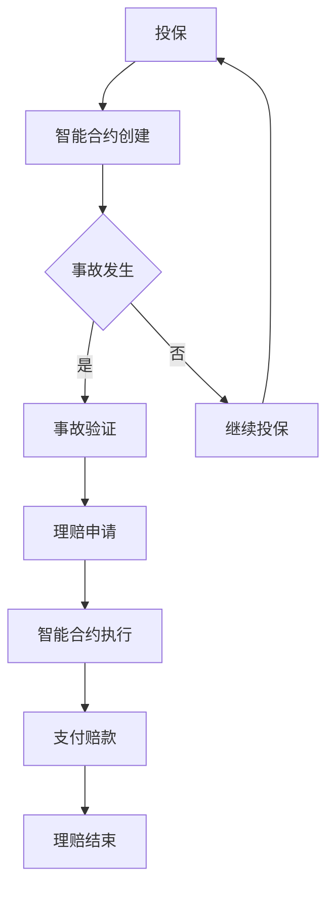

                 

关键词：智能合约、区块链、保险科技、理赔系统、安全性与效率

> 摘要：本文探讨了智能合约保险理赔系统的创新应用，从背景介绍到核心算法原理，再到数学模型构建、项目实践与未来展望，全面解析了该系统的优势和应用前景。

## 1. 背景介绍

随着区块链技术和智能合约的迅猛发展，保险科技（InsurTech）逐渐成为金融科技（FinTech）领域的一大亮点。保险理赔是一个复杂且耗时长的过程，传统的保险理赔系统往往面临着数据隐私性不足、处理效率低下等问题。智能合约保险理赔系统作为一种新兴的应用，通过利用区块链技术和智能合约的特性，有望大幅提升保险理赔的效率和安全性。

智能合约是运行在区块链上的自执行合同，能够在满足预定条件时自动执行。区块链则是一个去中心化的分布式账本，具有不可篡改、透明性高等特点。将这两项技术与保险理赔相结合，可以打造出一个高度自动化的理赔系统，从而减少人工干预、提高理赔速度、增强数据安全性。

## 2. 核心概念与联系

### 2.1. 核心概念

**智能合约**：是一种在区块链上运行的代码，用于自动执行合同条款。智能合约可以在满足特定条件时自动执行，例如支付赔款、自动调整保费等。

**区块链**：是一种分布式账本技术，可以记录和存储一系列数据交易，具有去中心化、不可篡改和安全性的特点。

**保险科技（InsurTech）**：是指利用技术创新来改进保险业务流程，提高效率、降低成本、增强用户体验的一种新兴模式。

### 2.2. 关联流程图

以下是一个简化的智能合约保险理赔系统的 Mermaid 流程图：



### 2.3. 智能合约与区块链的联系

智能合约与区块链的联系主要体现在以下几个方面：

1. **数据存储**：智能合约的数据存储在区块链上，保证了数据的不可篡改性。
2. **共识机制**：区块链的共识机制确保了智能合约的执行是安全的，所有参与方都能达成一致。
3. **透明性**：区块链上的数据透明，所有参与方都可以查看智能合约的执行情况，提高了保险理赔的透明度。

## 3. 核心算法原理 & 具体操作步骤

### 3.1. 算法原理概述

智能合约保险理赔系统的核心算法原理主要包括以下几个方面：

1. **事件触发**：当用户发生保险事故时，系统会自动触发理赔事件。
2. **智能合约执行**：根据智能合约的条款，自动执行理赔流程，如事故验证、理赔申请、支付赔款等。
3. **数据加密与存储**：所有交易数据都会被加密存储在区块链上，确保数据的安全性和隐私性。

### 3.2. 算法步骤详解

1. **投保阶段**：用户通过智能合约进行投保，智能合约记录下用户的投保信息，如姓名、投保金额、保险期限等。

2. **事故发生阶段**：当用户发生保险事故时，系统会自动触发理赔事件。

3. **事故验证阶段**：智能合约会自动验证事故的真实性，如通过上传事故照片、医疗记录等。

4. **理赔申请阶段**：用户可以通过智能合约提交理赔申请。

5. **智能合约执行阶段**：智能合约根据用户提交的理赔申请和事故验证结果，自动执行理赔流程。

6. **支付赔款阶段**：智能合约自动计算理赔金额，并将赔款支付给用户。

7. **理赔结束阶段**：理赔流程结束后，智能合约记录理赔结果，用户可以查看理赔详情。

### 3.3. 算法优缺点

**优点**：

- **效率高**：智能合约保险理赔系统可以自动化处理理赔流程，大幅提高处理速度。
- **安全性高**：区块链技术的加密和去中心化特性，确保了理赔数据的真实性和安全性。
- **透明度高**：所有交易数据都记录在区块链上，用户可以随时查看理赔过程和结果。

**缺点**：

- **开发难度大**：智能合约的开发需要一定的技术门槛，需要具备区块链和编程知识。
- **技术成熟度不高**：尽管智能合约技术已经发展多年，但其在保险领域的应用仍处于探索阶段。

### 3.4. 算法应用领域

智能合约保险理赔系统在保险领域有广泛的应用前景，可以应用于车险、健康险、家庭保险等多个领域。例如：

- **车险理赔**：智能合约可以自动验证事故发生时间、地点等信息，快速处理理赔申请。
- **健康险理赔**：智能合约可以自动审核医疗记录，快速支付医疗费用。
- **家庭保险**：智能合约可以自动调整家庭保险的保费，适应家庭成员的变化。

## 4. 数学模型和公式 & 详细讲解 & 举例说明

### 4.1. 数学模型构建

智能合约保险理赔系统的数学模型主要涉及以下几个方面：

- **保费计算模型**：根据用户投保金额、保险期限等因素，计算保费。
- **理赔计算模型**：根据事故类型、事故严重程度等因素，计算理赔金额。
- **风险评估模型**：根据用户的历史理赔记录、驾驶习惯等因素，评估用户的风险。

### 4.2. 公式推导过程

以下是一个简化的保费计算模型：

$$
保费 = \frac{投保金额 \times 保险期限}{12 \times (1 + 风险系数)}
$$

其中，风险系数可以根据用户的历史理赔记录、驾驶习惯等因素进行动态调整。

### 4.3. 案例分析与讲解

假设用户A购买了一份家庭保险，投保金额为100万元，保险期限为3年。根据保费计算模型，我们可以计算出用户A的保费：

$$
保费 = \frac{100万元 \times 3年}{12 \times (1 + 0.1)} = 27.78万元
$$

如果用户A在保险期限内发生了保险事故，根据理赔计算模型，我们可以计算出用户A的理赔金额：

$$
理赔金额 = \frac{事故严重程度 \times 投保金额}{1 + 风险系数}
$$

例如，如果事故严重程度为5级（最高级），用户A的理赔金额为：

$$
理赔金额 = \frac{5 \times 100万元}{1 + 0.1} = 47.62万元
$$

## 5. 项目实践：代码实例和详细解释说明

### 5.1. 开发环境搭建

搭建智能合约保险理赔系统的开发环境主要包括以下步骤：

1. 安装Node.js和npm。
2. 安装Truffle框架，用于智能合约的开发和部署。
3. 安装Ganache，用于本地测试区块链网络。
4. 安装Ethereum客户端，用于连接测试网络。

### 5.2. 源代码详细实现

以下是一个简化的智能合约保险理赔系统的源代码示例：

```solidity
pragma solidity ^0.8.0;

contract Insurance {

    address public insurer;
    mapping(address => bool) public insureds;
    mapping(address => uint) public claims;

    constructor() {
        insurer = msg.sender;
    }

    function enroll() public {
        require(!insureds[msg.sender], "Already enrolled");
        insureds[msg.sender] = true;
    }

    function submitClaim(address claimant, uint amount) public {
        require(insureds[claimant], "Not enrolled");
        claims[claimant] += amount;
    }

    function payClaim(address claimant) public {
        require(insurer == msg.sender, "Only insurer can pay");
        uint amount = claims[claimant];
        claims[claimant] = 0;
        payable(claimant).transfer(amount);
    }
}
```

### 5.3. 代码解读与分析

1. **构造函数**：合约创建时，将合约创建者设为保险公司的地址。
2. **enroll() 函数**：用户注册为被保险人。
3. **submitClaim() 函数**：用户提交理赔申请。
4. **payClaim() 函数**：保险公司支付理赔金额。

### 5.4. 运行结果展示

1. 用户A调用enroll()函数注册为被保险人。
2. 用户A发生保险事故，调用submitClaim()函数提交理赔申请。
3. 保险公司调用payClaim()函数支付理赔金额。

## 6. 实际应用场景

智能合约保险理赔系统在实际应用中具有广泛的应用场景，例如：

- **车险理赔**：用户发生交通事故后，通过智能合约提交理赔申请，保险公司自动审核并支付赔款。
- **健康险理赔**：用户提交医疗记录，智能合约自动审核并支付医疗费用。
- **家庭保险**：根据家庭成员的变化，智能合约自动调整家庭保险的保费。

## 7. 工具和资源推荐

### 7.1. 学习资源推荐

- **《智能合约设计与开发》**：深入讲解智能合约的设计和开发，适合智能合约初学者。
- **《区块链应用开发指南》**：介绍如何使用区块链技术构建各种应用，包括智能合约。
- **Ethereum官方文档**：Ethereum的官方文档是学习智能合约开发不可或缺的资源。

### 7.2. 开发工具推荐

- **Truffle**：用于智能合约的开发、测试和部署。
- **Ganache**：用于本地测试区块链网络。
- **Hardhat**：一个流行的本地开发环境，提供了许多有用的工具和功能。

### 7.3. 相关论文推荐

- **"Smart Contracts: Building Secure and Reliable Applications on Ethereum"**：详细介绍智能合约的安全性和可靠性。
- **"Blockchain for Insurance"**：探讨区块链在保险领域的应用。
- **"A Framework for Designing Smart Contracts"**：提供智能合约设计的方法和框架。

## 8. 总结：未来发展趋势与挑战

### 8.1. 研究成果总结

智能合约保险理赔系统在提高理赔效率、降低成本、增强安全性等方面取得了显著成果。通过区块链技术的应用，保险理赔过程变得更加透明、高效和可信。

### 8.2. 未来发展趋势

随着技术的不断成熟，智能合约保险理赔系统有望在更多领域得到应用。例如，与物联网（IoT）的结合，可以实现自动化的保险理赔；与大数据的结合，可以实现更加精准的风险评估。

### 8.3. 面临的挑战

智能合约保险理赔系统在发展过程中也面临一些挑战，如：

- **技术成熟度**：智能合约技术的成熟度还有待提高，特别是在性能和安全性方面。
- **法律法规**：智能合约在保险领域的应用需要符合相关法律法规，需要制定相应的监管措施。
- **用户接受度**：用户对智能合约的认知和接受度还需要进一步提高。

### 8.4. 研究展望

未来，智能合约保险理赔系统有望在以下几个方面实现突破：

- **性能提升**：通过优化智能合约的算法和架构，提高系统的性能。
- **跨链应用**：实现智能合约与其他区块链之间的互操作，扩大应用范围。
- **去中心化**：通过去中心化的方式，提高系统的安全性和可靠性。

## 9. 附录：常见问题与解答

### 9.1. 智能合约保险理赔系统的安全性如何保证？

智能合约保险理赔系统的安全性主要通过以下方式保证：

- **区块链技术**：区块链的加密和去中心化特性，确保了交易数据的真实性和安全性。
- **智能合约代码审查**：在部署智能合约前，进行严格的代码审查，确保代码的健壮性和安全性。
- **共识机制**：区块链的共识机制确保了所有参与方都能达成一致，防止恶意攻击。

### 9.2. 智能合约保险理赔系统的效率如何提升？

智能合约保险理赔系统的效率可以通过以下方式提升：

- **优化算法**：通过优化智能合约的算法和架构，提高系统的处理速度。
- **分布式计算**：通过分布式计算的方式，提高系统的并发处理能力。
- **去中心化**：通过去中心化的方式，减少系统的单点故障风险，提高系统的可靠性。

### 9.3. 智能合约保险理赔系统如何适应不同国家和地区的法律法规？

智能合约保险理赔系统需要根据不同国家和地区的法律法规进行调整，确保系统的合规性。例如：

- **数据存储**：根据不同国家的数据保护法规，选择合适的数据存储方案。
- **智能合约条款**：根据不同国家的法律法规，调整智能合约的条款，确保其符合当地法律。

### 9.4. 智能合约保险理赔系统如何处理跨链交易？

智能合约保险理赔系统可以通过以下方式处理跨链交易：

- **跨链协议**：使用跨链协议，如Polkadot、Cosmos等，实现不同区块链之间的互操作。
- **中继链**：通过中继链的方式，实现不同区块链之间的交易传递。
- **链间合约**：开发链间合约，实现不同区块链之间的数据交换和交易执行。

作者：禅与计算机程序设计艺术 / Zen and the Art of Computer Programming
----------------------------------------------------------------

以上就是智能合约保险理赔系统：保险科技的创新应用的文章。希望这篇文章能帮助您更好地了解智能合约保险理赔系统的原理和应用。在未来，随着技术的不断发展和完善，智能合约保险理赔系统有望在保险领域发挥更大的作用。

