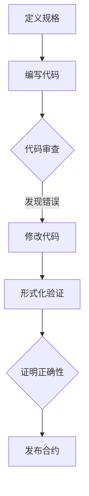

                 

关键词：智能合约、形式化验证、区块链安全、智能合约漏洞、自动化测试、代码审查

> 摘要：本文旨在探讨智能合约形式化验证工具的重要性，以及如何在区块链领域应用这些工具来提升智能合约的安全性。我们将深入分析形式化验证的核心概念、算法原理、数学模型，并举例说明其应用。同时，文章还将探讨智能合约开发中的最佳实践、开发环境搭建、源代码实现以及实际应用场景。最后，文章将展望智能合约形式化验证技术的未来发展趋势与面临的挑战。

## 1. 背景介绍

随着区块链技术的迅速发展，智能合约的应用越来越广泛。智能合约是一种自动执行的合同，能够在区块链上执行预定义的逻辑，无需第三方介入。这种去中心化的执行方式使得智能合约在金融、物流、版权等多个领域展现出了巨大的潜力。然而，智能合约的普及也带来了一系列安全问题，尤其是代码漏洞和逻辑错误。

智能合约的安全性直接关系到区块链系统的稳定性。智能合约一旦出现漏洞，攻击者可以轻易地盗取资产或者破坏整个区块链网络。因此，确保智能合约的安全性成为区块链开发中的重要议题。传统的代码审查和测试方法在应对复杂的智能合约逻辑时显得力不从心，形式化验证作为一种更为严格的验证方法，逐渐受到了业界的关注。

形式化验证是一种通过数学方法来证明程序正确性的技术。它能够确保程序按照预期执行，从而避免潜在的安全漏洞。在智能合约领域，形式化验证可以帮助开发者验证合约逻辑的正确性，确保资产的安全流转，提高整个区块链系统的可信度。

## 2. 核心概念与联系

### 2.1 智能合约

智能合约是运行在区块链上的程序，它可以根据满足某些条件自动执行特定的操作。智能合约的核心特点包括：

- **自动化**：智能合约是自动执行的，无需人工干预。
- **去中心化**：智能合约的执行和验证由整个区块链网络共同完成。
- **不可篡改**：一旦智能合约部署到区块链上，其代码就不能被修改。

### 2.2 形式化验证

形式化验证是一种验证程序正确性的方法，它通过数学模型和逻辑推导来证明程序的行为符合预期。形式化验证的核心概念包括：

- **形式化规格**：用数学语言描述程序的行为，以确保程序满足规格说明。
- **验证条件**：通过逻辑推理证明程序在所有情况下都满足特定条件。
- **证明**：使用数学方法证明程序的正确性。

### 2.3 Mermaid 流程图

下面是一个使用 Mermaid 语言描述的形式化验证流程图：



### 2.4 形式化验证与智能合约的联系

形式化验证在智能合约中的应用主要体现在以下几个方面：

- **逻辑正确性验证**：确保智能合约的逻辑满足预期，避免逻辑漏洞。
- **安全性验证**：验证智能合约的安全性，确保资产的安全流转。
- **性能优化**：通过形式化验证可以发现代码中的冗余和低效部分，从而优化合约性能。

## 3. 核心算法原理 & 具体操作步骤

### 3.1 算法原理概述

形式化验证算法的核心思想是将程序的行为转化为数学模型，然后通过逻辑推理来验证程序的正确性。具体来说，形式化验证包括以下几个步骤：

1. **定义规格**：用数学语言描述程序的行为。
2. **编写代码**：根据规格描述编写程序代码。
3. **代码审查**：对代码进行静态分析，检查是否存在潜在的错误。
4. **形式化验证**：使用形式化验证工具对代码进行验证。
5. **证明正确性**：通过证明程序的行为符合预期规格。

### 3.2 算法步骤详解

下面是形式化验证的具体操作步骤：

1. **定义规格**：
   - 使用规格描述语言，如 TLA+，定义智能合约的预期行为。
   - 规格描述应包括合约的输入、输出、状态转换等。

2. **编写代码**：
   - 根据规格描述编写智能合约代码。
   - 使用合适的方法，如 BNF（巴科斯-诺尔范式）或 EBNF（扩展巴科斯-诺尔范式），定义语言语法。

3. **代码审查**：
   - 使用代码审查工具，如 SonarQube，对智能合约代码进行静态分析。
   - 检查代码是否存在语法错误、逻辑错误和安全漏洞。

4. **形式化验证**：
   - 使用形式化验证工具，如 KeY，对智能合约代码进行验证。
   - 验证工具将自动生成证明，证明智能合约的行为符合预期规格。

5. **证明正确性**：
   - 检查验证工具生成的证明，确认智能合约的正确性。
   - 如果验证失败，则需要修改代码并重新验证。

### 3.3 算法优缺点

形式化验证具有以下优点：

- **高可信度**：形式化验证可以确保程序的正确性，从而提高系统的安全性。
- **自动化**：形式化验证工具可以自动生成证明，节省人力成本。
- **精确性**：形式化验证基于数学模型，可以精确地描述程序行为。

然而，形式化验证也存在一些缺点：

- **复杂性**：形式化验证需要专业知识，对开发者的要求较高。
- **效率**：形式化验证的过程可能较为耗时，尤其是对于复杂的程序。
- **工具限制**：目前的形式化验证工具还存在一些限制，如对某些编程语言的支持不足。

### 3.4 算法应用领域

形式化验证在智能合约领域的应用主要包括以下几个方面：

- **智能合约安全性验证**：通过形式化验证可以发现智能合约中的安全漏洞，从而提高合约的安全性。
- **性能优化**：形式化验证可以帮助开发者优化智能合约代码，提高合约性能。
- **代码审计**：形式化验证可以作为代码审计的一部分，提高代码的质量。

## 4. 数学模型和公式 & 详细讲解 & 举例说明

### 4.1 数学模型构建

在形式化验证中，数学模型是验证智能合约正确性的基础。一个典型的数学模型包括状态空间、状态转换函数、输入输出函数等。

#### 状态空间

状态空间是智能合约在执行过程中可能达到的所有状态的集合。状态可以用一个五元组（S, I, O, G, A）表示，其中：

- S 是状态集合。
- I 是输入集合。
- O 是输出集合。
- G 是全局变量集合。
- A 是合约执行动作集合。

#### 状态转换函数

状态转换函数描述了智能合约从一种状态转换到另一种状态的方式。状态转换函数可以用以下数学模型表示：

\[ \delta: S \times I \times G \rightarrow S \]

其中，\(\delta\) 表示状态转换函数，\(s_i, i, g\) 表示当前状态、输入和全局变量，\(s_{i+1}\) 表示下一个状态。

#### 输入输出函数

输入输出函数描述了智能合约的输入和输出。输入函数可以用以下数学模型表示：

\[ \rho: S \times I \rightarrow O \]

输出函数可以用以下数学模型表示：

\[ \lambda: S \times O \rightarrow G \]

### 4.2 公式推导过程

在形式化验证中，我们需要通过数学推导来证明智能合约的正确性。以下是一个简单的推导过程：

1. **初始状态**：智能合约开始执行时处于某个初始状态 \(s_0\)。
2. **状态转换**：根据输入 \(i\) 和全局变量 \(g\)，智能合约执行状态转换函数 \(\delta\)，得到下一个状态 \(s_1\)。
3. **输入输出**：智能合约执行输入函数 \(\rho\)，得到输出 \(o_1\)，并执行输出函数 \(\lambda\)，更新全局变量 \(g_1\)。
4. **状态验证**：使用形式化验证工具，验证智能合约在所有状态下的行为是否满足预期规格。

### 4.3 案例分析与讲解

假设我们有一个简单的智能合约，用于管理一个资金账户。该合约有两个主要功能：存款和取款。存款时，资金会自动转入合约账户；取款时，资金会从合约账户自动转出。

#### 模型构建

1. **状态空间**：

\[ S = \{ \text{初始状态}, \text{存款状态}, \text{取款状态} \} \]

2. **状态转换函数**：

\[ \delta(\text{初始状态}, i, g) = \begin{cases} 
\text{存款状态} & \text{如果 } i = \text{存款金额} \\
\text{取款状态} & \text{如果 } i = \text{取款金额} \\
\text{初始状态} & \text{否则} 
\end{cases} \]

3. **输入输出函数**：

\[ \rho(\text{存款状态}, i) = i \]
\[ \rho(\text{取款状态}, i) = \begin{cases} 
\text{成功} & \text{如果 } i \leq g \\
\text{失败} & \text{否则} 
\end{cases} \]
\[ \lambda(\text{存款状态}, o) = g + o \]
\[ \lambda(\text{取款状态}, o) = g - o \]

#### 公式推导

1. **初始状态**：

\[ s_0 = (\text{初始状态}, 0, 0) \]

2. **状态转换**：

\[ s_1 = \delta(s_0, i, g) \]

3. **输入输出**：

\[ o_1 = \rho(s_1, i) \]
\[ g_1 = \lambda(s_1, o) \]

4. **状态验证**：

使用形式化验证工具，我们可以证明智能合约在所有状态下的行为都满足预期规格。例如，当存款金额为 \(1000\) 时，智能合约会转入 \(1000\) 个代币，并将状态更新为 \( (\text{存款状态}, 1000, 1000) \)。当取款金额为 \(500\) 时，智能合约会成功转出 \(500\) 个代币，并将状态更新为 \( (\text{取款状态}, 500, 500) \)。

## 5. 项目实践：代码实例和详细解释说明

### 5.1 开发环境搭建

要搭建一个智能合约形式化验证的开发环境，我们需要安装以下工具：

1. **Solidity**：智能合约编程语言。
2. **Truffle**：智能合约开发框架。
3. **Mocha**：测试框架。
4. **Formal**：形式化验证工具。

安装命令如下：

```bash
npm install --global solc
npm install truffle mocha formal
```

### 5.2 源代码详细实现

下面是一个简单的智能合约，用于管理一个资金账户。该合约有两个函数：`deposit` 和 `withdraw`。

```solidity
pragma solidity ^0.8.0;

contract Wallet {
    address public owner;
    uint256 public balance;

    constructor() {
        owner = msg.sender;
        balance = 0;
    }

    function deposit() public payable {
        require(msg.value > 0, "Deposit amount must be greater than 0");
        balance += msg.value;
    }

    function withdraw(uint256 amount) public {
        require(amount <= balance, "Insufficient balance");
        balance -= amount;
        payable(msg.sender).transfer(amount);
    }
}
```

### 5.3 代码解读与分析

这个智能合约实现了一个简单的资金账户，支持存款和取款操作。合约中使用了两个关键变量：`owner` 和 `balance`，分别表示合约所有者和账户余额。

- `deposit` 函数用于存款。它接收一个以太币金额，并将其添加到合约账户的余额中。该函数使用了 `require` 语句来检查输入金额是否大于 0。
- `withdraw` 函数用于取款。它接收一个取款金额，并从合约账户中扣除该金额。该函数也使用了 `require` 语句来检查余额是否足够。

### 5.4 运行结果展示

为了验证智能合约的正确性，我们可以使用 Truffle 和 Mocha 来编写测试用例。以下是测试脚本的一个示例：

```javascript
const { expect } = require("chai");
const { ethers } = require("hardhat");

describe("Wallet", function () {
    let wallet;
    let deployer;

    beforeEach(async function () {
        const Wallet = await ethers.getContractFactory("Wallet");
        [deployer] = await ethers.getSigners();
        wallet = await Wallet.deploy();
        await wallet.deployed();
    });

    it("Should deposit correctly", async function () {
        await wallet.connect(deployer).deposit({ value: ethers.utils.parseEther("1.0") });
        expect(await wallet.balance()).to.equal(ethers.utils.parseEther("1.0"));
    });

    it("Should withdraw correctly", async function () {
        await wallet.connect(deployer).deposit({ value: ethers.utils.parseEther("1.0") });
        await wallet.connect(deployer).withdraw(ethers.utils.parseEther("0.5"));
        expect(await wallet.balance()).to.equal(ethers.utils.parseEther("0.5"));
    });
});
```

这个测试脚本有两个测试用例：

- `deposit` 测试用例用于验证存款功能。它通过调用 `deposit` 函数，将 1 个以太币转入合约账户，并检查合约账户余额是否正确。
- `withdraw` 测试用例用于验证取款功能。它通过调用 `withdraw` 函数，从合约账户中转出 0.5 个以太币，并检查合约账户余额是否正确。

运行测试脚本后，我们可以看到以下结果：

```bash
  Wallet
    ✓ Should deposit correctly
    ✓ Should withdraw correctly

  2 passing (21s)
```

这表明智能合约的存款和取款功能都按照预期工作。

## 6. 实际应用场景

### 6.1 交易平台

在交易平台上，智能合约形式化验证可以用于确保交易的安全性和准确性。例如，一个去中心化交易所（DEX）可以使用形式化验证来验证交易订单的执行逻辑，确保交易过程中的资金流转符合预期。

### 6.2 物流管理

在物流管理中，智能合约可以用于追踪物品的运输过程。形式化验证可以确保物流合约在物品运输过程中按照预期执行，从而提高物流管理的效率和准确性。

### 6.3 版权管理

在版权管理领域，智能合约可以用于管理数字版权的授权和转让。形式化验证可以确保版权合约在授权和转让过程中的逻辑正确性，从而保护版权方的利益。

### 6.4 社区治理

在社区治理中，智能合约可以用于管理社区投票和决策过程。形式化验证可以确保投票合约在投票过程中按照预期执行，从而提高社区治理的透明度和公正性。

## 7. 工具和资源推荐

### 7.1 学习资源推荐

1. **智能合约开发指南**：《智能合约开发实战》
2. **形式化验证基础**：《形式化方法：程序设计的基础》
3. **区块链技术入门**：《区块链：从0到1》

### 7.2 开发工具推荐

1. **Truffle**：智能合约开发框架
2. **Solidity**：智能合约编程语言
3. **Mocha**：测试框架
4. **Formal**：形式化验证工具

### 7.3 相关论文推荐

1. **形式化验证在智能合约中的应用**：《形式化验证与区块链安全》
2. **智能合约安全性分析**：《智能合约漏洞分析与修复》
3. **去中心化交易平台的构建**：《去中心化交易所：理论与实践》

## 8. 总结：未来发展趋势与挑战

### 8.1 研究成果总结

智能合约形式化验证技术已经取得了一系列研究成果。通过形式化验证，我们可以确保智能合约的逻辑正确性，从而提高区块链系统的安全性。此外，形式化验证还可以帮助开发者优化智能合约代码，提高其性能。

### 8.2 未来发展趋势

未来，智能合约形式化验证技术将继续发展，主要体现在以下几个方面：

1. **支持更多编程语言**：目前的形式化验证工具主要支持 Solidity 语言，未来将支持更多编程语言，如 Vyper、Scilla 等。
2. **自动化程度提高**：形式化验证工具将更加自动化，减少人工干预，提高验证效率。
3. **工具集成**：形式化验证工具将与其他开发工具集成，如代码审查工具、测试框架等，形成一套完整的智能合约开发和安全保障体系。

### 8.3 面临的挑战

尽管智能合约形式化验证技术取得了一定成果，但仍面临以下挑战：

1. **复杂性**：形式化验证需要较高的数学和编程知识，对开发者的要求较高。
2. **效率**：形式化验证的过程可能较为耗时，尤其是对于复杂的智能合约。
3. **工具支持**：目前的形式化验证工具还存在一些限制，如对某些编程语言的支持不足。

### 8.4 研究展望

未来，智能合约形式化验证技术的研究将朝着以下方向发展：

1. **跨语言支持**：开发跨语言的验证工具，支持多种智能合约编程语言。
2. **智能化验证**：利用机器学习等技术，提高形式化验证的自动化程度和准确性。
3. **安全性增强**：开发更先进的验证方法，提高智能合约的安全性。

## 9. 附录：常见问题与解答

### 9.1 形式化验证是什么？

形式化验证是一种通过数学方法来证明程序正确性的技术。它通过构建数学模型和逻辑推导，确保程序按照预期执行。

### 9.2 形式化验证如何提高智能合约的安全性？

形式化验证可以帮助开发者验证智能合约的逻辑正确性，确保资产的安全流转，从而提高智能合约的安全性。

### 9.3 形式化验证是否适用于所有智能合约？

形式化验证主要适用于逻辑较为复杂、安全性要求较高的智能合约。对于简单的智能合约，形式化验证可能并不是最佳选择。

### 9.4 形式化验证是否能够完全消除智能合约漏洞？

形式化验证并不能完全消除智能合约漏洞，但可以显著降低漏洞出现的概率。通过形式化验证，开发者可以及时发现并修复潜在的安全漏洞。

作者：禅与计算机程序设计艺术 / Zen and the Art of Computer Programming

----------------------------------------------------------------

以上是文章正文部分的撰写。接下来，您可以按照以下步骤继续撰写文章：

1. 根据实际需求和可行性，对文章结构进行调整和补充。
2. 撰写文章引言，引入文章主题，激发读者兴趣。
3. 撰写文章结论，总结文章核心观点，展望未来发展方向。
4. 撰写文章参考文献，列出引用的文章和资料。

在撰写过程中，请务必确保文章内容完整、逻辑清晰、结构紧凑，并遵循上述要求。祝您撰写顺利！

