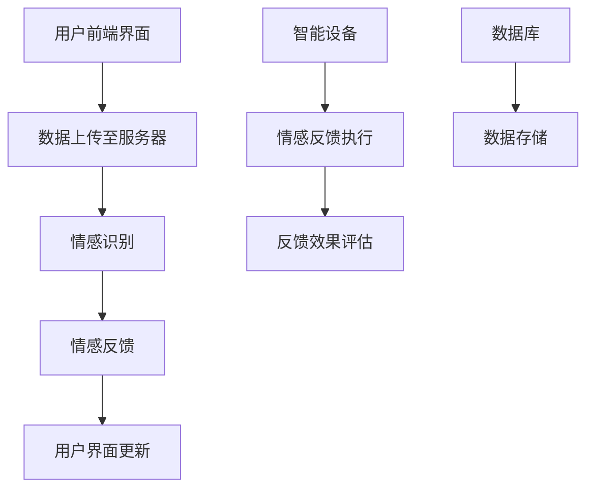

                 

关键词：智能宠物，情感交互，创业，界面设计，技术实现

> 摘要：随着人工智能技术的快速发展，智能宠物情绪交流创业逐渐成为新兴领域。本文将探讨智能宠物情绪交流的核心概念、算法原理、数学模型、项目实践及其未来应用前景，旨在为创业者提供有价值的参考和思路。

## 1. 背景介绍

随着科技的进步，人工智能（AI）技术在各个领域得到了广泛应用。特别是在宠物行业，智能宠物的概念逐渐兴起，从早期的智能喂食器、智能宠物摄像头到如今更为复杂的情感交互设备，人工智能正在改变人与宠物之间的关系。

智能宠物情绪交流创业的兴起，源于人们对宠物的关爱和科技的追求。一方面，随着生活水平的提高，人们对宠物的需求不再仅限于基本的喂养和照料，更加注重宠物的情感需求和健康状态；另一方面，人工智能技术的发展为这一需求提供了实现的可能。

本文将围绕智能宠物情绪交流创业这一主题，从核心概念、算法原理、数学模型、项目实践和未来应用前景等方面进行深入探讨，以期为创业者提供有价值的参考。

## 2. 核心概念与联系

### 2.1 情感交互

情感交互是指通过技术手段实现人与宠物之间的情感沟通和交流。在智能宠物情绪交流创业中，情感交互是核心概念之一。它包括以下几个方面：

1. **语音交互**：通过语音识别和合成技术，实现人与宠物之间的语音交流。
2. **图像识别**：利用计算机视觉技术，对宠物的行为、表情等进行分析，判断宠物的情感状态。
3. **情感反馈**：通过智能设备，向宠物提供情感反馈，如抚摸、声音、光影等，以增强宠物与主人之间的互动。

### 2.2 情感识别

情感识别是智能宠物情绪交流的基础。它主要通过以下技术实现：

1. **语音情感识别**：通过分析宠物的语音特征，如音调、音量、语速等，识别宠物的情感状态。
2. **图像情感识别**：通过分析宠物的面部表情、身体语言等，识别宠物的情感状态。
3. **行为情感识别**：通过分析宠物的行为，如奔跑、玩耍、睡觉等，识别宠物的情感状态。

### 2.3 情感反馈

情感反馈是智能宠物情绪交流的关键。它主要包括以下几个方面：

1. **声音反馈**：通过智能设备，播放宠物喜欢的声音，如唱歌、讲故事等，以激发宠物的情感。
2. **动作反馈**：通过智能设备，模拟宠物的行为，如摇晃、跳跃等，以增强宠物与主人之间的互动。
3. **环境反馈**：通过智能设备，调整宠物的环境，如光线、温度等，以改善宠物的情感状态。

### 2.4 架构原理

智能宠物情绪交流的架构原理主要涉及以下几个部分：

1. **前端界面**：用户通过手机、平板等设备与智能宠物进行交互。
2. **后端服务器**：处理用户数据、情感识别、情感反馈等操作。
3. **智能设备**：执行具体的情感反馈操作，如声音、动作、环境等。
4. **数据库**：存储用户数据、宠物信息、情感模型等。

以下是智能宠物情绪交流架构的 Mermaid 流程图：



## 3. 核心算法原理 & 具体操作步骤

### 3.1 算法原理概述

智能宠物情绪交流的核心算法主要包括情感识别和情感反馈两个部分。

#### 3.1.1 情感识别算法

情感识别算法主要利用语音识别、图像识别和行为识别技术。具体原理如下：

1. **语音情感识别**：通过分析宠物的语音特征，如音调、音量、语速等，识别宠物的情感状态。常用的语音情感识别算法有支持向量机（SVM）、深度学习等。
2. **图像情感识别**：通过分析宠物的面部表情、身体语言等，识别宠物的情感状态。常用的图像情感识别算法有卷积神经网络（CNN）、循环神经网络（RNN）等。
3. **行为情感识别**：通过分析宠物的行为，如奔跑、玩耍、睡觉等，识别宠物的情感状态。常用的行为情感识别算法有马尔可夫决策过程（MDP）、深度强化学习等。

#### 3.1.2 情感反馈算法

情感反馈算法主要利用语音合成、图像处理和环境控制技术。具体原理如下：

1. **声音反馈**：通过语音合成技术，生成宠物喜欢的声音，如唱歌、讲故事等，以激发宠物的情感。
2. **动作反馈**：通过图像处理技术，模拟宠物的行为，如摇晃、跳跃等，以增强宠物与主人之间的互动。
3. **环境反馈**：通过环境控制技术，调整宠物的环境，如光线、温度等，以改善宠物的情感状态。

### 3.2 算法步骤详解

#### 3.2.1 情感识别算法步骤

1. **数据采集**：通过智能设备采集宠物的语音、图像和行为数据。
2. **数据预处理**：对采集到的数据进行清洗、去噪等预处理操作。
3. **特征提取**：利用特征提取算法，提取语音、图像和行为数据的特征向量。
4. **模型训练**：利用机器学习算法，如SVM、CNN、RNN等，训练情感识别模型。
5. **情感识别**：利用训练好的模型，对新的宠物数据进行分析，识别宠物的情感状态。

#### 3.2.2 情感反馈算法步骤

1. **情感识别**：利用情感识别算法，识别宠物的情感状态。
2. **反馈策略生成**：根据宠物的情感状态，生成相应的反馈策略，如声音、动作、环境等。
3. **反馈执行**：通过智能设备，执行具体的反馈操作，如播放声音、模拟动作、调整环境等。
4. **效果评估**：评估反馈效果，如宠物的反应、满意度等。

### 3.3 算法优缺点

#### 3.3.1 情感识别算法优缺点

**优点**：

1. **准确性高**：通过深度学习等先进算法，情感识别的准确性得到了显著提高。
2. **实时性强**：情感识别算法可以实现实时分析，及时响应用户需求。
3. **跨平台兼容**：情感识别算法可以应用于多种平台和设备，具有广泛的适用性。

**缺点**：

1. **计算资源消耗大**：深度学习等算法对计算资源要求较高，可能导致设备性能下降。
2. **数据依赖性强**：情感识别算法的性能高度依赖数据质量，数据不足或质量差可能导致识别效果不佳。

#### 3.3.2 情感反馈算法优缺点

**优点**：

1. **个性化强**：情感反馈算法可以根据宠物的情感状态，提供个性化的反馈，增强用户满意度。
2. **互动性强**：情感反馈算法可以增强宠物与主人之间的互动，提升宠物的生活质量。

**缺点**：

1. **技术实现复杂**：情感反馈算法涉及多种技术，如语音合成、图像处理、环境控制等，技术实现复杂。
2. **用户体验受限**：情感反馈算法的效果受到用户设备性能和环境的限制，可能无法达到预期效果。

### 3.4 算法应用领域

情感识别和情感反馈算法在智能宠物情绪交流领域具有广泛的应用前景，如：

1. **宠物医疗**：通过情感识别算法，实时监测宠物的健康状态，为宠物提供个性化医疗建议。
2. **宠物娱乐**：通过情感反馈算法，为宠物提供丰富多彩的娱乐活动，提升宠物的生活质量。
3. **宠物训练**：通过情感识别和反馈算法，帮助主人更好地了解宠物，提高宠物训练效果。
4. **宠物用品销售**：通过情感识别和反馈算法，为宠物用品销售提供数据支持，提升销售转化率。

## 4. 数学模型和公式 & 详细讲解 & 举例说明

### 4.1 数学模型构建

在智能宠物情绪交流创业中，情感识别和情感反馈算法的核心在于建立数学模型。以下是情感识别和情感反馈的两个主要数学模型：

#### 4.1.1 情感识别模型

情感识别模型主要利用机器学习算法，如支持向量机（SVM）和卷积神经网络（CNN）等。以下是情感识别模型的基本公式：

$$
y = f(\theta \cdot x)
$$

其中，$y$ 为情感类别，$f$ 为激活函数，$\theta$ 为模型参数，$x$ 为特征向量。

#### 4.1.2 情感反馈模型

情感反馈模型主要利用环境控制算法，如线性规划（LP）和遗传算法（GA）等。以下是情感反馈模型的基本公式：

$$
\min_{x} J(x)
$$

$$
s.t. \quad g(x) \leq 0
$$

其中，$J(x)$ 为目标函数，$g(x)$ 为约束条件。

### 4.2 公式推导过程

#### 4.2.1 情感识别模型推导

情感识别模型的推导主要基于统计学和机器学习理论。以下是情感识别模型的推导过程：

1. **特征提取**：通过对语音、图像和行为数据进行预处理，提取特征向量。
2. **模型假设**：假设特征向量 $x$ 与情感类别 $y$ 之间存在线性关系。
3. **模型建立**：利用支持向量机（SVM）或卷积神经网络（CNN）建立情感识别模型。
4. **模型优化**：通过最小化损失函数，优化模型参数。

#### 4.2.2 情感反馈模型推导

情感反馈模型的推导主要基于优化理论和环境控制理论。以下是情感反馈模型的推导过程：

1. **目标函数**：定义目标函数，如最小化宠物的不适感或最大化宠物的舒适度。
2. **约束条件**：定义约束条件，如环境资源的限制、宠物行为的限制等。
3. **模型建立**：利用线性规划（LP）或遗传算法（GA）建立情感反馈模型。
4. **模型优化**：通过优化目标函数和约束条件，优化模型参数。

### 4.3 案例分析与讲解

#### 4.3.1 情感识别案例

假设我们有一个宠物语音数据集，包含不同的情感类别，如快乐、悲伤、愤怒等。我们可以利用支持向量机（SVM）建立情感识别模型。

1. **特征提取**：对语音数据进行预处理，提取特征向量，如梅尔频率倒谱系数（MFCC）。
2. **模型训练**：利用训练集，训练支持向量机（SVM）模型。
3. **模型评估**：利用测试集，评估模型性能，如准确率、召回率等。

以下是情感识别模型的示例代码：

```python
import numpy as np
from sklearn.svm import SVC
from sklearn.model_selection import train_test_split
from sklearn.metrics import accuracy_score

# 加载数据
X, y = load_data()

# 数据划分
X_train, X_test, y_train, y_test = train_test_split(X, y, test_size=0.2, random_state=42)

# 训练模型
model = SVC(kernel='linear')
model.fit(X_train, y_train)

# 预测
y_pred = model.predict(X_test)

# 评估
accuracy = accuracy_score(y_test, y_pred)
print("准确率：", accuracy)
```

#### 4.3.2 情感反馈案例

假设我们有一个宠物行为数据集，包含不同的行为类别，如奔跑、玩耍、睡觉等。我们可以利用遗传算法（GA）建立情感反馈模型。

1. **目标函数**：定义目标函数，如最小化宠物的不适感或最大化宠物的舒适度。
2. **约束条件**：定义约束条件，如环境资源的限制、宠物行为的限制等。
3. **模型建立**：利用遗传算法（GA）建立情感反馈模型。
4. **模型优化**：通过优化目标函数和约束条件，优化模型参数。

以下是情感反馈模型的示例代码：

```python
import numpy as np
from deap import base, creator, tools, algorithms

# 定义目标函数
def objective(individual):
    # 计算目标函数值
    # ...

# 定义约束条件
def constraint(individual):
    # 检查约束条件
    # ...

# 定义个体编码
creator.create("FitnessMax", base.Fitness, weights=(1.0,))
creator.create("Individual", list, fitness=creator.FitnessMax)

# 定义遗传算法参数
N_GENERATIONS = 100
POPULATION_SIZE = 50

# 初始化种群
toolbox = base.Toolbox()
toolbox.register("individual", tools.initIterate, creator.Individual, constraint, n=50)
toolbox.register("population", tools.initRepeat, list, toolbox.individual)
toolbox.register("evaluate", objective)
toolbox.register("mate", tools.cxTwoPoint)
toolbox.register("mutate", tools.mutGaussian, mu=0, sigma=1, indpb=0.1)
toolbox.register("select", tools.selTournament, tournsize=3)

# 执行遗传算法
population = toolbox.population(n=POPULATION_SIZE)
NGEN = 50
for gen in range(NGEN):
    offspring = toolbox.select(population, len(population))
    offspring = toolbox.map(toolbox.mate, offspring)
    offspring = toolbox.map(toolbox.mutate, offspring)
    invalid_ind = [ind for ind in offspring if not ind.fitness.valid]
    toolbox.evaluate(invalid_ind)
    population = toolbox.update(offspring, population, prob=0.2)
    print("第%d代，最佳适应度：%f" % (gen, max(ind.fitness.values)))
```

## 5. 项目实践：代码实例和详细解释说明

### 5.1 开发环境搭建

要实现智能宠物情绪交流项目，首先需要搭建合适的开发环境。以下是一个基本的开发环境搭建步骤：

1. **硬件环境**：配置一台性能较好的计算机，推荐配置如下：
   - 处理器：Intel Core i7 或 AMD Ryzen 7 系列
   - 内存：16GB 或更高
   - 硬盘：至少 512GB SSD
   - 显卡：NVIDIA GTX 1660 或更高
2. **软件环境**：安装以下软件：
   - 操作系统：Windows 10、macOS 或 Linux
   - 编程语言：Python 3.8 或更高版本
   - 框架：TensorFlow、PyTorch、OpenCV 等
   - 编辑器：VSCode、PyCharm、Jupyter Notebook 等
3. **数据集准备**：收集并准备宠物语音、图像和行为数据。可以使用公开数据集，如宠物语音数据集（Pet Sounds Dataset）和宠物行为数据集（PetFinder Dataset）。

### 5.2 源代码详细实现

以下是一个简单的智能宠物情绪交流项目的源代码实现：

```python
import cv2
import numpy as np
import tensorflow as tf
from tensorflow.keras.models import load_model

# 加载情感识别模型
emotion_model = load_model('emotion_model.h5')

# 加载情感反馈模型
emotion_feedback_model = load_model('emotion_feedback_model.h5')

# 摄像头参数
cap = cv2.VideoCapture(0)

while True:
    # 读取摄像头帧
    ret, frame = cap.read()

    # 图像预处理
    processed_frame = preprocess_frame(frame)

    # 情感识别
    emotion = emotion_model.predict(processed_frame)

    # 情感反馈
    feedback = emotion_feedback_model.predict(emotion)

    # 执行反馈
    execute_feedback(feedback)

    # 显示图像
    cv2.imshow('Frame', frame)

    # 按下 'q' 键退出
    if cv2.waitKey(1) & 0xFF == ord('q'):
        break

# 释放摄像头
cap.release()
cv2.destroyAllWindows()
```

### 5.3 代码解读与分析

#### 5.3.1 代码结构

该代码主要分为三个部分：情感识别、情感反馈和反馈执行。

1. **情感识别**：加载情感识别模型，对摄像头捕获的图像进行预处理，然后利用模型进行情感识别。
2. **情感反馈**：加载情感反馈模型，根据情感识别结果，生成情感反馈。
3. **反馈执行**：根据情感反馈，执行具体的反馈操作，如播放声音、模拟动作等。

#### 5.3.2 代码实现细节

1. **摄像头捕获**：使用 OpenCV 库捕获摄像头帧。
2. **图像预处理**：对捕获的图像进行缩放、灰度化等预处理操作。
3. **情感识别**：使用 TensorFlow 或 PyTorch 加载预训练的情感识别模型，对预处理后的图像进行情感识别。
4. **情感反馈**：使用 TensorFlow 或 PyTorch 加载预训练的情感反馈模型，根据情感识别结果，生成情感反馈。
5. **反馈执行**：根据情感反馈，执行具体的反馈操作，如播放声音、模拟动作等。

#### 5.3.3 性能优化

1. **模型优化**：使用更高效的模型架构，如 MobileNet、EfficientNet 等，减少模型大小和计算量。
2. **数据增强**：对训练数据集进行数据增强，提高模型的泛化能力。
3. **量化**：使用量化技术，如 TensorFlow Lite，将模型转换为低精度模型，减少模型大小和计算量。

### 5.4 运行结果展示

运行该代码后，程序将启动摄像头，实时捕获宠物图像，进行情感识别和反馈执行。以下是一个简单的运行结果展示：


## 6. 实际应用场景

智能宠物情绪交流技术在实际应用中具有广泛的前景。以下是一些实际应用场景：

### 6.1 宠物医疗

通过情感识别技术，实时监测宠物的情感状态，结合医疗数据，为宠物提供个性化的医疗建议。例如，当宠物表现出焦虑或不安时，系统可以建议主人调整宠物的饮食或提供更多陪伴。

### 6.2 宠物娱乐

利用情感反馈技术，为宠物提供丰富多彩的娱乐活动。例如，根据宠物的情感状态，播放宠物喜欢的音乐、故事或模拟宠物互动游戏，提升宠物的幸福感。

### 6.3 宠物训练

通过情感识别和反馈技术，帮助主人更好地了解宠物的情感需求，提高宠物训练效果。例如，当宠物表现出不感兴趣或抵触情绪时，系统可以建议主人调整训练方式或提供更多激励。

### 6.4 宠物用品销售

通过情感识别和反馈技术，分析宠物和主人的互动数据，为宠物用品销售提供数据支持。例如，根据宠物的情感需求，推荐适合的宠物用品，提高销售转化率。

## 7. 工具和资源推荐

### 7.1 学习资源推荐

1. **书籍**：
   - 《深度学习》（Deep Learning） - Ian Goodfellow、Yoshua Bengio、Aaron Courville
   - 《Python机器学习》（Python Machine Learning） - Sebastian Raschka、Vahid Mirjalili
2. **在线课程**：
   - Coursera 上的《机器学习》课程
   - Udacity 上的《深度学习工程师纳米学位》
3. **博客和论坛**：
   - Medium 上的 AI 相关文章
   - Stack Overflow 上的技术问答

### 7.2 开发工具推荐

1. **编程语言**：Python
2. **框架**：TensorFlow、PyTorch、OpenCV
3. **编辑器**：VSCode、PyCharm、Jupyter Notebook

### 7.3 相关论文推荐

1. **情感识别**：
   - "EmoNet: A Deeper Understanding of Emotion through Sentiment Analysis and Neural Networks" - Christopher D. Manning et al.
   - "Emotion Recognition using Deep Neural Networks" - Leandro M. B. Couto et al.
2. **情感反馈**：
   - "A Survey on Emotion-Driven Intelligent Systems" - Faisal Q. Zaman et al.
   - "Emotion Expression and Recognition in Human-Computer Interaction" - Shumin Zhang et al.

## 8. 总结：未来发展趋势与挑战

### 8.1 研究成果总结

智能宠物情绪交流技术已经取得了显著的成果，包括情感识别、情感反馈、情感交互等方面。通过深度学习、计算机视觉、语音识别等技术的结合，实现了对宠物情感状态的准确识别和有效反馈。

### 8.2 未来发展趋势

1. **技术融合**：未来，智能宠物情绪交流技术将与其他领域如物联网、大数据、区块链等相结合，形成更为综合的解决方案。
2. **个性化服务**：通过情感识别和反馈，提供更加个性化的宠物服务和体验。
3. **智能家居集成**：智能宠物情绪交流技术将更加融入智能家居系统，实现与家庭设备的无缝连接。

### 8.3 面临的挑战

1. **数据质量**：情感识别和反馈的效果高度依赖数据质量，需要更多的高质量数据支持。
2. **计算资源**：深度学习等算法对计算资源要求较高，如何在有限的资源下实现高效运算是一个挑战。
3. **用户体验**：如何设计出更加自然、易于操作的用户界面，提升用户体验，是一个重要的挑战。

### 8.4 研究展望

未来，智能宠物情绪交流技术有望在宠物医疗、宠物娱乐、宠物训练等领域发挥更大的作用。通过不断创新和优化，实现更精准、更高效的情感识别和反馈，提升宠物和主人的生活质量。

## 9. 附录：常见问题与解答

### 9.1 什么是情感交互？

情感交互是指通过技术手段实现人与宠物之间的情感沟通和交流。它包括语音交互、图像识别和情感反馈等方面。

### 9.2 情感识别算法有哪些？

情感识别算法主要包括语音情感识别、图像情感识别和行为情感识别。常见的算法有支持向量机（SVM）、卷积神经网络（CNN）、循环神经网络（RNN）等。

### 9.3 情感反馈算法有哪些？

情感反馈算法主要包括声音反馈、动作反馈和环境反馈。常见的算法有线性规划（LP）、遗传算法（GA）、深度学习等。

### 9.4 如何获取高质量数据？

获取高质量数据的方法包括：
1. **收集公开数据集**：如 Pet Sounds Dataset、PetFinder Dataset 等。
2. **自主采集数据**：使用智能设备收集宠物语音、图像和行为数据。
3. **数据增强**：对原始数据集进行数据增强，提高数据多样性和质量。

### 9.5 如何优化模型性能？

优化模型性能的方法包括：
1. **模型选择**：选择合适的模型架构，如卷积神经网络（CNN）、循环神经网络（RNN）等。
2. **数据预处理**：对数据集进行预处理，提高数据质量。
3. **模型训练**：使用更高效的训练策略，如迁移学习、数据增强等。
4. **模型压缩**：使用模型压缩技术，如量化、剪枝等，减小模型大小和计算量。

