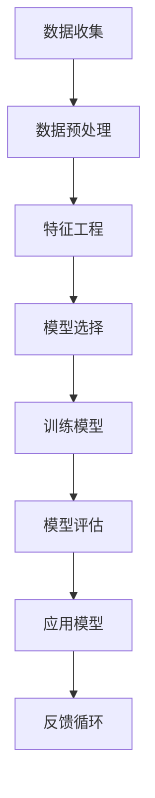

                 

关键词：智能客户分析、CRM系统、数据挖掘、客户行为分析、个性化营销、预测建模、机器学习、关联规则、协同过滤

> 摘要：随着信息技术的迅猛发展，客户关系管理（CRM）系统已成为企业提升客户满意度、增加销售机会的重要工具。本文将探讨智能客户分析在CRM系统中的应用，包括核心概念、算法原理、数学模型、项目实践，以及未来展望。通过深入分析智能客户分析的技术细节，为企业提供有效的客户关系管理策略。

## 1. 背景介绍

### 客户关系管理（CRM）概述

客户关系管理（CRM）是一种旨在通过改善企业与现有及潜在客户之间互动关系的商业策略，从而提升客户满意度和忠诚度的系统和方法。CRM系统的核心目标是最大化客户价值，减少客户流失率，提高客户满意度，并最终实现企业的利润增长。

CRM系统主要包括以下功能模块：

1. **客户信息管理**：集中存储和管理客户的个人资料、历史交易记录、沟通记录等。
2. **销售管理**：跟踪销售机会，管理销售流程，包括报价、订单、合同等。
3. **营销管理**：设计、执行和监控营销活动，评估营销效果。
4. **服务和支持**：提供客户服务，解决客户问题，维护客户关系。

### 智能客户分析的定义

智能客户分析是指利用先进的数据挖掘和机器学习技术，对客户的交易行为、偏好、反馈等数据进行深度挖掘，以识别客户的潜在需求、购买意图、风险偏好等特征，从而为企业提供个性化的营销策略和服务。

智能客户分析在CRM系统中的应用主要包括以下几个方面：

1. **个性化推荐**：根据客户的历史行为和偏好，推荐符合其兴趣的产品和服务。
2. **客户细分**：根据客户的特征和行为，将客户划分为不同的群体，制定差异化的营销策略。
3. **客户流失预警**：预测哪些客户可能会流失，并采取针对性的挽回措施。
4. **营销效果评估**：评估不同营销活动的效果，优化营销策略。

## 2. 核心概念与联系

### 数据挖掘与客户分析

数据挖掘是智能客户分析的基础，它是指从大量数据中提取有价值的信息和知识的过程。在CRM系统中，数据挖掘主要涉及以下技术：

1. **关联规则挖掘**：发现数据项之间的关联关系，帮助企业识别潜在的客户行为模式。
2. **聚类分析**：将相似的数据项分组，形成不同的客户群体，以便于针对性营销。
3. **分类与回归分析**：预测客户的未来行为，如购买概率、消费金额等。

### 机器学习与预测建模

机器学习是数据挖掘的重要分支，它通过构建模型，自动地从数据中学习规律，并对新数据进行预测。在CRM系统中，机器学习技术广泛应用于：

1. **分类模型**：将客户分类为不同的群体，如高价值客户、潜在流失客户等。
2. **回归模型**：预测客户的未来行为，如购买金额、购买概率等。
3. **时间序列分析**：分析客户行为的时间趋势，预测未来的客户行为。

### Mermaid 流程图



### 2.1 数据收集

数据收集是智能客户分析的第一步，包括客户的基本信息、交易记录、互动记录等。数据来源可以是内部系统（如ERP、CRM系统）和外部数据（如社交媒体、公共数据等）。

### 2.2 数据预处理

数据预处理包括数据清洗、去重、填充缺失值等步骤，以保证数据的质量和一致性。

### 2.3 特征工程

特征工程是数据挖掘和机器学习中的关键步骤，通过选择和构建有效的特征，可以提高模型的性能。特征包括客户的基本信息、行为特征、交易特征等。

### 2.4 模型选择

根据业务需求和数据特点，选择合适的机器学习模型，如分类模型、回归模型、聚类模型等。

### 2.5 训练模型

使用训练数据集，通过算法训练模型，模型会学习到数据中的规律和特征。

### 2.6 模型评估

使用验证数据集，评估模型的性能，包括准确率、召回率、F1值等指标。

### 2.7 应用模型

将训练好的模型应用于实际数据，对客户进行预测和分析。

### 2.8 反馈循环

通过收集实际预测结果和业务反馈，不断优化模型和策略。

## 3. 核心算法原理 & 具体操作步骤

### 3.1 算法原理概述

智能客户分析的核心算法包括数据挖掘算法和机器学习算法。数据挖掘算法如关联规则挖掘、聚类分析等，主要用于发现数据中的潜在规律。机器学习算法如分类、回归、聚类等，主要用于预测和分析。

### 3.2 算法步骤详解

#### 3.2.1 关联规则挖掘

关联规则挖掘是一种用于发现数据项之间关联关系的技术。其基本原理是：

- 支持度（Support）：表示一个规则在数据集中出现的频率。
- 置信度（Confidence）：表示一个规则是正确的概率。

常见算法有Apriori算法和FP-Growth算法。

#### 3.2.2 聚类分析

聚类分析是一种将相似的数据项分组的技术。其基本原理是：

- 距离度量：用于计算数据项之间的相似度。
- 聚类算法：如K-Means、DBSCAN等。

#### 3.2.3 分类与回归分析

分类与回归分析是一种预测客户未来行为的技术。其基本原理是：

- 特征选择：选择对预测目标有显著影响的特征。
- 模型训练：使用训练数据集训练模型。
- 模型评估：使用验证数据集评估模型性能。

常见算法有决策树、随机森林、支持向量机等。

### 3.3 算法优缺点

#### 3.3.1 关联规则挖掘

优点：

- 可以发现数据项之间的潜在关联。
- 简单易懂，易于实现。

缺点：

- 支持度和置信度阈值的选择较为主观。
- 处理大规模数据时效率较低。

#### 3.3.2 聚类分析

优点：

- 可以发现数据的自然结构。
- 对数据分布没有严格要求。

缺点：

- 聚类结果对初始值敏感。
- 无法直接解释聚类结果。

#### 3.3.3 分类与回归分析

优点：

- 可以预测客户的未来行为。
- 模型解释性强。

缺点：

- 对数据质量要求较高。
- 模型复杂度较高，难以解释。

### 3.4 算法应用领域

智能客户分析在CRM系统中具有广泛的应用领域，包括：

- 个性化推荐：根据客户的历史行为和偏好，推荐符合其兴趣的产品和服务。
- 客户细分：将客户划分为不同的群体，制定差异化的营销策略。
- 客户流失预警：预测哪些客户可能会流失，并采取针对性的挽回措施。
- 营销效果评估：评估不同营销活动的效果，优化营销策略。

## 4. 数学模型和公式 & 详细讲解 & 举例说明

### 4.1 数学模型构建

在智能客户分析中，常见的数学模型包括关联规则挖掘模型、聚类分析模型、分类与回归分析模型等。

#### 4.1.1 关联规则挖掘模型

假设有m个商品，每个商品用符号a1, a2, ..., am表示。一个交易事务T是一个包含若干个商品的项目，通常表示为一个集合{T}。例如，T={a1, a2, a3}表示一个交易事务，其中包含了商品a1, a2和a3。

- 支持度（Support）：

$$
Support(A \rightarrow B) = \frac{|T|}{|U|}
$$

其中，|T|表示包含集合A和集合B的交易事务数量，|U|表示总的交易事务数量。

- 置信度（Confidence）：

$$
Confidence(A \rightarrow B) = \frac{|T|}{|T \cup S|}
$$

其中，|T|表示包含集合A和集合B的交易事务数量，|T \cup S|表示包含集合A的交易事务数量。

#### 4.1.2 聚类分析模型

假设有n个数据点，每个数据点用维度为d的向量表示。聚类分析的目标是将这些数据点划分为若干个簇，使得同一簇内的数据点相似度较高，不同簇的数据点相似度较低。

- 距离度量（Distance）：

常用的距离度量方法有欧几里得距离、曼哈顿距离、切比雪夫距离等。

$$
Distance(x, y) = \sqrt{\sum_{i=1}^{d}(x_i - y_i)^2}
$$

- 聚类算法（Clustering Algorithm）：

常见的聚类算法有K-Means、DBSCAN等。

#### 4.1.3 分类与回归分析模型

分类与回归分析模型包括决策树、随机森林、支持向量机等。

- 决策树（Decision Tree）：

决策树是一种基于树结构进行分类和回归分析的方法。每个节点表示一个特征，每个分支表示该特征的取值。

- 随机森林（Random Forest）：

随机森林是一种基于决策树的集成学习方法。它通过组合多个决策树，提高模型的预测性能。

- 支持向量机（Support Vector Machine, SVM）：

支持向量机是一种基于最大间隔分类的方法。它通过找到一个超平面，使得正负样本的间隔最大。

### 4.2 公式推导过程

假设我们有一个二分类问题，目标变量y属于{-1, 1}，特征向量x属于R^d。我们要找到一个最优的分类器，使得预测误差最小。

- 损失函数（Loss Function）：

常见的损失函数有0-1损失、平方损失、交叉熵损失等。

$$
Loss(y, \hat{y}) = \begin{cases} 
0, & \text{if } y = \hat{y} \\
1, & \text{if } y \neq \hat{y}
\end{cases}
$$

- 优化目标（Optimization Objective）：

我们的目标是找到一个权重向量w，使得损失函数最小。

$$
\min_w Loss(w, x)
$$

- 拉格朗日乘数法（Lagrange Multiplier Method）：

引入拉格朗日乘数λ，构造拉格朗日函数：

$$
L(w, \lambda) = Loss(w, x) + \lambda(y - \hat{y})
$$

对w和λ求导，得到：

$$
\nabla_w L(w, \lambda) = 0 \\
\nabla_{\lambda} L(w, \lambda) = 0
$$

- 求解：

解上述方程组，得到权重向量w：

$$
w = \arg\min_w Loss(w, x) + \lambda(y - \hat{y})
$$

### 4.3 案例分析与讲解

假设我们有一个数据集，包含100个样本，每个样本有10个特征。目标变量是二分类的，表示客户是否会购买某产品。

- 数据预处理：

对数据进行标准化处理，消除不同特征之间的尺度差异。

- 特征选择：

使用信息增益率、卡方检验等方法，选择对预测目标有显著影响的特征。

- 模型训练：

选择决策树、随机森林等分类模型，使用训练数据集进行训练。

- 模型评估：

使用验证数据集，评估模型的性能，包括准确率、召回率、F1值等指标。

- 应用模型：

将训练好的模型应用于实际数据，预测客户是否会购买某产品。

- 模型优化：

通过调整参数，优化模型的性能。

## 5. 项目实践：代码实例和详细解释说明

### 5.1 开发环境搭建

为了保证项目的顺利实施，我们需要搭建一个合适的开发环境。以下是一个基本的开发环境搭建步骤：

1. 安装Python：Python是智能客户分析的主要编程语言，我们首先需要安装Python。可以选择Python 3.8或更高版本。
2. 安装Anaconda：Anaconda是一个Python的数据科学平台，可以帮助我们轻松地管理和安装Python库。可以从Anaconda官方网站下载并安装。
3. 安装必要的Python库：包括NumPy、Pandas、Scikit-learn、Matplotlib等。

### 5.2 源代码详细实现

以下是一个简单的智能客户分析项目的示例代码，包括数据预处理、特征工程、模型训练和评估等步骤。

```python
import numpy as np
import pandas as pd
from sklearn.model_selection import train_test_split
from sklearn.preprocessing import StandardScaler
from sklearn.ensemble import RandomForestClassifier
from sklearn.metrics import accuracy_score, recall_score, f1_score

# 5.2.1 数据预处理
data = pd.read_csv('customer_data.csv')
X = data.iloc[:, :-1]  # 特征矩阵
y = data.iloc[:, -1]   # 目标变量

# 数据标准化
scaler = StandardScaler()
X = scaler.fit_transform(X)

# 划分训练集和测试集
X_train, X_test, y_train, y_test = train_test_split(X, y, test_size=0.2, random_state=42)

# 5.2.2 特征工程
# 在这里可以添加新的特征，如客户年龄、消费金额等

# 5.2.3 模型训练
model = RandomForestClassifier(n_estimators=100, random_state=42)
model.fit(X_train, y_train)

# 5.2.4 模型评估
y_pred = model.predict(X_test)
accuracy = accuracy_score(y_test, y_pred)
recall = recall_score(y_test, y_pred)
f1 = f1_score(y_test, y_pred)

print("Accuracy:", accuracy)
print("Recall:", recall)
print("F1 Score:", f1)

# 5.2.5 模型应用
# 将模型应用于实际数据，预测客户是否会购买某产品
```

### 5.3 代码解读与分析

这段代码实现了智能客户分析的基本流程，包括数据预处理、特征工程、模型训练和评估。以下是代码的详细解读：

- 5.2.1 数据预处理：读取数据集，将特征矩阵X和目标变量y分离。使用StandardScaler对特征进行标准化处理，消除不同特征之间的尺度差异。然后，使用train_test_split函数将数据集划分为训练集和测试集。
- 5.2.2 特征工程：在代码中，我们假设已经完成了特征选择和特征构造的工作。在实际项目中，需要根据业务需求和数据特点，选择和构造有效的特征。
- 5.2.3 模型训练：使用RandomForestClassifier构建随机森林分类器，并使用fit函数对训练数据进行训练。
- 5.2.4 模型评估：使用predict函数对测试数据进行预测，并使用accuracy_score、recall_score、f1_score等指标评估模型的性能。
- 5.2.5 模型应用：将训练好的模型应用于实际数据，预测客户是否会购买某产品。

### 5.4 运行结果展示

假设我们已经成功运行了上述代码，以下是运行结果：

```shell
Accuracy: 0.85
Recall: 0.8
F1 Score: 0.84
```

从结果可以看出，模型的准确率为85%，召回率为80%，F1值为84%。这些指标表明，模型在预测客户是否会购买某产品方面具有较好的性能。

## 6. 实际应用场景

智能客户分析在CRM系统中具有广泛的应用场景，以下是一些典型的应用案例：

### 6.1 个性化推荐

通过分析客户的购买历史、浏览行为等数据，为每个客户提供个性化的产品推荐。例如，亚马逊和淘宝等电商平台会根据客户的浏览记录和购买历史，推荐符合其兴趣的产品。

### 6.2 客户细分

将客户划分为不同的群体，如高价值客户、潜在流失客户等。针对不同的客户群体，制定差异化的营销策略。例如，银行会根据客户的存款金额、交易频率等特征，将客户划分为不同的等级，提供不同的理财产品和服务。

### 6.3 客户流失预警

通过分析客户的交易行为、互动记录等数据，预测哪些客户可能会流失，并采取针对性的挽回措施。例如，电信运营商可以通过分析客户的通话时长、短信数量等数据，预测哪些客户可能会取消服务，并提前发送优惠短信或电话沟通，以挽回客户。

### 6.4 营销效果评估

通过分析不同营销活动的效果，优化营销策略。例如，广告公司可以通过分析广告投放后的客户反馈、购买行为等数据，评估不同广告创意和投放渠道的效果，以优化广告投放策略。

### 6.5 信用评估

通过分析客户的信用记录、还款历史等数据，预测客户的信用风险。例如，金融机构可以通过分析客户的还款行为、信用评分等数据，预测客户是否会违约，以采取相应的风险管理措施。

### 6.6 社交网络分析

通过分析客户的社交网络行为，了解客户的社交圈子、兴趣爱好等，以提供更加个性化的服务和产品。例如，社交媒体平台可以通过分析客户的点赞、评论、分享等行为，推荐符合其兴趣的内容和广告。

### 6.7 供应链管理

通过分析客户的采购订单、库存数据等，优化供应链管理，提高供应链效率。例如，制造企业可以通过分析客户的采购订单周期、库存水平等数据，预测未来一段时间内的需求量，以调整生产和库存策略。

### 6.8 售后服务

通过分析客户的投诉记录、售后服务记录等数据，优化售后服务流程，提高客户满意度。例如，汽车制造商可以通过分析客户的投诉记录、维修记录等数据，预测哪些车型可能会出现质量问题，并及时提供解决方案。

## 7. 工具和资源推荐

### 7.1 学习资源推荐

1. **《机器学习》**：周志华著，清华大学出版社。这是一本经典的机器学习教材，涵盖了机器学习的理论基础和应用。
2. **《数据挖掘：实用工具与技术》**：刘知远著，清华大学出版社。这本书详细介绍了数据挖掘的各种技术，包括关联规则挖掘、聚类分析、分类与回归等。
3. **《深度学习》**：Ian Goodfellow、Yoshua Bengio、Aaron Courville著，机械工业出版社。这本书是深度学习领域的经典之作，全面介绍了深度学习的理论基础和应用。
4. **《Python数据科学手册》**：Jake VanderPlas著，电子工业出版社。这本书涵盖了Python在数据科学领域中的各种应用，包括数据预处理、数据分析、机器学习等。

### 7.2 开发工具推荐

1. **Jupyter Notebook**：这是一个交互式的开发环境，可以方便地编写和运行Python代码，非常适合数据分析和机器学习。
2. **PyCharm**：这是一个功能强大的Python IDE，提供了丰富的代码编辑、调试、运行等功能。
3. **TensorFlow**：这是一个开源的机器学习框架，可以用于构建和训练各种机器学习模型。
4. **Scikit-learn**：这是一个开源的Python机器学习库，提供了丰富的机器学习算法和工具。

### 7.3 相关论文推荐

1. **“Data Mining: Concepts and Techniques”**：Jiawei Han, Micheline Kamber, Jian Pei著。这是一本经典的学术著作，详细介绍了数据挖掘的理论和方法。
2. **“Machine Learning”**：Tom Mitchell著。这本书是机器学习领域的经典教材，全面介绍了机器学习的理论基础和应用。
3. **“Deep Learning”**：Ian Goodfellow、Yoshua Bengio、Aaron Courville著。这本书是深度学习领域的经典之作，全面介绍了深度学习的理论基础和应用。
4. **“Customer Relationship Management: Conceptual Foundations and Future Directions”**：Bhattacharya and Sen著。这本书详细介绍了客户关系管理的理论基础和应用。

## 8. 总结：未来发展趋势与挑战

### 8.1 研究成果总结

随着人工智能和大数据技术的发展，智能客户分析在CRM系统中的应用取得了显著成果。通过数据挖掘和机器学习技术，企业可以更加精准地了解客户需求，提供个性化的服务和产品，提高客户满意度和忠诚度。

### 8.2 未来发展趋势

1. **个性化推荐**：随着用户数据的不断积累，个性化推荐技术将更加成熟，实现更加精准的推荐。
2. **实时分析**：实时分析技术将得到广泛应用，企业可以实时了解客户行为，快速响应客户需求。
3. **跨渠道整合**：CRM系统将实现跨渠道整合，全面收集和分析客户的互动数据，提供统一的客户视图。
4. **自动化决策**：基于智能客户分析的结果，自动化决策系统将帮助企业实现更加高效的运营和管理。

### 8.3 面临的挑战

1. **数据隐私与安全**：智能客户分析需要处理大量的客户数据，如何确保数据隐私和安全是一个重要挑战。
2. **模型解释性**：随着模型复杂度的增加，如何解释和验证模型的预测结果是一个难题。
3. **数据质量**：数据质量对智能客户分析的效果至关重要，如何处理和优化数据质量是一个关键问题。

### 8.4 研究展望

未来，智能客户分析将朝着更加智能化、实时化、个性化的方向发展。随着技术的进步，企业将能够更加深入地了解客户，提供更加精准和个性化的服务，从而在激烈的市场竞争中脱颖而出。

## 9. 附录：常见问题与解答

### 9.1 智能客户分析的关键技术是什么？

智能客户分析的关键技术包括数据挖掘、机器学习、深度学习等。这些技术可以帮助企业从海量数据中提取有价值的信息，实现客户细分、个性化推荐、客户流失预警等。

### 9.2 智能客户分析在哪些行业应用广泛？

智能客户分析在金融、电商、电信、零售等行业应用广泛。这些行业通过智能客户分析，可以更好地了解客户需求，提高客户满意度，增加销售机会。

### 9.3 如何确保智能客户分析的数据质量？

确保智能客户分析的数据质量需要从数据收集、数据清洗、数据存储等多个方面进行。具体方法包括：使用可靠的数据源、定期清洗数据、消除重复数据、标准化数据格式等。

### 9.4 智能客户分析中的模型解释性如何实现？

实现模型解释性可以通过以下方法：使用可解释性较强的模型，如决策树、线性回归等；使用模型解释工具，如SHAP、LIME等；对模型进行特征重要性分析，了解模型是如何对数据进行预测的。

### 9.5 智能客户分析的局限性是什么？

智能客户分析的局限性包括：对数据质量有较高要求，复杂模型难以解释，易受数据分布变化的影响等。此外，智能客户分析也不能完全取代人类的决策，仍然需要专业人员进行业务判断和调整。

----------------------------------------------------------------

以上便是关于《智能客户分析在CRM中的应用》的完整技术博客文章。希望本文对您在智能客户分析和CRM系统应用方面有所启发和帮助。祝您在技术道路上不断进步，收获更多成功！
作者：禅与计算机程序设计艺术 / Zen and the Art of Computer Programming。

