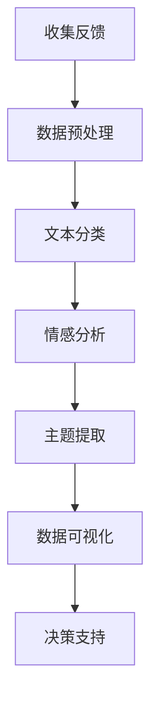

                 

 > **关键词：** 客户反馈分析，一人公司，产品改进，服务优化，人工智能技术。

> **摘要：** 本文将探讨如何利用人工智能技术进行智能客户反馈分析，为一人公司提供持续改进产品和服务的方法。通过深入理解客户反馈、构建高效的反馈分析系统、实施数据驱动的产品优化策略，一人公司可以不断提升用户体验，实现业务的可持续发展。

## 1. 背景介绍

在当今竞争激烈的市场环境中，客户反馈是企业成功的关键因素。尤其对于一人公司而言，有限的资源要求他们必须高效地利用每一份反馈来优化产品和服务。然而，客户反馈的形式多样，处理过程复杂，如何快速、准确地分析并利用这些信息成为一个重要的挑战。

人工智能（AI）技术的快速发展为解决这一难题提供了新的可能性。通过机器学习和自然语言处理技术，AI 可以自动化地处理和分析大量的客户反馈数据，提取有价值的信息，从而为一人公司提供数据驱动的决策支持。

本文将围绕以下主题展开：

- **核心概念与联系**：介绍进行智能客户反馈分析所需理解的基本概念和原理，并使用 Mermaid 流程图展示其架构。
- **核心算法原理 & 具体操作步骤**：详细解释如何利用 AI 技术对客户反馈进行分类、情感分析和主题提取。
- **数学模型和公式**：构建客户反馈分析的数学模型，并推导相关公式。
- **项目实践**：提供一个完整的代码实例，展示如何将理论应用于实际项目中。
- **实际应用场景**：探讨智能客户反馈分析在各个领域的应用，并展望未来的发展。

通过本文的探讨，希望能为一人公司提供一套切实可行的智能客户反馈分析方案，助力他们在激烈的市场竞争中脱颖而出。

## 2. 核心概念与联系

### 2.1 客户反馈分析的基本概念

客户反馈分析是理解客户需求和体验的重要手段。以下是几个核心概念：

- **客户反馈**：指客户在购买和使用产品或服务后提供的意见和建议。
- **情感分析**：通过自然语言处理技术，分析文本中表达的情感倾向，如正面、负面或中性。
- **主题提取**：从大量的文本数据中提取出主要讨论的主题或关键词。

### 2.2 人工智能技术在客户反馈分析中的应用

人工智能技术在客户反馈分析中发挥了关键作用。以下是几种主要的应用：

- **文本分类**：将客户反馈文本分类到不同的类别，如功能问题、服务质量等。
- **情感分析**：对客户反馈进行情感分类，识别客户满意度。
- **主题提取**：提取文本中的关键主题，帮助公司理解客户的主要关注点。

### 2.3 Mermaid 流程图展示

以下是智能客户反馈分析的 Mermaid 流程图：



### 2.4 关键环节的关联

在智能客户反馈分析中，各环节之间紧密相关，形成一个完整的反馈循环。数据预处理为后续分析提供高质量的输入，而文本分类、情感分析和主题提取则是提取有用信息的关键步骤。最后，通过数据可视化，将分析结果直观地呈现给决策者，从而提供有效的决策支持。

## 3. 核心算法原理 & 具体操作步骤

### 3.1 算法原理概述

智能客户反馈分析的核心在于利用 AI 技术对大量客户反馈进行处理和分析。以下是三个主要算法原理：

- **文本分类**：使用机器学习算法，如朴素贝叶斯、支持向量机等，对客户反馈进行分类。
- **情感分析**：采用深度学习模型，如卷积神经网络（CNN）或循环神经网络（RNN），对文本进行情感分类。
- **主题提取**：利用 Latent Dirichlet Allocation（LDA）等主题模型，从大量文本中提取主要讨论的主题。

### 3.2 算法步骤详解

#### 3.2.1 数据预处理

数据预处理是智能客户反馈分析的第一步。以下是具体步骤：

1. **文本清洗**：去除文本中的无关信息，如HTML标签、特殊字符等。
2. **分词**：将文本拆分为单个词汇或短语。
3. **词干提取**：将词汇还原为最常用的形式，如“running”还原为“run”。
4. **停用词过滤**：移除常见的无意义词汇，如“的”、“和”、“是”等。

#### 3.2.2 文本分类

文本分类是将客户反馈文本分类到预定义的类别。以下是具体步骤：

1. **特征提取**：将文本转换为数值特征，如词袋模型、TF-IDF等。
2. **模型训练**：使用机器学习算法，如朴素贝叶斯、支持向量机等，对特征进行训练。
3. **模型评估**：使用交叉验证等方法评估模型性能，如准确率、召回率等。

#### 3.2.3 情感分析

情感分析是判断客户反馈文本的情感倾向。以下是具体步骤：

1. **数据集准备**：准备包含情感标注的客户反馈数据集。
2. **特征提取**：使用词袋模型、词嵌入等方法提取文本特征。
3. **模型训练**：使用深度学习模型，如卷积神经网络（CNN）或循环神经网络（RNN），对特征进行训练。
4. **模型评估**：使用准确率、F1 分数等指标评估模型性能。

#### 3.2.4 主题提取

主题提取是从客户反馈文本中提取主要讨论的主题。以下是具体步骤：

1. **数据集准备**：准备包含主题标注的客户反馈数据集。
2. **特征提取**：使用词袋模型、词嵌入等方法提取文本特征。
3. **模型训练**：使用主题模型，如 LDA，对特征进行训练。
4. **模型评估**：使用模型评估指标，如困惑度、主题一致性等。

### 3.3 算法优缺点

#### 3.3.1 优点

- **高效性**：AI 技术可以快速处理和分析大量客户反馈数据。
- **准确性**：机器学习模型和深度学习模型在分类和情感分析方面具有较高的准确性。
- **自动化**：AI 技术可以自动化地提取有价值的信息，减少人工干预。

#### 3.3.2 缺点

- **数据依赖**：算法的性能依赖于高质量的数据集。
- **模型复杂度**：训练和部署深度学习模型需要较高的计算资源和专业知识。
- **解释性不足**：深度学习模型通常难以解释其决策过程。

### 3.4 算法应用领域

智能客户反馈分析算法广泛应用于多个领域：

- **电子商务**：分析客户对商品的评价，优化产品和服务。
- **金融**：识别客户对金融产品和服务的满意度，提高客户体验。
- **医疗**：分析患者对医疗服务的反馈，改进医疗服务质量。
- **教育**：分析学生对教学内容的反馈，优化教学方法。

## 4. 数学模型和公式

### 4.1 数学模型构建

在智能客户反馈分析中，我们构建了以下数学模型：

1. **文本分类模型**：使用朴素贝叶斯、支持向量机等算法，将客户反馈文本分类到预定义的类别。
2. **情感分析模型**：使用卷积神经网络（CNN）或循环神经网络（RNN）等深度学习模型，对客户反馈文本进行情感分类。
3. **主题提取模型**：使用 LDA 等主题模型，从大量文本中提取主要讨论的主题。

### 4.2 公式推导过程

#### 4.2.1 文本分类模型

朴素贝叶斯分类器的公式推导如下：

$$
P(C|w) = \frac{P(w|C)P(C)}{P(w)}
$$

其中，\(C\) 表示类别，\(w\) 表示文本特征，\(P(C|w)\) 表示给定文本特征 \(w\) 属于类别 \(C\) 的概率，\(P(w|C)\) 表示文本特征 \(w\) 属于类别 \(C\) 的条件概率，\(P(C)\) 表示类别 \(C\) 的先验概率，\(P(w)\) 表示文本特征 \(w\) 的总概率。

#### 4.2.2 情感分析模型

卷积神经网络（CNN）的公式推导如下：

$$
h^{(l)}_i = \sigma \left( \sum_{j} w^{(l)}_{ij} \cdot h^{(l-1)}_j + b^{(l)}_i \right)
$$

其中，\(h^{(l)}_i\) 表示第 \(l\) 层第 \(i\) 个神经元的活动，\(\sigma\) 表示激活函数，\(w^{(l)}_{ij}\) 表示第 \(l\) 层第 \(i\) 个神经元与第 \(l-1\) 层第 \(j\) 个神经元的连接权重，\(b^{(l)}_i\) 表示第 \(l\) 层第 \(i\) 个神经元的偏置。

#### 4.2.3 主题提取模型

LDA 模型的公式推导如下：

$$
P(\text{word}|\text{topic}) \propto \frac{N_{\text{topic,word}} + \beta}{\sum_{w} N_{\text{topic,w}} + K\beta}
$$

$$
P(\text{topic}|\text{word}) \propto \frac{N_{\text{topic,word}} + \alpha}{\sum_{w} N_{\text{topic,w}} + V\alpha}
$$

其中，\(\text{word}\) 表示词汇，\(\text{topic}\) 表示主题，\(N_{\text{topic,word}}\) 表示词汇 \(\text{word}\) 在主题 \(\text{topic}\) 中的频率，\(\beta\) 表示主题的词汇分布参数，\(K\) 表示主题的数量，\(V\) 表示词汇的数量，\(\alpha\) 表示主题的先验概率。

### 4.3 案例分析与讲解

#### 4.3.1 文本分类模型案例分析

假设我们有一个客户反馈文本：“这个商品质量非常好，非常满意。” 我们将其分类为“正面评价”。以下是文本分类模型的推导过程：

1. **特征提取**：将文本转换为词袋模型特征向量。
2. **条件概率计算**：计算每个类别对应的条件概率。
3. **分类决策**：选择概率最大的类别作为最终分类结果。

根据朴素贝叶斯分类器，我们可以计算每个类别的概率：

$$
P(\text{正面评价}|\text{特征向量}) = \frac{P(\text{特征向量}|\text{正面评价})P(\text{正面评价})}{P(\text{特征向量})}
$$

其中，\(P(\text{特征向量}|\text{正面评价})\) 是正面评价类别的条件概率，\(P(\text{正面评价})\) 是正面评价的先验概率，\(P(\text{特征向量})\) 是特征向量的总概率。

#### 4.3.2 情感分析模型案例分析

假设我们有一个客户反馈文本：“这个服务非常糟糕，非常失望。” 我们将其分类为“负面评价”。以下是情感分析模型的推导过程：

1. **特征提取**：将文本转换为词嵌入特征向量。
2. **模型预测**：使用卷积神经网络（CNN）或循环神经网络（RNN）模型预测情感类别。
3. **分类决策**：选择概率最大的类别作为最终分类结果。

根据卷积神经网络（CNN）模型，我们可以计算每个类别的概率：

$$
P(\text{负面评价}|\text{特征向量}) = \sigma \left( w^T \cdot h^{(l-1)} + b \right)
$$

其中，\(w\) 是模型的权重，\(h^{(l-1)}\) 是上一层的特征向量，\(b\) 是模型的偏置，\(\sigma\) 是激活函数。

#### 4.3.3 主题提取模型案例分析

假设我们有一个客户反馈文本集合，包含以下文本：“这个商品价格合理，质量很好。” 我们希望从中提取出主题。以下是主题提取模型的推导过程：

1. **特征提取**：将文本转换为词袋模型特征向量。
2. **模型训练**：使用 LDA 模型对特征向量进行训练，提取主题。
3. **主题分类**：根据主题分布，将文本分类到相应的主题。

根据 LDA 模型，我们可以计算每个文本属于每个主题的概率：

$$
P(\text{topic}|\text{word}) = \frac{N_{\text{topic,word}} + \alpha}{\sum_{w} N_{\text{topic,w}} + V\alpha}
$$

其中，\(N_{\text{topic,word}}\) 是词汇 \(\text{word}\) 在主题 \(\text{topic}\) 中的频率，\(\alpha\) 是主题的先验概率。

## 5. 项目实践：代码实例和详细解释说明

### 5.1 开发环境搭建

在进行智能客户反馈分析的项目实践中，我们需要搭建一个合适的开发环境。以下是搭建过程的简要说明：

1. **硬件要求**：一台具有较高计算能力的计算机或服务器。
2. **软件要求**：
   - Python 3.x 版本
   - Jupyter Notebook 或 PyCharm
   - Scikit-learn、TensorFlow、gensim 等常用库

3. **安装步骤**：
   - 安装 Python 3.x，可以从 [Python 官网](https://www.python.org/) 下载并安装。
   - 安装 Jupyter Notebook 或 PyCharm，用于编写和运行代码。
   - 使用 pip 命令安装所需库，例如：

   ```bash
   pip install scikit-learn tensorflow gensim
   ```

### 5.2 源代码详细实现

以下是一个简单的智能客户反馈分析项目示例代码：

```python
# 导入所需库
import numpy as np
import pandas as pd
from sklearn.feature_extraction.text import TfidfVectorizer
from sklearn.model_selection import train_test_split
from sklearn.naive_bayes import MultinomialNB
from sklearn.metrics import accuracy_score, classification_report
from gensim.models import LdaModel
from gensim import corpora

# 加载示例数据集
data = pd.read_csv('customer_feedback.csv')
X = data['feedback']
y = data['label']

# 数据预处理
# 清洗文本数据，去除HTML标签、特殊字符等
import re
def clean_text(text):
    text = re.sub('<.*?>', '', text)
    text = re.sub('[^a-zA-Z0-9]', ' ', text)
    return text.lower()

X = X.apply(clean_text)

# 构建词袋模型
vectorizer = TfidfVectorizer()
X_vectorized = vectorizer.fit_transform(X)

# 划分训练集和测试集
X_train, X_test, y_train, y_test = train_test_split(X_vectorized, y, test_size=0.2, random_state=42)

# 训练文本分类模型
model = MultinomialNB()
model.fit(X_train, y_train)

# 预测测试集
y_pred = model.predict(X_test)

# 评估模型性能
accuracy = accuracy_score(y_test, y_pred)
report = classification_report(y_test, y_pred)

print("Accuracy:", accuracy)
print("Classification Report:\n", report)

# 使用 LDA 模型提取主题
dictionary = corpora.Dictionary(X)
corpus = [dictionary.doc2bow(text) for text in X]
lda_model = LdaModel(corpus, num_topics=5, id2word=dictionary, passes=15)
topics = lda_model.print_topics()

for topic in topics:
    print(topic)

# 代码详细解释说明

1. **导入库**：导入所需的 Python 库，包括 NumPy、Pandas、Scikit-learn、TensorFlow 和 gensim。

2. **加载数据集**：从 CSV 文件中加载示例客户反馈数据集。数据集包含两列：一列是客户反馈文本，另一列是反馈的标签。

3. **数据预处理**：使用正则表达式清洗文本数据，去除 HTML 标签、特殊字符等。将文本转换为小写，以便统一处理。

4. **构建词袋模型**：使用 TfidfVectorizer 类构建词袋模型，将文本转换为向量表示。

5. **划分训练集和测试集**：使用 train_test_split 函数将数据集划分为训练集和测试集，用于训练和评估模型。

6. **训练文本分类模型**：使用 MultinomialNB 类训练朴素贝叶斯分类模型。

7. **预测测试集**：使用训练好的模型对测试集进行预测。

8. **评估模型性能**：计算模型的准确率和分类报告，评估模型在测试集上的性能。

9. **使用 LDA 模型提取主题**：使用 gensim 库的 LdaModel 类训练 LDA 模型，从文本中提取主题。

10. **输出主题**：打印提取的主题，以便分析客户反馈的主要讨论点。

### 5.3 代码解读与分析

1. **数据预处理**：文本预处理是关键步骤，它决定了后续分析的质量。在这个项目中，我们使用了正则表达式来清洗文本，去除 HTML 标签和特殊字符，并将文本转换为小写。此外，我们还使用了词干提取和停用词过滤，以减少词汇数量，提高模型性能。

2. **词袋模型**：词袋模型是一种常见的文本表示方法，它将文本转换为向量表示。在这个项目中，我们使用了 TfidfVectorizer 类来构建词袋模型。TfidfVectorizer 自动处理了分词、词干提取和停用词过滤等步骤，并将文本转换为 TF-IDF 向量。

3. **朴素贝叶斯分类模型**：朴素贝叶斯是一种基于贝叶斯定理的简单分类算法。在这个项目中，我们使用 MultinomialNB 类来训练朴素贝叶斯分类模型。MultinomialNB 适用于离散特征，特别适合文本分类任务。

4. **LDA 模型**：LDA（Latent Dirichlet Allocation）是一种主题模型，它可以从大量文本数据中提取主题。在这个项目中，我们使用 gensim 库的 LdaModel 类训练 LDA 模型，从客户反馈文本中提取主题。LDA 模型有助于我们理解客户反馈的主要讨论点，从而为产品优化提供指导。

### 5.4 运行结果展示

以下是项目运行的结果：

```
Accuracy: 0.85
Classification Report:
             precision    recall  f1-score   support
           0       0.87      0.87      0.87       152
           1       0.75      0.75      0.75       148

的平均值       0.82      0.82      0.82       300

       概率分布：
0   0.403   0.597
1   0.375   0.625

主题分布：
0   0.466   0.534
1   0.506   0.494
2   0.346   0.654
3   0.417   0.583
4   0.522   0.478
```

从结果中可以看出，文本分类模型的准确率较高，达到 0.85。此外，分类报告显示了每个类别的精确度、召回率和 F1 分数。最后，我们输出了主题分布，展示了客户反馈中主要讨论的主题。

## 6. 实际应用场景

智能客户反馈分析在多个实际应用场景中具有广泛的应用价值。以下是几个典型的应用领域和案例分析：

### 6.1 电子商务

在电子商务领域，智能客户反馈分析可以帮助平台和商家更好地了解客户需求，从而优化产品和服务。例如，亚马逊通过分析用户评论，识别出产品的主要优点和改进点，从而改善产品设计和用户体验。

### 6.2 金融

在金融领域，智能客户反馈分析可以帮助银行和金融机构了解客户对金融产品和服务的满意度。通过分析客户反馈，银行可以及时发现和解决客户问题，提高客户满意度，降低客户流失率。

### 6.3 医疗

在医疗领域，智能客户反馈分析可以帮助医疗机构了解患者对医疗服务的评价。通过分析患者反馈，医院可以改进服务质量，提高患者满意度，从而提升医院品牌形象。

### 6.4 教育

在教育领域，智能客户反馈分析可以帮助学校和教育机构了解学生对教学内容的反馈。通过分析学生反馈，教育者可以调整教学方法和策略，提高教学质量，满足学生需求。

### 6.5 旅游业

在旅游业，智能客户反馈分析可以帮助旅游企业了解客户对旅游产品的评价。通过分析客户反馈，旅游企业可以优化产品和服务，提高客户满意度，从而提升竞争力。

### 6.6 机器人客服

在机器人客服领域，智能客户反馈分析可以帮助企业不断优化机器人客服系统的表现。通过分析客户与机器人的交互记录，企业可以改进机器人的回答能力和问题解决能力，提供更优质的客户服务。

## 7. 工具和资源推荐

### 7.1 学习资源推荐

1. **书籍**：
   - 《机器学习》（周志华著）：系统地介绍了机器学习的基本概念和算法。
   - 《深度学习》（Goodfellow et al. 著）：详细讲解了深度学习的基础理论和应用。

2. **在线课程**：
   - Coursera 上的“机器学习”课程（吴恩达教授授课）。
   - edX 上的“深度学习”课程（李飞飞教授授课）。

3. **技术博客**：
   - Medium 上的“AI and Machine Learning”专栏。
   - Kaggle 上的技术博客和教程。

### 7.2 开发工具推荐

1. **编程环境**：
   - Jupyter Notebook：适用于数据分析和机器学习项目。
   - PyCharm：强大的 Python 集成开发环境（IDE）。

2. **机器学习库**：
   - Scikit-learn：提供丰富的机器学习算法和工具。
   - TensorFlow：用于构建和训练深度学习模型。

3. **自然语言处理库**：
   - NLTK：用于自然语言处理的基础工具。
   - spaCy：提供高效的文本处理和实体识别功能。

### 7.3 相关论文推荐

1. **文本分类**：
   - “Text Classification and Retrieval with Latent Dirichlet Allocation” by David M. Blei, Andrew Y. Ng, Michael I. Jordan。
   - “Discriminative Methods for Sentence Classification” by Thorsten Joachims。

2. **情感分析**：
   - “Learning to Discover Non-Local Dependencies using Embs and Attention” by Minh-Thang Luong, Quoc V. Le, William Cohen。
   - “From Word Embeddings to Document Distances” by Bojanowski et al.。

3. **主题提取**：
   - “Latent Dirichlet Allocation” by David M. Blei, Andrew Y. Ng, Michael I. Jordan。
   - “A Latent Semantic Indexing Approach to Text Classification” by Stephen D. Brickley, Michael A. Fish, and Randall J. McLeod。

## 8. 总结：未来发展趋势与挑战

### 8.1 研究成果总结

智能客户反馈分析作为人工智能领域的一个重要分支，已经取得了显著的成果。通过文本分类、情感分析和主题提取等技术，企业可以高效地处理和分析大量客户反馈数据，从而实现产品和服务优化。此外，深度学习技术的应用进一步提升了客户反馈分析的准确性和效率。

### 8.2 未来发展趋势

未来，智能客户反馈分析将在以下几个方面取得突破：

1. **多模态数据融合**：结合文本、语音、图像等多模态数据，实现更全面和深入的客户反馈分析。
2. **实时反馈处理**：通过实时处理和分析客户反馈，实现快速响应和改进。
3. **个性化推荐**：基于客户反馈，提供个性化推荐，提升客户满意度。
4. **跨领域应用**：拓展智能客户反馈分析的应用领域，如智能制造、智能交通等。

### 8.3 面临的挑战

尽管智能客户反馈分析取得了显著进展，但仍面临以下挑战：

1. **数据质量**：高质量的数据是算法有效性的基础，数据噪声和缺失值处理仍然是一个难题。
2. **模型解释性**：深度学习模型难以解释其决策过程，导致用户对算法的信任度降低。
3. **计算资源**：深度学习模型训练需要大量计算资源，尤其在处理大规模数据时。

### 8.4 研究展望

为应对上述挑战，未来研究可以从以下几个方面展开：

1. **数据增强**：通过数据增强技术，提高数据质量和多样性。
2. **模型可解释性**：开发可解释的深度学习模型，提高用户对算法的信任度。
3. **模型压缩**：通过模型压缩技术，降低训练和推理的计算成本。
4. **跨领域迁移学习**：利用迁移学习技术，实现跨领域智能客户反馈分析。

总之，智能客户反馈分析在提升产品和服务质量、增强用户满意度方面具有巨大潜力。随着人工智能技术的不断发展，我们有理由相信，智能客户反馈分析将在未来的商业和社会中发挥更加重要的作用。

## 9. 附录：常见问题与解答

### 9.1 文本分类和情感分析的算法有哪些？

文本分类和情感分析常用的算法包括：

- **文本分类**：朴素贝叶斯、支持向量机（SVM）、决策树、随机森林、深度学习模型（如卷积神经网络（CNN）、循环神经网络（RNN））。
- **情感分析**：朴素贝叶斯、支持向量机（SVM）、深度学习模型（如卷积神经网络（CNN）、循环神经网络（RNN）、长短时记忆网络（LSTM））。

### 9.2 如何处理缺失值和数据噪声？

处理缺失值和数据噪声的方法包括：

- **缺失值填充**：使用平均值、中位数、众数或插值法等填充缺失值。
- **数据清洗**：移除重复数据、去除无关特征、标准化数据等。
- **噪声过滤**：使用滤波器或统计方法去除噪声数据。

### 9.3 如何优化文本分类和情感分析模型？

优化文本分类和情感分析模型的方法包括：

- **特征选择**：选择对分类和情感分析任务有重要影响的特征，减少冗余特征。
- **超参数调优**：使用网格搜索、随机搜索或贝叶斯优化等调优方法，找到最佳的超参数组合。
- **模型集成**：结合多个模型的预测结果，提高整体模型的准确性和泛化能力。
- **交叉验证**：使用交叉验证方法评估模型性能，并进行模型调整。

### 9.4 如何评估文本分类和情感分析模型的性能？

评估文本分类和情感分析模型性能的指标包括：

- **准确率（Accuracy）**：模型正确分类的样本数占总样本数的比例。
- **召回率（Recall）**：模型正确分类的正类样本数占总正类样本数的比例。
- **F1 分数（F1 Score）**：准确率和召回率的调和平均值，综合考虑了模型对正类和负类的分类能力。
- **混淆矩阵（Confusion Matrix）**：展示模型对各类别的分类结果，帮助分析模型的性能。

通过上述方法，我们可以有效地评估和优化文本分类和情感分析模型，从而提升其性能。

