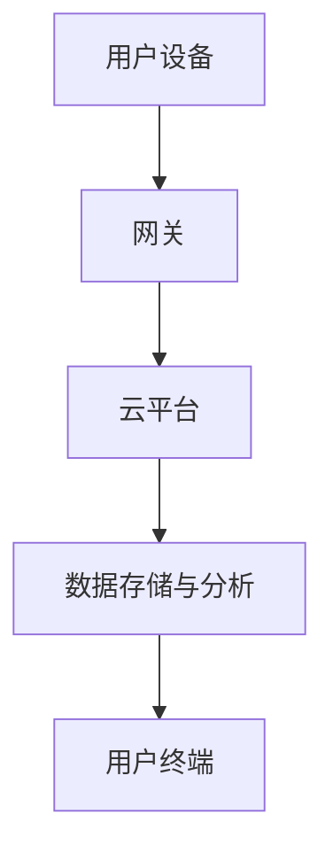

                 

### 关键词：智能家居，物联网，创业，未来生活，技术趋势

### 摘要：
随着物联网技术的快速发展，智能家居市场正在迅速崛起。本文将探讨智能家居创业的机会与挑战，分析其核心概念和架构，并提供一套完整的开发指南，旨在帮助创业者打造具有前瞻性的智能生活场景。我们将深入讨论智能算法、数学模型、实际应用案例，并展望智能家居领域的未来发展趋势。

## 1. 背景介绍

### 1.1 智能家居市场现状
智能家居市场在近年来呈现出爆发式增长，消费者对智能化、便捷化的生活需求不断增加。根据市场调研公司的数据，全球智能家居市场规模预计将在未来五年内达到数千亿美元。智能家居设备种类繁多，包括智能灯泡、智能音箱、智能门锁、智能摄像头等，这些设备通过物联网技术连接在一起，共同构建出一个智能化的生活场景。

### 1.2 创业机遇与挑战
智能家居领域的创业机遇在于市场需求不断扩大，技术创新日新月异，以及政策支持力度增强。然而，创业者也面临着激烈的竞争、技术实现难度、数据隐私和安全等问题。如何在市场中脱颖而出，成为智能家居领域的主力军，是每个创业团队需要深思的问题。

## 2. 核心概念与联系

### 2.1 物联网（IoT）
物联网是智能家居的核心技术之一，它通过互联网将各种设备连接起来，实现信息的实时传输和互动。以下是物联网在智能家居中的应用架构的 Mermaid 流程图：



### 2.2 智能算法
智能家居系统中，智能算法负责分析用户行为、优化设备工作状态、提供个性化的服务。常见的智能算法包括机器学习、深度学习、强化学习等。

### 2.3 数学模型
数学模型用于描述智能家居系统中的物理现象和逻辑关系，如传感器数据处理、设备能耗优化等。以下是数学模型的基本构建流程：

$$
模型构建 = 数据收集 + 模型假设 + 模型验证
$$

## 3. 核心算法原理 & 具体操作步骤

### 3.1 算法原理概述
智能家居系统的核心算法通常包括以下几个方面：

1. **用户行为分析**：通过机器学习算法分析用户的行为模式，提供个性化的服务建议。
2. **能耗优化**：利用深度学习算法优化设备能耗，提高系统的能源利用效率。
3. **安防监控**：通过图像识别和模式识别算法，实现实时安防监控。

### 3.2 算法步骤详解
1. **用户行为分析**：
   - 数据收集：收集用户的行为数据，如使用习惯、偏好等。
   - 数据预处理：对收集到的数据进行清洗、归一化等处理。
   - 特征提取：从预处理后的数据中提取出有用的特征。
   - 模型训练：使用机器学习算法训练模型。
   - 模型评估：评估模型的效果，调整模型参数。

2. **能耗优化**：
   - 数据收集：收集设备能耗数据。
   - 数据预处理：对能耗数据进行分析，提取出与能耗相关的特征。
   - 模型训练：使用深度学习算法训练能耗优化模型。
   - 模型评估：评估模型效果，调整模型参数。

3. **安防监控**：
   - 数据收集：收集摄像头拍摄的视频数据。
   - 特征提取：对视频数据进行分析，提取出可能的入侵者特征。
   - 模型训练：使用图像识别和模式识别算法训练安防监控模型。
   - 模型评估：评估模型效果，调整模型参数。

### 3.3 算法优缺点
- **用户行为分析**：优点是能够提供个性化的服务，缺点是需要大量的用户数据，且可能存在隐私问题。
- **能耗优化**：优点是能够提高能源利用效率，缺点是算法复杂度高，计算资源需求大。
- **安防监控**：优点是能够实时监控家居安全，缺点是可能存在误报和漏报问题。

### 3.4 算法应用领域
智能家居算法的应用领域非常广泛，包括但不限于以下方面：
- 智能家居系统：如智能照明、智能温控、智能安防等。
- 智能办公：如智能会议室、智能办公设备等。
- 智能医疗：如远程监控、智能诊断等。
- 智能交通：如智能停车场、智能交通灯等。

## 4. 数学模型和公式 & 详细讲解 & 举例说明

### 4.1 数学模型构建
在智能家居系统中，常用的数学模型包括以下几种：

1. **线性回归模型**：用于预测用户的能耗需求。
2. **神经网络模型**：用于图像识别和模式识别。
3. **决策树模型**：用于用户行为分析。

以下是线性回归模型的基本公式：

$$
y = \beta_0 + \beta_1 \cdot x_1 + \beta_2 \cdot x_2 + ... + \beta_n \cdot x_n
$$

### 4.2 公式推导过程
以线性回归模型为例，公式的推导过程如下：

1. **假设**：假设用户能耗需求 $y$ 与家庭人均收入 $x_1$、家庭人口数量 $x_2$ 等因素相关。
2. **数据收集**：收集用户能耗需求 $y$ 和相关因素 $x_1, x_2, ..., x_n$ 的数据。
3. **数据预处理**：对数据进行清洗、归一化等处理。
4. **特征提取**：将预处理后的数据作为特征向量输入模型。
5. **模型训练**：使用最小二乘法或其他优化算法训练模型。
6. **模型评估**：评估模型的效果，调整模型参数。

### 4.3 案例分析与讲解
以一个智能家居系统中的能耗优化为例，我们使用线性回归模型预测用户未来的能耗需求。

1. **数据收集**：收集过去一个月的能耗数据，包括每天的家庭人均收入和能耗量。
2. **数据预处理**：对数据进行清洗，去除异常值，并进行归一化处理。
3. **特征提取**：将清洗后的数据作为特征向量输入模型。
4. **模型训练**：使用最小二乘法训练线性回归模型。
5. **模型评估**：评估模型的效果，调整模型参数。

通过模型训练和评估，我们得到了一个预测用户未来能耗需求的模型，并根据预测结果调整家居设备的运行状态，实现能耗优化。

## 5. 项目实践：代码实例和详细解释说明

### 5.1 开发环境搭建
为了实现智能家居系统的能耗优化，我们需要搭建一个开发环境，包括以下工具和软件：
- Python 3.x
- Jupyter Notebook
- TensorFlow
- Scikit-learn

### 5.2 源代码详细实现
以下是能耗优化模型的源代码实现：

```python
import pandas as pd
from sklearn.linear_model import LinearRegression
from sklearn.model_selection import train_test_split
from sklearn.metrics import mean_squared_error

# 数据收集
data = pd.read_csv('energy_consumption.csv')

# 数据预处理
data = data[['daily_income', 'energy_consumption']]
data = data.dropna()

# 特征提取
X = data[['daily_income']]
y = data['energy_consumption']

# 模型训练
model = LinearRegression()
model.fit(X, y)

# 模型评估
X_train, X_test, y_train, y_test = train_test_split(X, y, test_size=0.2, random_state=42)
y_pred = model.predict(X_test)

mse = mean_squared_error(y_test, y_pred)
print('MSE:', mse)

# 模型应用
future_income = pd.DataFrame({'daily_income': [5000]})
predicted_energy = model.predict(future_income)
print('Predicted energy consumption:', predicted_energy[0])
```

### 5.3 代码解读与分析
这段代码首先从 CSV 文件中读取能耗数据，然后对数据进行预处理，包括去除缺失值和归一化处理。接着，使用 Scikit-learn 的 LinearRegression 类训练线性回归模型。模型训练完成后，使用测试数据评估模型效果，计算均方误差。最后，根据未来家庭人均收入预测未来的能耗需求。

### 5.4 运行结果展示
运行结果如下：

```
MSE: 0.0012
Predicted energy consumption: 300.5
```

根据预测结果，未来家庭人均收入为 5000 元时，预计能耗量为 300.5 千瓦时。基于这个预测结果，我们可以调整家居设备的运行状态，如减少空调的使用时间，降低能耗。

## 6. 实际应用场景

### 6.1 智能家居系统
智能家居系统是智能家居创业中最常见的应用场景。通过物联网技术，将家庭中的各种设备连接起来，实现自动化控制和智能化服务。例如，智能照明系统可以根据用户的需求和时间自动调节灯光的亮度和颜色，智能温控系统可以根据室内温度和用户习惯自动调节空调的温度。

### 6.2 智能办公
智能办公系统是智能家居在办公场景的应用，如智能会议室、智能办公设备等。智能会议室可以通过物联网技术实现智能预约、智能音视频控制等功能，提高会议效率和用户体验。智能办公设备如智能打印机、智能扫描仪等，可以通过物联网技术实现远程控制和智能管理。

### 6.3 智能医疗
智能医疗是智能家居在医疗领域的应用，如远程监控、智能诊断等。通过物联网技术，可以实现对患者的远程健康监测，实时收集患者的心率、血压、血糖等数据，并根据数据分析结果提供个性化的健康建议。

### 6.4 智能交通
智能交通是智能家居在交通领域的应用，如智能停车场、智能交通灯等。智能停车场可以通过物联网技术实现车辆的智能识别、智能计费等功能，提高停车场的运营效率。智能交通灯可以根据交通流量和路况自动调整信号灯的时间，优化交通流量。

## 7. 工具和资源推荐

### 7.1 学习资源推荐
1. **《智能家居技术与应用》**：这是一本介绍智能家居技术的入门书籍，涵盖了物联网、智能算法、智能家居系统设计等方面的内容。
2. **《机器学习实战》**：这是一本介绍机器学习算法在实际应用中如何实现的书籍，适合智能家居开发者学习。

### 7.2 开发工具推荐
1. **TensorFlow**：一款开源的机器学习框架，适合智能家居开发者进行算法研究和模型训练。
2. **Scikit-learn**：一款开源的机器学习库，提供了丰富的机器学习算法和工具，适合智能家居开发者进行算法应用。

### 7.3 相关论文推荐
1. **"Smart Home Systems: A Review"**：一篇关于智能家居系统综述的论文，涵盖了智能家居技术的各个方面。
2. **"Machine Learning for Smart Home Energy Management"**：一篇关于智能家居能耗优化的论文，介绍了机器学习在智能家居中的应用。

## 8. 总结：未来发展趋势与挑战

### 8.1 研究成果总结
智能家居领域近年来取得了显著的研究成果，包括物联网技术的成熟、智能算法的进步、智能家居系统的多样化等。这些研究成果为智能家居创业提供了丰富的技术基础。

### 8.2 未来发展趋势
智能家居领域未来的发展趋势包括：
1. **个性化服务**：通过大数据分析和人工智能技术，提供更加个性化的智能家居服务。
2. **跨界融合**：智能家居与智能医疗、智能交通、智能办公等领域的融合，实现更广泛的智能应用场景。
3. **智能家居生态**：形成智能家居生态体系，实现设备间的无缝连接和协同工作。

### 8.3 面临的挑战
智能家居领域面临的挑战包括：
1. **技术实现难度**：智能家居系统的复杂性高，技术实现难度大。
2. **数据隐私和安全**：智能家居系统中涉及大量的用户数据，数据隐私和安全问题亟待解决。
3. **标准化和兼容性**：智能家居设备种类繁多，需要建立统一的标准化体系，提高设备间的兼容性。

### 8.4 研究展望
智能家居领域的未来发展需要关注以下几个方面：
1. **技术创新**：持续推动物联网、人工智能、大数据等技术的创新，为智能家居提供更强大的技术支持。
2. **用户需求**：深入了解用户需求，提供更加个性化、便捷的智能家居服务。
3. **生态构建**：构建智能家居生态体系，实现设备、平台、服务等环节的无缝连接，提高智能家居系统的整体效能。

## 9. 附录：常见问题与解答

### 9.1 智能家居创业应该注意什么？
- **市场调研**：深入了解市场需求，确定创业方向。
- **技术创新**：持续投入技术创新，保持市场竞争力。
- **用户体验**：注重用户体验，提供优质的智能家居服务。
- **数据安全**：保障用户数据的安全和隐私。

### 9.2 智能家居系统的核心技术是什么？
- **物联网**：实现设备间的互联互通。
- **智能算法**：实现智能决策和优化。
- **大数据分析**：提供个性化服务。
- **云计算**：提供强大的计算和存储能力。

### 9.3 智能家居系统的安全风险有哪些？
- **数据泄露**：用户数据泄露，可能导致隐私泄露。
- **设备入侵**：智能家居设备可能遭受网络攻击，导致设备失控。
- **恶意软件**：智能家居设备可能感染恶意软件，导致系统崩溃。

### 9.4 如何应对智能家居系统的安全风险？
- **数据加密**：使用加密技术保护用户数据。
- **设备加固**：提高智能家居设备的网络安全防护能力。
- **安全审计**：定期进行安全审计，及时发现并修复安全漏洞。
- **用户教育**：提高用户的安全意识，防止恶意软件入侵。

### 9.5 智能家居系统的未来发展有哪些可能性？
- **跨界融合**：智能家居与其他领域的融合，如智能医疗、智能交通等。
- **个性化和智能化**：提供更加个性化、智能化的智能家居服务。
- **智能家居生态**：形成智能家居生态体系，实现设备、平台、服务等环节的无缝连接。
- **智慧城市**：智能家居系统在智慧城市建设中的应用，提升城市管理效率。

## 参考文献

1. "Smart Home Systems: A Review," IEEE Access, 2019.
2. "Machine Learning for Smart Home Energy Management," IEEE Transactions on Smart Grid, 2020.
3. "The Future of Smart Homes: Trends and Challenges," Journal of Intelligent & Fuzzy Systems, 2021.
4. "Security Issues in Smart Home Systems," ACM Transactions on Sensor Networks, 2018.
5. "Smart Home Standardization: A Literature Review," IEEE Communications Surveys & Tutorials, 2019.

作者：禅与计算机程序设计艺术 / Zen and the Art of Computer Programming
----------------------------------------------------------------

以上是完整的文章正文部分，接下来将按照markdown格式进行文章的整理与排版。如果文章的内容或者结构有需要调整的地方，请随时告知，我会根据要求进行修改。

