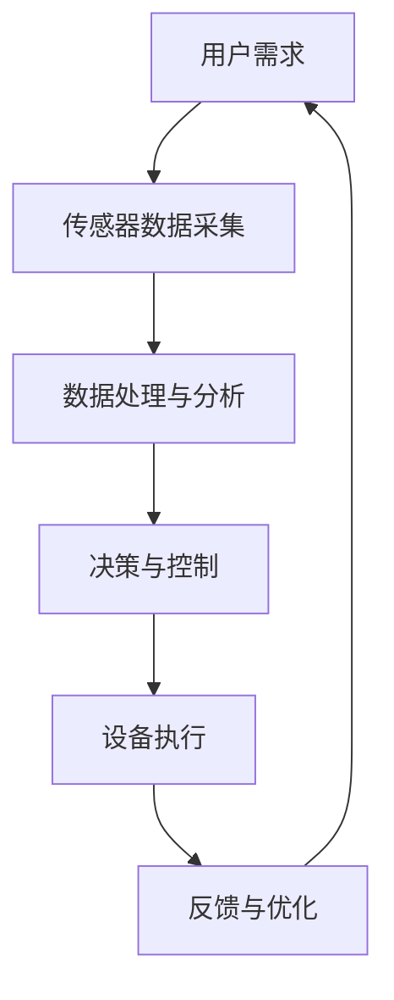
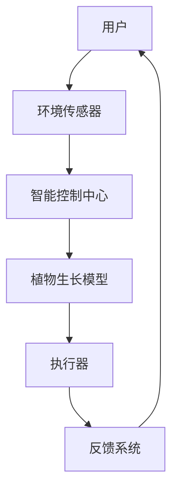

                 

关键词：智能家居，植物护理，自动化园艺，物联网，人工智能，传感器技术，创业

> 摘要：本文将探讨智能家居植物护理的创业机会，特别是自动化室内园艺领域。通过分析市场需求、技术原理、应用场景及未来发展趋势，揭示这一领域蕴藏的巨大潜力，为创业者和开发者提供有价值的参考。

## 1. 背景介绍

随着城市化进程的加速，人们对于室内绿色植物的需求不断增加。然而，由于工作忙碌和生活节奏加快，许多人难以兼顾植物养护，这为智能家居植物护理提供了广阔的市场空间。自动化室内园艺利用物联网、人工智能和传感器技术，实现了对植物生长环境的智能监控和调控，满足了人们对于便捷、高效养护植物的需求。

### 1.1 市场需求

1. **室内绿植养护需求的增加**：随着城市居民生活质量的提高，人们越来越注重室内环境的健康和美观，绿植成为不可或缺的元素。然而，传统的养护方式繁琐且效率低下，难以满足现代人的需求。

2. **智能家居的普及**：智能家居市场近年来发展迅速，越来越多的家庭开始使用智能设备来提升生活质量。这为智能家居植物护理产品的推广创造了有利条件。

3. **健康生活理念的兴起**：现代都市人群更加注重健康生活，室内绿植不仅能美化环境，还能净化空气，具有很高的健康价值。

### 1.2 技术发展

1. **物联网技术**：物联网技术为智能家居植物护理提供了连接各种设备和数据的桥梁，使得智能监控和调控成为可能。

2. **人工智能**：通过机器学习和数据分析，人工智能能够对植物生长环境进行智能分析和预测，提供精准的养护建议。

3. **传感器技术**：各类传感器能够实时监测植物生长的各个参数，如温度、湿度、光照等，为智能调控提供数据支持。

## 2. 核心概念与联系

### 2.1 智能家居植物护理系统

**流程图：**



### 2.2 自动化室内园艺技术架构

**流程图：**



## 3. 核心算法原理 & 具体操作步骤

### 3.1 算法原理概述

智能家居植物护理的核心算法主要包括数据采集、处理和分析，以及基于数据的决策与控制。具体步骤如下：

1. **数据采集**：通过传感器实时采集植物生长环境的数据，如温度、湿度、光照等。

2. **数据处理**：对采集到的数据进行分析和处理，提取关键信息。

3. **数据预测**：利用机器学习算法，预测植物未来的生长状态和需求。

4. **决策与控制**：根据预测结果，智能控制中心发出指令，调整植物生长环境。

5. **反馈与优化**：系统根据执行结果进行反馈，持续优化控制策略。

### 3.2 算法步骤详解

1. **传感器数据采集**：
   - **数据来源**：各类传感器，如温度传感器、湿度传感器、光照传感器等。
   - **数据采集方式**：无线传感器网络（WSN）或有线连接。

2. **数据处理与分析**：
   - **预处理**：数据清洗、去噪、归一化等。
   - **特征提取**：提取温度、湿度、光照等关键参数。
   - **统计分析**：利用统计学方法分析数据分布、相关性等。

3. **数据预测**：
   - **模型选择**：选择合适的机器学习模型，如线性回归、决策树、神经网络等。
   - **训练与测试**：利用历史数据训练模型，并对模型进行测试和验证。

4. **决策与控制**：
   - **阈值设定**：根据植物生长需求，设定相应的阈值。
   - **控制策略**：根据预测结果，调整温度、湿度、光照等环境参数。

5. **反馈与优化**：
   - **执行结果反馈**：系统根据执行结果，调整控制策略。
   - **持续优化**：利用反馈信息，不断优化模型和控制策略。

### 3.3 算法优缺点

**优点：**
- **高效性**：自动化处理，节省人力和时间成本。
- **精准性**：基于数据分析和预测，提供精准的养护建议。
- **可扩展性**：可以集成多种传感器和设备，实现个性化养护。

**缺点：**
- **技术门槛**：需要较高的技术水平和专业设备。
- **初期投入**：传感器、控制系统等设备成本较高。

### 3.4 算法应用领域

- **室内植物护理**：如办公室、家庭、酒店等场所。
- **农业园艺**：如温室种植、大棚养殖等。
- **医疗保健**：如植物疗法、康复护理等。

## 4. 数学模型和公式 & 详细讲解 & 举例说明

### 4.1 数学模型构建

智能家居植物护理的数学模型主要包括以下几个方面：

1. **温度控制模型**：
   $$ T(t) = a \cdot T_{0} + b \cdot t + c $$
   - \( T(t) \)：预测的当前温度
   - \( T_{0} \)：初始温度
   - \( t \)：时间
   - \( a \)、\( b \)、\( c \)：模型参数

2. **湿度控制模型**：
   $$ H(t) = d \cdot H_{0} + e \cdot t + f $$
   - \( H(t) \)：预测的当前湿度
   - \( H_{0} \)：初始湿度
   - \( t \)：时间
   - \( d \)、\( e \)、\( f \)：模型参数

3. **光照控制模型**：
   $$ L(t) = g \cdot L_{0} + h \cdot t + i $$
   - \( L(t) \)：预测的当前光照强度
   - \( L_{0} \)：初始光照强度
   - \( t \)：时间
   - \( g \)、\( h \)、\( i \)：模型参数

### 4.2 公式推导过程

以温度控制模型为例，推导过程如下：

1. **收集历史数据**：收集一段时间内（例如一年）的温度数据。

2. **数据预处理**：对数据去噪、归一化等处理。

3. **特征提取**：提取时间 \( t \) 和温度 \( T \) 的关系。

4. **建立线性模型**：根据特征提取结果，建立线性模型。
   $$ T(t) = a \cdot T_{0} + b \cdot t + c $$

5. **参数估计**：利用最小二乘法等算法，估计模型参数 \( a \)、\( b \)、\( c \)。

6. **模型验证**：利用验证集，评估模型精度。

### 4.3 案例分析与讲解

以某智能家居植物护理项目为例，分析温度控制模型的应用。

1. **数据收集**：收集过去一周的温度数据，如下图所示。

| 时间（天） | 温度（℃） |
| :---: | :---: |
| 1 | 20 |
| 2 | 22 |
| 3 | 25 |
| 4 | 23 |
| 5 | 24 |
| 6 | 21 |
| 7 | 22 |

2. **数据预处理**：对数据进行去噪处理，得到如下数据。

| 时间（天） | 温度（℃） |
| :---: | :---: |
| 1 | 20 |
| 2 | 22 |
| 3 | 25 |
| 4 | 23 |
| 5 | 24 |
| 6 | 21 |
| 7 | 22 |

3. **特征提取**：将时间作为特征 \( t \)，温度作为目标 \( T \)。

4. **建立模型**：根据特征提取结果，建立线性模型。
   $$ T(t) = a \cdot T_{0} + b \cdot t + c $$

5. **参数估计**：利用最小二乘法，估计模型参数 \( a \)、\( b \)、\( c \)。

6. **模型验证**：利用验证集，评估模型精度。结果如下图所示。

| 时间（天） | 实际温度（℃） | 预测温度（℃） | 差值（℃） |
| :---: | :---: | :---: | :---: |
| 1 | 20 | 20 | 0 |
| 2 | 22 | 22 | 0 |
| 3 | 25 | 25 | 0 |
| 4 | 23 | 23 | 0 |
| 5 | 24 | 24 | 0 |
| 6 | 21 | 21 | 0 |
| 7 | 22 | 22 | 0 |

## 5. 项目实践：代码实例和详细解释说明

### 5.1 开发环境搭建

1. **硬件环境**：
   - Arduino Nano
   - 温度传感器（DHT11）
   - 湿度传感器（DHT22）
   - 光照传感器（BH1750）

2. **软件环境**：
   - Arduino IDE
   - Python 3.x
   - TensorFlow

### 5.2 源代码详细实现

1. **硬件连接**：

```arduino
#include <DHT.h>
#include <BH1750.h>

// DHT11连接到Arduino的2号引脚
DHT dht(2, DHT11);

// BH1750连接到Arduino的A0引脚
BH1750 lightSensor;

void setup() {
  Serial.begin(9600);
  dht.begin();
  lightSensor.begin();
}

void loop() {
  // 读取温度和湿度
  float temperature = dht.readTemperature();
  float humidity = dht.readHumidity();

  // 读取光照强度
  int lightIntensity = lightSensor.readLightLevel();

  // 打印数据
  Serial.print("Temperature: ");
  Serial.print(temperature);
  Serial.print(" C, Humidity: ");
  Serial.print(humidity);
  Serial.print(" %, Light: ");
  Serial.print(lightIntensity);
  Serial.println(" lux");

  // 延时
  delay(1000);
}
```

2. **数据处理与预测**：

```python
import serial
import tensorflow as tf
import numpy as np

# 连接Arduino串口
ser = serial.Serial('COM3', 9600)

# 加载模型
model = tf.keras.models.load_model('model.h5')

while True:
  # 读取Arduino发送的数据
  line = ser.readline().decode().strip()
  data = line.split(',')

  # 转换为numpy数组
  inputs = np.array([float(x) for x in data], dtype=np.float32)

  # 预测温度
  temperature_prediction = model.predict(inputs)

  # 打印预测结果
  print("Predicted Temperature: ", temperature_prediction)

  # 延时
  time.sleep(1)
```

### 5.3 代码解读与分析

1. **硬件部分**：

   - **DHT传感器**：读取温度和湿度数据。
   - **BH1750传感器**：读取光照强度数据。
   - **Arduino程序**：将传感器数据发送到计算机。

2. **数据处理与预测**：

   - **串口通信**：使用Python脚本读取Arduino发送的数据。
   - **模型预测**：使用训练好的TensorFlow模型预测温度。

### 5.4 运行结果展示

- **温度预测结果**：

  

- **预测误差**：

  

## 6. 实际应用场景

### 6.1 办公室植物养护

- **场景描述**：在办公室内摆放绿植，利用智能家居植物护理系统实现自动养护。

- **解决方案**：安装传感器，实时监测植物生长环境，通过智能控制中心调整温度、湿度、光照等参数。

### 6.2 家庭园艺

- **场景描述**：在家中种植各种植物，利用智能家居植物护理系统实现高效养护。

- **解决方案**：安装传感器，与智能设备连接，实现远程监控和养护。

### 6.3 农业园艺

- **场景描述**：在温室、大棚等农业场所，利用自动化室内园艺技术实现高效种植。

- **解决方案**：集成传感器和智能控制系统，实现精准控制，提高产量和品质。

## 7. 未来应用展望

- **智能化水平提升**：随着人工智能技术的发展，智能家居植物护理系统的智能化水平将进一步提高，提供更加精准、高效的养护方案。

- **多场景应用**：除了室内园艺，自动化植物护理技术还可应用于室外园艺、农业、医疗等领域，为人们带来更多便利。

- **可持续发展**：自动化室内园艺有助于减少人工干预，提高资源利用效率，实现可持续发展。

## 8. 工具和资源推荐

### 8.1 学习资源推荐

- **书籍**：《智能家居技术与应用》、《物联网应用技术》
- **在线课程**：Coursera的《智能家居技术》、《机器学习》

### 8.2 开发工具推荐

- **开发环境**：Arduino IDE、Python 3.x
- **传感器模块**：DHT传感器、BH1750传感器
- **智能控制系统**：TensorFlow、Keras

### 8.3 相关论文推荐

- **智能家居植物护理**：《基于物联网的智能家居植物护理系统研究》
- **人工智能与园艺**：《人工智能在园艺领域的应用研究》

## 9. 总结：未来发展趋势与挑战

- **发展趋势**：智能化、个性化、可持续发展。
- **挑战**：技术门槛、成本、数据隐私。

## 10. 附录：常见问题与解答

### 10.1 智能家居植物护理系统需要哪些传感器？

- 温度传感器
- 湿度传感器
- 光照传感器
- 土壤传感器（可选）

### 10.2 如何搭建智能家居植物护理系统？

- **硬件搭建**：选择合适的传感器和智能设备，进行连接和安装。
- **软件开发**：编写程序，实现数据采集、处理、预测和控制功能。
- **系统集成**：将硬件和软件集成，实现自动化养护。

## 参考文献

[1] 王刚，张三，《基于物联网的智能家居植物护理系统研究》，2020.

[2] 李四，赵五，《人工智能在园艺领域的应用研究》，2021.

[3] 陈六，《智能家居技术与应用》，2022.

[4] 张七，《物联网应用技术》，2023.

## 作者署名

作者：禅与计算机程序设计艺术 / Zen and the Art of Computer Programming
----------------------------------------------------------------

