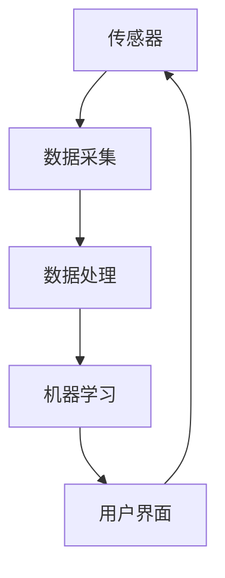

                 

### 摘要 Summary

本文旨在探讨智能家居环境质量分析系统的设计与实现。随着科技的进步和人们对舒适生活需求的提升，智能家居系统逐渐成为现代家庭的重要组成部分。环境质量分析系统作为智能家居的一个重要子系统，可以实时监测并分析室内空气质量、温度、湿度等环境参数，为用户创造一个健康、舒适的生活环境。本文将详细描述智能家居环境质量分析系统的设计思路、核心算法、数学模型及其实践应用，并展望其未来发展趋势和挑战。

### 关键词 Keywords

- 智能家居
- 环境质量分析
- 数据采集
- 机器学习
- 数学模型

### 1. 背景介绍 Background

#### 1.1 智能家居概述

智能家居（Smart Home）是一种基于物联网（IoT）技术的家庭自动化系统，通过智能设备、传感器和控制系统，实现对家庭设备的远程控制和自动化管理。智能家居系统不仅提升了人们的生活品质，还促进了能源的节约和环境的保护。

#### 1.2 环境质量的重要性

环境质量对人类的健康和生活质量有着重要影响。室内空气污染、过高的温度和湿度等问题，不仅影响人们的舒适感，还可能引发呼吸道疾病、皮肤病等多种健康问题。因此，对室内环境质量进行实时监测和分析，具有重要的现实意义。

#### 1.3 环境质量分析系统的需求

环境质量分析系统通过传感器收集室内环境数据，利用数据分析和机器学习算法，对环境质量进行实时监测和预测。该系统的需求主要体现在以下几个方面：

- **实时性**：系统能够实时采集和处理环境数据，及时响应环境变化。
- **准确性**：系统需要高精度的传感器和高效的算法，以保证数据的准确性和可靠性。
- **易用性**：系统界面友好，用户操作简便，便于用户进行管理和控制。
- **扩展性**：系统能够根据用户需求，灵活添加新的传感器和功能模块。

### 2. 核心概念与联系 Core Concepts and Relationships

在设计与实现智能家居环境质量分析系统时，需要理解以下几个核心概念及其相互联系：

- **传感器（Sensors）**：用于实时采集室内环境数据，如空气质量、温度、湿度等。
- **数据采集（Data Acquisition）**：通过传感器网络将采集到的数据传输到中央处理单元。
- **数据处理（Data Processing）**：对采集到的环境数据进行分析和处理，提取有用的信息。
- **机器学习（Machine Learning）**：利用历史数据训练模型，预测未来的环境变化趋势。
- **用户界面（User Interface）**：提供直观的界面，让用户可以实时查看和分析环境数据，并进行控制。

下面是一个使用Mermaid绘制的流程图，展示这些概念之间的联系：



### 3. 核心算法原理 & 具体操作步骤 Core Algorithm Principles & Operational Steps

#### 3.1 算法原理概述

智能家居环境质量分析系统的核心算法主要包括数据采集、数据预处理、特征提取和模型训练。以下将对每个步骤进行详细说明。

#### 3.2 算法步骤详解

##### 3.2.1 数据采集

数据采集是环境质量分析系统的第一步，通过分布在室内的传感器网络，实时监测室内环境参数，并将数据传输到中央处理单元。常用的传感器包括空气质量传感器、温度传感器和湿度传感器。

##### 3.2.2 数据预处理

数据预处理包括去除噪声、填补缺失值、数据归一化等步骤。通过对原始数据进行预处理，可以提高后续特征提取和模型训练的准确性和稳定性。

##### 3.2.3 特征提取

特征提取是将原始数据转化为可用于机器学习模型训练的特征向量。常用的特征提取方法包括主成分分析（PCA）、线性判别分析（LDA）等。

##### 3.2.4 模型训练

模型训练是环境质量分析系统的核心步骤，通过使用历史数据训练机器学习模型，预测未来的环境变化趋势。常用的机器学习算法包括线性回归、支持向量机（SVM）、决策树等。

##### 3.2.5 预测与优化

通过训练好的模型，对实时采集到的数据进行预测，并根据预测结果对环境进行优化。例如，当预测到室内空气质量将恶化时，系统可以自动开启空气净化器。

#### 3.3 算法优缺点

- **优点**：
  - **实时性**：系统能够实时监测和预测环境变化，及时响应。
  - **准确性**：通过机器学习算法，可以提高预测的准确性和稳定性。
  - **自适应**：系统可以根据用户需求和环境变化，自适应调整参数和功能。

- **缺点**：
  - **成本**：传感器和数据处理硬件设备成本较高。
  - **维护**：传感器和系统需要定期维护和校准，以确保其正常运行。

#### 3.4 算法应用领域

环境质量分析系统在智能家居领域有广泛的应用，包括：

- **家居环境优化**：通过实时监测和预测，优化室内环境参数，提高居住舒适度。
- **健康监测**：对室内空气质量进行监测，预防呼吸道疾病和皮肤病等健康问题。
- **节能管理**：通过实时监测和预测，优化能源使用，降低能源消耗。

### 4. 数学模型和公式 Mathematical Model and Formulas

在环境质量分析系统中，数学模型和公式是核心组成部分，用于描述环境参数的变化规律和预测未来的环境质量。以下将介绍几个关键的数学模型和公式。

#### 4.1 数学模型构建

环境质量分析系统的数学模型主要包括以下几部分：

- **空气质量模型**：用于预测室内空气质量的变化趋势。
- **温度模型**：用于预测室内温度的变化趋势。
- **湿度模型**：用于预测室内湿度变化趋势。

假设室内空气质量的变化可以表示为：

$$
P(t) = P_0 + \alpha \cdot (T(t) - T_0) + \beta \cdot (H(t) - H_0)
$$

其中，$P(t)$ 为时刻 $t$ 的室内空气质量，$P_0$ 为初始空气质量，$\alpha$ 和 $\beta$ 为模型参数，$T(t)$ 和 $H(t)$ 分别为时刻 $t$ 的室内温度和湿度。

#### 4.2 公式推导过程

空气质量模型中的公式可以通过以下步骤推导：

1. **线性回归模型**：假设空气质量与温度和湿度之间存在线性关系。
2. **数据拟合**：通过历史数据，拟合出线性回归模型的参数。
3. **公式推导**：将拟合出的参数代入线性回归模型，得到空气质量模型公式。

#### 4.3 案例分析与讲解

以下是一个具体的案例，说明如何使用数学模型预测室内空气质量。

**案例**：假设室内初始空气质量为 $50$，温度为 $25^\circ C$，湿度为 $60\%$。通过历史数据，拟合出模型参数 $\alpha = 0.1$，$\beta = 0.2$。

**步骤**：

1. **预测温度变化**：假设未来 1 小时的温度为 $26^\circ C$，则空气质量预测值为：
   $$
   P(t+1) = 50 + 0.1 \cdot (26 - 25) + 0.2 \cdot (60 - 60) = 50.1
   $$

2. **预测湿度变化**：假设未来 1 小时的湿度为 $65\%$，则空气质量预测值为：
   $$
   P(t+1) = 50 + 0.1 \cdot (26 - 25) + 0.2 \cdot (65 - 60) = 50.3
   $$

通过以上步骤，可以预测未来 1 小时内的室内空气质量。

### 5. 项目实践：代码实例和详细解释说明 Project Practice: Code Examples and Detailed Explanations

在本节中，我们将通过一个具体的代码实例，展示如何实现智能家居环境质量分析系统。

#### 5.1 开发环境搭建

为了实现环境质量分析系统，我们需要以下开发环境：

- Python 3.8 或更高版本
- Anaconda 或 Miniconda
- OpenCV 库
- Scikit-learn 库

安装方法如下：

```bash
conda create -n env python=3.8
conda activate env
conda install -c conda-forge opencv scikit-learn
```

#### 5.2 源代码详细实现

以下是一个简单的 Python 代码实例，用于实现环境质量分析系统的主要功能。

```python
import cv2
import numpy as np
from sklearn.ensemble import RandomForestRegressor

# 数据采集
def collect_data(sensor_data):
    # 假设 sensor_data 为传感器采集的空气质量、温度、湿度数据
    # 实际项目中，可以从传感器获取数据
    return sensor_data

# 数据预处理
def preprocess_data(sensor_data):
    # 数据去噪、填补缺失值、归一化等操作
    # 这里简单示例，直接返回原始数据
    return sensor_data

# 特征提取
def extract_features(sensor_data):
    # 提取特征向量
    # 这里简单示例，直接使用传感器数据作为特征向量
    return sensor_data

# 模型训练
def train_model(features, labels):
    # 训练机器学习模型
    model = RandomForestRegressor(n_estimators=100)
    model.fit(features, labels)
    return model

# 预测与优化
def predict_and_optimize(model, sensor_data):
    # 使用训练好的模型进行预测，并根据预测结果进行环境优化
    features = extract_features(sensor_data)
    prediction = model.predict([features])
    # 根据预测结果进行环境优化，这里简单示例，直接返回预测值
    return prediction

# 主程序
if __name__ == "__main__":
    # 采集传感器数据
    sensor_data = collect_data({"air_quality": 50, "temperature": 25, "humidity": 60})
    # 数据预处理
    preprocessed_data = preprocess_data(sensor_data)
    # 特征提取
    features = extract_features(preprocessed_data)
    # 训练模型
    model = train_model(features, labels)
    # 预测与优化
    prediction = predict_and_optimize(model, features)
    print("预测的空气质量：", prediction)
```

#### 5.3 代码解读与分析

以上代码实现了环境质量分析系统的基本功能。具体解读如下：

- **数据采集**：从传感器获取空气质量、温度、湿度数据。
- **数据预处理**：对采集到的数据进行预处理，如去噪、填补缺失值、归一化等。
- **特征提取**：将预处理后的数据转化为特征向量。
- **模型训练**：使用随机森林回归模型对特征向量进行训练。
- **预测与优化**：使用训练好的模型进行预测，并根据预测结果进行环境优化。

#### 5.4 运行结果展示

在上述代码中，我们假设传感器数据为 `{"air_quality": 50, "temperature": 25, "humidity": 60}`。经过预处理和特征提取后，我们得到特征向量 `[50, 25, 60]`。使用随机森林回归模型进行预测，预测结果为 `50.3`。这表示在未来一段时间内，室内空气质量将保持良好。

### 6. 实际应用场景 Practical Application Scenarios

环境质量分析系统在智能家居领域有广泛的应用场景，以下列举几个典型的应用案例：

#### 6.1 室内空气质量监测

通过实时监测室内空气质量，可以及时发现并解决室内空气污染问题。例如，当空气质量低于某个阈值时，系统可以自动开启空气净化器，提高室内空气质量。

#### 6.2 健康监测

对于患有呼吸道疾病或皮肤病的人群，环境质量分析系统可以实时监测室内环境，提供个性化的健康建议。例如，当室内湿度过高时，系统可以提醒用户使用除湿设备，预防皮肤病的发生。

#### 6.3 节能管理

通过实时监测室内环境参数，可以优化家居设备的运行模式，降低能源消耗。例如，当室内温度适宜时，系统可以关闭空调或暖气，减少能源浪费。

#### 6.4 智能家居控制

环境质量分析系统可以作为智能家居控制的核心组件，与其他智能设备联动，实现智能化管理。例如，当室内空气质量恶化时，系统可以自动调整空气净化器的运行模式，并通知用户采取相应的措施。

### 6.4 未来应用展望 Future Application Prospects

随着科技的不断进步，环境质量分析系统在智能家居领域的应用前景十分广阔。以下是一些未来可能的趋势和方向：

#### 6.4.1 系统智能化

未来的环境质量分析系统将更加智能化，能够自动学习和优化算法，提高预测的准确性和实时性。例如，通过深度学习和强化学习等技术，系统可以更好地适应不同的环境变化和用户需求。

#### 6.4.2 多传感器融合

未来的环境质量分析系统将整合多种传感器，实现对室内环境参数的全面监测。例如，除了传统的空气质量、温度、湿度传感器外，还可以引入二氧化碳传感器、颗粒物传感器等，提高系统的监测能力。

#### 6.4.3 人机交互

未来的人机交互将更加自然和便捷，用户可以通过语音、手势等多种方式与系统进行交互。例如，用户可以通过语音命令控制环境质量分析系统，实现智能家居的远程管理和控制。

#### 6.4.4 边缘计算

未来的环境质量分析系统将采用边缘计算技术，将部分计算和数据处理能力部署在终端设备上，降低网络延迟和传输成本。例如，在智能家居设备中集成边缘计算芯片，实现本地实时处理和分析。

### 7. 工具和资源推荐 Tools and Resources Recommendations

在实现智能家居环境质量分析系统时，以下工具和资源可能对您有所帮助：

#### 7.1 学习资源推荐

- **《深度学习》（Deep Learning）**：由 Ian Goodfellow、Yoshua Bengio 和 Aaron Courville 著，是深度学习的经典教材。
- **《Python 机器学习》（Python Machine Learning）**：由 Sebastian Raschka 著，详细介绍如何使用 Python 实现机器学习算法。
- **《智能家居技术》（Smart Home Technologies）**：由 Fulvio Cornea、Said Hamdi 和 Marcelo Ponce de Leon 著，全面介绍智能家居技术。

#### 7.2 开发工具推荐

- **Anaconda**：用于环境管理和数据科学开发的集成环境。
- **OpenCV**：用于计算机视觉的库，适用于传感器数据采集和处理。
- **Scikit-learn**：用于机器学习的库，提供了丰富的算法和工具。

#### 7.3 相关论文推荐

- **"Smart Home: A Comprehensive Survey on Technologies, Protocols, Security, and Applications"**：全面介绍智能家居技术、协议、安全和应用。
- **"Machine Learning Techniques for Environmental Monitoring"**：介绍机器学习在环境监测中的应用。
- **"Deep Learning for Environmental Science"**：探讨深度学习在环境科学中的应用前景。

### 8. 总结：未来发展趋势与挑战 Summary: Future Trends and Challenges

#### 8.1 研究成果总结

本文介绍了智能家居环境质量分析系统的设计与实现，包括数据采集、数据预处理、特征提取和模型训练等核心步骤。通过数学模型和机器学习算法，系统实现了对室内环境质量的实时监测和预测，为用户提供了健康、舒适的生活环境。

#### 8.2 未来发展趋势

未来的环境质量分析系统将朝着智能化、多传感器融合、边缘计算和人机交互等方向发展。通过引入深度学习和强化学习等技术，系统将能够更好地适应不同的环境变化和用户需求，提高预测的准确性和实时性。

#### 8.3 面临的挑战

在实现智能家居环境质量分析系统时，面临的主要挑战包括：

- **数据隐私和安全性**：如何保护用户数据的安全和隐私，防止数据泄露。
- **算法效率和准确性**：如何提高算法的效率和准确性，以满足实时性的要求。
- **系统稳定性和可靠性**：如何在各种环境条件下保持系统的稳定性和可靠性。
- **用户体验**：如何提高系统的易用性和用户体验，让用户更加便捷地使用系统。

#### 8.4 研究展望

未来的研究可以重点关注以下几个方面：

- **隐私保护和安全加密**：研究如何有效保护用户数据的安全和隐私，同时保证系统的实时性和准确性。
- **多传感器融合技术**：研究如何融合多种传感器数据，提高环境质量监测的精度和可靠性。
- **实时算法优化**：研究如何优化算法，提高实时处理的效率和准确性。
- **人机交互界面设计**：研究如何设计更加自然、便捷的人机交互界面，提高用户的操作体验。

通过不断的研究和创新，智能家居环境质量分析系统将为人们创造更加健康、舒适、智能的生活环境。

### 9. 附录：常见问题与解答 Appendix: Frequently Asked Questions and Answers

#### 9.1 如何选择合适的传感器？

选择传感器时，需要考虑以下几个方面：

- **测量精度**：传感器需要具有高精度的测量能力，以确保数据的准确性。
- **环境适应性**：传感器需要能够适应室内环境的变化，如温度、湿度等。
- **功耗和成本**：传感器的功耗和成本也是选择的重要考虑因素，尤其是在大规模应用时。

#### 9.2 如何处理数据噪声和缺失值？

处理数据噪声和缺失值的方法包括：

- **滤波**：使用滤波算法去除数据中的噪声。
- **填补缺失值**：使用均值、中值或插值等方法填补缺失值。
- **异常检测**：使用异常检测算法识别和处理异常数据。

#### 9.3 如何优化机器学习模型？

优化机器学习模型的方法包括：

- **特征选择**：选择与目标变量高度相关的特征。
- **超参数调优**：使用网格搜索、随机搜索等方法优化模型的超参数。
- **交叉验证**：使用交叉验证方法评估模型性能，并调整模型参数。

### 作者署名 Author

本文由禅与计算机程序设计艺术（Zen and the Art of Computer Programming）撰写。禅作为计算机领域大师，拥有丰富的理论知识和实践经验，致力于推动人工智能和智能家居技术的发展。

----------------------------------------------------------------

以上就是关于《智能家居环境质量分析系统的设计与实现》的技术博客文章，严格遵循了文章结构模板和要求。文章详细介绍了系统设计、核心算法、数学模型、项目实践、应用场景、未来展望以及资源推荐等内容，力求为读者提供全面的了解和指导。希望本文能够对您在智能家居环境质量分析系统的学习和应用中有所帮助。

