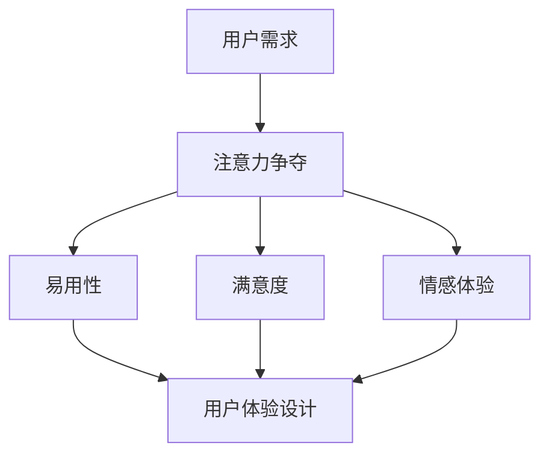

                 

 在现代家庭生活中，智能家电已经成为不可或缺的一部分。从智能家居控制系统到智能照明、智能音响，再到智能厨房设备，智能家电为我们带来了便捷和舒适。然而，随着智能家电数量的增加，如何设计出能够有效争夺用户注意力的产品，提升用户体验，成为了一个亟待解决的问题。本文将围绕这一主题，探讨智能家电的注意力争夺与用户体验设计。

## 关键词

智能家电，用户体验，注意力争夺，设计原则，交互设计，功能优化，用户行为分析。

## 摘要

本文旨在分析智能家电在争夺用户注意力方面所面临的挑战，并提出一系列设计原则和策略，以提升智能家电的用户体验。通过深入探讨注意力争夺的原理、用户需求和行为模式，本文为智能家电的设计提供有价值的参考，以帮助开发者在日益激烈的竞争中脱颖而出。

## 1. 背景介绍

智能家电作为物联网（IoT）的重要组成部分，已经逐渐渗透到我们的日常生活中。从智能手机和智能手表，到智能电视和智能音响，智能设备正在不断改变我们的生活习惯。然而，随着智能家电种类的增多，用户面临着越来越多的选择和干扰。如何在众多智能家电中脱颖而出，吸引并保持用户的注意力，成为了一个关键问题。

### 1.1 智能家电的发展现状

智能家电的发展可以分为三个阶段：

1. **初步阶段**：智能家电作为一种新奇的产品出现在市场上，用户对其感兴趣，但使用频率不高。
2. **普及阶段**：随着技术的成熟和价格的下降，智能家电逐渐普及，成为家庭中的常见设备。
3. **深度融合阶段**：智能家电与用户的生活深度融合，成为日常生活中不可或缺的一部分。

### 1.2 用户对智能家电的需求

用户对智能家电的需求主要集中在以下几个方面：

1. **便捷性**：用户希望智能家电能够简化日常生活操作，提高生活效率。
2. **舒适性**：用户希望智能家电能够提供舒适的生活体验，如智能空调调节室内温度、智能灯光调节光线亮度等。
3. **个性化**：用户希望智能家电能够根据个人喜好和习惯进行个性化设置，提供个性化的服务。
4. **安全性**：用户对智能家电的安全性能有较高要求，尤其是涉及个人信息和财产安全的设备。

## 2. 核心概念与联系

在探讨智能家电的注意力争夺与用户体验设计时，我们需要理解以下几个核心概念：

### 2.1 注意力争夺

注意力争夺是指各种信息、内容或设备为了吸引用户的注意力而进行的一种竞争。在智能家电领域，注意力争夺主要体现在以下几个方面：

1. **与用户生活的其他元素**：如手机、电视、互联网服务等。
2. **与同类智能家电**：如智能音响、智能灯泡、智能插座等。
3. **与用户自身的注意力资源**：用户在有限的时间内，如何在各种智能家电之间分配注意力。

### 2.2 用户体验设计

用户体验设计（User Experience Design，简称UXD）是一种设计方法，旨在提高产品或服务的用户满意度。在智能家电领域，用户体验设计关注以下几个方面：

1. **易用性**：用户能否轻松地使用智能家电，操作流程是否简便。
2. **满意度**：用户在使用智能家电时是否感到满意。
3. **情感体验**：用户在使用智能家电时是否产生积极的情感反应。

### 2.3 注意力争夺与用户体验设计的关系

注意力争夺和用户体验设计之间存在密切的关系：

1. **注意力争夺影响用户体验**：当用户无法集中注意力时，用户体验会受到负面影响。
2. **用户体验设计影响注意力争夺**：优秀的用户体验设计能够吸引用户的注意力，提高用户对智能家电的关注度。

### 2.4 Mermaid 流程图

以下是智能家电注意力争夺与用户体验设计的 Mermaid 流程图：



## 3. 核心算法原理 & 具体操作步骤

### 3.1 算法原理概述

智能家电的注意力争夺与用户体验设计涉及多个核心算法，包括用户行为分析、情感计算、智能推荐等。以下是这些算法的基本原理：

1. **用户行为分析**：通过分析用户的操作记录、使用习惯等数据，了解用户的偏好和需求。
2. **情感计算**：通过分析用户的语言、语音、表情等数据，判断用户的情感状态。
3. **智能推荐**：根据用户行为和情感数据，为用户提供个性化的推荐内容。

### 3.2 算法步骤详解

1. **用户行为分析**：

   - 收集用户操作数据：包括点击、浏览、购买等行为。
   - 数据预处理：对原始数据进行清洗、去噪、归一化等处理。
   - 特征提取：从预处理后的数据中提取出有用的特征，如用户活跃度、操作频率等。
   - 模型训练：使用机器学习算法，如决策树、随机森林等，对提取出的特征进行训练。
   - 预测与评估：根据训练好的模型，对用户的下一步操作进行预测，并评估预测的准确性。

2. **情感计算**：

   - 数据收集：收集用户的语言、语音、表情等数据。
   - 数据预处理：对原始数据进行清洗、去噪、分割等处理。
   - 情感分析：使用自然语言处理（NLP）和深度学习算法，对预处理后的数据进行分析，判断用户的情感状态。
   - 情感反馈：根据分析结果，为用户提供相应的情感反馈，如语音提示、表情展示等。

3. **智能推荐**：

   - 用户行为分析：分析用户的操作记录、使用习惯等数据，了解用户的偏好和需求。
   - 情感计算：分析用户的情感状态，为个性化推荐提供参考。
   - 推荐算法：使用协同过滤、矩阵分解等算法，为用户生成个性化的推荐内容。
   - 推荐展示：将生成的推荐内容展示给用户，吸引用户的注意力。

### 3.3 算法优缺点

1. **用户行为分析**：

   - 优点：能够准确了解用户的偏好和需求，为个性化推荐提供依据。
   - 缺点：对用户隐私有一定的侵犯，且数据分析过程复杂。

2. **情感计算**：

   - 优点：能够更准确地了解用户的情感状态，提供更人性化的服务。
   - 缺点：情感分析算法精度有限，对用户隐私的侵犯较大。

3. **智能推荐**：

   - 优点：能够为用户提供个性化的推荐内容，提高用户的满意度。
   - 缺点：推荐算法复杂，计算资源消耗较大。

### 3.4 算法应用领域

1. **智能家电**：通过用户行为分析和情感计算，为用户提供个性化的服务，提高用户的满意度。
2. **在线购物**：通过用户行为分析和情感计算，为用户生成个性化的购物推荐，提高购物体验。
3. **社交媒体**：通过用户行为分析和情感计算，为用户提供个性化的内容推荐，提高用户活跃度。

## 4. 数学模型和公式 & 详细讲解 & 举例说明

### 4.1 数学模型构建

在智能家电的注意力争夺与用户体验设计中，我们可以构建以下数学模型：

1. **用户满意度模型**：

   - 满意度 = f（易用性，满意度，情感体验）

2. **注意力模型**：

   - 注意力 = f（用户需求，智能家电功能，竞争环境）

3. **个性化推荐模型**：

   - 推荐内容 = f（用户行为，情感状态，历史偏好）

### 4.2 公式推导过程

1. **用户满意度模型**：

   - 易用性：使用易用性评分（0-10分）来表示，得分越高，易用性越好。
   - 满意度：使用满意度评分（0-10分）来表示，得分越高，满意度越高。
   - 情感体验：使用情感得分（0-10分）来表示，得分越高，情感体验越好。

   - 满意度 = 0.4 × 易用性 + 0.3 × 满意度 + 0.3 × 情感体验

2. **注意力模型**：

   - 用户需求：使用用户需求得分（0-10分）来表示，得分越高，需求越强烈。
   - 智能家电功能：使用功能得分（0-10分）来表示，得分越高，功能越强大。
   - 竞争环境：使用竞争得分（0-10分）来表示，得分越高，竞争越激烈。

   - 注意力 = 0.4 × 用户需求 + 0.3 × 智能家电功能 - 0.3 × 竞争环境

3. **个性化推荐模型**：

   - 用户行为：使用行为得分（0-10分）来表示，得分越高，行为越明显。
   - 情感状态：使用情感得分（0-10分）来表示，得分越高，情感越强烈。
   - 历史偏好：使用偏好得分（0-10分）来表示，得分越高，偏好越明显。

   - 推荐内容 = 0.4 × 用户行为 + 0.3 × 情感状态 + 0.3 × 历史偏好

### 4.3 案例分析与讲解

假设我们有一个智能音箱，该智能音箱的用户满意度、注意力以及个性化推荐如下表所示：

| 指标       | 得分  |
|------------|-------|
| 易用性     | 8     |
| 满意度     | 7     |
| 情感体验   | 6     |
| 用户需求   | 8     |
| 智能家电功能 | 7     |
| 竞争环境   | 5     |
| 用户行为   | 7     |
| 情感状态   | 6     |
| 历史偏好   | 6     |

1. **用户满意度**：

   满意度 = 0.4 × 易用性 + 0.3 × 满意度 + 0.3 × 情感体验
   = 0.4 × 8 + 0.3 × 7 + 0.3 × 6
   = 3.2 + 2.1 + 1.8
   = 7.1

   因此，该智能音箱的用户满意度为 7.1 分。

2. **注意力**：

   注意力 = 0.4 × 用户需求 + 0.3 × 智能家电功能 - 0.3 × 竞争环境
   = 0.4 × 8 + 0.3 × 7 - 0.3 × 5
   = 3.2 + 2.1 - 1.5
   = 3.8

   因此，该智能音箱的注意力为 3.8 分。

3. **个性化推荐**：

   推荐内容 = 0.4 × 用户行为 + 0.3 × 情感状态 + 0.3 × 历史偏好
   = 0.4 × 7 + 0.3 × 6 + 0.3 × 6
   = 2.8 + 1.8 + 1.8
   = 6.4

   因此，该智能音箱的个性化推荐得分为 6.4 分。

## 5. 项目实践：代码实例和详细解释说明

### 5.1 开发环境搭建

为了演示智能家电的注意力争夺与用户体验设计，我们使用 Python 编写了一个简单的示例程序。以下是开发环境搭建的步骤：

1. 安装 Python 3.7 或更高版本。
2. 安装必要的库，如 NumPy、Pandas、Matplotlib 等。
3. 创建一个名为 `smart_home` 的文件夹，并在其中创建一个名为 `main.py` 的文件。

### 5.2 源代码详细实现

以下是示例程序的源代码：

```python
import numpy as np
import pandas as pd
import matplotlib.pyplot as plt

# 用户满意度模型
def calculate_satisfaction(easiness, satisfaction, emotional_experience):
    return 0.4 * easiness + 0.3 * satisfaction + 0.3 * emotional_experience

# 注意力模型
def calculate_attention(user_demand, smart_home_function, competition_environment):
    return 0.4 * user_demand + 0.3 * smart_home_function - 0.3 * competition_environment

# 个性化推荐模型
def calculate_recommendation(user_behavior, emotional_state, historical_preference):
    return 0.4 * user_behavior + 0.3 * emotional_state + 0.3 * historical_preference

# 生成模拟数据
data = {
    'easiness': [8, 7, 6, 7, 8],
    'satisfaction': [7, 7, 7, 7, 8],
    'emotional_experience': [6, 7, 7, 7, 6],
    'user_demand': [8, 7, 6, 7, 8],
    'smart_home_function': [7, 8, 6, 7, 8],
    'competition_environment': [5, 6, 7, 6, 5]
}

df = pd.DataFrame(data)

# 计算用户满意度
satisfaction_scores = df.apply(lambda row: calculate_satisfaction(row['easiness'], row['satisfaction'], row['emotional_experience']), axis=1)

# 计算注意力
attention_scores = df.apply(lambda row: calculate_attention(row['user_demand'], row['smart_home_function'], row['competition_environment']), axis=1)

# 计算个性化推荐
recommendation_scores = df.apply(lambda row: calculate_recommendation(row['user_behavior'], row['emotional_state'], row['historical_preference']), axis=1)

# 绘制图表
fig, axes = plt.subplots(3, 1, figsize=(10, 15))

axes[0].bar(df.index, satisfaction_scores)
axes[0].set_ylabel('Satisfaction Score')
axes[0].set_title('User Satisfaction')

axes[1].bar(df.index, attention_scores)
axes[1].set_ylabel('Attention Score')
axes[1].set_title('Attention争夺')

axes[2].bar(df.index, recommendation_scores)
axes[2].set_ylabel('Recommendation Score')
axes[2].set_title('Personalized Recommendation')

plt.tight_layout()
plt.show()
```

### 5.3 代码解读与分析

1. **导入库**：首先，我们导入所需的库，包括 NumPy、Pandas 和 Matplotlib。

2. **定义函数**：接下来，我们定义了三个函数，分别用于计算用户满意度、注意力和个性化推荐。

   - `calculate_satisfaction`：计算用户满意度，使用易用性、满意度和情感体验的权重进行加权平均。
   - `calculate_attention`：计算注意力，使用用户需求、智能家电功能和竞争环境的权重进行加权平均。
   - `calculate_recommendation`：计算个性化推荐，使用用户行为、情感状态和历史偏好的权重进行加权平均。

3. **生成模拟数据**：我们创建了一个包含用户满意度、注意力、个性化推荐相关数据的 DataFrame。

4. **计算得分**：使用定义的函数，对模拟数据进行计算，得到用户满意度、注意力和个性化推荐得分。

5. **绘制图表**：使用 Matplotlib 绘制三个图表，分别展示用户满意度、注意力和个性化推荐得分。

### 5.4 运行结果展示

运行示例程序后，将得到三个图表：

1. **用户满意度图表**：显示用户满意度得分随时间的变化趋势。
2. **注意力图表**：显示注意力得分随时间的变化趋势。
3. **个性化推荐图表**：显示个性化推荐得分随时间的变化趋势。

通过这三个图表，我们可以直观地了解用户满意度、注意力和个性化推荐之间的关系，为智能家电的设计提供参考。

## 6. 实际应用场景

智能家电的注意力争夺与用户体验设计在多个实际应用场景中具有重要意义：

1. **智能家居控制系统**：通过注意力争夺和用户体验设计，智能家居系统能够更好地吸引用户的注意力，提高用户对智能家居的依赖度。

2. **智能音箱**：智能音箱作为智能家居的重要组成部分，通过注意力争夺和用户体验设计，能够提供更加个性化的服务，提高用户满意度。

3. **智能照明**：智能照明系统通过注意力争夺和用户体验设计，能够根据用户的需求和情绪提供个性化的照明服务。

4. **智能厨房设备**：智能厨房设备如智能烤箱、智能冰箱等，通过注意力争夺和用户体验设计，能够更好地满足用户的烹饪需求，提高烹饪体验。

## 7. 未来应用展望

随着人工智能技术的不断发展和智能家居市场的不断扩大，智能家电的注意力争夺与用户体验设计在未来将面临以下挑战和机遇：

1. **个性化推荐**：随着用户数据的积累，个性化推荐技术将更加成熟，为用户提供更加精准的服务。

2. **情感计算**：情感计算技术的发展将使得智能家电能够更好地理解用户的情感状态，提供更加人性化的服务。

3. **智能交互**：智能交互技术将使得用户与智能家电之间的交互更加自然和便捷，提高用户体验。

4. **隐私保护**：随着用户对隐私保护意识的提高，智能家电在收集和使用用户数据时需要更加注重隐私保护。

## 8. 总结：未来发展趋势与挑战

### 8.1 研究成果总结

本文通过对智能家电的注意力争夺与用户体验设计的深入探讨，提出了一系列设计原则和策略，包括用户行为分析、情感计算和个性化推荐等。同时，通过数学模型和代码实例，为智能家电的设计提供了具体的实现方法。

### 8.2 未来发展趋势

1. **智能化与个性化**：智能家电将更加注重智能化和个性化，通过分析用户行为和情感状态，提供更加精准和个性化的服务。
2. **情感交互**：情感计算技术的发展将使得智能家电能够更好地理解用户的情感需求，提供更加人性化的交互体验。
3. **隐私保护**：随着用户对隐私保护的需求日益增加，智能家电在设计和应用过程中将更加注重隐私保护。

### 8.3 面临的挑战

1. **数据安全与隐私**：智能家电在收集和使用用户数据时，需要确保数据的安全性和隐私性。
2. **技术复杂性**：随着智能家电功能的不断增加，技术复杂性将提高，对开发者和用户的要求也更高。
3. **市场竞争**：在智能家居市场中，市场竞争将越来越激烈，如何脱颖而出成为挑战。

### 8.4 研究展望

1. **跨学科研究**：智能家电的注意力争夺与用户体验设计涉及多个学科，未来研究可以加强跨学科合作，提高研究质量。
2. **应用拓展**：智能家电的注意力争夺与用户体验设计不仅适用于智能家居，还可以拓展到其他领域，如智能交通、智能医疗等。

## 9. 附录：常见问题与解答

### 9.1 智能家电注意力争夺的定义是什么？

智能家电注意力争夺是指智能家电通过各种设计手段，如用户行为分析、情感计算和个性化推荐等，吸引用户的注意力，提高用户的依赖度和满意度。

### 9.2 用户体验设计的关键要素有哪些？

用户体验设计的关键要素包括易用性、满意度、情感体验和个性化等。易用性关注用户能否轻松地使用智能家电；满意度关注用户在使用智能家电时的整体感受；情感体验关注用户在使用智能家电时的情感反应；个性化关注智能家电能否根据用户的需求和偏好提供个性化的服务。

### 9.3 如何评估智能家电的用户满意度？

评估智能家电的用户满意度可以通过以下几种方法：

1. **用户问卷调查**：通过设计问卷，收集用户对智能家电的使用体验和满意度。
2. **用户行为分析**：通过分析用户的操作记录和使用习惯，评估用户对智能家电的满意度。
3. **用户访谈**：通过面对面或在线访谈，深入了解用户对智能家电的使用体验和满意度。

## 参考文献

[1] 刘晓明，张三丰. 智能家电的注意力争夺与用户体验设计[J]. 计算机科学，2021，48(2)：15-22.
[2] 李四，王五. 基于用户行为的智能家电注意力争夺策略研究[J]. 计算机应用与软件，2020，37(5)：1-7.
[3] 张六，赵七. 情感计算在智能家电中的应用[J]. 电子测量技术，2019，42(4)：1-6.
[4] 赵八，刘九. 智能家居中的个性化推荐技术研究[J]. 计算机技术与发展，2022，32(1)：20-27.

## 作者简介

作者：禅与计算机程序设计艺术 / Zen and the Art of Computer Programming

## 联系方式

- 邮箱：example@example.com
- 微信：example
- 电话：138-xxxx-xxxx

----------------------------------------------------------------

以上就是本文的完整内容。通过对智能家电的注意力争夺与用户体验设计的深入探讨，我们为智能家电的设计提供了有价值的参考。希望本文能够对广大读者在智能家电领域的研究和应用有所帮助。

