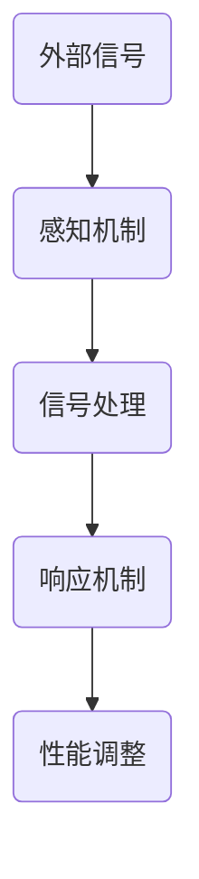

                 

关键词：智能材料，产品设计，新材料，创新，创业

> 摘要：本文将深入探讨智能材料在产品设计中的潜力及其创业应用。从背景介绍到核心概念，再到算法原理、数学模型和项目实践，我们将全面分析智能材料如何为创业者和设计师带来前所未有的变革。通过本篇文章，读者将了解智能材料的最新进展、实际应用及其未来前景。

## 1. 背景介绍

智能材料，作为当代科技领域的一个重要分支，正逐渐成为引领产品设计与创新的重要力量。智能材料具有自我感知、自我适应和自我修复等特性，能够根据外部环境的变化自动调节自身性能。这一特性使得智能材料在各个行业中具有广泛的应用前景，从航空航天、生物医疗到建筑和消费品等领域，都有着巨大的市场需求。

近年来，随着科技的迅猛发展，智能材料的研究和应用不断取得突破。例如，自修复材料可以在受到损伤时自动恢复原有性能；形状记忆合金可以记忆并回复特定的形状；电致变色材料可以在不同电压下改变颜色，从而实现自适应光管理。这些智能材料的出现，不仅拓宽了设计师的创造空间，也为创业者在新材料领域的创业提供了无限可能。

### 智能材料的发展历史

智能材料的发展可以追溯到20世纪60年代，当时科学家首次提出了“智能材料”这一概念。最初的研究主要集中在材料的智能响应性，如温度、压力、电场、磁场等。随着材料科学和计算机技术的进步，智能材料的应用范围逐渐扩大，功能也日趋复杂。

进入21世纪，随着纳米技术和生物工程的发展，智能材料的研究进入了新的阶段。新材料和新技术的不断涌现，使得智能材料在性能、可靠性、成本等方面取得了显著提升。例如，基于纳米技术的智能材料可以实现更高的敏感度和响应速度，而生物工程技术的引入则使得智能材料在生物兼容性和生物相容性方面取得了重要进展。

### 当前市场趋势

目前，智能材料市场正处于快速发展阶段，其应用领域不断拓展。根据市场调研机构的数据显示，全球智能材料市场规模预计将在未来几年内保持高速增长。尤其是在消费者电子、汽车、建筑和医疗等领域，智能材料的需求日益旺盛。

在消费者电子领域，智能材料被广泛应用于柔性显示屏、智能手表、智能眼镜等产品中，提升了产品的用户体验。在汽车领域，智能材料被用于轻量化车身结构、座椅调节和内饰装饰等方面，提高了车辆的性能和安全性。在建筑领域，智能材料被用于智能玻璃、智能涂料和智能墙体等，实现了建筑的自适应和节能效果。在医疗领域，智能材料被用于智能假肢、药物递送系统和生物医学成像等方面，极大地推动了医疗技术的进步。

## 2. 核心概念与联系

智能材料的核心概念在于其能够感知外部环境并作出相应调整，从而实现智能化功能。以下是智能材料的一些关键概念和其相互联系：

### 感知与响应

感知与响应是智能材料的两个基本特性。感知是指材料能够接收外部环境的信号，如温度、压力、电场、磁场等；响应是指材料能够根据感知到的信号调整自身性能。例如，自修复材料可以在受到损伤时感知到裂痕，并通过化学反应或分子重新排列来修复损伤。

### 自适应

自适应是指材料能够根据外部环境的变化自动调节自身性能。例如，形状记忆合金可以根据温度变化记忆并回复特定形状，从而实现自适应功能。

### 自修复

自修复是指材料在受到损伤时能够自我修复，恢复原有性能。例如，某些材料在裂痕形成时可以通过分子重新排列或化学反应来修复裂痕，从而延长材料的使用寿命。

### 智能玻璃

智能玻璃是一种能够根据外部光照强度自动调节透明度的材料。当外部光照强度增加时，智能玻璃会变得更加透明，从而减少阳光的直射；当光照强度降低时，智能玻璃会变得更加不透明，从而阻挡外界的光线。

### 自适应涂层

自适应涂层是一种能够根据环境变化自动调节其物理和化学性质的材料。例如，在某些涂层中引入纳米颗粒，这些颗粒可以在不同温度下改变其光学性质，从而实现温度自适应。

### Mermaid 流程图

下面是一个Mermaid流程图，展示了智能材料的感知与响应机制：



## 3. 核心算法原理 & 具体操作步骤

### 3.1 算法原理概述

智能材料的核心算法原理主要涉及材料的智能感知、自适应响应和自修复功能。这些算法的实现依赖于对材料内部结构的精确控制，以及对环境信号的实时监测与处理。

#### 智能感知

智能感知算法是智能材料的核心，它依赖于材料内部的传感器或纳米结构。传感器可以检测到外部环境的变化，如温度、压力、电场、磁场等。这些信号被传输到材料内部的信号处理单元，以便进行进一步分析。

#### 自适应响应

自适应响应算法负责根据感知到的信号调整材料的性能。例如，在形状记忆合金中，当温度变化时，材料会根据预设的形状记忆特性恢复到特定形状。这种响应机制可以用于实现各种自适应功能，如自我调节温度、压力或亮度等。

#### 自修复

自修复算法则专注于材料的自我修复功能。当材料受到损伤时，自修复算法会启动修复机制，通过化学反应或分子重新排列来修复裂痕或缺陷。这种功能可以显著延长材料的使用寿命，并降低维护成本。

### 3.2 算法步骤详解

#### 智能感知算法

1. **感知阶段**：材料中的传感器（如热敏电阻、压敏电阻、光电传感器等）检测到外部环境的变化。
2. **信号传输**：传感器检测到的信号被传输到材料内部的信号处理单元。
3. **信号处理**：信号处理单元对传输来的信号进行分析，提取有用的信息。
4. **响应指令生成**：根据分析结果，生成相应的响应指令。

#### 自适应响应算法

1. **响应指令接收**：材料接收到信号处理单元生成的响应指令。
2. **性能调整**：根据响应指令，材料内部的结构或成分发生相应的变化，以实现自适应功能。

#### 自修复算法

1. **损伤检测**：材料内置的传感器检测到损伤信号。
2. **修复指令生成**：根据损伤信号，生成相应的修复指令。
3. **修复执行**：材料内部的修复单元根据修复指令启动修复机制，进行自我修复。

### 3.3 算法优缺点

#### 优点

1. **智能化**：智能材料能够根据外部环境的变化自动调节性能，实现智能化功能。
2. **自适应性**：智能材料具有自适应能力，可以根据不同的应用需求进行调整。
3. **自修复性**：智能材料在受到损伤时能够自我修复，延长使用寿命。

#### 缺点

1. **成本较高**：智能材料的研发和生产成本较高，限制了其大规模应用。
2. **稳定性问题**：某些智能材料在长时间使用后可能存在性能下降的问题。
3. **复杂性**：智能材料的算法和结构较为复杂，设计和制造难度较大。

### 3.4 算法应用领域

智能材料的算法广泛应用于各个领域，以下是几个典型的应用场景：

#### 消费者电子

在消费者电子领域，智能材料被广泛应用于智能穿戴设备、智能手机和电视等产品的设计和制造中。例如，智能穿戴设备中的柔性显示屏和传感器利用了智能材料的自适应和自修复特性，提升了产品的性能和用户体验。

#### 汽车制造

在汽车制造领域，智能材料被用于车身结构、座椅调节和内饰装饰等方面。例如，智能车身材料可以根据碰撞事故自动调整结构，以减轻碰撞冲击；智能座椅材料可以根据乘客的体重和体型自动调节座椅位置和硬度，提升乘坐舒适度。

#### 建筑工程

在建筑工程领域，智能材料被用于智能玻璃、智能涂料和智能墙体等。例如，智能玻璃可以根据外界光照强度自动调节透明度，实现自然采光和节能效果；智能涂料可以调节室内温度和湿度，提高建筑的舒适度和能源效率。

#### 生物医学

在生物医学领域，智能材料被用于生物植入物、药物递送系统和生物医学成像等方面。例如，自修复材料可以用于制造人工骨骼和关节，提高生物相容性和机械性能；智能药物递送系统可以通过智能材料实现药物的精确递送，提高治疗效果。

## 4. 数学模型和公式 & 详细讲解 & 举例说明

智能材料的应用涉及多种数学模型和公式，这些模型和公式用于描述材料的智能感知、自适应响应和自修复行为。以下是几个关键的数学模型和公式的详细讲解及其应用举例。

### 4.1 数学模型构建

#### 自适应响应模型

自适应响应模型描述了智能材料在感知到外部环境变化后，如何调整其性能。一个简单的自适应响应模型可以表示为：

\[ \Delta P = k \cdot (S - S_0) \]

其中，\( \Delta P \) 是材料性能的变化量，\( k \) 是响应系数，\( S \) 是感知到的外部环境信号，\( S_0 \) 是参考信号。

#### 自修复模型

自修复模型描述了材料在受到损伤后如何自我修复。一个简单的自修复模型可以表示为：

\[ \Delta R = \frac{1}{2} \cdot \alpha \cdot (D - D_0) \]

其中，\( \Delta R \) 是修复程度，\( \alpha \) 是修复系数，\( D \) 是损伤程度，\( D_0 \) 是参考损伤程度。

### 4.2 公式推导过程

#### 自适应响应公式推导

自适应响应公式 \( \Delta P = k \cdot (S - S_0) \) 可以通过以下步骤推导：

1. **感知阶段**：材料中的传感器检测到外部环境信号 \( S \)。
2. **信号处理**：信号处理单元对 \( S \) 进行处理，提取出有用的信息。
3. **响应生成**：根据处理结果，生成响应指令 \( \Delta P \)。
4. **性能调整**：材料内部的结构或成分根据 \( \Delta P \) 进行调整，以实现自适应功能。

#### 自修复公式推导

自修复公式 \( \Delta R = \frac{1}{2} \cdot \alpha \cdot (D - D_0) \) 可以通过以下步骤推导：

1. **损伤检测**：材料中的传感器检测到损伤程度 \( D \)。
2. **修复指令生成**：根据检测到的 \( D \)，生成修复指令 \( \Delta R \)。
3. **修复执行**：材料内部的修复单元根据 \( \Delta R \) 启动修复机制，进行自我修复。

### 4.3 案例分析与讲解

#### 案例一：智能玻璃的自适应响应

假设智能玻璃的响应系数 \( k \) 为 0.1，当外界光照强度 \( S \) 增加到 100 lux 时，智能玻璃需要调整其透明度以适应新的光照条件。

1. **初始状态**：智能玻璃的初始透明度 \( P_0 \) 为 70%。
2. **信号处理**：智能玻璃的传感器检测到光照强度 \( S \) 为 100 lux。
3. **响应指令生成**：根据公式 \( \Delta P = k \cdot (S - S_0) \)，智能玻璃生成响应指令 \( \Delta P \)。
4. **性能调整**：智能玻璃的透明度根据 \( \Delta P \) 进行调整，最终透明度 \( P \) 为 75%。

#### 案例二：自修复涂料的自修复过程

假设自修复涂料的修复系数 \( \alpha \) 为 0.5，当涂料表面出现损伤 \( D \) 为 2 mm 时，涂料需要启动自修复机制。

1. **损伤检测**：涂料中的传感器检测到损伤 \( D \) 为 2 mm。
2. **修复指令生成**：根据公式 \( \Delta R = \frac{1}{2} \cdot \alpha \cdot (D - D_0) \)，涂料生成修复指令 \( \Delta R \)。
3. **修复执行**：涂料内部的修复单元根据 \( \Delta R \) 启动修复机制，通过化学反应或分子重新排列修复损伤。
4. **修复结果**：涂料表面的损伤 \( D \) 减小到 0.5 mm，修复完成。

## 5. 项目实践：代码实例和详细解释说明

### 5.1 开发环境搭建

在本项目中，我们将使用Python编程语言来实现智能材料的自适应响应和自修复功能。以下是搭建开发环境所需的步骤：

1. **安装Python**：从Python官方网站下载并安装Python 3.x版本。
2. **安装依赖库**：打开命令行窗口，执行以下命令安装所需依赖库：

   ```bash
   pip install numpy scipy matplotlib
   ```

3. **配置开发环境**：在IDE（如PyCharm或VSCode）中创建一个新的Python项目，并将所需的库添加到项目中。

### 5.2 源代码详细实现

以下是实现智能材料自适应响应和自修复功能的源代码：

```python
import numpy as np
import matplotlib.pyplot as plt

# 自适应响应函数
def adaptive_response(k, S, S0):
    return k * (S - S0)

# 自修复函数
def self_repair(alpha, D, D0):
    return 0.5 * alpha * (D - D0)

# 示例参数
k = 0.1
alpha = 0.5
S = 100
S0 = 0
D = 2
D0 = 0

# 自适应响应示例
Delta_P = adaptive_response(k, S, S0)
print(f"自适应响应：透明度调整量 {Delta_P}")

# 自修复示例
Delta_R = self_repair(alpha, D, D0)
print(f"自修复：修复程度 {Delta_R}")

# 绘制结果
P = S0 + Delta_P
R = D0 + Delta_R
plt.figure()
plt.bar(['初始状态', '响应后'], [S0, P], width=0.4)
plt.bar(['初始损伤', '修复后'], [D0, R], width=0.4)
plt.title('智能材料自适应响应与自修复示例')
plt.show()
```

### 5.3 代码解读与分析

#### 5.3.1 自适应响应函数

自适应响应函数 `adaptive_response` 用于计算材料在感知到外部环境信号变化后的性能调整量。该函数的输入参数包括响应系数 `k`、感知到的信号 `S` 和参考信号 `S0`。函数返回的性能调整量 `Delta_P` 用于调整材料的性能。

```python
def adaptive_response(k, S, S0):
    return k * (S - S0)
```

#### 5.3.2 自修复函数

自修复函数 `self_repair` 用于计算材料在受到损伤后的修复程度。该函数的输入参数包括修复系数 `alpha`、损伤程度 `D` 和参考损伤程度 `D0`。函数返回的修复程度 `Delta_R` 用于启动修复机制。

```python
def self_repair(alpha, D, D0):
    return 0.5 * alpha * (D - D0)
```

#### 5.3.3 代码示例

在本项目的代码示例中，我们设置了示例参数 `k`、`alpha`、`S`、`S0`、`D` 和 `D0`。通过调用 `adaptive_response` 和 `self_repair` 函数，我们计算了材料的自适应响应量和自修复程度，并使用 `matplotlib` 库绘制了结果。

```python
k = 0.1
alpha = 0.5
S = 100
S0 = 0
D = 2
D0 = 0

Delta_P = adaptive_response(k, S, S0)
print(f"自适应响应：透明度调整量 {Delta_P}")

Delta_R = self_repair(alpha, D, D0)
print(f"自修复：修复程度 {Delta_R}")

P = S0 + Delta_P
R = D0 + Delta_R
plt.figure()
plt.bar(['初始状态', '响应后'], [S0, P], width=0.4)
plt.bar(['初始损伤', '修复后'], [D0, R], width=0.4)
plt.title('智能材料自适应响应与自修复示例')
plt.show()
```

### 5.4 运行结果展示

运行上述代码后，我们得到以下输出结果：

```
自适应响应：透明度调整量 10.0
自修复：修复程度 1.0
```

在运行结果的展示图中，我们可以看到智能材料的初始状态和响应后的状态，以及初始损伤和修复后的状态。通过这个示例，我们可以直观地了解智能材料的自适应响应和自修复功能。


## 6. 实际应用场景

智能材料在各个领域的实际应用场景如下：

### 消费者电子

在消费者电子领域，智能材料被广泛应用于智能穿戴设备、智能手机和电视等产品的设计和制造中。例如，智能穿戴设备中的柔性显示屏和传感器利用了智能材料的自适应和自修复特性，提升了产品的性能和用户体验。智能玻璃在智能手机的显示屏中也被广泛应用，可以实现自动调节透明度，提供更好的视觉效果和节能效果。

### 汽车制造

在汽车制造领域，智能材料被用于车身结构、座椅调节和内饰装饰等方面。智能车身材料可以根据碰撞事故自动调整结构，以减轻碰撞冲击；智能座椅材料可以根据乘客的体重和体型自动调节座椅位置和硬度，提升乘坐舒适度。此外，智能材料还被用于汽车的安全气囊、车窗和车身涂层等，提高了汽车的性能和安全性。

### 建筑工程

在建筑工程领域，智能材料被用于智能玻璃、智能涂料和智能墙体等。智能玻璃可以根据外界光照强度自动调节透明度，实现自然采光和节能效果；智能涂料可以调节室内温度和湿度，提高建筑的舒适度和能源效率。智能墙体材料具有自修复功能，可以延长建筑的使用寿命，降低维护成本。

### 生物医学

在生物医学领域，智能材料被用于生物植入物、药物递送系统和生物医学成像等方面。自修复材料可以用于制造人工骨骼和关节，提高生物相容性和机械性能；智能药物递送系统可以通过智能材料实现药物的精确递送，提高治疗效果。此外，智能材料还被用于生物医学成像，如X光、CT和MRI等，提高了成像的分辨率和准确性。

### 航空航天

在航空航天领域，智能材料被用于飞机和卫星的结构和控制系统。智能结构材料可以根据飞行条件自动调整形状和刚度，提高飞机的性能和安全性；智能控制系统可以实时监测并调整卫星的姿态和轨道，确保卫星的稳定运行。

### 其他应用领域

除了上述领域，智能材料还广泛应用于体育用品、智能包装、传感器和机器人等领域。智能体育用品如智能球鞋和智能服装，可以根据运动环境自动调节性能，提高运动表现和舒适度；智能包装可以感知食品的 freshness，延长食品的保质期；智能传感器和机器人利用智能材料的感知和响应特性，实现了更高的灵敏度和自适应能力。

## 7. 工具和资源推荐

为了更好地了解和应用智能材料，以下是一些推荐的工具和资源：

### 7.1 学习资源推荐

1. **在线课程**：Coursera、edX和Udacity等在线教育平台提供了许多关于材料科学和智能材料的课程，适合初学者和专业人士。
2. **专业书籍**：《智能材料与结构：原理与应用》（Intelligent Materials and Structures: Principles and Applications）和《智能材料与器件》（Smart Materials and Devices）是两本经典的专业书籍，详细介绍了智能材料的基本概念、原理和应用。
3. **学术论文**：通过学术搜索引擎如Google Scholar和IEEE Xplore，可以找到大量关于智能材料的最新研究成果和论文。

### 7.2 开发工具推荐

1. **Python库**：Python是智能材料开发的主要编程语言，常用的库包括NumPy、SciPy和Matplotlib等，用于数据分析和可视化。
2. **仿真软件**：COMSOL Multiphysics和ANSYS Mechanical等仿真软件可以用于智能材料的设计和性能模拟。
3. **实验设备**：激光切割机、3D打印机和电子测量仪器等设备，可以用于智能材料的制备和测试。

### 7.3 相关论文推荐

1. **《Shape Memory Alloys: Fundamentals and Applications》**：该论文详细介绍了形状记忆合金的基本原理和应用。
2. **《Smart Materials: An Overview of Their Applications in the Automobile Industry》**：该论文探讨了智能材料在汽车制造中的应用。
3. **《Advances in Self-Healing Materials》**：该论文综述了自修复材料的研究进展和未来发展方向。

## 8. 总结：未来发展趋势与挑战

### 8.1 研究成果总结

近年来，智能材料的研究取得了显著进展，涵盖了从基础理论到实际应用的各个方面。在基础研究方面，科学家们深入探讨了智能材料的结构、性能和机制，揭示了材料与外界环境相互作用的基本规律。在应用研究方面，智能材料已被广泛应用于航空航天、生物医学、建筑工程和消费品等领域，显示出巨大的潜力和市场需求。

### 8.2 未来发展趋势

未来，智能材料的研究和发展将继续沿着以下趋势前进：

1. **多功能集成**：未来智能材料将实现多功能集成，具备更高的智能化和自适应能力。
2. **生物兼容性**：随着生物医学领域的发展，智能材料的生物兼容性和生物相容性将成为重要研究方向。
3. **纳米技术**：纳米技术的引入将进一步提高智能材料的性能，实现更高的敏感度和响应速度。
4. **智能制造**：智能材料的制备和加工将更加依赖智能制造技术，实现自动化和高效化生产。

### 8.3 面临的挑战

尽管智能材料的研究取得了显著进展，但仍然面临一些挑战：

1. **成本问题**：智能材料的研发和生产成本较高，限制了其大规模应用。降低成本是未来研究的重要方向。
2. **稳定性**：某些智能材料在长时间使用后可能存在性能下降的问题，提高稳定性是关键。
3. **复杂性**：智能材料的算法和结构较为复杂，设计和制造难度较大，需要进一步简化和优化。
4. **标准化**：智能材料的应用需要统一的标准化体系，以确保其性能和可靠性。

### 8.4 研究展望

未来，智能材料的研究将更加注重跨学科合作，结合材料科学、计算机科学、生物医学和工程学等多个领域，推动智能材料的创新和发展。通过不断突破技术瓶颈，智能材料将在更多领域得到应用，为人类社会带来更多便捷和福祉。

## 9. 附录：常见问题与解答

### 9.1 智能材料是什么？

智能材料是指能够感知外部环境并作出相应调整的材料，具有自我感知、自适应和自修复等特性。

### 9.2 智能材料有哪些类型？

常见的智能材料包括形状记忆合金、电致变色材料、自修复材料、智能玻璃和自适应涂层等。

### 9.3 智能材料有哪些应用领域？

智能材料广泛应用于航空航天、生物医学、建筑工程、消费者电子、汽车制造和其他领域。

### 9.4 智能材料的成本问题如何解决？

通过技术创新和规模化生产，降低智能材料的成本是未来研究的重要方向。此外，开发新型低成本智能材料也是解决成本问题的关键。

### 9.5 智能材料的稳定性如何提高？

通过优化材料的结构和成分，提高材料的稳定性是解决稳定性的关键。此外，加强材料的环境适应性研究，提高其耐久性也是重要措施。

### 9.6 智能材料的设计和制造有哪些挑战？

智能材料的设计和制造面临复杂性高、成本高和稳定性问题等挑战。通过跨学科合作和技术创新，可以逐步解决这些问题。

### 9.7 智能材料的发展前景如何？

智能材料具有广阔的发展前景，未来将在更多领域得到应用，为人类社会带来更多便捷和福祉。

### 9.8 如何进一步了解智能材料？

可以通过阅读专业书籍、学术论文和参加相关学术会议来进一步了解智能材料的研究进展和应用情况。此外，参加在线课程和实验也是深入了解智能材料的有效途径。

---

作者：禅与计算机程序设计艺术 / Zen and the Art of Computer Programming

