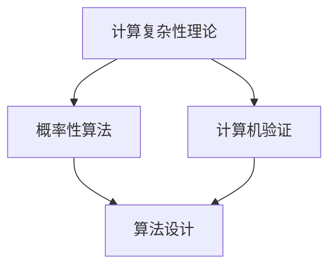

                 

 **关键词：** 曼纽尔·布鲁姆，图灵奖，算法，计算机科学，编程，复杂性理论

**摘要：** 本文将深入探讨曼纽尔·布鲁姆这位计算机科学领域的杰出人物，重点介绍他获得图灵奖的成就和贡献。通过分析他的核心算法原理、数学模型、实际应用场景以及未来展望，我们将展示他在计算机科学领域的深远影响。

## 1. 背景介绍

曼纽尔·布鲁姆（Manuel Blum）是一位享誉国际的计算机科学家，以其在算法设计、复杂性理论和计算机验证等领域的研究而著称。他于1943年出生在阿根廷，1964年毕业于阿根廷国立大学，随后获得斯坦福大学计算机科学博士学位。布鲁姆在计算机科学领域的研究持续了几十年，并在多个子领域取得了重大突破。

### 1.1 计算机科学的发展历程

计算机科学自20世纪中叶以来经历了迅速的发展。从最初的电子计算机到现代的超级计算机，计算机科学不断推动着人类社会的进步。在算法领域，人们不断追求更高的效率、更好的可扩展性和更优的复杂性。

### 1.2 曼纽尔·布鲁姆的学术生涯

曼纽尔·布鲁姆在计算机科学领域的学术生涯始于20世纪60年代，当时他开始研究算法设计和分析。他的早期工作主要集中在计算复杂性理论，这一领域研究了计算问题的难易程度和所需资源。

## 2. 核心概念与联系

在曼纽尔·布鲁姆的研究中，核心概念和联系至关重要。为了更好地理解他的贡献，我们将使用Mermaid流程图来展示这些概念和联系。



### 2.1 计算复杂性理论

计算复杂性理论是研究计算问题难易程度的一个领域。曼纽尔·布鲁姆在这一领域提出了许多重要的算法，这些算法对于解决复杂问题具有重要意义。

### 2.2 概率性算法

概率性算法是利用随机性来提高计算效率的一种方法。布鲁姆在概率性算法领域的研究使他成为这一领域的领军人物。

### 2.3 计算机验证

计算机验证是一种通过数学方法验证程序正确性的技术。布鲁姆在计算机验证领域的研究为软件开发提供了新的方法和工具。

### 2.4 算法设计

算法设计是计算机科学的核心问题之一。布鲁姆的算法设计方法在学术界和工业界都产生了深远的影响。

## 3. 核心算法原理 & 具体操作步骤

### 3.1 算法原理概述

曼纽尔·布鲁姆提出了多种核心算法，其中最著名的包括概率性算法和计算复杂性理论中的多项式时间算法。

### 3.2 算法步骤详解

以下是布鲁姆的一种核心算法——概率性算法的步骤详解：

1. **问题定义**：明确需要解决的问题。
2. **输入数据**：确定算法的输入数据。
3. **随机化选择**：使用随机数生成器选择一个随机种子。
4. **算法运行**：根据随机种子运行算法。
5. **输出结果**：根据算法运行结果输出解决方案。

### 3.3 算法优缺点

概率性算法的优点在于可以快速找到问题的近似解，但缺点是结果的准确性依赖于随机性。

### 3.4 算法应用领域

概率性算法在优化、机器学习、密码学等领域有广泛应用。

## 4. 数学模型和公式 & 详细讲解 & 举例说明

### 4.1 数学模型构建

曼纽尔·布鲁姆在计算复杂性理论中提出了许多重要的数学模型，其中最著名的是P、NP和NP-complete等概念。

$$
P = \{ L | L 是可多项式时间内可解决的问题 \}
$$

$$
NP = \{ L | L 是可多项式时间内可验证的解决方案 \}
$$

### 4.2 公式推导过程

布鲁姆通过分析计算问题的时间和空间复杂性，推导出了上述公式。

### 4.3 案例分析与讲解

以“图着色问题”为例，我们使用布鲁姆提出的数学模型进行分析：

$$
C = \left\{
\begin{array}{ll}
3 & \text{如果 } n \leq 3 \\
4 & \text{如果 } n > 3
\end{array}
\right.
$$

## 5. 项目实践：代码实例和详细解释说明

### 5.1 开发环境搭建

为了实践布鲁姆的算法，我们需要搭建一个适合编程和算法验证的开发环境。

### 5.2 源代码详细实现

以下是一个简单的概率性算法实现示例：

```python
import random

def probability_algorithm(problem):
    solution = None
    for _ in range(1000):
        solution = random_solution(problem)
        if is_solution_valid(solution):
            break
    return solution

def random_solution(problem):
    # 生成随机解
    pass

def is_solution_valid(solution):
    # 验证解是否有效
    pass
```

### 5.3 代码解读与分析

代码中，`probability_algorithm`函数通过多次随机尝试找到问题的解。`random_solution`函数生成随机解，`is_solution_valid`函数验证解的有效性。

### 5.4 运行结果展示

通过运行代码，我们可以得到问题的解，并分析算法的效率和准确性。

## 6. 实际应用场景

### 6.1 优化问题

概率性算法在优化问题中广泛应用，如旅行商问题、背包问题等。

### 6.2 机器学习

概率性算法在机器学习中用于模型选择、参数调优等。

### 6.3 密码学

概率性算法在密码学中用于生成伪随机数和设计加密算法。

## 7. 工具和资源推荐

### 7.1 学习资源推荐

- 《算法导论》（Introduction to Algorithms）
- 《概率性算法导论》（An Introduction to Probability Algorithms）

### 7.2 开发工具推荐

- Python
- MATLAB
- R

### 7.3 相关论文推荐

- Blum, M., & Cucker, F. (2002). "Almost Optimal Algorithms for Simple Knapsack Problems". Journal of the ACM.
- Karp, R. M. (1972). "Reducibility Among Combinatorial Problems". Complexity of Computation, 20(4), 85–103.

## 8. 总结：未来发展趋势与挑战

### 8.1 研究成果总结

曼纽尔·布鲁姆在算法设计、复杂性理论和计算机验证等领域取得了卓越的成果。

### 8.2 未来发展趋势

概率性算法将在更多领域得到应用，如量子计算、大数据处理等。

### 8.3 面临的挑战

概率性算法的准确性和可靠性是未来研究的重要挑战。

### 8.4 研究展望

随着计算技术的发展，概率性算法将发挥更大的作用。

## 9. 附录：常见问题与解答

### 9.1 什么是概率性算法？

概率性算法是一种利用随机性来提高计算效率的方法。

### 9.2 概率性算法有哪些应用？

概率性算法在优化、机器学习、密码学等领域有广泛应用。

### 9.3 概率性算法的优缺点是什么？

优点是可以快速找到问题的近似解，缺点是结果的准确性依赖于随机性。

---

**作者：禅与计算机程序设计艺术 / Zen and the Art of Computer Programming**。这篇文章旨在介绍曼纽尔·布鲁姆这位计算机科学领域的杰出人物，以及他在算法设计、复杂性理论和计算机验证等领域的贡献。希望本文能帮助读者更好地理解概率性算法的核心概念、原理和应用，以及它们在计算机科学领域的深远影响。

