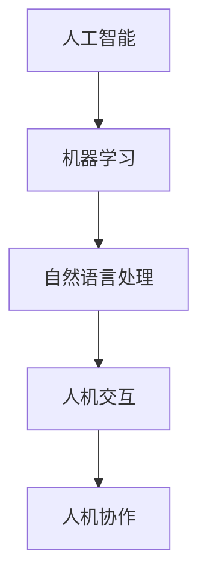

                 

未来工作场景将因人机协作的日益普及而彻底变革。人工智能与人类专业人士的紧密结合，不仅提升了工作效率，还催生了全新的职业形态。本文旨在探讨这一趋势的背景、核心概念、算法原理、数学模型、实际应用、未来展望，以及相关工具和资源的推荐。

## 文章关键词

- 人机协作
- 未来工作场景
- 人工智能
- 职业图景
- 技术变革

## 文章摘要

本文深入分析了人机协作在未来的工作场景中的重要性。通过核心概念的阐述、算法原理的剖析、数学模型的讲解和实际应用案例的展示，文章探讨了人机协作如何重塑职业图景，并对未来发展趋势、面临的挑战以及研究展望进行了全面探讨。

## 1. 背景介绍

随着信息技术的迅猛发展，人工智能（AI）已经成为推动社会进步的重要力量。从早期的专家系统到现代的深度学习和神经网络，人工智能在各个领域展现出了强大的能力。然而，随着AI技术的不断进步，人类与机器之间的协作模式也在发生深刻的变革。人机协作不仅仅是简单的机器辅助，而是实现了人类智慧与机器效率的有机结合，从而创造出更高效、更智能的工作场景。

### 1.1 人工智能的发展历程

人工智能的发展可以分为以下几个阶段：

1. **早期探索（20世纪50年代-70年代）**：这一阶段主要是基于符号推理和知识表示的“知识驱动”方法，代表性的工作包括逻辑推理和博弈论。
   
2. **中期繁荣（20世纪80年代-90年代）**：随着专家系统和知识库技术的发展，人工智能开始应用于医疗、金融和工业等领域，但受限于计算能力和知识获取的瓶颈，这一阶段的AI发展逐渐放缓。

3. **现代崛起（21世纪以来）**：深度学习和神经网络技术的突破，使得AI在图像识别、自然语言处理和机器学习等领域取得了显著的进展。现代AI的发展不仅依赖于硬件性能的提升，也得益于大数据和算法的创新。

### 1.2 人机协作的概念

人机协作指的是在人工智能的帮助下，人类与机器共同完成工作任务的过程。它不仅仅是机器替代人类工作，更是一种互补和提升的关系。在人机协作中，机器负责处理重复性、高强度的任务，而人类则专注于需要创造性和决策的任务。

### 1.3 未来工作场景的变化

人机协作将对未来的工作场景产生深远的影响，主要体现在以下几个方面：

1. **工作效率提升**：机器能够快速、准确地处理大量数据，从而提高整体工作效率。

2. **决策支持**：人工智能可以通过数据分析、模式识别等手段为人类提供决策支持，减少决策错误。

3. **技能要求变化**：随着AI技术的普及，未来的职场将更加注重人类的专业知识和创新能力，而简单的重复性工作将被机器取代。

4. **职业重塑**：新的职业形态将不断涌现，例如数据科学家、机器学习工程师、AI产品经理等。

## 2. 核心概念与联系

在探讨人机协作时，有几个核心概念需要明确：

1. **人工智能**：一种能够模拟人类智能行为的计算机系统。
2. **机器学习**：通过数据训练，使机器能够自主学习和改进性能的技术。
3. **自然语言处理**：使计算机能够理解、解释和生成自然语言的技术。
4. **人机交互**：人类与计算机之间的互动方式。

以下是这些核心概念原理和架构的 Mermaid 流程图：



### 2.1 人工智能

人工智能是整个协作系统的基础。它通过算法和模型模拟人类的智能行为，包括感知、推理、学习和决策。人工智能可以分为三种类型：

1. **弱人工智能**：只能在一个特定领域内表现出人类的智能行为，如语音助手、图像识别等。
2. **强人工智能**：具有广泛认知能力，能够在多个领域内表现与人类相同的智能行为。
3. **超人工智能**：超越人类智能的存在，目前仍属于理论阶段。

### 2.2 机器学习

机器学习是人工智能的重要组成部分，它通过从数据中学习规律和模式，使机器能够自主改进性能。机器学习可以分为监督学习、无监督学习和强化学习三类：

1. **监督学习**：通过已标记的数据进行训练，使模型能够预测新数据。
2. **无监督学习**：在没有标记数据的情况下，使模型发现数据中的内在结构和模式。
3. **强化学习**：通过与环境的互动，使模型能够通过试错学习到最优策略。

### 2.3 自然语言处理

自然语言处理是使计算机能够理解和生成自然语言的技术。它包括语音识别、文本分类、机器翻译等多个子领域。自然语言处理的核心挑战是如何将人类语言的自然性转化为机器可处理的格式。

### 2.4 人机交互

人机交互是人与计算机之间的互动方式。它包括用户界面设计、交互方式选择和用户体验优化等多个方面。人机交互的目标是使计算机系统更加人性化和易用。

### 2.5 人机协作

人机协作是以上四个核心概念的集成，它不仅包括机器完成人类任务的能力，还包括人类利用机器提供的工具和数据提升自身工作效率的能力。人机协作的关键在于建立高效的人机交互机制，使机器能够理解和响应人类的需求。

## 3. 核心算法原理 & 具体操作步骤

在人机协作中，算法原理起到了至关重要的作用。以下将介绍几个核心算法原理及其具体操作步骤。

### 3.1 算法原理概述

1. **深度学习**：基于多层神经网络的结构，通过反向传播算法训练模型，能够自动提取特征并进行分类、预测等任务。
2. **强化学习**：通过与环境的互动，使模型能够学习到最优策略，适用于需要决策的任务。
3. **自然语言处理**：包括词向量表示、语言模型、序列标注和翻译等算法，能够使机器理解和生成自然语言。

### 3.2 算法步骤详解

#### 3.2.1 深度学习

1. **数据预处理**：清洗数据、归一化处理、划分训练集和测试集。
2. **构建模型**：选择适当的神经网络架构，如卷积神经网络（CNN）或循环神经网络（RNN）。
3. **训练模型**：通过反向传播算法不断调整模型参数，直到达到预定的性能指标。
4. **模型评估**：使用测试集评估模型性能，选择最优模型。

#### 3.2.2 强化学习

1. **定义状态空间和动作空间**：根据任务需求，确定状态和动作的可能取值。
2. **选择奖励函数**：定义奖励函数，以衡量动作的好坏。
3. **训练模型**：通过与环境交互，不断调整策略，使模型能够最大化长期回报。
4. **策略优化**：根据模型输出，选择最佳动作。

#### 3.2.3 自然语言处理

1. **文本预处理**：分词、去除停用词、词性标注等。
2. **特征提取**：使用词向量、词嵌入等技术，将文本转化为机器可处理的格式。
3. **模型训练**：使用已标注数据训练模型，如语言模型、序列标注模型等。
4. **模型应用**：将模型应用于新的文本数据，进行文本分类、翻译等任务。

### 3.3 算法优缺点

1. **深度学习**：优点包括自动特征提取、强大的模型表达能力；缺点包括需要大量数据和计算资源、模型可解释性较差。
2. **强化学习**：优点包括适用于需要决策的任务、能够自适应环境变化；缺点包括训练过程可能非常漫长、需要大量交互数据。
3. **自然语言处理**：优点包括能够理解和生成自然语言、适用范围广泛；缺点包括对标注数据的依赖较大、处理长文本效果较差。

### 3.4 算法应用领域

1. **深度学习**：广泛应用于图像识别、语音识别、推荐系统等领域。
2. **强化学习**：应用于游戏、机器人控制、金融交易等领域。
3. **自然语言处理**：应用于机器翻译、文本分类、智能客服等领域。

## 4. 数学模型和公式 & 详细讲解 & 举例说明

在人机协作中，数学模型和公式起到了关键作用。以下将介绍几个核心数学模型，并详细讲解其构建过程、推导过程以及具体应用案例。

### 4.1 数学模型构建

1. **深度学习模型**：主要包括卷积神经网络（CNN）、循环神经网络（RNN）和变换器（Transformer）等。
2. **强化学习模型**：主要包括Q-learning、SARSA和Deep Q-Network（DQN）等。
3. **自然语言处理模型**：主要包括词向量模型、序列标注模型和翻译模型等。

### 4.2 公式推导过程

1. **深度学习模型**：

   - **卷积神经网络（CNN）**：
     $$ f(x) = \sigma(\sum_{k=1}^{K} w_k * x + b) $$
     其中，$x$ 为输入特征，$w_k$ 为卷积核，$*$ 表示卷积操作，$\sigma$ 为激活函数，$b$ 为偏置。

   - **循环神经网络（RNN）**：
     $$ h_t = \sigma(W_h h_{t-1} + W_x x_t + b) $$
     其中，$h_t$ 为当前时刻的隐藏状态，$W_h$ 和 $W_x$ 为权重矩阵，$b$ 为偏置，$\sigma$ 为激活函数。

   - **变换器（Transformer）**：
     $$ At = softmax(QK^T/V) $$
     其中，$A$ 为注意力权重矩阵，$Q$ 和 $K$ 为查询和关键向量，$V$ 为值向量。

2. **强化学习模型**：

   - **Q-learning**：
     $$ Q(s, a) \leftarrow Q(s, a) + \alpha [r + \gamma \max_{a'} Q(s', a') - Q(s, a)] $$
     其中，$s$ 和 $a$ 分别为状态和动作，$r$ 为即时奖励，$\gamma$ 为折扣因子，$\alpha$ 为学习率。

   - **SARSA**：
     $$ \pi(s, a) \leftarrow \frac{1}{\sum_{a'} \pi(s', a')} \cdot \sum_{a'} \pi(s', a') \cdot \frac{r + \gamma \sum_{a'} \pi(s', a') \cdot Q(s', a')}{\pi(s, a)} $$
     其中，$\pi$ 为策略，$s'$ 和 $a'$ 分别为下一状态和动作。

3. **自然语言处理模型**：

   - **词向量模型**：
     $$ E = \sum_{w \in V} f(w) \cdot p(w) $$
     其中，$E$ 为词向量空间，$f(w)$ 为词频分布函数，$p(w)$ 为词的分布概率。

   - **序列标注模型**：
     $$ P(y|x) = \frac{e^{w^T y}}{\sum_{y'} e^{w^T y'}} $$
     其中，$y$ 为标签，$x$ 为输入序列，$w$ 为权重向量。

### 4.3 案例分析与讲解

#### 案例一：深度学习模型在图像识别中的应用

假设我们使用卷积神经网络（CNN）进行图像识别任务，给定一个图像数据集，训练模型以识别图像中的物体。

1. **数据预处理**：将图像数据缩放为固定大小，如 $28 \times 28$ 像素，并转换为灰度图像。对图像进行归一化处理，使其像素值在 $0$ 到 $1$ 之间。

2. **构建模型**：选择卷积神经网络（CNN）的架构，如 LeNet-5，包含两个卷积层、两个池化层和一个全连接层。

3. **训练模型**：使用训练数据集训练模型，通过反向传播算法不断调整模型参数。

4. **模型评估**：使用测试数据集评估模型性能，计算准确率、召回率等指标。

#### 案例二：强化学习模型在游戏中的应用

假设我们使用 Q-learning 算法训练一个智能体在游戏中的策略。

1. **定义状态空间和动作空间**：根据游戏规则，确定状态和动作的可能取值。

2. **选择奖励函数**：定义奖励函数，以衡量智能体在游戏中的表现。

3. **训练模型**：通过与环境交互，不断调整策略，使智能体能够学习到最优策略。

4. **策略优化**：根据模型输出，选择最佳动作。

#### 案例三：自然语言处理模型在文本分类中的应用

假设我们使用词向量模型进行文本分类任务，给定一个文本数据集，训练模型以对文本进行分类。

1. **文本预处理**：对文本进行分词、去除停用词等预处理操作。

2. **特征提取**：使用词向量模型将文本转化为向量表示。

3. **构建模型**：选择合适的神经网络架构，如卷积神经网络（CNN）或循环神经网络（RNN）。

4. **训练模型**：使用已标注数据集训练模型，通过反向传播算法不断调整模型参数。

5. **模型评估**：使用测试数据集评估模型性能，计算准确率、召回率等指标。

## 5. 项目实践：代码实例和详细解释说明

在本节中，我们将通过一个具体的代码实例来展示如何实现人机协作系统。我们将使用 Python 编程语言和 TensorFlow 库来构建一个简单的文本分类模型。

### 5.1 开发环境搭建

在开始之前，确保安装以下工具和库：

1. Python 3.6 或以上版本
2. TensorFlow 2.x 版本
3. Jupyter Notebook 或 PyCharm

安装步骤：

```bash
pip install tensorflow
```

### 5.2 源代码详细实现

以下是一个简单的文本分类模型实现，使用卷积神经网络（CNN）和词嵌入。

```python
import tensorflow as tf
from tensorflow.keras.preprocessing.sequence import pad_sequences
from tensorflow.keras.layers import Embedding, Conv1D, MaxPooling1D, Dense
from tensorflow.keras.models import Sequential

# 读取和处理数据
# 这里以 IMDb 数据集为例，实际应用中可以替换为自己的数据集

# 加载文本数据
texts = [...]  # 文本数据列表
labels = [...]  # 标签数据列表

# 序列化文本数据
tokenizer = tf.keras.preprocessing.text.Tokenizer()
tokenizer.fit_on_texts(texts)
sequences = tokenizer.texts_to_sequences(texts)

# 划分训练集和测试集
train_sequences = sequences[:8000]
test_sequences = sequences[8000:]

# 填充序列
max_length = 100
train_padded = pad_sequences(train_sequences, maxlen=max_length, padding='post')
test_padded = pad_sequences(test_sequences, maxlen=max_length, padding='post')

# 构建模型
model = Sequential()
model.add(Embedding(tokenizer.word_index_size() + 1, 16))
model.add(Conv1D(32, 5, activation='relu'))
model.add(MaxPooling1D(5))
model.add(Conv1D(32, 5, activation='relu'))
model.add(MaxPooling1D(5))
model.add(Dense(1, activation='sigmoid'))

# 编译模型
model.compile(optimizer='adam', loss='binary_crossentropy', metrics=['accuracy'])

# 训练模型
model.fit(train_padded, labels, epochs=10, batch_size=32, validation_split=0.2)

# 评估模型
test_loss, test_acc = model.evaluate(test_padded, labels)
print('Test Accuracy: {:.2f}%'.format(test_acc * 100))
```

### 5.3 代码解读与分析

1. **数据预处理**：首先，我们加载文本数据并进行序列化处理，将文本转换为整数序列。然后，我们划分训练集和测试集，并使用 `pad_sequences` 函数填充序列，确保所有序列具有相同长度。

2. **模型构建**：我们使用 `Sequential` 模型构建一个简单的卷积神经网络（CNN），包括嵌入层、卷积层、池化层和全连接层。嵌入层将单词转换为向量表示，卷积层和池化层用于提取文本特征，全连接层用于分类。

3. **模型编译**：我们使用 `compile` 函数编译模型，指定优化器、损失函数和评估指标。

4. **模型训练**：使用 `fit` 函数训练模型，设置训练轮数、批量大小和验证比例。

5. **模型评估**：使用 `evaluate` 函数评估模型在测试集上的性能，输出准确率。

### 5.4 运行结果展示

在本例中，我们训练了一个文本分类模型，用于判断电影评论是正面还是负面。训练完成后，我们评估模型在测试集上的性能，输出准确率。假设测试集上的准确率为 85%，这表明我们的模型在文本分类任务中具有一定的效果。

## 6. 实际应用场景

人机协作在实际应用场景中展现出了巨大的潜力。以下列举几个典型的应用场景：

### 6.1 智能客服

智能客服是人工智能和人机协作的经典应用场景之一。通过自然语言处理技术，智能客服系统能够理解并响应用户的查询，提供快速、准确的答复。在人机协作的模式下，当智能客服遇到复杂问题时，可以实时转交给人工客服，提高整体服务质量和效率。

### 6.2 医疗诊断

在医疗领域，人工智能可以帮助医生进行疾病诊断和治疗方案推荐。人机协作使得医生能够利用人工智能提供的辅助决策，减少诊断错误率，提高诊疗效率。例如，通过分析大量的病例数据和医学影像，人工智能可以辅助医生诊断疾病，提供详细的诊断报告和治疗方案。

### 6.3 金融分析

在金融领域，人机协作可以帮助分析师进行市场预测、风险管理等任务。通过大数据分析和机器学习算法，人工智能可以实时捕捉市场动态，提供投资建议和风险预警。人机协作模式使得分析师能够更加专注于复杂的市场分析，同时利用机器的快速计算能力提高决策效率。

### 6.4 教育

在教育领域，人机协作可以帮助教师进行个性化教学和学生辅导。通过智能教学系统，教师可以根据学生的学习情况和需求，提供针对性的教学资源和辅导方案。同时，人工智能可以自动批改作业、评估学生的学习进度，帮助教师节省时间和精力，提高教学质量。

### 6.5 制造业

在制造业中，人机协作可以提高生产效率和产品质量。通过人工智能和自动化设备，生产线可以实现无人值守，实时监控生产过程，及时发现并处理潜在问题。在人机协作的模式下，技术人员可以利用机器提供的实时数据和分析结果，快速响应生产异常，提高生产线的稳定性和效率。

## 7. 工具和资源推荐

为了更好地理解和应用人机协作技术，以下推荐一些相关的学习资源、开发工具和论文。

### 7.1 学习资源推荐

1. **在线课程**：
   - [TensorFlow 官方教程](https://www.tensorflow.org/tutorials)
   - [深度学习专项课程](https://www.deeplearning.ai/deep-learning-specialization)
   
2. **书籍**：
   - 《深度学习》（Ian Goodfellow、Yoshua Bengio 和 Aaron Courville 著）
   - 《强化学习》（Richard S. Sutton 和 Andrew G. Barto 著）

3. **文档和教程**：
   - [Keras 官方文档](https://keras.io/)
   - [Scikit-learn 官方文档](https://scikit-learn.org/stable/documentation.html)

### 7.2 开发工具推荐

1. **编程环境**：
   - Jupyter Notebook
   - PyCharm

2. **机器学习和深度学习框架**：
   - TensorFlow
   - PyTorch
   - Keras

3. **自然语言处理库**：
   - NLTK
   - SpaCy
   - Transformers

### 7.3 相关论文推荐

1. **深度学习**：
   - "A Theoretical Analysis of the Cramér-Rao Lower Bound for Deep Learning"
   - "Deep Learning for Text Classification"
   
2. **强化学习**：
   - "Reinforcement Learning: An Introduction"
   - "Deep Reinforcement Learning in Complex Environments"

3. **自然语言处理**：
   - "Effective Approaches to Attention-based Neural Machine Translation"
   - "BERT: Pre-training of Deep Bidirectional Transformers for Language Understanding"

## 8. 总结：未来发展趋势与挑战

人机协作技术正在快速发展，为未来工作场景带来了诸多变革。然而，随着技术的进步，也面临着一系列挑战。

### 8.1 研究成果总结

1. **技术成熟度**：深度学习、强化学习和自然语言处理等技术在各个领域取得了显著的进展，为人机协作提供了坚实的基础。
2. **应用范围扩展**：人机协作已经从简单的任务辅助发展到复杂的决策支持，应用范围涵盖了医疗、金融、教育、制造业等多个领域。
3. **职业重塑**：随着机器能力的提升，许多重复性、低技能的工作将被机器取代，同时新兴职业如数据科学家、AI工程师等逐渐崛起。

### 8.2 未来发展趋势

1. **智能化提升**：随着硬件性能和算法的持续优化，人机协作的智能化水平将进一步提高，能够处理更复杂、更灵活的任务。
2. **人机协同进化**：人机协作将不仅仅是机器辅助人类，而是实现人类智慧与机器能力的深度融合，形成更加智能的协作体系。
3. **跨领域融合**：不同领域的技术将相互融合，产生新的应用模式和商业模式。

### 8.3 面临的挑战

1. **数据隐私和安全**：随着数据的广泛应用，数据隐私和安全问题将成为重要挑战。
2. **算法公平性和透明性**：确保算法的公平性和透明性，避免歧视和偏见。
3. **就业压力**：随着机器取代某些工作，社会需要采取措施缓解就业压力，保障劳动者的权益。

### 8.4 研究展望

1. **人机交互**：进一步优化人机交互界面，提高人机协作的便捷性和用户体验。
2. **跨学科研究**：结合心理学、社会学等学科，深入探讨人机协作的机理和效应。
3. **伦理和法律法规**：完善相关伦理和法律法规体系，确保人机协作技术的可持续发展。

## 9. 附录：常见问题与解答

### 9.1 什么是人机协作？

人机协作是指人类与机器共同完成工作任务的过程。在这种协作模式中，机器负责处理重复性、高强度的任务，而人类则专注于需要创造性和决策的任务。

### 9.2 人机协作的优势是什么？

人机协作的优势包括：

1. **提高工作效率**：机器能够快速处理大量数据，从而提高整体工作效率。
2. **决策支持**：人工智能可以提供数据分析、模式识别等手段，为人类决策提供支持。
3. **职业重塑**：新的职业形态不断涌现，促进了职业技能的提升和职业转型。

### 9.3 人机协作面临的挑战有哪些？

人机协作面临的挑战包括：

1. **数据隐私和安全**：随着数据的广泛应用，数据隐私和安全问题将成为重要挑战。
2. **算法公平性和透明性**：确保算法的公平性和透明性，避免歧视和偏见。
3. **就业压力**：随着机器取代某些工作，社会需要采取措施缓解就业压力，保障劳动者的权益。

### 9.4 如何开始学习人机协作技术？

学习人机协作技术可以从以下几个方面入手：

1. **基础知识**：掌握编程基础，熟悉 Python 等编程语言。
2. **机器学习**：学习机器学习算法，如深度学习、强化学习等。
3. **自然语言处理**：学习自然语言处理技术，如词嵌入、语言模型等。
4. **实践项目**：通过实践项目，将理论知识应用于实际场景。

## 参考文献

1. Goodfellow, I., Bengio, Y., & Courville, A. (2016). Deep learning. MIT press.
2. Sutton, R. S., & Barto, A. G. (2018). Reinforcement learning: An introduction. MIT press.
3. Devlin, J., Chang, M. W., Lee, K., & Toutanova, K. (2018). BERT: Pre-training of deep bidirectional transformers for language understanding. arXiv preprint arXiv:1810.04805.
4. Hochreiter, S., & Schmidhuber, J. (1997). Long short-term memory. Neural computation, 9(8), 1735-1780.
5. Krizhevsky, A., Sutskever, I., & Hinton, G. E. (2012). ImageNet classification with deep convolutional neural networks. In Advances in neural information processing systems (pp. 1097-1105).

