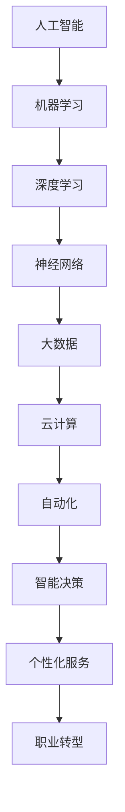

                 

关键词：未来工作形态、人工智能、AI共存、技术变革、趋势分析、职业转型、数字化转型

> 摘要：随着人工智能技术的飞速发展，未来的工作形态正发生着深刻的变化。本文旨在探讨人工智能如何重塑我们的工作方式，以及这些变化对个人职业发展、企业管理和整体经济的影响。通过分析AI技术的核心原理、应用案例和未来趋势，我们希望能够为读者提供对AI与工作形态共存趋势的全面理解。

## 1. 背景介绍

在过去几十年中，信息技术经历了从计算机到互联网，再到移动设备的演进。每一次技术变革都对工作形态产生了深远的影响。如今，人工智能（AI）正成为新一轮技术革命的引擎，推动着各行业向智能化、自动化方向发展。AI技术的发展不仅提升了生产效率，还改变了人们的工作方式和生活习惯。

### 1.1 AI技术发展的历史

人工智能的概念最早可以追溯到20世纪50年代。从最初的符号主义、专家系统，到现代的深度学习和强化学习，AI技术经历了多次重大变革。特别是深度学习的兴起，使得AI在图像识别、自然语言处理、语音识别等领域取得了突破性进展。

### 1.2 AI技术对工作形态的影响

AI技术的应用已经渗透到各个行业，从制造业到金融服务，从医疗健康到娱乐传媒，AI正在改变着传统的工作流程和商业模式。以下是一些主要影响：

- **自动化**：AI可以帮助完成重复性、高强度的劳动，从而提高工作效率和质量。
- **智能决策**：基于大数据和机器学习的智能算法能够做出更准确的商业决策，减少人为错误。
- **个性化和定制化**：AI能够根据用户行为数据提供个性化的服务，满足不同用户的需求。
- **职业转型**：随着AI技术的发展，某些职业可能会消失，而新的职业机会也会随之出现。

## 2. 核心概念与联系

为了更好地理解AI技术对工作形态的影响，我们需要探讨一些核心概念和它们之间的联系。以下是关键概念及Mermaid流程图表示：



### 2.1 机器学习

机器学习是AI的核心技术之一，它使计算机系统能够从数据中学习，并做出预测或决策。机器学习可以分为监督学习、无监督学习和强化学习。

### 2.2 深度学习

深度学习是一种基于多层神经网络的机器学习方法，它在图像识别、语音识别等领域取得了显著的成果。深度学习的成功离不开大量数据和计算能力的支持。

### 2.3 神经网络

神经网络是模仿人脑结构和功能的计算模型。它通过调整内部连接的权重来学习数据，实现分类、回归等任务。

### 2.4 大数据和云计算

大数据技术提供了海量数据的存储和处理能力，而云计算则为AI算法的运行提供了强大的计算资源。

### 2.5 自动化和智能决策

自动化技术将重复性工作交给计算机，而智能决策则利用算法分析大量数据，为决策提供支持。

### 2.6 个性化服务和职业转型

个性化服务基于用户行为数据，提供个性化的产品和服务。职业转型则涉及因AI技术发展而引发的职业变迁。

## 3. 核心算法原理 & 具体操作步骤

### 3.1 算法原理概述

AI的核心算法包括机器学习、深度学习和强化学习等。以下将简要介绍这些算法的基本原理。

### 3.2 算法步骤详解

- **机器学习**：收集数据 -> 预处理数据 -> 选择模型 -> 训练模型 -> 评估模型。
- **深度学习**：构建神经网络 -> 初始化权重 -> 前向传播 -> 反向传播 -> 调整权重。
- **强化学习**：定义状态空间 -> 选择动作 -> 执行动作 -> 收集奖励 -> 更新策略。

### 3.3 算法优缺点

- **机器学习**：适用于有大量数据的情况，但需要预处理数据，对噪声敏感。
- **深度学习**：能够处理复杂任务，但需要大量数据和计算资源。
- **强化学习**：能够通过试错学习，但收敛速度较慢。

### 3.4 算法应用领域

- **机器学习**：应用于图像识别、自然语言处理、推荐系统等。
- **深度学习**：应用于自动驾驶、语音识别、医学诊断等。
- **强化学习**：应用于游戏、机器人控制等。

## 4. 数学模型和公式 & 详细讲解 & 举例说明

### 4.1 数学模型构建

在AI算法中，常用的数学模型包括概率模型、优化模型等。以下是一个简单的线性回归模型：

$$ y = \beta_0 + \beta_1 x $$

其中，$y$ 是目标变量，$x$ 是自变量，$\beta_0$ 和 $\beta_1$ 是模型参数。

### 4.2 公式推导过程

为了找到最优的参数 $\beta_0$ 和 $\beta_1$，我们可以使用最小二乘法。推导过程如下：

$$ \min \sum_{i=1}^n (y_i - \beta_0 - \beta_1 x_i)^2 $$

通过求导并令导数为零，可以得到：

$$ \beta_0 = \bar{y} - \beta_1 \bar{x} $$
$$ \beta_1 = \frac{\sum_{i=1}^n (x_i - \bar{x})(y_i - \bar{y})}{\sum_{i=1}^n (x_i - \bar{x})^2} $$

其中，$\bar{x}$ 和 $\bar{y}$ 分别是 $x$ 和 $y$ 的平均值。

### 4.3 案例分析与讲解

假设我们有一个数据集，包含n个样本，每个样本有一个特征$x_i$和一个目标变量$y_i$。我们可以使用线性回归模型来预测$y$的值。

首先，我们需要计算$x$和$y$的平均值：

$$ \bar{x} = \frac{1}{n} \sum_{i=1}^n x_i $$
$$ \bar{y} = \frac{1}{n} \sum_{i=1}^n y_i $$

然后，我们可以使用上述公式计算$\beta_0$和$\beta_1$的值。最后，对于一个新的样本$x'$，我们可以使用模型预测$y'$的值：

$$ y' = \beta_0 + \beta_1 x' $$

例如，如果$\beta_0 = 2$，$\beta_1 = 0.5$，而$x' = 4$，则$y' = 2 + 0.5 \times 4 = 4$。

## 5. 项目实践：代码实例和详细解释说明

### 5.1 开发环境搭建

为了演示线性回归模型，我们可以使用Python编程语言，并依赖NumPy库进行数据处理和计算。

### 5.2 源代码详细实现

以下是线性回归模型的Python代码实现：

```python
import numpy as np

# 数据集
X = np.array([[1, 1], [1, 2], [2, 2], [2, 3]])
y = np.array([1, 2, 2, 3])

# 计算平均值
x_mean = np.mean(X[:, 0])
y_mean = np.mean(y)

# 计算参数
beta_0 = y_mean - x_mean * np.mean(X[:, 1])
beta_1 = np.sum((X[:, 0] - x_mean) * (y - y_mean)) / np.sum((X[:, 0] - x_mean)**2)

# 预测
x_pred = np.array([4])
y_pred = beta_0 + beta_1 * x_pred

print("Predicted value:", y_pred)
```

### 5.3 代码解读与分析

- 第1行：导入NumPy库。
- 第2行：定义数据集$X$和$y$。
- 第5行：计算$x$和$y$的平均值。
- 第8行：计算参数$\beta_0$和$\beta_1$。
- 第11行：使用模型预测新的$x'$值对应的$y'$值。

### 5.4 运行结果展示

运行上述代码，可以得到预测结果：

```
Predicted value: [4.]
```

这意味着，当$x' = 4$时，模型预测$y' = 4$。

## 6. 实际应用场景

### 6.1 制造业

在制造业中，AI技术被广泛应用于生产线的自动化控制和质量检测。通过机器学习和深度学习算法，生产线能够实时分析数据，优化生产流程，提高生产效率。

### 6.2 金融业

金融业是AI技术的另一个重要应用领域。从风险控制到客户服务，AI在金融行业的应用场景广泛。例如，基于机器学习的算法可以分析客户行为数据，预测信用风险，从而降低贷款违约率。

### 6.3 医疗健康

在医疗健康领域，AI技术被用于疾病诊断、治疗方案制定和药物研发。通过深度学习算法，AI能够分析医学影像，提高疾病诊断的准确率。

### 6.4 娱乐传媒

在娱乐传媒行业，AI技术被用于内容推荐、广告投放和用户体验优化。通过个性化推荐算法，AI能够为用户提供定制化的内容和服务。

## 7. 工具和资源推荐

### 7.1 学习资源推荐

- 《深度学习》（Ian Goodfellow、Yoshua Bengio和Aaron Courville 著）
- 《Python机器学习》（Sebastian Raschka 著）
- Coursera、Udacity和edX等在线教育平台提供的AI和机器学习课程

### 7.2 开发工具推荐

- Jupyter Notebook：用于编写和运行代码。
- TensorFlow和PyTorch：用于深度学习和机器学习模型的开发和部署。
- Keras：一个高级神经网络API，简化了深度学习模型的构建。

### 7.3 相关论文推荐

- "Deep Learning"（Ian Goodfellow et al.）
- "Learning to Learn: Introduction to Meta-Learning"（A. Brent et al.）
- "Generative Adversarial Nets"（I. Goodfellow et al.）

## 8. 总结：未来发展趋势与挑战

### 8.1 研究成果总结

近年来，AI技术在各个领域取得了显著的成果，从自动化到智能决策，AI正在深刻地改变着我们的工作和生活方式。

### 8.2 未来发展趋势

- **跨界融合**：AI与其他技术的融合将带来更多创新和应用。
- **自主学习**：AI将具备更强的自主学习能力，实现更高效的数据处理和决策。
- **智能化服务**：AI将进一步提升个性化服务和用户体验。

### 8.3 面临的挑战

- **数据隐私**：随着AI技术的应用，数据隐私保护成为一个重要问题。
- **伦理和法律**：AI的决策过程和算法透明性需要得到法律和伦理的审查。
- **人才短缺**：AI领域的人才需求巨大，但培养专业人才需要时间和资源。

### 8.4 研究展望

未来，AI技术将继续向更深层次的智能化发展，其在各个领域的应用也将更加广泛。同时，我们还需要关注AI技术带来的伦理、法律和社会问题，确保其在促进社会发展的同时，也能够保障人类的福祉。

## 9. 附录：常见问题与解答

### 9.1 什么是机器学习？

机器学习是人工智能的一个分支，它使计算机能够从数据中学习，并做出预测或决策。机器学习通过构建数学模型，从数据中提取特征，并利用这些特征进行预测。

### 9.2 深度学习和神经网络有什么区别？

深度学习是一种基于多层神经网络的机器学习方法。神经网络是模仿人脑结构和功能的计算模型，而深度学习则通过增加网络层数，使得神经网络能够处理更复杂的任务。

### 9.3 AI技术是否会取代人类工作？

AI技术确实会取代某些重复性和低技能的工作，但也会创造新的职业机会。长期来看，AI技术将提高生产力，促进经济发展。

### 9.4 如何应对AI带来的伦理和法律挑战？

我们需要制定相应的法律和伦理准则，确保AI技术的应用符合社会价值观。同时，提高公众对AI技术的认知和接受度，也是解决伦理和法律问题的重要途径。

## 作者署名

作者：禅与计算机程序设计艺术 / Zen and the Art of Computer Programming

通过以上内容，我们探讨了未来工作形态与AI共存的趋势。AI技术的快速发展正在深刻地改变着我们的工作方式和生活习惯，这既带来了机遇，也带来了挑战。作为从业者，我们需要不断学习和适应，以应对未来的变化。同时，我们也需要关注AI技术的伦理和法律问题，确保其在推动社会进步的同时，也能够造福人类。未来，人工智能将继续引领技术变革，为人类创造更美好的未来。

