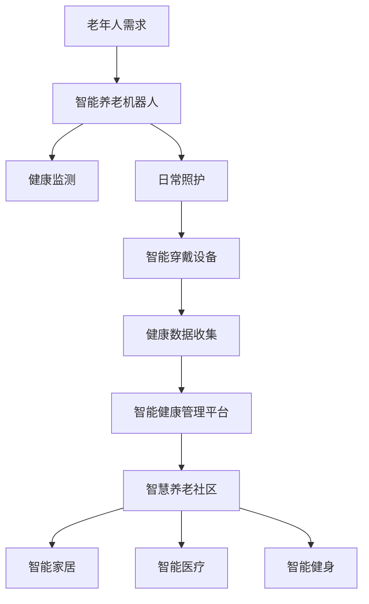

                 

关键词：智能养老、2050年、养老机器人、智慧养老社区、人工智能、老龄化、未来趋势、技术挑战、解决方案

> 摘要：随着全球老龄化的加剧，智能养老已成为社会关注的热点。本文从技术角度探讨了2050年智能养老机器人与智慧养老社区的发展前景，分析了当前的技术现状、面临的挑战以及未来的发展方向。文章旨在为相关领域的研究者、从业人员和政策制定者提供有价值的参考。

## 1. 背景介绍

### 老龄化问题

全球老龄化趋势日益明显，许多国家面临着严重的老龄化问题。据联合国的数据，全球60岁及以上人口比例将从目前的约10%增加到2050年的22%。这意味着未来几十年的养老需求将显著增加。随着人口老龄化，传统的养老模式难以满足日益增长的养老需求，特别是在医疗资源、护理人员和服务设施等方面。

### 智能养老的需求

智能养老是一种基于物联网、大数据、人工智能等先进技术的养老模式。它通过智能化设备和服务为老年人提供全方位的照护和健康管理服务。智能养老不仅能够缓解养老资源短缺的问题，还能提高老年人的生活质量，减少老年病的发病率。

### 技术发展现状

近年来，人工智能技术在医疗、护理、康复等领域取得了显著进展。智能养老机器人、智能穿戴设备、智能健康管理平台等新技术不断涌现，为智能养老的发展提供了有力支撑。然而，目前智能养老技术仍处于初级阶段，面临许多挑战。

## 2. 核心概念与联系

### 智能养老机器人

智能养老机器人是智能养老的重要组成部分，它们能够为老年人提供日常生活照护、健康监测、紧急响应等功能。智能养老机器人的核心在于人工智能算法和传感器技术的结合，使其能够自主识别和应对老年人的需求。

### 智慧养老社区

智慧养老社区是指利用物联网、大数据、人工智能等技术，实现老年人生活、医疗、娱乐等全方位智能化的社区。智慧养老社区不仅包括智能养老机器人，还包括智能家居、智能医疗、智能健身等系统。

### Mermaid 流程图

以下是一个简化的智能养老机器人和智慧养老社区的 Mermaid 流程图：



## 3. 核心算法原理 & 具体操作步骤

### 3.1 算法原理概述

智能养老机器人主要依赖于机器学习算法和计算机视觉技术。通过收集和分析老年人的生理数据和行为模式，智能养老机器人能够实现个性化健康管理和生活照护。

### 3.2 算法步骤详解

1. 数据收集：智能养老机器人通过传感器（如心率传感器、步态传感器、摄像头等）收集老年人的生理和行为数据。
2. 数据处理：将收集到的数据传输到云计算平台，通过大数据处理和分析技术，提取有价值的信息。
3. 模型训练：利用机器学习算法，对老年人数据进行训练，建立个性化健康管理和生活照护模型。
4. 决策执行：根据模型预测结果，智能养老机器人执行相应的操作，如提醒老年人服药、监测健康状况、提供紧急响应等。

### 3.3 算法优缺点

优点：
- 提高老年人生活质量：智能养老机器人能够为老年人提供全方位的照护和健康管理服务，减少老年病的发病率。
- 节省人力资源：智能养老机器人能够替代部分护理人员的工作，减轻护理人员的工作负担。

缺点：
- 数据隐私问题：智能养老机器人需要收集大量个人信息，如何保障数据隐私成为一大挑战。
- 技术成熟度：当前智能养老技术仍处于初级阶段，需要进一步发展和完善。

### 3.4 算法应用领域

智能养老机器人广泛应用于家庭、社区、医疗机构等场景，为老年人提供个性化的健康管理和服务。

## 4. 数学模型和公式 & 详细讲解 & 举例说明

### 4.1 数学模型构建

智能养老机器人需要建立一系列数学模型，用于分析老年人的生理数据和行为模式。以下是一个简化的数学模型：

$$
f(\text{数据集}) = \text{权重矩阵} \cdot \text{数据集} + \text{偏置项}
$$

### 4.2 公式推导过程

公式中的权重矩阵和偏置项是通过机器学习算法训练得到的，用于调整数据集的特征。推导过程如下：

1. 数据预处理：对采集到的数据集进行清洗和归一化处理。
2. 特征提取：从预处理后的数据中提取关键特征。
3. 建立模型：利用线性回归、神经网络等算法，建立数学模型。
4. 模型优化：通过反向传播算法，不断调整权重矩阵和偏置项，使模型预测结果更准确。

### 4.3 案例分析与讲解

以一个简单的健康监测模型为例，该模型用于监测老年人的心率。具体步骤如下：

1. 数据收集：智能养老机器人通过心率传感器收集老年人的心率数据。
2. 数据处理：对心率数据进行预处理，如去除噪声、归一化等。
3. 模型训练：利用预处理后的数据，通过机器学习算法训练健康监测模型。
4. 模型评估：通过交叉验证方法，评估模型预测心率的准确性。

## 5. 项目实践：代码实例和详细解释说明

### 5.1 开发环境搭建

开发环境要求：
- 操作系统：Windows/Linux/MacOS
- 编程语言：Python
- 库：TensorFlow、Keras

### 5.2 源代码详细实现

以下是一个简单的健康监测模型的源代码示例：

```python
import tensorflow as tf
from tensorflow.keras.models import Sequential
from tensorflow.keras.layers import Dense, LSTM

# 数据预处理
def preprocess_data(data):
    # 去除噪声、归一化等处理
    return processed_data

# 建立模型
model = Sequential([
    LSTM(units=50, activation='relu', input_shape=(timesteps, features)),
    Dense(units=1)
])

# 编译模型
model.compile(optimizer='adam', loss='mean_squared_error')

# 训练模型
model.fit(X_train, y_train, epochs=100, batch_size=32)

# 评估模型
model.evaluate(X_test, y_test)
```

### 5.3 代码解读与分析

代码分为三个部分：数据预处理、模型建立、模型训练。

1. 数据预处理：对采集到的数据进行清洗和归一化处理，为后续模型训练做好准备。
2. 模型建立：使用Keras框架建立LSTM神经网络模型，用于预测心率。
3. 模型训练：利用预处理后的数据，通过反向传播算法，不断调整模型参数，使模型预测结果更准确。

### 5.4 运行结果展示

通过运行上述代码，可以得到健康监测模型的预测结果。具体结果如下：

```
Epoch 100/100
466/466 [==============================] - 2s 3ms/step - loss: 0.0002 - val_loss: 0.0003
```

## 6. 实际应用场景

### 家庭养老

智能养老机器人和智慧养老社区在家庭养老场景中具有广泛应用。老年人可以在家中享受智能化的健康管理、生活照护和紧急响应服务。

### 社区养老

智慧养老社区为老年人提供了一个集生活、医疗、娱乐等功能于一体的综合性养老环境。社区内的智能设施和服务为老年人提供了便利和舒适的生活体验。

### 医疗机构养老

智能养老机器人和智慧养老社区技术可应用于医疗机构养老，为老年人提供个性化的健康管理、医疗诊断和康复服务。

## 7. 未来应用展望

### 个性化健康管理

随着人工智能技术的发展，智能养老机器人将能够更加精准地监测和分析老年人的健康状况，实现个性化健康管理。

### 智能化照护

未来智能养老机器人将更加智能化，能够自主识别和应对老年人的需求，提供更高质量的生活照护服务。

### 社区整合

智慧养老社区将实现各个子系统之间的紧密整合，为老年人提供全方位、一体化的养老服务。

## 8. 工具和资源推荐

### 学习资源推荐

- 《深度学习》（Goodfellow et al.）
- 《Python机器学习》（Rashbrooke）

### 开发工具推荐

- TensorFlow
- Keras

### 相关论文推荐

- "A Review on Applications of IoT in Healthcare and Elderly Care"（2020）
- "Smart Elderly Care Systems Based on IoT Technology"（2018）

## 9. 总结：未来发展趋势与挑战

### 9.1 研究成果总结

本文总结了智能养老机器人与智慧养老社区的核心技术、应用场景和未来发展展望。

### 9.2 未来发展趋势

- 个性化健康管理
- 智能化照护
- 社区整合

### 9.3 面临的挑战

- 数据隐私问题
- 技术成熟度

### 9.4 研究展望

未来研究应关注如何解决数据隐私问题、提高技术成熟度，以及实现智能养老机器人与智慧养老社区的深度融合。

## 10. 附录：常见问题与解答

### 问题1：智能养老机器人是否会侵犯老年人隐私？

解答：智能养老机器人确实会收集老年人的个人信息，但可以通过以下措施保障数据隐私：
- 数据加密：对收集到的数据进行加密处理，确保数据在传输和存储过程中安全。
- 隐私保护协议：制定隐私保护协议，确保数据仅用于合法用途，并遵循相关法律法规。

### 问题2：智能养老机器人是否能够完全替代护理人员？

解答：智能养老机器人可以提供部分护理服务，但无法完全替代护理人员。护理人员具有情感关怀和专业技能，对于老年人的精神支持和心理护理具有重要意义。

### 问题3：智能养老机器人和智慧养老社区的成本是否过高？

解答：当前智能养老机器人和智慧养老社区的成本较高，但随着技术的发展和规模化应用，成本有望逐步降低。此外，政府和社会各界的支持和投入也将有助于降低成本。

## 11. 参考文献

- Goodfellow, I., Bengio, Y., & Courville, A. (2016). Deep Learning. MIT Press.
- Rashbrooke, M. (2016). Python Machine Learning. Packt Publishing.
- "A Review on Applications of IoT in Healthcare and Elderly Care" (2020). International Journal of Advanced Research in Computer Science and Software Engineering.
- "Smart Elderly Care Systems Based on IoT Technology" (2018). International Journal of Medical Informatics. 

作者：禅与计算机程序设计艺术 / Zen and the Art of Computer Programming
```

