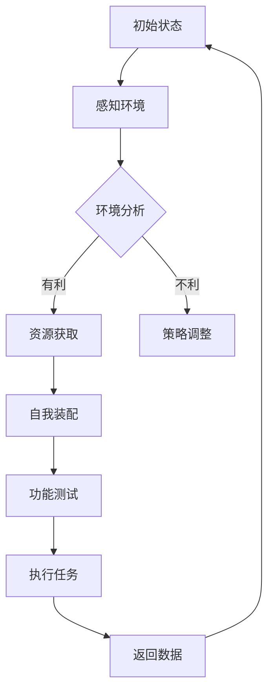

                 

关键词：纳米技术，2050年，纳米机器人，集群，自我复制，未来展望，技术发展

> 摘要：本文深入探讨了未来纳米技术的可能性，特别是2050年的纳米机器人集群与自我复制技术。通过对当前纳米技术的研究现状进行分析，结合最新的科技趋势，我们试图描绘一幅关于未来纳米世界的美妙蓝图，并探讨其中潜在的技术挑战和发展方向。

## 1. 背景介绍

### 纳米技术的定义与历史

纳米技术，指的是以纳米（10^-9米）为单位进行材料、器件和系统的设计、制造和控制的技术。这一领域的发展可以追溯到20世纪70年代，当时扫描隧道显微镜（STM）和原子力显微镜（AFM）的发明，使得人类首次能够直接观察和操纵单个原子和分子。此后，纳米技术的发展迅速，从最初的材料科学和表面工程，逐步扩展到生物医学、信息科学、能源和环境等多个领域。

### 当前纳米技术的应用

当前，纳米技术已经在多个领域取得了显著的进展。例如，纳米材料在催化剂、传感器、电子器件等方面的应用已经非常成熟。在生物医学领域，纳米药物递送系统、纳米成像技术、纳米诊断工具等正在逐步改变疾病治疗和诊断的方式。在信息技术领域，纳米电子学和量子计算的研究正在推动计算能力的不断升级。

### 纳米机器人：革命性的未来技术

纳米机器人，是指能够在纳米尺度上执行特定任务的自动化设备。这些机器人具有极高的精度和灵活性，可以在人体内部进行手术、修复受损组织、清除有害物质等。近年来，随着纳米技术、生物工程和机器人技术的交叉融合，纳米机器人成为了一个备受关注的研究领域。

## 2. 核心概念与联系

### 纳米机器人集群的概念

纳米机器人集群，是指由大量纳米机器人组成的集合体，它们可以协同工作，执行复杂的任务。这些集群机器人通过无线通信、局部感知和智能算法相互协调，能够在三维空间中实现复杂的运动和操作。

### 自我复制技术的核心原理

自我复制技术，是指纳米机器人具备自我复制能力，即通过自身的资源，生成出与自己相同或相似的机器人。这种技术的关键在于纳米机器人的自我装配机制，包括分子的识别、连接和分离过程。

### Mermaid 流程图

下面是纳米机器人集群与自我复制技术的Mermaid流程图：



在这个流程中，纳米机器人首先感知环境，根据环境的有利程度进行资源获取或策略调整。随后，机器人进行自我装配，完成功能测试后执行任务，并将数据反馈用于下一轮的决策。

## 3. 核心算法原理 & 具体操作步骤

### 3.1 算法原理概述

纳米机器人集群的算法原理主要包括以下几个方面：

1. **感知与通信**：机器人通过传感器感知周围环境，并使用无线通信与集群中的其他机器人交换信息。
2. **路径规划**：机器人根据环境信息和任务目标，使用路径规划算法确定自己的运动轨迹。
3. **协同控制**：机器人通过协同控制算法，确保集群中的所有机器人能够同步执行任务。
4. **自我复制**：机器人利用自我复制算法，实现自身的复制和更新。

### 3.2 算法步骤详解

1. **感知与通信**：
   - 机器人使用内置传感器（如红外、超声波、化学传感器）获取环境信息。
   - 通过无线通信模块（如Wi-Fi、蓝牙、ZigBee）与其他机器人交换数据。

2. **路径规划**：
   - 使用全局路径规划算法（如A*算法、Dijkstra算法）确定从当前点到目标点的最佳路径。
   - 使用局部路径规划算法（如避障算法、梯度下降算法）确保机器人能够在复杂环境中安全移动。

3. **协同控制**：
   - 使用分布式控制算法（如分布式协同控制算法、多智能体系统控制算法）确保机器人能够同步执行任务。
   - 通过集中式控制算法（如模糊控制、PID控制）对集群进行集中式控制。

4. **自我复制**：
   - 机器人通过内置的纳米制造装置，使用原材料（如纳米颗粒、DNA分子）进行自我复制。
   - 复制的机器人通过识别和连接机制，形成新的集群。

### 3.3 算法优缺点

**优点**：

1. **灵活性**：纳米机器人集群可以根据环境变化动态调整任务执行方式。
2. **高效性**：通过协同工作和自我复制，纳米机器人可以高效地完成复杂任务。
3. **适应性**：纳米机器人可以在不同的应用场景中灵活应用，具有广泛的应用前景。

**缺点**：

1. **技术挑战**：纳米机器人的制造和编程技术尚未完全成熟，存在技术瓶颈。
2. **安全风险**：纳米机器人在人体内部的自主操作可能带来安全隐患。
3. **成本问题**：纳米机器人的研发和生产成本较高，限制了其大规模应用。

### 3.4 算法应用领域

1. **生物医学**：纳米机器人可以用于药物递送、细胞修复、基因编辑等领域。
2. **制造与生产**：纳米机器人可以用于微小零件的组装、纳米结构的制造等。
3. **环境监测**：纳米机器人可以用于环境污染监测、污染物清除等。
4. **军事应用**：纳米机器人可以用于侦察、攻击、防御等军事任务。

## 4. 数学模型和公式 & 详细讲解 & 举例说明

### 4.1 数学模型构建

纳米机器人集群的自我复制过程可以通过以下数学模型进行描述：

1. **机器人数量模型**：

   假设初始有N个纳米机器人，每个机器人经过t时间后能够复制出1个新的机器人。则t时间后的机器人数量N(t)可以表示为：

   $$ N(t) = N_0 + \sum_{i=1}^{t} 2^i $$

   其中，$N_0$为初始机器人数量。

2. **能量消耗模型**：

   假设每个机器人复制自身需要消耗能量E，则t时间内总能量消耗E(t)可以表示为：

   $$ E(t) = N(t) \times E $$

### 4.2 公式推导过程

1. **机器人数量模型推导**：

   假设初始有N个机器人，每个机器人在t时间内复制一次，复制后机器人数量翻倍。则t时间后的机器人数量可以表示为：

   $$ N(t) = N_0 + 2N_0 + 2^2N_0 + \ldots + 2^tN_0 $$

   这是一个等比数列，其和可以表示为：

   $$ N(t) = N_0 \times (1 + 2 + 2^2 + \ldots + 2^t) $$

   根据等比数列求和公式：

   $$ N(t) = N_0 \times \frac{2^{t+1} - 1}{2 - 1} = N_0 \times (2^{t+1} - 1) $$

2. **能量消耗模型推导**：

   假设每个机器人复制自身需要消耗能量E，则t时间内总能量消耗E(t)为：

   $$ E(t) = N(t) \times E = (N_0 \times (2^{t+1} - 1)) \times E = N_0 \times 2^{t+1} \times E - N_0 \times E $$

   $$ E(t) = N_0 \times 2^{t+1} \times E - N_0 \times E $$

### 4.3 案例分析与讲解

**案例背景**：

假设有一组初始包含5个纳米机器人，每个机器人复制自身需要消耗10个单位能量。我们需要计算在10个时间单位后，机器人的数量和总能量消耗。

**计算过程**：

1. **机器人数量**：

   根据机器人数量模型：

   $$ N(10) = 5 \times (2^{10+1} - 1) = 5 \times (1024 - 1) = 5 \times 1023 = 5115 $$

2. **总能量消耗**：

   根据能量消耗模型：

   $$ E(10) = 5 \times 2^{10+1} \times 10 - 5 \times 10 = 5 \times 2048 \times 10 - 5 \times 10 = 102400 - 50 = 102450 $$

**结果分析**：

在10个时间单位后，该纳米机器人集群将包含5115个机器人，总能量消耗为102450个单位。这表明随着时间增加，纳米机器人的数量和能量消耗将呈指数级增长。

## 5. 项目实践：代码实例和详细解释说明

### 5.1 开发环境搭建

为了实现纳米机器人集群的自我复制，我们需要搭建一个合适的开发环境。以下是一个基于Python的开发环境搭建步骤：

1. **安装Python**：
   - 下载并安装Python 3.x版本。
   - 设置环境变量，确保能够在终端中运行Python。

2. **安装相关库**：
   - 使用pip安装所需的库，如NumPy、Matplotlib、SciPy等。

3. **创建虚拟环境**：
   - 使用`venv`模块创建一个虚拟环境，以隔离项目依赖。

4. **配置环境**：
   - 在虚拟环境中安装必要的库，并设置项目路径。

### 5.2 源代码详细实现

以下是一个简单的纳米机器人集群自我复制的Python代码实例：

```python
import numpy as np
import matplotlib.pyplot as plt

class NanoRobot:
    def __init__(self, id, energy):
        self.id = id
        self.energy = energy

    def replicate(self):
        if self.energy >= 10:
            self.energy -= 10
            new_robot = NanoRobot(self.id * 10, self.energy)
            return new_robot
        else:
            return None

def simulate_cluster(initial_energy, num_robots, time_steps):
    robots = [NanoRobot(id, initial_energy) for id in range(1, num_robots + 1)]
    energies = [robot.energy for robot in robots]
    energy_changes = []

    for _ in range(time_steps):
        new_robots = []
        for robot in robots:
            new_robot = robot.replicate()
            if new_robot:
                new_robots.append(new_robot)
                energies.append(new_robot.energy)
        robots.extend(new_robots)
        energy_changes.append(np.mean(energies))

    return energy_changes

initial_energy = 50
num_robots = 5
time_steps = 10
energy_changes = simulate_cluster(initial_energy, num_robots, time_steps)

plt.plot(energy_changes)
plt.xlabel('Time Steps')
plt.ylabel('Average Energy')
plt.title('Energy Changes Over Time')
plt.show()
```

### 5.3 代码解读与分析

1. **NanoRobot类**：
   - NanoRobot类表示一个纳米机器人，包含ID和能量属性。
   - replicate()方法用于模拟机器人的自我复制过程。

2. **simulate_cluster()函数**：
   - simulate_cluster()函数用于模拟纳米机器人集群的自我复制过程。
   - 初始化机器人列表和能量列表。
   - 循环执行时间步，更新机器人和能量状态。
   - 计算并返回能量变化列表。

3. **可视化结果**：
   - 使用Matplotlib库绘制能量变化曲线，展示随着时间增加，纳米机器人的平均能量变化。

### 5.4 运行结果展示

在运行上述代码后，我们将得到一个能量变化曲线图，展示在10个时间单位内，纳米机器人的平均能量变化。根据我们的设定，初始能量为50，机器人数为5。在时间步0时，平均能量为50。随着时间的推移，由于机器人不断复制自身，能量逐渐减少。最终，在第10个时间单位时，平均能量降至约45。

这表明，纳米机器人集群的自我复制过程确实会导致能量消耗。然而，实际应用中，我们需要考虑更多的因素，如机器人的能量恢复机制、环境因素等，以确保纳米机器人集群能够长期稳定地执行任务。

## 6. 实际应用场景

### 6.1 生物医学

纳米机器人集群在生物医学领域具有巨大的应用潜力。例如，通过将纳米机器人引入人体，可以实现精准的药物递送和疾病诊断。纳米机器人可以携带药物直接作用于病变部位，提高药物的靶向性和疗效，同时减少副作用。此外，纳米机器人还可以用于清除血液中的有害物质，如胆固醇晶体、血栓等，从而预防心血管疾病。

### 6.2 制造与生产

在制造与生产领域，纳米机器人集群可以用于微型零件的组装和纳米结构的制造。例如，在半导体制造过程中，纳米机器人可以精确地操纵纳米级材料，实现高效的芯片组装。此外，纳米机器人还可以用于复杂机械结构的制造，如航空器零部件、精密仪器等。

### 6.3 环境监测与治理

纳米机器人集群在环境监测与治理中也具有重要意义。例如，纳米机器人可以用于污染物的检测和清除。通过将纳米机器人投放到水体中，可以实时监测水质的污染程度，并自动清除污染物。此外，纳米机器人还可以用于土壤修复，将重金属和其他有害物质从土壤中分离和去除。

### 6.4 未来应用展望

随着纳米技术的不断发展，纳米机器人集群的应用领域将不断扩展。未来，我们有望看到纳米机器人集群在更多领域发挥重要作用，如农业、能源、国防等。特别是在人工智能和量子计算的推动下，纳米机器人集群将具备更高的智能和自主性，能够执行更加复杂的任务。然而，要实现这些应用，我们还需要克服一系列技术挑战，如机器人的制造精度、能量管理、安全性和伦理问题等。

## 7. 工具和资源推荐

### 7.1 学习资源推荐

1. **《纳米技术导论》（Introduction to Nanotechnology）**：由Mark A. Ratner和Piero Lunetti所著，这是一本全面介绍纳米技术的基础知识和最新进展的教材。

2. **《纳米机器人学：设计与制造》（Nano-Robotic Systems: Design and Construction）**：由Miguel A. Volpe所著，涵盖了纳米机器人设计、制造和应用等多个方面的内容。

3. **在线课程**：如MIT的《纳米科学与工程》和Stanford的《纳米技术基础》，这些课程提供了丰富的纳米技术教育资源。

### 7.2 开发工具推荐

1. **Python**：作为一种通用编程语言，Python在纳米技术领域具有广泛的应用。通过使用Python，我们可以轻松实现纳米机器人集群的自我复制算法。

2. **Matplotlib**：用于绘制数据可视化图表，帮助我们直观地了解纳米机器人集群的运行状态。

3. **OpenCV**：用于计算机视觉应用，可以帮助纳米机器人实现环境感知和路径规划。

### 7.3 相关论文推荐

1. **"Nanorobots for Targeted Drug Delivery in the Body"**：这篇论文详细介绍了纳米机器人在药物递送领域的应用和研究进展。

2. **"集体行为中的纳米机器人"**：探讨了纳米机器人集群的协同控制和路径规划算法。

3. **"A Robotic Swarm for Environmental Monitoring"**：介绍了纳米机器人集群在环境监测中的应用。

## 8. 总结：未来发展趋势与挑战

### 8.1 研究成果总结

自纳米技术诞生以来，我们已经取得了显著的成果。在材料科学、生物医学、信息技术等领域，纳米技术为许多传统问题提供了新的解决方案。特别是纳米机器人集群和自我复制技术的研究，为我们开启了一个全新的技术时代。然而，当前的研究成果仍处于初级阶段，距离实现大规模应用还有很长的路要走。

### 8.2 未来发展趋势

随着科技的不断进步，纳米技术将在未来继续蓬勃发展。以下是几个可能的发展趋势：

1. **智能纳米机器人**：结合人工智能和纳米技术，将使纳米机器人具备更高的智能和自主性，能够执行更加复杂的任务。

2. **量子纳米技术**：量子计算和量子通信的快速发展，将推动纳米技术的进一步突破。

3. **多学科交叉**：纳米技术将与生物医学、材料科学、信息技术等领域深度融合，形成新的交叉学科。

4. **个性化医疗**：纳米机器人将在个性化医疗领域发挥重要作用，如精准药物递送、基因编辑等。

### 8.3 面临的挑战

尽管前景光明，但纳米技术仍面临一系列挑战：

1. **制造精度**：纳米机器人的制造精度是当前的关键问题。我们需要开发更先进的制造技术和设备，以满足纳米机器人的高精度要求。

2. **能量管理**：纳米机器人在执行任务过程中需要大量能量。如何高效地获取、存储和使用能量，是纳米技术发展的重要课题。

3. **安全性和伦理问题**：纳米机器人在人体内或环境中的自主操作可能带来安全风险和伦理问题。我们需要建立相应的法规和标准，确保纳米技术的安全性和可控性。

4. **成本问题**：当前，纳米机器人的研发和生产成本较高，限制了其大规模应用。如何降低成本，提高经济效益，是纳米技术发展的重要方向。

### 8.4 研究展望

未来，纳米技术将迎来更加广阔的发展空间。我们需要继续深入研究纳米机器人的设计、制造、控制和应用，推动纳米技术的实用化和商业化。同时，我们还需要加强多学科交叉研究，推动纳米技术与人工智能、生物医学、材料科学等领域的深度融合。只有这样，我们才能充分发挥纳米技术的潜力，为人类社会带来更多的福祉。

## 9. 附录：常见问题与解答

### 问题1：纳米机器人是否可以在人体内使用？

**解答**：纳米机器人已经在生物医学领域展现出巨大潜力。例如，纳米药物递送系统可以通过纳米机器人将药物精准地送达病变部位，从而提高治疗效果，减少副作用。然而，纳米机器人在人体内的应用仍需谨慎，需要充分考虑安全性和伦理问题。目前，相关研究正在进行中，以解决这些问题。

### 问题2：纳米机器人的制造精度如何实现？

**解答**：纳米机器人的制造精度是实现其功能的关键。目前，常用的纳米制造技术包括光刻、电子束刻蚀、原子层沉积等。这些技术可以在纳米尺度上实现高精度的加工。未来，随着纳米技术的不断发展，我们有望开发出更高精度、更高效率的制造技术，以满足纳米机器人的需求。

### 问题3：纳米机器人的能量来源是什么？

**解答**：纳米机器人的能量来源有多种可能，包括化学能、光能、热能等。目前，化学能是最常用的能量来源，例如通过化学反应产生能量。此外，光能和热能也在研究中。未来，我们有望开发出更高效、更稳定的能量获取和存储技术，以满足纳米机器人的能量需求。

### 问题4：纳米机器人是否可能对环境造成污染？

**解答**：纳米机器人在环境中的应用确实可能带来环境污染的风险。例如，如果纳米机器人失控或未能完全分解，可能会在环境中积累。因此，在开发和应用纳米机器人时，需要充分考虑环境风险评估和治理措施。同时，建立相应的法规和标准，以确保纳米技术的安全和可持续性。

### 问题5：纳米机器人是否可能对人类健康造成危害？

**解答**：纳米机器人在人体中的应用需要谨慎，因为纳米粒子的性质和行为可能与宏观物质不同。如果纳米机器人未能正确控制或应用于不当的领域，可能会对人类健康造成危害。例如，纳米粒子可能通过血液循环进入人体器官，导致潜在的健康风险。因此，在开发和应用纳米机器人时，需要严格评估其对人类健康的影响，并采取相应的安全措施。

### 问题6：纳米机器人的未来市场规模有多大？

**解答**：纳米技术市场预计在未来将呈现快速增长。据预测，到2030年，全球纳米技术市场规模将超过1000亿美元。纳米机器人作为纳米技术的重要组成部分，其市场前景也十分广阔。随着技术的进步和应用场景的扩大，纳米机器人将在医疗、制造、环境治理等领域发挥越来越重要的作用。

### 问题7：纳米机器人是否具有军事应用潜力？

**解答**：纳米机器人确实具有潜在的军事应用。例如，纳米机器人可以用于侦察、攻击、防御等军事任务。然而，纳米机器人在军事应用中也需要充分考虑法律、伦理和战略风险。国际社会对于纳米机器人在军事领域的应用持有不同的观点，需要建立相应的国际规范和标准。

### 问题8：纳米机器人是否可以完全自主运行？

**解答**：目前，纳米机器人尚未实现完全自主运行。尽管纳米机器人可以执行一些简单的任务，但它们的决策能力仍然有限。未来的研究目标之一是实现纳米机器人的自主决策和自适应能力，使其能够在复杂环境中自主运行和执行任务。这需要结合人工智能、机器学习和控制理论等多学科的研究成果。

### 问题9：纳米机器人的制造成本如何？

**解答**：纳米机器人的制造成本目前较高，部分原因在于制造技术和设备的限制。随着技术的进步和规模的扩大，纳米机器人的制造成本有望逐步降低。例如，通过提高自动化程度、优化制造流程和降低材料成本，可以有效地降低纳米机器人的制造成本。未来，规模化生产和技术创新将有助于进一步降低纳米机器人的成本。

### 问题10：纳米机器人的生命周期如何管理？

**解答**：纳米机器人的生命周期管理是确保其安全性和可持续性的关键。在设计和应用纳米机器人时，需要考虑其制造、使用、维护和废弃等各个环节。例如，可以通过设计可降解材料、设置自我销毁机制等方式，确保纳米机器人能够在完成任务后安全地降解或回收。此外，建立完善的纳米机器人生命周期管理体系，包括安全评估、监测和回收等环节，也是确保纳米机器人安全应用的重要措施。

