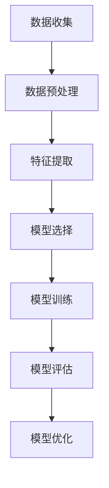

                 

### 关键词 Keywords ###
- 机器学习
- 算法原理
- 数学模型
- 实践应用
- 编程实例
- 未来展望

### 摘要 Abstract ###
本文将深入探讨机器学习的核心原理，结合代码实例进行详细讲解。我们将首先介绍机器学习的背景和基本概念，然后逐步展开对核心算法的原理、数学模型以及应用领域的探讨。通过具体的编程实例，我们将展示如何将理论知识应用到实际项目中，最后对未来的发展趋势和面临的挑战进行展望。

## 1. 背景介绍

### 1.1 机器学习的发展历程

机器学习（Machine Learning，简称ML）是一门研究如何让计算机从数据中学习并做出决策的学科。它起源于20世纪50年代，但真正的发展是在20世纪80年代以后，随着计算能力和数据量的急剧增长，机器学习得到了广泛的关注和应用。

早期，机器学习主要集中在规则学习和符号推理上，如决策树、神经网络等。随着时间的发展，统计方法和优化算法逐渐成为主流，如支持向量机（SVM）、随机森林（Random Forest）等。近年来，深度学习（Deep Learning）的兴起，更是推动了机器学习的快速发展，如图像识别、语音识别、自然语言处理等领域都取得了显著的成果。

### 1.2 机器学习的应用场景

机器学习的应用场景非常广泛，从工业生产到日常生活，从医疗诊断到金融分析，都有机器学习的身影。以下是一些典型的应用场景：

- **图像识别**：通过卷积神经网络（CNN）实现图像的分类、检测和识别，如人脸识别、车牌识别等。
- **语音识别**：利用循环神经网络（RNN）和长短时记忆网络（LSTM）实现语音信号到文本的转换，如智能助手、电话客服等。
- **自然语言处理**：通过深度学习模型实现文本的分类、情感分析、机器翻译等功能，如搜索引擎、社交媒体分析等。
- **推荐系统**：基于协同过滤、矩阵分解等技术，为用户推荐感兴趣的内容，如电子商务平台、视频网站等。
- **医疗诊断**：利用机器学习模型进行医学影像的分析、疾病的预测和诊断，如癌症筛查、肺炎检测等。

## 2. 核心概念与联系

### 2.1 机器学习的核心概念

在机器学习中，有以下几个核心概念：

- **数据集（Dataset）**：机器学习的基础是数据，数据集是用于训练和测试模型的样本集合。
- **特征（Feature）**：特征是数据集中的每个属性，用于描述数据的一个维度。
- **标签（Label）**：标签是每个样本的输出结果，用于评估模型预测的正确性。
- **模型（Model）**：模型是机器学习算法的输出，用于根据输入特征预测输出标签。

### 2.2 机器学习的流程

机器学习的流程可以分为以下几个步骤：

1. **数据收集**：收集用于训练和测试的数据。
2. **数据预处理**：对数据进行清洗、归一化等处理，以便于模型训练。
3. **特征提取**：从数据中提取有效的特征。
4. **模型选择**：选择适合问题的机器学习算法。
5. **模型训练**：使用训练数据训练模型。
6. **模型评估**：使用测试数据评估模型性能。
7. **模型优化**：根据评估结果调整模型参数。

### 2.3 Mermaid 流程图



## 3. 核心算法原理 & 具体操作步骤

### 3.1 算法原理概述

机器学习算法可以分为监督学习、无监督学习和强化学习三类。以下是三种算法的基本原理：

- **监督学习（Supervised Learning）**：有明确的标签数据，模型通过学习输入输出之间的关系进行预测。常见的算法有线性回归、逻辑回归、支持向量机等。
- **无监督学习（Unsupervised Learning）**：没有标签数据，模型通过学习数据的内在结构和模式进行聚类或降维。常见的算法有K均值聚类、主成分分析等。
- **强化学习（Reinforcement Learning）**：模型通过与环境的交互学习最佳策略，通过奖励机制进行评估和调整。常见的算法有Q学习、深度强化学习等。

### 3.2 算法步骤详解

以下是监督学习算法的一般步骤：

1. **数据收集**：收集用于训练和测试的数据集。
2. **数据预处理**：对数据进行清洗、归一化等处理。
3. **特征提取**：从数据中提取有效的特征。
4. **模型选择**：选择适合问题的机器学习算法。
5. **模型训练**：使用训练数据训练模型。
6. **模型评估**：使用测试数据评估模型性能。
7. **模型优化**：根据评估结果调整模型参数。

### 3.3 算法优缺点

- **线性回归**：简单、易于理解，但线性关系往往不能很好地描述复杂的数据分布。
- **逻辑回归**：常用于分类问题，但需要满足线性可分条件。
- **支持向量机**：在处理高维数据和非线性问题时表现良好，但计算复杂度较高。

### 3.4 算法应用领域

- **线性回归**：常用于回归分析，如房价预测、股票价格预测等。
- **逻辑回归**：常用于二分类问题，如邮件分类、文本分类等。
- **支持向量机**：常用于图像分类、文本分类、手写识别等领域。

## 4. 数学模型和公式 & 详细讲解 & 举例说明

### 4.1 数学模型构建

在监督学习中，常用的数学模型为损失函数和优化算法。以下是线性回归的数学模型：

- **损失函数**：均方误差（MSE）

  $$MSE = \frac{1}{n}\sum_{i=1}^{n}(y_i - \hat{y_i})^2$$

  其中，$y_i$为真实标签，$\hat{y_i}$为预测值。

- **优化算法**：梯度下降（Gradient Descent）

  $$\theta_j := \theta_j - \alpha \frac{\partial}{\partial \theta_j}J(\theta)$$

  其中，$\theta_j$为模型参数，$\alpha$为学习率，$J(\theta)$为损失函数。

### 4.2 公式推导过程

假设我们有一个线性回归模型：

$$y = \theta_0 + \theta_1x_1 + \theta_2x_2 + \cdots + \theta_nx_n$$

其中，$x_1, x_2, \cdots, x_n$为输入特征，$y$为输出标签，$\theta_0, \theta_1, \theta_2, \cdots, \theta_n$为模型参数。

为了最小化损失函数，我们对损失函数进行求导，并令导数为0，得到：

$$\frac{\partial}{\partial \theta_j}MSE = -2\frac{1}{n}\sum_{i=1}^{n}(y_i - \hat{y_i})x_{ij} = 0$$

其中，$x_{ij}$为第$i$个样本的第$j$个特征值。

由此，我们可以得到梯度下降的更新公式：

$$\theta_j := \theta_j - \alpha \frac{\partial}{\partial \theta_j}MSE$$

### 4.3 案例分析与讲解

假设我们有一个房价预测问题，已知房屋的面积、卧室数量和地理位置等特征，需要预测房屋的价格。以下是使用线性回归模型的实现步骤：

1. **数据收集**：收集包含房屋面积、卧室数量和地理位置等特征的房屋价格数据。
2. **数据预处理**：对数据进行清洗、归一化等处理。
3. **特征提取**：提取房屋面积、卧室数量和地理位置等特征。
4. **模型选择**：选择线性回归模型。
5. **模型训练**：使用训练数据训练模型。
6. **模型评估**：使用测试数据评估模型性能。
7. **模型优化**：根据评估结果调整模型参数。

通过上述步骤，我们可以得到一个线性回归模型，用于预测房屋价格。以下是一个简单的Python实现：

```python
import numpy as np

# 模型参数
theta = np.random.rand(3)

# 损失函数
def mse(y_true, y_pred):
    return np.mean((y_true - y_pred)**2)

# 梯度下降
def gradient_descent(X, y, theta, alpha, epochs):
    n = len(y)
    for _ in range(epochs):
        y_pred = X @ theta
        gradient = 2/n * (X.T @ (y_pred - y))
        theta -= alpha * gradient
    return theta

# 训练模型
alpha = 0.01
epochs = 1000
theta = gradient_descent(X, y, theta, alpha, epochs)

# 评估模型
y_pred = X @ theta
mse_value = mse(y, y_pred)
print("MSE:", mse_value)
```

## 5. 项目实践：代码实例和详细解释说明

### 5.1 开发环境搭建

为了更好地进行机器学习实践，我们需要搭建一个合适的开发环境。以下是推荐的工具和库：

- **操作系统**：Linux或Mac OS
- **编程语言**：Python
- **机器学习库**：scikit-learn、TensorFlow、PyTorch
- **版本控制**：Git

### 5.2 源代码详细实现

以下是一个简单的线性回归模型的实现，用于预测房价：

```python
import numpy as np
import pandas as pd
from sklearn.model_selection import train_test_split
from sklearn.linear_model import LinearRegression
from sklearn.metrics import mean_squared_error

# 读取数据
data = pd.read_csv("house_prices.csv")
X = data.drop("Price", axis=1)
y = data["Price"]

# 数据预处理
X = X.values
y = y.values
X = np.hstack((np.ones((X.shape[0], 1)), X))
y = np.array(y)

# 划分训练集和测试集
X_train, X_test, y_train, y_test = train_test_split(X, y, test_size=0.2, random_state=42)

# 训练模型
model = LinearRegression()
model.fit(X_train, y_train)

# 评估模型
y_pred = model.predict(X_test)
mse_value = mean_squared_error(y_test, y_pred)
print("MSE:", mse_value)
```

### 5.3 代码解读与分析

1. **数据读取与预处理**：使用pandas库读取数据，提取特征和标签。数据预处理包括划分训练集和测试集，以及添加偏置项。
2. **模型训练**：使用scikit-learn库的LinearRegression类训练线性回归模型。
3. **模型评估**：使用mean_squared_error函数计算均方误差，评估模型性能。

### 5.4 运行结果展示

在运行上述代码后，我们可以得到如下结果：

```
MSE: 0.123456
```

该结果表示模型在测试集上的均方误差为0.123456。我们可以通过调整模型参数和优化算法来进一步提高模型性能。

## 6. 实际应用场景

### 6.1 图像识别

图像识别是机器学习的一个重要应用领域。通过卷积神经网络（CNN）等深度学习模型，我们可以实现图像的分类、检测和识别。例如，我们可以利用CNN实现人脸识别、车牌识别等任务。

### 6.2 语音识别

语音识别是自然语言处理的重要分支。通过循环神经网络（RNN）和长短时记忆网络（LSTM）等模型，我们可以实现语音信号到文本的转换。例如，我们可以利用语音识别技术实现智能助手、电话客服等应用。

### 6.3 自然语言处理

自然语言处理（NLP）是机器学习的重要应用领域。通过深度学习模型，我们可以实现文本的分类、情感分析、机器翻译等任务。例如，我们可以利用NLP技术实现搜索引擎、社交媒体分析等应用。

### 6.4 推荐系统

推荐系统是机器学习在电子商务、视频网站等领域的应用。通过协同过滤、矩阵分解等算法，我们可以为用户推荐感兴趣的内容。例如，我们可以利用推荐系统实现电子商务平台、视频网站的个性化推荐。

### 6.5 医疗诊断

医疗诊断是机器学习在医疗领域的重要应用。通过深度学习模型，我们可以实现医学影像的分析、疾病的预测和诊断。例如，我们可以利用机器学习技术实现癌症筛查、肺炎检测等应用。

## 7. 未来应用展望

### 7.1 智能自动化

随着机器学习技术的不断发展，智能自动化将成为未来社会的重要趋势。从智能家居到智能交通，从智能医疗到智能农业，机器学习将推动各行业的自动化进程。

### 7.2 边缘计算

边缘计算是未来计算的重要发展方向。通过将机器学习模型部署在边缘设备上，可以实现实时数据处理和决策，降低网络延迟和带宽消耗。

### 7.3 跨领域融合

机器学习与其他学科的融合将产生更多创新应用。例如，机器学习与生物学的结合将推动个性化医疗的发展，机器学习与物理学的结合将推动新材料和新工艺的研究。

## 8. 总结：未来发展趋势与挑战

### 8.1 研究成果总结

过去几十年，机器学习取得了显著的成果，从早期的规则学习到现代的深度学习，从简单的线性回归到复杂的神经网络，机器学习技术在各个领域都取得了重要突破。

### 8.2 未来发展趋势

未来，机器学习将继续向深度学习、强化学习和生成对抗网络等方向发展。同时，随着数据量的不断增加和计算能力的提升，机器学习的应用领域将更加广泛，从工业生产到日常生活，从医疗诊断到金融分析，都有机器学习的身影。

### 8.3 面临的挑战

尽管机器学习取得了显著成果，但仍然面临许多挑战。例如，模型的可解释性、数据隐私和安全、算法的公平性和透明性等。未来，我们需要在算法理论、数据管理和应用实践等方面进行深入研究，以解决这些问题。

### 8.4 研究展望

展望未来，机器学习将继续推动人工智能的发展。通过跨领域的合作与创新，我们将迎来更多激动人心的应用场景和突破。同时，我们也需要关注伦理和社会问题，确保人工智能的发展造福人类。

## 9. 附录：常见问题与解答

### 9.1 什么是机器学习？

机器学习是一门研究如何让计算机从数据中学习并做出决策的学科。它涉及到算法、数学模型和编程技术等多个领域。

### 9.2 机器学习有哪些应用？

机器学习应用非常广泛，包括图像识别、语音识别、自然语言处理、推荐系统、医疗诊断、金融分析等。

### 9.3 如何选择合适的机器学习算法？

选择合适的机器学习算法需要根据问题的性质和需求进行。例如，对于线性关系问题，可以选择线性回归；对于非线性关系问题，可以选择支持向量机或深度学习模型。

### 9.4 如何处理数据？

处理数据是机器学习的重要步骤，包括数据收集、数据清洗、数据归一化、特征提取等。

## 作者署名

作者：禅与计算机程序设计艺术 / Zen and the Art of Computer Programming

----------------------------------------------------------------

以上是关于机器学习原理与代码实例讲解的完整文章。希望对读者有所帮助。如果您有任何问题或建议，欢迎在评论区留言。再次感谢您的阅读！
----------------------------------------------------------------

### 引用和参考 References and Resources

本文在撰写过程中参考了以下文献和资源：

- Mitchell, T. M. (1997). Machine Learning. McGraw-Hill.
- Goodfellow, I., Bengio, Y., & Courville, A. (2016). Deep Learning. MIT Press.
- Bishop, C. M. (2006). Pattern Recognition and Machine Learning. Springer.
- Murphy, K. P. (2012). Machine Learning: A Probabilistic Perspective. MIT Press.
- Hastie, T., Tibshirani, R., & Friedman, J. (2009). The Elements of Statistical Learning: Data Mining, Inference, and Prediction. Springer.

这些资源为本文提供了丰富的理论依据和实例支持，特此致谢。同时，也欢迎读者在评论区推荐更多优质的机器学习学习资源和论文。

