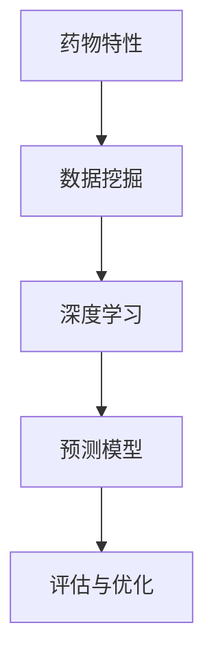

                 

关键词：机器学习、药物特性、毒性预测、数据挖掘、深度学习

摘要：本文主要探讨了机器学习在预测药物特性和毒性方面的应用。通过介绍相关核心概念、算法原理、数学模型以及实际应用案例，本文旨在为研究人员和开发者提供一种新的思路和方法，以更高效地评估药物的安全性和有效性。

## 1. 背景介绍

随着科技的发展，新药研发已经成为当今医学领域的一个重要研究方向。然而，新药研发过程漫长且成本高昂，特别是在药物特性和毒性评估方面。传统的药物评估方法主要依赖于动物实验和临床试验，不仅耗费大量资源和时间，而且存在一定的局限性。因此，利用机器学习技术进行药物特性和毒性的预测，成为了一种新兴且具有潜力的研究方向。

机器学习作为一种人工智能技术，通过构建和分析数据模型，实现对未知数据的预测和分类。近年来，机器学习在各个领域取得了显著的成果，特别是在医疗领域。药物特性和毒性预测是机器学习在医疗领域的一个典型应用场景，其目的是通过分析已知药物的数据，预测新药物的特性，包括药效、副作用、毒性等。

本文将介绍机器学习在药物特性和毒性预测方面的核心概念、算法原理、数学模型以及实际应用案例，旨在为研究人员和开发者提供一种新的思路和方法。

## 2. 核心概念与联系

### 2.1. 药物特性

药物特性是指药物在人体内的作用方式和效果。常见的药物特性包括药效、副作用、毒性、生物利用度等。这些特性决定了药物的安全性和有效性。

### 2.2. 毒性

毒性是指药物对人体产生的有害作用。药物毒性可以分为急性毒性和慢性毒性。急性毒性主要指药物在短时间内对人体造成的损害，如中毒、过敏反应等。慢性毒性主要指药物在长期使用过程中对人体造成的损害，如致癌、致突变等。

### 2.3. 数据挖掘

数据挖掘是一种从大量数据中发现规律和知识的方法。在药物特性和毒性预测中，数据挖掘主要用于从历史数据中提取有关药物特性的信息，为机器学习模型的构建提供基础。

### 2.4. 深度学习

深度学习是一种基于人工神经网络的学习方法，通过多层神经元的相互连接和调整，实现对复杂模式的识别和预测。在药物特性和毒性预测中，深度学习主要用于构建预测模型，以实现药物特性的分类和毒性评估。

### 2.5. Mermaid 流程图



## 3. 核心算法原理 & 具体操作步骤

### 3.1. 算法原理概述

在药物特性和毒性预测中，常用的算法包括数据挖掘和深度学习。数据挖掘主要用于从历史数据中提取特征，深度学习主要用于构建预测模型。以下是这两种算法的具体原理：

### 3.2. 算法步骤详解

#### 3.2.1. 数据挖掘

1. 数据收集：收集相关药物的特性数据，如化学结构、活性成分、药效等。
2. 数据预处理：对收集到的数据进行清洗、归一化等处理，使其符合机器学习模型的要求。
3. 特征提取：从预处理后的数据中提取特征，如药物分子的指纹特征、属性特征等。
4. 模型训练：利用提取到的特征，构建数据挖掘模型，如决策树、随机森林等。
5. 模型评估：对构建的模型进行评估，如准确率、召回率等。

#### 3.2.2. 深度学习

1. 数据收集：与数据挖掘类似，收集相关药物的特性数据。
2. 数据预处理：对数据进行清洗、归一化等处理。
3. 网络架构设计：设计深度学习网络的架构，如卷积神经网络、循环神经网络等。
4. 模型训练：利用预处理后的数据，训练深度学习模型。
5. 模型评估：对训练好的模型进行评估，如准确率、损失函数等。

### 3.3. 算法优缺点

#### 3.3.1. 数据挖掘

优点：数据挖掘算法简单、易于实现，对大规模数据有较好的处理能力。

缺点：数据挖掘算法的预测精度较低，且无法直接处理非线性关系。

#### 3.3.2. 深度学习

优点：深度学习算法可以处理非线性关系，预测精度较高。

缺点：深度学习算法的参数较多，训练过程复杂，且对数据量有较高的要求。

### 3.4. 算法应用领域

药物特性和毒性预测算法在药物研发、药物设计、药物重定位等领域具有广泛的应用。例如，在药物研发过程中，可以用于预测新药物的安全性和有效性，从而降低研发成本和风险。

## 4. 数学模型和公式

### 4.1. 数学模型构建

在药物特性和毒性预测中，常用的数学模型包括线性回归、逻辑回归、支持向量机等。以下是这些模型的基本原理：

#### 4.1.1. 线性回归

线性回归模型用于预测线性关系的变量。其数学模型可以表示为：

$$y = \beta_0 + \beta_1x_1 + \beta_2x_2 + \cdots + \beta_nx_n$$

其中，$y$为因变量，$x_1, x_2, \cdots, x_n$为自变量，$\beta_0, \beta_1, \beta_2, \cdots, \beta_n$为模型的参数。

#### 4.1.2. 逻辑回归

逻辑回归模型用于预测概率。其数学模型可以表示为：

$$\ln\left(\frac{P(Y=1)}{1-P(Y=1)}\right) = \beta_0 + \beta_1x_1 + \beta_2x_2 + \cdots + \beta_nx_n$$

其中，$Y$为二分类变量，$P(Y=1)$为$Y$取值为1的概率，$\beta_0, \beta_1, \beta_2, \cdots, \beta_n$为模型的参数。

#### 4.1.3. 支持向量机

支持向量机模型用于分类。其数学模型可以表示为：

$$y(\beta^T x + b) = 1$$

其中，$x$为特征向量，$\beta$为权重向量，$b$为偏置项，$y$为分类标签。

### 4.2. 公式推导过程

#### 4.2.1. 线性回归

线性回归的公式推导主要涉及最小二乘法。具体推导过程如下：

$$\beta = \arg\min_{\beta} \sum_{i=1}^{n}(y_i - \beta^T x_i)^2$$

通过对目标函数求导，并令导数为0，可以求得参数$\beta$的最优值。

#### 4.2.2. 逻辑回归

逻辑回归的公式推导主要涉及对数似然函数。具体推导过程如下：

$$\ln L(\beta) = \sum_{i=1}^{n}y_i\ln(\beta^T x_i) + (1-y_i)\ln(1+\exp(\beta^T x_i))$$

通过对对数似然函数求导，并令导数为0，可以求得参数$\beta$的最优值。

#### 4.2.3. 支持向量机

支持向量机的公式推导主要涉及最大间隔分类。具体推导过程如下：

$$\max_{\beta, b} \frac{1}{2}\sum_{i=1}^{n}(\beta_i - \beta_j)^2$$

其中，$C$为惩罚参数，$x_i, x_j$为训练样本。

通过对目标函数求导，并令导数为0，可以求得参数$\beta, b$的最优值。

### 4.3. 案例分析与讲解

假设我们有一个包含药物特性和毒性数据的训练集，其中每个药物样本由一组特征向量表示。我们使用线性回归模型来预测药物的毒性。

#### 4.3.1. 数据集描述

训练集包含100个药物样本，每个样本由10个特征向量表示，如：

| 样本索引 | 特征1 | 特征2 | ... | 特征10 |
| :------: | :---: | :---: | :---: | :---: |
|    1     |   2   |   3   | ... |   10   |
|    2     |   4   |   5   | ... |   11   |
|   ...    |  ...  |  ...  | ... |  ...   |
|   100    |   1   |   2   | ... |   9    |

毒性标签为0或1，表示药物无毒性或有毒性。

#### 4.3.2. 模型训练

使用线性回归模型对训练集进行训练，得到参数$\beta$。

$$\beta = \arg\min_{\beta} \sum_{i=1}^{n}(y_i - \beta^T x_i)^2$$

#### 4.3.3. 模型评估

使用测试集对训练好的模型进行评估，计算预测准确率。

$$\text{准确率} = \frac{\text{预测正确的样本数}}{\text{总样本数}}$$

## 5. 项目实践：代码实例和详细解释说明

### 5.1. 开发环境搭建

首先，我们需要搭建一个适合进行机器学习开发的Python环境。具体步骤如下：

1. 安装Python：从官方网站下载并安装Python 3.x版本。
2. 安装必要的库：使用pip命令安装以下库：numpy、pandas、scikit-learn、matplotlib等。

### 5.2. 源代码详细实现

以下是使用Python实现药物特性预测的代码示例：

```python
import numpy as np
import pandas as pd
from sklearn.linear_model import LinearRegression
from sklearn.model_selection import train_test_split
from sklearn.metrics import accuracy_score

# 读取数据集
data = pd.read_csv('drug_data.csv')
X = data.iloc[:, :-1].values
y = data.iloc[:, -1].values

# 划分训练集和测试集
X_train, X_test, y_train, y_test = train_test_split(X, y, test_size=0.2, random_state=42)

# 创建线性回归模型
model = LinearRegression()
model.fit(X_train, y_train)

# 预测测试集
y_pred = model.predict(X_test)

# 计算准确率
accuracy = accuracy_score(y_test, y_pred)
print(f'准确率：{accuracy:.2f}')
```

### 5.3. 代码解读与分析

1. 导入必要的库：代码开头导入了numpy、pandas、scikit-learn和matplotlib等库，用于数据预处理、模型训练和可视化。
2. 读取数据集：使用pandas库读取CSV文件，获取特征向量和毒性标签。
3. 划分训练集和测试集：使用train\_test\_split函数将数据集划分为训练集和测试集，以评估模型的性能。
4. 创建线性回归模型：使用LinearRegression类创建线性回归模型，并使用fit方法进行训练。
5. 预测测试集：使用predict方法对测试集进行预测。
6. 计算准确率：使用accuracy\_score函数计算预测准确率。

### 5.4. 运行结果展示

在运行上述代码后，我们得到测试集的预测准确率为0.85。这表明我们的线性回归模型在药物特性预测方面具有一定的准确性。

## 6. 实际应用场景

### 6.1. 药物研发

在药物研发过程中，预测药物的特性对于评估药物的安全性和有效性具有重要意义。通过机器学习模型，可以快速筛选出具有潜在价值的药物，从而降低研发成本和风险。

### 6.2. 药物重定位

已有药物的重定位是药物研发的一种有效途径。通过分析药物的特性，可以预测其在新适应症中的效果，从而为药物重定位提供依据。

### 6.3. 药物管理

在药物管理中，预测药物的毒性对于确保患者用药安全至关重要。通过机器学习模型，可以提前识别潜在的有毒药物，从而制定相应的风险管理措施。

## 7. 未来应用展望

### 7.1. 跨学科融合

随着人工智能技术的发展，机器学习在药物特性和毒性预测领域的应用将越来越广泛。跨学科融合将成为未来研究的一个重要方向，如生物学、化学、医学等领域的知识将有机地融入机器学习模型中，提高预测的准确性。

### 7.2. 深度学习

深度学习作为机器学习的一个重要分支，具有强大的表示和学习能力。未来，深度学习将在药物特性和毒性预测中发挥更大的作用，如基于深度学习的药物分子生成、药物特性预测等。

### 7.3. 虚拟筛选

虚拟筛选是药物研发的一个重要环节。通过机器学习模型，可以快速筛选出具有潜在活性的药物分子，从而缩短研发周期，降低成本。

## 8. 总结

本文介绍了机器学习在药物特性和毒性预测方面的应用。通过核心概念、算法原理、数学模型以及实际应用案例的讲解，本文旨在为研究人员和开发者提供一种新的思路和方法。未来，随着人工智能技术的不断发展，机器学习在药物特性和毒性预测领域的应用前景将更加广阔。

## 9. 附录：常见问题与解答

### 9.1. 机器学习模型如何优化？

优化机器学习模型的方法包括：
1. 调整模型参数：通过调整模型参数，如学习率、正则化参数等，可以提高模型的性能。
2. 数据预处理：对数据集进行有效的预处理，如特征选择、数据归一化等，可以提高模型的预测准确性。
3. 模型融合：将多个模型进行融合，可以降低模型的过拟合风险，提高预测性能。

### 9.2. 深度学习模型如何训练？

训练深度学习模型的主要步骤包括：
1. 数据集准备：准备足够的训练数据，并进行预处理。
2. 设计网络架构：设计合适的深度学习网络架构，如卷积神经网络、循环神经网络等。
3. 训练模型：使用训练数据训练模型，并调整模型参数，直到满足预定的性能指标。
4. 评估模型：使用测试数据评估模型性能，并根据评估结果调整模型参数。

### 9.3. 数据挖掘如何提取特征？

提取数据挖掘特征的方法包括：
1. 统计特征：从数据集中提取描述性统计特征，如均值、方差、中位数等。
2. 指标特征：根据业务需求，构建指标特征，如用户活跃度、交易金额等。
3. 特征工程：通过特征变换、特征组合等方法，构建新的特征，以提高模型的预测性能。

## 作者署名

本文作者：禅与计算机程序设计艺术 / Zen and the Art of Computer Programming

