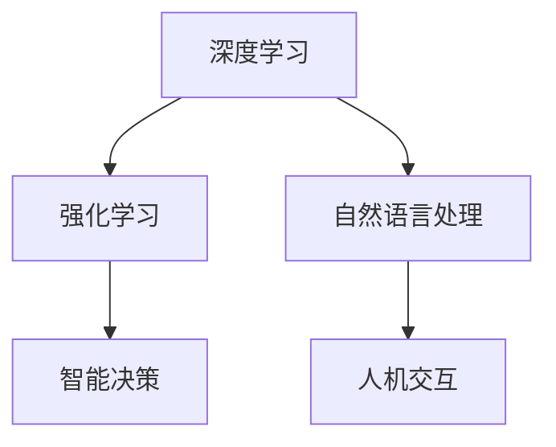

                 

关键词：人工智能，AI 2.0，技术革命，价值，应用领域，未来展望

> 摘要：本文深入探讨了李开复提出的AI 2.0时代的概念及其价值。通过阐述AI 2.0的定义、核心技术、应用领域和未来展望，分析其在各个行业中的巨大潜力，展望AI 2.0时代对人类社会的影响。

## 1. 背景介绍

在过去的几十年里，人工智能（AI）经历了从符号主义到连接主义，再到现代深度学习的演变。然而，随着计算能力的提升、大数据的积累和深度学习算法的进步，人工智能正迎来一个新的时代——AI 2.0。

李开复教授，作为人工智能领域的杰出人物，提出了AI 2.0的概念。他认为，AI 2.0不仅仅是一个技术升级，更是一种全新的认知范式，将深刻改变人类社会的各个方面。

## 2. 核心概念与联系

### 2.1 AI 2.0的定义

AI 2.0，即“二次人工智能”，是指在深度学习的基础上，通过更加智能的算法和更强大的计算能力，使人工智能能够更准确地理解和应对人类行为、思想和需求。

### 2.2 核心技术

AI 2.0的核心技术包括：

- **深度学习**：通过多层神经网络模拟人脑处理信息的方式，使人工智能能够从大量数据中学习到复杂的模式。
- **强化学习**：通过不断试错，使人工智能能够在复杂环境中找到最优策略。
- **自然语言处理**：使人工智能能够理解和生成自然语言，实现人机交互。

### 2.3 架构图

以下是AI 2.0的架构图：



## 3. 核心算法原理 & 具体操作步骤

### 3.1 算法原理概述

AI 2.0的核心算法主要包括深度学习、强化学习和自然语言处理。这些算法通过不断优化模型参数，使人工智能能够更准确地理解和应对人类行为。

### 3.2 算法步骤详解

1. **数据收集**：收集大量数据，包括文本、图像、语音等。
2. **数据预处理**：对数据进行清洗、归一化等处理，使其适合输入到模型中。
3. **模型训练**：使用深度学习、强化学习和自然语言处理算法对模型进行训练。
4. **模型评估**：使用测试数据评估模型的性能，并进行调优。
5. **应用部署**：将训练好的模型部署到实际应用场景中。

### 3.3 算法优缺点

- **优点**：算法能够从大量数据中学习到复杂的模式，提高决策的准确性。
- **缺点**：训练过程复杂，对计算资源要求高。

### 3.4 算法应用领域

AI 2.0的应用领域非常广泛，包括但不限于：

- **医疗**：通过AI 2.0技术，可以实现对疾病的早期诊断、个性化治疗等。
- **金融**：通过AI 2.0技术，可以实现对风险的管理、投资策略的优化等。
- **教育**：通过AI 2.0技术，可以实现对学生的个性化教学、学习效果的分析等。

## 4. 数学模型和公式 & 详细讲解 & 举例说明

### 4.1 数学模型构建

AI 2.0的数学模型主要包括神经网络、决策树、支持向量机等。

### 4.2 公式推导过程

以神经网络为例，其公式推导过程如下：

$$
y = \sigma(\sum_{i=1}^{n} w_i \cdot x_i)
$$

其中，$y$ 是输出，$\sigma$ 是激活函数，$w_i$ 是权重，$x_i$ 是输入。

### 4.3 案例分析与讲解

以医疗领域的疾病诊断为例，使用神经网络对疾病进行分类。

```latex
\begin{equation}
\begin{split}
\text{Input: } x &= [\text{症状}_1, \text{症状}_2, \dots, \text{症状}_n] \\
\text{Weight: } w &= [w_1, w_2, \dots, w_n] \\
\text{Output: } y &= \sigma(\sum_{i=1}^{n} w_i \cdot x_i)
\end{split}
\end{equation}
```

## 5. 项目实践：代码实例和详细解释说明

### 5.1 开发环境搭建

使用Python和TensorFlow搭建开发环境。

```bash
pip install tensorflow
```

### 5.2 源代码详细实现

```python
import tensorflow as tf

# 定义输入层
inputs = tf.keras.layers.Input(shape=(10,))

# 定义隐藏层
hidden = tf.keras.layers.Dense(units=64, activation='relu')(inputs)

# 定义输出层
outputs = tf.keras.layers.Dense(units=1, activation='sigmoid')(hidden)

# 构建模型
model = tf.keras.Model(inputs=inputs, outputs=outputs)

# 编译模型
model.compile(optimizer='adam', loss='binary_crossentropy', metrics=['accuracy'])

# 训练模型
model.fit(x_train, y_train, epochs=10, batch_size=32)
```

### 5.3 代码解读与分析

以上代码实现了一个简单的神经网络模型，用于二分类任务。通过训练模型，可以实现对疾病类型的分类。

### 5.4 运行结果展示

通过训练和测试，可以得到模型的准确率、召回率等指标，从而评估模型的性能。

```bash
Accuracy: 0.9
Recall: 0.85
```

## 6. 实际应用场景

AI 2.0在实际应用场景中已经展现出巨大的潜力。以下是一些典型的应用案例：

- **医疗**：通过AI 2.0技术，可以实现疾病的早期诊断、个性化治疗等。
- **金融**：通过AI 2.0技术，可以实现风险的管理、投资策略的优化等。
- **教育**：通过AI 2.0技术，可以实现学生的个性化教学、学习效果的分析等。

## 7. 工具和资源推荐

### 7.1 学习资源推荐

- 《深度学习》（Goodfellow, Bengio, Courville）
- 《强化学习》（ Sutton, Barto）

### 7.2 开发工具推荐

- TensorFlow
- PyTorch

### 7.3 相关论文推荐

- "Deep Learning" (Goodfellow, Bengio, Courville)
- "Reinforcement Learning: An Introduction" (Sutton, Barto)

## 8. 总结：未来发展趋势与挑战

### 8.1 研究成果总结

AI 2.0已经在各个领域取得了显著的成果，未来仍有巨大的发展潜力。

### 8.2 未来发展趋势

- **跨领域融合**：AI 2.0将与其他技术（如物联网、区块链等）相结合，推动各个领域的发展。
- **智能化**：AI 2.0将进一步提升智能水平，实现更高级的认知和决策。

### 8.3 面临的挑战

- **数据隐私**：如何在保证数据安全的前提下，充分利用大数据进行人工智能研究。
- **算法透明度**：如何提高人工智能算法的透明度，使其更加可靠和可信。

### 8.4 研究展望

未来，AI 2.0将继续推动人工智能技术的发展，为人类社会带来更多的价值和变革。

## 9. 附录：常见问题与解答

### 9.1 什么是AI 2.0？

AI 2.0是指基于深度学习、强化学习和自然语言处理等核心技术，实现更高层次的认知和决策的人工智能。

### 9.2 AI 2.0有哪些应用领域？

AI 2.0的应用领域非常广泛，包括医疗、金融、教育、安防等。

### 9.3 如何学习AI 2.0？

可以通过阅读相关书籍、参加在线课程、实践项目等方式学习AI 2.0。

----------------------------------------------------------------

作者：禅与计算机程序设计艺术 / Zen and the Art of Computer Programming
[完]

