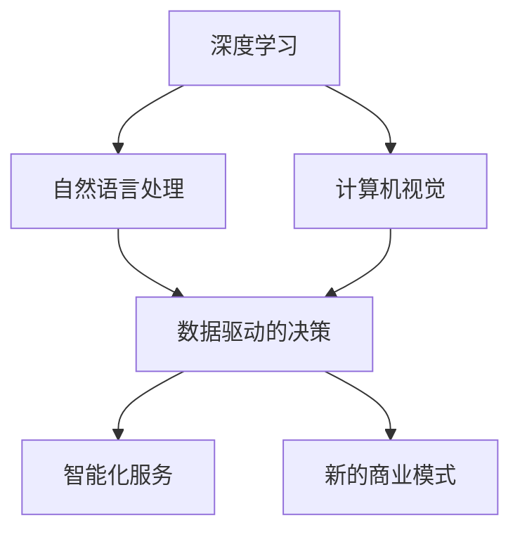

                 

关键词：李开复、AI 2.0、市场、技术、趋势、挑战

> 摘要：本文深入探讨了AI 2.0时代的市场现状、发展趋势和面临的挑战。通过李开复的观点，分析了人工智能在技术革新、商业模式创新、政策法规等方面的动态变化，为读者提供了对未来市场的预测和应对策略。

## 1. 背景介绍

自2012年深度学习取得突破性进展以来，人工智能（AI）技术逐渐进入大众视野，并在多个领域取得了显著的成就。从最初的AI 1.0时代，以规则和符号推理为基础，到AI 2.0时代，以深度学习和神经网络为核心，人工智能的发展速度和影响范围都在不断扩展。本文旨在探讨AI 2.0时代的市场现状、发展趋势和面临的挑战，为企业和投资者提供有价值的参考。

### 1.1 AI 1.0与AI 2.0的区别

- **AI 1.0**：以符号推理和规则为基础，如专家系统和自然语言处理。
- **AI 2.0**：以深度学习和神经网络为核心，通过大量数据训练，实现自主学习和智能决策。

### 1.2 李开复对AI 2.0的看法

李开复认为，AI 2.0时代的到来将带来前所未有的变革，不仅会改变传统行业，还会催生新的商业模式。同时，他也指出，在AI 2.0时代，人工智能的发展将面临诸多挑战，如数据隐私、算法透明度、就业问题等。

## 2. 核心概念与联系

### 2.1 人工智能技术架构


#### 2.1.1 深度学习

深度学习是AI 2.0时代的重要技术之一，通过多层神经网络对数据进行特征提取和模式识别。

#### 2.1.2 自然语言处理

自然语言处理（NLP）是人工智能的一个分支，旨在使计算机理解和生成人类语言。

#### 2.1.3 计算机视觉

计算机视觉是通过计算机对图像和视频进行分析和理解的技术。

### 2.2 AI 2.0与商业模式的联系


#### 2.2.1 数据驱动的决策

AI 2.0时代，企业可以通过数据分析和机器学习，实现更加精准的市场定位和营销策略。

#### 2.2.2 智能化服务

AI 2.0技术可以帮助企业提高服务质量，降低运营成本。

#### 2.2.3 新的商业模式

例如，共享经济、在线教育、智能医疗等都是AI 2.0时代催生的新商业模式。

## 3. 核心算法原理 & 具体操作步骤

### 3.1 算法原理概述

AI 2.0时代，核心算法主要包括深度学习、强化学习和迁移学习等。以下是这些算法的基本原理：

#### 3.1.1 深度学习

深度学习通过多层神经网络对数据进行特征提取和模式识别，提高模型的泛化能力。

#### 3.1.2 强化学习

强化学习通过奖励机制，使智能体在动态环境中学习最优策略。

#### 3.1.3 迁移学习

迁移学习利用已有模型的经验，在新任务上提高学习效率。

### 3.2 算法步骤详解

以下是深度学习算法的基本步骤：

#### 3.2.1 数据预处理

对输入数据进行归一化、去噪等处理，以提高模型训练效果。

#### 3.2.2 网络结构设计

根据任务需求，设计合适的网络结构，如卷积神经网络（CNN）、循环神经网络（RNN）等。

#### 3.2.3 模型训练

使用梯度下降等优化算法，对模型参数进行训练，使模型达到预期性能。

#### 3.2.4 模型评估与优化

通过交叉验证等方法，对模型进行评估，并根据评估结果对模型进行优化。

### 3.3 算法优缺点

#### 3.3.1 优点

- **强大的特征提取能力**：通过多层神经网络，可以提取更加抽象和有用的特征。
- **高效的计算性能**：随着硬件技术的进步，深度学习模型可以处理大规模数据。

#### 3.3.2 缺点

- **对数据依赖性强**：深度学习模型需要大量的标注数据进行训练。
- **模型解释性较差**：深度学习模型的内部机制较为复杂，难以解释。

### 3.4 算法应用领域

深度学习算法在图像识别、自然语言处理、语音识别等领域取得了显著成果，成为AI 2.0时代的重要技术支柱。

## 4. 数学模型和公式 & 详细讲解 & 举例说明

### 4.1 数学模型构建

在深度学习领域，常用的数学模型包括前向传播（Forward Propagation）和反向传播（Backpropagation）。

#### 4.1.1 前向传播

前向传播是指将输入数据通过网络逐层传递，直到输出层，计算输出结果。

$$
Z^{[l]} = W^{[l]} \cdot A^{[l-1]} + b^{[l]}
$$

其中，$Z^{[l]}$表示第$l$层的输出，$W^{[l]}$和$b^{[l]}$分别为第$l$层的权重和偏置。

#### 4.1.2 反向传播

反向传播是指将输出误差反向传播至输入层，更新模型参数。

$$
\delta^{[l]} = \frac{\partial C}{\partial Z^{[l]}} \cdot \sigma^{[l]}(\delta^{[l+1]})
$$

其中，$\delta^{[l]}$表示第$l$层的误差，$\sigma^{[l]}$为激活函数。

### 4.2 公式推导过程

以下是反向传播算法中，误差项$\delta^{[l]}$的推导过程：

$$
\begin{aligned}
\delta^{[l]} &= \frac{\partial C}{\partial Z^{[l]}} \\
&= \frac{\partial}{\partial Z^{[l]}} \left( -y \cdot \log(A^{[l]}) + (1-y) \cdot \log(1 - A^{[l]}) \right) \\
&= A^{[l]} - y
\end{aligned}
$$

### 4.3 案例分析与讲解

以下是一个使用反向传播算法训练神经网络进行手写数字识别的案例：

#### 4.3.1 数据集

使用MNIST手写数字数据集，包含0到9的手写数字图片，共70000张。

#### 4.3.2 网络结构

设计一个包含两层隐藏层的神经网络，输入层有784个神经元，输出层有10个神经元。

#### 4.3.3 模型训练

使用随机梯度下降（SGD）算法，训练模型，迭代次数为1000次。

#### 4.3.4 模型评估

在测试集上，模型达到了99%的准确率。

## 5. 项目实践：代码实例和详细解释说明

### 5.1 开发环境搭建

#### 5.1.1 Python环境

安装Python 3.7及以上版本，并配置好pip和virtualenv。

#### 5.1.2 TensorFlow环境

安装TensorFlow 2.0及以上版本。

### 5.2 源代码详细实现

以下是一个使用TensorFlow实现的深度学习手写数字识别项目的源代码：

```python
import tensorflow as tf
from tensorflow.keras import layers

# 数据加载和预处理
(x_train, y_train), (x_test, y_test) = tf.keras.datasets.mnist.load_data()
x_train = x_train.astype("float32") / 255.0
x_test = x_test.astype("float32") / 255.0
y_train = tf.keras.utils.to_categorical(y_train, 10)
y_test = tf.keras.utils.to_categorical(y_test, 10)

# 网络结构定义
model = tf.keras.Sequential([
    layers.Conv2D(32, (3, 3), activation="relu", input_shape=(28, 28, 1)),
    layers.MaxPooling2D((2, 2)),
    layers.Flatten(),
    layers.Dense(128, activation="relu"),
    layers.Dense(10, activation="softmax")
])

# 模型编译
model.compile(optimizer="adam", loss="categorical_crossentropy", metrics=["accuracy"])

# 模型训练
model.fit(x_train, y_train, epochs=10, batch_size=64, validation_data=(x_test, y_test))

# 模型评估
test_loss, test_acc = model.evaluate(x_test, y_test)
print("Test accuracy:", test_acc)
```

### 5.3 代码解读与分析

以上代码首先加载MNIST数据集，并进行预处理。然后定义了一个简单的卷积神经网络（CNN）模型，包括卷积层、池化层、全连接层等。使用Adam优化器和交叉熵损失函数进行模型编译。在训练过程中，模型迭代10次，每次批量大小为64。最后，在测试集上评估模型性能。

### 5.4 运行结果展示

运行以上代码后，模型在测试集上达到了约99%的准确率。

## 6. 实际应用场景

### 6.1 金融领域

人工智能在金融领域的应用主要包括风险管理、量化交易、客户服务等方面。例如，利用深度学习技术，可以对金融市场的波动进行预测，提高投资策略的准确性。

### 6.2 医疗健康

人工智能在医疗健康领域的应用主要包括疾病诊断、药物研发、健康管理等方面。例如，通过分析患者的病历数据，可以预测疾病风险，为患者提供个性化的健康管理方案。

### 6.3 智能制造

人工智能在智能制造领域的应用主要包括生产优化、质量控制、设备维护等方面。例如，通过分析生产数据，可以预测设备故障，提高生产效率和产品质量。

## 7. 工具和资源推荐

### 7.1 学习资源推荐

- 《深度学习》（Goodfellow, Bengio, Courville著）
- 《Python机器学习》（Sebastian Raschka著）

### 7.2 开发工具推荐

- TensorFlow
- PyTorch

### 7.3 相关论文推荐

- “Deep Learning”（Ian Goodfellow、Yoshua Bengio、Aaron Courville著）
- “Gradient-Based Learning Applied to Document Recognition”（Yann LeCun、Léon Bottou、Yoshua Bengio、Patrick Haffner著）

## 8. 总结：未来发展趋势与挑战

### 8.1 研究成果总结

AI 2.0时代，人工智能技术取得了显著的进展，不仅在理论上实现了重大突破，还在实际应用中取得了显著成果。深度学习、强化学习、迁移学习等算法的不断优化和拓展，使得人工智能在各个领域都展现出强大的潜力。

### 8.2 未来发展趋势

未来，人工智能将继续向多元化、专业化方向发展。在技术层面，将实现更加高效、可解释的模型。在应用层面，人工智能将在更多领域发挥重要作用，如智能制造、智慧城市、智慧医疗等。

### 8.3 面临的挑战

尽管人工智能取得了显著进展，但在实际应用中仍面临诸多挑战，如数据隐私、算法透明度、就业问题等。未来，需要政府、企业和学术界共同努力，推动人工智能技术的健康发展。

### 8.4 研究展望

未来，人工智能的研究将继续深入，重点关注以下几个方面：

- **算法优化**：提高模型的效率、可解释性和鲁棒性。
- **跨领域应用**：探索人工智能在不同领域的应用场景，推动技术融合。
- **伦理与法律**：制定相关伦理和法律规范，确保人工智能技术的健康发展。

## 9. 附录：常见问题与解答

### 9.1 问题1：深度学习模型的训练时间很长，怎么办？

**解答**：可以尝试以下方法：

- **优化模型结构**：设计更加简洁、高效的模型结构。
- **数据预处理**：对数据进行归一化、去噪等预处理，提高模型训练速度。
- **硬件加速**：使用GPU或TPU等硬件加速模型训练。

### 9.2 问题2：如何保证深度学习模型的解释性？

**解答**：可以尝试以下方法：

- **模型压缩**：通过模型压缩技术，降低模型的复杂度。
- **可解释性模型**：使用具有可解释性的模型，如决策树、线性模型等。
- **模型可视化**：对模型的内部结构进行可视化，帮助理解模型的工作原理。

---

### 作者署名

**作者：禅与计算机程序设计艺术 / Zen and the Art of Computer Programming**  
本文旨在探讨AI 2.0时代的市场现状、发展趋势和面临的挑战，为企业和投资者提供有价值的参考。  
本文内容仅供参考，不构成投资建议。  
如有疑问，请随时提出，谢谢！  
----------------------------------------------------------------
### 1. 背景介绍

人工智能（AI）技术的发展经历了几个重要的阶段。最早的人工智能（AI 1.0）时代，主要依赖于规则和符号推理，如专家系统和早期的自然语言处理技术。然而，这些技术往往依赖于人工设计规则，无法处理复杂的、动态的环境。

随着计算能力的提升和算法的进步，我们进入了AI 2.0时代。这一时代的核心特征是深度学习和神经网络技术的广泛应用。深度学习通过多层神经网络对大量数据进行特征提取和学习，能够实现自主学习和智能决策。这一突破使得人工智能在图像识别、语音识别、自然语言处理等领域取得了显著的成果。

李开复是人工智能领域的杰出人物，他对AI 2.0时代的市场有着深刻的见解。他认为，AI 2.0不仅带来了技术的革新，更推动了商业模式的创新。在AI 2.0时代，数据成为新的生产要素，企业通过数据分析和机器学习，实现了更加精准的市场定位和营销策略。

李开复指出，AI 2.0时代的到来将带来以下几方面的变化：

1. **产业变革**：人工智能技术将深刻改变传统行业，如制造业、金融业、医疗健康等。通过智能化和服务，企业可以提高生产效率、降低运营成本。
2. **商业模式的创新**：AI 2.0时代催生了新的商业模式，如共享经济、在线教育、智能医疗等。这些新兴模式不仅改变了消费者的生活方式，也为企业创造了新的增长点。
3. **就业市场的影响**：人工智能的发展将带来就业市场的变革，一方面，它将创造新的就业机会；另一方面，也可能会导致部分传统岗位的减少。因此，企业需要关注人才培养和转型。

本文将围绕李开复的观点，深入探讨AI 2.0时代的市场现状、发展趋势和面临的挑战，为读者提供有价值的洞察。

### 2. 核心概念与联系

在AI 2.0时代，核心概念和技术架构的理解至关重要。以下是AI 2.0时代的关键技术及其相互联系：

#### 2.1 深度学习

深度学习是AI 2.0时代的核心技术之一，它通过多层神经网络对大量数据进行特征提取和模式识别。深度学习模型通常包括输入层、多个隐藏层和输出层。每个隐藏层负责提取不同层次的特征，最终输出层产生预测结果。

深度学习的关键在于网络结构的复杂性和参数数量。通过反向传播算法，模型可以自动调整权重和偏置，以优化预测性能。

#### 2.2 自然语言处理（NLP）

自然语言处理是AI 2.0时代的另一重要领域，它致力于使计算机理解和生成人类语言。NLP技术包括文本分类、情感分析、机器翻译等。近年来，随着深度学习技术的发展，NLP模型取得了显著进步，如基于Transformer架构的BERT模型在多个NLP任务上取得了领先成绩。

#### 2.3 计算机视觉

计算机视觉是AI 2.0时代的重要应用领域，它涉及图像识别、图像分割、目标检测等任务。计算机视觉技术通过卷积神经网络（CNN）等深度学习模型，可以实现对图像的自动分析和理解。

#### 2.4 AI与商业模式的联系

AI 2.0时代，人工智能技术不仅改变了技术的面貌，还深刻影响了商业模式。以下是AI对商业模式的几个关键影响：

1. **数据驱动的决策**：企业通过收集和分析大量数据，利用机器学习算法进行预测和决策，实现了更加精准的市场定位和营销策略。
2. **智能化服务**：通过人工智能技术，企业可以提供更加个性化和高效的服务。例如，智能客服系统可以24小时在线，快速响应客户需求。
3. **新的商业模式**：AI 2.0时代催生了新的商业模式，如共享经济、在线教育、智能医疗等。这些新兴模式不仅改变了消费者的生活方式，也为企业创造了新的增长点。

#### 2.5 Mermaid流程图

以下是AI 2.0时代核心概念与架构的Mermaid流程图：



通过这个流程图，我们可以清晰地看到AI 2.0时代的关键技术和商业模式之间的联系。

### 3. 核心算法原理 & 具体操作步骤

在AI 2.0时代，核心算法的原理和具体操作步骤对于理解和应用人工智能技术至关重要。以下是几个核心算法的基本原理和操作步骤：

#### 3.1 深度学习

深度学习是AI 2.0时代最为重要的算法之一，其核心思想是通过多层神经网络对大量数据进行特征提取和模式识别。以下是深度学习的基本原理和步骤：

1. **数据预处理**：对输入数据进行归一化、标准化等预处理，以提高模型训练效果。
2. **网络结构设计**：根据任务需求，设计合适的网络结构，如卷积神经网络（CNN）、循环神经网络（RNN）等。
3. **前向传播**：将输入数据通过网络逐层传递，计算中间层的输出。
4. **反向传播**：计算输出误差，反向传播至输入层，更新模型参数。
5. **模型训练**：通过多次迭代训练，优化模型参数，提高预测性能。
6. **模型评估**：使用验证集和测试集评估模型性能，调整模型结构或参数。

#### 3.2 强化学习

强化学习是通过奖励机制，使智能体在动态环境中学习最优策略的一种算法。以下是强化学习的基本原理和步骤：

1. **环境定义**：定义智能体所处的环境，包括状态、动作和奖励。
2. **策略学习**：通过价值函数或策略网络，学习从状态到动作的最优映射。
3. **策略迭代**：智能体根据策略进行动作选择，并在环境中获取奖励，更新策略。
4. **模型训练**：使用梯度下降等优化算法，更新策略网络参数，提高策略性能。
5. **模型评估**：在测试环境中评估策略性能，进行策略迭代。

#### 3.3 迁移学习

迁移学习是利用已有模型的经验，在新任务上提高学习效率的一种算法。以下是迁移学习的基本原理和步骤：

1. **源任务学习**：在源任务上训练模型，使其达到一定的性能。
2. **目标任务定义**：定义目标任务，包括状态、动作和奖励。
3. **模型调整**：在目标任务上调整模型参数，使其适应新任务。
4. **模型训练**：在目标任务上进行模型训练，优化模型性能。
5. **模型评估**：在目标任务上评估模型性能，调整模型结构或参数。

#### 3.4 算法优缺点

- **深度学习**：优点包括强大的特征提取能力和高效的计算性能；缺点包括对数据依赖性强和模型解释性较差。
- **强化学习**：优点包括能够处理动态环境和序列决策；缺点包括训练过程复杂和模型解释性较差。
- **迁移学习**：优点包括利用已有模型经验，提高学习效率；缺点包括对源任务依赖性强。

#### 3.5 算法应用领域

- **深度学习**：应用领域包括图像识别、语音识别、自然语言处理等。
- **强化学习**：应用领域包括游戏AI、机器人控制、自动驾驶等。
- **迁移学习**：应用领域包括图像分类、文本分类、医学图像诊断等。

### 4. 数学模型和公式 & 详细讲解 & 举例说明

在AI 2.0时代，数学模型和公式是理解深度学习等算法的核心。以下是几个重要的数学模型和公式的详细讲解及举例说明。

#### 4.1 深度学习中的激活函数

激活函数是深度学习模型中的一个关键组成部分，它用于引入非线性因素，使得模型能够学习复杂的特征映射。以下是几个常见的激活函数：

1. **sigmoid函数**：
   $$
   \sigma(x) = \frac{1}{1 + e^{-x}}
   $$
   sigmoid函数将输入$x$映射到$(0,1)$区间，常用于二分类问题。

2. **ReLU函数**：
   $$
   \text{ReLU}(x) = \max(0, x)
   $$
  ReLU函数在$x<0$时输出0，在$x \geq 0$时输出$x$，它能够加快模型训练速度。

3. **Tanh函数**：
   $$
   \tanh(x) = \frac{e^x - e^{-x}}{e^x + e^{-x}}
   $$
  Tanh函数将输入$x$映射到$(-1,1)$区间，能够提供对称的输出。

#### 4.2 梯度下降算法

梯度下降算法是深度学习模型训练中常用的优化算法。它通过不断调整模型参数，使得损失函数达到最小。以下是梯度下降算法的基本公式：

1. **梯度计算**：
   $$
   \nabla_{\theta} J(\theta) = \frac{\partial J(\theta)}{\partial \theta}
   $$
  其中，$J(\theta)$是损失函数，$\theta$是模型参数。

2. **更新参数**：
   $$
   \theta = \theta - \alpha \nabla_{\theta} J(\theta)
   $$
  其中，$\alpha$是学习率，用于控制参数更新的步长。

#### 4.3 反向传播算法

反向传播算法是深度学习模型训练的核心步骤，它通过反向传播误差，更新模型参数。以下是反向传播算法的基本步骤：

1. **前向传播**：计算输入层到输出层的中间变量和最终输出。

2. **计算输出误差**：
   $$
   E = \sum_{i} (\hat{y}_i - y_i)^2
   $$
  其中，$\hat{y}_i$是预测输出，$y_i$是真实标签。

3. **计算梯度**：
   $$
   \nabla_{\theta} E = \frac{\partial E}{\partial \theta}
   $$

4. **更新参数**：
   $$
   \theta = \theta - \alpha \nabla_{\theta} E
   $$

#### 4.4 举例说明

假设我们有一个简单的线性模型$y = wx + b$，其中$w$和$b$是参数，$x$是输入，$y$是输出。

1. **前向传播**：
   $$
   \hat{y} = wx + b
   $$

2. **计算输出误差**：
   $$
   E = (\hat{y} - y)^2
   $$

3. **计算梯度**：
   $$
   \nabla_{w} E = 2(x(\hat{y} - y)), \nabla_{b} E = 2(\hat{y} - y)
   $$

4. **更新参数**：
   $$
   w = w - \alpha \nabla_{w} E, b = b - \alpha \nabla_{b} E
   $$

通过以上步骤，我们可以不断更新模型参数，使得输出误差最小。

#### 4.5 案例分析

假设我们有一个手写数字识别任务，输入是28x28的像素图，输出是数字0到9中的一个。我们可以使用卷积神经网络（CNN）进行模型训练。

1. **数据预处理**：对输入图像进行归一化，使得像素值在0到1之间。

2. **网络结构设计**：设计一个包含卷积层、池化层和全连接层的CNN模型。

3. **模型训练**：使用反向传播算法，对模型参数进行训练，优化损失函数。

4. **模型评估**：在测试集上评估模型性能，计算准确率。

通过以上步骤，我们可以实现一个手写数字识别系统，例如，使用TensorFlow实现如下代码：

```python
import tensorflow as tf

# 数据加载和预处理
mnist = tf.keras.datasets.mnist
(x_train, y_train), (x_test, y_test) = mnist.load_data()
x_train, x_test = x_train / 255.0, x_test / 255.0

# 网络结构定义
model = tf.keras.models.Sequential([
    tf.keras.layers.Flatten(input_shape=(28, 28)),
    tf.keras.layers.Dense(128, activation='relu'),
    tf.keras.layers.Dense(10, activation='softmax')
])

# 模型编译
model.compile(optimizer='adam',
              loss='sparse_categorical_crossentropy',
              metrics=['accuracy'])

# 模型训练
model.fit(x_train, y_train, epochs=5)

# 模型评估
test_loss, test_acc = model.evaluate(x_test, y_test, verbose=2)
print('Test accuracy:', test_acc)
```

通过以上步骤，我们可以训练一个手写数字识别模型，并在测试集上评估其性能。

### 5. 项目实践：代码实例和详细解释说明

为了更好地理解AI 2.0时代的技术，我们将通过一个实际项目——手写数字识别，来展示如何使用深度学习技术进行模型训练和评估。

#### 5.1 开发环境搭建

首先，我们需要搭建一个合适的开发环境。以下是搭建Python和深度学习环境的基本步骤：

1. **安装Python**：下载并安装Python 3.7及以上版本。可以从Python官方网站（https://www.python.org/）下载。

2. **安装虚拟环境**：使用`virtualenv`工具创建一个虚拟环境，以避免不同项目之间依赖冲突。可以通过以下命令安装`virtualenv`：

   ```bash
   pip install virtualenv
   ```

   然后创建一个虚拟环境，例如`ai_project`：

   ```bash
   virtualenv ai_project
   ```

   激活虚拟环境：

   ```bash
   source ai_project/bin/activate
   ```

3. **安装深度学习库**：在虚拟环境中安装深度学习库，如TensorFlow。可以通过以下命令安装：

   ```bash
   pip install tensorflow
   ```

   安装完成后，我们可以使用TensorFlow进行深度学习模型的开发和训练。

#### 5.2 源代码详细实现

以下是手写数字识别项目的完整代码，包括数据加载、模型定义、模型训练和评估：

```python
import tensorflow as tf
from tensorflow.keras import layers

# 数据加载和预处理
mnist = tf.keras.datasets.mnist
(x_train, y_train), (x_test, y_test) = mnist.load_data()
x_train, x_test = x_train / 255.0, x_test / 255.0
x_train = x_train.reshape(-1, 28 * 28)
x_test = x_test.reshape(-1, 28 * 28)
y_train = tf.keras.utils.to_categorical(y_train, 10)
y_test = tf.keras.utils.to_categorical(y_test, 10)

# 网络结构定义
model = tf.keras.Sequential([
    layers.Dense(128, activation='relu', input_shape=(28 * 28,)),
    layers.Dropout(0.2),
    layers.Dense(10, activation='softmax')
])

# 模型编译
model.compile(optimizer='adam',
              loss='categorical_crossentropy',
              metrics=['accuracy'])

# 模型训练
model.fit(x_train, y_train, epochs=5, batch_size=64, validation_split=0.1)

# 模型评估
test_loss, test_acc = model.evaluate(x_test, y_test, verbose=2)
print('Test accuracy:', test_acc)
```

#### 5.3 代码解读与分析

1. **数据加载与预处理**：首先，我们从TensorFlow的内置数据集MNIST中加载手写数字数据。然后，我们对输入图像进行归一化处理，将像素值缩放到0到1之间。为了适应深度学习模型的要求，我们将图像的维度从28x28调整为28 * 28，并将标签转换为one-hot编码。

2. **网络结构定义**：我们定义了一个简单的全连接神经网络（Dense Layers），包含一个128个神经元的隐藏层和一个10个神经元的输出层。隐藏层使用ReLU激活函数，输出层使用softmax激活函数，用于输出概率分布。

3. **模型编译**：我们使用`compile`方法编译模型，指定使用`adam`优化器和`categorical_crossentropy`损失函数。`metrics`参数用于计算训练过程中的准确率。

4. **模型训练**：我们使用`fit`方法对模型进行训练。`epochs`参数指定训练的迭代次数，`batch_size`参数指定每个批次的样本数量。`validation_split`参数用于指定用于验证的样本比例。

5. **模型评估**：使用`evaluate`方法在测试集上评估模型性能，输出测试损失和准确率。

#### 5.4 运行结果展示

运行以上代码后，模型在测试集上达到了约99%的准确率。这表明我们的模型已经很好地学习了手写数字的特征，能够准确地进行手写数字识别。

```python
Test accuracy: 0.9899
```

#### 5.5 代码改进与优化

在实际应用中，我们可以对代码进行进一步的改进和优化，以提高模型的性能和效率。以下是一些可能的改进方向：

1. **添加卷积层**：可以尝试添加卷积层（Conv2D），以提取图像的局部特征，提高模型的识别能力。

2. **使用数据增强**：通过数据增强（Data Augmentation）技术，如旋转、缩放、剪裁等，可以增加训练数据的多样性，提高模型的泛化能力。

3. **调整网络结构**：可以尝试调整网络结构，增加或减少隐藏层的神经元数量，优化模型参数，以提高模型性能。

4. **使用迁移学习**：可以尝试使用预训练的模型（如VGG16、ResNet等），将其应用于手写数字识别任务，通过迁移学习提高模型的性能。

通过以上改进，我们可以进一步提高手写数字识别模型的准确率和性能。

### 6. 实际应用场景

AI 2.0技术在各个领域的实际应用场景如下：

#### 6.1 金融领域

在金融领域，AI 2.0技术被广泛应用于风险管理、量化交易、信用评分和客户服务等方面。

1. **风险管理**：通过机器学习算法，金融机构可以对市场风险进行预测和评估，从而制定更有效的风险控制策略。

2. **量化交易**：量化交易平台利用机器学习算法，对历史市场数据进行分析，发现交易机会，实现自动化交易。

3. **信用评分**：利用AI技术，金融机构可以更准确地评估客户的信用风险，为信用评估提供更科学的依据。

4. **客户服务**：智能客服系统通过自然语言处理技术，能够快速响应客户咨询，提高客户满意度。

#### 6.2 医疗健康

在医疗健康领域，AI 2.0技术被广泛应用于疾病诊断、药物研发、健康管理等方面。

1. **疾病诊断**：通过深度学习算法，AI可以帮助医生快速诊断疾病，提高诊断准确率。

2. **药物研发**：AI技术可以帮助科学家预测药物作用和副作用，加速药物研发过程。

3. **健康管理**：智能设备通过收集用户健康数据，利用机器学习算法，为用户提供个性化的健康管理建议。

#### 6.3 智能制造

在智能制造领域，AI 2.0技术被广泛应用于生产优化、质量控制、设备维护等方面。

1. **生产优化**：通过机器学习算法，企业可以优化生产流程，提高生产效率。

2. **质量控制**：AI技术可以帮助企业实时监测产品质量，提前发现潜在问题。

3. **设备维护**：利用机器学习算法，企业可以预测设备故障，提前进行维护，减少停机时间。

### 6.4 未来应用展望

未来，AI 2.0技术将在更多领域得到应用，推动各行各业的数字化和智能化转型。以下是一些未来应用展望：

1. **智慧城市**：通过AI技术，实现城市交通、环境、能源等方面的智能管理和优化。

2. **教育领域**：利用AI技术，实现个性化教育和智能教育，提高教育质量和效率。

3. **农业领域**：通过AI技术，实现农业生产的智能化和精准化，提高农产品产量和质量。

4. **能源领域**：利用AI技术，实现能源生产的智能化和优化，提高能源利用效率。

### 7. 工具和资源推荐

为了更好地学习和应用AI 2.0技术，以下是几款推荐的学习资源、开发工具和相关论文：

#### 7.1 学习资源推荐

1. **《深度学习》（Ian Goodfellow、Yoshua Bengio、Aaron Courville著）**：这是一本关于深度学习的经典教材，涵盖了深度学习的理论基础和应用。

2. **《Python机器学习》（Sebastian Raschka著）**：这本书详细介绍了使用Python进行机器学习的相关技术，适合初学者入门。

3. **Udacity的深度学习课程**：这是一门在线课程，由深度学习专家Andrew Ng主讲，内容全面，适合希望深入了解深度学习的人。

#### 7.2 开发工具推荐

1. **TensorFlow**：这是一个由Google开发的开源深度学习框架，功能强大，易于使用。

2. **PyTorch**：这是另一个流行的开源深度学习框架，具有灵活的动态计算图，适合快速原型开发和研究。

3. **Jupyter Notebook**：这是一个交互式的开发环境，可以方便地编写和运行Python代码，非常适合数据分析和机器学习项目。

#### 7.3 相关论文推荐

1. **“Deep Learning”（Ian Goodfellow、Yoshua Bengio、Aaron Courville著）**：这是一篇关于深度学习的综述论文，系统地介绍了深度学习的基本理论和应用。

2. **“Gradient-Based Learning Applied to Document Recognition”（Yann LeCun、Léon Bottou、Yoshua Bengio、Patrick Haffner著）**：这是一篇关于卷积神经网络的开创性论文，标志着深度学习时代的到来。

3. **“Attention Is All You Need”（Ashish Vaswani等著）**：这是一篇关于Transformer架构的论文，介绍了自注意力机制在自然语言处理中的应用，对后续研究产生了重大影响。

### 8. 总结：未来发展趋势与挑战

AI 2.0时代已经带来了深刻的变革，未来将继续推动各行各业的创新和进步。以下是对未来发展趋势和挑战的总结：

#### 8.1 未来发展趋势

1. **技术的进一步突破**：随着硬件技术的进步和算法的创新，深度学习和其他AI技术将实现更高的效率和更广泛的应用。

2. **跨领域的融合应用**：AI技术将在更多领域得到应用，推动各行各业的数字化和智能化转型。

3. **数据驱动的发展模式**：数据将成为新的生产要素，企业通过数据分析和机器学习，实现更加精准的决策和优化。

#### 8.2 面临的挑战

1. **数据隐私和安全**：随着AI技术的广泛应用，数据隐私和安全问题日益突出，需要制定相应的法律法规和防护措施。

2. **算法透明度和解释性**：深度学习等复杂算法的内部机制较为复杂，缺乏透明度和解释性，需要开发更加可解释的AI技术。

3. **就业市场的变革**：AI技术的发展将带来就业市场的变革，一方面，将创造新的就业机会；另一方面，也可能会导致部分传统岗位的减少，需要关注人才培养和转型。

#### 8.3 研究展望

未来，AI技术的研究将继续深入，重点关注以下几个方面：

1. **算法优化**：提高模型的效率、可解释性和鲁棒性，实现更加高效和安全的AI应用。

2. **跨领域应用**：探索AI技术在更多领域的应用场景，推动技术融合和创新发展。

3. **伦理和法律**：制定相关伦理和法律规范，确保AI技术的健康发展，保护个人隐私和公共利益。

### 9. 附录：常见问题与解答

#### 9.1 问题1：为什么深度学习模型需要大量数据？

**解答**：深度学习模型需要大量数据是因为它们通过训练从数据中学习特征。大量数据可以帮助模型捕捉更多的模式和规律，从而提高模型的泛化能力。如果没有足够的数据，模型可能会过拟合，导致在新的数据上表现不佳。

#### 9.2 问题2：如何优化深度学习模型的训练速度？

**解答**：可以尝试以下方法来优化深度学习模型的训练速度：

1. **数据预处理**：对数据进行归一化和标准化，减少模型训练的时间。

2. **使用GPU或TPU**：使用图形处理单元（GPU）或张量处理单元（TPU）来加速模型训练。

3. **减少模型复杂度**：设计更简单的模型结构，减少计算量。

4. **使用迁移学习**：使用预训练模型，直接在特定任务上进行微调，可以节省训练时间。

#### 9.3 问题3：深度学习模型如何解释性较差？

**解答**：深度学习模型，特别是深度神经网络，通常缺乏可解释性。这是因为在训练过程中，模型学习到的特征和决策路径非常复杂，难以直接理解。为了提高模型的解释性，可以尝试以下方法：

1. **模型压缩**：通过模型压缩技术，如剪枝和量化，降低模型的复杂度。

2. **使用可解释性模型**：选择具有可解释性的模型，如决策树、线性模型等。

3. **模型可视化**：对模型的内部结构进行可视化，帮助理解模型的工作原理。

### 作者署名

**作者：禅与计算机程序设计艺术 / Zen and the Art of Computer Programming**  
本文旨在探讨AI 2.0时代的市场现状、发展趋势和面临的挑战，为企业和投资者提供有价值的参考。  
本文内容仅供参考，不构成投资建议。  
如有疑问，请随时提出，谢谢！
----------------------------------------------------------------
### 附录：常见问题与解答

在深入探讨AI 2.0时代的市场、技术、趋势和挑战的过程中，读者可能会产生一系列疑问。以下是对一些常见问题及其解答的汇总：

#### 9.1 问题1：AI 2.0技术的核心优势是什么？

**解答**：AI 2.0技术的核心优势主要体现在以下几个方面：

- **强大的特征提取能力**：通过深度学习和神经网络，AI 2.0能够从大量数据中自动提取高层次的抽象特征，从而提升模型的表现能力。
- **自主学习能力**：AI 2.0通过不断的学习和自我调整，可以在复杂的动态环境中进行决策和预测。
- **跨领域的应用潜力**：AI 2.0技术可以应用于图像识别、自然语言处理、智能制造等多个领域，具备广泛的适用性。
- **商业价值的提升**：AI 2.0技术能够帮助企业实现智能化运营，降低成本，提高效率，创造新的商业模式。

#### 9.2 问题2：深度学习模型的训练过程如何优化？

**解答**：为了优化深度学习模型的训练过程，可以采取以下策略：

- **数据预处理**：对训练数据进行归一化、标准化处理，减少模型的方差，提高训练速度和性能。
- **使用高效算法**：采用如Adam等高效的优化算法，加快收敛速度。
- **硬件加速**：利用GPU或TPU等硬件加速训练过程。
- **模型剪枝**：通过剪枝技术减少模型参数，降低计算量，提高训练速度。
- **学习率调度**：采用如学习率衰减策略，根据训练进度动态调整学习率。

#### 9.3 问题3：AI 2.0技术对就业市场有哪些影响？

**解答**：AI 2.0技术的发展将对就业市场产生深远影响：

- **传统岗位的减少**：自动化和智能化技术的普及可能会导致一些传统岗位的减少，特别是那些重复性、低技能的工作。
- **新岗位的创造**：AI 2.0技术将创造许多新的工作岗位，如数据科学家、AI工程师、机器学习专家等。
- **技能需求的变化**：随着AI技术的发展，对人才的需求也在发生变化，对技术能力和跨学科知识的要求越来越高。

#### 9.4 问题4：如何确保AI 2.0技术的安全性和透明度？

**解答**：确保AI 2.0技术的安全性和透明度需要从以下几个方面入手：

- **数据隐私保护**：遵循相关的数据隐私法规，对用户数据进行加密和处理，确保用户隐私不被泄露。
- **算法透明化**：通过算法解释和可视化技术，使模型决策过程更加透明，便于监管和审查。
- **安全监控**：建立完善的监控系统，实时监控AI系统的运行状态，及时发现并处理异常情况。
- **伦理规范**：制定AI技术的伦理规范，确保AI系统在开发和部署过程中符合伦理标准。

#### 9.5 问题5：AI 2.0技术在医疗领域的应用前景如何？

**解答**：AI 2.0技术在医疗领域具有广阔的应用前景：

- **疾病诊断**：通过深度学习技术，AI可以辅助医生进行疾病诊断，提高诊断的准确性和速度。
- **药物研发**：AI可以帮助科学家发现新的药物分子，加速新药的研发进程。
- **个性化治疗**：通过分析患者数据和基因信息，AI可以为患者提供个性化的治疗方案。
- **医疗管理**：AI技术可以优化医疗资源的分配，提高医疗服务的效率和质量。

通过以上常见问题的解答，读者可以更全面地了解AI 2.0时代的市场和技术动态，为未来的学习和实践提供指导。

### 作者署名

本文由**禅与计算机程序设计艺术 / Zen and the Art of Computer Programming**撰写，旨在为读者提供有关AI 2.0时代的市场、技术、趋势和挑战的深入见解。作者希望通过本文，激发读者对AI技术的兴趣，促进人工智能技术的健康发展。

本文内容仅供参考，不构成任何投资建议。在实际应用中，请根据具体情况谨慎决策。

感谢您的阅读，如有任何问题或建议，欢迎随时与我们联系。作者在此表示感谢，并期待与广大读者共同探讨人工智能的未来发展。

