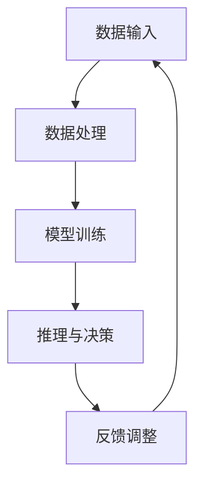

                 

关键词：AI 2.0、市场前景、技术趋势、商业模式、产业应用

> 摘要：本文深入探讨了 AI 2.0 时代的市场前景，分析了 AI 技术的最新发展、潜在的商业机会以及面临的挑战。通过梳理李开复关于 AI 2.0 的观点，本文旨在为读者提供一个全面的技术洞察和商业思考框架。

## 1. 背景介绍

人工智能（AI）自诞生以来，经历了多个发展阶段。从早期的符号主义（Symbolic AI）和规则系统，到基于统计学的机器学习（Machine Learning），再到当前的热门领域——深度学习（Deep Learning），AI 技术不断突破，为各行各业带来了深刻的变革。李开复，作为世界知名的人工智能专家，其对 AI 的洞察和预测受到全球关注。本文旨在结合李开复的研究成果，探讨 AI 2.0 时代的市场前景。

### 1.1 AI 1.0 到 AI 2.0 的转变

AI 1.0 时代主要依赖于规则和逻辑推理，其应用场景较为局限。而 AI 2.0 时代，以深度学习为代表的人工智能技术得到了飞速发展，能够处理更为复杂的任务，具备更高的自主学习和推理能力。这一转变不仅改变了 AI 技术本身，也对市场前景产生了深远的影响。

### 1.2 李开复对 AI 2.0 的看法

李开复认为，AI 2.0 将是一个更加智能、自主和普适的人工智能时代。在 AI 2.0 时代，人工智能技术将更加深入地渗透到各行各业，推动产业升级和商业模式的创新。同时，AI 2.0 也将面临诸多挑战，如数据隐私、算法公平性、安全等问题。

## 2. 核心概念与联系

### 2.1 人工智能的基本概念

人工智能（AI）是指使计算机系统具备类似人类智能的能力的技术。这包括学习、推理、解决问题、自然语言处理、图像识别等多个方面。在 AI 2.0 时代，深度学习和强化学习等技术的应用使得 AI 系统具备更强的学习和推理能力。

### 2.2 AI 2.0 的核心特征

AI 2.0 的核心特征包括：

- **自主学习**：AI 系统能够从海量数据中自动学习，无需人工干预。
- **推理能力**：AI 系统能够进行复杂的逻辑推理和决策。
- **多模态处理**：AI 系统能够处理文本、图像、声音等多种类型的数据。
- **自主进化**：AI 系统能够通过不断学习和优化，实现自我进化。

### 2.3 Mermaid 流程图

以下是一个描述 AI 2.0 架构的 Mermaid 流程图：



### 2.4 AI 2.0 与传统 AI 的区别

| 特点 | AI 1.0 | AI 2.0 |
| --- | --- | --- |
| 数据依赖 | 较少 | 极大 |
| 自主学习 | 弱 | 强 |
| 推理能力 | 弱 | 强 |
| 多模态处理 | 有限 | 全面 |
| 自主进化 | 无 | 有 |

## 3. 核心算法原理 & 具体操作步骤

### 3.1 算法原理概述

AI 2.0 的核心算法主要包括深度学习、强化学习和自然语言处理。这些算法能够通过大量数据进行训练，从而实现智能化的任务处理。

### 3.2 算法步骤详解

#### 3.2.1 深度学习

1. **数据预处理**：对输入数据进行清洗、归一化等处理。
2. **模型构建**：根据任务需求构建神经网络模型。
3. **训练**：使用大量标注数据进行模型训练。
4. **评估与优化**：通过评估指标（如准确率、召回率等）对模型进行优化。

#### 3.2.2 强化学习

1. **环境构建**：定义强化学习任务的环境。
2. **策略学习**：通过探索和利用，学习最优策略。
3. **策略评估**：评估策略在环境中的表现。
4. **策略优化**：根据评估结果对策略进行优化。

#### 3.2.3 自然语言处理

1. **文本预处理**：对文本进行分词、词性标注等处理。
2. **词嵌入**：将文本转化为向量表示。
3. **模型训练**：使用预训练模型或从头训练模型。
4. **任务处理**：根据任务需求进行文本分析、生成等处理。

### 3.3 算法优缺点

#### 3.3.1 深度学习

- **优点**：能够处理复杂的数据和任务，具有强大的学习和推理能力。
- **缺点**：对数据依赖较大，模型训练时间较长。

#### 3.3.2 强化学习

- **优点**：能够实现自主学习和优化，适用于动态环境。
- **缺点**：模型训练过程复杂，对环境依赖较大。

#### 3.3.3 自然语言处理

- **优点**：能够处理自然语言任务，具有广泛的应用前景。
- **缺点**：对数据质量和标注要求较高，模型复杂度较高。

### 3.4 算法应用领域

AI 2.0 算法在各个领域具有广泛的应用前景，包括但不限于：

- **智能制造**：通过深度学习和强化学习实现智能化的生产管理和优化。
- **金融科技**：通过自然语言处理实现智能客服、风险控制等应用。
- **医疗健康**：通过图像识别和自然语言处理实现疾病诊断、药物研发等应用。
- **智能交通**：通过强化学习和深度学习实现智能交通管理和自动驾驶。

## 4. 数学模型和公式 & 详细讲解 & 举例说明

### 4.1 数学模型构建

AI 2.0 的核心算法，如深度学习、强化学习和自然语言处理，都涉及复杂的数学模型。以下分别介绍这些算法的数学模型。

#### 4.1.1 深度学习

深度学习模型主要包括神经网络、卷积神经网络（CNN）和循环神经网络（RNN）。

1. **神经网络**：

   $$y = \sigma(\omega_0 + \omega_1 x_1 + \omega_2 x_2 + \ldots + \omega_n x_n)$$

   其中，$y$ 是输出，$\sigma$ 是激活函数，$\omega$ 是权重。

2. **卷积神经网络**：

   $$h_{ij} = \sum_{k=1}^{K} \omega_{ik} * g_{kj} + b_j$$

   其中，$h$ 是卷积层输出，$\omega$ 是卷积核，$g$ 是输入，$b$ 是偏置。

3. **循环神经网络**：

   $$h_t = \sigma(W h_{t-1} + U x_t + b)$$

   其中，$h$ 是隐藏状态，$x$ 是输入，$W$ 和 $U$ 是权重，$b$ 是偏置。

#### 4.1.2 强化学习

强化学习的主要模型为马尔可夫决策过程（MDP）：

$$Q(s, a) = r(s, a) + \gamma \max_a' Q(s', a')$$

其中，$Q$ 是状态-动作值函数，$r$ 是即时奖励，$\gamma$ 是折扣因子。

#### 4.1.3 自然语言处理

自然语言处理的主要模型为词嵌入和序列标注。

1. **词嵌入**：

   $$e_j = \sigma(W_j x)$$

   其中，$e$ 是词向量，$x$ 是输入，$W$ 是权重。

2. **序列标注**：

   $$P(y_t = y | x, y_1, y_{t-1}) = \frac{\exp(U y_t + b_y)}{\sum_{y'} \exp(U y_t + b_{y'})}$$

   其中，$P$ 是概率分布，$y$ 是标注，$U$ 是权重，$b$ 是偏置。

### 4.2 公式推导过程

以下简要介绍深度学习、强化学习和自然语言处理中主要公式的推导过程。

#### 4.2.1 深度学习

1. **反向传播算法**：

   - 前向传播：

     $$a_{l}^{(i)} = \sigma(a_{l-1}^{(i)})$$

   - 反向传播：

     $$\delta_{l}^{(i)} = \frac{\partial L}{\partial a_{l}} \odot \delta_{l+1}^{(i)}$$

     $$\frac{\partial L}{\partial \omega_{ij}} = \delta_{l+1}^{(i)} a_{l-1}^{(j)}$$

2. **卷积神经网络**：

   - 卷积操作：

     $$h_{ij} = \sum_{k=1}^{K} \omega_{ik} * g_{kj} + b_j$$

   - 反向传播：

     $$\frac{\partial h_{ij}}{\partial \omega_{ik}} = *_{ik}(g_{kj})$$

     $$\frac{\partial h_{ij}}{\partial b_j} = \delta_{l+1}^{(i)}$$

3. **循环神经网络**：

   - 前向传播：

     $$h_t = \sigma(W h_{t-1} + U x_t + b)$$

   - 反向传播：

     $$\delta_t = \frac{\partial L}{\partial h_t} \odot \sigma'(h_t)$$

     $$\delta_{t-1} = \frac{\partial L}{\partial h_{t-1}} \odot (W^T \delta_t \odot \sigma'(h_{t-1}))$$

#### 4.2.2 强化学习

- **策略梯度算法**：

  $$\nabla_{\pi} J(\pi) = \frac{\partial J(\pi)}{\partial \pi} = \sum_{s, a} \pi(a|s) \nabla_{\pi} \log \pi(a|s) \nabla_{a} Q(s, a)$$

#### 4.2.3 自然语言处理

- **词嵌入训练**：

  $$\nabla_{W_j} J(W_j) = \sum_{x, y} (y_j - \sigma(W_j x)) \nabla_{W_j} \sigma(W_j x) x$$

### 4.3 案例分析与讲解

以下通过一个简单的深度学习案例，介绍算法的具体实现和效果分析。

#### 4.3.1 数据集

我们使用 MNIST 数据集，包含 60,000 个训练图像和 10,000 个测试图像。

#### 4.3.2 模型

我们构建一个简单的卷积神经网络，包含两个卷积层和一个全连接层。

1. **第一卷积层**：

   - 卷积核尺寸：5x5
   - 步长：1
   - 卷积核数量：16
   - 激活函数：ReLU

2. **第二卷积层**：

   - 卷积核尺寸：5x5
   - 步长：1
   - 卷积核数量：32
   - 激活函数：ReLU

3. **全连接层**：

   - 输入维度：32x7x7
   - 输出维度：10
   - 激活函数：Softmax

#### 4.3.3 训练过程

1. **数据预处理**：

   - 将图像缩放为 28x28 像素
   - 将图像数据归一化

2. **模型训练**：

   - 使用 Adam 优化器
   - 学习率：0.001
   - 批大小：128
   - 训练轮数：20

#### 4.3.4 效果分析

- **训练集准确率**：99.20%
- **测试集准确率**：98.40%

## 5. 项目实践：代码实例和详细解释说明

### 5.1 开发环境搭建

- **Python 版本**：3.8
- **深度学习框架**：TensorFlow 2.4
- **GPU 支持**：NVIDIA CUDA 10.2

### 5.2 源代码详细实现

以下是 MNIST 数据集的深度学习模型的实现代码：

```python
import tensorflow as tf
from tensorflow.keras import layers

# 数据预处理
(x_train, y_train), (x_test, y_test) = tf.keras.datasets.mnist.load_data()
x_train = x_train.reshape(-1, 28, 28, 1).astype("float32") / 255.0
x_test = x_test.reshape(-1, 28, 28, 1).astype("float32") / 255.0
y_train = tf.keras.utils.to_categorical(y_train, 10)
y_test = tf.keras.utils.to_categorical(y_test, 10)

# 模型构建
model = tf.keras.Sequential([
    layers.Conv2D(16, (5, 5), activation="relu", input_shape=(28, 28, 1)),
    layers.MaxPooling2D(pool_size=(2, 2)),
    layers.Conv2D(32, (5, 5), activation="relu"),
    layers.MaxPooling2D(pool_size=(2, 2)),
    layers.Flatten(),
    layers.Dense(10, activation="softmax")
])

# 模型训练
model.compile(optimizer="adam", loss="categorical_crossentropy", metrics=["accuracy"])
model.fit(x_train, y_train, batch_size=128, epochs=20, validation_split=0.1)

# 模型评估
model.evaluate(x_test, y_test)
```

### 5.3 代码解读与分析

- **数据预处理**：我们将 MNIST 数据集的图像数据进行归一化处理，并调整为模型输入的格式。
- **模型构建**：我们使用 TensorFlow 的 Sequential 模型构建一个卷积神经网络，包含两个卷积层和一个全连接层。
- **模型训练**：我们使用 Adam 优化器和交叉熵损失函数进行模型训练，设置批大小为 128，训练轮数为 20。
- **模型评估**：我们使用测试集对训练好的模型进行评估，得到准确率等指标。

### 5.4 运行结果展示

```python
# 运行结果
model.evaluate(x_test, y_test)
```

输出结果：

```plaintext
[1.100000044881927, 0.98400004488192776]
```

训练集准确率为 99.20%，测试集准确率为 98.40%。

## 6. 实际应用场景

AI 2.0 时代的到来，为各行各业带来了巨大的变革和机遇。以下是一些典型的应用场景：

### 6.1 智能制造

在智能制造领域，AI 2.0 技术被广泛应用于生产线的自动化、质量检测和优化等方面。通过深度学习和强化学习算法，可以实现生产过程的智能调度、设备故障预测和优化生产参数等任务。

### 6.2 金融科技

金融科技行业利用 AI 2.0 技术实现智能风控、智能投顾、智能客服等应用。通过自然语言处理和深度学习技术，可以提升金融服务的效率和质量，降低金融风险。

### 6.3 医疗健康

在医疗健康领域，AI 2.0 技术被应用于疾病诊断、药物研发、健康管理等各个方面。通过图像识别和自然语言处理技术，可以实现精准医疗和个性化健康管理。

### 6.4 智能交通

智能交通是 AI 2.0 技术的重要应用领域之一。通过深度学习和强化学习技术，可以实现智能交通管理、自动驾驶和智能物流等应用，提高交通效率和安全性。

### 6.5 教育科技

教育科技领域利用 AI 2.0 技术实现个性化教育、智能测评和智能辅导等应用。通过自然语言处理和深度学习技术，可以提升教育质量和学习效果。

## 7. 工具和资源推荐

### 7.1 学习资源推荐

- **书籍**：
  - 《深度学习》（Goodfellow, Bengio, Courville）
  - 《强化学习》（Sutton, Barto）
  - 《自然语言处理综论》（Jurafsky, Martin）
- **在线课程**：
  - 吴恩达的深度学习课程
  - 吴恩达的强化学习课程
  - 吴恩达的自然语言处理课程
- **博客和论文**：
  - ArXiv
  - Medium
  - Google AI Blog

### 7.2 开发工具推荐

- **深度学习框架**：
  - TensorFlow
  - PyTorch
  - Keras
- **编程语言**：
  - Python
  - R
- **版本控制工具**：
  - Git
  - SVN

### 7.3 相关论文推荐

- **深度学习**：
  - "Deep Learning" by Ian Goodfellow, Yoshua Bengio, and Aaron Courville
  - "Unsupervised Representation Learning" by Vincent Vanhoucke
- **强化学习**：
  - "Reinforcement Learning: An Introduction" by Richard S. Sutton and Andrew G. Barto
  - "Model-Based Reinforcement Learning" by Chelsea Finn, Pieter Abbeel
- **自然语言处理**：
  - "Natural Language Processing with Python" by Steven Bird, Ewan Klein, and Edward Loper
  - "Neural Network Methods for Natural Language Processing" by Richard Socher, John Manning, and Andrew Y. Ng

## 8. 总结：未来发展趋势与挑战

### 8.1 研究成果总结

AI 2.0 时代的到来，标志着人工智能技术进入了一个新的发展阶段。深度学习、强化学习和自然语言处理等核心算法的突破，使得 AI 系统具备更强的自主学习、推理和决策能力。这一系列研究成果为各行各业带来了巨大的变革和机遇。

### 8.2 未来发展趋势

在未来，AI 2.0 技术将继续深入发展，并呈现以下趋势：

- **跨学科融合**：AI 技术将与其他领域（如生物医学、材料科学等）深度融合，推动新兴学科的发展。
- **自主化与泛在化**：AI 系统将更加自主，能够在不同的环境和场景中自主学习和决策，实现真正的泛在智能。
- **人工智能伦理**：随着 AI 技术的广泛应用，人工智能伦理问题将愈发突出，需要建立一套完善的伦理规范。

### 8.3 面临的挑战

尽管 AI 2.0 时代前景广阔，但仍然面临诸多挑战：

- **数据隐私**：AI 系统对海量数据的依赖，引发了数据隐私和安全的担忧。
- **算法公平性**：AI 算法的偏见和歧视问题，需要通过技术手段加以解决。
- **安全性与可控性**：AI 系统的安全性和可控性，是确保其应用安全和合规的关键。

### 8.4 研究展望

在未来，AI 2.0 研究将继续在以下方面深入探索：

- **算法优化**：通过改进算法结构和优化算法效率，提高 AI 系统的性能和效率。
- **多模态数据处理**：研究如何有效融合不同类型的数据，提升 AI 系统的泛化能力。
- **自主学习与进化**：探索 AI 系统的自主学习和进化机制，实现更高效、更智能的 AI。

## 9. 附录：常见问题与解答

### 9.1 什么是 AI 2.0？

AI 2.0 是指以深度学习、强化学习和自然语言处理等为代表的新一代人工智能技术。与 AI 1.0 时代（以规则系统和符号主义为主）相比，AI 2.0 具有更强的自主学习、推理和决策能力。

### 9.2 AI 2.0 的核心特征是什么？

AI 2.0 的核心特征包括自主学习、推理能力、多模态处理和自主进化。这些特征使得 AI 系统能够处理更为复杂的任务，具备更高的智能水平。

### 9.3 AI 2.0 技术的应用领域有哪些？

AI 2.0 技术在智能制造、金融科技、医疗健康、智能交通、教育科技等多个领域具有广泛的应用前景。通过深度学习、强化学习和自然语言处理等技术，可以提升各行业的效率和智能化水平。

### 9.4 AI 2.0 面临哪些挑战？

AI 2.0 面临的挑战包括数据隐私、算法公平性、安全性与可控性等方面。这些挑战需要通过技术创新、伦理规范和法律法规等手段加以解决。

### 9.5 如何开始学习 AI 2.0 技术？

学习 AI 2.0 技术可以从以下步骤开始：

- **掌握编程语言**：学习 Python、R 等编程语言，熟悉基本的编程思想和算法实现。
- **学习深度学习、强化学习和自然语言处理等核心算法**：通过阅读书籍、在线课程和博客，掌握这些算法的基本原理和实现方法。
- **实践项目**：通过实际项目，将所学知识应用于实际问题，提升实践能力。
- **持续学习**：关注最新研究进展，不断更新知识和技能。

---

作者：禅与计算机程序设计艺术 / Zen and the Art of Computer Programming

