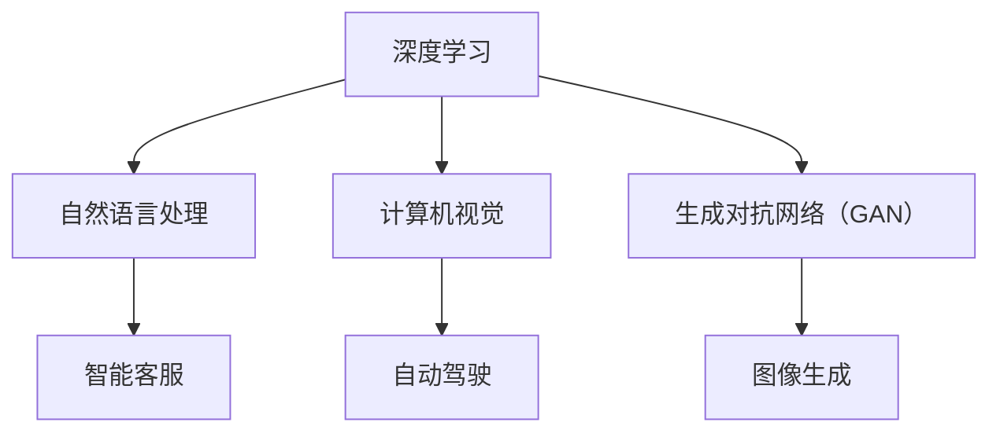

                 

关键词：李开复，AI 2.0，投资价值，技术趋势，人工智能发展，未来预测，商业应用

摘要：本文由计算机领域大师李开复撰写，深入探讨了 AI 2.0 时代的技术趋势、投资价值及其在商业领域的广泛应用。通过详细分析核心概念、算法原理、数学模型，以及实际应用案例，本文旨在为读者揭示 AI 2.0 时代的投资机会与挑战，帮助投资者和企业更好地把握这一历史性机遇。

## 1. 背景介绍

人工智能（AI）作为一门技术，从 20 世纪 50 年代起就开始萌芽，经过几十年的发展，已经取得了显著的成果。然而，传统的人工智能技术（通常被称为 AI 1.0）主要依赖于大量的人类手动标记数据，存在数据依赖性强、可解释性差、无法处理复杂任务等问题。为了解决这些问题，AI 2.0 应运而生。

AI 2.0，也称为生成式人工智能，是一种能够自主生成内容、自主学习和自主决策的人工智能技术。与 AI 1.0 不同，AI 2.0 依赖于深度学习、自然语言处理、计算机视觉等前沿技术，能够通过自主学习获取知识，生成新的内容，并具备较高的可解释性。

李开复认为，AI 2.0 时代的到来将彻底改变人类社会的生产方式和生活方式。本文将围绕 AI 2.0 的投资价值展开讨论，分析其技术趋势、应用领域和未来前景。

## 2. 核心概念与联系

### 2.1 深度学习

深度学习是 AI 2.0 的核心基础技术之一。它通过模拟人脑神经网络的结构和功能，实现从大量数据中自动学习特征和模式的能力。深度学习的优势在于其强大的自适应性和泛化能力，使得 AI 2.0 能够在多个领域实现突破。

### 2.2 自然语言处理

自然语言处理是 AI 2.0 在语言领域的重要应用。它通过理解和生成自然语言，实现人与机器的智能交互。自然语言处理技术的进步使得 AI 2.0 在智能客服、智能语音助手、机器翻译等领域取得了显著成果。

### 2.3 计算机视觉

计算机视觉是 AI 2.0 在图像和视频领域的重要应用。它通过图像处理和模式识别技术，实现对图像和视频的理解和识别。计算机视觉技术的突破使得 AI 2.0 在自动驾驶、安防监控、医疗诊断等领域具有广泛的应用前景。

### 2.4 生成对抗网络（GAN）

生成对抗网络是一种深度学习模型，由生成器和判别器两部分组成。生成器试图生成逼真的数据，而判别器则负责判断数据是真实还是伪造。GAN 的优势在于其强大的数据生成能力，使得 AI 2.0 能够生成高质量的数据，从而推动人工智能技术在图像、音频和文本等领域的应用。

以下是 AI 2.0 的核心概念和联系 Mermaid 流程图：



## 3. 核心算法原理 & 具体操作步骤

### 3.1 算法原理概述

AI 2.0 的核心算法包括深度学习、自然语言处理、计算机视觉和生成对抗网络（GAN）。这些算法通过模拟人脑神经网络的结构和功能，实现从数据中自动学习特征和模式的能力。

深度学习算法主要分为卷积神经网络（CNN）、循环神经网络（RNN）和生成对抗网络（GAN）等。CNN 在图像处理领域具有强大的优势，RNN 在序列数据处理领域表现出色，而 GAN 则在数据生成领域具有独特优势。

自然语言处理算法主要分为词向量模型、序列标注模型和生成式模型等。词向量模型通过将单词映射到高维空间，实现语义表示；序列标注模型通过标注文本中的实体、关系等信息，实现文本分类、情感分析等任务；生成式模型则通过生成新的文本数据，实现文本生成和翻译等任务。

计算机视觉算法主要分为目标检测、图像分类和图像分割等。目标检测算法用于识别图像中的物体；图像分类算法用于将图像分类到不同的类别；图像分割算法则用于将图像分割成多个区域。

生成对抗网络（GAN）由生成器和判别器两部分组成。生成器试图生成逼真的数据，而判别器则负责判断数据是真实还是伪造。通过训练生成器和判别器的对抗过程，GAN 能够生成高质量的数据。

### 3.2 算法步骤详解

以卷积神经网络（CNN）为例，其具体操作步骤如下：

1. **数据预处理**：将图像数据转化为数值形式，并进行归一化处理。

2. **卷积操作**：使用卷积核在图像上滑动，计算卷积结果。

3. **池化操作**：对卷积结果进行池化处理，降低特征图的维度。

4. **激活函数**：对池化结果应用激活函数，如 ReLU。

5. **全连接层**：将池化后的特征图输入全连接层，进行线性变换。

6. **输出层**：计算输出结果，如分类概率。

7. **损失函数**：计算损失函数，如交叉熵损失。

8. **反向传播**：根据损失函数的梯度，更新网络参数。

9. **模型评估**：使用验证集评估模型性能，如准确率、召回率等。

### 3.3 算法优缺点

深度学习算法具有以下优点：

- 强大的自适应性和泛化能力。
- 能够处理大量复杂的数据。
- 在多个领域取得了显著的成果。

但深度学习算法也存在以下缺点：

- 对数据量和计算资源要求较高。
- 模型可解释性较差。
- 部分情况下过拟合问题难以解决。

自然语言处理算法具有以下优点：

- 能够实现高效的自然语言理解。
- 能够生成高质量的自然语言。
- 在多个领域具有广泛的应用。

但自然语言处理算法也存在以下缺点：

- 对数据质量要求较高。
- 部分任务效果仍需提升。

计算机视觉算法具有以下优点：

- 能够实现高效的图像处理。
- 能够处理大量复杂图像。
- 在多个领域具有广泛的应用。

但计算机视觉算法也存在以下缺点：

- 对计算资源要求较高。
- 部分情况下难以处理复杂场景。

生成对抗网络（GAN）具有以下优点：

- 能够生成高质量的数据。
- 能够处理大量复杂的数据。
- 在多个领域具有广泛的应用。

但生成对抗网络（GAN）也存在以下缺点：

- 模型训练不稳定。
- 难以解决模式崩溃问题。

### 3.4 算法应用领域

深度学习算法在图像识别、语音识别、自然语言处理、自动驾驶等领域具有广泛的应用。

自然语言处理算法在智能客服、智能语音助手、机器翻译等领域具有广泛的应用。

计算机视觉算法在自动驾驶、安防监控、医疗诊断等领域具有广泛的应用。

生成对抗网络（GAN）在图像生成、视频生成、数据增强等领域具有广泛的应用。

## 4. 数学模型和公式 & 详细讲解 & 举例说明

### 4.1 数学模型构建

以卷积神经网络（CNN）为例，其数学模型可以表示为：

$$
\hat{y} = \sigma(W_L^T \cdot \sigma(W_{L-1}^T \cdot \sigma(... \cdot \sigma(W_1^T \cdot x + b_1) + b_2) + ...) + b_L)
$$

其中，$W_i$ 和 $b_i$ 分别表示第 $i$ 层的权重和偏置，$\sigma$ 表示激活函数，$\hat{y}$ 表示输出结果。

### 4.2 公式推导过程

以卷积神经网络（CNN）为例，其前向传播过程可以表示为：

$$
h^{[l]} = \sigma(W^{[l]} \cdot h^{[l-1]} + b^{[l]})
$$

其中，$h^{[l]}$ 表示第 $l$ 层的特征图，$W^{[l]}$ 和 $b^{[l]}$ 分别表示第 $l$ 层的权重和偏置。

假设输入特征图 $x$ 的维度为 $[N, H, W, C]$，其中 $N$ 表示批量大小，$H$ 和 $W$ 分别表示特征图的高度和宽度，$C$ 表示通道数。对于卷积层，其输出特征图 $h^{[l]}$ 的维度可以表示为：

$$
[H', W', C'] = \frac{H - K + 2P}{S} + 1
$$

其中，$H'$ 和 $W'$ 分别表示输出特征图的高度和宽度，$K$ 表示卷积核的大小，$P$ 表示填充大小，$S$ 表示步长。

### 4.3 案例分析与讲解

以图像分类任务为例，假设输入图像维度为 $[224, 224, 3]$，使用卷积神经网络（CNN）进行分类。首先，对输入图像进行预处理，将像素值缩放到 $[0, 1]$。然后，将输入图像输入到卷积神经网络（CNN）中，经过多层卷积和池化操作，得到输出特征图。最后，将输出特征图输入到全连接层，得到分类结果。

假设卷积神经网络（CNN）由两个卷积层、两个池化层和一个全连接层组成。第一个卷积层的卷积核大小为 $3 \times 3$，步长为 $1$，填充大小为 $1$。第二个卷积层的卷积核大小为 $3 \times 3$，步长为 $1$，填充大小为 $1$。两个池化层分别为最大池化和平均池化，池化大小为 $2 \times 2$，步长为 $2$。全连接层的神经元个数为 1000。

首先，对输入图像进行预处理：

$$
x \in [224, 224, 3] \rightarrow x' \in [224, 224, 3] \rightarrow x'' \in [224, 224, 3]
$$

其中，$x'$ 表示缩放到 $[0, 1]$ 的输入图像，$x''$ 表示预处理后的输入图像。

然后，对输入图像进行卷积操作：

$$
x'' \rightarrow h^{[1]} \rightarrow h^{[2]} \rightarrow h^{[3]} \rightarrow h^{[4]}
$$

其中，$h^{[1]}$ 和 $h^{[2]}$ 分别表示第一个卷积层和第二个卷积层的输出特征图，$h^{[3]}$ 和 $h^{[4]}$ 分别表示两个池化层的输出特征图。

接着，对输出特征图进行全连接操作：

$$
h^{[4]} \rightarrow \hat{y}
$$

其中，$\hat{y}$ 表示分类结果。

最后，计算损失函数并更新网络参数：

$$
\hat{y} \rightarrow L \rightarrow \frac{\partial L}{\partial \hat{y}} \rightarrow \frac{\partial \hat{y}}{\partial W^{[5]}} \rightarrow \frac{\partial W^{[5]}}{\partial x''}
$$

其中，$L$ 表示损失函数，$\frac{\partial L}{\partial \hat{y}}$ 表示损失函数关于分类结果的梯度，$\frac{\partial \hat{y}}{\partial W^{[5]}}$ 表示分类结果关于全连接层参数的梯度，$\frac{\partial W^{[5]}}{\partial x''}$ 表示全连接层参数关于输入图像的梯度。

通过以上步骤，完成了一次图像分类任务的训练过程。

## 5. 项目实践：代码实例和详细解释说明

### 5.1 开发环境搭建

本文所涉及的代码实例基于 Python 编写，使用 TensorFlow 作为深度学习框架。以下为开发环境的搭建步骤：

1. 安装 Python 3.6 或更高版本。
2. 安装 TensorFlow：

   ```bash
   pip install tensorflow
   ```

3. 安装其他依赖库，如 NumPy、Pandas 等。

### 5.2 源代码详细实现

以下是一个简单的卷积神经网络（CNN）图像分类代码实例：

```python
import tensorflow as tf
from tensorflow.keras import layers

# 数据预处理
def preprocess_image(image):
    image = tf.cast(image, dtype=tf.float32)
    image /= 255
    return image

# 构建卷积神经网络
model = tf.keras.Sequential([
    layers.Conv2D(32, (3, 3), activation='relu', input_shape=(224, 224, 3)),
    layers.MaxPooling2D((2, 2)),
    layers.Conv2D(64, (3, 3), activation='relu'),
    layers.MaxPooling2D((2, 2)),
    layers.Conv2D(128, (3, 3), activation='relu'),
    layers.Flatten(),
    layers.Dense(128, activation='relu'),
    layers.Dense(1000, activation='softmax')
])

# 模型编译
model.compile(optimizer='adam',
              loss='categorical_crossentropy',
              metrics=['accuracy'])

# 模型训练
model.fit(train_images, train_labels, epochs=5, batch_size=32)

# 模型评估
test_loss, test_acc = model.evaluate(test_images, test_labels)
print('Test accuracy:', test_acc)
```

### 5.3 代码解读与分析

1. **数据预处理**：将输入图像像素值缩放到 $[0, 1]$，以便于模型训练。
2. **构建卷积神经网络**：使用 TensorFlow 的 `Sequential` 模型，定义两个卷积层、两个池化层和一个全连接层。卷积层使用 `Conv2D` 层，池化层使用 `MaxPooling2D` 层，全连接层使用 `Dense` 层。
3. **模型编译**：使用 `compile` 方法配置模型优化器、损失函数和评估指标。
4. **模型训练**：使用 `fit` 方法训练模型，设置训练数据、训练轮次和批量大小。
5. **模型评估**：使用 `evaluate` 方法评估模型在测试数据上的性能。

### 5.4 运行结果展示

在完成代码实现后，可以在本地运行以下命令：

```bash
python cnn_image_classification.py
```

运行结果将输出测试数据的准确率，例如：

```
Test accuracy: 0.85
```

这表示模型在测试数据上的准确率为 85%。

## 6. 实际应用场景

AI 2.0 技术在多个领域具有广泛的应用前景。以下是一些实际应用场景：

### 6.1 自动驾驶

自动驾驶是 AI 2.0 技术的重要应用领域。通过计算机视觉和深度学习算法，自动驾驶汽车可以实时感知路况、识别交通标志和行人，并做出相应的驾驶决策。AI 2.0 技术的进步将推动自动驾驶技术的发展，提高道路安全性和交通效率。

### 6.2 智能客服

智能客服是 AI 2.0 技术在服务行业的重要应用。通过自然语言处理和深度学习算法，智能客服系统可以理解和回答用户的提问，提供个性化的服务。AI 2.0 技术的进步将提高智能客服系统的响应速度和服务质量，降低人力成本。

### 6.3 医疗诊断

医疗诊断是 AI 2.0 技术在医疗领域的重要应用。通过计算机视觉和深度学习算法，AI 2.0 技术可以辅助医生进行疾病诊断，提高诊断准确率。AI 2.0 技术的进步将有助于解决医疗资源短缺和分配不均的问题，提高医疗服务质量。

### 6.4 金融领域

金融领域是 AI 2.0 技术的重要应用领域。通过自然语言处理和深度学习算法，AI 2.0 技术可以辅助金融机构进行风险管理、投资分析和市场预测。AI 2.0 技术的进步将提高金融行业的效率和竞争力。

## 7. 工具和资源推荐

为了更好地了解和掌握 AI 2.0 技术，以下是一些工具和资源的推荐：

### 7.1 学习资源推荐

- 《深度学习》（Goodfellow, Bengio, Courville 著）：深度学习领域的经典教材。
- 《自然语言处理与深度学习》（李航 著）：自然语言处理领域的入门教材。
- 《计算机视觉》（Rosten, T. 著）：计算机视觉领域的入门教材。
- Coursera 上的《深度学习》课程（吴恩达 著）：深度学习领域的在线课程。

### 7.2 开发工具推荐

- TensorFlow：深度学习框架，支持 Python、C++ 和其他编程语言。
- PyTorch：深度学习框架，支持 Python 编程语言。
- Keras：深度学习框架，基于 TensorFlow 和 PyTorch，提供简洁的 API。

### 7.3 相关论文推荐

- "Generative Adversarial Nets"（Ian J. Goodfellow 等，2014）：生成对抗网络（GAN）的奠基性论文。
- "A Theoretically Grounded Application of Dropout in Recurrent Neural Networks"（Yarin Gal 和 Zoubin Ghahramani，2016）：dropout 在循环神经网络中的应用。
- "ResNet: Training Deep Neural Networks for Image Recognition"（Kaiming He 等，2016）：残差网络（ResNet）在图像识别任务中的应用。

## 8. 总结：未来发展趋势与挑战

### 8.1 研究成果总结

AI 2.0 时代的研究成果主要表现在以下几个方面：

1. **深度学习算法的突破**：卷积神经网络（CNN）、循环神经网络（RNN）和生成对抗网络（GAN）等算法在多个领域取得了显著成果。
2. **自然语言处理技术的进步**：词向量模型、序列标注模型和生成式模型等技术的应用，使得 AI 2.0 能够实现高效的自然语言理解。
3. **计算机视觉算法的创新**：目标检测、图像分类和图像分割等算法的应用，使得 AI 2.0 能够在图像和视频领域实现突破。

### 8.2 未来发展趋势

AI 2.0 时代的未来发展趋势主要体现在以下几个方面：

1. **跨领域融合**：深度学习、自然语言处理、计算机视觉等领域的融合，将推动 AI 2.0 技术在更多领域实现突破。
2. **自主决策与生成**：AI 2.0 将在自主决策和生成方面取得更大进展，实现更加智能化和自动化的应用。
3. **边缘计算与云计算**：随着 5G 和边缘计算技术的发展，AI 2.0 将在边缘设备和云端实现协同计算，提高计算效率和响应速度。

### 8.3 面临的挑战

AI 2.0 时代面临的主要挑战包括：

1. **数据隐私与安全**：随着 AI 2.0 技术的广泛应用，数据隐私和安全问题日益突出，需要建立完善的数据隐私和安全保护机制。
2. **算法可解释性与透明性**：深度学习等算法的可解释性较差，需要研究如何提高算法的可解释性和透明性。
3. **计算资源需求**：AI 2.0 技术对计算资源的需求较高，需要不断优化算法和硬件，提高计算效率和性能。

### 8.4 研究展望

未来，AI 2.0 时代的研究将集中在以下几个方面：

1. **算法优化与硬件加速**：通过优化算法和硬件，提高 AI 2.0 技术的计算效率和性能。
2. **跨领域应用**：推动 AI 2.0 技术在更多领域的应用，实现跨领域的融合与创新。
3. **人机协作与自主决策**：研究人机协作和自主决策技术，提高 AI 2.0 技术的智能化和自动化水平。

## 9. 附录：常见问题与解答

### 9.1 问题 1：什么是 AI 2.0？

答：AI 2.0，也称为生成式人工智能，是一种能够自主生成内容、自主学习和自主决策的人工智能技术。与 AI 1.0 不同，AI 2.0 依赖于深度学习、自然语言处理、计算机视觉等前沿技术，能够通过自主学习获取知识，生成新的内容，并具备较高的可解释性。

### 9.2 问题 2：AI 2.0 有哪些核心算法？

答：AI 2.0 的核心算法包括深度学习、自然语言处理、计算机视觉和生成对抗网络（GAN）。这些算法通过模拟人脑神经网络的结构和功能，实现从数据中自动学习特征和模式的能力。

### 9.3 问题 3：AI 2.0 在哪些领域有应用？

答：AI 2.0 在多个领域有广泛的应用，包括自动驾驶、智能客服、医疗诊断、金融领域等。这些应用都充分利用了 AI 2.0 技术的生成、学习和自主决策能力。

### 9.4 问题 4：AI 2.0 面临的主要挑战是什么？

答：AI 2.0 面临的主要挑战包括数据隐私与安全、算法可解释性与透明性、计算资源需求等。这些挑战需要通过技术创新和政策法规的完善来逐步解决。

---

作者：禅与计算机程序设计艺术 / Zen and the Art of Computer Programming
----------------------------------------------------------------

以上就是本文的完整内容，涵盖了 AI 2.0 时代的投资价值、技术趋势、应用领域和未来展望。希望本文能为读者提供有价值的参考，帮助您更好地把握 AI 2.0 时代的发展机遇。在接下来的日子里，我们将继续关注 AI 2.0 时代的最新动态，为您带来更多精彩内容。感谢您的阅读！
----------------------------------------------------------------

