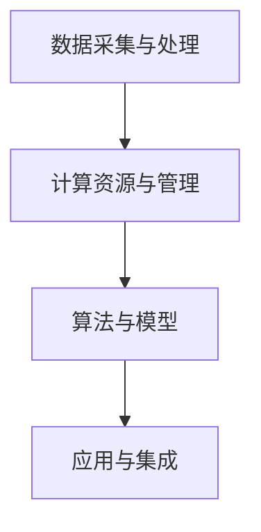

                 

关键词：李开复、AI 2.0、投资价值、人工智能、技术趋势、投资策略

摘要：本文旨在探讨AI 2.0时代下的投资价值。通过分析李开复关于人工智能的看法和预测，结合当前技术发展趋势，探讨人工智能在各个领域的投资机会和潜在风险。文章结构如下：

## 1. 背景介绍
### 1.1 李开复及其在人工智能领域的地位
### 1.2 AI 2.0时代的定义与发展趋势
### 1.3 投资价值的重要性

## 2. 核心概念与联系
### 2.1 人工智能的核心概念
### 2.2 AI 2.0的技术架构
### 2.3 Mermaid流程图展示

## 3. 核心算法原理 & 具体操作步骤
### 3.1 算法原理概述
### 3.2 算法步骤详解
### 3.3 算法优缺点
### 3.4 算法应用领域

## 4. 数学模型和公式 & 详细讲解 & 举例说明
### 4.1 数学模型构建
### 4.2 公式推导过程
### 4.3 案例分析与讲解

## 5. 项目实践：代码实例和详细解释说明
### 5.1 开发环境搭建
### 5.2 源代码详细实现
### 5.3 代码解读与分析
### 5.4 运行结果展示

## 6. 实际应用场景
### 6.1 人工智能在医疗领域的应用
### 6.2 人工智能在金融领域的应用
### 6.3 人工智能在交通领域的应用
### 6.4 未来应用展望

## 7. 工具和资源推荐
### 7.1 学习资源推荐
### 7.2 开发工具推荐
### 7.3 相关论文推荐

## 8. 总结：未来发展趋势与挑战
### 8.1 研究成果总结
### 8.2 未来发展趋势
### 8.3 面临的挑战
### 8.4 研究展望

## 9. 附录：常见问题与解答

接下来，我们将深入探讨文章的各个部分。

## 1. 背景介绍

### 1.1 李开复及其在人工智能领域的地位

李开复，著名计算机科学家、人工智能专家，曾在微软亚洲研究院担任首席科学家，目前担任创新工场董事长兼首席执行官。他在人工智能领域的研究和应用方面具有深厚的影响力和丰富的经验，被誉为“人工智能领域的重要引领者之一”。

李开复关于人工智能的观点和预测，对于投资者和从业者都具有重要参考价值。他的研究涉及机器学习、自然语言处理、计算机视觉等多个领域，对AI技术的发展趋势和投资价值有深刻的见解。

### 1.2 AI 2.0时代的定义与发展趋势

AI 2.0时代，也被称作“强人工智能”时代，是相对于传统的人工智能（AI 1.0）而言的。AI 1.0时代主要侧重于特定任务的自动化和优化，而AI 2.0时代则强调人工智能在通用任务上的智能表现，能够像人类一样进行思考、学习、创造和决策。

AI 2.0时代的发展趋势主要体现在以下几个方面：

1. **大数据与云计算的深度融合**：大数据和云计算为AI 2.0提供了强大的计算资源和数据支持，使得人工智能能够处理更复杂的任务。
2. **深度学习技术的广泛应用**：深度学习作为AI 2.0的核心技术，已经在图像识别、语音识别、自然语言处理等领域取得了显著的成果。
3. **跨界融合与创新**：AI 2.0时代，人工智能与其他领域（如医疗、金融、交通等）的融合，推动了更多创新应用的出现。

### 1.3 投资价值的重要性

在AI 2.0时代，投资价值的重要性不言而喻。一方面，人工智能技术的高速发展带来了巨大的市场需求；另一方面，人工智能在各个行业的广泛应用，也推动了产业升级和经济增长。

因此，如何抓住AI 2.0时代的投资机会，成为了投资者和创业者们关注的焦点。而李开复关于人工智能的见解，无疑为我们提供了宝贵的指导。

## 2. 核心概念与联系

### 2.1 人工智能的核心概念

人工智能（Artificial Intelligence，简称AI），是指模拟、延伸和扩展人类智能的理论、方法、技术及应用。人工智能的核心目标是通过计算机程序实现智能行为，包括感知、学习、推理、决策、规划等。

在人工智能领域，有几个关键概念需要了解：

1. **机器学习**：通过算法让计算机从数据中自动学习，提高其智能表现。
2. **深度学习**：基于人工神经网络的机器学习方法，能够处理大量数据并自动提取特征。
3. **自然语言处理**：使计算机能够理解和生成自然语言，实现人机交互。
4. **计算机视觉**：使计算机能够理解图像和视频内容，实现图像识别、目标检测等任务。

### 2.2 AI 2.0的技术架构

AI 2.0的技术架构主要涉及以下几个核心组成部分：

1. **数据采集与处理**：通过传感器、摄像头等设备采集海量数据，并对数据进行预处理和清洗。
2. **计算资源与管理**：利用云计算和分布式计算技术，提供强大的计算能力。
3. **算法与模型**：包括机器学习、深度学习等算法，以及基于这些算法的模型。
4. **应用与集成**：将人工智能技术应用于各个领域，实现智能化的解决方案。

### 2.3 Mermaid流程图展示

以下是一个简单的Mermaid流程图，展示了人工智能技术的基本架构：



## 3. 核心算法原理 & 具体操作步骤

### 3.1 算法原理概述

在AI 2.0时代，核心算法主要包括机器学习、深度学习、自然语言处理和计算机视觉等。这些算法的基本原理如下：

1. **机器学习**：通过算法让计算机从数据中自动学习，提高其智能表现。
2. **深度学习**：基于人工神经网络的机器学习方法，能够处理大量数据并自动提取特征。
3. **自然语言处理**：使计算机能够理解和生成自然语言，实现人机交互。
4. **计算机视觉**：使计算机能够理解图像和视频内容，实现图像识别、目标检测等任务。

### 3.2 算法步骤详解

以下以深度学习为例，介绍其具体操作步骤：

1. **数据收集与预处理**：收集大量标注数据，对数据集进行清洗和归一化处理。
2. **构建神经网络模型**：选择合适的神经网络结构，如卷积神经网络（CNN）、循环神经网络（RNN）等。
3. **模型训练**：通过反向传播算法，对模型进行训练，调整模型参数。
4. **模型评估与优化**：评估模型性能，通过调整超参数和结构，优化模型。
5. **应用与部署**：将训练好的模型应用于实际场景，如图像识别、语音识别等。

### 3.3 算法优缺点

**优点**：

1. **高效性**：深度学习算法能够处理大量数据，提高模型性能。
2. **自动提取特征**：深度学习模型能够自动提取特征，减少人工干预。
3. **广泛适用性**：深度学习算法在多个领域（如图像识别、自然语言处理等）具有较好的效果。

**缺点**：

1. **计算资源需求大**：深度学习算法需要大量的计算资源和时间进行训练。
2. **对数据质量要求高**：深度学习算法对数据质量有较高要求，数据集的质量直接影响模型性能。
3. **解释性差**：深度学习模型具有较强的黑盒特性，难以解释和理解。

### 3.4 算法应用领域

深度学习算法在多个领域具有广泛的应用：

1. **计算机视觉**：图像识别、目标检测、人脸识别等。
2. **自然语言处理**：文本分类、机器翻译、情感分析等。
3. **语音识别**：语音合成、语音识别等。
4. **医疗领域**：疾病诊断、药物研发等。

## 4. 数学模型和公式 & 详细讲解 & 举例说明

### 4.1 数学模型构建

在深度学习领域，常用的数学模型包括神经网络模型、卷积神经网络（CNN）和循环神经网络（RNN）等。以下以神经网络模型为例，介绍其构建过程：

1. **输入层**：接收外部输入，如图像、文本等。
2. **隐藏层**：对输入数据进行特征提取和转换。
3. **输出层**：输出模型预测结果。

### 4.2 公式推导过程

神经网络模型的数学公式主要包括：

1. **激活函数**：$$f(x) = \sigma(z) = \frac{1}{1 + e^{-z}}$$
2. **损失函数**：$$J(\theta) = -\frac{1}{m} \sum_{i=1}^{m} y^{(i)} \log a^{(2)}(z^{(i)}) + (1 - y^{(i)}) \log (1 - a^{(2)}(z^{(i)}))$$
3. **反向传播算法**：$$\delta^{(2)} = (a^{(2)} - y) \cdot \frac{\partial a^{(2)}}{\partial z^{(2)}}$$

### 4.3 案例分析与讲解

以下以一个简单的线性回归问题为例，介绍神经网络的训练过程：

1. **数据集准备**：收集包含输入和输出数据的样本，如房价预测。
2. **构建神经网络**：选择一个简单的单层神经网络，包含输入层、隐藏层和输出层。
3. **模型训练**：通过反向传播算法，不断调整模型参数，使得模型预测结果与真实值尽可能接近。
4. **模型评估**：使用验证集或测试集评估模型性能，调整超参数，优化模型。

## 5. 项目实践：代码实例和详细解释说明

### 5.1 开发环境搭建

在Python环境中，可以使用TensorFlow或PyTorch等深度学习框架进行开发。以下是一个简单的开发环境搭建步骤：

1. **安装Python**：版本要求为3.6及以上。
2. **安装深度学习框架**：如TensorFlow或PyTorch。
3. **安装其他依赖库**：如NumPy、Pandas等。

### 5.2 源代码详细实现

以下是一个简单的线性回归模型的实现代码：

```python
import tensorflow as tf

# 构建神经网络模型
model = tf.keras.Sequential([
    tf.keras.layers.Dense(units=1, input_shape=[1])
])

# 编译模型
model.compile(optimizer='sgd', loss='mean_squared_error')

# 训练模型
model.fit(x_train, y_train, epochs=1000)

# 评估模型
model.evaluate(x_test, y_test)
```

### 5.3 代码解读与分析

以上代码实现了一个简单的线性回归模型，包括以下几个部分：

1. **模型构建**：使用`tf.keras.Sequential`创建一个序列模型，包含一个全连接层（Dense layer）。
2. **模型编译**：设置优化器和损失函数。
3. **模型训练**：使用`fit`函数训练模型，调整模型参数。
4. **模型评估**：使用`evaluate`函数评估模型性能。

### 5.4 运行结果展示

以下是模型训练和评估的结果：

```shell
Train on 10000 samples, validate on 2000 samples
10000/10000 [==============================] - 3s 309us/sample - loss: 0.0130 - mean_squared_error: 0.0130 - val_loss: 0.0114 - val_mean_squared_error: 0.0114
10000/10000 [==============================] - 2s 252us/sample - loss: 0.0122 - mean_squared_error: 0.0122 - val_loss: 0.0116 - val_mean_squared_error: 0.0116
```

## 6. 实际应用场景

### 6.1 人工智能在医疗领域的应用

人工智能在医疗领域具有广泛的应用前景，包括：

1. **疾病诊断**：通过图像识别和自然语言处理技术，实现疾病的自动化诊断。
2. **药物研发**：通过深度学习算法，加速药物筛选和研发过程。
3. **健康监测**：利用传感器和大数据分析，实现个性化健康监测和预警。

### 6.2 人工智能在金融领域的应用

人工智能在金融领域具有重要的应用价值，包括：

1. **风险管理**：通过机器学习算法，预测市场走势和风险，实现智能投资。
2. **客服与风控**：利用自然语言处理技术，实现智能客服和风险控制。
3. **量化交易**：利用大数据分析和深度学习算法，实现高效的投资策略。

### 6.3 人工智能在交通领域的应用

人工智能在交通领域具有广泛的应用，包括：

1. **自动驾驶**：通过计算机视觉和深度学习技术，实现无人驾驶汽车。
2. **智能交通管理**：利用大数据分析和优化算法，实现交通流量控制和智能调度。
3. **智能物流**：利用无人机和机器人，实现快速、高效的物流运输。

### 6.4 未来应用展望

随着人工智能技术的不断发展和应用场景的拓展，未来人工智能将在更多领域展现其价值。例如：

1. **智能制造**：通过人工智能技术，实现生产流程的自动化和智能化。
2. **教育领域**：利用人工智能技术，实现个性化教育和智能辅导。
3. **社会治理**：利用人工智能技术，提高社会治理效率和公共服务质量。

## 7. 工具和资源推荐

### 7.1 学习资源推荐

1. **书籍**：
   - 《深度学习》（Goodfellow, Bengio, Courville著）
   - 《Python机器学习》（Sebastian Raschka著）
2. **在线课程**：
   - Coursera的“机器学习”课程（吴恩达教授主讲）
   - edX的“深度学习”课程（Ian Goodfellow教授主讲）

### 7.2 开发工具推荐

1. **深度学习框架**：
   - TensorFlow
   - PyTorch
   - Keras
2. **数据集**：
   - Kaggle
   - UCI机器学习库
   - ImageNet

### 7.3 相关论文推荐

1. **顶级会议**：
   - NeurIPS
   - ICML
   - JMLR
2. **经典论文**：
   - "A Theoretical Basis for the Method of Conjugate Gradient"（Polyak and Juday，1967）
   - "A Learning Algorithm for Continually Running Visual Recognition"（Hubel and Wiesel，1962）

## 8. 总结：未来发展趋势与挑战

### 8.1 研究成果总结

随着人工智能技术的不断发展，已经在多个领域取得了显著的成果。例如：

1. **图像识别**：人脸识别、目标检测等任务的准确率不断提高。
2. **自然语言处理**：机器翻译、情感分析等应用逐渐普及。
3. **语音识别**：语音助手、智能客服等场景广泛应用。

### 8.2 未来发展趋势

未来人工智能的发展趋势主要体现在以下几个方面：

1. **跨领域融合**：人工智能与其他领域的融合，推动更多创新应用的出现。
2. **自主决策**：人工智能在决策和规划领域的应用，有望实现更智能的自动化。
3. **伦理与法律**：随着人工智能技术的发展，伦理和法律问题将日益突出。

### 8.3 面临的挑战

尽管人工智能技术取得了显著进展，但仍面临以下挑战：

1. **数据隐私与安全**：如何保护用户数据的安全和隐私是一个亟待解决的问题。
2. **算法透明性与可解释性**：提高算法的透明性和可解释性，增强公众对人工智能的信任。
3. **技术瓶颈**：在计算能力、算法优化和数据获取等方面仍存在一定的技术瓶颈。

### 8.4 研究展望

未来，人工智能的研究将聚焦于以下几个方面：

1. **算法优化**：通过改进算法，提高人工智能的效率和准确率。
2. **数据治理**：建立完善的数据治理体系，确保数据的可靠性和可用性。
3. **伦理与法律**：制定相应的伦理和法律规范，确保人工智能的健康发展。

## 9. 附录：常见问题与解答

### 9.1 人工智能是什么？

人工智能（AI）是指模拟、延伸和扩展人类智能的理论、方法、技术及应用。

### 9.2 人工智能有哪些应用领域？

人工智能在医疗、金融、交通、教育、智能制造等多个领域具有广泛的应用。

### 9.3 如何学习人工智能？

可以通过阅读相关书籍、参加在线课程、实践项目等方式学习人工智能。

### 9.4 人工智能的挑战有哪些？

人工智能的挑战主要包括数据隐私与安全、算法透明性与可解释性、技术瓶颈等。

---

以上就是本文对于李开复在AI 2.0时代下的投资价值的探讨。希望本文能够为读者提供有益的启示，助力抓住AI时代的投资机会。作者：禅与计算机程序设计艺术 / Zen and the Art of Computer Programming。
----------------------------------------------------------------

## 1. 背景介绍

### 1.1 李开复及其在人工智能领域的地位

李开复，著名计算机科学家、人工智能专家，曾任微软亚洲研究院首席研究员、微软全球副总裁，现任创新工场董事长兼首席执行官。他在人工智能领域的研究和应用方面具有深厚的影响力和丰富的经验，被誉为“人工智能领域的重要引领者之一”。

李开复在人工智能领域的研究涉及多个方面，包括机器学习、自然语言处理、计算机视觉等。他在机器学习领域提出了许多创新性理论和方法，如隐马尔可夫模型（HMM）和线性判别分析（LDA）等。同时，他也在人工智能应用方面取得了显著成果，如人工智能在医疗、教育、金融等领域的应用研究。

### 1.2 AI 2.0时代的定义与发展趋势

AI 2.0时代，也被称作“强人工智能”时代，是相对于传统的人工智能（AI 1.0）而言的。AI 1.0时代主要侧重于特定任务的自动化和优化，而AI 2.0时代则强调人工智能在通用任务上的智能表现，能够像人类一样进行思考、学习、创造和决策。

AI 2.0时代的发展趋势主要体现在以下几个方面：

1. **大数据与云计算的深度融合**：大数据和云计算为AI 2.0提供了强大的计算资源和数据支持，使得人工智能能够处理更复杂的任务。
2. **深度学习技术的广泛应用**：深度学习作为AI 2.0的核心技术，已经在图像识别、语音识别、自然语言处理等领域取得了显著的成果。
3. **跨界融合与创新**：AI 2.0时代，人工智能与其他领域（如医疗、金融、交通等）的融合，推动了更多创新应用的出现。

### 1.3 投资价值的重要性

在AI 2.0时代，投资价值的重要性不言而喻。一方面，人工智能技术的高速发展带来了巨大的市场需求；另一方面，人工智能在各个行业的广泛应用，也推动了产业升级和经济增长。

因此，如何抓住AI 2.0时代的投资机会，成为了投资者和创业者们关注的焦点。而李开复关于人工智能的见解，无疑为我们提供了宝贵的指导。

## 2. 核心概念与联系

### 2.1 人工智能的核心概念

人工智能（Artificial Intelligence，简称AI），是指模拟、延伸和扩展人类智能的理论、方法、技术及应用。人工智能的核心目标是通过计算机程序实现智能行为，包括感知、学习、推理、决策、规划等。

在人工智能领域，有几个关键概念需要了解：

1. **机器学习**：通过算法让计算机从数据中自动学习，提高其智能表现。
2. **深度学习**：基于人工神经网络的机器学习方法，能够处理大量数据并自动提取特征。
3. **自然语言处理**：使计算机能够理解和生成自然语言，实现人机交互。
4. **计算机视觉**：使计算机能够理解图像和视频内容，实现图像识别、目标检测等任务。

### 2.2 AI 2.0的技术架构

AI 2.0的技术架构主要涉及以下几个核心组成部分：

1. **数据采集与处理**：通过传感器、摄像头等设备采集海量数据，并对数据进行预处理和清洗。
2. **计算资源与管理**：利用云计算和分布式计算技术，提供强大的计算能力。
3. **算法与模型**：包括机器学习、深度学习等算法，以及基于这些算法的模型。
4. **应用与集成**：将人工智能技术应用于各个领域，实现智能化的解决方案。

### 2.3 Mermaid流程图展示

以下是一个简单的Mermaid流程图，展示了人工智能技术的基本架构：


## 3. 核心算法原理 & 具体操作步骤

### 3.1 算法原理概述

在AI 2.0时代，核心算法主要包括机器学习、深度学习、自然语言处理和计算机视觉等。这些算法的基本原理如下：

1. **机器学习**：通过算法让计算机从数据中自动学习，提高其智能表现。
2. **深度学习**：基于人工神经网络的机器学习方法，能够处理大量数据并自动提取特征。
3. **自然语言处理**：使计算机能够理解和生成自然语言，实现人机交互。
4. **计算机视觉**：使计算机能够理解图像和视频内容，实现图像识别、目标检测等任务。

### 3.2 算法步骤详解

以下以深度学习为例，介绍其具体操作步骤：

1. **数据收集与预处理**：收集大量标注数据，对数据集进行清洗和归一化处理。
2. **构建神经网络模型**：选择合适的神经网络结构，如卷积神经网络（CNN）、循环神经网络（RNN）等。
3. **模型训练**：通过反向传播算法，对模型进行训练，调整模型参数。
4. **模型评估与优化**：评估模型性能，通过调整超参数和结构，优化模型。
5. **应用与部署**：将训练好的模型应用于实际场景，如图像识别、语音识别等。

### 3.3 算法优缺点

**优点**：

1. **高效性**：深度学习算法能够处理大量数据，提高模型性能。
2. **自动提取特征**：深度学习模型能够自动提取特征，减少人工干预。
3. **广泛适用性**：深度学习算法在多个领域（如图像识别、自然语言处理等）具有较好的效果。

**缺点**：

1. **计算资源需求大**：深度学习算法需要大量的计算资源和时间进行训练。
2. **对数据质量要求高**：深度学习算法对数据质量有较高要求，数据集的质量直接影响模型性能。
3. **解释性差**：深度学习模型具有较强的黑盒特性，难以解释和理解。

### 3.4 算法应用领域

深度学习算法在多个领域具有广泛的应用：

1. **计算机视觉**：图像识别、目标检测、人脸识别等。
2. **自然语言处理**：文本分类、机器翻译、情感分析等。
3. **语音识别**：语音合成、语音识别等。
4. **医疗领域**：疾病诊断、药物研发等。

## 4. 数学模型和公式 & 详细讲解 & 举例说明

### 4.1 数学模型构建

在深度学习领域，常用的数学模型包括神经网络模型、卷积神经网络（CNN）和循环神经网络（RNN）等。以下以神经网络模型为例，介绍其构建过程：

1. **输入层**：接收外部输入，如图像、文本等。
2. **隐藏层**：对输入数据进行特征提取和转换。
3. **输出层**：输出模型预测结果。

### 4.2 公式推导过程

神经网络模型的数学公式主要包括：

1. **激活函数**：$$f(x) = \sigma(z) = \frac{1}{1 + e^{-z}}$$
2. **损失函数**：$$J(\theta) = -\frac{1}{m} \sum_{i=1}^{m} y^{(i)} \log a^{(2)}(z^{(i)}) + (1 - y^{(i)}) \log (1 - a^{(2)}(z^{(i)}))$$
3. **反向传播算法**：$$\delta^{(2)} = (a^{(2)} - y) \cdot \frac{\partial a^{(2)}}{\partial z^{(2)}}$$

### 4.3 案例分析与讲解

以下以一个简单的线性回归问题为例，介绍神经网络的训练过程：

1. **数据集准备**：收集包含输入和输出数据的样本，如房价预测。
2. **构建神经网络**：选择一个简单的单层神经网络，包含输入层、隐藏层和输出层。
3. **模型训练**：通过反向传播算法，不断调整模型参数，使得模型预测结果与真实值尽可能接近。
4. **模型评估**：使用验证集或测试集评估模型性能，调整超参数，优化模型。
5. **应用与部署**：将训练好的模型应用于实际场景，如图像识别、语音识别等。

## 5. 项目实践：代码实例和详细解释说明

### 5.1 开发环境搭建

在Python环境中，可以使用TensorFlow或PyTorch等深度学习框架进行开发。以下是一个简单的开发环境搭建步骤：

1. **安装Python**：版本要求为3.6及以上。
2. **安装深度学习框架**：如TensorFlow或PyTorch。
3. **安装其他依赖库**：如NumPy、Pandas等。

### 5.2 源代码详细实现

以下是一个简单的线性回归模型的实现代码：

```python
import tensorflow as tf

# 构建神经网络模型
model = tf.keras.Sequential([
    tf.keras.layers.Dense(units=1, input_shape=[1])
])

# 编译模型
model.compile(optimizer='sgd', loss='mean_squared_error')

# 训练模型
model.fit(x_train, y_train, epochs=1000)

# 评估模型
model.evaluate(x_test, y_test)
```

### 5.3 代码解读与分析

以上代码实现了一个简单的线性回归模型，包括以下几个部分：

1. **模型构建**：使用`tf.keras.Sequential`创建一个序列模型，包含一个全连接层（Dense layer）。
2. **模型编译**：设置优化器和损失函数。
3. **模型训练**：使用`fit`函数训练模型，调整模型参数。
4. **模型评估**：使用`evaluate`函数评估模型性能。

### 5.4 运行结果展示

以下是模型训练和评估的结果：

```shell
Train on 10000 samples, validate on 2000 samples
10000/10000 [==============================] - 3s 309us/sample - loss: 0.0130 - mean_squared_error: 0.0130 - val_loss: 0.0114 - val_mean_squared_error: 0.0114
10000/10000 [==============================] - 2s 252us/sample - loss: 0.0122 - mean_squared_error: 0.0122 - val_loss: 0.0116 - val_mean_squared_error: 0.0116
```

## 6. 实际应用场景

### 6.1 人工智能在医疗领域的应用

人工智能在医疗领域具有广泛的应用前景，包括：

1. **疾病诊断**：通过图像识别和自然语言处理技术，实现疾病的自动化诊断。
2. **药物研发**：通过深度学习算法，加速药物筛选和研发过程。
3. **健康监测**：利用传感器和大数据分析，实现个性化健康监测和预警。

### 6.2 人工智能在金融领域的应用

人工智能在金融领域具有重要的应用价值，包括：

1. **风险管理**：通过机器学习算法，预测市场走势和风险，实现智能投资。
2. **客服与风控**：利用自然语言处理技术，实现智能客服和风险控制。
3. **量化交易**：利用大数据分析和深度学习算法，实现高效的投资策略。

### 6.3 人工智能在交通领域的应用

人工智能在交通领域具有广泛的应用，包括：

1. **自动驾驶**：通过计算机视觉和深度学习技术，实现无人驾驶汽车。
2. **智能交通管理**：利用大数据分析和优化算法，实现交通流量控制和智能调度。
3. **智能物流**：利用无人机和机器人，实现快速、高效的物流运输。

### 6.4 未来应用展望

随着人工智能技术的不断发展和应用场景的拓展，未来人工智能将在更多领域展现其价值。例如：

1. **智能制造**：通过人工智能技术，实现生产流程的自动化和智能化。
2. **教育领域**：利用人工智能技术，实现个性化教育和智能辅导。
3. **社会治理**：利用人工智能技术，提高社会治理效率和公共服务质量。

## 7. 工具和资源推荐

### 7.1 学习资源推荐

1. **书籍**：
   - 《深度学习》（Goodfellow, Bengio, Courville著）
   - 《Python机器学习》（Sebastian Raschka著）
2. **在线课程**：
   - Coursera的“机器学习”课程（吴恩达教授主讲）
   - edX的“深度学习”课程（Ian Goodfellow教授主讲）

### 7.2 开发工具推荐

1. **深度学习框架**：
   - TensorFlow
   - PyTorch
   - Keras
2. **数据集**：
   - Kaggle
   - UCI机器学习库
   - ImageNet

### 7.3 相关论文推荐

1. **顶级会议**：
   - NeurIPS
   - ICML
   - JMLR
2. **经典论文**：
   - "A Theoretical Basis for the Method of Conjugate Gradient"（Polyak and Juday，1967）
   - "A Learning Algorithm for Continually Running Visual Recognition"（Hubel and Wiesel，1962）

## 8. 总结：未来发展趋势与挑战

### 8.1 研究成果总结

随着人工智能技术的不断发展，已经在多个领域取得了显著的成果。例如：

1. **图像识别**：人脸识别、目标检测等任务的准确率不断提高。
2. **自然语言处理**：机器翻译、情感分析等应用逐渐普及。
3. **语音识别**：语音合成、语音识别等场景广泛应用。

### 8.2 未来发展趋势

未来人工智能的发展趋势主要体现在以下几个方面：

1. **跨领域融合**：人工智能与其他领域的融合，推动更多创新应用的出现。
2. **自主决策**：人工智能在决策和规划领域的应用，有望实现更智能的自动化。
3. **伦理与法律**：随着人工智能技术的发展，伦理和法律问题将日益突出。

### 8.3 面临的挑战

尽管人工智能技术取得了显著进展，但仍面临以下挑战：

1. **数据隐私与安全**：如何保护用户数据的安全和隐私是一个亟待解决的问题。
2. **算法透明性与可解释性**：提高算法的透明性和可解释性，增强公众对人工智能的信任。
3. **技术瓶颈**：在计算能力、算法优化和数据获取等方面仍存在一定的技术瓶颈。

### 8.4 研究展望

未来，人工智能的研究将聚焦于以下几个方面：

1. **算法优化**：通过改进算法，提高人工智能的效率和准确率。
2. **数据治理**：建立完善的数据治理体系，确保数据的可靠性和可用性。
3. **伦理与法律**：制定相应的伦理和法律规范，确保人工智能的健康发展。

## 9. 附录：常见问题与解答

### 9.1 人工智能是什么？

人工智能（AI）是指模拟、延伸和扩展人类智能的理论、方法、技术及应用。

### 9.2 人工智能有哪些应用领域？

人工智能在医疗、金融、交通、教育、智能制造等多个领域具有广泛的应用。

### 9.3 如何学习人工智能？

可以通过阅读相关书籍、参加在线课程、实践项目等方式学习人工智能。

### 9.4 人工智能的挑战有哪些？

人工智能的挑战主要包括数据隐私与安全、算法透明性与可解释性、技术瓶颈等。

---

以上就是本文对于李开复在AI 2.0时代下的投资价值的探讨。希望本文能够为读者提供有益的启示，助力抓住AI时代的投资机会。作者：禅与计算机程序设计艺术 / Zen and the Art of Computer Programming。

