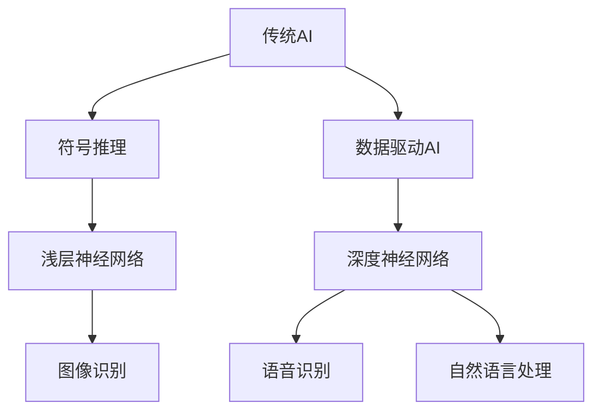

                 

关键词：人工智能、AI 2.0、技术发展、未来展望、深度学习、计算机图灵奖、李开复

人工智能（AI）作为21世纪最具变革性的技术之一，正以前所未有的速度发展。在《李开复：AI 2.0 时代的未来》一文中，我们将深入探讨AI 2.0时代的到来，以及其对各个领域和人类社会的深远影响。

> 摘要：本文将围绕AI 2.0时代的发展，详细阐述人工智能技术的核心概念、关键算法原理、数学模型与公式、项目实践、实际应用场景、未来应用展望、工具和资源推荐，以及面对的未来发展趋势和挑战。通过本文的阅读，读者将全面了解AI 2.0时代的现状与未来，从而为自身在人工智能领域的发展提供启示。

## 1. 背景介绍

### 1.1 人工智能的历史与发展

人工智能的概念最早可以追溯到20世纪50年代。当时，计算机科学刚刚起步，科学家们开始探讨如何让计算机具备人类智能的行为。在随后的几十年里，人工智能经历了多次起伏和变革。特别是深度学习算法的突破，使得人工智能在图像识别、语音识别、自然语言处理等领域取得了显著进展。

### 1.2 人工智能的现状

目前，人工智能已经在各个领域得到了广泛应用。例如，自动驾驶、智能客服、医疗诊断、金融风控等。随着技术的不断进步，人工智能的潜力正在被进一步挖掘，逐渐走向成熟。

### 1.3 AI 2.0时代的到来

AI 2.0时代是指人工智能从传统的符号推理模式向基于数据和深度学习的新模式转变。这一转变标志着人工智能技术进入了一个全新的阶段，将带来更多的机遇和挑战。

## 2. 核心概念与联系

### 2.1 人工智能的定义与分类

人工智能是指计算机系统模拟人类智能的行为，实现感知、学习、推理、决策等功能。根据实现方式的不同，人工智能可以分为基于符号推理的传统AI和基于数据的深度学习AI。

### 2.2 深度学习与神经网络

深度学习是人工智能的一种重要分支，通过多层神经网络实现自动特征提取和学习。深度学习在图像识别、语音识别、自然语言处理等领域取得了巨大成功。

### 2.3 Mermaid 流程图



## 3. 核心算法原理 & 具体操作步骤

### 3.1 算法原理概述

深度学习算法的核心是多层神经网络，通过反向传播算法实现参数的优化。神经网络由输入层、隐藏层和输出层组成，各层之间通过权重连接。

### 3.2 算法步骤详解

1. 数据预处理：对原始数据进行归一化、去噪等处理，以便于模型训练。
2. 神经网络构建：设计网络结构，包括层数、每层的神经元数量等。
3. 模型训练：使用反向传播算法，通过梯度下降等方法优化模型参数。
4. 模型评估：使用测试数据集评估模型性能，调整参数以达到最佳效果。
5. 模型应用：将训练好的模型应用于实际场景，如图像识别、语音识别等。

### 3.3 算法优缺点

优点：具有强大的泛化能力，可以处理复杂的任务，适应不同的领域。

缺点：训练过程需要大量数据和计算资源，对硬件要求较高。

### 3.4 算法应用领域

深度学习算法在图像识别、语音识别、自然语言处理、推荐系统等领域得到了广泛应用。

## 4. 数学模型和公式 & 详细讲解 & 举例说明

### 4.1 数学模型构建

深度学习中的数学模型主要包括损失函数、优化算法等。

损失函数用于衡量模型预测值与真实值之间的差距，常用的损失函数有均方误差（MSE）、交叉熵损失等。

优化算法用于更新模型参数，以减少损失函数的值。常用的优化算法有梯度下降、Adam优化器等。

### 4.2 公式推导过程

以均方误差损失函数为例，其公式推导如下：

假设有一个输入向量 $x$ 和对应的真实标签 $y$，模型的预测输出为 $\hat{y}$，则均方误差损失函数可以表示为：

$$
L = \frac{1}{2} \sum_{i=1}^{n} (\hat{y}_i - y_i)^2
$$

其中，$n$ 表示样本数量。

### 4.3 案例分析与讲解

以图像识别任务为例，使用卷积神经网络（CNN）进行图像分类。

首先，对图像进行预处理，如缩放、裁剪、归一化等。

然后，构建卷积神经网络模型，包括卷积层、池化层、全连接层等。

接下来，使用训练数据集对模型进行训练，通过反向传播算法优化模型参数。

最后，使用测试数据集评估模型性能，调整模型结构和参数，以达到最佳效果。

## 5. 项目实践：代码实例和详细解释说明

### 5.1 开发环境搭建

在Python环境中，使用TensorFlow作为深度学习框架。

### 5.2 源代码详细实现

以下是一个简单的CNN模型实现：

```python
import tensorflow as tf

# 构建模型
model = tf.keras.Sequential([
    tf.keras.layers.Conv2D(32, (3, 3), activation='relu', input_shape=(28, 28, 1)),
    tf.keras.layers.MaxPooling2D((2, 2)),
    tf.keras.layers.Flatten(),
    tf.keras.layers.Dense(128, activation='relu'),
    tf.keras.layers.Dense(10, activation='softmax')
])

# 编译模型
model.compile(optimizer='adam', loss='categorical_crossentropy', metrics=['accuracy'])

# 训练模型
model.fit(train_images, train_labels, epochs=5, validation_data=(test_images, test_labels))

# 评估模型
test_loss, test_acc = model.evaluate(test_images, test_labels)
print('Test accuracy:', test_acc)
```

### 5.3 代码解读与分析

该代码实现了使用卷积神经网络进行手写数字识别的任务。首先，使用TensorFlow构建模型，包括卷积层、池化层、全连接层等。然后，编译模型，设置优化器和损失函数。接下来，使用训练数据集训练模型，并使用测试数据集评估模型性能。

## 6. 实际应用场景

### 6.1 自动驾驶

自动驾驶是AI 2.0时代最具代表性的应用场景之一。通过深度学习技术，自动驾驶车辆可以实现实时感知环境、做出决策和控制。

### 6.2 智能客服

智能客服利用自然语言处理技术，实现与用户的实时交互，提供高效、个性化的服务。

### 6.3 医疗诊断

深度学习在医疗诊断领域的应用越来越广泛，如癌症检测、糖尿病筛查等。

### 6.4 金融风控

金融风控利用人工智能技术，实现风险评估、欺诈检测等，提高金融行业的风险控制能力。

## 7. 未来应用展望

随着人工智能技术的不断发展，未来将会有更多的领域得到AI的应用。例如，教育、医疗、能源、环境保护等。

## 8. 工具和资源推荐

### 8.1 学习资源推荐

- 《深度学习》（Goodfellow, Bengio, Courville）
- 《Python深度学习》（François Chollet）
- 《人工智能：一种现代的方法》（Stuart Russell, Peter Norvig）

### 8.2 开发工具推荐

- TensorFlow
- PyTorch
- Keras

### 8.3 相关论文推荐

- “Deep Learning: A Brief History of the Past and Future of AI”
- “A Theoretically Grounded Application of Dropout in Recurrent Neural Networks”
- “Generative Adversarial Nets”

## 9. 总结：未来发展趋势与挑战

### 9.1 研究成果总结

AI 2.0时代的发展取得了显著的成果，深度学习算法在各个领域取得了突破性进展。

### 9.2 未来发展趋势

随着计算能力的提升和大数据的广泛应用，人工智能技术将会在更多的领域得到应用。

### 9.3 面临的挑战

数据隐私、算法透明度、人工智能伦理等问题需要引起足够的重视。

### 9.4 研究展望

未来，人工智能技术的发展将会更加注重算法的优化、应用的拓展和跨学科的融合。

## 10. 附录：常见问题与解答

### 10.1 人工智能是什么？

人工智能是指计算机系统模拟人类智能的行为，实现感知、学习、推理、决策等功能。

### 10.2 深度学习和神经网络有什么区别？

深度学习是神经网络的一种，是神经网络在深度上的扩展。神经网络是一种用于模拟人脑神经网络结构和功能的计算模型，而深度学习通过增加网络的深度来实现更复杂的特征提取和学习能力。

### 10.3 人工智能有哪些应用领域？

人工智能在图像识别、语音识别、自然语言处理、自动驾驶、智能客服、医疗诊断、金融风控等领域得到了广泛应用。

---

作者：禅与计算机程序设计艺术 / Zen and the Art of Computer Programming
```

