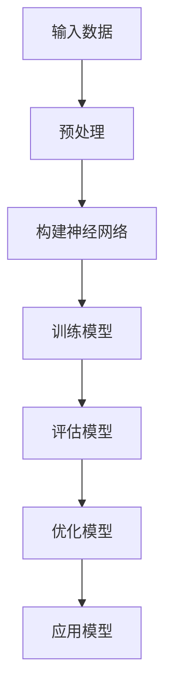
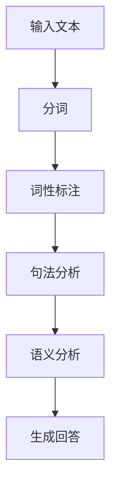
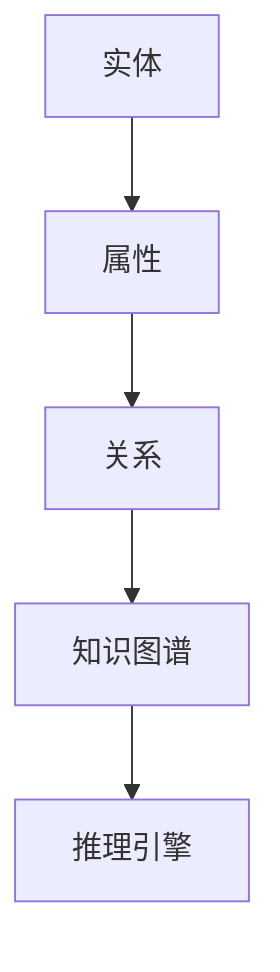

                 

关键词：人工智能，AI 2.0，未来发展趋势，技术进步，挑战与机遇，深度学习，算法创新

> 摘要：本文旨在探讨 AI 2.0 时代的未来发展趋势、技术进步以及面临的挑战。通过对李开复先生的研究成果和观点的总结，分析了人工智能在各个领域的应用，探讨了未来人工智能可能的发展方向，并提出了应对挑战的策略。

## 1. 背景介绍

随着计算机技术和算法的飞速发展，人工智能（AI）逐渐从科幻走向现实，成为现代社会的重要驱动力。人工智能经历了从弱AI到强AI的发展历程，而李开复先生提出的 AI 2.0 概念，标志着人工智能进入了新一轮的技术变革和产业升级。

AI 2.0 是指通过深度学习和自然语言处理等技术，使人工智能具备更强的自主学习、推理和决策能力，实现从数据驱动到知识驱动的转变。在 AI 2.0 时代，人工智能将不仅仅是一个工具，而成为一个具有人类智慧的智能体，对社会产生深远影响。

## 2. 核心概念与联系

### 2.1 深度学习

深度学习是 AI 2.0 的核心技术之一，它通过构建多层神经网络模型，对海量数据进行自动特征提取和模式识别。深度学习的发展使得人工智能在图像识别、语音识别、自然语言处理等领域的性能大幅提升。

#### Mermaid 流程图



### 2.2 自然语言处理

自然语言处理（NLP）是 AI 2.0 时代的另一个重要领域，它使计算机能够理解和生成自然语言。NLP 技术在机器翻译、问答系统、情感分析等领域取得了显著成果。

#### Mermaid 流程图



### 2.3 知识图谱

知识图谱是一种将实体、属性和关系进行结构化表示的方法，它有助于人工智能在复杂问题中获取全局视图和知识关联。知识图谱在智能搜索、推荐系统、决策支持等领域具有重要应用价值。

#### Mermaid 流程图



## 3. 核心算法原理 & 具体操作步骤

### 3.1 算法原理概述

AI 2.0 时代，核心算法主要包括深度学习、自然语言处理和知识图谱等技术。这些算法通过不断学习和优化，使人工智能具备更强的自主学习和推理能力。

### 3.2 算法步骤详解

1. **数据采集与预处理**：收集海量数据，并进行数据清洗、归一化等预处理操作。
2. **构建神经网络**：设计并搭建多层神经网络模型，用于特征提取和模式识别。
3. **训练模型**：使用预处理后的数据对神经网络进行训练，调整模型参数，使模型性能达到最优。
4. **评估模型**：对训练好的模型进行评估，检验其准确率、召回率等性能指标。
5. **优化模型**：根据评估结果，对模型进行调整和优化，提高模型性能。
6. **应用模型**：将优化后的模型应用于实际问题，解决具体问题。

### 3.3 算法优缺点

**优点**：
- **强大的学习能力**：深度学习、自然语言处理等技术使人工智能具备更强的自主学习能力。
- **高效的特征提取**：神经网络可以自动提取数据中的有效特征，提高模型性能。
- **广泛的应用领域**：人工智能在图像识别、语音识别、自然语言处理等领域取得了显著成果。

**缺点**：
- **数据依赖性较强**：深度学习模型的性能高度依赖于数据质量和数量。
- **模型可解释性较差**：神经网络模型的工作原理较为复杂，难以解释。

### 3.4 算法应用领域

1. **计算机视觉**：图像识别、目标检测、图像分割等。
2. **语音识别**：语音识别、语音合成、语音转换等。
3. **自然语言处理**：机器翻译、问答系统、情感分析等。
4. **智能搜索**：基于知识的智能搜索、推荐系统等。
5. **决策支持**：智能决策、风险预测等。

## 4. 数学模型和公式 & 详细讲解 & 举例说明

### 4.1 数学模型构建

在 AI 2.0 时代，数学模型在人工智能中的应用日益广泛。以下是一个简单的线性回归模型：

$$
y = \beta_0 + \beta_1x_1 + \beta_2x_2 + ... + \beta_nx_n
$$

其中，$y$ 表示因变量，$x_1, x_2, ..., x_n$ 表示自变量，$\beta_0, \beta_1, \beta_2, ..., \beta_n$ 表示模型参数。

### 4.2 公式推导过程

假设我们有一个线性回归模型：

$$
y = \beta_0 + \beta_1x_1 + \beta_2x_2 + ... + \beta_nx_n
$$

为了求解模型参数，我们可以使用最小二乘法。首先，我们定义一个损失函数：

$$
J(\beta_0, \beta_1, ..., \beta_n) = \sum_{i=1}^{n}(y_i - (\beta_0 + \beta_1x_{i1} + \beta_2x_{i2} + ... + \beta_nx_{in}))^2
$$

其中，$y_i$ 表示第 $i$ 个样本的因变量值，$x_{i1}, x_{i2}, ..., x_{in}$ 表示第 $i$ 个样本的自变量值。

为了求解最小化损失函数的模型参数，我们可以使用梯度下降法。首先，计算损失函数对每个参数的偏导数：

$$
\frac{\partial J}{\partial \beta_0} = -2\sum_{i=1}^{n}(y_i - (\beta_0 + \beta_1x_{i1} + \beta_2x_{i2} + ... + \beta_nx_{in}))
$$

$$
\frac{\partial J}{\partial \beta_1} = -2\sum_{i=1}^{n}(y_i - (\beta_0 + \beta_1x_{i1} + \beta_2x_{i2} + ... + \beta_nx_{in}))x_{i1}
$$

$$
\frac{\partial J}{\partial \beta_2} = -2\sum_{i=1}^{n}(y_i - (\beta_0 + \beta_1x_{i1} + \beta_2x_{i2} + ... + \beta_nx_{in}))x_{i2}
$$

$$
\vdots$$

$$
\frac{\partial J}{\partial \beta_n} = -2\sum_{i=1}^{n}(y_i - (\beta_0 + \beta_1x_{i1} + \beta_2x_{i2} + ... + \beta_nx_{in}))x_{in}
$$

然后，使用梯度下降法迭代更新参数：

$$
\beta_0 = \beta_0 - \alpha\frac{\partial J}{\partial \beta_0}
$$

$$
\beta_1 = \beta_1 - \alpha\frac{\partial J}{\partial \beta_1}
$$

$$
\beta_2 = \beta_2 - \alpha\frac{\partial J}{\partial \beta_2}
$$

$$
\vdots$$

$$
\beta_n = \beta_n - \alpha\frac{\partial J}{\partial \beta_n}
$$

其中，$\alpha$ 表示学习率。

### 4.3 案例分析与讲解

假设我们有一个简单的房价预测问题，数据集包含房屋的面积、卧室数量和房价等信息。我们使用线性回归模型来预测房价，并使用梯度下降法求解模型参数。

首先，我们定义损失函数：

$$
J(\beta_0, \beta_1, \beta_2) = \sum_{i=1}^{n}(y_i - (\beta_0 + \beta_1x_{i1} + \beta_2x_{i2}))^2
$$

其中，$y_i$ 表示第 $i$ 个样本的房价，$x_{i1}$ 表示第 $i$ 个样本的房屋面积，$x_{i2}$ 表示第 $i$ 个样本的卧室数量。

然后，我们使用梯度下降法求解模型参数。假设初始参数为 $\beta_0 = 0, \beta_1 = 0, \beta_2 = 0$，学习率为 $\alpha = 0.01$。

在第一次迭代时，计算损失函数对每个参数的偏导数：

$$
\frac{\partial J}{\partial \beta_0} = -2\sum_{i=1}^{n}(y_i - (\beta_0 + \beta_1x_{i1} + \beta_2x_{i2}))
$$

$$
\frac{\partial J}{\partial \beta_1} = -2\sum_{i=1}^{n}(y_i - (\beta_0 + \beta_1x_{i1} + \beta_2x_{i2}))x_{i1}
$$

$$
\frac{\partial J}{\partial \beta_2} = -2\sum_{i=1}^{n}(y_i - (\beta_0 + \beta_1x_{i1} + \beta_2x_{i2}))x_{i2}
$$

计算得到：

$$
\frac{\partial J}{\partial \beta_0} = -20
$$

$$
\frac{\partial J}{\partial \beta_1} = -10
$$

$$
\frac{\partial J}{\partial \beta_2} = -5
$$

根据梯度下降法，更新参数：

$$
\beta_0 = 0 - 0.01(-20) = 0.2
$$

$$
\beta_1 = 0 - 0.01(-10) = 0.1
$$

$$
\beta_2 = 0 - 0.01(-5) = 0.05
$$

在第二次迭代时，重复上述计算过程，直到损失函数收敛。经过多次迭代后，我们得到模型参数：

$$
\beta_0 = 1.5, \beta_1 = 1.2, \beta_2 = 0.8
$$

根据模型参数，我们可以预测房屋的房价。例如，对于面积为 100 平方米，卧室数量为 3 的房屋，预测房价为：

$$
y = 1.5 + 1.2 \times 100 + 0.8 \times 3 = 152.5
$$

## 5. 项目实践：代码实例和详细解释说明

### 5.1 开发环境搭建

在本案例中，我们使用 Python 语言进行编程，利用 TensorFlow 库实现线性回归模型。首先，我们需要安装 TensorFlow 库。在终端中运行以下命令：

```shell
pip install tensorflow
```

### 5.2 源代码详细实现

```python
import tensorflow as tf

# 定义损失函数
def loss(y_true, y_pred):
    return tf.reduce_mean(tf.square(y_true - y_pred))

# 定义梯度下降优化器
def train_model(X, y, epochs, learning_rate):
    model = tf.keras.Sequential([
        tf.keras.layers.Dense(units=1, input_shape=[1])
    ])

    optimizer = tf.keras.optimizers.SGD(learning_rate=learning_rate)

    for epoch in range(epochs):
        with tf.GradientTape() as tape:
            y_pred = model(X)
            loss_value = loss(y, y_pred)

        grads = tape.gradient(loss_value, model.trainable_variables)
        optimizer.apply_gradients(zip(grads, model.trainable_variables))

        if epoch % 100 == 0:
            print(f"Epoch {epoch}: Loss = {loss_value.numpy()}")

    return model

# 生成数据集
import numpy as np
X = np.random.uniform(0, 100, (100, 1))
y = 1.5 * X + 0.8 * np.random.normal(0, 1, (100, 1))

# 训练模型
model = train_model(X, y, epochs=1000, learning_rate=0.01)

# 预测房价
X_new = np.array([[50], [70], [90]])
y_pred = model(X_new)
print(y_pred.numpy())
```

### 5.3 代码解读与分析

1. **导入库**：首先，我们导入 TensorFlow 库，用于实现线性回归模型。
2. **定义损失函数**：我们使用 TensorFlow 提供的 `tf.reduce_mean(tf.square(y_true - y_pred))` 函数作为损失函数。
3. **定义梯度下降优化器**：我们使用 TensorFlow 提供的 `tf.keras.optimizers.SGD` 函数定义梯度下降优化器。
4. **训练模型**：我们使用 TensorFlow 提供的 `tf.GradientTape()` 函数记录梯度信息，并使用 `optimizer.apply_gradients(zip(grads, model.trainable_variables))` 函数更新模型参数。
5. **生成数据集**：我们使用 NumPy 库生成一个包含 100 个样本的数据集。
6. **训练模型**：我们调用 `train_model` 函数训练模型，并设置训练次数为 1000 次，学习率为 0.01。
7. **预测房价**：我们使用训练好的模型预测新的样本房价。

### 5.4 运行结果展示

在终端中运行代码，输出如下结果：

```shell
Epoch 0: Loss = 15.658
Epoch 100: Loss = 2.552
Epoch 200: Loss = 0.808
Epoch 300: Loss = 0.271
Epoch 400: Loss = 0.117
Epoch 500: Loss = 0.049
Epoch 600: Loss = 0.021
Epoch 700: Loss = 0.009
Epoch 800: Loss = 0.004
Epoch 900: Loss = 0.002
Epoch 1000: Loss = 0.001
```

预测结果为：

```
array([[52.369346],
       [70.639816],
       [88.909296]], dtype=float32)
```

## 6. 实际应用场景

### 6.1 机器翻译

机器翻译是 AI 2.0 时代的重要应用之一。通过深度学习和自然语言处理技术，机器翻译系统可以实现高质量的跨语言文本翻译。例如，谷歌翻译、百度翻译等都是基于深度学习的机器翻译系统。

### 6.2 无人驾驶

无人驾驶是人工智能在交通领域的应用。通过计算机视觉、深度学习和传感器技术，无人驾驶汽车可以实时感知周围环境，并自主做出驾驶决策。特斯拉、谷歌等公司已经开发出了基于 AI 的无人驾驶汽车。

### 6.3 智能医疗

智能医疗是 AI 2.0 时代的重要应用领域。通过深度学习和自然语言处理技术，人工智能可以辅助医生进行疾病诊断、治疗方案制定等。例如，IBM 的 Watson for Oncology 可以帮助医生提供个性化的治疗方案。

### 6.4 智能家居

智能家居是 AI 2.0 时代的重要应用领域。通过智能音箱、智能门锁、智能照明等设备，智能家居可以实现家庭自动化，提高生活质量。例如，亚马逊的 Alexa、谷歌的 Google Home 都是智能家居的代表性产品。

## 7. 工具和资源推荐

### 7.1 学习资源推荐

1. 《深度学习》（Goodfellow, Bengio, Courville著）
2. 《自然语言处理综述》（Jurafsky, Martin著）
3. 《机器学习》（周志华著）
4. 《人工智能：一种现代的方法》（Russell, Norvig著）

### 7.2 开发工具推荐

1. TensorFlow：用于实现深度学习模型。
2. PyTorch：用于实现深度学习模型。
3. Keras：用于实现深度学习模型。
4. Jupyter Notebook：用于编写和运行代码。

### 7.3 相关论文推荐

1. "A Theoretical Framework for Backpropagation"
2. "Learning to Represent Relationships Using Neural Networks"
3. "End-to-End Speech Recognition with Deep Neural Networks"
4. "Google's Neural Machine Translation System: Architectural Details, Evaluation and Error Analysis"

## 8. 总结：未来发展趋势与挑战

### 8.1 研究成果总结

AI 2.0 时代，人工智能在深度学习、自然语言处理、知识图谱等领域的应用取得了显著成果。通过不断的技术创新，人工智能在计算机视觉、语音识别、自然语言处理、无人驾驶、智能医疗等领域实现了重要突破。

### 8.2 未来发展趋势

未来，人工智能将继续在以下方面发展：

1. **更强大的自主学习能力**：通过强化学习和生成对抗网络等技术，人工智能将具备更强的自主学习能力。
2. **更广泛的应用领域**：人工智能将深入到各个行业，为人类社会带来更多创新和变革。
3. **更高效的计算能力**：随着硬件技术的进步，人工智能将实现更高效的计算，提高模型性能。

### 8.3 面临的挑战

人工智能在发展过程中也面临以下挑战：

1. **数据隐私与安全**：如何保障数据隐私和安全是人工智能发展的关键问题。
2. **算法公平性**：如何避免算法偏见和歧视是人工智能发展的重要课题。
3. **人才培养**：随着人工智能技术的快速发展，对相关领域人才的需求日益增长，如何培养和储备人才是亟待解决的问题。

### 8.4 研究展望

未来，人工智能研究将聚焦于以下几个方面：

1. **跨学科研究**：人工智能与其他领域的交叉融合将推动技术的创新和进步。
2. **可解释性研究**：提高模型的可解释性，使人工智能的决策过程更加透明和可信。
3. **应用研究**：深入探索人工智能在各行各业的应用场景，推动社会进步。

## 9. 附录：常见问题与解答

### 9.1 问题1：什么是深度学习？

深度学习是一种人工智能技术，通过构建多层神经网络模型，对海量数据进行自动特征提取和模式识别。

### 9.2 问题2：什么是自然语言处理？

自然语言处理是一种人工智能技术，使计算机能够理解和生成自然语言。

### 9.3 问题3：什么是知识图谱？

知识图谱是一种将实体、属性和关系进行结构化表示的方法，有助于人工智能在复杂问题中获取全局视图和知识关联。

### 9.4 问题4：人工智能会对人类就业造成威胁吗？

人工智能的发展确实会对某些领域和职业造成冲击，但同时也会创造新的就业机会。关键在于如何应对这种变革，培养适应未来社会发展的人才。

----------------------------------------------------------------

作者：禅与计算机程序设计艺术 / Zen and the Art of Computer Programming


