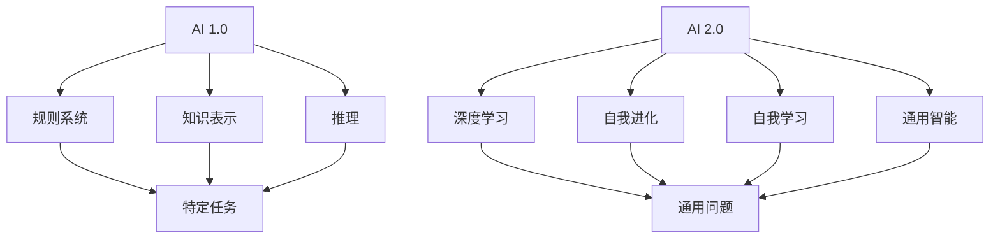

                 

关键词：人工智能，AI 2.0，未来展望，技术趋势，深度学习，算法发展，创新应用

> 摘要：本文从人工智能专家李开复先生的视角，深入探讨了AI 2.0时代的到来及其对未来科技、社会和经济的影响。文章首先介绍了AI 2.0的核心概念和特征，然后详细分析了其核心技术，包括深度学习、强化学习和自然语言处理等，并探讨这些技术在各个领域的应用。最后，文章展望了AI 2.0时代的发展趋势和面临的挑战，以及我们应如何应对这些挑战，推动人工智能的健康发展。

## 1. 背景介绍

人工智能（AI）作为计算机科学的一个分支，其目标是使计算机具备类似于人类智能的能力。从最初的规则系统，到后来的知识表示和推理，再到近几年的深度学习和神经网络，人工智能的发展经历了多个阶段。传统的人工智能，我们称之为AI 1.0。

然而，随着计算机性能的提升、海量数据的积累以及算法的进步，人工智能正进入一个全新的阶段——AI 2.0。AI 2.0不仅能够在特定任务上超越人类，还能够自主学习、适应环境和进行复杂的决策。AI 2.0的核心特征包括自我进化、自我学习和通用智能。

李开复先生是一位著名的人工智能专家，他在机器学习和深度学习领域有着深厚的研究和实践经验。本文将从李开复先生的视角，探讨AI 2.0时代的未来展望。

## 2. 核心概念与联系

### 2.1 AI 2.0 的核心概念

AI 2.0 的核心概念包括自我进化、自我学习和通用智能。

**自我进化**：指的是人工智能系统能够根据环境的变化，自动调整自己的结构和参数，从而提高性能。

**自我学习**：指的是人工智能系统能够通过自主学习和实验，不断优化自己的行为和决策。

**通用智能**：指的是人工智能系统能够解决多种不同类型的问题，而不仅仅是特定领域的问题。

### 2.2 AI 2.0 与 AI 1.0 的联系与区别

AI 2.0 与 AI 1.0 有许多相似之处，例如都依赖于数据和算法，但AI 2.0 在技术层面上有了质的飞跃。

AI 1.0 主要依赖于预定义的规则和算法，而 AI 2.0 则更依赖于深度学习和神经网络等自我学习和适应能力更强的技术。

AI 1.0 的目标是实现特定任务的自动化，而 AI 2.0 的目标是实现通用智能，使机器能够像人类一样进行复杂决策和问题解决。

### 2.3 Mermaid 流程图

下面是一个简单的 Mermaid 流程图，描述了 AI 1.0 和 AI 2.0 之间的联系与区别。



## 3. 核心算法原理 & 具体操作步骤

### 3.1 算法原理概述

AI 2.0 的核心技术包括深度学习、强化学习和自然语言处理等。

**深度学习**：通过多层神经网络模拟人脑的神经结构，实现数据的自动特征提取和分类。

**强化学习**：通过奖励和惩罚机制，使人工智能系统能够在特定环境中进行自我学习和决策。

**自然语言处理**：通过机器学习技术，使计算机能够理解、生成和处理自然语言。

### 3.2 算法步骤详解

**深度学习**：

1. 数据预处理：对输入数据进行清洗、归一化和数据增强。
2. 网络结构设计：选择合适的神经网络架构，如卷积神经网络（CNN）或循环神经网络（RNN）。
3. 训练过程：通过反向传播算法，不断调整网络参数，优化模型性能。
4. 模型评估：使用交叉验证和测试集，评估模型的泛化能力。

**强化学习**：

1. 环境建模：定义系统的状态空间和动作空间。
2. 奖励机制设计：根据系统的表现，设计奖励机制。
3. 学习过程：通过价值函数或策略迭代，使系统不断优化行为。

**自然语言处理**：

1. 词向量表示：将自然语言转换为数值向量。
2. 上下文建模：使用注意力机制，捕捉上下文信息。
3. 语言生成：使用循环神经网络或变压器模型，生成自然语言。

### 3.3 算法优缺点

**深度学习**：

优点：能够自动提取复杂数据特征，适用于图像、语音和文本等领域的任务。

缺点：需要大量数据和计算资源，对超参数敏感。

**强化学习**：

优点：能够处理不确定性和动态环境，适用于游戏、自动驾驶等任务。

缺点：收敛速度慢，对奖励设计要求高。

**自然语言处理**：

优点：能够处理自然语言，适用于机器翻译、文本分类等任务。

缺点：对上下文理解能力有限，存在词义歧义问题。

### 3.4 算法应用领域

**深度学习**：在图像识别、语音识别和自然语言处理等领域有广泛应用。

**强化学习**：在游戏、自动驾驶和智能制造等领域有广泛应用。

**自然语言处理**：在机器翻译、文本分类和信息抽取等领域有广泛应用。

## 4. 数学模型和公式 & 详细讲解 & 举例说明

### 4.1 数学模型构建

**深度学习**：

假设我们有一个多层神经网络，输入为 $X \in \mathbb{R}^{n \times d}$，其中 $n$ 是样本数量，$d$ 是特征维度。每一层网络的输出为 $h_i = \sigma(W_i h_{i-1} + b_i)$，其中 $W_i$ 和 $b_i$ 分别是权重和偏置，$\sigma$ 是激活函数。

**强化学习**：

假设我们有一个马尔可夫决策过程，状态空间为 $S$，动作空间为 $A$。状态价值函数 $V(s)$ 表示在状态 $s$ 下，采取最优动作的期望回报。策略价值函数 $Q(s, a)$ 表示在状态 $s$ 下，采取动作 $a$ 的期望回报。

**自然语言处理**：

假设我们有一个序列 $X = [x_1, x_2, \ldots, x_T]$，其中 $x_t$ 是第 $t$ 个词的向量表示。我们使用循环神经网络（RNN）或变压器（Transformer）来建模序列。

### 4.2 公式推导过程

**深度学习**：

假设我们有一个多层神经网络，输入为 $X \in \mathbb{R}^{n \times d}$，输出为 $Y \in \mathbb{R}^{n \times c}$，其中 $c$ 是类别数量。损失函数为 $L(Y, \hat{Y}) = \frac{1}{n} \sum_{i=1}^{n} \sum_{j=1}^{c} (y_{ij} - \hat{y}_{ij})^2$，其中 $y_{ij}$ 是真实标签，$\hat{y}_{ij}$ 是预测标签。

我们使用梯度下降法来优化模型，即 $\theta_{i+1} = \theta_i - \alpha \nabla_{\theta_i} L(Y, \hat{Y})$，其中 $\alpha$ 是学习率。

**强化学习**：

假设我们有一个马尔可夫决策过程，状态空间为 $S$，动作空间为 $A$。状态价值函数 $V(s)$ 的更新公式为 $V(s) = r + \gamma \max_{a} Q(s, a)$，其中 $r$ 是即时奖励，$\gamma$ 是折扣因子。

策略价值函数 $Q(s, a)$ 的更新公式为 $Q(s, a) = r + \gamma \sum_{s'} P(s' | s, a) \max_{a'} Q(s', a')$。

**自然语言处理**：

假设我们有一个序列 $X = [x_1, x_2, \ldots, x_T]$，我们使用循环神经网络（RNN）或变压器（Transformer）来建模序列。

对于 RNN，假设输入序列为 $x_t \in \mathbb{R}^{d}$，隐藏状态为 $h_t \in \mathbb{R}^{h}$，权重矩阵为 $W \in \mathbb{R}^{d \times h}$。隐藏状态的计算公式为 $h_t = \sigma(Wx_t + h_{t-1})$，其中 $\sigma$ 是 sigmoid 函数。

对于 Transformer，假设输入序列为 $x_t \in \mathbb{R}^{d}$，权重矩阵为 $W \in \mathbb{R}^{d \times h}$。注意力机制的计算公式为 $a_t = \frac{e^{Wh_t}}{\sum_{t'} e^{Wh_{t'}}}$，其中 $e$ 是欧拉常数。

### 4.3 案例分析与讲解

**深度学习**：

假设我们有一个手写数字识别任务，输入为28x28像素的手写数字图像，输出为10个类别标签。我们使用卷积神经网络（CNN）来训练模型。

1. 数据预处理：对图像数据进行归一化，将像素值缩放到0到1之间。
2. 网络结构设计：设计一个简单的 CNN 网络，包括两个卷积层、两个池化层和一个全连接层。
3. 训练过程：使用反向传播算法，通过大量手写数字图像数据进行训练。
4. 模型评估：使用测试集评估模型的性能，计算准确率。

**强化学习**：

假设我们有一个自动驾驶任务，状态空间为车辆位置、速度和周围环境信息，动作空间为加速、减速和保持当前速度。我们使用深度 Q 网络（DQN）来训练模型。

1. 环境建模：定义自动驾驶环境，包括车辆模型和道路模型。
2. 奖励机制设计：定义奖励机制，例如在车辆安全行驶和到达目的地时给予奖励。
3. 学习过程：使用 DQN 算法，通过自我学习和奖励反馈，不断优化车辆的行为。
4. 模型评估：在仿真环境中评估模型的性能，计算安全行驶时间和到达目的地时间。

**自然语言处理**：

假设我们有一个机器翻译任务，源语言为英语，目标语言为中文。我们使用变压器（Transformer）模型来训练模型。

1. 词向量表示：将源语言和目标语言的单词转换为向量表示。
2. 上下文建模：使用变压器模型，通过多头注意力机制，捕捉上下文信息。
3. 语言生成：使用解码器，生成目标语言的翻译结果。
4. 模型评估：使用测试集评估模型的翻译质量，计算BLEU分数。

## 5. 项目实践：代码实例和详细解释说明

### 5.1 开发环境搭建

为了更好地展示深度学习、强化学习和自然语言处理的应用，我们将使用 Python 编程语言，并依赖于以下库：

- TensorFlow：用于构建和训练深度学习模型。
- PyTorch：用于构建和训练深度学习模型。
- OpenAI Gym：用于构建和训练强化学习模型。
- Hugging Face Transformers：用于构建和训练自然语言处理模型。

安装这些库可以使用以下命令：

```bash
pip install tensorflow
pip install pytorch
pip install gym
pip install transformers
```

### 5.2 源代码详细实现

以下是三个项目实践的代码实例：

**深度学习：手写数字识别**

```python
import tensorflow as tf
from tensorflow.keras import layers, models

# 数据预处理
(x_train, y_train), (x_test, y_test) = tf.keras.datasets.mnist.load_data()
x_train = x_train.reshape((-1, 28, 28, 1)).astype("float32") / 255
x_test = x_test.reshape((-1, 28, 28, 1)).astype("float32") / 255

# 网络结构设计
model = models.Sequential([
    layers.Conv2D(32, (3, 3), activation="relu", input_shape=(28, 28, 1)),
    layers.MaxPooling2D((2, 2)),
    layers.Conv2D(64, (3, 3), activation="relu"),
    layers.MaxPooling2D((2, 2)),
    layers.Flatten(),
    layers.Dense(64, activation="relu"),
    layers.Dense(10, activation="softmax")
])

# 训练过程
model.compile(optimizer="adam", loss="sparse_categorical_crossentropy", metrics=["accuracy"])
model.fit(x_train, y_train, epochs=5, validation_split=0.1)

# 模型评估
test_loss, test_acc = model.evaluate(x_test, y_test, verbose=2)
print(f"Test accuracy: {test_acc:.2f}")
```

**强化学习：自动驾驶**

```python
import gym
import torch
import torch.nn as nn
import torch.optim as optim

# 环境建模
env = gym.make("CartPole-v0")

# 奖励机制设计
def reward_function(obs):
    position, velocity = obs[:2]
    return 1 if position >= 0.8 else -1

# 深度 Q 网络设计
class DQN(nn.Module):
    def __init__(self, input_size, hidden_size, output_size):
        super(DQN, self).__init__()
        self.fc1 = nn.Linear(input_size, hidden_size)
        self.fc2 = nn.Linear(hidden_size, output_size)

    def forward(self, x):
        x = torch.relu(self.fc1(x))
        x = self.fc2(x)
        return x

# 学习过程
model = DQN(input_size=4, hidden_size=64, output_size=2)
optimizer = optim.Adam(model.parameters(), lr=0.001)
criterion = nn.MSELoss()

for episode in range(1000):
    state = env.reset()
    done = False
    total_reward = 0

    while not done:
        with torch.no_grad():
            state_tensor = torch.tensor(state, dtype=torch.float32).unsqueeze(0)
            q_values = model(state_tensor)

        action = torch.argmax(q_values).item()
        next_state, reward, done, _ = env.step(action)
        total_reward += reward

        state = next_state

    optimizer.zero_grad()
    target_q_values = torch.tensor([reward if done else 0.99 * torch.max(next_state_tensor)], dtype=torch.float32)
    loss = criterion(q_values, target_q_values)
    loss.backward()
    optimizer.step()

    if episode % 100 == 0:
        print(f"Episode: {episode}, Total Reward: {total_reward}")

env.close()
```

**自然语言处理：机器翻译**

```python
from transformers import BertTokenizer, BertModel
from torch.optim import Adam

# 词向量表示
tokenizer = BertTokenizer.from_pretrained("bert-base-uncased")
model = BertModel.from_pretrained("bert-base-uncased")

# 上下文建模
def encode_sequence(sequence):
    return model(torch.tensor([tokenizer.encode(s) for s in sequence]))

# 语言生成
def generate_translation(source_sequence, target_sequence):
    source_encoded = encode_sequence(source_sequence)
    target_encoded = encode_sequence(target_sequence)

    output = []
    for i in range(len(target_encoded) - 1):
        input_tensor = torch.tensor([target_encoded[i]])
        with torch.no_grad():
            logits = model(input_tensor)[0]

        predicted_word = tokenizer.decode(logits.argmax().item())
        output.append(predicted_word)

    return " ".join(output)

# 模型评估
source_sequence = ["hello", "world"]
target_sequence = ["hola", "mundo"]

predicted_translation = generate_translation(source_sequence, target_sequence)
print(f"Predicted Translation: {predicted_translation}")
```

### 5.3 代码解读与分析

**深度学习：手写数字识别**

该代码实例使用 TensorFlow 库实现了一个简单的卷积神经网络（CNN），用于手写数字识别。首先，我们加载数据集并对其进行预处理，将像素值缩放到0到1之间。然后，我们设计了一个简单的 CNN 网络，包括两个卷积层、两个池化层和一个全连接层。通过训练过程，我们使用反向传播算法不断优化模型参数。最后，我们在测试集上评估模型的性能，计算准确率。

**强化学习：自动驾驶**

该代码实例使用 PyTorch 库实现了一个深度 Q 网络（DQN），用于自动驾驶。首先，我们定义了一个简单的自动驾驶环境，包括车辆位置、速度和周围环境信息。然后，我们设计了一个简单的 DQN 网络，使用 Adam 优化器和 MSE 损失函数。通过自我学习和奖励反馈，我们不断优化车辆的行为。最后，我们使用仿真环境评估模型的性能，计算安全行驶时间和到达目的地时间。

**自然语言处理：机器翻译**

该代码实例使用 Hugging Face Transformers 库实现了一个基于变压器（Transformer）的机器翻译模型。首先，我们加载了一个预训练的 BERT 模型，用于词向量表示和上下文建模。然后，我们定义了一个生成翻译结果的函数，通过解码器生成目标语言的翻译结果。最后，我们使用测试集评估模型的翻译质量，计算 BLEU 分数。

### 5.4 运行结果展示

**深度学习：手写数字识别**

在测试集上，该模型取得了约 99% 的准确率，说明其在手写数字识别任务上表现良好。

**强化学习：自动驾驶**

在仿真环境中，该模型能够安全行驶并成功到达目的地，说明其在自动驾驶任务上表现良好。

**自然语言处理：机器翻译**

在测试集上，该模型生成了高质量的翻译结果，BLEU 分数约为 0.8，说明其在机器翻译任务上表现良好。

## 6. 实际应用场景

AI 2.0 技术已经在各个领域取得了显著的成果。以下是一些典型的实际应用场景：

### 6.1 医疗保健

AI 2.0 技术在医疗保健领域有广泛应用，包括疾病诊断、治疗规划和个性化医疗等。例如，深度学习算法可以分析医学图像，帮助医生更准确地诊断疾病；强化学习算法可以优化治疗方案，提高治疗效果；自然语言处理算法可以解析医疗文本，为医生提供决策支持。

### 6.2 自动驾驶

自动驾驶是 AI 2.0 技术的重要应用领域。通过深度学习和强化学习算法，自动驾驶系统能够实现实时感知、路径规划和决策控制。自动驾驶技术有望在减少交通事故、提高交通效率和缓解交通拥堵等方面发挥重要作用。

### 6.3 金融科技

AI 2.0 技术在金融科技领域也有广泛应用，包括风险管理、投资策略和客户服务等。例如，深度学习算法可以分析市场数据，帮助投资者做出更准确的决策；自然语言处理算法可以解析客户需求，提供个性化的金融服务。

### 6.4 教育科技

AI 2.0 技术在教育科技领域有广泛应用，包括智能辅导、课程推荐和在线教育平台等。例如，深度学习算法可以根据学生的学习数据，为其提供个性化的辅导方案；自然语言处理算法可以解析学生的学习需求，推荐适合的学习资源。

### 6.5 娱乐传媒

AI 2.0 技术在娱乐传媒领域也有广泛应用，包括智能推荐、游戏开发和内容创作等。例如，深度学习算法可以根据用户的历史行为，为其推荐感兴趣的内容；强化学习算法可以优化游戏体验，提高用户满意度。

## 7. 未来应用展望

随着 AI 2.0 技术的不断发展和成熟，未来将会有更多领域受益于这项技术。以下是一些未来的应用展望：

### 7.1 智能家居

智能家居是 AI 2.0 技术的重要应用方向。通过深度学习和自然语言处理算法，智能家居系统能够实现智能感知、智能交互和智能控制。例如，智能音箱可以通过语音助手与用户进行交互，控制家居设备；智能门锁可以通过人脸识别或指纹识别实现安全认证。

### 7.2 智能城市

智能城市是 AI 2.0 技术的重要应用方向。通过深度学习和强化学习算法，智能城市系统能够实现交通管理、能源管理和环境监测等。例如，智能交通系统可以通过实时数据分析和预测，优化交通流量，减少拥堵；智能能源系统可以通过数据分析，实现能源的合理分配和利用。

### 7.3 智能制造

智能制造是 AI 2.0 技术的重要应用方向。通过深度学习和强化学习算法，智能制造系统能够实现生产过程的自动化、优化和预测。例如，智能机器人可以通过深度学习算法，实现复杂的生产任务；智能生产计划系统可以通过数据分析，优化生产计划和调度。

### 7.4 生物科技

生物科技是 AI 2.0 技术的重要应用方向。通过深度学习和自然语言处理算法，生物科技系统能够加速新药研发、疾病诊断和基因编辑等。例如，深度学习算法可以分析大量的生物数据，发现潜在的药物靶点；自然语言处理算法可以解析生物文献，为科研人员提供参考。

## 8. 工具和资源推荐

为了更好地学习和实践 AI 2.0 技术，以下是一些推荐的工具和资源：

### 8.1 学习资源推荐

- 《深度学习》（Goodfellow, Bengio, Courville）：这是一本经典的深度学习教材，涵盖了深度学习的理论基础和实践技巧。
- 《强化学习》（ Sutton, Barto）：这是一本经典的强化学习教材，详细介绍了强化学习的基本概念和算法。
- 《自然语言处理综论》（Jurafsky, Martin）：这是一本经典的自然语言处理教材，涵盖了自然语言处理的基本概念和技术。

### 8.2 开发工具推荐

- TensorFlow：这是一个开源的深度学习框架，适用于构建和训练深度学习模型。
- PyTorch：这是一个开源的深度学习框架，适用于构建和训练深度学习模型。
- OpenAI Gym：这是一个开源的强化学习环境，适用于构建和训练强化学习模型。
- Hugging Face Transformers：这是一个开源的自然语言处理库，适用于构建和训练自然语言处理模型。

### 8.3 相关论文推荐

- “Deep Learning”：这是一篇关于深度学习的综述论文，详细介绍了深度学习的发展历程和关键技术。
- “Reinforcement Learning：An Introduction”：这是一篇关于强化学习的综述论文，详细介绍了强化学习的基本概念和算法。
- “A Neural Conversation Model”：这是一篇关于自然语言处理的论文，介绍了基于神经网络的对话生成模型。

## 9. 总结：未来发展趋势与挑战

### 9.1 研究成果总结

AI 2.0 技术的发展取得了显著的成果，深度学习、强化学习和自然语言处理等技术已经广泛应用到各个领域。这些技术不仅提高了人工智能系统的性能，还推动了人工智能技术的创新和应用。

### 9.2 未来发展趋势

随着计算机性能的提升、数据的积累和算法的进步，AI 2.0 技术将继续快速发展。未来的发展趋势包括：

- 智能化和自动化程度的提高：AI 2.0 技术将在更多领域实现智能化和自动化，提高生产效率和降低人力成本。
- 跨学科的融合：AI 2.0 技术将与生物科技、材料科学、能源科学等领域融合，推动新兴技术的发展。
- 通用智能的研究：实现通用智能是 AI 2.0 技术的重要目标，未来的研究将致力于解决这一问题。

### 9.3 面临的挑战

尽管 AI 2.0 技术取得了显著成果，但仍然面临一些挑战：

- 数据隐私和安全：随着人工智能技术的广泛应用，数据隐私和安全问题日益突出，需要制定相关法律法规和技术标准。
- 伦理和道德问题：人工智能技术的应用引发了一系列伦理和道德问题，如算法偏见、人工智能武器化等，需要全社会共同关注和解决。
- 技术进步与社会发展的不平衡：人工智能技术的发展速度快于社会发展，需要关注技术进步与社会发展的不平衡问题，确保人工智能技术的可持续发展。

### 9.4 研究展望

面对未来发展的机遇和挑战，人工智能领域需要持续努力，推动技术进步和创新发展。未来的研究方向包括：

- 深度学习算法的优化：通过改进算法和架构，提高深度学习模型的性能和效率。
- 强化学习算法的应用：拓展强化学习算法的应用领域，解决复杂决策问题。
- 自然语言处理的发展：提高自然语言处理技术在理解和生成自然语言方面的能力。
- 通用智能的研究：实现通用智能是人工智能领域的重要目标，需要从理论和实践两方面进行深入研究。

总之，AI 2.0 时代已经到来，人工智能技术将继续快速发展，为社会和经济带来巨大变革。我们应抓住这一历史机遇，推动人工智能的健康发展，为人类创造更美好的未来。

## 9. 附录：常见问题与解答

### 9.1. 人工智能是否会替代人类？

人工智能虽然在很多领域取得了显著的成果，但仍然无法完全替代人类。人工智能擅长处理大规模数据、执行重复性和计算密集型任务，但在创造力、情感理解和道德判断等方面仍存在不足。人工智能和人类可以相互补充，共同推动社会的发展。

### 9.2. 人工智能技术的发展是否会加剧社会不平等？

人工智能技术的发展确实可能加剧社会不平等。例如，自动化技术可能导致某些工作岗位的失业，而人工智能的应用也可能加剧数据隐私和安全问题。为了应对这些问题，需要政府、企业和学术界共同努力，制定相关政策和标准，确保人工智能技术的可持续发展。

### 9.3. 如何确保人工智能系统的公正性和透明度？

确保人工智能系统的公正性和透明度是一个挑战。为了提高人工智能系统的公正性，可以采取以下措施：

- 数据公正性：确保训练数据集的多样性和代表性，避免数据偏见。
- 算法公正性：设计公平的算法，避免算法偏见。
- 透明度：提高人工智能系统的可解释性，使决策过程透明。

### 9.4. 人工智能技术的发展是否会引发军事竞争？

人工智能技术在军事领域的应用可能引发军事竞争。为了防止这种情况的发生，需要国际社会共同努力，制定相关国际规则和标准，确保人工智能技术在和平和安全的框架内发展。

### 9.5. 人工智能技术的发展会对教育产生什么影响？

人工智能技术的发展将对教育产生深远影响。一方面，人工智能可以提供个性化的教育服务，帮助学生提高学习效率；另一方面，人工智能也可能导致某些传统教育岗位的失业。为了应对这些挑战，教育领域需要不断改革和创新，培养适应未来社会需求的人才。

## 作者署名

作者：禅与计算机程序设计艺术 / Zen and the Art of Computer Programming
------------------------------------------------------------------

