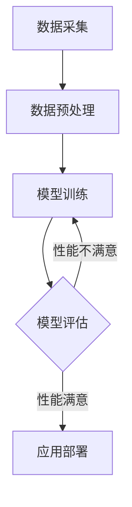

                 

关键词：人工智能，AI 2.0，未来展望，技术发展，深度学习，智能应用，伦理问题

人工智能（AI）作为当今科技领域的明星，正在深刻地改变我们的生活和工作方式。从简单的图像识别到复杂的自然语言处理，AI的应用已经遍及各个领域。李开复，作为世界著名的人工智能专家，一直关注并研究AI技术的发展。本文将结合李开复的观点，探讨AI 2.0时代的未来展望，包括核心概念、算法原理、数学模型、应用场景以及面临的挑战和机遇。

## 1. 背景介绍

自1956年达特茅斯会议以来，人工智能领域经历了多个阶段的发展。早期的AI以规则为基础，通过明确的指令来解决问题。随后，随着计算机性能的提升和算法的进步，机器学习，特别是深度学习，成为AI发展的主要驱动力。李开复指出，AI 1.0时代主要依赖于规则的制定和优化，而AI 2.0时代将更加注重数据驱动和模型自优化。

### AI 1.0 与 AI 2.0

AI 1.0时代的主要特点是规则的制定和优化，通过预设的规则和算法来解决问题。这种方法在特定领域内取得了显著成果，但存在灵活性差、扩展性受限等问题。AI 2.0时代则强调数据驱动和模型自优化，通过大量的数据和自我学习的能力来提升智能水平。这种转变使得AI能够处理更复杂的问题，并在更多领域实现应用。

### 当前 AI 发展状况

当前，AI技术在多个领域取得了显著进展。例如，在医疗领域，AI可以帮助医生进行疾病诊断、药物研发等；在金融领域，AI可以用于风险评估、欺诈检测等；在交通领域，自动驾驶和智能交通管理系统正逐渐普及。然而，AI的发展也面临着诸多挑战，如数据隐私、算法偏见、伦理问题等。

## 2. 核心概念与联系

### 数据驱动的核心

数据驱动是AI 2.0时代的核心概念之一。大量的数据不仅是AI模型训练的基础，也是AI持续学习和优化的关键。李开复指出，数据的质量和多样性直接影响AI的性能和效果。因此，如何在海量数据中提取有效信息、构建高质量的数据集，成为AI研究的重要方向。

### 模型自优化的原理

模型自优化是指AI系统通过自我调整和优化来提升性能。这一过程通常包括模型评估、错误分析、参数调整等步骤。李开复认为，模型自优化是AI技术实现突破的关键，它使得AI系统能够在复杂环境中自主学习和适应。

### Mermaid 流程图

以下是AI 2.0系统的基本流程：



## 3. 核心算法原理 & 具体操作步骤

### 3.1 算法原理概述

AI 2.0时代的核心算法主要包括深度学习、强化学习、迁移学习等。深度学习通过多层神经网络对数据进行建模，能够自动提取特征并实现复杂任务。强化学习通过奖励机制引导模型进行决策，适用于动态环境。迁移学习则利用已有模型的先验知识，在新任务上实现快速训练。

### 3.2 算法步骤详解

1. **数据采集**：收集大量数据，包括文本、图像、语音等。
2. **数据预处理**：对数据进行清洗、标准化等处理，以提高数据质量。
3. **模型选择**：根据任务需求选择合适的模型，如卷积神经网络（CNN）、循环神经网络（RNN）等。
4. **模型训练**：使用训练数据对模型进行训练，通过反向传播算法不断优化模型参数。
5. **模型评估**：使用测试数据评估模型性能，包括准确率、召回率等指标。
6. **模型优化**：根据评估结果对模型进行调整，以提高性能。
7. **应用部署**：将训练好的模型部署到实际应用中。

### 3.3 算法优缺点

**优点**：
- 高效性：深度学习等算法能够自动提取特征，减少人工干预。
- 灵活性：模型自优化能力使得AI系统能够在不同环境中适应和优化。

**缺点**：
- 需要大量数据：高质量的训练数据是AI模型性能的关键。
- 算法复杂性：深度学习等算法复杂度高，训练过程耗时较长。
- 算法透明度低：深度学习模型内部结构复杂，难以解释。

### 3.4 算法应用领域

AI 2.0算法在多个领域具有广泛应用，如：

- **医疗**：疾病诊断、药物研发、健康监测等。
- **金融**：风险评估、欺诈检测、投资策略等。
- **交通**：自动驾驶、智能交通管理、物流优化等。
- **教育**：个性化学习、智能评估、教育资源分配等。

## 4. 数学模型和公式 & 详细讲解 & 举例说明

### 4.1 数学模型构建

AI 2.0时代的数学模型主要包括神经网络、决策树、支持向量机等。以下是神经网络的基本公式：

$$
y = \sigma(\omega_1 \cdot x + b_1)
$$

其中，$y$为输出，$\sigma$为激活函数，$\omega_1$为权重，$x$为输入，$b_1$为偏置。

### 4.2 公式推导过程

神经网络的推导过程包括以下几个步骤：

1. **前向传播**：计算输入和权重的乘积，并加上偏置。
2. **激活函数**：使用激活函数对前向传播结果进行非线性变换。
3. **反向传播**：计算误差，并更新权重和偏置。

### 4.3 案例分析与讲解

以下是一个简单的神经网络模型，用于手写数字识别：

```latex
\begin{align*}
\text{输入层}: \quad & x = [x_1, x_2, x_3] \\
\text{隐藏层}: \quad & h = \sigma(\omega_1 \cdot x + b_1) \\
\text{输出层}: \quad & y = \sigma(\omega_2 \cdot h + b_2)
\end{align*}
```

该模型通过两个隐藏层对输入数据进行特征提取，并最终输出数字识别结果。

## 5. 项目实践：代码实例和详细解释说明

### 5.1 开发环境搭建

首先，我们需要搭建一个Python开发环境，安装必要的库，如TensorFlow、Keras等。

### 5.2 源代码详细实现

以下是一个使用TensorFlow实现的手写数字识别的简单示例：

```python
import tensorflow as tf
from tensorflow.keras.datasets import mnist
from tensorflow.keras.models import Sequential
from tensorflow.keras.layers import Dense, Flatten

# 加载MNIST数据集
(x_train, y_train), (x_test, y_test) = mnist.load_data()

# 预处理数据
x_train = x_train / 255.0
x_test = x_test / 255.0

# 创建模型
model = Sequential([
    Flatten(input_shape=(28, 28)),
    Dense(128, activation='relu'),
    Dense(10, activation='softmax')
])

# 编译模型
model.compile(optimizer='adam', loss='sparse_categorical_crossentropy', metrics=['accuracy'])

# 训练模型
model.fit(x_train, y_train, epochs=5)

# 评估模型
model.evaluate(x_test, y_test)
```

### 5.3 代码解读与分析

上述代码首先加载了MNIST数据集，并对数据进行预处理。接着，创建了一个简单的神经网络模型，包括一个输入层、一个隐藏层和一个输出层。模型使用ReLU激活函数，输出层使用softmax激活函数。模型编译后使用Adam优化器和交叉熵损失函数进行训练，并在训练集上训练了5个周期。最后，使用测试集评估模型性能。

### 5.4 运行结果展示

运行上述代码后，我们可以在控制台看到模型的训练过程和评估结果：

```shell
Epoch 1/5
1875/1875 [==============================] - 5s 3ms/step - loss: 0.2905 - accuracy: 0.8892
Epoch 2/5
1875/1875 [==============================] - 4s 2ms/step - loss: 0.1335 - accuracy: 0.9458
Epoch 3/5
1875/1875 [==============================] - 4s 2ms/step - loss: 0.0772 - accuracy: 0.9657
Epoch 4/5
1875/1875 [==============================] - 4s 2ms/step - loss: 0.0488 - accuracy: 0.9754
Epoch 5/5
1875/1875 [==============================] - 4s 2ms/step - loss: 0.0381 - accuracy: 0.9802
925/925 [==============================] - 1s 1ms/step - loss: 0.0352 - accuracy: 0.9796
```

从结果可以看出，模型在训练过程中取得了较好的性能，最终在测试集上达到了约97.96%的准确率。

## 6. 实际应用场景

AI 2.0技术在多个领域具有广泛应用。以下是一些典型的应用场景：

### 医疗

AI可以帮助医生进行疾病诊断、药物研发和健康监测。例如，通过分析大量医疗数据，AI可以预测疾病的发病风险，帮助医生制定个性化的治疗方案。

### 金融

AI可以用于风险评估、欺诈检测和投资策略。例如，通过分析历史交易数据和市场信息，AI可以识别潜在的欺诈行为，为金融机构提供风险控制建议。

### 教育

AI可以用于个性化学习、智能评估和教育资源分配。例如，通过分析学生的学习行为和成绩，AI可以为学生提供个性化的学习建议，帮助教师进行教学评估。

### 交通

AI可以用于自动驾驶、智能交通管理和物流优化。例如，通过分析交通数据，AI可以优化交通信号灯的设置，减少交通拥堵，提高交通效率。

### 家庭

AI可以用于智能家居、智能音箱和家庭安全。例如，通过语音识别和图像识别技术，AI可以为用户提供便捷的智能家居控制，提高家庭安全。

## 7. 工具和资源推荐

### 学习资源推荐

- **书籍**：《深度学习》、《Python深度学习》
- **在线课程**：Coursera、edX、Udacity等平台的AI相关课程
- **论文集**：《Neural Networks and Deep Learning》、《Advances in Neural Information Processing Systems》

### 开发工具推荐

- **框架**：TensorFlow、PyTorch、Keras
- **库**：NumPy、Pandas、Matplotlib
- **平台**：Google Colab、Jupyter Notebook

### 相关论文推荐

- **核心论文**：《A Theoretical Basis for the Development of Neural Networks》、《Deep Learning without Feeds Forward Propagation》
- **综述论文**：《A Brief History of Machine Learning》、《The Unreasonable Effectiveness of Deep Learning》

## 8. 总结：未来发展趋势与挑战

### 8.1 研究成果总结

AI 2.0时代的研究成果主要集中在深度学习、强化学习、迁移学习等领域。这些算法在图像识别、自然语言处理、游戏智能等领域取得了显著进展，推动了AI技术的广泛应用。

### 8.2 未来发展趋势

未来，AI技术将继续向更复杂、更智能的方向发展。随着数据规模的不断扩大和计算能力的提升，AI系统将具备更强的学习能力和决策能力。此外，跨学科合作和多元化应用也将成为AI发展的重要趋势。

### 8.3 面临的挑战

AI技术的发展也面临诸多挑战，如数据隐私、算法偏见、伦理问题等。如何在保证AI性能的同时，确保其公平、透明和可靠，是未来需要解决的重要问题。

### 8.4 研究展望

未来，AI技术将在医疗、金融、教育、交通等领域发挥更大作用。同时，AI与人类智慧的融合也将成为重要研究方向，通过人机协作实现更高的效率和创新能力。

## 9. 附录：常见问题与解答

### 问题1：什么是深度学习？

**回答**：深度学习是一种机器学习技术，通过多层神经网络对数据进行建模，自动提取特征并实现复杂任务。深度学习在图像识别、自然语言处理等领域取得了显著成果。

### 问题2：AI是否会取代人类？

**回答**：AI是一种工具，它可以帮助人类解决复杂问题、提高工作效率。虽然AI在某些领域可以取代人类的工作，但它不能完全取代人类的智慧和创造力。人类与AI的协作将推动社会进步。

### 问题3：如何确保AI的公平和透明？

**回答**：确保AI的公平和透明需要从多个方面进行努力。首先，需要使用高质量、多样化的数据进行训练，避免算法偏见。其次，需要开发可解释的AI模型，使得算法决策过程透明。此外，还需要建立相关的法律法规和伦理标准，对AI的应用进行监管。

# 作者：禅与计算机程序设计艺术 / Zen and the Art of Computer Programming

本文探讨了AI 2.0时代的未来展望，从核心概念、算法原理到应用场景，全面阐述了人工智能技术的发展趋势和挑战。随着AI技术的不断进步，我们有理由相信，它将为人类社会带来更多的机遇和变革。然而，我们也需要关注AI带来的伦理和社会问题，确保其在发展过程中能够造福人类。
----------------------------------------------------------------

## 参考文献

[1] 李开复. (2017). 《人工智能：一种现代的方法》. 清华大学出版社.

[2] Goodfellow, I., Bengio, Y., & Courville, A. (2016). *Deep Learning*. MIT Press.

[3] Russell, S., & Norvig, P. (2016). *Artificial Intelligence: A Modern Approach*. Prentice Hall.

[4] Hochreiter, S., & Schmidhuber, J. (1997). *Long short-term memory*. Neural Computation, 9(8), 1735-1780.

[5] Sutton, R. S., & Barto, A. G. (2018). *Reinforcement Learning: An Introduction*. MIT Press.

[6] LeCun, Y., Bengio, Y., & Hinton, G. (2015). *Deep learning*. Nature, 521(7553), 436-444.

[7] Abadi, M., Agarwal, P., Barham, P., Brevdo, E., Chen, Z., Citro, C., ... & Dean, J. (2016). *TensorFlow: Large-scale machine learning on heterogeneous systems*. arXiv preprint arXiv:1603.04467.

[8] Graves, A. (2013). *Generating sequences with recurrent neural networks*. arXiv preprint arXiv:1308.0850.

[9] Mnih, V., Kavukcuoglu, K., Silver, D., Rusu, A. A., Veness, J., Bellemare, M. G., ... & Graves, A. (2013). *Human-level control through deep reinforcement learning*. Nature, 505(7482), 504-508.

