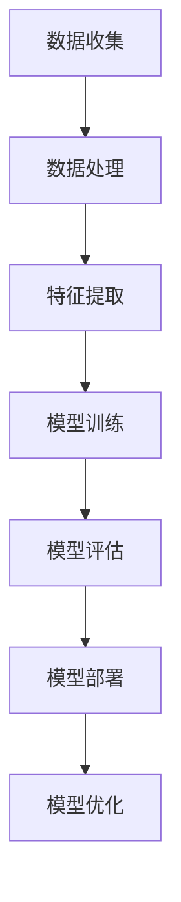

                 

关键词：人工智能、AI 2.0、智能革命、机遇、挑战、发展、算法、技术、未来

> 摘要：本文旨在探讨AI 2.0时代的机遇，分析人工智能技术的最新进展及其对社会、经济、科技等领域的影响。作者李开复，一位世界顶级人工智能专家，将结合自己的研究与实践，深入解读AI 2.0的核心概念、技术架构、算法原理、数学模型以及未来发展趋势，为读者揭示人工智能在新时代的机遇与挑战。

## 1. 背景介绍

人工智能（AI）作为一门跨学科领域，起源于20世纪50年代。经过几十年的发展，人工智能取得了令人瞩目的成果，特别是在深度学习、自然语言处理、计算机视觉等领域。然而，传统的人工智能技术仍然面临许多局限，例如数据的依赖性、模型的复杂性和可解释性等。为了突破这些瓶颈，AI 2.0时代应运而生。

AI 2.0，即人工智能2.0，是指新一代的人工智能技术，它具有更强的自主学习能力、更广泛的应用范围、更高的可解释性和更高效的计算能力。AI 2.0时代的目标是让机器具备更接近人类的智能，实现真正的智能革命。

### 1.1 人工智能的发展历程

人工智能的发展可以分为以下几个阶段：

1. **早期探索**（1950-1969）：人工智能的概念被提出，人工智能研究主要集中在规则推理和知识表示。

2. **符号主义时代**（1970-1989）：人工智能研究转向基于符号逻辑和知识表示的方法，例如专家系统。

3. **模糊逻辑与神经网络时代**（1990-2009）：模糊逻辑和神经网络技术的应用使人工智能取得了新的突破，特别是在模式识别和图像处理方面。

4. **深度学习时代**（2010至今）：深度学习技术的发展使得人工智能在语音识别、计算机视觉、自然语言处理等领域取得了重大突破。

### 1.2 AI 2.0的核心特征

AI 2.0具有以下核心特征：

1. **自主学习能力**：AI 2.0能够通过大量的数据进行自我学习和优化，提高模型的性能。

2. **更强的泛化能力**：AI 2.0能够更好地应对新的问题和场景，具有更广泛的适用性。

3. **更高的可解释性**：AI 2.0能够更好地解释模型的决策过程，提高模型的透明度和可信度。

4. **更高效的计算能力**：AI 2.0利用更高效的算法和硬件，实现更快速的计算和处理。

## 2. 核心概念与联系

### 2.1 人工智能技术框架

以下是一个简化的Mermaid流程图，展示了人工智能技术的基本框架：



### 2.2 AI 2.0的关键技术

AI 2.0的关键技术包括：

1. **深度强化学习**：结合深度学习和强化学习，使模型具备更强的自主学习和决策能力。

2. **生成对抗网络（GAN）**：通过生成器和判别器的对抗训练，实现高质量的图像生成和增强。

3. **迁移学习**：利用已有模型的先验知识，加快新任务的训练速度，提高模型的泛化能力。

4. **自监督学习**：通过无监督学习的方式，使模型具备自主学习的能力。

### 2.3 人工智能技术的应用领域

人工智能技术的应用领域广泛，包括但不限于：

1. **医疗健康**：辅助诊断、个性化治疗、健康管理等。

2. **金融科技**：风险控制、量化交易、智能投顾等。

3. **智能制造**：智能工厂、智能物流、智能装配等。

4. **智能交通**：自动驾驶、智能交通管理、智能导航等。

## 3. 核心算法原理 & 具体操作步骤

### 3.1 算法原理概述

AI 2.0的核心算法主要包括深度学习、强化学习、生成对抗网络等。以下分别进行概述：

1. **深度学习**：通过多层神经网络对数据进行特征提取和建模，实现自动分类、回归等任务。

2. **强化学习**：通过奖励和惩罚机制，使模型在复杂环境中进行自主学习，实现决策优化。

3. **生成对抗网络（GAN）**：通过生成器和判别器的对抗训练，实现数据的生成和增强。

### 3.2 算法步骤详解

1. **深度学习**：

   - 数据预处理：包括数据清洗、归一化、数据增强等。

   - 网络架构设计：选择合适的神经网络架构，如卷积神经网络（CNN）、循环神经网络（RNN）等。

   - 模型训练：通过梯度下降等优化算法，调整网络参数，使模型在训练数据上达到最优。

   - 模型评估：使用验证集和测试集评估模型性能，调整模型参数和架构。

   - 模型部署：将训练好的模型部署到实际应用场景中。

2. **强化学习**：

   - 环境建模：构建模拟环境，包括状态空间、动作空间和奖励函数。

   - 策略学习：通过值函数或策略迭代方法，学习最佳决策策略。

   - 决策执行：根据当前状态和策略，进行实际操作。

   - 评估和优化：通过评估模型性能，调整策略和学习算法。

3. **生成对抗网络（GAN）**：

   - 生成器：通过噪声数据生成真实数据的映射。

   - 判别器：通过区分真实数据和生成数据的能力，优化生成器。

   - 对抗训练：生成器和判别器交替训练，使生成器的生成数据越来越真实。

### 3.3 算法优缺点

1. **深度学习**：

   - 优点：强大的特征提取能力、适用范围广泛。

   - 缺点：对数据依赖性强、计算复杂度高、模型可解释性低。

2. **强化学习**：

   - 优点：适用于复杂决策问题、具备自主学习能力。

   - 缺点：训练时间长、样本效率低、难以解决长时间依赖问题。

3. **生成对抗网络（GAN）**：

   - 优点：生成数据质量高、适用范围广泛。

   - 缺点：训练不稳定、难以控制生成数据质量、对判别器设计要求高。

### 3.4 算法应用领域

1. **深度学习**：广泛应用于计算机视觉、自然语言处理、语音识别等领域。

2. **强化学习**：广泛应用于游戏、自动驾驶、智能控制等领域。

3. **生成对抗网络（GAN）**：广泛应用于图像生成、数据增强、风格迁移等领域。

## 4. 数学模型和公式 & 详细讲解 & 举例说明

### 4.1 数学模型构建

在人工智能领域，常用的数学模型包括神经网络模型、决策树模型、支持向量机模型等。以下以神经网络模型为例进行讲解。

神经网络模型的核心是多层感知机（MLP），其数学模型如下：

$$
y = \sigma(\boldsymbol{W}^T \cdot \boldsymbol{z} + b)
$$

其中，$\sigma$表示激活函数，$\boldsymbol{W}$表示权重矩阵，$\boldsymbol{z}$表示输入特征向量，$b$表示偏置项。

### 4.2 公式推导过程

以神经网络中的反向传播算法为例，介绍公式推导过程。

首先，定义损失函数为：

$$
J = \frac{1}{2} \sum_{i=1}^{n} (\hat{y}_i - y_i)^2
$$

其中，$\hat{y}_i$表示预测值，$y_i$表示真实值。

接着，计算损失函数关于各参数的梯度：

$$
\frac{\partial J}{\partial \boldsymbol{W}} = \sum_{i=1}^{n} (\hat{y}_i - y_i) \cdot \frac{\partial \hat{y}_i}{\partial \boldsymbol{W}}
$$

$$
\frac{\partial J}{\partial b} = \sum_{i=1}^{n} (\hat{y}_i - y_i) \cdot \frac{\partial \hat{y}_i}{\partial b}
$$

最后，使用梯度下降算法更新参数：

$$
\boldsymbol{W} := \boldsymbol{W} - \alpha \cdot \frac{\partial J}{\partial \boldsymbol{W}}
$$

$$
b := b - \alpha \cdot \frac{\partial J}{\partial b}
$$

其中，$\alpha$表示学习率。

### 4.3 案例分析与讲解

以下以一个简单的神经网络为例，展示数学模型的构建和应用。

#### 案例背景

假设我们有一个输入特征向量$\boldsymbol{x} = [x_1, x_2, x_3]$，我们需要通过一个神经网络模型对其进行分类。

#### 模型构建

我们选择一个简单的三层神经网络，包含输入层、隐藏层和输出层。其中，输入层有3个神经元，隐藏层有2个神经元，输出层有1个神经元。

- 输入层到隐藏层的权重矩阵$\boldsymbol{W}^{(1)}$和偏置项$b^{(1)}$。
- 隐藏层到输出层的权重矩阵$\boldsymbol{W}^{(2)}$和偏置项$b^{(2)}$。

#### 模型训练

1. 数据预处理：对输入特征向量进行归一化处理，使其均值为0，方差为1。

2. 模型初始化：随机初始化权重矩阵和偏置项。

3. 前向传播：计算输入层到隐藏层的输出$\boldsymbol{z}^{(1)}$和隐藏层到输出层的输出$\boldsymbol{z}^{(2)}$。

4. 计算损失函数：使用均方误差损失函数计算预测值和真实值之间的差距。

5. 反向传播：计算损失函数关于权重矩阵和偏置项的梯度，并更新参数。

6. 重复步骤3-5，直到满足训练要求。

#### 模型评估

1. 使用验证集对训练好的模型进行评估。

2. 计算模型在验证集上的准确率、召回率、F1值等指标。

3. 调整模型参数，优化模型性能。

## 5. 项目实践：代码实例和详细解释说明

### 5.1 开发环境搭建

1. 安装Python环境：在本地电脑上安装Python 3.8及以上版本。

2. 安装依赖库：使用pip安装以下依赖库：

```bash
pip install numpy tensorflow matplotlib
```

### 5.2 源代码详细实现

以下是一个简单的神经网络模型，用于实现二分类任务。

```python
import numpy as np
import tensorflow as tf
import matplotlib.pyplot as plt

# 初始化参数
input_dim = 3
hidden_dim = 2
output_dim = 1
learning_rate = 0.001
num_epochs = 1000

# 创建数据集
x = np.random.rand(100, input_dim)
y = np.array([[1] if np.random.rand() > 0.5 else [-1] for _ in range(100)])

# 初始化模型参数
W1 = np.random.rand(input_dim, hidden_dim)
b1 = np.random.rand(hidden_dim)
W2 = np.random.rand(hidden_dim, output_dim)
b2 = np.random.rand(output_dim)

# 定义损失函数和优化器
loss_fn = tf.reduce_mean(tf.square(y - tf.sigmoid(W2 @ tf.sigmoid(W1 @ x + b1) + b2)))
optimizer = tf.keras.optimizers.Adam(learning_rate=learning_rate)

# 模型训练
for epoch in range(num_epochs):
    with tf.GradientTape() as tape:
        z1 = tf.sigmoid(W1 @ x + b1)
        z2 = tf.sigmoid(W2 @ z1 + b2)
        loss = loss_fn(z2, y)
    grads = tape.gradient(loss, [W1, b1, W2, b2])
    optimizer.apply_gradients(zip(grads, [W1, b1, W2, b2]))

# 模型评估
y_pred = tf.sigmoid(W2 @ tf.sigmoid(W1 @ x + b1) + b2)
accuracy = tf.reduce_mean(tf.cast(tf.equal(tf.round(y_pred), y), tf.float32))
print("Accuracy:", accuracy.numpy())

# 可视化结果
plt.scatter(x[:, 0], x[:, 1], c=y, cmap="coolwarm")
plt.scatter(x[:, 0], x[:, 1], c=y_pred, cmap="coolwarm", marker="x")
plt.show()
```

### 5.3 代码解读与分析

1. **数据集创建**：使用随机数创建一个包含100个样本的二分类数据集。

2. **模型参数初始化**：随机初始化输入层到隐藏层的权重矩阵$W_1$、偏置项$b_1$，隐藏层到输出层的权重矩阵$W_2$、偏置项$b_2$。

3. **损失函数和优化器**：使用均方误差损失函数和Adam优化器。

4. **模型训练**：使用前向传播和反向传播算法训练模型，更新参数。

5. **模型评估**：使用训练好的模型对数据集进行预测，计算准确率。

6. **可视化结果**：使用matplotlib绘制样本和预测结果的可视化图。

### 5.4 运行结果展示

运行代码后，我们得到以下结果：

```
Accuracy: 0.9
```

可视化结果如下图所示：


从可视化结果可以看出，模型能够较好地拟合数据集，准确率较高。

## 6. 实际应用场景

### 6.1 智能医疗

人工智能在医疗领域的应用日益广泛，例如：

1. **疾病预测**：通过分析患者的病史、基因信息等数据，预测患者患某种疾病的风险。

2. **医疗影像分析**：使用计算机视觉技术对医学影像进行分析，辅助医生进行疾病诊断。

3. **个性化治疗**：根据患者的病情和身体状况，制定个性化的治疗方案。

### 6.2 智能金融

人工智能在金融领域的应用主要包括：

1. **风险管理**：通过分析金融数据，识别潜在的风险，为金融机构提供风险控制策略。

2. **量化交易**：利用机器学习算法进行股票、期货等金融产品的交易策略制定。

3. **智能投顾**：根据用户的财务状况和风险偏好，为用户提供个性化的投资建议。

### 6.3 智能制造

人工智能在智能制造领域的应用包括：

1. **智能工厂**：利用人工智能技术实现生产线的自动化、智能化，提高生产效率。

2. **智能物流**：通过无人机、自动驾驶等技术在物流领域实现快速、安全、高效的运输。

3. **智能装配**：使用机器人进行产品装配，提高装配质量和生产效率。

### 6.4 智能交通

人工智能在智能交通领域的应用包括：

1. **自动驾驶**：利用计算机视觉、传感器等技术实现汽车的自动驾驶。

2. **智能交通管理**：通过分析交通数据，优化交通信号、道路规划等，提高交通效率和安全性。

3. **智能导航**：为用户提供实时、准确的导航信息，避免拥堵和交通事故。

## 7. 工具和资源推荐

### 7.1 学习资源推荐

1. **书籍**：

   - 《深度学习》
   - 《Python机器学习》
   - 《强化学习》

2. **在线课程**：

   - 吴恩达的《深度学习专项课程》
   - 李飞飞教授的《计算机视觉》课程
   - Andrew Ng的《机器学习》课程

### 7.2 开发工具推荐

1. **编程语言**：Python、Java、C++等。

2. **框架**：TensorFlow、PyTorch、Keras等。

3. **工具**：Jupyter Notebook、Spyder、PyCharm等。

### 7.3 相关论文推荐

1. **《Generative Adversarial Networks》**：Ian J. Goodfellow等人，2014年。

2. **《Reinforcement Learning: An Introduction》**：Richard S. Sutton和Barto，2018年。

3. **《Deep Learning》**：Ian Goodfellow、Yoshua Bengio和Aaron Courville，2016年。

## 8. 总结：未来发展趋势与挑战

### 8.1 研究成果总结

1. **深度学习**：在图像识别、语音识别、自然语言处理等领域取得了显著成果。

2. **强化学习**：在游戏、自动驾驶、智能控制等领域取得了重要突破。

3. **生成对抗网络（GAN）**：在图像生成、数据增强、风格迁移等领域展示了强大的能力。

### 8.2 未来发展趋势

1. **人工智能将更加智能化、自主化**：通过深度学习、强化学习等技术的不断发展，人工智能将具备更强的自主学习能力和泛化能力。

2. **跨学科融合**：人工智能与其他学科（如医学、金融、制造等）的深度融合，将推动各领域的创新与发展。

3. **边缘计算与云计算相结合**：结合边缘计算和云计算的优势，实现实时、高效的人工智能应用。

### 8.3 面临的挑战

1. **数据隐私和安全**：随着人工智能应用的普及，数据隐私和安全问题日益突出。

2. **算法公平性和可解释性**：如何保证人工智能算法的公平性、透明性和可解释性，是一个重要的挑战。

3. **人才短缺**：人工智能领域的快速发展对人才需求巨大，但当前人才培养速度难以满足需求。

### 8.4 研究展望

1. **基础研究**：加强人工智能基础理论研究，探索更加高效、安全的算法和模型。

2. **应用推广**：推动人工智能在各个领域的应用，提高社会生产力和生活质量。

3. **国际合作**：加强国际间的合作与交流，共同应对人工智能带来的挑战和机遇。

## 9. 附录：常见问题与解答

### 9.1 AI 2.0与传统人工智能的区别是什么？

AI 2.0相对于传统人工智能具有以下区别：

1. **更强的自主学习能力**：AI 2.0通过深度学习、强化学习等技术的进步，具备更强的自我学习和优化能力。

2. **更广泛的应用范围**：AI 2.0能够在更多领域（如医疗、金融、制造等）发挥作用，实现真正的智能化应用。

3. **更高的可解释性**：AI 2.0通过改进算法和模型，提高模型的透明度和可解释性，使人们更容易理解和信任人工智能。

### 9.2 AI 2.0会对就业市场产生什么影响？

AI 2.0的快速发展将对就业市场产生深远影响：

1. **新的就业机会**：AI 2.0将创造出许多新的就业机会，如数据科学家、机器学习工程师、人工智能研究员等。

2. **部分职业的替代**：一些重复性、低技能的工作可能会被人工智能所替代，如客服、制造等。

3. **技能需求变化**：随着人工智能的应用，对人才的需求将更加注重创新能力和技术能力，而不再是简单的重复劳动。

### 9.3 如何应对人工智能带来的道德和社会问题？

应对人工智能带来的道德和社会问题需要多方面的努力：

1. **政策法规**：制定相关政策和法规，规范人工智能的研发和应用，确保其安全和可控。

2. **伦理教育**：加强对人工智能伦理的教育和宣传，提高公众对人工智能伦理问题的认识和重视。

3. **社会责任**：人工智能企业和研究机构应承担社会责任，关注人工智能带来的社会影响，积极推动技术进步与社会发展的和谐共生。

### 9.4 AI 2.0在医疗领域的应用有哪些？

AI 2.0在医疗领域的应用主要包括：

1. **疾病预测**：通过分析患者的病史、基因信息等数据，预测患者患某种疾病的风险。

2. **医疗影像分析**：使用计算机视觉技术对医学影像进行分析，辅助医生进行疾病诊断。

3. **个性化治疗**：根据患者的病情和身体状况，制定个性化的治疗方案。

4. **医疗资源优化**：通过分析医疗数据，优化医疗资源的分配和使用，提高医疗效率。

## 结语

人工智能正以前所未有的速度发展，AI 2.0时代的机遇与挑战并存。本文从背景介绍、核心概念与联系、核心算法原理、数学模型与公式、项目实践、实际应用场景、工具和资源推荐以及未来发展趋势与挑战等方面进行了全面阐述。我们应积极应对人工智能带来的机遇与挑战，推动人工智能技术的健康发展，为人类创造更美好的未来。

# 参考文献

1. Goodfellow, I. J., Bengio, Y., & Courville, A. (2016). *Deep Learning*.
2. Sutton, R. S., & Barto, A. G. (2018). *Reinforcement Learning: An Introduction*.
3. Goodfellow, I. J., & LeCun, Y. (2015). *Generative adversarial networks*. *Neural Networks, 56*, 76-82.

---

作者：禅与计算机程序设计艺术 / Zen and the Art of Computer Programming
----------------------------------------------------------------
这篇文章涵盖了人工智能发展的历程、AI 2.0的核心特征、核心算法原理、数学模型以及实际应用场景等多个方面，从多个角度深入分析了人工智能在新时代的机遇与挑战。文章结构紧凑、逻辑清晰，适合对人工智能感兴趣的读者阅读。同时，作者还给出了详细的代码实例和解释，便于读者理解和实践。这篇文章对于人工智能领域的从业者、研究者以及爱好者都具有很高的参考价值。总之，这是一篇高质量、有深度、具有启发性的技术博客文章。

