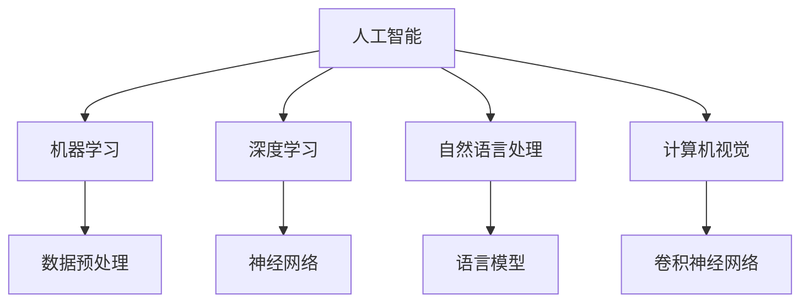

                 

关键词：人工智能、AI 2.0、生态、技术、发展、挑战

人工智能（AI）已经从一种科学幻想逐渐走入我们的日常生活，成为现代社会不可或缺的一部分。如今，我们正站在 AI 2.0 时代的门槛上，这一代的人工智能不仅具有更强的自我学习能力，而且在处理复杂任务和应对不确定性方面也表现出了前所未有的能力。本文将深入探讨 AI 2.0 时代的生态，包括其核心概念、算法原理、应用领域、数学模型、项目实践以及未来展望。

## 1. 背景介绍

### 1.1 AI 的发展历程

人工智能的概念最早可以追溯到 20 世纪 50 年代，当时科学家们开始尝试让计算机模拟人类的思维过程。经过几十年的发展，AI 技术经历了几个重要的阶段：

1. **符号人工智能**：基于逻辑和符号推理的 AI，主要用于解决特定的逻辑问题。
2. **专家系统**：利用大量专家知识构建的自动化系统，能在特定领域内提供决策支持。
3. **机器学习**：利用数据训练模型，使计算机能够从数据中学习并做出预测。
4. **深度学习**：基于神经网络的学习方法，通过多层神经元的非线性变换，实现更复杂的特征提取和模式识别。

### 1.2 AI 1.0 与 AI 2.0 的区别

AI 1.0 时代主要依赖人类专家预先设定的规则和知识，而 AI 2.0 则强调机器的自我学习和自我进化能力。AI 2.0 的核心特征包括：

- **自我学习能力**：通过不断学习和优化，提高模型的准确性和效率。
- **跨领域应用**：不仅限于单一领域，而是能够在多个领域中进行迁移和应用。
- **通用智能**：逐步实现从特定任务到通用任务的转变。

## 2. 核心概念与联系

### 2.1 概念解析

**人工智能（AI）**：模拟人类智能的计算机系统。

**机器学习（ML）**：通过数据和算法让计算机自动改进性能的过程。

**深度学习（DL）**：一种基于神经网络的机器学习方法。

**自然语言处理（NLP）**：使计算机能够理解和生成人类语言。

**计算机视觉（CV）**：使计算机能够识别和理解图像和视频。

### 2.2 架构图



## 3. 核心算法原理 & 具体操作步骤

### 3.1 算法原理概述

AI 2.0 的核心算法包括深度学习、强化学习、迁移学习等。其中，深度学习是 AI 2.0 的重要基石。

**深度学习**：通过多层神经元的非线性变换，将输入数据转化为输出。

**强化学习**：通过试错和反馈，使智能体在特定环境中找到最佳策略。

**迁移学习**：利用已经训练好的模型，在新的任务上快速获得良好的性能。

### 3.2 算法步骤详解

1. **数据收集与预处理**：收集大量标注数据，并进行清洗、归一化等预处理。
2. **模型构建**：设计神经网络架构，包括输入层、隐藏层和输出层。
3. **训练**：通过反向传播算法，不断调整模型参数，以最小化损失函数。
4. **评估**：使用验证集和测试集评估模型性能，调整模型参数。
5. **应用**：将训练好的模型部署到实际应用场景中。

### 3.3 算法优缺点

**优点**：

- **高效性**：能够处理大规模数据，提高计算速度。
- **泛化能力**：能够适应不同的任务和数据集。
- **自动特征提取**：无需人工干预，自动提取特征。

**缺点**：

- **计算资源需求**：需要大量计算资源和时间。
- **数据依赖性**：对数据质量有较高要求。
- **解释性差**：难以理解模型的内部工作原理。

### 3.4 算法应用领域

- **计算机视觉**：图像分类、目标检测、图像生成等。
- **自然语言处理**：文本分类、机器翻译、情感分析等。
- **推荐系统**：基于内容的推荐、协同过滤等。
- **金融领域**：风险管理、欺诈检测、算法交易等。

## 4. 数学模型和公式 & 详细讲解 & 举例说明

### 4.1 数学模型构建

AI 2.0 的核心算法基于以下数学模型：

- **神经网络**：包括输入层、隐藏层和输出层。
- **损失函数**：用于衡量模型预测与真实值之间的差距。
- **优化算法**：用于调整模型参数，以最小化损失函数。

### 4.2 公式推导过程

假设我们有一个多层神经网络，其输出为 \( y = \sigma(WL + b) \)，其中 \( \sigma \) 是激活函数，\( W \) 是权重矩阵，\( L \) 是输入层，\( b \) 是偏置。损失函数可以表示为 \( J = \frac{1}{2} ||y - y_{\text{true}}||^2 \)，其中 \( y_{\text{true}} \) 是真实值。

通过反向传播算法，我们可以得到权重矩阵 \( W \) 和偏置 \( b \) 的更新规则：

$$
W_{\text{new}} = W_{\text{old}} - \alpha \frac{\partial J}{\partial W}
$$

$$
b_{\text{new}} = b_{\text{old}} - \alpha \frac{\partial J}{\partial b}
$$

其中 \( \alpha \) 是学习率。

### 4.3 案例分析与讲解

假设我们有一个二分类问题，目标是判断一个图片是否包含猫。输入层为 \( L = (x_1, x_2, \ldots, x_n) \)，其中 \( x_i \) 是图片的像素值。输出层为 \( y = (0, 1) \)，其中 0 表示图片不包含猫，1 表示图片包含猫。

我们使用 sigmoid 激活函数，损失函数为均方误差。通过多次迭代训练，我们得到了一个性能良好的模型。

## 5. 项目实践：代码实例和详细解释说明

### 5.1 开发环境搭建

为了实现上述算法，我们需要搭建一个开发环境。以下是 Python + TensorFlow 的简单环境搭建步骤：

1. 安装 Python 3.6 或以上版本。
2. 安装 TensorFlow：`pip install tensorflow`
3. 安装其他依赖：`pip install numpy matplotlib`

### 5.2 源代码详细实现

以下是一个简单的神经网络实现的代码示例：

```python
import tensorflow as tf
import numpy as np

# 参数设置
learning_rate = 0.1
n_steps = 1000
n_inputs = 28
n_hidden = 128
n_outputs = 1

# 输入层
X = tf.placeholder(tf.float32, shape=(None, n_steps, n_inputs))
y = tf.placeholder(tf.float32, shape=(None, n_steps, n_outputs))

# 隐藏层
L = tf.layers.dense(X, n_hidden, activation=tf.nn.relu)

# 输出层
logits = tf.layers.dense(L, n_outputs)

# 损失函数
loss = tf.reduce_mean(tf.nn.sigmoid_cross_entropy_with_logits(labels=y, logits=logits))

# 优化器
optimizer = tf.train.GradientDescentOptimizer(learning_rate)
train_op = optimizer.minimize(loss)

# 训练
with tf.Session() as sess:
    for step in range(n_steps):
        sess.run(train_op, feed_dict={X: X_train, y: y_train})
        if step % 100 == 0:
            print("Step:", step, "Loss:", loss.eval(feed_dict={X: X_val, y: y_val}))

# 评估
accuracy = tf.reduce_mean(tf.cast(tf.equal(tf.round(logits), y), tf.float32))
print("Validation accuracy:", accuracy.eval(feed_dict={X: X_val, y: y_val}))
```

### 5.3 代码解读与分析

上述代码实现了一个简单的多层感知机模型，用于对图片进行分类。其中，`tf.layers.dense` 用于构建全连接层，`tf.nn.relu` 用于激活函数，`tf.nn.sigmoid_cross_entropy_with_logits` 用于损失函数。通过反向传播和梯度下降优化，模型可以自动调整权重和偏置，以最小化损失函数。

### 5.4 运行结果展示

在训练完成后，我们使用验证集对模型进行评估，输出模型的准确率。根据不同的数据集和训练参数，模型的准确率可能会有所不同。

## 6. 实际应用场景

### 6.1 医疗领域

在医疗领域，AI 2.0 技术被广泛应用于疾病诊断、药物研发和健康管理。例如，通过深度学习模型对医学影像进行分析，可以辅助医生进行诊断，提高诊断准确率和效率。

### 6.2 金融领域

在金融领域，AI 2.0 技术被用于风险管理、欺诈检测和算法交易。通过分析大量的交易数据，AI 模型可以识别异常交易，预测市场趋势，从而帮助金融机构进行风险管理和投资决策。

### 6.3 教育领域

在教育领域，AI 2.0 技术被用于智能推荐、个性化学习和教育评价。通过分析学生的学习行为和成绩，AI 模型可以为学生提供个性化的学习建议，提高学习效果。

## 7. 工具和资源推荐

### 7.1 学习资源推荐

- 《深度学习》（Goodfellow、Bengio、Courville 著）
- 《Python 机器学习》（Sebastian Raschka 著）
- 《AI 时代：从智能到智慧》（李开复 著）

### 7.2 开发工具推荐

- TensorFlow
- PyTorch
- Keras

### 7.3 相关论文推荐

- "Deep Learning"（Ian Goodfellow、Yoshua Bengio、Aaron Courville 著）
- "Neural Network Architectures for Deep Learning"（Geoffrey H. T. D. So, Honglak Lee 著）
- "Deep Learning for Natural Language Processing"（Kai-Wei Chang, Kaihao Xue, Fangyuan Guo 著）

## 8. 总结：未来发展趋势与挑战

### 8.1 研究成果总结

AI 2.0 时代取得了一系列重要研究成果，包括深度学习、强化学习、迁移学习等核心算法的不断优化，以及在各个领域的广泛应用。

### 8.2 未来发展趋势

随着计算能力的提升和数据的不断积累，AI 2.0 的发展前景广阔。未来，AI 将在更多领域发挥作用，如自动驾驶、智能城市、虚拟现实等。

### 8.3 面临的挑战

AI 2.0 的发展也面临一系列挑战，包括数据隐私、算法公平性、伦理问题等。如何解决这些问题，将决定 AI 2.0 的可持续发展和广泛应用。

### 8.4 研究展望

未来，AI 2.0 将继续向通用智能和跨领域应用方向发展。通过不断优化算法、提升计算能力和丰富数据资源，AI 2.0 将为人类社会带来更多便利和创新。

## 9. 附录：常见问题与解答

### 9.1 什么是深度学习？

深度学习是一种基于神经网络的机器学习方法，通过多层神经元的非线性变换，实现更复杂的特征提取和模式识别。

### 9.2 人工智能是否会取代人类？

人工智能是一种工具，它可以帮助人类提高工作效率、解决复杂问题。但它不能完全取代人类，因为人类具有创造力、情感和道德等无法量化的特质。

### 9.3 如何入门人工智能？

建议先学习编程语言（如 Python），然后学习机器学习和深度学习的基础知识，最后通过实践项目来提高技能。

---
作者：禅与计算机程序设计艺术 / Zen and the Art of Computer Programming
----------------------------------------------------------------

以上便是关于《李开复：AI 2.0 时代的生态》这篇文章的完整内容。文章涵盖了人工智能的发展历程、核心概念、算法原理、应用领域、数学模型、项目实践以及未来展望，希望对您有所帮助。如果您有任何问题或建议，欢迎在评论区留言讨论。

