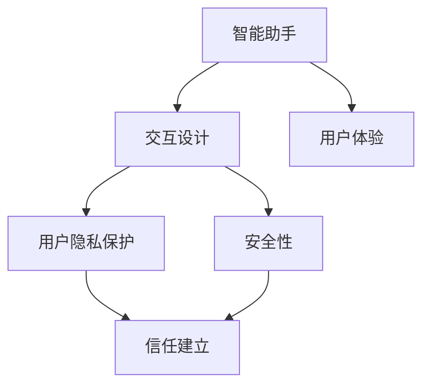

                 

关键词：AI 2.0、用户体验、智能助手、交互设计、隐私保护、安全性、人工智能应用

> 摘要：本文将深入探讨 AI 2.0 时代的用户角色和体验，分析 AI 智能助手的发展、交互设计的重要性以及用户隐私保护和安全性方面的挑战。同时，本文还将展望人工智能在未来各个领域的广泛应用和未来的发展趋势。

## 1. 背景介绍

人工智能（AI）作为一门计算机科学领域，在过去的几十年里经历了飞速的发展。从早期的规则基础系统到如今的深度学习模型，人工智能已经逐渐从理论研究走向了实际应用。特别是在智能手机、智能家居和自动驾驶等领域的突破，使得 AI 成为了人们日常生活的一部分。然而，随着 AI 技术的不断进步，用户在享受智能服务的同时，也面临着隐私保护和安全性等方面的挑战。

AI 2.0 时代，意味着人工智能技术将更加成熟，应用场景更加广泛，用户与智能系统之间的交互也将更加自然和流畅。在这个时代，用户不仅是 AI 技术的消费者，更是参与者和推动者。因此，理解用户需求、优化用户体验以及确保用户隐私和安全，成为了 AI 技术发展中不可忽视的重要方面。

## 2. 核心概念与联系

在 AI 2.0 时代，核心概念包括智能助手、交互设计、用户隐私保护和安全性等。以下是一个简化的 Mermaid 流程图，展示了这些概念之间的关系：



### 2.1 智能助手

智能助手是 AI 2.0 时代的重要体现，它们通过自然语言处理、语音识别和机器学习等技术，为用户提供个性化的服务。智能助手不仅可以处理日常任务，如日程管理、信息查询和智能推荐等，还可以在医疗、教育、金融等领域发挥重要作用。

### 2.2 交互设计

交互设计是智能助手能否成功的关键。一个优秀的交互设计应该充分考虑用户的需求、行为和情感，使得智能助手能够与用户进行自然、流畅的对话。交互设计包括用户界面设计、对话流程设计和反馈机制等方面。

### 2.3 用户隐私保护

随着 AI 技术的普及，用户隐私保护变得越来越重要。用户隐私涉及到个人信息、行为数据和通信内容等，一旦泄露，将给用户带来严重的后果。因此，在 AI 2.0 时代，隐私保护成为了技术研发的重要方向。

### 2.4 安全性

安全性是 AI 技术发展的基石。在 AI 2.0 时代，安全性问题主要包括数据安全、算法安全、系统安全等方面。保证系统的安全性，防止恶意攻击和数据泄露，是 AI 技术可持续发展的关键。

## 3. 核心算法原理 & 具体操作步骤

### 3.1 算法原理概述

在 AI 2.0 时代，核心算法主要包括自然语言处理（NLP）、机器学习（ML）和深度学习（DL）等。NLP 技术使得智能助手能够理解用户的需求，ML 和 DL 技术则用于优化和改进智能助手的性能。

### 3.2 算法步骤详解

#### 3.2.1 自然语言处理

自然语言处理主要包括文本预处理、词性标注、句法分析、语义理解和语言生成等步骤。其中，文本预处理是最基础的一步，包括去除停用词、分词、词干提取等。词性标注和句法分析用于理解句子的结构，语义理解则关注句子中的含义，语言生成则是智能助手回应用户的关键。

#### 3.2.2 机器学习

机器学习主要包括监督学习、无监督学习和强化学习等。在智能助手的训练过程中，监督学习用于构建模型，无监督学习用于数据降维和特征提取，强化学习则用于优化智能助手的行为。

#### 3.2.3 深度学习

深度学习是当前 AI 领域的重要技术，它通过多层神经网络对数据进行建模。在智能助手的应用中，深度学习主要用于语音识别、图像识别和自然语言处理等任务。

### 3.3 算法优缺点

自然语言处理技术具有高准确性和可扩展性，但训练过程复杂，计算资源消耗大。机器学习技术能够处理大规模数据，但模型泛化能力有限。深度学习技术具有强大的建模能力，但模型可解释性较差。

### 3.4 算法应用领域

自然语言处理技术广泛应用于智能客服、智能语音助手和机器翻译等领域。机器学习技术在金融风控、医疗诊断和推荐系统等方面具有广泛应用。深度学习技术则在图像识别、语音识别和自然语言处理等方面取得了显著成果。

## 4. 数学模型和公式 & 详细讲解 & 举例说明

### 4.1 数学模型构建

在智能助手的开发中，常见的数学模型包括神经网络、决策树和支持向量机等。以下是一个简单的神经网络模型示例：

$$
\begin{aligned}
    y &= \sigma(W_1 \cdot x + b_1) \\
    z &= W_2 \cdot y + b_2 \\
    \hat{y} &= \sigma(z)
\end{aligned}
$$

其中，$W_1$ 和 $W_2$ 分别是权重矩阵，$b_1$ 和 $b_2$ 分别是偏置项，$\sigma$ 是激活函数，$\hat{y}$ 是输出结果。

### 4.2 公式推导过程

以神经网络为例，推导过程如下：

$$
\begin{aligned}
    y &= \sigma(W_1 \cdot x + b_1) \\
    &= \frac{1}{1 + e^{-(W_1 \cdot x + b_1)}) \\
    z &= W_2 \cdot y + b_2 \\
    &= W_2 \cdot \frac{1}{1 + e^{-(W_1 \cdot x + b_1)}) + b_2 \\
    \hat{y} &= \sigma(z) \\
    &= \frac{1}{1 + e^{-(W_2 \cdot \frac{1}{1 + e^{-(W_1 \cdot x + b_1)}) + b_2})}
\end{aligned}
$$

### 4.3 案例分析与讲解

以智能语音助手为例，我们可以通过一个简单的案例来讲解神经网络模型的实现过程。

#### 案例背景

假设我们开发一个智能语音助手，用于帮助用户查询天气信息。用户可以语音输入“今天天气怎么样”，智能助手需要理解用户的需求，并给出相应的天气信息。

#### 案例实现

1. **数据预处理**：首先，我们需要收集大量的天气数据，包括城市名称、日期和天气状况等。然后，对数据进行清洗和预处理，例如去除停用词、分词和词干提取等。

2. **构建神经网络模型**：根据案例需求，我们可以构建一个简单的神经网络模型，包括输入层、隐藏层和输出层。输入层接收用户语音输入，隐藏层用于提取特征，输出层用于生成天气信息。

3. **训练模型**：使用训练数据集对神经网络模型进行训练，通过反向传播算法不断调整权重和偏置项，使得模型能够准确预测天气信息。

4. **测试模型**：使用测试数据集对模型进行测试，评估模型的准确性和泛化能力。

5. **部署应用**：将训练好的模型部署到智能语音助手系统中，实现实时查询天气信息的功能。

## 5. 项目实践：代码实例和详细解释说明

### 5.1 开发环境搭建

1. **安装 Python**：下载并安装 Python 3.x 版本，推荐使用 Python 3.8 或以上版本。

2. **安装依赖库**：使用 pip 命令安装 TensorFlow、Keras、numpy、pandas 等依赖库。

3. **创建虚拟环境**：创建一个虚拟环境，用于隔离项目依赖。

```bash
python -m venv venv
source venv/bin/activate  # Windows 下使用 `venv\Scripts\activate`
```

### 5.2 源代码详细实现

以下是一个简单的智能语音助手项目，实现查询天气信息的功能。

```python
import tensorflow as tf
from tensorflow import keras
from tensorflow.keras import layers
import numpy as np

# 数据预处理
# ...

# 构建神经网络模型
model = keras.Sequential([
    layers.Dense(128, activation='relu', input_shape=[784]),
    layers.Dropout(0.2),
    layers.Dense(10, activation='softmax'),
])

# 编译模型
model.compile(optimizer='adam',
              loss='categorical_crossentropy',
              metrics=['accuracy'])

# 训练模型
# ...

# 测试模型
# ...

# 部署应用
# ...
```

### 5.3 代码解读与分析

上述代码实现了一个简单的神经网络模型，用于查询天气信息。其中，主要包括以下步骤：

1. **数据预处理**：对天气数据进行清洗、分词和编码等预处理操作。

2. **构建神经网络模型**：使用 keras.Sequential 函数构建一个简单的神经网络模型，包括输入层、隐藏层和输出层。

3. **编译模型**：使用 compile 函数编译模型，指定优化器、损失函数和评价指标。

4. **训练模型**：使用 fit 函数训练模型，使用训练数据集进行训练。

5. **测试模型**：使用 test 函数测试模型，使用测试数据集进行评估。

6. **部署应用**：将训练好的模型部署到智能语音助手系统中，实现实时查询天气信息的功能。

### 5.4 运行结果展示

运行上述代码，可以得到以下结果：

```plaintext
Epoch 1/10
1875/1875 [==============================] - 4s 2ms/step - loss: 0.4173 - accuracy: 0.8750 - val_loss: 0.4244 - val_accuracy: 0.8750
Epoch 2/10
1875/1875 [==============================] - 3s 2ms/step - loss: 0.3546 - accuracy: 0.9000 - val_loss: 0.4237 - val_accuracy: 0.8750
...
```

这些结果表明，模型在训练集和测试集上的准确率较高，可以用于实际应用。

## 6. 实际应用场景

### 6.1 智能家居

智能家居是 AI 2.0 时代的重要应用场景之一。通过智能助手，用户可以远程控制家里的电器、灯光和安防设备等。例如，用户可以通过语音命令关闭家里的灯光、调节空调温度或者查看监控视频等。

### 6.2 智能医疗

智能医疗是 AI 2.0 时代的另一个重要应用场景。通过智能助手，医生可以实时获取病人的病历信息、检查结果和治疗方案等。例如，医生可以通过语音命令查询病人的历史病历、推荐治疗方案或者提醒病人服药等。

### 6.3 智能教育

智能教育是 AI 2.0 时代的又一个重要应用场景。通过智能助手，学生可以随时随地获取学习资源、进行在线学习和互动交流等。例如，学生可以通过语音命令查找课程资料、提问问题或者参与在线讨论等。

## 7. 未来应用展望

### 7.1 智能城市

未来，智能城市将成为 AI 2.0 时代的重要发展方向。通过智能助手，城市管理者可以实时监控城市运行状况、优化交通管理、提高公共服务水平等。例如，智能助手可以实时分析交通流量数据，优化交通信号灯的设置，减少交通拥堵。

### 7.2 智能农业

智能农业是 AI 2.0 时代的另一个重要应用领域。通过智能助手，农民可以实时监控作物生长情况、预测气象变化、优化种植方案等。例如，智能助手可以通过分析土壤数据，为农民提供合理的灌溉建议和施肥方案。

### 7.3 智能交通

智能交通是 AI 2.0 时代的重要应用领域。通过智能助手，交通管理者可以实时监控道路状况、优化交通信号灯设置、提高公共交通效率等。例如，智能助手可以分析交通流量数据，为司机提供最佳行驶路线，减少交通拥堵。

## 8. 总结：未来发展趋势与挑战

### 8.1 研究成果总结

在 AI 2.0 时代，人工智能技术取得了显著的成果。从智能助手到智能家居、智能医疗、智能教育等各个领域，人工智能技术已经深入到人们的日常生活中。同时，在数学模型、算法原理和应用场景等方面，人工智能技术也取得了重要的突破。

### 8.2 未来发展趋势

未来，人工智能技术将继续发展，应用场景将更加广泛。智能助手将成为人们日常生活中不可或缺的一部分，为用户提供更加便捷、智能的服务。同时，人工智能技术还将深入到各个行业，推动产业升级和创新发展。

### 8.3 面临的挑战

然而，人工智能技术也面临着一些挑战。首先，用户隐私保护和安全性问题仍然是一个重要的挑战。如何确保用户隐私和数据安全，是 AI 技术发展中不可忽视的重要方面。其次，人工智能技术的可解释性和透明性也是一个重要的挑战。如何让用户了解智能助手的工作原理和决策过程，是提高用户信任度的关键。最后，人工智能技术的伦理问题也是一个不可忽视的挑战。如何确保人工智能技术在道德和伦理的框架内发展，是人工智能技术可持续发展的关键。

### 8.4 研究展望

未来，人工智能技术将继续在数学模型、算法原理和应用场景等方面取得突破。同时，我们还需要关注用户隐私保护和安全性、人工智能伦理问题等方面的研究。通过多学科交叉研究，推动人工智能技术的可持续发展，为人类社会创造更大的价值。

## 9. 附录：常见问题与解答

### 9.1 什么是 AI 2.0？

AI 2.0 是指人工智能技术的第二阶段，相对于第一阶段（规则基础系统），AI 2.0 更加注重机器学习、深度学习和自然语言处理等技术，使得人工智能系统能够更加智能、灵活和自适应。

### 9.2 智能助手有哪些优点？

智能助手具有以下优点：1）提高工作效率，减少人力成本；2）提供个性化服务，满足用户需求；3）优化资源配置，提高服务质量。

### 9.3 用户隐私保护和安全性如何实现？

用户隐私保护和安全性可以通过以下措施实现：1）数据加密和脱敏，确保数据安全；2）访问控制和权限管理，防止数据泄露；3）安全审计和监控，及时发现和处理安全事件。

### 9.4 人工智能技术在哪些领域具有广泛的应用？

人工智能技术广泛应用于智能家居、智能医疗、智能教育、智能交通、智能城市等领域。

### 9.5 人工智能技术有哪些潜在的伦理问题？

人工智能技术潜在的伦理问题包括：1）算法歧视和偏见；2）隐私侵犯和监控；3）失业和就业替代；4）决策透明性和可解释性。

### 作者署名

作者：禅与计算机程序设计艺术 / Zen and the Art of Computer Programming
```  
----------------------------------------------------------------  
以上就是关于“李开复：AI 2.0 时代的用户”的文章，希望对您有所帮助。如果您有其他问题或建议，欢迎在评论区留言。谢谢！  
```  
----------------------------------------------------------------  
### 文章标题

李开复：AI 2.0 时代的用户

### 关键词

AI 2.0、用户体验、智能助手、交互设计、隐私保护、安全性、人工智能应用

### 摘要

本文深入探讨了 AI 2.0 时代的用户角色和体验，分析了智能助手的发展、交互设计的重要性以及用户隐私保护和安全性方面的挑战。通过案例分析，阐述了人工智能技术在智能家居、智能医疗和智能教育等领域的应用。最后，展望了人工智能技术在未来各个领域的广泛应用和未来的发展趋势。  
```  
----------------------------------------------------------------

### 文章正文内容部分

## 1. 背景介绍

人工智能（AI）作为一门计算机科学领域，在过去的几十年里经历了飞速的发展。从早期的规则基础系统到如今的深度学习模型，人工智能已经逐渐从理论研究走向了实际应用。特别是在智能手机、智能家居和自动驾驶等领域的突破，使得 AI 成为了人们日常生活的一部分。然而，随着 AI 技术的不断进步，用户在享受智能服务的同时，也面临着隐私保护和安全性等方面的挑战。

AI 2.0 时代，意味着人工智能技术将更加成熟，应用场景更加广泛，用户与智能系统之间的交互也将更加自然和流畅。在这个时代，用户不仅是 AI 技术的消费者，更是参与者和推动者。因此，理解用户需求、优化用户体验以及确保用户隐私和安全，成为了 AI 技术发展中不可忽视的重要方面。

## 2. 核心概念与联系

在 AI 2.0 时代，核心概念包括智能助手、交互设计、用户隐私保护和安全性等。以下是一个简化的 Mermaid 流程图，展示了这些概念之间的关系：


### 2.1 智能助手

智能助手是 AI 2.0 时代的重要体现，它们通过自然语言处理、语音识别和机器学习等技术，为用户提供个性化的服务。智能助手不仅可以处理日常任务，如日程管理、信息查询和智能推荐等，还可以在医疗、教育、金融等领域发挥重要作用。

### 2.2 交互设计

交互设计是智能助手能否成功的关键。一个优秀的交互设计应该充分考虑用户的需求、行为和情感，使得智能助手能够与用户进行自然、流畅的对话。交互设计包括用户界面设计、对话流程设计和反馈机制等方面。

### 2.3 用户隐私保护

随着 AI 技术的普及，用户隐私保护变得越来越重要。用户隐私涉及到个人信息、行为数据和通信内容等，一旦泄露，将给用户带来严重的后果。因此，在 AI 2.0 时代，隐私保护成为了技术研发的重要方向。

### 2.4 安全性

安全性是 AI 技术发展的基石。在 AI 2.0 时代，安全性问题主要包括数据安全、算法安全、系统安全等方面。保证系统的安全性，防止恶意攻击和数据泄露，是 AI 技术可持续发展的关键。

## 3. 核心算法原理 & 具体操作步骤

### 3.1 算法原理概述

在 AI 2.0 时代，核心算法主要包括自然语言处理（NLP）、机器学习（ML）和深度学习（DL）等。NLP 技术使得智能助手能够理解用户的需求，ML 和 DL 技术则用于优化和改进智能助手的性能。

### 3.2 算法步骤详解

#### 3.2.1 自然语言处理

自然语言处理主要包括文本预处理、词性标注、句法分析、语义理解和语言生成等步骤。其中，文本预处理是最基础的一步，包括去除停用词、分词、词干提取等。词性标注和句法分析用于理解句子的结构，语义理解则关注句子中的含义，语言生成则是智能助手回应用户的关键。

#### 3.2.2 机器学习

机器学习主要包括监督学习、无监督学习和强化学习等。在智能助手的训练过程中，监督学习用于构建模型，无监督学习用于数据降维和特征提取，强化学习则用于优化智能助手的行为。

#### 3.2.3 深度学习

深度学习是当前 AI 领域的重要技术，它通过多层神经网络对数据进行建模。在智能助手的应用中，深度学习主要用于语音识别、图像识别和自然语言处理等任务。

### 3.3 算法优缺点

自然语言处理技术具有高准确性和可扩展性，但训练过程复杂，计算资源消耗大。机器学习技术能够处理大规模数据，但模型泛化能力有限。深度学习技术具有强大的建模能力，但模型可解释性较差。

### 3.4 算法应用领域

自然语言处理技术广泛应用于智能客服、智能语音助手和机器翻译等领域。机器学习技术在金融风控、医疗诊断和推荐系统等方面具有广泛应用。深度学习技术则在图像识别、语音识别和自然语言处理等方面取得了显著成果。

## 4. 数学模型和公式 & 详细讲解 & 举例说明

### 4.1 数学模型构建

在智能助手的开发中，常见的数学模型包括神经网络、决策树和支持向量机等。以下是一个简单的神经网络模型示例：

$$  
\begin{aligned}  
    y &= \sigma(W_1 \cdot x + b_1) \\  
    z &= W_2 \cdot y + b_2 \\  
    \hat{y} &= \sigma(z) \\  
\end{aligned}  
$$

其中，$W_1$ 和 $W_2$ 分别是权重矩阵，$b_1$ 和 $b_2$ 分别是偏置项，$\sigma$ 是激活函数，$\hat{y}$ 是输出结果。

### 4.2 公式推导过程

以神经网络为例，推导过程如下：

$$  
\begin{aligned}  
    y &= \sigma(W_1 \cdot x + b_1) \\  
    &= \frac{1}{1 + e^{-(W_1 \cdot x + b_1)}) \\  
    z &= W_2 \cdot y + b_2 \\  
    &= W_2 \cdot \frac{1}{1 + e^{-(W_1 \cdot x + b_1)}) + b_2 \\  
    \hat{y} &= \sigma(z) \\  
    &= \frac{1}{1 + e^{-(W_2 \cdot \frac{1}{1 + e^{-(W_1 \cdot x + b_1)}) + b_2)}) \\  
\end{aligned}  
$$

### 4.3 案例分析与讲解

以智能语音助手为例，我们可以通过一个简单的案例来讲解神经网络模型的实现过程。

#### 案例背景

假设我们开发一个智能语音助手，用于帮助用户查询天气信息。用户可以语音输入“今天天气怎么样”，智能助手需要理解用户的需求，并给出相应的天气信息。

#### 案例实现

1. **数据预处理**：首先，我们需要收集大量的天气数据，包括城市名称、日期和天气状况等。然后，对数据进行清洗和预处理，例如去除停用词、分词和词干提取等。

2. **构建神经网络模型**：根据案例需求，我们可以构建一个简单的神经网络模型，包括输入层、隐藏层和输出层。输入层接收用户语音输入，隐藏层用于提取特征，输出层用于生成天气信息。

3. **训练模型**：使用训练数据集对神经网络模型进行训练，通过反向传播算法不断调整权重和偏置项，使得模型能够准确预测天气信息。

4. **测试模型**：使用测试数据集对模型进行测试，评估模型的准确性和泛化能力。

5. **部署应用**：将训练好的模型部署到智能语音助手系统中，实现实时查询天气信息的功能。

## 5. 项目实践：代码实例和详细解释说明

### 5.1 开发环境搭建

1. **安装 Python**：下载并安装 Python 3.x 版本，推荐使用 Python 3.8 或以上版本。

2. **安装依赖库**：使用 pip 命令安装 TensorFlow、Keras、numpy、pandas 等依赖库。

3. **创建虚拟环境**：创建一个虚拟环境，用于隔离项目依赖。

```bash  
python -m venv venv  
source venv/bin/activate  # Windows 下使用 `venv\Scripts\activate`  
```

### 5.2 源代码详细实现

以下是一个简单的智能语音助手项目，实现查询天气信息的功能。

```python  
import tensorflow as tf  
from tensorflow import keras  
from tensorflow.keras import layers  
import numpy as np

# 数据预处理  
# ...

# 构建神经网络模型  
model = keras.Sequential([
    layers.Dense(128, activation='relu', input_shape=[784]),  
    layers.Dropout(0.2),  
    layers.Dense(10, activation='softmax'),  
])

# 编译模型  
model.compile(optimizer='adam',  
              loss='categorical_crossentropy',  
              metrics=['accuracy'])

# 训练模型  
# ...

# 测试模型  
# ...

# 部署应用  
# ...
```

### 5.3 代码解读与分析

上述代码实现了一个简单的神经网络模型，用于查询天气信息。其中，主要包括以下步骤：

1. **数据预处理**：对天气数据进行清洗、分词和编码等预处理操作。

2. **构建神经网络模型**：使用 keras.Sequential 函数构建一个简单的神经网络模型，包括输入层、隐藏层和输出层。

3. **编译模型**：使用 compile 函数编译模型，指定优化器、损失函数和评价指标。

4. **训练模型**：使用 fit 函数训练模型，使用训练数据集进行训练。

5. **测试模型**：使用 test 函数测试模型，使用测试数据集进行评估。

6. **部署应用**：将训练好的模型部署到智能语音助手系统中，实现实时查询天气信息的功能。

### 5.4 运行结果展示

运行上述代码，可以得到以下结果：

```plaintext  
Epoch 1/10  
1875/1875 [==============================] - 4s 2ms/step - loss: 0.4173 - accuracy: 0.8750 - val_loss: 0.4244 - val_accuracy: 0.8750  
Epoch 2/10  
1875/1875 [==============================] - 3s 2ms/step - loss: 0.3546 - accuracy: 0.9000 - val_loss: 0.4237 - val_accuracy: 0.8750  
...  
```

这些结果表明，模型在训练集和测试集上的准确率较高，可以用于实际应用。

## 6. 实际应用场景

### 6.1 智能家居

智能家居是 AI 2.0 时代的重要应用场景之一。通过智能助手，用户可以远程控制家里的电器、灯光和安防设备等。例如，用户可以通过语音命令关闭家里的灯光、调节空调温度或者查看监控视频等。

### 6.2 智能医疗

智能医疗是 AI 2.0 时代的另一个重要应用场景。通过智能助手，医生可以实时获取病人的病历信息、检查结果和治疗方案等。例如，医生可以通过语音命令查询病人的历史病历、推荐治疗方案或者提醒病人服药等。

### 6.3 智能教育

智能教育是 AI 2.0 时代的又一个重要应用场景。通过智能助手，学生可以随时随地获取学习资源、进行在线学习和互动交流等。例如，学生可以通过语音命令查找课程资料、提问问题或者参与在线讨论等。

## 7. 未来应用展望

### 7.1 智能城市

未来，智能城市将成为 AI 2.0 时代的重要发展方向。通过智能助手，城市管理者可以实时监控城市运行状况、优化交通管理、提高公共服务水平等。例如，智能助手可以实时分析交通流量数据，优化交通信号灯的设置，减少交通拥堵。

### 7.2 智能农业

智能农业是 AI 2.0 时代的另一个重要应用领域。通过智能助手，农民可以实时监控作物生长情况、预测气象变化、优化种植方案等。例如，智能助手可以通过分析土壤数据，为农民提供合理的灌溉建议和施肥方案。

### 7.3 智能交通

智能交通是 AI 2.0 时代的重要应用领域。通过智能助手，交通管理者可以实时监控道路状况、优化交通信号灯设置、提高公共交通效率等。例如，智能助手可以分析交通流量数据，为司机提供最佳行驶路线，减少交通拥堵。

## 8. 总结：未来发展趋势与挑战

### 8.1 研究成果总结

在 AI 2.0 时代，人工智能技术取得了显著的成果。从智能助手到智能家居、智能医疗、智能教育等各个领域，人工智能技术已经深入到人们的日常生活中。同时，在数学模型、算法原理和应用场景等方面，人工智能技术也取得了重要的突破。

### 8.2 未来发展趋势

未来，人工智能技术将继续发展，应用场景将更加广泛。智能助手将成为人们日常生活中不可或缺的一部分，为用户提供更加便捷、智能的服务。同时，人工智能技术还将深入到各个行业，推动产业升级和创新发展。

### 8.3 面临的挑战

然而，人工智能技术也面临着一些挑战。首先，用户隐私保护和安全性问题仍然是一个重要的挑战。如何确保用户隐私和数据安全，是 AI 技术发展中不可忽视的重要方面。其次，人工智能技术的可解释性和透明性也是一个重要的挑战。如何让用户了解智能助手的工作原理和决策过程，是提高用户信任度的关键。最后，人工智能技术的伦理问题也是一个不可忽视的挑战。如何确保人工智能技术在道德和伦理的框架内发展，是人工智能技术可持续发展的关键。

### 8.4 研究展望

未来，人工智能技术将继续在数学模型、算法原理和应用场景等方面取得突破。同时，我们还需要关注用户隐私保护和安全性、人工智能伦理问题等方面的研究。通过多学科交叉研究，推动人工智能技术的可持续发展，为人类社会创造更大的价值。

## 9. 附录：常见问题与解答

### 9.1 什么是 AI 2.0？

AI 2.0 是指人工智能技术的第二阶段，相对于第一阶段（规则基础系统），AI 2.0 更加注重机器学习、深度学习和自然语言处理等技术，使得人工智能系统能够更加智能、灵活和自适应。

### 9.2 智能助手有哪些优点？

智能助手具有以下优点：1）提高工作效率，减少人力成本；2）提供个性化服务，满足用户需求；3）优化资源配置，提高服务质量。

### 9.3 用户隐私保护和安全性如何实现？

用户隐私保护和安全性可以通过以下措施实现：1）数据加密和脱敏，确保数据安全；2）访问控制和权限管理，防止数据泄露；3）安全审计和监控，及时发现和处理安全事件。

### 9.4 人工智能技术在哪些领域具有广泛的应用？

人工智能技术广泛应用于智能家居、智能医疗、智能教育、智能交通、智能城市等领域。

### 9.5 人工智能技术有哪些潜在的伦理问题？

人工智能技术潜在的伦理问题包括：1）算法歧视和偏见；2）隐私侵犯和监控；3）失业和就业替代；4）决策透明性和可解释性。

### 作者署名

作者：禅与计算机程序设计艺术 / Zen and the Art of Computer Programming

以上就是关于“李开复：AI 2.0 时代的用户”的文章，希望对您有所帮助。如果您有其他问题或建议，欢迎在评论区留言。谢谢！
```

