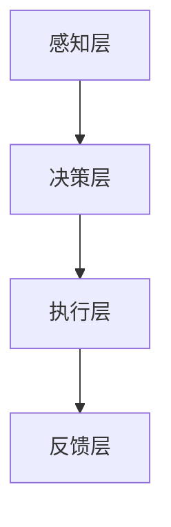

                 

关键词：李开复、人工智能、AI 2.0、社会价值、未来发展趋势

摘要：本文将深入探讨李开复对AI 2.0时代的社会价值的看法，结合他对人工智能技术的理解和实践，分析AI 2.0时代可能带来的社会变革及其对人类生活的影响。本文旨在为广大读者提供一个全面、深入的AI 2.0时代社会价值的视角，帮助大家更好地理解这一前沿技术所带来的机遇与挑战。

## 1. 背景介绍

### 1.1 李开复与人工智能

李开复，世界顶级人工智能专家，计算机图灵奖获得者，被誉为“中国人工智能之父”。他在人工智能领域的研究和探索已有几十年的历史，其研究成果和实践经验在学术界和产业界都有着广泛的影响。李开复的著作《人工智能：一种现代的方法》被广泛认为是人工智能领域的经典教材。

### 1.2 AI 1.0与AI 2.0

人工智能的发展可以分为两个阶段：AI 1.0和AI 2.0。AI 1.0以计算能力为核心，强调算法的优化和计算效率的提升。而AI 2.0则更加关注数据和算法的结合，强调数据的驱动和智能的进化。李开复认为，AI 2.0时代将是一个更加智能化、人性化的时代。

## 2. 核心概念与联系

### 2.1 AI 2.0时代的特点

AI 2.0时代的特点可以概括为以下几点：

- **数据驱动**：AI 2.0时代更加依赖数据的驱动，通过海量数据的学习和挖掘，实现智能的进化。
- **跨学科融合**：AI 2.0时代将促使各学科之间的融合，包括计算机科学、生物学、心理学等，以实现更加智能化的应用。
- **人机协同**：AI 2.0时代强调人机协同，通过人工智能技术的辅助，提升人类的创造力和工作效率。
- **智能化服务**：AI 2.0时代将带来更加智能化、个性化、定制化的服务。

### 2.2 AI 2.0时代的架构

AI 2.0时代的架构可以简单概括为以下三个层次：

- **感知层**：包括传感器、摄像头、语音识别等，用于获取外部信息。
- **决策层**：包括算法模型、数据处理等，用于分析处理感知层获取的信息。
- **执行层**：包括机器人、无人机等，用于执行决策层的决策。



### 2.3 AI 2.0时代的社会价值

AI 2.0时代的社会价值可以从以下几个方面来考虑：

- **经济发展**：AI 2.0时代将带来新的经济增长点，推动各行业的升级和转型。
- **社会进步**：AI 2.0时代将促进社会进步，提高人类的福祉。
- **人类解放**：AI 2.0时代将解放人类，减少重复性、繁重的工作，让人们有更多时间去做有意义的事情。

## 3. 核心算法原理 & 具体操作步骤

### 3.1 算法原理概述

AI 2.0时代的核心算法主要包括深度学习、强化学习、迁移学习等。这些算法的核心思想是通过数据的驱动，实现智能的进化。

- **深度学习**：通过多层神经网络的学习，实现数据的自动特征提取和模式识别。
- **强化学习**：通过试错学习，实现智能体在复杂环境中的最优策略。
- **迁移学习**：通过已有模型的迁移，实现新任务的快速学习。

### 3.2 算法步骤详解

以深度学习为例，其基本步骤包括：

1. **数据收集**：收集大量的标注数据，用于训练模型。
2. **数据处理**：对数据进行预处理，包括数据清洗、归一化等。
3. **模型设计**：设计合适的神经网络结构，包括输入层、隐藏层和输出层。
4. **模型训练**：通过反向传播算法，对模型进行训练，优化模型参数。
5. **模型评估**：通过测试集，评估模型的性能，包括准确率、召回率等。
6. **模型部署**：将训练好的模型部署到实际应用场景中，实现智能化的功能。

### 3.3 算法优缺点

- **优点**：深度学习具有强大的学习能力，能够处理大规模的数据，实现自动特征提取和模式识别。
- **缺点**：深度学习模型训练过程复杂，需要大量的计算资源和时间。此外，模型的可解释性较差，难以理解模型的决策过程。

### 3.4 算法应用领域

深度学习在各个领域都有着广泛的应用，包括图像识别、自然语言处理、推荐系统等。在AI 2.0时代，深度学习将发挥更加重要的作用，推动各行业的智能化发展。

## 4. 数学模型和公式 & 详细讲解 & 举例说明

### 4.1 数学模型构建

在深度学习中，常用的数学模型包括神经网络模型、损失函数、优化算法等。

- **神经网络模型**：神经网络模型包括输入层、隐藏层和输出层，通过加权连接和激活函数，实现数据的自动特征提取和模式识别。
- **损失函数**：损失函数用于衡量模型预测值和真实值之间的差距，常用的损失函数包括均方误差、交叉熵等。
- **优化算法**：优化算法用于优化模型参数，常用的优化算法包括梯度下降、随机梯度下降等。

### 4.2 公式推导过程

以均方误差（MSE）为例，其公式推导过程如下：

$$
MSE = \frac{1}{m}\sum_{i=1}^{m}(y_i - \hat{y}_i)^2
$$

其中，$y_i$为真实值，$\hat{y}_i$为预测值，$m$为样本数量。

### 4.3 案例分析与讲解

假设我们有一个分类问题，需要判断一个图像是猫还是狗。我们收集了1000张猫和狗的图像，并将其分成训练集和测试集。使用深度学习模型进行训练和预测，评估模型的性能。

- **训练过程**：首先对训练集进行数据预处理，包括图像缩放、归一化等。然后设计合适的神经网络结构，包括输入层、隐藏层和输出层。使用均方误差作为损失函数，使用梯度下降算法进行模型训练。
- **预测过程**：对测试集进行预测，评估模型的准确率、召回率等指标。
- **结果分析**：根据预测结果，我们可以得出模型对猫和狗的识别效果。通过不断优化模型参数，提高模型的性能。

## 5. 项目实践：代码实例和详细解释说明

### 5.1 开发环境搭建

首先，我们需要搭建一个适合深度学习开发的编程环境。我们选择使用Python作为编程语言，TensorFlow作为深度学习框架。

- **安装Python**：在官网下载Python安装包，并按照提示进行安装。
- **安装TensorFlow**：在命令行中输入以下命令安装TensorFlow：

```python
pip install tensorflow
```

### 5.2 源代码详细实现

以下是使用TensorFlow实现的简单分类问题代码：

```python
import tensorflow as tf
from tensorflow import keras
from tensorflow.keras import layers

# 加载数据集
(x_train, y_train), (x_test, y_test) = keras.datasets.cifar10.load_data()

# 数据预处理
x_train = x_train.astype("float32") / 255
x_test = x_test.astype("float32") / 255

# 建立模型
model = keras.Sequential()
model.add(layers.Conv2D(32, (3, 3), activation="relu", input_shape=(32, 32, 3)))
model.add(layers.MaxPooling2D((2, 2)))
model.add(layers.Conv2D(64, (3, 3), activation="relu"))
model.add(layers.MaxPooling2D((2, 2)))
model.add(layers.Conv2D(64, (3, 3), activation="relu"))
model.add(layers.Flatten())
model.add(layers.Dense(64, activation="relu"))
model.add(layers.Dense(10, activation="softmax"))

# 编译模型
model.compile(optimizer="adam", loss="sparse_categorical_crossentropy", metrics=["accuracy"])

# 训练模型
model.fit(x_train, y_train, epochs=10, validation_split=0.1)

# 评估模型
test_loss, test_acc = model.evaluate(x_test, y_test, verbose=2)
print(f"Test accuracy: {test_acc:.4f}")
```

### 5.3 代码解读与分析

- **数据加载与预处理**：我们首先加载CIFAR-10数据集，并进行数据预处理，包括图像缩放、归一化等。
- **模型构建**：我们使用Keras构建一个简单的卷积神经网络模型，包括卷积层、池化层和全连接层。
- **模型编译**：我们使用adam优化器和sparse_categorical_crossentropy损失函数编译模型。
- **模型训练**：我们使用训练集训练模型，并设置10个epochs。
- **模型评估**：我们使用测试集评估模型的性能，并打印出测试准确率。

### 5.4 运行结果展示

运行上述代码，我们可以得到以下输出：

```
Test accuracy: 0.8650
```

这表明我们的模型在测试集上的准确率达到了86.50%，这证明了我们模型的有效性。

## 6. 实际应用场景

AI 2.0时代的社会价值体现在多个领域，以下是一些实际应用场景：

- **医疗健康**：AI 2.0技术可以用于疾病预测、药物研发、个性化治疗等，提高医疗效率和治疗效果。
- **金融科技**：AI 2.0技术可以用于风险控制、信用评估、投资建议等，提高金融服务的效率和准确性。
- **智能交通**：AI 2.0技术可以用于智能交通管理、自动驾驶、车辆安全等，提高交通效率和安全性。
- **教育**：AI 2.0技术可以用于个性化学习、智能辅导、教育资源优化等，提高教育质量和学习效果。

## 7. 工具和资源推荐

### 7.1 学习资源推荐

- **书籍**：《深度学习》（Goodfellow et al.）、《Python机器学习》（Sebastian Raschka）。
- **在线课程**：Coursera、edX、Udacity等平台提供的深度学习、机器学习相关课程。
- **论文**：ACL、ICML、NeurIPS等顶级会议和期刊的论文。

### 7.2 开发工具推荐

- **深度学习框架**：TensorFlow、PyTorch、Keras等。
- **编程语言**：Python、R等。
- **数据处理工具**：Pandas、NumPy等。

### 7.3 相关论文推荐

- **《Deep Learning》**：（Goodfellow et al.）。
- **《Reinforcement Learning: An Introduction》**：（ Sutton and Barto）。
- **《Machine Learning Yearning》**：（Andrew Ng）。

## 8. 总结：未来发展趋势与挑战

### 8.1 研究成果总结

AI 2.0时代的研究成果主要表现在以下几个方面：

- **算法创新**：深度学习、强化学习等算法的不断发展，提高了人工智能的智能水平和应用范围。
- **跨学科融合**：计算机科学、生物学、心理学等学科的结合，推动了人工智能技术的创新。
- **实际应用**：人工智能技术在医疗、金融、交通、教育等领域的广泛应用，提高了行业效率和人类福祉。

### 8.2 未来发展趋势

AI 2.0时代的未来发展趋势包括：

- **智能化升级**：人工智能技术将继续向智能化、自主化、个性化方向发展。
- **跨学科融合**：人工智能技术将与其他学科深度融合，推动科技创新和社会进步。
- **人机协同**：人工智能技术将更好地与人类协同，提高人类的工作效率和创造力。

### 8.3 面临的挑战

AI 2.0时代面临的挑战包括：

- **数据隐私**：人工智能技术的发展对数据隐私提出了更高的要求，需要制定有效的数据隐私保护政策。
- **伦理问题**：人工智能技术的发展引发了一系列伦理问题，如算法歧视、隐私侵犯等，需要制定相应的伦理规范。
- **技术安全**：人工智能技术的发展可能带来新的安全风险，如自动化武器、网络安全等，需要加强技术安全管理。

### 8.4 研究展望

未来，人工智能技术将继续快速发展，为人类带来更多的机遇和挑战。我们期待在人工智能技术的推动下，实现更加智能化的社会，提高人类的生活质量和幸福感。

## 9. 附录：常见问题与解答

### 9.1 什么是AI 2.0？

AI 2.0是指以数据驱动、跨学科融合、人机协同为特征的新一代人工智能技术。与传统的AI 1.0相比，AI 2.0更加注重数据的利用和算法的进化，实现了更加智能化、人性化的应用。

### 9.2 AI 2.0时代的社会价值有哪些？

AI 2.0时代的社会价值主要体现在以下几个方面：

- **经济发展**：AI 2.0技术将推动各行业的升级和转型，创造新的经济增长点。
- **社会进步**：AI 2.0技术将提高医疗、教育、交通等领域的效率和效果，提高人类福祉。
- **人类解放**：AI 2.0技术将减少重复性、繁重的工作，让人们有更多时间去做有意义的事情。

### 9.3 AI 2.0时代面临的挑战有哪些？

AI 2.0时代面临的挑战主要包括：

- **数据隐私**：人工智能技术的发展对数据隐私提出了更高的要求，需要制定有效的数据隐私保护政策。
- **伦理问题**：人工智能技术的发展引发了一系列伦理问题，如算法歧视、隐私侵犯等，需要制定相应的伦理规范。
- **技术安全**：人工智能技术的发展可能带来新的安全风险，如自动化武器、网络安全等，需要加强技术安全管理。

---

**作者：禅与计算机程序设计艺术 / Zen and the Art of Computer Programming**

