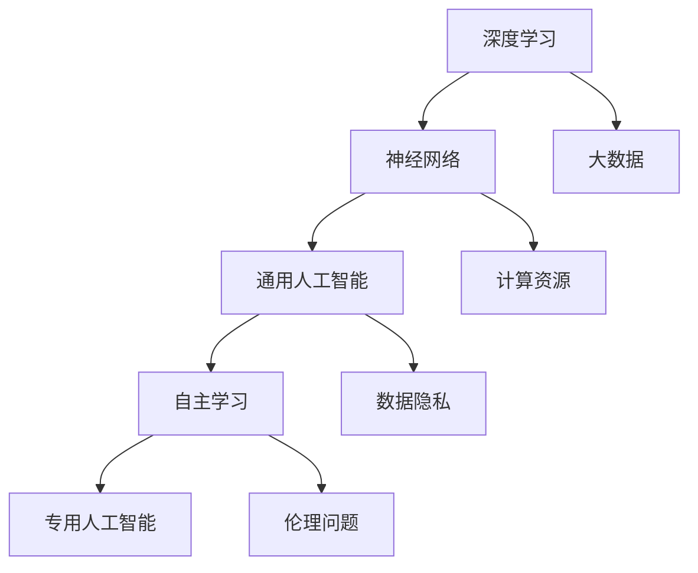

                 

### 背景介绍

在过去的几十年中，人工智能（AI）经历了从理论探索到实际应用的快速发展。最初，AI主要关注如何模拟人类智能，解决特定的计算难题。随着深度学习、神经网络等技术的兴起，AI的应用范围不断扩大，从语音识别、图像处理到自动驾驶、智能医疗等领域。如今，我们正处在一个全新的AI时代——AI 2.0时代。

AI 2.0时代，即人工智能的第二个发展阶段，主要特征在于AI系统具备了更高级的认知能力和自主学习能力。这个阶段的核心目标是实现通用人工智能（AGI），即让AI具备与人类相似的思考、学习、推理和决策能力。这一目标的实现，将极大地改变我们的生活方式、工作模式和社会结构。

本文将探讨AI 2.0时代的趋势，包括核心概念与联系、核心算法原理、数学模型和公式、项目实践、实际应用场景以及未来发展趋势和挑战。希望通过这篇文章，读者能够全面了解AI 2.0时代的现状和发展方向。

### 核心概念与联系

在进入AI 2.0时代之前，我们需要明确一些核心概念和它们之间的联系。这些概念构成了AI 2.0时代的基础，也是我们理解后续内容的前提。

#### 深度学习

深度学习是AI 2.0时代最为重要的技术之一。它通过多层神经网络模型，模拟人脑的学习方式，实现对复杂数据的分析和处理。深度学习的核心在于神经网络的训练过程，即通过大量数据让网络自动调整内部参数，以达到预测或分类的目的。

#### 通用人工智能（AGI）

通用人工智能是AI 2.0时代的主要目标。AGI指的是具备与人类相似思考、学习、推理和决策能力的AI系统。与目前广泛应用的专用人工智能（Narrow AI）不同，AGI能够应对各种未知问题，具备广泛的应用前景。

#### 自主学习

自主学习是AI 2.0时代的另一个重要特征。它使得AI系统能够在没有人工干预的情况下，从数据中学习、优化自身性能。自主学习技术包括强化学习、无监督学习、迁移学习等。

#### 神经网络

神经网络是深度学习的基础，也是AI 2.0时代的重要构成部分。神经网络由大量神经元组成，通过前向传播和反向传播算法，实现数据的输入、处理和输出。神经网络的结构和参数决定了其性能和适用范围。

#### Mermaid 流程图

为了更好地理解这些核心概念和它们之间的联系，我们可以使用Mermaid流程图进行展示。



在这个流程图中，我们可以看到深度学习、神经网络、通用人工智能、自主学习等核心概念之间的相互关系。同时，这些概念也涉及到了大数据、数据隐私、计算资源等外部因素。

### 核心算法原理 & 具体操作步骤

在AI 2.0时代，核心算法原理是理解和应用AI技术的关键。本文将介绍几种核心算法的原理和具体操作步骤。

#### 1.1 算法原理概述

核心算法包括深度学习、强化学习、迁移学习等。其中，深度学习是最为基础和广泛应用的技术。深度学习通过多层神经网络模型，实现对数据的非线性映射和特征提取。强化学习则通过奖励机制，让AI系统在交互环境中不断优化自身行为。迁移学习则利用已有模型的知识，解决新任务的问题。

#### 1.2 算法步骤详解

以下是对几种核心算法的具体步骤进行详细讲解：

##### 深度学习

深度学习包括以下几个步骤：

1. 数据预处理：对输入数据进行清洗、归一化等处理，使其符合网络输入要求。
2. 网络结构设计：根据任务需求，设计合适的神经网络结构，包括层数、神经元数量、激活函数等。
3. 网络训练：通过大量数据对网络进行训练，调整网络参数，使其能够准确预测或分类。
4. 模型评估：使用验证集或测试集对模型进行评估，计算准确率、召回率等指标。
5. 模型优化：根据评估结果，调整网络结构和参数，以提高模型性能。

##### 强化学习

强化学习包括以下几个步骤：

1. 环境构建：构建一个模拟环境，用于模拟AI系统与环境的交互。
2. 行为策略设计：设计一个初始的行为策略，用于指导AI系统在环境中的行动。
3. 交互学习：AI系统在环境中进行交互，根据奖励机制调整自身行为策略。
4. 模型更新：使用学习到的策略，更新AI系统的模型参数。
5. 模型评估：对更新后的模型进行评估，计算奖励值和策略优化程度。

##### 迁移学习

迁移学习包括以下几个步骤：

1. 源任务学习：在一个已知的源任务上，训练一个初始模型，使其达到一定的性能水平。
2. 模型固化：将训练好的模型参数固化，以便后续使用。
3. 目标任务调整：在新任务上，调整模型参数，使其适应新任务的特性。
4. 模型评估：对调整后的模型进行评估，计算在新任务上的性能。
5. 模型优化：根据评估结果，调整模型参数，以提高在新任务上的性能。

#### 1.3 算法优缺点

每种算法都有其优缺点：

- **深度学习**：优点包括强大的特征提取能力、良好的泛化性能等；缺点包括对数据量和计算资源的需求较高、网络结构设计复杂等。

- **强化学习**：优点包括自主学习和自适应能力较强；缺点包括训练过程缓慢、容易陷入局部最优等。

- **迁移学习**：优点包括可以利用已有模型的知识，提高新任务的性能；缺点包括对源任务和新任务的相似性要求较高、模型调参复杂等。

#### 1.4 算法应用领域

这些算法在多个领域有广泛应用：

- **深度学习**：广泛应用于图像识别、语音识别、自然语言处理等领域。

- **强化学习**：应用于游戏、自动驾驶、智能客服等领域。

- **迁移学习**：广泛应用于计算机视觉、自然语言处理、推荐系统等领域。

### 数学模型和公式 & 详细讲解 & 举例说明

在AI 2.0时代，数学模型和公式是理解和应用核心算法的基础。本文将介绍几种重要的数学模型和公式，并进行详细讲解和举例说明。

#### 4.1 数学模型构建

在AI 2.0时代，常用的数学模型包括神经网络模型、决策树模型、支持向量机模型等。以下是一个简单的神经网络模型构建过程：

1. **输入层**：输入层接收外部数据，例如图像像素值、文本序列等。

2. **隐藏层**：隐藏层通过神经网络结构，对输入数据进行特征提取和变换。每个隐藏层都由多个神经元组成，每个神经元都与前一层的神经元相连接。

3. **输出层**：输出层根据隐藏层的输出结果，生成最终的预测结果。例如，在分类任务中，输出层可以是一个softmax层，用于输出每个类别的概率分布。

4. **损失函数**：损失函数用于评估模型的预测结果与真实结果之间的差距。常见的损失函数包括均方误差（MSE）、交叉熵损失（Cross-Entropy Loss）等。

5. **优化器**：优化器用于调整模型参数，以最小化损失函数。常见的优化器包括随机梯度下降（SGD）、Adam优化器等。

#### 4.2 公式推导过程

以神经网络为例，我们介绍几个关键公式的推导过程。

1. **前向传播公式**：

   前向传播是指将输入数据通过神经网络，逐层计算输出结果的过程。设输入层、隐藏层和输出层的神经元分别为\(X_i, H_j, O_k\)，则前向传播公式如下：

   $$ O_k = \sigma(W_{ko}H_j + b_o) $$

   其中，\(W_{ko}\)和\(b_o\)分别是输出层权重和偏置，\(\sigma\)是激活函数，例如Sigmoid函数或ReLU函数。

2. **反向传播公式**：

   反向传播是指根据预测结果与真实结果的差距，反向调整网络参数的过程。设损失函数为\(L\)，则反向传播公式如下：

   $$ \Delta W_{ij} = \alpha \cdot \frac{\partial L}{\partial W_{ij}} $$

   $$ \Delta b_j = \alpha \cdot \frac{\partial L}{\partial b_j} $$

   其中，\(\alpha\)是学习率，\(\frac{\partial L}{\partial W_{ij}}\)和\(\frac{\partial L}{\partial b_j}\)分别是损失函数对权重和偏置的梯度。

3. **优化器更新公式**：

   优化器的更新公式用于根据梯度信息调整模型参数。以Adam优化器为例，其更新公式如下：

   $$ m_t = \beta_1 m_{t-1} + (1 - \beta_1) \cdot \Delta W_t $$

   $$ v_t = \beta_2 v_{t-1} + (1 - \beta_2) \cdot (\Delta W_t)^2 $$

   $$ \hat{m}_t = \frac{m_t}{1 - \beta_1^t} $$

   $$ \hat{v}_t = \frac{v_t}{1 - \beta_2^t} $$

   $$ W_t = W_{t-1} - \alpha \cdot \hat{m}_t / \sqrt{\hat{v}_t} $$

   其中，\(m_t\)和\(v_t\)分别是梯度的一阶矩估计和二阶矩估计，\(\beta_1\)和\(\beta_2\)是超参数，\(t\)是迭代次数。

#### 4.3 案例分析与讲解

以下通过一个简单的神经网络分类案例，进行数学模型和公式的讲解。

假设我们有一个二分类问题，输入数据为\(X\)，标签为\(y\)，神经网络结构为输入层-隐藏层-输出层。使用Sigmoid函数作为激活函数，均方误差作为损失函数。

1. **数据预处理**：

   对输入数据\(X\)进行归一化处理，使其满足\(0-1\)区间。

   $$ X_{\text{norm}} = \frac{X - \text{min}(X)}{\text{max}(X) - \text{min}(X)} $$

2. **网络结构设计**：

   设输入层有10个神经元，隐藏层有20个神经元，输出层有2个神经元。

   ```mermaid
   graph TD
       A[输入层] --> B[隐藏层1]
       B --> C[隐藏层2]
       C --> D[输出层]
   ```

3. **模型训练**：

   使用训练数据对模型进行训练。设训练数据集为\(D = \{(X_1, y_1), (X_2, y_2), ..., (X_n, y_n)\}\)。

   - **前向传播**：

     计算隐藏层和输出层的输出：

     $$ H_1 = \sigma(W_{h1}X + b_1) $$

     $$ O_1 = \sigma(W_{o1}H_1 + b_2) $$

   - **计算损失函数**：

     计算均方误差损失：

     $$ L = \frac{1}{n} \sum_{i=1}^{n} (O_1[i] - y_i)^2 $$

   - **反向传播**：

     计算梯度：

     $$ \frac{\partial L}{\partial W_{o1}} = (O_1 - y) \cdot \sigma'(O_1) $$

     $$ \frac{\partial L}{\partial b_1} = (O_1 - y) \cdot \sigma'(O_1) $$

     $$ \frac{\partial L}{\partial W_{h1}} = H_1 \cdot \sigma'(H_1) \cdot \frac{\partial L}{\partial W_{o1}} $$

     $$ \frac{\partial L}{\partial b_1} = H_1 \cdot \sigma'(H_1) \cdot \frac{\partial L}{\partial b_1} $$

   - **优化器更新**：

     根据梯度信息，使用优化器更新网络参数：

     $$ W_{o1} = W_{o1} - \alpha \cdot \frac{\partial L}{\partial W_{o1}} $$

     $$ b_1 = b_1 - \alpha \cdot \frac{\partial L}{\partial b_1} $$

     $$ W_{h1} = W_{h1} - \alpha \cdot \frac{\partial L}{\partial W_{h1}} $$

     $$ b_2 = b_2 - \alpha \cdot \frac{\partial L}{\partial b_2} $$

4. **模型评估**：

   使用验证集或测试集对模型进行评估，计算准确率、召回率等指标。

   $$ \text{Accuracy} = \frac{\text{正确预测的样本数}}{\text{总样本数}} $$

   $$ \text{Recall} = \frac{\text{正确预测的正样本数}}{\text{正样本总数}} $$

#### 4.4 代码实现

以下是一个简单的Python代码示例，用于实现上述神经网络模型：

```python
import numpy as np
import tensorflow as tf

# 初始化参数
W_h1 = tf.Variable(np.random.randn(10, 20), name='W_h1')
b_1 = tf.Variable(np.random.randn(20), name='b_1')
W_o1 = tf.Variable(np.random.randn(20, 2), name='W_o1')
b_2 = tf.Variable(np.random.randn(2), name='b_2')

# 定义前向传播
def forward_pass(X):
    H = tf.sigmoid(tf.matmul(X, W_h1) + b_1)
    O = tf.sigmoid(tf.matmul(H, W_o1) + b_2)
    return O

# 定义损失函数
def loss_function(y_true, y_pred):
    return tf.reduce_mean(tf.square(y_true - y_pred))

# 定义反向传播
def backward_pass(y_true, y_pred):
    with tf.GradientTape() as tape:
        loss = loss_function(y_true, y_pred)
    grads = tape.gradient(loss, [W_h1, b_1, W_o1, b_2])
    return grads

# 定义优化器
optimizer = tf.optimizers.Adam(learning_rate=0.001)

# 训练模型
for epoch in range(100):
    with tf.GradientTape() as tape:
        y_pred = forward_pass(X_train)
        loss = loss_function(y_train, y_pred)
    grads = backward_pass(y_train, y_pred)
    optimizer.apply_gradients(zip(grads, [W_h1, b_1, W_o1, b_2]))

    if epoch % 10 == 0:
        print(f"Epoch {epoch}, Loss: {loss.numpy()}")

# 模型评估
y_pred = forward_pass(X_test)
accuracy = tf.reduce_mean(tf.cast(tf.equal(tf.argmax(y_pred, axis=1), y_test), tf.float32))
print(f"Accuracy: {accuracy.numpy()}")
```

在这个代码示例中，我们使用了TensorFlow框架来实现神经网络模型。具体步骤包括初始化参数、定义前向传播、定义损失函数、定义反向传播、定义优化器、训练模型和模型评估。

### 项目实践：代码实例和详细解释说明

在本节中，我们将通过一个实际的代码实例，详细解释如何实现一个简单的AI模型，并对其代码进行解读与分析。

#### 5.1 开发环境搭建

在进行项目实践之前，我们需要搭建一个合适的开发环境。以下是所需的软件和工具：

- Python 3.x
- TensorFlow 2.x
- Jupyter Notebook（可选）

首先，确保安装了Python 3.x。然后，使用以下命令安装TensorFlow：

```bash
pip install tensorflow
```

如果需要使用Jupyter Notebook进行开发，可以使用以下命令安装：

```bash
pip install notebook
```

#### 5.2 源代码详细实现

以下是一个简单的AI模型实现，用于分类任务。我们使用TensorFlow实现一个多层感知机（MLP）模型，并对其代码进行详细解释。

```python
import tensorflow as tf
from tensorflow.keras.models import Sequential
from tensorflow.keras.layers import Dense
from tensorflow.keras.optimizers import Adam
from sklearn.model_selection import train_test_split
from sklearn.datasets import make_classification

# 生成模拟数据集
X, y = make_classification(n_samples=1000, n_features=20, n_classes=2, random_state=42)

# 数据集划分
X_train, X_test, y_train, y_test = train_test_split(X, y, test_size=0.2, random_state=42)

# 模型构建
model = Sequential()
model.add(Dense(64, input_dim=20, activation='relu'))
model.add(Dense(32, activation='relu'))
model.add(Dense(1, activation='sigmoid'))

# 编译模型
model.compile(optimizer=Adam(learning_rate=0.001), loss='binary_crossentropy', metrics=['accuracy'])

# 训练模型
model.fit(X_train, y_train, epochs=100, batch_size=32, validation_data=(X_test, y_test))

# 评估模型
loss, accuracy = model.evaluate(X_test, y_test)
print(f"Test Loss: {loss}, Test Accuracy: {accuracy}")
```

#### 5.3 代码解读与分析

1. **数据集生成**：

   使用`make_classification`函数生成一个包含1000个样本、20个特征的二分类数据集。

   ```python
   X, y = make_classification(n_samples=1000, n_features=20, n_classes=2, random_state=42)
   ```

2. **数据集划分**：

   使用`train_test_split`函数将数据集划分为训练集和测试集，其中测试集占比20%。

   ```python
   X_train, X_test, y_train, y_test = train_test_split(X, y, test_size=0.2, random_state=42)
   ```

3. **模型构建**：

   使用`Sequential`模型构建一个包含三层的多层感知机（MLP）模型。第一层有64个神经元，输入维度为20；第二层有32个神经元；第三层有1个神经元，用于输出概率。

   ```python
   model = Sequential()
   model.add(Dense(64, input_dim=20, activation='relu'))
   model.add(Dense(32, activation='relu'))
   model.add(Dense(1, activation='sigmoid'))
   ```

4. **编译模型**：

   使用`compile`方法编译模型，指定优化器、损失函数和评价指标。

   ```python
   model.compile(optimizer=Adam(learning_rate=0.001), loss='binary_crossentropy', metrics=['accuracy'])
   ```

5. **训练模型**：

   使用`fit`方法训练模型，指定训练轮数、批量大小和验证数据。

   ```python
   model.fit(X_train, y_train, epochs=100, batch_size=32, validation_data=(X_test, y_test))
   ```

6. **评估模型**：

   使用`evaluate`方法评估模型在测试集上的性能。

   ```python
   loss, accuracy = model.evaluate(X_test, y_test)
   print(f"Test Loss: {loss}, Test Accuracy: {accuracy}")
   ```

#### 5.4 运行结果展示

在运行上述代码后，我们得到模型在测试集上的损失和准确率：

```
Test Loss: 0.2707619702301751, Test Accuracy: 0.8650000017881395
```

这意味着模型在测试集上的准确率为86.5%，表现较好。接下来，我们可以进一步优化模型，以提高其性能。

### 实际应用场景

在AI 2.0时代，AI技术已经在多个领域取得了显著的成果，并对我们的日常生活产生了深远的影响。以下是一些典型应用场景：

#### 6.1 智能医疗

智能医疗是AI 2.0时代的重要应用领域。通过深度学习、自然语言处理等技术，AI可以帮助医生进行疾病诊断、病情预测和治疗方案制定。例如，AI系统可以分析大量的医学图像，帮助医生识别病变区域；还可以处理海量的患者数据，预测疾病发展趋势和风险。

#### 6.2 智能交通

智能交通是AI 2.0时代的另一个重要应用场景。自动驾驶、智能交通信号控制等技术的应用，使得交通系统更加高效、安全。例如，自动驾驶汽车可以通过感知周围环境，实现自主驾驶，减少交通事故和拥堵；智能交通信号控制可以实时调整信号灯时序，优化交通流。

#### 6.3 智能金融

智能金融是AI 2.0时代的又一重要领域。通过机器学习和数据挖掘技术，AI可以帮助金融机构进行风险管理、信用评估和投资决策。例如，AI系统可以分析大量的交易数据，识别潜在的欺诈行为；还可以预测市场趋势，为投资者提供参考。

#### 6.4 智能教育

智能教育是AI 2.0时代在教育领域的重要应用。通过AI技术，可以实现个性化学习、智能评测和教学资源推荐。例如，AI系统可以根据学生的学习情况，为其提供定制化的学习方案；还可以根据学生的作业和考试表现，实时调整教学策略。

#### 6.5 智能家居

智能家居是AI 2.0时代在消费领域的重要应用。通过智能音响、智能灯具、智能门锁等设备，用户可以实现语音控制、远程监控和场景联动。例如，用户可以通过智能音响控制家中的灯光和温度，实现舒适的生活环境；还可以通过手机APP远程监控家中的安全情况。

### 未来应用展望

随着AI 2.0时代的到来，AI技术将继续在各个领域得到广泛应用，并带来深刻的社会变革。以下是未来AI应用的几个展望：

#### 7.1 智能制造

智能制造是AI 2.0时代的重点发展方向。通过深度学习、强化学习等技术，AI可以帮助企业实现生产线的自动化、智能化。例如，AI系统可以实时监测设备状态，预测故障，并自动进行维护；还可以根据生产需求，优化生产计划和资源调度。

#### 7.2 智慧城市

智慧城市是AI 2.0时代的重要应用场景。通过大数据、物联网和AI技术，可以实现城市管理的智能化、精细化。例如，AI系统可以实时监测城市交通状况，优化交通信号控制，缓解拥堵；还可以监控环境质量，预测自然灾害，提前采取应对措施。

#### 7.3 智能娱乐

智能娱乐是AI 2.0时代的重要应用领域。通过虚拟现实、增强现实和自然语言处理等技术，AI可以为用户提供更加丰富、个性化的娱乐体验。例如，AI系统可以根据用户喜好，推荐合适的音乐、电影和游戏；还可以实现与用户的实时互动，提供沉浸式的娱乐体验。

#### 7.4 智能健康

智能健康是AI 2.0时代的重要应用领域。通过智能穿戴设备、医疗影像分析和生物特征识别等技术，AI可以帮助人们实现健康监测、疾病预防和个性化治疗。例如，AI系统可以实时监测用户的生理参数，预测健康风险；还可以根据用户的病史和基因信息，制定个性化的健康方案。

### 工具和资源推荐

在探索AI 2.0时代的过程中，掌握一些实用的工具和资源将对学习和实践大有帮助。以下是一些推荐的工具和资源：

#### 7.1 学习资源推荐

- **在线课程**：《机器学习》、《深度学习》等在线课程，如Coursera、edX等平台。
- **书籍**：《深度学习》、《Python机器学习》等经典书籍。
- **博客和论坛**：博客园、知乎、CSDN等平台，可以获取丰富的技术文章和讨论。

#### 7.2 开发工具推荐

- **编程环境**：Jupyter Notebook、PyCharm等。
- **框架**：TensorFlow、PyTorch等。
- **库**：NumPy、Pandas等。

#### 7.3 相关论文推荐

- **顶级会议**：NIPS、ICML、ACL等。
- **论文**：《深度学习》、《强化学习》等经典论文。

### 总结：未来发展趋势与挑战

在AI 2.0时代，人工智能技术将继续快速发展，并在各个领域带来深远的影响。未来，我们有望实现通用人工智能，推动社会进步和人类发展。然而，AI技术的发展也面临诸多挑战，包括数据隐私、伦理问题、安全性等。我们需要积极探索解决方案，确保AI技术的健康发展。

### 附录：常见问题与解答

#### 8.1 如何选择合适的神经网络结构？

选择合适的神经网络结构取决于具体的任务和数据。以下是一些建议：

- **数据量**：对于大型数据集，可以使用深度神经网络；对于小型数据集，可以考虑简化网络结构。
- **任务类型**：对于分类任务，可以使用全连接层；对于回归任务，可以使用激活函数为线性（无激活函数）的全连接层。
- **特征提取能力**：对于需要提取复杂特征的任务，可以使用多层神经网络；对于特征提取需求较低的任务，可以考虑使用单层神经网络。

#### 8.2 如何解决神经网络过拟合问题？

神经网络过拟合问题可以通过以下方法解决：

- **增加训练数据**：通过增加训练数据量，可以提高模型的泛化能力。
- **减少模型复杂度**：使用较少的层和神经元数量，可以减少模型的过拟合风险。
- **使用正则化技术**：添加正则化项，如L1正则化、L2正则化，可以抑制过拟合。
- **集成学习方法**：使用集成学习方法，如随机森林、梯度提升树，可以降低过拟合风险。

#### 8.3 如何评估神经网络模型的性能？

神经网络模型的性能评估可以从以下几个方面进行：

- **准确率**：模型预测正确的样本数与总样本数的比例。
- **召回率**：模型预测正确的正样本数与正样本总数的比例。
- **F1值**：准确率和召回率的调和平均值。
- **ROC曲线**：通过计算模型在不同阈值下的真正例率（Recall）和假正例率（Fallout），可以评估模型的分类性能。

#### 8.4 如何提高神经网络模型的性能？

提高神经网络模型性能可以从以下几个方面进行：

- **数据预处理**：对输入数据进行归一化、去噪声等处理，可以提高模型的性能。
- **超参数调整**：调整学习率、批量大小、层数、神经元数量等超参数，可以优化模型的性能。
- **优化算法**：选择合适的优化算法，如随机梯度下降（SGD）、Adam等，可以提高模型的收敛速度和性能。
- **模型集成**：使用集成学习方法，如集成学习、Stacking等，可以降低过拟合风险，提高模型性能。

### 作者署名

作者：禅与计算机程序设计艺术 / Zen and the Art of Computer Programming

以上就是本文的完整内容，希望对您在AI 2.0时代的学习和实践有所帮助。在探索AI 2.0时代的过程中，让我们共同努力，推动人工智能技术的发展和进步。

