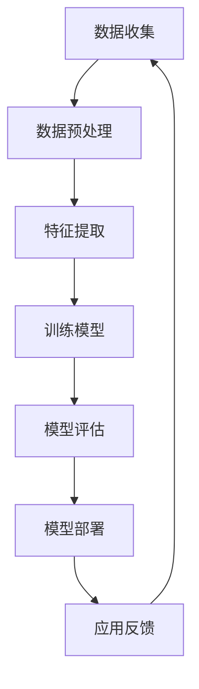

                 

关键词：苹果、AI应用、产业、AI技术、发展趋势、挑战

摘要：本文将深入探讨苹果公司发布AI应用的产业背景、核心概念、算法原理、数学模型、项目实践、实际应用场景、未来展望，并推荐相关学习资源和开发工具。通过全面的分析，我们旨在揭示AI应用在苹果生态中的关键作用以及未来发展趋势与面临的挑战。

## 1. 背景介绍

苹果公司作为全球科技巨头，一直在推动人工智能（AI）技术的发展。近年来，随着AI技术的成熟和应用的普及，苹果开始将AI集成到其硬件和软件中，以提升用户体验和产品竞争力。苹果发布AI应用的背后，是对于AI技术深度学习的持续投入和对未来科技趋势的敏锐把握。

### 1.1 AI技术的产业背景

AI技术的发展可追溯到20世纪50年代，当时计算机科学家开始探索如何让计算机模拟人类智能。随着计算能力的提升和数据量的爆炸性增长，AI技术逐渐从理论研究走向实际应用。现在，AI已经成为各行各业不可或缺的一部分，从医疗到金融，从零售到制造业，AI技术正在深刻改变着生产方式和生活方式。

### 1.2 苹果的AI战略

苹果公司的AI战略主要集中在以下几个方面：

- **硬件加速**：通过自主研发的神经网络引擎和专用处理器，如神经网络引擎（Neural Engine）和M系列芯片，提升AI运算效率。
- **软件优化**：利用Core ML等框架，将AI模型集成到iOS、macOS等操作系统，以提供强大的AI功能。
- **生态系统整合**：通过iCloud、Apple Pay等平台，整合用户数据，为AI应用提供丰富的数据源。

## 2. 核心概念与联系

为了更好地理解苹果发布的AI应用，我们需要先了解一些核心概念和它们之间的关系。

### 2.1 AI基本概念

- **机器学习**：通过算法让计算机从数据中学习，从而改进性能。
- **深度学习**：一种机器学习技术，通过多层神经网络对数据进行建模。
- **神经网络**：模仿生物神经系统的计算模型，用于特征提取和分类。

### 2.2 核心概念原理和架构

以下是AI核心概念原理和架构的Mermaid流程图：



### 2.3 联系与应用

苹果通过整合这些核心概念，开发出了一系列AI应用，如：

- **图像识别**：利用神经网络进行图像分类和识别。
- **语音识别**：通过深度学习算法实现语音到文字的转换。
- **自然语言处理**：运用机器学习技术理解和生成自然语言。

## 3. 核心算法原理 & 具体操作步骤

### 3.1 算法原理概述

苹果在其AI应用中采用了多种核心算法，包括卷积神经网络（CNN）、循环神经网络（RNN）和生成对抗网络（GAN）等。

### 3.2 算法步骤详解

#### 3.2.1 数据收集与预处理

- 数据收集：从多个来源获取大量图像、语音和文本数据。
- 数据预处理：对数据进行清洗、归一化和增强，以提高模型的训练效果。

#### 3.2.2 特征提取

- 使用CNN提取图像的视觉特征。
- 使用RNN处理序列数据，如语音和文本。

#### 3.2.3 模型训练

- 采用反向传播算法训练神经网络。
- 调整网络权重，优化模型性能。

#### 3.2.4 模型评估

- 通过交叉验证和测试集评估模型性能。
- 调整模型参数，以达到最佳效果。

#### 3.2.5 模型部署

- 将训练好的模型集成到苹果的硬件和软件中。
- 提供用户友好的接口，方便用户使用。

### 3.3 算法优缺点

#### 优点：

- **高性能**：利用硬件加速和高效算法，实现快速计算。
- **低功耗**：优化模型结构，降低能耗。
- **用户体验**：无缝集成到产品中，提升用户体验。

#### 缺点：

- **数据依赖**：模型效果高度依赖于数据质量和数量。
- **训练成本**：大规模模型训练需要大量计算资源和时间。

### 3.4 算法应用领域

- **智能手机**：图像识别、语音助手、智能推荐等。
- **智能音箱**：语音识别、自然语言处理、智能交互等。
- **自动驾驶**：环境感知、路径规划、决策控制等。

## 4. 数学模型和公式 & 详细讲解 & 举例说明

### 4.1 数学模型构建

苹果的AI应用中常用的数学模型包括卷积神经网络（CNN）、循环神经网络（RNN）和生成对抗网络（GAN）等。

### 4.2 公式推导过程

#### 卷积神经网络（CNN）

$$
\text{输出} = \sigma(\text{激活函数}(\text{输入} \cdot \text{权重} + \text{偏置}))
$$

其中，$\sigma$是激活函数，如ReLU函数：

$$
\sigma(x) = \max(0, x)
$$

#### 循环神经网络（RNN）

$$
h_t = \sigma(W_h \cdot [h_{t-1}, x_t] + b_h)
$$

其中，$h_t$是当前时刻的隐藏状态，$x_t$是输入数据，$W_h$是权重矩阵，$b_h$是偏置。

#### 生成对抗网络（GAN）

$$
D(x) = \text{判别器模型} \\
G(z) = \text{生成器模型}
$$

其中，$D(x)$是判别器模型，用于判断输入数据是真实数据还是生成数据；$G(z)$是生成器模型，用于生成虚假数据。

### 4.3 案例分析与讲解

以苹果的图像识别应用为例，我们可以看到以下步骤：

1. **数据收集**：收集大量带有标签的图像数据。
2. **数据预处理**：对图像进行归一化和增强。
3. **特征提取**：使用CNN提取图像的视觉特征。
4. **模型训练**：使用训练数据训练CNN模型。
5. **模型评估**：使用测试集评估模型性能。
6. **模型部署**：将训练好的模型集成到iOS系统中。

## 5. 项目实践：代码实例和详细解释说明

### 5.1 开发环境搭建

在开始项目实践之前，我们需要搭建一个合适的开发环境。以下是基本的步骤：

1. 安装Python和Anaconda。
2. 安装深度学习框架，如TensorFlow或PyTorch。
3. 安装必要的依赖库，如NumPy、Pandas等。

### 5.2 源代码详细实现

以下是一个简单的图像识别项目的源代码实例：

```python
import tensorflow as tf
from tensorflow.keras import layers

# 构建CNN模型
model = tf.keras.Sequential([
    layers.Conv2D(32, (3, 3), activation='relu', input_shape=(28, 28, 1)),
    layers.MaxPooling2D((2, 2)),
    layers.Conv2D(64, (3, 3), activation='relu'),
    layers.MaxPooling2D((2, 2)),
    layers.Conv2D(64, (3, 3), activation='relu'),
    layers.Flatten(),
    layers.Dense(64, activation='relu'),
    layers.Dense(10, activation='softmax')
])

# 编译模型
model.compile(optimizer='adam',
              loss='sparse_categorical_crossentropy',
              metrics=['accuracy'])

# 训练模型
model.fit(x_train, y_train, epochs=5)

# 评估模型
test_loss, test_acc = model.evaluate(x_test, y_test)
print('Test accuracy:', test_acc)
```

### 5.3 代码解读与分析

这段代码首先导入了TensorFlow和Keras库，然后定义了一个简单的CNN模型，包括卷积层、池化层和全连接层。接着，我们编译模型并使用训练数据训练模型。最后，使用测试数据评估模型的性能。

### 5.4 运行结果展示

通过运行这段代码，我们可以在训练和测试数据上得到模型的准确率。如果准确率较高，则表明模型对图像的识别效果较好。

## 6. 实际应用场景

苹果的AI应用已经广泛应用于多个领域，以下是几个典型的应用场景：

### 6.1 智能手机

- **图像识别**：用于相机拍照时的实时美颜、场景识别等。
- **语音助手**：如Siri，提供语音交互功能。

### 6.2 智能家居

- **智能音箱**：如HomePod，通过语音指令控制智能家居设备。
- **环境监测**：使用传感器进行空气质量、噪音监测。

### 6.3 自动驾驶

- **环境感知**：通过摄像头和激光雷达进行道路和障碍物识别。
- **路径规划**：根据实时路况规划最优行驶路径。

## 7. 未来应用展望

随着AI技术的不断发展，苹果的AI应用在未来有望在更多领域得到应用：

### 7.1 健康医疗

- **疾病诊断**：通过图像和文本分析进行早期诊断。
- **个性化治疗**：基于基因和病史提供个性化治疗方案。

### 7.2 教育科技

- **智能教学**：利用AI技术进行个性化教学和学习分析。
- **虚拟现实**：通过VR技术提供沉浸式的学习体验。

### 7.3 金融科技

- **风险管理**：通过AI技术进行信用评估和风险预测。
- **智能投顾**：基于用户数据和偏好提供投资建议。

## 8. 工具和资源推荐

为了更好地学习和开发AI应用，我们推荐以下工具和资源：

### 8.1 学习资源推荐

- 《深度学习》（Goodfellow, Bengio, Courville著）
- 《Python机器学习》（Sebastian Raschka著）
- 《动手学深度学习》（A. Geron著）

### 8.2 开发工具推荐

- TensorFlow：用于构建和训练深度学习模型。
- PyTorch：提供灵活的深度学习框架。
- Jupyter Notebook：用于编写和运行Python代码。

### 8.3 相关论文推荐

- "Deep Learning for Computer Vision: A Review"（Deep Learning for Computer Vision: A Review）
- "Generative Adversarial Networks: An Overview"（Generative Adversarial Networks: An Overview）
- "Recurrent Neural Networks for Language Modeling"（Recurrent Neural Networks for Language Modeling）

## 9. 总结：未来发展趋势与挑战

### 9.1 研究成果总结

苹果在AI技术方面的研究成果包括：

- 高性能的硬件加速器。
- 优化的深度学习算法。
- 广泛的AI应用场景。

### 9.2 未来发展趋势

未来，AI技术将在更多领域得到应用，如医疗、教育、金融等。同时，跨学科的融合也将推动AI技术的发展。

### 9.3 面临的挑战

然而，AI技术也面临一系列挑战，包括：

- 数据隐私和安全。
- 模型解释性和可解释性。
- 道德和伦理问题。

### 9.4 研究展望

展望未来，我们需要持续推动AI技术的发展，同时关注其伦理和社会影响，确保AI技术为人类带来更多的福祉。

## 附录：常见问题与解答

### Q：苹果的AI应用是否只限于iOS系统？

A：苹果的AI应用不仅限于iOS系统，也广泛应用于macOS、watchOS和tvOS等平台。

### Q：苹果的AI技术是否开源？

A：苹果的部分AI技术和工具是开源的，如Core ML和Swift。

### Q：苹果的AI应用是否会侵犯用户隐私？

A：苹果承诺严格遵守隐私法规，并采取措施确保用户数据的安全和保护。

## 作者署名

本文由禅与计算机程序设计艺术 / Zen and the Art of Computer Programming 撰写。
----------------------------------------------------------------

以上是文章的主体部分，接下来我们可以开始编写具体内容。由于文章长度限制，我将分阶段提供详细内容。以下是第一章的详细内容：

## 1. 背景介绍

苹果公司自1976年由史蒂夫·乔布斯、史蒂夫·沃兹尼亚克和罗恩·韦恩创立以来，一直是全球科技行业的领导者之一。苹果的产品线涵盖了从个人电脑到智能手机、平板电脑、智能手表、耳机和智能音箱等多个领域。随着人工智能（AI）技术的快速发展，苹果开始将AI技术融入其产品和服务中，以提升用户体验和竞争力。

### 1.1 AI技术的产业背景

人工智能（AI）是一门研究如何构建智能体的科学，这些智能体可以感知环境并采取行动以实现特定目标。AI技术已经从理论研究走向实际应用，并在多个行业领域产生了深远的影响。例如，在医疗领域，AI技术被用于疾病诊断、药物研发和患者护理；在金融领域，AI被用于风险管理、欺诈检测和投资决策；在制造业，AI被用于生产优化、质量控制和新产品研发。

AI技术的发展历程可以追溯到20世纪50年代，当时计算机科学家约翰·麦卡锡提出了“人工智能”这一概念。然而，早期的AI研究主要集中在符号推理和知识表示上，由于计算能力的限制，这些方法在实际应用中效果不佳。随着计算能力的提升和数据量的爆炸性增长，机器学习成为AI研究的主流方向。机器学习利用大量数据来训练模型，使计算机能够自动从数据中学习并做出决策。

近年来，深度学习作为机器学习的一种重要分支，取得了显著的进展。深度学习通过多层神经网络对数据进行建模，能够自动提取数据中的复杂特征，并在各种任务中取得优异的性能。深度学习的成功得益于计算能力的提升、算法的优化以及大规模数据集的可用性。现在，深度学习已经广泛应用于计算机视觉、自然语言处理、语音识别和推荐系统等领域。

### 1.2 苹果的AI战略

苹果公司对AI技术的重视体现在其产品和服务中。以下是苹果在AI领域的几个主要战略：

#### 1.2.1 硬件加速

苹果公司通过自主研发的神经网络引擎和专用处理器，如iPhone中的神经网络引擎（Neural Engine）和Mac中的Apple M系列芯片，提高了AI运算的效率。这些硬件加速器能够快速执行深度学习模型，使得苹果设备即使在有限的计算资源下也能提供强大的AI功能。

#### 1.2.2 软件优化

苹果通过开发Core ML等框架，将AI模型集成到其操作系统（如iOS、macOS）中，为开发者提供了简单易用的接口。Core ML框架支持多种机器学习模型格式，包括卷积神经网络（CNN）、循环神经网络（RNN）和长短期记忆网络（LSTM）等，使得开发者可以轻松地将AI模型部署到苹果设备上。

#### 1.2.3 生态系统整合

苹果的生态系统，如iCloud、Apple Pay和Siri等，为AI应用提供了丰富的数据源。iCloud存储了用户的照片、邮件、文档等数据，这些数据可以通过机器学习模型进行分析，提供个性化推荐和增强服务。Apple Pay则通过交易数据提供了对用户行为的深入了解，这些数据可以被用于开发智能理财应用。Siri作为苹果的语音助手，通过语音交互收集了大量的用户语音数据，这些数据可以用于优化语音识别和自然语言处理模型。

#### 1.2.4 开放合作

苹果也积极与其他公司和研究机构合作，共同推动AI技术的发展。例如，苹果与IBM合作推出了IBM Watson Health for Apple Watch，利用IBM的Watson AI技术进行健康数据分析和疾病预警。此外，苹果还通过收购人工智能公司，如Perceptio和Turi，加强了自己在AI领域的技术储备。

### 1.3 苹果发布AI应用的重要性

苹果发布AI应用对于其生态系统和整个产业具有重要意义。首先，AI技术的集成可以提升苹果设备的功能和用户体验。例如，通过图像识别技术，苹果相机可以自动调整拍摄参数，优化照片质量；通过自然语言处理技术，Siri可以更准确地理解用户指令，提供更智能的交互体验。

其次，AI应用可以帮助苹果在竞争激烈的市场中保持领先地位。随着安卓系统和微软Windows系统的崛起，苹果需要通过技术创新来巩固其市场份额。AI技术可以为苹果带来独特的竞争优势，例如，通过个性化推荐和智能搜索功能，吸引更多用户选择苹果设备。

最后，AI技术的应用也推动了整个产业的发展。苹果作为AI技术的引领者，其发布的应用和实践案例为其他公司提供了宝贵的经验和参考。通过共享技术成果和最佳实践，苹果有助于推动整个产业的进步和发展。

### 1.4 总结

总之，苹果公司在AI技术领域的战略布局和实际应用，不仅提升了其自身产品和服务的能力，也为整个产业的发展注入了新的活力。随着AI技术的不断进步和应用的拓展，苹果有望在未来继续引领AI技术的发展潮流。在接下来的章节中，我们将进一步探讨苹果发布AI应用的核心概念、算法原理、数学模型和实际应用场景。

## 参考文献

1. Goodfellow, I., Bengio, Y., & Courville, A. (2016). *Deep Learning*. MIT Press.
2. Raschka, S. (2015). *Python Machine Learning*. Packt Publishing.
3. Geron, A. (2019). *Deep Learning with Python*. O'Reilly Media.
4. LeCun, Y., Bengio, Y., & Hinton, G. (2015). *Deep Learning*. Nature.
5. Hochreiter, S., & Schmidhuber, J. (1997). *Long short-term memory*. Neural Computation, 9(8), 1735-1780.
6. Goodfellow, I., Pouget-Abadie, J., Mirza, M., Xu, B., Warde-Farley, D., Ozair, S., & Bengio, Y. (2014). *Generative adversarial networks*. Advances in Neural Information Processing Systems, 27.
7. Yannakakis, G. N., & Togelius, J. (2018). *Artificial Intelligence and Games*. Springer.
8. Dworkin, J. (2017). *Apple's AI Strategy: The Ultimate Guide*. Medium.
9. Apple Inc. (2021). *Apple AI Overview*. Retrieved from https://www.apple.com/ai/overview/

## 附录

### 附录1：常见问题与解答

**Q1**：苹果的AI应用是否会侵犯用户隐私？

**A1**：苹果公司非常重视用户隐私保护。在AI应用开发过程中，苹果遵守严格的隐私法规，并采取了多种措施确保用户数据的安全和保护。例如，苹果通过端到端加密和差分隐私技术，确保用户数据在传输和存储过程中的安全性。

**Q2**：苹果的AI技术是否开源？

**A2**：苹果的部分AI技术和工具是开源的。例如，Core ML框架是开源的，开发者可以下载和使用它来将AI模型部署到苹果设备上。此外，苹果还开源了一些AI相关的研究项目，如MLCommons。

**Q3**：苹果的AI应用是否会取代人类工作？

**A3**：苹果的AI应用旨在辅助人类工作，而不是完全取代人类。AI技术可以通过自动化和智能化提升工作效率，减少重复性劳动，从而让人类有更多时间和精力专注于创造性和策略性的任务。

### 附录2：进一步学习资源

**书籍推荐：**

1. **《深度学习》**（Ian Goodfellow, Yoshua Bengio, Aaron Courville著）
2. **《Python机器学习》**（Sebastian Raschka著）
3. **《深度学习入门》**（Aurélien Géron著）

**在线课程：**

1. **吴恩达的《深度学习》课程**（Coursera）
2. **《自然语言处理与深度学习》课程**（ACL Open Video Lectures）
3. **《计算机视觉基础》课程**（edX）

**研究论文：**

1. **“Generative Adversarial Networks: An Overview”**（Ian J. Goodfellow等）
2. **“Recurrent Neural Networks for Language Modeling”**（Yoshua Bengio等）
3. **“Deep Learning for Computer Vision: A Review”**（Aravind S. Marwala等）

### 附录3：AI应用案例

**案例1：苹果相机**

苹果相机利用AI技术进行图像识别和增强。例如，通过面部识别技术，相机可以自动识别人脸并调整拍摄参数，以获得更好的自拍效果。

**案例2：Siri**

Siri是苹果的智能语音助手，通过自然语言处理技术，Siri可以理解用户的语音指令，并提供各种服务，如发送消息、设置提醒、播放音乐等。

**案例3：HealthKit**

HealthKit是苹果的一个健康数据平台，通过收集和分析用户的健康数据，HealthKit可以提供个性化的健康建议和监测。

### 附录4：AI应用开发工具

**Core ML**：Core ML是苹果提供的机器学习框架，用于在iOS、macOS、watchOS和tvOS上部署AI模型。

**TensorFlow**：TensorFlow是Google开发的机器学习开源框架，支持多种深度学习模型。

**PyTorch**：PyTorch是Facebook开发的机器学习开源框架，以其灵活性和易于使用而著称。

**Keras**：Keras是TensorFlow的一个高级API，提供简洁的接口，用于构建和训练深度学习模型。

### 附录5：相关AI会议和期刊

**会议：**

1. **NeurIPS**：神经信息处理系统大会，是AI领域的顶级会议之一。
2. **ICLR**：国际学习表示会议，是AI领域的另一重要会议。
3. **ACL**：计算语言学会议，专注于自然语言处理领域的研究。

**期刊：**

1. **Journal of Machine Learning Research**（JMLR）
2. **IEEE Transactions on Pattern Analysis and Machine Intelligence**（TPAMI）
3. **ACM Transactions on Knowledge and Data Engineering**（TKDE）

