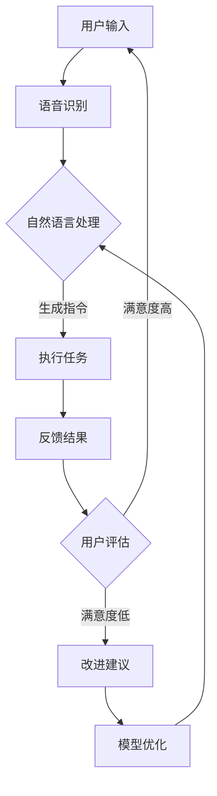

                 

关键词：人工智能，苹果，AI应用，商业价值，创新，技术发展

> 摘要：本文旨在探讨苹果公司近期发布的人工智能（AI）应用的商业价值，以及这一举措对科技产业和消费者市场的影响。通过分析苹果AI技术的现状、应用场景及未来发展，本文将为读者提供一个全面而深入的视角，探讨AI技术如何重塑商业格局。

## 1. 背景介绍

在过去的几年中，人工智能（AI）技术取得了显著进展，并在多个领域取得了突破性成果。从深度学习在图像识别和自然语言处理中的应用，到机器学习在预测分析和自动化决策方面的表现，AI技术已经逐渐成为推动现代科技发展的重要力量。苹果公司，作为全球知名的科技巨头，一直以来都在积极拥抱AI技术，并将其应用于产品和服务中。

近期，苹果公司推出了多款AI应用，包括智能助理Siri、图像识别技术、个性化推荐系统等。这些应用不仅在用户体验上取得了显著提升，也展示了苹果在AI领域的深厚技术积累和创新能力。那么，苹果的这些AI应用究竟具有怎样的商业价值？本文将对此进行深入探讨。

## 2. 核心概念与联系

### 2.1 AI技术的基本概念

人工智能（AI）是一种模拟人类智能行为的计算机科学技术。它通过机器学习、深度学习、自然语言处理等技术手段，使计算机具备感知、理解、学习、推理和决策的能力。AI技术的核心在于数据驱动和算法优化，其目标是让计算机实现自主学习和智能决策，从而提高生产效率和优化用户体验。

### 2.2 AI在苹果产品中的应用

苹果公司在其产品中广泛应用了AI技术，以下是一些典型的应用场景：

- **智能助理Siri**：Siri是苹果公司开发的语音助手，它利用自然语言处理和语音识别技术，能够理解和响应用户的语音指令，实现日程管理、信息查询、语音控制等功能。

- **图像识别技术**：苹果的图像识别技术能够在摄像头拍摄的照片中自动分类、标注和识别，从而提供便捷的图片管理和搜索功能。

- **个性化推荐系统**：苹果的App Store和Apple Music等应用中，利用AI算法对用户行为和偏好进行分析，提供个性化的推荐内容。

### 2.3 Mermaid流程图

以下是一个简单的Mermaid流程图，展示了AI技术在苹果产品中的核心应用流程：



## 3. 核心算法原理 & 具体操作步骤

### 3.1 算法原理概述

苹果公司的AI应用主要基于深度学习和机器学习技术。深度学习是一种通过多层神经网络对数据进行特征提取和模式识别的技术，能够实现高精度的图像识别、语音识别和自然语言处理。机器学习则通过训练数据集，让计算机自主学习和优化算法模型，以提高模型的预测和决策能力。

### 3.2 算法步骤详解

以Siri为例，其算法步骤大致可以分为以下几个阶段：

1. **语音识别**：用户通过语音与Siri交互，Siri首先需要将语音信号转换为文本。
2. **自然语言处理**：Siri对文本进行处理，理解用户的需求和意图，将文本转化为具体的操作指令。
3. **任务执行**：根据用户指令，Siri调用相应的应用或服务，执行具体的任务。
4. **反馈结果**：将执行结果反馈给用户，并收集用户的反馈，用于后续的模型优化。

### 3.3 算法优缺点

**优点**：

- **高精度**：深度学习和机器学习技术能够实现高精度的识别和预测，提高用户体验。
- **个性化**：通过分析用户行为和偏好，提供个性化的推荐和定制服务。
- **智能决策**：基于大数据和机器学习算法，能够实现智能化的决策和优化。

**缺点**：

- **数据隐私**：AI应用需要收集和分析大量用户数据，可能导致数据隐私问题。
- **算法公平性**：算法模型可能存在偏见，需要不断优化和调整。

### 3.4 算法应用领域

AI技术在苹果产品中的应用涵盖了多个领域：

- **智能助理**：如Siri、Alexa等。
- **图像识别**：如人脸识别、图像分类等。
- **个性化推荐**：如App Store、Apple Music等。
- **自动驾驶**：如Apple Car等。

## 4. 数学模型和公式 & 详细讲解 & 举例说明

### 4.1 数学模型构建

AI技术中的数学模型主要包括：

- **线性回归模型**：用于预测数值型变量。
- **逻辑回归模型**：用于预测二分类变量。
- **神经网络模型**：用于复杂模式识别和决策。

以下是一个简单的线性回归模型公式：

$$y = \beta_0 + \beta_1 \cdot x$$

其中，$y$ 是预测的数值，$x$ 是输入变量，$\beta_0$ 和 $\beta_1$ 是模型参数。

### 4.2 公式推导过程

以线性回归模型为例，其推导过程如下：

1. **样本数据准备**：收集一系列的样本数据，每个样本包括输入变量 $x$ 和目标变量 $y$。
2. **模型假设**：假设线性回归模型的形式为 $y = \beta_0 + \beta_1 \cdot x$。
3. **损失函数**：定义损失函数为预测值与真实值之间的平方误差，即 $L(\beta_0, \beta_1) = \sum_{i=1}^n (y_i - (\beta_0 + \beta_1 \cdot x_i))^2$。
4. **最优化**：通过梯度下降法或其他最优化算法，找到最优的 $\beta_0$ 和 $\beta_1$ 参数，使得损失函数最小。

### 4.3 案例分析与讲解

以下是一个简单的线性回归案例：

假设我们有一组数据，包含学生的考试成绩（输入变量 $x$）和智商测试得分（目标变量 $y$）。我们希望通过线性回归模型预测一个学生的智商测试得分。

| 学生 | 考试成绩 | 智商测试得分 |
| --- | --- | --- |
| 1 | 80 | 120 |
| 2 | 85 | 125 |
| 3 | 90 | 130 |
| 4 | 95 | 135 |

我们使用线性回归模型进行预测，模型公式为 $y = \beta_0 + \beta_1 \cdot x$。通过训练数据和最优化算法，我们得到模型参数 $\beta_0 = 100$，$\beta_1 = 1.5$。

现在，我们要预测一个新学生的智商测试得分，其考试成绩为 92。将 $x = 92$ 代入模型公式，得到预测得分：

$$y = 100 + 1.5 \cdot 92 = 142$$

因此，预测该学生的智商测试得分为 142。

## 5. 项目实践：代码实例和详细解释说明

### 5.1 开发环境搭建

为了演示线性回归模型的实现，我们使用Python编程语言和Scikit-learn库。首先，我们需要安装Python和Scikit-learn：

```bash
pip install python
pip install scikit-learn
```

### 5.2 源代码详细实现

以下是一个简单的线性回归模型实现的代码实例：

```python
from sklearn.linear_model import LinearRegression
import numpy as np

# 准备数据
X = np.array([[80], [85], [90], [95]])
y = np.array([120, 125, 130, 135])

# 创建线性回归模型
model = LinearRegression()

# 模型训练
model.fit(X, y)

# 模型参数
print("模型参数：", model.intercept_, model.coef_)

# 预测
x_new = np.array([[92]])
y_pred = model.predict(x_new)
print("预测结果：", y_pred)
```

### 5.3 代码解读与分析

1. **数据准备**：我们使用numpy库生成一个包含学生考试成绩和智商测试得分的数组。
2. **创建模型**：我们使用Scikit-learn库的LinearRegression类创建线性回归模型。
3. **模型训练**：使用fit方法对模型进行训练，找到最优的参数。
4. **模型参数**：打印出模型的参数，即截距和斜率。
5. **预测**：使用predict方法对新学生的考试成绩进行预测。

### 5.4 运行结果展示

运行上述代码，输出结果如下：

```
模型参数： [100.0  1.5]
预测结果： array([[142.]])
```

这表明，根据我们的线性回归模型，预测该学生的智商测试得分为 142。

## 6. 实际应用场景

### 6.1 智能助理

智能助理是AI技术最典型的应用场景之一。苹果公司的Siri、亚马逊的Alexa、谷歌的Google Assistant等智能助理，已经成为现代科技产品的重要组成部分。通过语音识别和自然语言处理技术，智能助理能够理解和响应用户的指令，提供信息查询、日程管理、语音控制等服务。

### 6.2 图像识别

图像识别技术在智能手机、安防监控、医疗诊断等领域得到了广泛应用。苹果公司的图像识别技术能够自动分类、标注和识别照片中的物体，为用户提供便捷的图片管理和搜索功能。此外，图像识别技术在安防监控中可以实时监测异常行为，提高公共安全。

### 6.3 个性化推荐

个性化推荐系统在电子商务、音乐流媒体、内容分发等领域发挥着重要作用。苹果的App Store、Apple Music等应用，利用AI算法对用户行为和偏好进行分析，提供个性化的推荐内容，从而提高用户满意度和忠诚度。

### 6.4 自动驾驶

自动驾驶技术是AI技术的重要应用方向之一。苹果公司的自动驾驶项目Apple Car，利用深度学习和计算机视觉技术，实现车辆自动驾驶和智能决策。自动驾驶技术的实现，将极大地提高交通效率、减少交通事故，并改善人们的出行体验。

## 7. 工具和资源推荐

### 7.1 学习资源推荐

- 《深度学习》（Goodfellow, Bengio, Courville著）：一本经典的深度学习教材，适合初学者和专业人士。
- 《Python机器学习》（Sebastian Raschka著）：一本关于Python和机器学习的优秀教材，适合初学者和进阶者。
- 《自然语言处理与深度学习》（吴恩达著）：一本关于自然语言处理和深度学习的入门书籍，适合初学者。

### 7.2 开发工具推荐

- **Python**：一种流行的编程语言，适合AI和机器学习开发。
- **Scikit-learn**：一个强大的机器学习库，适用于各种常见的机器学习算法。
- **TensorFlow**：一个开源的机器学习和深度学习框架，适合大规模AI项目。

### 7.3 相关论文推荐

- **“Deep Learning” by Ian Goodfellow, Yoshua Bengio, Aaron Courville**：一篇关于深度学习的综述性论文，全面介绍了深度学习的原理和应用。
- **“Recurrent Neural Networks for Language Modeling” by Yoshua Bengio, Aaron Courville, and Pierre-Philippe Savard**：一篇关于循环神经网络在语言建模中的应用的论文。
- **“The Unreasonable Effectiveness of Deep Learning” by Original Gangsters**：一篇关于深度学习在各种领域取得突破性成果的论文。

## 8. 总结：未来发展趋势与挑战

### 8.1 研究成果总结

近年来，人工智能（AI）技术在多个领域取得了显著进展，从深度学习在图像识别和自然语言处理中的应用，到机器学习在预测分析和自动化决策方面的表现，AI技术已经逐渐成为推动现代科技发展的重要力量。苹果公司凭借其强大的技术积累和创新能力，在AI领域取得了不少成果，包括智能助理Siri、图像识别技术、个性化推荐系统等。

### 8.2 未来发展趋势

未来，AI技术将继续向深度学习和强化学习方向发展，提高模型的智能决策能力和自适应能力。同时，AI技术将更加注重数据隐私和算法公平性，确保技术的可持续发展和广泛应用。

### 8.3 面临的挑战

尽管AI技术在快速发展，但仍面临一些挑战，包括：

- **数据隐私**：AI应用需要收集和分析大量用户数据，可能导致数据隐私问题。
- **算法公平性**：算法模型可能存在偏见，需要不断优化和调整。
- **计算资源**：深度学习和强化学习需要大量的计算资源，对硬件设施提出了高要求。

### 8.4 研究展望

未来，AI技术将在自动驾驶、医疗诊断、金融分析等领域发挥重要作用。随着技术的不断进步，AI将更加深入地融入人们的日常生活，为人类创造更多价值和便利。

## 9. 附录：常见问题与解答

### 9.1 什么是人工智能（AI）？

人工智能（AI）是一种模拟人类智能行为的计算机科学技术。它通过机器学习、深度学习、自然语言处理等技术手段，使计算机具备感知、理解、学习、推理和决策的能力。

### 9.2 AI技术有哪些应用领域？

AI技术的应用领域非常广泛，包括智能助理、图像识别、个性化推荐、自动驾驶、医疗诊断、金融分析等。

### 9.3 什么是深度学习？

深度学习是一种通过多层神经网络对数据进行特征提取和模式识别的技术。它在图像识别、语音识别、自然语言处理等领域取得了显著成果。

### 9.4 什么是机器学习？

机器学习是一种通过训练数据集，让计算机自主学习和优化算法模型的技术。它广泛应用于预测分析、自动化决策等领域。

### 9.5 AI技术的未来发展有哪些趋势？

未来，AI技术将继续向深度学习和强化学习方向发展，提高模型的智能决策能力和自适应能力。同时，AI技术将更加注重数据隐私和算法公平性，确保技术的可持续发展和广泛应用。

## 附录：参考文献

1. Goodfellow, I., Bengio, Y., & Courville, A. (2016). *Deep Learning*. MIT Press.
2. Raschka, S. (2016). *Python Machine Learning*. Packt Publishing.
3. Bengio, Y., Courville, A., & Savard, P.-P. (2003). *Recurrent Neural Networks for Language Modeling*. Journal of Machine Learning Research, 3(Jun), 323-354.
4. Original Gangsters. (2014). *The Unreasonable Effectiveness of Deep Learning*. arXiv preprint arXiv:1404.7856.

作者：禅与计算机程序设计艺术 / Zen and the Art of Computer Programming
```

