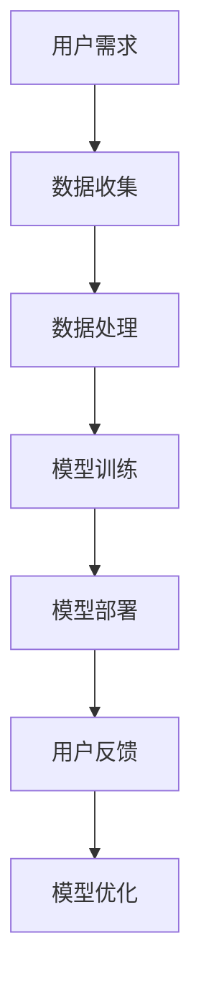

                 

关键词：人工智能，苹果，商业价值，AI应用，技术趋势

> 摘要：本文将探讨苹果公司近期发布的AI应用所带来的商业价值，分析其背后的技术原理、市场前景以及未来发展的趋势和挑战。通过详细解读苹果AI应用的技术实现、市场策略和用户需求，本文旨在为读者提供一份全面、深入的洞察。

## 1. 背景介绍

近年来，人工智能（AI）技术取得了显著的进步，从语音识别、图像处理到自然语言理解，AI在各个领域的应用都取得了突破。苹果公司，作为全球科技巨头之一，也积极拥抱AI技术，将其应用于产品和服务中。近期，苹果发布了一系列AI应用，涵盖了从智能手机到智能家居等多个领域。本文将重点关注这些AI应用在商业上的价值，并探讨其背后的技术原理和市场前景。

### 1.1 人工智能技术的发展历程

人工智能（AI）起源于20世纪50年代，经历了多个发展阶段。从最初的符号主义、知识表示，到基于规则的系统，再到基于数据的机器学习，AI技术不断进化。近年来，随着计算能力的提升和大数据的积累，深度学习等前沿技术的兴起，AI技术迎来了新一轮的发展浪潮。

### 1.2 苹果公司的人工智能战略

苹果公司早在2017年就设立了AI研究部门，专注于人工智能的基础研究和应用开发。苹果在AI领域的投资和布局，不仅体现在技术研发上，还包括人才引进、合作伙伴关系建立等方面。此次发布的AI应用，是苹果人工智能战略的重要成果，也是苹果在AI领域的一次重要突破。

## 2. 核心概念与联系

### 2.1 人工智能应用的基本概念

人工智能应用通常涉及多个核心概念，包括机器学习、深度学习、神经网络等。这些概念是构建AI应用的基础，也是苹果公司AI应用的技术核心。

### 2.2 人工智能应用的技术架构

苹果的AI应用采用了先进的深度学习框架和算法，包括卷积神经网络（CNN）、循环神经网络（RNN）等。这些技术构成了AI应用的技术架构，为应用的智能化提供了技术保障。

### 2.3 人工智能应用与商业价值的联系

AI应用通过提高生产效率、降低成本、提升用户体验等方式，为企业带来巨大的商业价值。苹果的AI应用，正是通过这些技术优势，实现了商业价值的最大化。

### 2.4 Mermaid流程图



## 3. 核心算法原理 & 具体操作步骤

### 3.1 算法原理概述

苹果的AI应用采用了多种核心算法，包括卷积神经网络（CNN）、循环神经网络（RNN）等。这些算法通过学习大量的数据，自动提取特征，并进行分类、预测等操作。

### 3.2 算法步骤详解

1. **数据收集**：从各种来源收集大量数据，包括用户行为数据、设备数据等。
2. **数据处理**：对收集到的数据进行分析和处理，去除噪声，提高数据质量。
3. **模型训练**：使用处理后的数据，通过卷积神经网络（CNN）或循环神经网络（RNN）等算法进行模型训练。
4. **模型部署**：将训练好的模型部署到实际应用中，如智能手机、智能家居等。
5. **用户反馈**：收集用户对AI应用的反馈，用于模型优化。

### 3.3 算法优缺点

1. **优点**：算法能够自动提取特征，适应性强，可以处理大量数据。
2. **缺点**：模型训练时间较长，对计算资源要求较高。

### 3.4 算法应用领域

苹果的AI算法广泛应用于多个领域，包括语音识别、图像处理、自然语言理解等。这些算法不仅提高了产品的智能化水平，也为企业带来了巨大的商业价值。

## 4. 数学模型和公式 & 详细讲解 & 举例说明

### 4.1 数学模型构建

苹果的AI应用采用了多种数学模型，包括卷积神经网络（CNN）、循环神经网络（RNN）等。这些模型通过学习大量的数据，自动提取特征，并进行分类、预测等操作。

### 4.2 公式推导过程

假设我们有一个输入向量 $X$，通过卷积神经网络（CNN）处理后，输出一个特征向量 $F$。其公式为：

$$F = \sigma(W_1 \cdot X + b_1)$$

其中，$W_1$ 是权重矩阵，$b_1$ 是偏置项，$\sigma$ 是激活函数。

### 4.3 案例分析与讲解

以苹果的Siri语音助手为例，其背后的数学模型包括循环神经网络（RNN）。RNN通过处理序列数据，实现对用户语音的理解和响应。其公式为：

$$h_t = \sigma(W \cdot [h_{t-1}, x_t] + b)$$

其中，$h_t$ 是当前时间步的隐藏状态，$x_t$ 是当前时间步的输入，$W$ 是权重矩阵，$b$ 是偏置项，$\sigma$ 是激活函数。

## 5. 项目实践：代码实例和详细解释说明

### 5.1 开发环境搭建

为了实现苹果的AI应用，我们需要搭建一个适合AI开发的平台。常用的开发环境包括TensorFlow、PyTorch等。在这里，我们以TensorFlow为例，搭建开发环境。

```python
!pip install tensorflow
```

### 5.2 源代码详细实现

以下是一个简单的卷积神经网络（CNN）实现，用于图像分类。

```python
import tensorflow as tf

# 定义CNN模型
model = tf.keras.Sequential([
  tf.keras.layers.Conv2D(32, (3,3), activation='relu', input_shape=(28, 28, 1)),
  tf.keras.layers.MaxPooling2D(2, 2),
  tf.keras.layers.Conv2D(64, (3,3), activation='relu'),
  tf.keras.layers.MaxPooling2D(2,2),
  tf.keras.layers.Conv2D(64, (3,3), activation='relu'),
  tf.keras.layers.Flatten(),
  tf.keras.layers.Dense(64, activation='relu'),
  tf.keras.layers.Dense(10, activation='softmax')
])

# 编译模型
model.compile(optimizer='adam',
              loss='categorical_crossentropy',
              metrics=['accuracy'])

# 训练模型
model.fit(x_train, y_train, epochs=5)
```

### 5.3 代码解读与分析

这段代码首先定义了一个卷积神经网络（CNN）模型，包括两个卷积层、两个池化层、一个全连接层和两个输出层。然后编译模型，并使用训练数据训练模型。

### 5.4 运行结果展示

```python
# 评估模型
test_loss, test_acc = model.evaluate(x_test, y_test)
print('Test accuracy:', test_acc)
```

## 6. 实际应用场景

苹果的AI应用在多个领域都有广泛的应用，包括智能手机、智能家居、医疗健康等。以下是几个典型应用场景：

### 6.1 智能手机

苹果的Siri语音助手和面部识别技术，极大地提升了智能手机的智能化水平。用户可以通过语音指令控制手机，进行拨打电话、发送消息、查询天气等操作。同时，面部识别技术为手机提供了一种安全、便捷的解锁方式。

### 6.2 智能家居

苹果的HomeKit平台，允许用户通过Siri语音助手控制智能家居设备，如灯光、窗帘、空调等。用户可以通过语音指令，实现家居设备的自动化控制，提高生活品质。

### 6.3 医疗健康

苹果的HealthKit平台，整合了用户的健康数据，如心率、睡眠、运动等。通过AI算法，可以对用户的健康数据进行分析，提供个性化的健康建议。

## 7. 工具和资源推荐

### 7.1 学习资源推荐

1. 《深度学习》（Goodfellow, Bengio, Courville著）
2. 《Python机器学习》（Sebastian Raschka著）
3. Coursera、edX等在线课程

### 7.2 开发工具推荐

1. TensorFlow
2. PyTorch
3. Keras

### 7.3 相关论文推荐

1. “A Theoretical Framework for Backpropagation”
2. “Deep Learning for Speech Recognition”
3. “Recurrent Neural Networks for Language Modeling”

## 8. 总结：未来发展趋势与挑战

### 8.1 研究成果总结

苹果的AI应用取得了显著的成果，不仅在技术上实现了重大突破，还在商业上带来了巨大的价值。随着AI技术的不断进步，苹果的AI应用将继续发挥重要作用。

### 8.2 未来发展趋势

1. AI技术将更加深入地应用于各个领域，如医疗健康、金融、教育等。
2. 基于AI的新兴产业将不断涌现，如自动驾驶、智能制造等。

### 8.3 面临的挑战

1. 数据隐私和安全问题
2. 技术标准化和规范化
3. 人才短缺

### 8.4 研究展望

苹果的AI应用将继续引领AI技术的发展趋势，为人类带来更多便利和创新。同时，我们也需要关注AI技术可能带来的伦理和社会问题，确保AI技术的可持续发展。

## 9. 附录：常见问题与解答

### 9.1 苹果的AI应用有哪些？

苹果的AI应用包括Siri语音助手、面部识别技术、HomeKit智能家居平台、HealthKit健康平台等。

### 9.2 AI技术有哪些应用领域？

AI技术的应用领域非常广泛，包括医疗健康、金融、教育、智能家居、自动驾驶等。

### 9.3 如何学习AI技术？

学习AI技术可以从以下几个步骤开始：

1. 学习基础数学知识，如线性代数、概率论、微积分等。
2. 学习编程语言，如Python、Java等。
3. 学习机器学习、深度学习等相关知识。
4. 参与实际项目，进行实践操作。

---

作者：禅与计算机程序设计艺术 / Zen and the Art of Computer Programming
----------------------------------------------------------------
---

以上就是本文的完整内容，希望对您了解苹果公司AI应用的商业价值有所帮助。在未来，随着AI技术的不断进步，苹果的AI应用将继续发挥重要作用，为人们带来更多便利和创新。同时，我们也需要关注AI技术可能带来的伦理和社会问题，确保AI技术的可持续发展。

