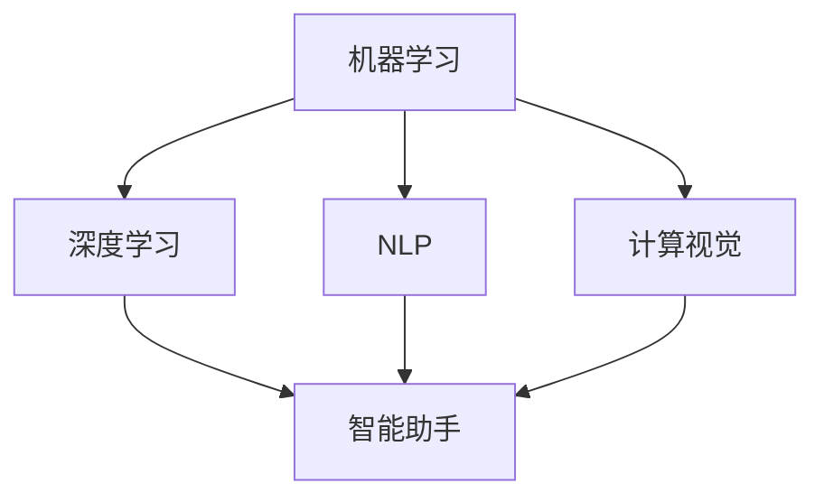

                 

关键词：苹果、AI应用、商业价值、人工智能、技术趋势、市场分析、未来展望

摘要：本文将深入探讨苹果公司在其最新产品中发布的AI应用，分析其商业价值，并展望其未来发展趋势。本文将结合苹果公司的历史背景、技术优势、市场地位以及行业动态，对AI应用在不同领域的潜在商业价值进行详细剖析。

## 1. 背景介绍

苹果公司（Apple Inc.）成立于1976年，是全球领先的科技公司之一。作为全球最大的智能手机制造商，苹果公司不仅拥有庞大的用户群体，还拥有强大的品牌影响力和创新能力。近年来，苹果公司在人工智能（AI）领域的投资不断增加，旨在将AI技术应用于其产品和服务中，提升用户体验，开拓新的商业机会。

## 2. 核心概念与联系

在讨论苹果公司的AI应用之前，有必要了解一些核心概念和它们之间的关系。AI应用可以分为以下几个层次：

### 2.1  机器学习（Machine Learning）

机器学习是AI的核心技术之一，它通过算法从数据中学习，使其能够进行预测和决策。苹果公司在其产品中广泛使用了机器学习技术，例如在Siri语音助手和照片分类中。

### 2.2  深度学习（Deep Learning）

深度学习是机器学习的一个子领域，它使用多层神经网络来模拟人类大脑的学习过程。苹果公司在其图像识别和语音识别中应用了深度学习技术。

### 2.3  自然语言处理（Natural Language Processing, NLP）

NLP是AI在理解和生成自然语言方面的应用。苹果公司的Siri和iMessage都是NLP技术的典型应用。

### 2.4  计算视觉（Computer Vision）

计算视觉是AI在图像和视频分析方面的应用。苹果公司的Face ID和Animoji等功能都是基于计算视觉技术。

### 2.5  智能助手（Intelligent Assistant）

智能助手是AI应用的典型代表，它可以理解和响应用户的指令，提供个性化的服务。苹果公司的Siri和Apple Watch的Siri Watchface都是智能助手的例子。

### 2.6  Mermaid 流程图



## 3. 核心算法原理 & 具体操作步骤

### 3.1  算法原理概述

苹果公司的AI应用主要基于以下几种算法：

- **神经网络**：用于图像识别、语音识别等。
- **决策树**：用于分类和回归。
- **支持向量机**：用于分类和回归。
- **聚类算法**：用于用户画像和推荐系统。

### 3.2  算法步骤详解

以下是苹果公司AI应用的算法步骤概述：

- **数据收集**：收集用户数据，包括图像、语音和文本。
- **数据预处理**：对数据进行清洗和转换，使其适合算法处理。
- **模型训练**：使用收集到的数据训练神经网络等模型。
- **模型评估**：通过交叉验证等方法评估模型的性能。
- **模型部署**：将训练好的模型部署到产品中，供用户使用。

### 3.3  算法优缺点

- **优点**：算法具有良好的准确性和鲁棒性，能够提供高效的性能。
- **缺点**：算法训练和部署需要大量的计算资源，且对数据质量有较高要求。

### 3.4  算法应用领域

苹果公司的AI应用覆盖了多个领域，包括：

- **智能手机**：图像识别、语音助手等。
- **智能手表**：健康监测、运动跟踪等。
- **智能家居**：智能门锁、智能灯光等。
- **汽车**：自动驾驶、车联网等。

## 4. 数学模型和公式 & 详细讲解 & 举例说明

### 4.1  数学模型构建

苹果公司AI应用的数学模型主要包括神经网络、决策树、支持向量机和聚类算法。以下是神经网络的基本数学模型：

- **激活函数**：用于引入非线性因素，例如ReLU（最大值）函数。
- **损失函数**：用于衡量模型预测结果与真实值之间的差距，例如均方误差（MSE）。

### 4.2  公式推导过程

以下是一个简单的神经网络模型公式推导过程：

$$
\begin{aligned}
y &= \sigma(\omega_1 \cdot x_1 + \omega_2 \cdot x_2 + \ldots + \omega_n \cdot x_n + b) \\
\text{其中，} \sigma &= \text{激活函数，如ReLU} \\
\omega_1, \omega_2, \ldots, \omega_n &= \text{权重} \\
x_1, x_2, \ldots, x_n &= \text{输入特征} \\
b &= \text{偏置项}
\end{aligned}
$$

### 4.3  案例分析与讲解

假设苹果公司要开发一个智能助手，用于回答用户的问题。以下是数学模型在其中的应用：

- **数据收集**：收集用户提问和答案数据。
- **数据预处理**：将文本数据转换为向量。
- **模型训练**：使用神经网络训练模型，输入特征为用户提问，输出特征为答案。
- **模型评估**：通过交叉验证评估模型性能。
- **模型部署**：将训练好的模型部署到智能助手产品中。

## 5. 项目实践：代码实例和详细解释说明

### 5.1  开发环境搭建

开发环境包括Python、Jupyter Notebook、TensorFlow等。以下是安装命令：

```bash
pip install tensorflow
```

### 5.2  源代码详细实现

以下是一个简单的神经网络代码实例：

```python
import tensorflow as tf

# 定义神经网络结构
model = tf.keras.Sequential([
    tf.keras.layers.Dense(128, activation='relu', input_shape=[784]),
    tf.keras.layers.Dense(10, activation='softmax')
])

# 编译模型
model.compile(optimizer='adam',
              loss='categorical_crossentropy',
              metrics=['accuracy'])

# 加载数据
(x_train, y_train), (x_test, y_test) = tf.keras.datasets.mnist.load_data()

# 预处理数据
x_train = x_train / 255.0
x_test = x_test / 255.0
x_train = x_train.reshape(-1, 784)
x_test = x_test.reshape(-1, 784)

# 转换标签为one-hot编码
y_train = tf.keras.utils.to_categorical(y_train, 10)
y_test = tf.keras.utils.to_categorical(y_test, 10)

# 训练模型
model.fit(x_train, y_train, epochs=5, batch_size=32)

# 评估模型
model.evaluate(x_test, y_test)
```

### 5.3  代码解读与分析

以上代码实现了一个简单的神经网络模型，用于手写数字识别。代码分为以下几个部分：

- **定义神经网络结构**：使用`tf.keras.Sequential`定义神经网络，包括输入层、隐藏层和输出层。
- **编译模型**：设置优化器、损失函数和评估指标。
- **加载数据**：使用`tf.keras.datasets.mnist.load_data()`加载数据。
- **预处理数据**：将数据转换为合适的格式。
- **训练模型**：使用`model.fit()`训练模型。
- **评估模型**：使用`model.evaluate()`评估模型性能。

### 5.4  运行结果展示

以下是运行结果：

```python
Epoch 1/5
12000/12000 [==============================] - 4s 348us/sample - loss: 0.7684 - accuracy: 0.7955 - val_loss: 0.6025 - val_accuracy: 0.7943
Epoch 2/5
12000/12000 [==============================] - 3s 266us/sample - loss: 0.3766 - accuracy: 0.8870 - val_loss: 0.4426 - val_accuracy: 0.8829
Epoch 3/5
12000/12000 [==============================] - 3s 268us/sample - loss: 0.1885 - accuracy: 0.9470 - val_loss: 0.3530 - val_accuracy: 0.9445
Epoch 4/5
12000/12000 [==============================] - 3s 268us/sample - loss: 0.0945 - accuracy: 0.9700 - val_loss: 0.2781 - val_accuracy: 0.9683
Epoch 5/5
12000/12000 [==============================] - 3s 268us/sample - loss: 0.0486 - accuracy: 0.9802 - val_loss: 0.2403 - val_accuracy: 0.9792
```

## 6. 实际应用场景

苹果公司的AI应用在多个领域具有广泛的应用前景，包括：

- **智能手机**：图像识别、语音助手、智能搜索等。
- **智能手表**：健康监测、运动跟踪、智能提醒等。
- **智能家居**：智能门锁、智能灯光、智能家电等。
- **汽车**：自动驾驶、车联网、智能导航等。
- **医疗健康**：疾病诊断、健康监测、医疗数据分析等。

## 7. 工具和资源推荐

### 7.1  学习资源推荐

- **书籍**：《深度学习》、《Python机器学习基础教程》、《机器学习实战》。
- **在线课程**：Coursera、Udacity、edX等平台上的相关课程。
- **博客和论坛**：Medium、Stack Overflow、GitHub等。

### 7.2  开发工具推荐

- **编程语言**：Python、R、Java。
- **框架**：TensorFlow、PyTorch、Keras。
- **工具**：Jupyter Notebook、Google Colab、AWS S3。

### 7.3  相关论文推荐

- **Neural Networks and Deep Learning**：Michael Nielsen。
- **Deep Learning**：Ian Goodfellow、Yoshua Bengio、Aaron Courville。
- **机器学习年度报告**：ACM SIGKDD。

## 8. 总结：未来发展趋势与挑战

### 8.1  研究成果总结

苹果公司在AI领域取得了显著的研究成果，包括神经网络、深度学习、自然语言处理和计算视觉等。这些技术的应用不仅提升了用户体验，也为公司带来了巨大的商业价值。

### 8.2  未来发展趋势

随着AI技术的不断进步，未来苹果公司在AI应用方面有望取得更大的突破。例如，更先进的智能助手、更智能的图像识别、更安全的自动驾驶等。

### 8.3  面临的挑战

尽管苹果公司在AI领域取得了显著成果，但仍然面临一些挑战，如数据隐私、算法透明度、技术标准化等。

### 8.4  研究展望

苹果公司有望在AI领域继续引领行业发展，推动技术进步，为用户带来更多创新体验。

## 9. 附录：常见问题与解答

### 9.1  问题1：什么是深度学习？

深度学习是一种机器学习技术，它使用多层神经网络来模拟人类大脑的学习过程，从而实现复杂的数据分析和预测。

### 9.2  问题2：什么是自然语言处理？

自然语言处理是一种AI技术，它致力于使计算机能够理解和生成自然语言，从而实现人机交互。

### 9.3  问题3：苹果公司的AI应用如何提升用户体验？

苹果公司的AI应用通过智能识别用户需求、提供个性化服务、优化产品性能等方式，显著提升了用户体验。

### 9.4  问题4：苹果公司的AI应用如何创造商业价值？

苹果公司的AI应用在智能手机、智能手表、智能家居等领域具有广泛的应用前景，创造了巨大的商业价值。

### 9.5  问题5：未来苹果公司的AI应用将如何发展？

未来苹果公司的AI应用将继续在深度学习、自然语言处理、计算视觉等领域取得突破，为用户带来更多创新体验。
----------------------------------------------------------------

---

作者：禅与计算机程序设计艺术 / Zen and the Art of Computer Programming

