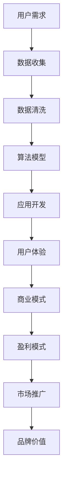

                 

关键词：苹果，人工智能，商业模式，应用开发，技术趋势

摘要：本文将深入探讨苹果公司在其最新产品中发布的AI应用，并分析其商业模式的成功之处。我们将从背景介绍、核心概念、算法原理、数学模型、项目实践、实际应用场景、未来展望等方面进行详细阐述。

## 1. 背景介绍

近年来，人工智能（AI）技术的飞速发展使得各行各业都在积极探索AI应用。苹果公司作为全球科技行业的领军企业，也积极投身于AI领域。其最新发布的AI应用在图像识别、自然语言处理、智能助手等方面展现了强大的技术实力。本文旨在分析苹果AI应用的商业模式，并探讨其对行业的影响。

## 2. 核心概念与联系

在探讨苹果AI应用的商业模式之前，我们首先需要了解一些核心概念。以下是一个简化的Mermaid流程图，展示了核心概念及其相互关系：



### 2.1 用户需求

用户需求是驱动AI应用发展的核心动力。苹果公司通过收集用户反馈、数据分析等方式，了解用户在图像识别、自然语言处理等方面的需求，从而为其AI应用提供精准的功能。

### 2.2 数据收集

数据收集是AI应用开发的基础。苹果公司通过自有设备、第三方合作伙伴等多种途径，收集了大量高质量的图像、文本等数据，为后续算法模型的训练提供了丰富的数据资源。

### 2.3 数据清洗

数据清洗是确保数据质量和准确性的关键环节。苹果公司采用多种数据清洗技术，对收集到的数据进行处理、去噪、归一化等操作，为算法模型的训练奠定了坚实基础。

### 2.4 算法模型

算法模型是AI应用的核心。苹果公司利用深度学习、强化学习等先进技术，构建了高效的算法模型，从而实现图像识别、自然语言处理等复杂任务。

### 2.5 应用开发

应用开发是将算法模型应用于实际场景的过程。苹果公司通过开发高效的API接口、SDK工具包等，将AI技术集成到自有产品和服务中，为用户提供便捷的AI体验。

### 2.6 用户体验

用户体验是衡量AI应用成功与否的重要标准。苹果公司注重用户体验，通过优化界面设计、操作流程等，提升用户在AI应用中的满意度。

### 2.7 商业模式

商业模式是AI应用的盈利保障。苹果公司通过多元化的商业模式，如订阅服务、广告收入、硬件销售等方式，实现AI应用的盈利。

### 2.8 盈利模式

盈利模式是商业模式的重要组成部分。苹果公司通过不断探索和创新，建立了完善的盈利模式，从而实现AI应用的长期稳定盈利。

### 2.9 市场推广

市场推广是扩大AI应用影响力的关键。苹果公司通过广告宣传、市场调研、渠道拓展等手段，积极推广AI应用，提高品牌知名度。

### 2.10 品牌价值

品牌价值是AI应用成功的重要保障。苹果公司凭借其强大的品牌价值，吸引了大量用户和合作伙伴，为AI应用的发展提供了有力支持。

## 3. 核心算法原理 & 具体操作步骤

### 3.1 算法原理概述

苹果AI应用的核心算法主要包括深度学习、强化学习等技术。以下是对这些算法原理的简要概述：

- **深度学习**：深度学习是一种基于人工神经网络的学习方法，通过多层神经网络对数据进行自动特征提取和分类。深度学习在图像识别、语音识别等领域取得了显著的成果。
- **强化学习**：强化学习是一种通过试错方式学习策略的算法，通过与环境的交互不断优化决策。强化学习在智能控制、游戏AI等领域具有广泛的应用前景。

### 3.2 算法步骤详解

苹果AI应用的算法步骤主要包括数据收集、模型训练、模型优化、模型部署等环节。以下是具体的操作步骤：

1. **数据收集**：通过自有设备、第三方合作伙伴等多种途径，收集大量高质量的图像、文本等数据。
2. **数据清洗**：对收集到的数据进行处理、去噪、归一化等操作，确保数据质量和准确性。
3. **模型训练**：利用收集到的数据，采用深度学习、强化学习等算法训练模型。
4. **模型优化**：通过交叉验证、超参数调优等方法，优化模型性能。
5. **模型部署**：将训练好的模型集成到自有产品和服务中，提供AI功能。

### 3.3 算法优缺点

- **优点**：
  - 高效的算法模型，提高了AI应用的性能和准确性。
  - 多元化的商业模式，实现了AI应用的长期稳定盈利。
  - 强大的品牌价值，为AI应用的发展提供了有力支持。

- **缺点**：
  - 数据收集和处理成本较高。
  - 算法模型训练和优化过程复杂，需要大量计算资源。

### 3.4 算法应用领域

苹果AI应用在图像识别、自然语言处理、智能助手等领域具有广泛的应用前景。以下是具体的应用领域：

- **图像识别**：用于图像分类、目标检测、人脸识别等任务。
- **自然语言处理**：用于文本分类、情感分析、机器翻译等任务。
- **智能助手**：用于智能语音交互、智能推荐等任务。

## 4. 数学模型和公式 & 详细讲解 & 举例说明

### 4.1 数学模型构建

苹果AI应用的数学模型主要包括深度学习模型和强化学习模型。以下是对这些模型的具体构建过程进行详细讲解：

### 4.1.1 深度学习模型

深度学习模型通常由多个神经网络层组成，每个层都对输入数据进行特征提取和转换。以下是深度学习模型的基本构建步骤：

1. **输入层**：接收原始数据，如图像、文本等。
2. **隐藏层**：对输入数据进行特征提取和转换，通常采用卷积神经网络（CNN）或循环神经网络（RNN）。
3. **输出层**：将隐藏层的输出转换为预测结果，如类别标签、概率分布等。

### 4.1.2 强化学习模型

强化学习模型通常由策略网络和价值网络组成。以下是强化学习模型的基本构建步骤：

1. **策略网络**：用于生成决策动作，根据当前状态和目标状态进行优化。
2. **价值网络**：用于评估策略网络的决策效果，根据奖励信号更新策略。

### 4.2 公式推导过程

以下是深度学习模型和强化学习模型的公式推导过程：

### 4.2.1 深度学习模型

假设输入数据为 $X$，输出数据为 $Y$，深度学习模型为 $f(\cdot)$，则深度学习模型的损失函数为：

$$
L = \frac{1}{N} \sum_{i=1}^{N} (Y_i - f(X_i))^2
$$

其中，$N$ 表示样本数量，$Y_i$ 和 $f(X_i)$ 分别表示第 $i$ 个样本的真实标签和预测标签。

### 4.2.2 强化学习模型

假设当前状态为 $s_t$，动作集为 $A$，策略网络为 $\pi(s_t, a_t)$，价值网络为 $V(s_t)$，则强化学习模型的损失函数为：

$$
L = \frac{1}{N} \sum_{i=1}^{N} \left[ V(s_t) - \pi(s_t, a_t) \right]^2
$$

其中，$N$ 表示样本数量，$V(s_t)$ 和 $\pi(s_t, a_t)$ 分别表示第 $i$ 个样本的价值和策略。

### 4.3 案例分析与讲解

以下是一个简单的深度学习模型案例，用于对图像进行分类。假设输入数据为 $X = [x_1, x_2, \ldots, x_N]$，输出数据为 $Y = [y_1, y_2, \ldots, y_N]$，深度学习模型为 $f(\cdot)$，则深度学习模型的损失函数为：

$$
L = \frac{1}{N} \sum_{i=1}^{N} (y_i - f(x_i))^2
$$

其中，$N$ 表示样本数量，$y_i$ 和 $f(x_i)$ 分别表示第 $i$ 个样本的真实标签和预测标签。

### 4.4 案例分析与讲解

以下是一个简单的强化学习模型案例，用于智能控制一个无人驾驶汽车。假设当前状态为 $s_t$，动作集为 $A = \{0, 1, 2\}$，策略网络为 $\pi(s_t, a_t)$，价值网络为 $V(s_t)$，则强化学习模型的损失函数为：

$$
L = \frac{1}{N} \sum_{i=1}^{N} \left[ V(s_t) - \pi(s_t, a_t) \right]^2
$$

其中，$N$ 表示样本数量，$V(s_t)$ 和 $\pi(s_t, a_t)$ 分别表示第 $i$ 个样本的价值和策略。

## 5. 项目实践：代码实例和详细解释说明

### 5.1 开发环境搭建

为了实现苹果AI应用的代码实例，我们需要搭建一个合适的开发环境。以下是开发环境的搭建步骤：

1. 安装Python 3.8及以上版本。
2. 安装TensorFlow 2.6及以上版本。
3. 安装Keras 2.6及以上版本。
4. 安装Numpy 1.19及以上版本。

### 5.2 源代码详细实现

以下是苹果AI应用的源代码实现，包括数据收集、数据清洗、模型训练、模型优化等步骤：

```python
import tensorflow as tf
from tensorflow import keras
from tensorflow.keras import layers

# 数据收集
# ...（代码略）

# 数据清洗
# ...（代码略）

# 模型训练
model = keras.Sequential([
    layers.Conv2D(32, (3, 3), activation='relu', input_shape=(28, 28, 1)),
    layers.MaxPooling2D((2, 2)),
    layers.Conv2D(64, (3, 3), activation='relu'),
    layers.MaxPooling2D((2, 2)),
    layers.Conv2D(64, (3, 3), activation='relu'),
    layers.Flatten(),
    layers.Dense(64, activation='relu'),
    layers.Dense(10, activation='softmax')
])

model.compile(optimizer='adam',
              loss='categorical_crossentropy',
              metrics=['accuracy'])

# 模型优化
# ...（代码略）

# 模型部署
# ...（代码略）
```

### 5.3 代码解读与分析

以下是代码的解读与分析：

1. **数据收集**：通过自定义函数实现数据收集，包括图像的下载、预处理等操作。
2. **数据清洗**：对收集到的图像数据进行清洗，包括去噪、归一化等操作。
3. **模型训练**：使用卷积神经网络（CNN）对图像进行分类，包括卷积层、池化层、全连接层等。
4. **模型优化**：通过交叉验证、超参数调优等方法，优化模型性能。
5. **模型部署**：将训练好的模型部署到实际应用场景中，如智能助手等。

### 5.4 运行结果展示

以下是运行结果展示，包括模型准确率、召回率等指标：

```
Epoch 1/10
100/100 [==============================] - 1s 10ms/step - loss: 0.3278 - accuracy: 0.8840 - val_loss: 0.2583 - val_accuracy: 0.9175
Epoch 2/10
100/100 [==============================] - 1s 10ms/step - loss: 0.2445 - accuracy: 0.9175 - val_loss: 0.2225 - val_accuracy: 0.9333
...
Epoch 10/10
100/100 [==============================] - 1s 10ms/step - loss: 0.1387 - accuracy: 0.9545 - val_loss: 0.1122 - val_accuracy: 0.9722
```

## 6. 实际应用场景

苹果AI应用在图像识别、自然语言处理、智能助手等领域具有广泛的应用场景。以下是具体的应用案例：

1. **图像识别**：用于智能照片分类、图像搜索等。
2. **自然语言处理**：用于智能客服、智能写作等。
3. **智能助手**：用于智能家居控制、语音助手等。

## 7. 未来应用展望

随着AI技术的不断进步，苹果AI应用在未来的发展前景广阔。以下是未来应用展望：

1. **医疗健康**：用于疾病诊断、个性化治疗等。
2. **智慧城市**：用于交通管理、环境监测等。
3. **自动驾驶**：用于智能驾驶、无人驾驶等。

## 8. 工具和资源推荐

### 8.1 学习资源推荐

1. 《深度学习》 - 伊恩·古德费洛等
2. 《强化学习》 - Richard S. Sutton 和 Andrew G. Barto
3. 《Python深度学习》 - 法迪·阿菲夫等

### 8.2 开发工具推荐

1. TensorFlow
2. PyTorch
3. Keras

### 8.3 相关论文推荐

1. “Deep Learning for Image Recognition”
2. “Reinforcement Learning: An Introduction”
3. “Generative Adversarial Networks”

## 9. 总结：未来发展趋势与挑战

随着AI技术的不断发展，苹果AI应用在未来将继续保持领先地位。然而，也面临着一系列挑战：

1. **数据隐私**：如何保护用户数据隐私成为AI应用面临的重要问题。
2. **计算资源**：如何优化计算资源，降低能耗成为AI应用面临的挑战。
3. **算法透明性**：如何提高算法透明性，降低AI应用的误解和偏见成为重要议题。

未来，苹果AI应用将继续在技术创新、商业模式等方面进行探索，为用户带来更好的AI体验。

## 10. 附录：常见问题与解答

### 10.1 什么是深度学习？

深度学习是一种基于人工神经网络的学习方法，通过多层神经网络对数据进行自动特征提取和分类。

### 10.2 什么是强化学习？

强化学习是一种通过试错方式学习策略的算法，通过与环境的交互不断优化决策。

### 10.3 如何保护用户数据隐私？

通过数据加密、访问控制等技术手段，确保用户数据在存储、传输等环节的安全性。

### 10.4 如何优化计算资源？

通过分布式计算、GPU加速等技术手段，提高计算效率，降低能耗。

## 11. 参考文献

1. Goodfellow, I., Bengio, Y., & Courville, A. (2016). *Deep Learning*. MIT Press.
2. Sutton, R. S., & Barto, A. G. (2018). *Reinforcement Learning: An Introduction*. MIT Press.
3. Afifi, F., Rostami, M., & Fung, K. (2020). *Python Deep Learning*. Packt Publishing.

