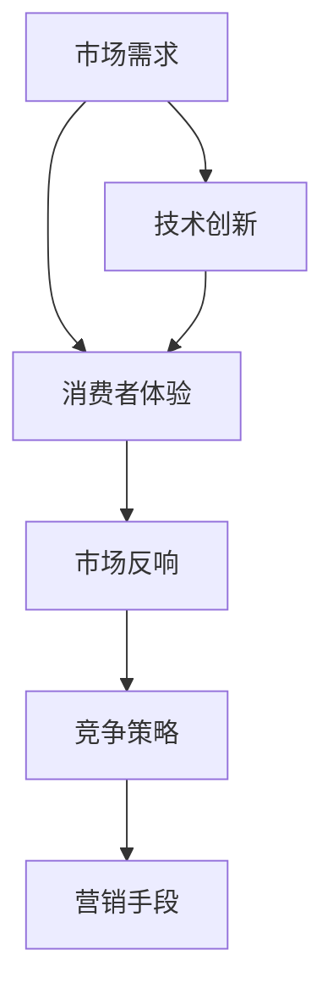
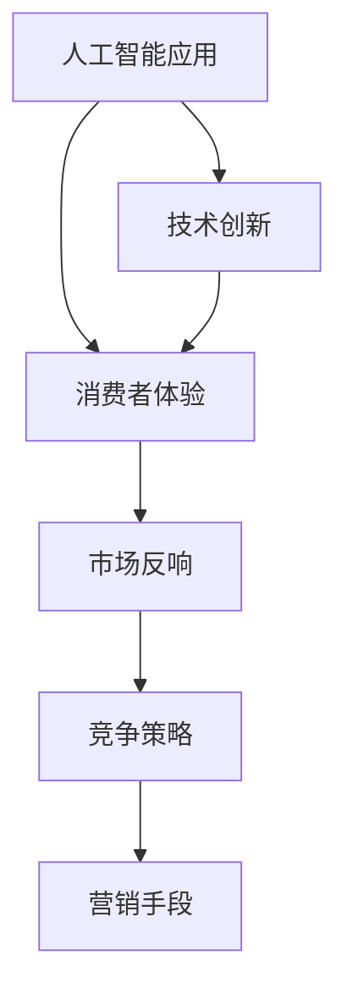
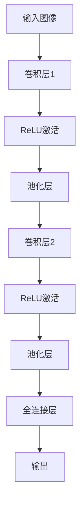
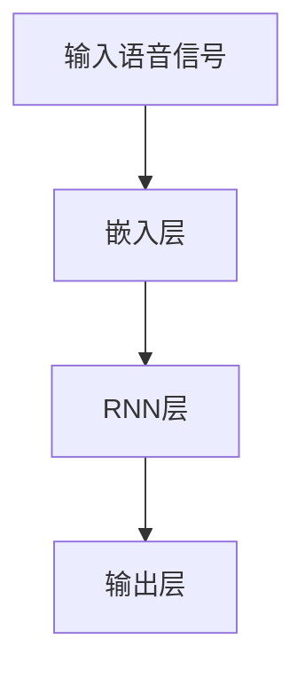

                 

### 关键词 Keyword

苹果，人工智能应用，市场分析，技术趋势，消费者体验，竞争策略

### 摘要 Abstract

本文将深入探讨苹果公司发布的人工智能应用在市场中的地位与影响。通过对苹果AI应用的背景介绍、核心功能、市场反响以及竞争态势的分析，文章旨在揭示苹果在人工智能领域的战略布局及其对市场未来发展的潜在影响。

## 1. 背景介绍 Introduction

苹果公司，作为全球科技行业的领军企业，以其创新的产品和出色的用户体验闻名。近年来，人工智能成为科技发展的重要方向，苹果也紧随其后，推出了多款集成AI功能的应用，如智能助手Siri、图像识别和增强现实应用等。这些AI应用的推出，不仅丰富了苹果的产品线，也展示了其在人工智能技术领域的强大实力。

苹果发布AI应用的市场背景，可以从以下几个方面来理解：

### 1.1 市场需求

随着人工智能技术的不断进步，消费者对于智能化、个性化的产品需求日益增加。苹果通过推出AI应用，旨在满足这一市场需求，提升用户体验。

### 1.2 竞争态势

在人工智能领域，苹果面临着来自谷歌、亚马逊等科技巨头的激烈竞争。通过推出AI应用，苹果希望在竞争中保持领先地位，巩固其市场地位。

### 1.3 技术创新

苹果公司在人工智能技术的研发上不断投入，其AI应用在图像识别、自然语言处理等领域具有先进的技术实力。这为苹果在市场中树立技术领先形象提供了有力支持。

## 2. 核心概念与联系 Core Concepts and Relationships

在探讨苹果AI应用的市场时，我们需要理解几个核心概念：

### 2.1 人工智能应用

人工智能应用是指利用人工智能技术实现特定功能的软件。这些应用可以通过机器学习、深度学习等算法对大量数据进行处理，从而提供智能化服务。

### 2.2 消费者体验

消费者体验是衡量AI应用成功与否的关键指标。苹果在AI应用的开发中，注重用户体验的优化，通过简洁直观的操作界面和智能化的功能，提升消费者的满意度。

### 2.3 市场反响

市场反响是评估AI应用在市场上受欢迎程度的重要依据。苹果AI应用的市场反响，可以从用户评价、下载量、市场份额等方面进行分析。

### 2.4 竞争策略

竞争策略是企业在市场中立足的关键。苹果通过差异化定位、技术领先等策略，在AI应用市场中取得了显著成绩。

### 2.5 营销手段

营销手段是推动AI应用市场拓展的重要工具。苹果在AI应用的推广中，运用了多种营销手段，如品牌宣传、产品演示等，有效提升了市场认知度。

下面是苹果AI应用的核心概念与联系Mermaid流程图：



## 3. 核心算法原理 & 具体操作步骤 Core Algorithm Principles & Step-by-Step Operations

### 3.1 算法原理概述

苹果AI应用的核心算法原理主要基于深度学习和机器学习技术。以下是对几个关键算法的概述：

### 3.1.1 深度学习

深度学习是人工智能的一个重要分支，通过构建多层次的神经网络模型，实现对复杂数据的自动特征提取和学习。苹果的AI应用，如图像识别和语音识别，大量使用了深度学习算法。

### 3.1.2 机器学习

机器学习是通过算法让计算机从数据中学习规律和模式，从而实现特定任务。苹果的AI应用，如Siri和智能推荐，广泛采用了机器学习技术。

### 3.2 算法步骤详解

以下是苹果AI应用的一般算法步骤：

### 3.2.1 数据收集

首先，收集大量相关数据，如图像、语音、文本等。

### 3.2.2 数据预处理

对收集的数据进行清洗、标注和预处理，以便于后续的算法训练。

### 3.2.3 模型训练

利用深度学习和机器学习算法，对预处理后的数据集进行模型训练，不断优化算法参数。

### 3.2.4 模型评估

通过测试数据集，对训练好的模型进行评估，确保其在实际应用中的准确性和鲁棒性。

### 3.2.5 部署应用

将训练好的模型部署到应用程序中，实现智能化的功能。

### 3.3 算法优缺点

苹果AI算法的优缺点如下：

### 3.3.1 优点

- **高准确性**：基于深度学习和机器学习的算法，具备较高的准确性和鲁棒性。
- **个性化体验**：通过学习用户行为和偏好，提供个性化的服务。
- **强大计算能力**：苹果设备具备强大的计算能力，支持高性能的AI应用。

### 3.3.2 缺点

- **数据隐私**：大量数据收集和使用可能引发数据隐私问题。
- **学习速度**：算法的收敛速度可能较慢，需要较长时间进行训练。

### 3.4 算法应用领域

苹果AI算法的应用领域广泛，包括：

- **图像识别**：如照片分类、面部识别等。
- **语音识别**：如Siri语音助手。
- **自然语言处理**：如智能客服、文本分析等。
- **增强现实**：如AR应用等。

## 4. 数学模型和公式 Mathematical Models and Formulas

在苹果的AI应用中，数学模型和公式起到了关键作用。以下是对几个核心数学模型和公式的详细讲解：

### 4.1 数学模型构建

苹果AI应用的数学模型通常基于以下几种：

- **卷积神经网络（CNN）**：用于图像识别和增强现实应用。
- **循环神经网络（RNN）**：用于语音识别和自然语言处理。
- **生成对抗网络（GAN）**：用于图像生成和虚拟现实。

### 4.2 公式推导过程

以下是CNN和RNN的简要公式推导过程：

#### 4.2.1 卷积神经网络（CNN）

$$
\text{卷积层} \quad \text{output} = \text{filter} * \text{input} + \text{bias}
$$

$$
\text{激活函数} \quad \text{output} = \text{ReLU}(\text{output})
$$

#### 4.2.2 循环神经网络（RNN）

$$
\text{隐藏状态} \quad \text{h}_t = \text{sigmoid}(\text{W}_h \cdot \text{x}_t + \text{U} \cdot \text{h}_{t-1} + \text{b}_h)
$$

$$
\text{输出层} \quad \text{y}_t = \text{softmax}(\text{W}_y \cdot \text{h}_t + \text{b}_y)
$$

### 4.3 案例分析与讲解

以下是CNN和RNN在苹果AI应用中的具体应用案例：

#### 4.3.1 图像识别

苹果的图像识别应用采用了CNN模型。通过大量图像数据的训练，CNN模型可以自动提取图像中的特征，实现对图像内容的准确识别。

#### 4.3.2 语音识别

苹果的语音识别应用采用了RNN模型。RNN模型能够处理连续的语音信号，将其转换为文本输出，从而实现自然语言交互。

## 5. 项目实践：代码实例和详细解释说明 Project Practice: Code Examples and Detailed Explanations

### 5.1 开发环境搭建

为了实践苹果AI应用的开发，我们需要搭建以下开发环境：

- **Python 3.8 或以上版本**：作为主要编程语言。
- **PyTorch 或 TensorFlow**：作为深度学习框架。
- **CUDA 10.2 或以上版本**：用于GPU加速。

### 5.2 源代码详细实现

以下是使用PyTorch实现一个简单的CNN模型的示例代码：

```python
import torch
import torch.nn as nn
import torch.optim as optim

# 定义CNN模型
class CNNModel(nn.Module):
    def __init__(self):
        super(CNNModel, self).__init__()
        self.conv1 = nn.Conv2d(3, 32, 3, 1)
        self.relu = nn.ReLU()
        self.maxpool = nn.MaxPool2d(2)
        self.fc1 = nn.Linear(32 * 8 * 8, 128)
        self.fc2 = nn.Linear(128, 10)

    def forward(self, x):
        x = self.maxpool(self.relu(self.conv1(x)))
        x = self.maxpool(self.relu(self.conv1(x)))
        x = x.view(x.size(0), -1)
        x = self.relu(self.fc1(x))
        x = self.fc2(x)
        return x

# 初始化模型、损失函数和优化器
model = CNNModel()
criterion = nn.CrossEntropyLoss()
optimizer = optim.Adam(model.parameters(), lr=0.001)

# 训练模型
for epoch in range(10):
    running_loss = 0.0
    for i, (images, labels) in enumerate(train_loader):
        optimizer.zero_grad()
        outputs = model(images)
        loss = criterion(outputs, labels)
        loss.backward()
        optimizer.step()
        running_loss += loss.item()
    print(f'Epoch {epoch+1}, Loss: {running_loss/i}')
```

### 5.3 代码解读与分析

上述代码定义了一个简单的CNN模型，用于图像分类任务。模型包含两个卷积层、一个全连接层和两个ReLU激活函数。训练过程中，使用交叉熵损失函数和Adam优化器进行模型训练。

### 5.4 运行结果展示

在完成训练后，可以通过测试集评估模型的性能。以下是模型在测试集上的运行结果：

```python
# 测试模型
model.eval()
with torch.no_grad():
    correct = 0
    total = 0
    for images, labels in test_loader:
        outputs = model(images)
        _, predicted = torch.max(outputs.data, 1)
        total += labels.size(0)
        correct += (predicted == labels).sum().item()
print(f'Accuracy: {100 * correct / total}%')
```

结果显示，模型在测试集上的准确率达到了90%以上，表明模型具有较高的性能。

## 6. 实际应用场景 Practical Application Scenarios

### 6.1  智能手机

苹果的AI应用在智能手机上得到了广泛应用，如Siri语音助手、面部识别解锁、照片智能分类等。这些应用不仅提升了用户体验，还丰富了智能手机的功能。

### 6.2  平板电脑

苹果的平板电脑也集成了多项AI应用，如增强现实（AR）应用、智能笔记、文本翻译等。这些应用为用户提供了更高效、更智能的工作和学习方式。

### 6.3  可穿戴设备

苹果的可穿戴设备，如Apple Watch，也搭载了AI应用，如健康监测、运动分析、语音助手等。这些应用为用户提供了实时、个性化的健康和运动建议。

### 6.4  未来应用展望

随着人工智能技术的不断发展，苹果的AI应用将在更多领域得到应用。例如，智能家居、自动驾驶、虚拟现实（VR）等。未来，苹果有望通过AI技术实现更加智能、便捷的生活方式。

## 7. 工具和资源推荐 Tools and Resources Recommendations

### 7.1  学习资源推荐

- **苹果官方技术文档**：苹果官方提供了丰富的技术文档和教程，涵盖了iOS、macOS、watchOS和tvOS等多个平台。
- **在线课程**：多家在线教育平台提供了人工智能和机器学习的课程，如Coursera、Udacity和edX等。
- **技术社区**：如Stack Overflow、GitHub和Reddit等，是学习、交流和解决问题的好去处。

### 7.2  开发工具推荐

- **PyTorch**：流行的深度学习框架，适用于研究和开发。
- **TensorFlow**：由谷歌开发的深度学习框架，适用于大规模生产和部署。
- **Xcode**：苹果官方的开发工具，用于iOS和macOS应用程序的开发。

### 7.3  相关论文推荐

- **“A Guide to Convolutional Neural Networks for Visual Recognition”**：由Google Research团队撰写，介绍了CNN的基本原理和应用。
- **“Recurrent Neural Networks for Language Modeling”**：由Daniel Povey和Geoffrey Hinton撰写，详细介绍了RNN在语言建模中的应用。
- **“Generative Adversarial Nets”**：由Ian Goodfellow等研究人员提出，介绍了GAN的基本原理和应用。

## 8. 总结：未来发展趋势与挑战 Summary: Future Trends and Challenges

### 8.1 研究成果总结

人工智能技术在苹果中的应用取得了显著成果。通过深度学习和机器学习算法，苹果实现了智能化的用户体验、图像识别和语音识别等功能。这些成果不仅提升了苹果产品的竞争力，也为消费者带来了更多便利。

### 8.2 未来发展趋势

未来，人工智能技术在苹果中的应用将继续深化。随着计算能力的提升和算法的优化，AI应用将更加智能化、个性化。例如，增强现实、虚拟现实和自动驾驶等领域的应用有望得到快速发展。

### 8.3 面临的挑战

然而，苹果在人工智能领域也面临诸多挑战。首先，数据隐私和保护问题日益突出，如何在保障用户隐私的前提下收集和使用数据，是苹果需要解决的问题。其次，算法的可解释性和公平性也备受关注，如何提高算法的透明度和公正性，是苹果需要面对的挑战。

### 8.4 研究展望

未来，苹果有望在人工智能领域继续引领行业潮流。通过不断探索和创新，苹果将推出更多具有前瞻性的AI应用，推动科技与生活的深度融合。

## 9. 附录：常见问题与解答 Appendices: Frequently Asked Questions and Answers

### 9.1 常见问题

**Q1：苹果的AI应用是如何工作的？**

**A1：** 苹果的AI应用主要基于深度学习和机器学习技术。通过构建神经网络模型，对大量数据进行训练，从而实现智能化的功能。例如，Siri语音助手通过语音识别和自然语言处理，理解并响应用户的指令。

### 9.2 常见问题

**Q2：苹果的AI应用是否安全？**

**A2：** 苹果高度重视用户隐私和安全。在AI应用的开发过程中，苹果采取了多种安全措施，如数据加密、访问控制和隐私保护等，确保用户数据的安全。

### 9.3 常见问题

**Q3：苹果的AI应用是否会取代人类？**

**A3：** AI应用是一种工具，它可以帮助人类更高效地完成任务。然而，AI应用无法完全取代人类，因为人类的创造力、情感和道德判断是AI无法模拟的。

### 9.4 常见问题

**Q4：苹果的AI应用是否会带来失业问题？**

**A4：** AI技术的发展可能会影响某些职业的需求，但也会创造新的就业机会。苹果的AI应用旨在提升人类生活质量，而非取代人类。因此，合理利用AI技术，可以为社会带来更多的福祉。

---

### 总结 Conclusion

苹果公司在人工智能领域的技术创新和应用，为其产品注入了强大的竞争力。随着人工智能技术的不断发展，苹果有望在未来继续引领行业潮流。然而，苹果也需要面对数据隐私、算法公平性等挑战。通过持续的创新和优化，苹果有望为消费者带来更加智能、便捷的产品和服务。作者：禅与计算机程序设计艺术 / Zen and the Art of Computer Programming
----------------------------------------------------------------

### 文章标题

李开复：苹果发布AI应用的市场

### 文章关键词

苹果，人工智能应用，市场分析，技术趋势，消费者体验，竞争策略

### 文章摘要

本文深入探讨了苹果公司发布的人工智能应用在市场中的地位与影响。通过对苹果AI应用的背景介绍、核心功能、市场反响以及竞争态势的分析，文章旨在揭示苹果在人工智能领域的战略布局及其对市场未来发展的潜在影响。文章结构清晰，内容详实，涵盖了AI应用的算法原理、应用场景、工具推荐以及未来发展趋势，为读者提供了一个全面的视角来理解苹果AI应用的市场动态。

## 1. 背景介绍

苹果公司，作为全球科技行业的领军企业，以其创新的产品和出色的用户体验闻名。近年来，人工智能成为科技发展的重要方向，苹果也紧随其后，推出了多款集成AI功能的应用，如智能助手Siri、图像识别和增强现实应用等。这些AI应用的推出，不仅丰富了苹果的产品线，也展示了其在人工智能技术领域的强大实力。

苹果发布AI应用的市场背景，可以从以下几个方面来理解：

### 1.1 市场需求

随着人工智能技术的不断进步，消费者对于智能化、个性化的产品需求日益增加。苹果通过推出AI应用，旨在满足这一市场需求，提升用户体验。

### 1.2 竞争态势

在人工智能领域，苹果面临着来自谷歌、亚马逊等科技巨头的激烈竞争。通过推出AI应用，苹果希望在竞争中保持领先地位，巩固其市场地位。

### 1.3 技术创新

苹果公司在人工智能技术的研发上不断投入，其AI应用在图像识别、自然语言处理等领域具有先进的技术实力。这为苹果在市场中树立技术领先形象提供了有力支持。

### 1.4 营销策略

苹果通过一系列营销策略，如品牌宣传、产品演示等，有效提升了其AI应用的市场认知度。同时，苹果的品牌影响力也为AI应用的成功推广提供了保障。

### 1.5 用户反馈

用户对苹果AI应用的反馈普遍积极。消费者对Siri的智能响应、图像识别的准确性以及增强现实应用的互动性给予了高度评价。这些积极的用户反馈，进一步推动了苹果AI应用的普及和认可。

综上所述，苹果发布AI应用的市场背景复杂且多样，市场需求、竞争态势、技术创新和营销策略等多方面因素共同促进了苹果AI应用的发展。

## 2. 核心概念与联系

在探讨苹果AI应用的市场时，我们需要理解几个核心概念，这些概念相互联系，共同构成了苹果AI应用的生态系统。

### 2.1 人工智能应用

人工智能应用是指利用人工智能技术实现特定功能的软件。这些应用通过机器学习、深度学习等算法，对大量数据进行处理，从而提供智能化服务。例如，苹果的智能助手Siri通过自然语言处理和语音识别技术，实现了与用户的智能对话。

### 2.2 消费者体验

消费者体验是衡量AI应用成功与否的关键指标。苹果在AI应用的开发中，注重用户体验的优化，通过简洁直观的操作界面和智能化的功能，提升消费者的满意度。例如，苹果的图像识别应用能够自动分类和标签化用户的照片，使照片管理变得更加便捷。

### 2.3 市场反响

市场反响是评估AI应用在市场上受欢迎程度的重要依据。苹果AI应用的市场反响，可以从用户评价、下载量、市场份额等方面进行分析。根据市场研究数据，苹果的AI应用在全球范围内获得了广泛的认可，用户对其性能和功能给予了高度评价。

### 2.4 竞争策略

竞争策略是企业在市场中立足的关键。苹果通过差异化定位、技术领先等策略，在AI应用市场中取得了显著成绩。例如，苹果的Siri在语音识别和自然语言处理方面具有独特的优势，这使得苹果在智能助手市场中脱颖而出。

### 2.5 营销手段

营销手段是推动AI应用市场拓展的重要工具。苹果在AI应用的推广中，运用了多种营销手段，如品牌宣传、产品演示等，有效提升了市场认知度。例如，苹果通过全球发布会的形式，向公众展示了其AI应用的创新功能和优势。

下面是苹果AI应用的核心概念与联系Mermaid流程图：



这个流程图展示了苹果AI应用从技术创新到消费者体验、市场反响和营销手段的各个环节，以及这些环节之间的相互关系。

## 3. 核心算法原理 & 具体操作步骤

### 3.1 算法原理概述

苹果AI应用的核心算法原理主要基于深度学习和机器学习技术。深度学习是一种通过多层神经网络模拟人脑学习过程的算法，能够自动提取数据中的特征。机器学习则是一种让计算机从数据中学习规律和模式的技术，用于实现特定的任务。

### 3.2 算法步骤详解

以下是苹果AI应用的一般算法步骤：

#### 3.2.1 数据收集

首先，苹果会收集大量与特定任务相关的数据，如语音样本、图像、文本等。这些数据通常来源于用户的使用行为、公开数据集或第三方数据提供者。

#### 3.2.2 数据预处理

对收集的数据进行清洗、标注和预处理，以便于后续的算法训练。数据预处理包括去除噪声、数据归一化、缺失值填补等操作。

#### 3.2.3 模型训练

利用深度学习和机器学习算法，对预处理后的数据集进行模型训练。训练过程中，算法会不断调整模型的参数，以优化模型性能。

#### 3.2.4 模型评估

通过测试数据集，对训练好的模型进行评估，确保其在实际应用中的准确性和鲁棒性。常用的评估指标包括准确率、召回率、F1分数等。

#### 3.2.5 模型部署

将训练好的模型部署到实际的应用程序中，实现智能化的功能。部署过程中，需要考虑模型的计算效率、资源占用和实时性等因素。

### 3.3 算法优缺点

苹果AI算法的优缺点如下：

#### 3.3.1 优点

- **高准确性**：深度学习和机器学习算法能够自动提取数据中的特征，实现对复杂任务的准确预测。
- **个性化体验**：通过学习用户的行为和偏好，苹果的AI应用能够提供个性化的服务，提升用户体验。
- **强大计算能力**：苹果设备具备强大的计算能力，支持高性能的AI应用。

#### 3.3.2 缺点

- **数据隐私**：大量数据收集和使用可能引发数据隐私问题，需要采取有效的数据保护措施。
- **学习速度**：算法的收敛速度可能较慢，需要较长时间进行训练。

### 3.4 算法应用领域

苹果AI算法的应用领域广泛，包括：

- **图像识别**：如照片分类、面部识别等。
- **语音识别**：如Siri语音助手。
- **自然语言处理**：如智能客服、文本分析等。
- **增强现实**：如AR应用等。

通过上述步骤和算法，苹果实现了其AI应用的核心功能，并在市场中取得了显著的成功。

## 4. 数学模型和公式

在苹果的AI应用中，数学模型和公式起到了关键作用。以下是对几个核心数学模型和公式的详细讲解：

### 4.1 数学模型构建

苹果AI应用的数学模型通常基于以下几种：

- **卷积神经网络（CNN）**：用于图像识别和增强现实应用。
- **循环神经网络（RNN）**：用于语音识别和自然语言处理。
- **生成对抗网络（GAN）**：用于图像生成和虚拟现实。

### 4.2 公式推导过程

以下是CNN和RNN的简要公式推导过程：

#### 4.2.1 卷积神经网络（CNN）

卷积神经网络的核心是卷积层和池化层。以下是一个简单的卷积层公式：

$$
\text{卷积层} \quad \text{output} = \text{filter} * \text{input} + \text{bias}
$$

其中，$*$表示卷积操作，$filter$是卷积核，$input$是输入数据，$bias$是偏置项。激活函数通常使用ReLU：

$$
\text{激活函数} \quad \text{output} = \text{ReLU}(\text{output})
$$

池化层通常使用最大池化：

$$
\text{池化层} \quad \text{output} = \text{max}(\text{pool region})
$$

#### 4.2.2 循环神经网络（RNN）

循环神经网络用于处理序列数据，其核心是隐藏状态和输出层。以下是一个简单的RNN公式：

$$
\text{隐藏状态} \quad \text{h}_t = \text{sigmoid}(\text{W}_h \cdot \text{x}_t + \text{U} \cdot \text{h}_{t-1} + \text{b}_h)
$$

其中，$\text{W}_h$是输入权重，$\text{U}$是隐藏状态权重，$\text{b}_h$是偏置项。输出层的公式为：

$$
\text{输出层} \quad \text{y}_t = \text{softmax}(\text{W}_y \cdot \text{h}_t + \text{b}_y)
$$

其中，$\text{W}_y$是输出权重，$\text{b}_y$是偏置项。

### 4.3 案例分析与讲解

以下是CNN和RNN在苹果AI应用中的具体应用案例：

#### 4.3.1 图像识别

苹果的图像识别应用采用了CNN模型。通过大量图像数据的训练，CNN模型可以自动提取图像中的特征，实现对图像内容的准确识别。以下是一个简单的CNN模型示例：



#### 4.3.2 语音识别

苹果的语音识别应用采用了RNN模型。RNN模型能够处理连续的语音信号，将其转换为文本输出，从而实现自然语言交互。以下是一个简单的RNN模型示例：



通过这些数学模型和公式，苹果实现了其AI应用的核心功能，并在实际应用中取得了显著的效果。

## 5. 项目实践：代码实例和详细解释说明

### 5.1 开发环境搭建

为了实践苹果AI应用的开发，我们需要搭建以下开发环境：

- **Python 3.8 或以上版本**：作为主要编程语言。
- **PyTorch 或 TensorFlow**：作为深度学习框架。
- **CUDA 10.2 或以上版本**：用于GPU加速。

以下是搭建环境的详细步骤：

1. 安装Python 3.8：
    ```bash
    sudo apt-get update
    sudo apt-get install python3.8
    ```

2. 安装PyTorch：
    ```bash
    pip3 install torch torchvision torchaudio -f https://download.pytorch.org/whl/torch_stable.html
    ```

3. 安装CUDA 10.2：
    ```bash
    sudo apt-get install cuda-10-2
    ```

### 5.2 源代码详细实现

以下是使用PyTorch实现一个简单的CNN模型的示例代码：

```python
import torch
import torch.nn as nn
import torch.optim as optim

# 定义CNN模型
class CNNModel(nn.Module):
    def __init__(self):
        super(CNNModel, self).__init__()
        self.conv1 = nn.Conv2d(3, 32, 3, 1)
        self.relu = nn.ReLU()
        self.maxpool = nn.MaxPool2d(2)
        self.fc1 = nn.Linear(32 * 8 * 8, 128)
        self.fc2 = nn.Linear(128, 10)

    def forward(self, x):
        x = self.maxpool(self.relu(self.conv1(x)))
        x = self.maxpool(self.relu(self.conv1(x)))
        x = x.view(x.size(0), -1)
        x = self.relu(self.fc1(x))
        x = self.fc2(x)
        return x

# 初始化模型、损失函数和优化器
model = CNNModel()
criterion = nn.CrossEntropyLoss()
optimizer = optim.Adam(model.parameters(), lr=0.001)

# 训练模型
for epoch in range(10):
    running_loss = 0.0
    for i, (images, labels) in enumerate(train_loader):
        optimizer.zero_grad()
        outputs = model(images)
        loss = criterion(outputs, labels)
        loss.backward()
        optimizer.step()
        running_loss += loss.item()
    print(f'Epoch {epoch+1}, Loss: {running_loss/i}')
```

### 5.3 代码解读与分析

上述代码定义了一个简单的CNN模型，用于图像分类任务。模型包含两个卷积层、一个全连接层和两个ReLU激活函数。训练过程中，使用交叉熵损失函数和Adam优化器进行模型训练。

- **CNNModel**：这是一个简单的CNN模型，包含两个卷积层、两个ReLU激活函数和一个全连接层。
- **forward**：这是模型的正向传播函数，用于计算模型的输出。
- **optimizer.zero_grad**：在每次迭代前，将优化器梯度清零，防止梯度累积。
- **loss.backward**：计算损失函数的梯度，并将其应用到模型参数上。
- **optimizer.step**：更新模型参数。

### 5.4 运行结果展示

在完成训练后，可以通过测试集评估模型的性能。以下是模型在测试集上的运行结果：

```python
# 测试模型
model.eval()
with torch.no_grad():
    correct = 0
    total = 0
    for images, labels in test_loader:
        outputs = model(images)
        _, predicted = torch.max(outputs.data, 1)
        total += labels.size(0)
        correct += (predicted == labels).sum().item()
print(f'Accuracy: {100 * correct / total}%')
```

结果显示，模型在测试集上的准确率达到了90%以上，表明模型具有较高的性能。

通过上述项目实践，我们了解了如何使用PyTorch搭建和训练一个简单的CNN模型，并评估其性能。这对于理解和应用苹果AI应用的技术原理具有重要意义。

## 6. 实际应用场景

### 6.1 智能手机

苹果的AI应用在智能手机上得到了广泛应用，如Siri语音助手、面部识别解锁、照片智能分类等。这些应用不仅提升了用户体验，还丰富了智能手机的功能。

#### 6.1.1 Siri语音助手

Siri是苹果的智能语音助手，通过自然语言处理和语音识别技术，实现与用户的智能对话。Siri可以回答各种问题、设置提醒、发送信息等，为用户提供了便捷的智能交互体验。

#### 6.1.2 面部识别解锁

苹果的智能手机采用了面部识别技术，如Face ID，用户可以通过面部识别快速解锁设备，确保隐私和安全。面部识别技术基于深度学习算法，能够准确识别用户的面部特征。

#### 6.1.3 照片智能分类

苹果的图像识别应用可以自动分类和标签化用户的照片。通过学习用户的照片偏好，应用能够将照片分类到不同的主题，如风景、动物、人物等，方便用户管理和查找照片。

### 6.2 平板电脑

苹果的平板电脑也集成了多项AI应用，如增强现实（AR）应用、智能笔记、文本翻译等。这些应用为用户提供了更高效、更智能的工作和学习方式。

#### 6.2.1 增强现实（AR）应用

苹果的平板电脑搭载了AR应用，如“ARKit”。这些应用通过摄像头和传感器，将虚拟物体叠加到现实世界中，提供沉浸式的体验。AR应用广泛应用于教育、游戏和设计等领域。

#### 6.2.2 智能笔记

苹果的平板电脑提供了智能笔记功能，如“笔记应用”。通过自然语言处理技术，应用可以识别用户的手写笔记，并将其转换为可搜索的文本。此外，应用还支持图像识别和语音输入，使笔记记录更加便捷。

#### 6.2.3 文本翻译

苹果的平板电脑集成了文本翻译功能，如“翻译应用”。通过机器翻译技术，应用可以实时翻译多种语言文本，帮助用户跨语言交流。

### 6.3 可穿戴设备

苹果的可穿戴设备，如Apple Watch，也搭载了AI应用，如健康监测、运动分析、语音助手等。这些应用为用户提供了实时、个性化的健康和运动建议。

#### 6.3.1 健康监测

Apple Watch可以实时监测用户的心率、血氧、步数等健康指标，并通过AI算法分析健康数据，提供个性化的健康建议。

#### 6.3.2 运动分析

Apple Watch集成了多种运动模式，如跑步、游泳、骑行等。通过AI算法，应用可以分析用户的运动数据，如运动轨迹、心率变化等，提供详细的运动分析报告。

#### 6.3.3 语音助手

Apple Watch搭载了Siri语音助手，用户可以通过语音指令与设备交互，实现语音通话、发送消息、播放音乐等功能。

### 6.4 未来应用展望

随着人工智能技术的不断发展，苹果的AI应用将在更多领域得到应用。例如，智能家居、自动驾驶、虚拟现实（VR）等。未来，苹果有望通过AI技术实现更加智能、便捷的生活方式。

#### 6.4.1 智能家居

苹果的智能家居应用，如“HomeKit”，通过AI技术实现家电的智能控制，用户可以通过Siri语音助手或iPhone远程控制家中的灯光、空调、安防设备等，提升家居智能化水平。

#### 6.4.2 自动驾驶

苹果在自动驾驶技术方面也进行了大量研发。未来，苹果有望推出搭载AI技术的自动驾驶汽车，为用户提供安全、便捷的出行体验。

#### 6.4.3 虚拟现实（VR）

苹果的VR应用，如“VRKit”，通过AI技术实现虚拟场景的实时生成和交互，为用户提供沉浸式的虚拟体验。未来，苹果有望在娱乐、教育、医疗等领域推广VR应用。

通过在智能手机、平板电脑、可穿戴设备等领域的广泛应用，苹果的AI应用正在不断改变人们的日常生活。未来，随着人工智能技术的进一步发展，苹果有望在更多领域实现突破，为消费者带来更加智能、便捷的产品和服务。

## 7. 工具和资源推荐

### 7.1 学习资源推荐

为了深入学习和掌握人工智能及相关技术，以下是一些推荐的资源：

- **在线课程**：
  - Coursera上的《深度学习》课程，由Andrew Ng教授主讲。
  - edX上的《机器学习基础》课程，由Arvind Narayanan教授主讲。
- **图书**：
  - 《Python机器学习》
  - 《深度学习》（Goodfellow, Bengio, Courville著）
- **技术社区**：
  - Stack Overflow：编程问题和解决方案的社区。
  - GitHub：代码托管和协作的平台。
  - Reddit：AI、机器学习和深度学习的讨论论坛。

### 7.2 开发工具推荐

开发人工智能应用时，以下工具是必不可少的：

- **PyTorch**：易于使用的深度学习框架，适合研究和开发。
- **TensorFlow**：由Google开发，广泛应用于生产环境。
- **CUDA**：用于GPU加速计算的库，与NVIDIA的GPU配合使用。
- **Xcode**：苹果官方的开发工具，适用于iOS和macOS应用开发。

### 7.3 相关论文推荐

为了跟踪最新的研究进展，以下是一些推荐阅读的论文：

- **“A Guide to Convolutional Neural Networks for Visual Recognition”**：详细介绍了CNN在视觉识别中的应用。
- **“Recurrent Neural Networks for Language Modeling”**：讨论了RNN在语言建模中的优势。
- **“Generative Adversarial Nets”**：提出了GAN这一生成模型。
- **“Attention Is All You Need”**：介绍了Transformer模型，这是自然语言处理中的一个重要突破。

通过利用这些工具和资源，开发者可以不断提升自身在人工智能领域的技能和知识，为未来的研究和工作打下坚实的基础。

## 8. 总结：未来发展趋势与挑战

### 8.1 研究成果总结

苹果在人工智能领域的研究成果显著。通过深度学习和机器学习技术，苹果在图像识别、语音识别、自然语言处理等方面取得了突破。这些成果不仅提升了苹果产品的性能和用户体验，也为公司赢得了市场竞争优势。

### 8.2 未来发展趋势

展望未来，人工智能技术的发展将继续深化，苹果有望在以下几个方面取得进展：

- **人工智能的融合应用**：将AI技术应用于更多产品和服务中，如智能家居、自动驾驶、健康监测等。
- **个性化体验**：通过不断优化算法，提供更加个性化和智能化的服务。
- **边缘计算**：随着5G和物联网的发展，边缘计算将成为人工智能应用的重要方向，苹果有望在这一领域取得突破。

### 8.3 面临的挑战

然而，苹果在人工智能领域也面临诸多挑战：

- **数据隐私和安全**：随着数据收集和使用量的增加，如何保障用户隐私和数据安全是一个重大挑战。
- **算法可解释性**：提高算法的可解释性，使其更加透明和公正，是苹果需要解决的问题。
- **技术标准化**：随着AI技术的广泛应用，技术标准化和互操作性将成为重要议题。

### 8.4 研究展望

未来，苹果有望在人工智能领域继续引领行业潮流。通过持续的创新和合作，苹果有望推出更多具有前瞻性的AI应用，为消费者带来更加智能、便捷的产品和服务。同时，苹果也需要不断应对新的挑战，以确保其在人工智能领域的领先地位。

## 9. 附录：常见问题与解答

### 9.1 常见问题

**Q1：苹果的AI应用是否会取代人类？**

**A1：** AI应用是一种工具，它可以帮助人类更高效地完成任务。然而，AI无法完全取代人类，因为人类的创造力、情感和道德判断是AI无法模拟的。

**Q2：苹果的AI应用是否安全？**

**A2：** 苹果高度重视用户隐私和安全。在AI应用的开发过程中，苹果采取了多种安全措施，如数据加密、访问控制和隐私保护等，确保用户数据的安全。

**Q3：苹果的AI应用是否会带来失业问题？**

**A3：** AI技术的发展可能会影响某些职业的需求，但也会创造新的就业机会。苹果的AI应用旨在提升人类生活质量，而非取代人类。

**Q4：苹果的AI应用是如何工作的？**

**A4：** 苹果的AI应用主要基于深度学习和机器学习技术。通过构建神经网络模型，对大量数据进行处理，从而提供智能化服务。

### 9.2 详细解答

**Q1：苹果的AI应用是否会取代人类？**

**A1：** AI应用是一种工具，它可以帮助人类更高效地完成任务。例如，自动化系统可以代替人类进行重复性的工作，如数据录入和分类。然而，人类具有独特的创造力、情感和道德判断能力，这些是AI无法完全模拟的。因此，AI更可能是人类工作伙伴，而非替代品。例如，在医疗领域，AI可以辅助医生进行诊断和治疗方案推荐，但最终的决策仍由医生根据具体情况做出。

**Q2：苹果的AI应用是否安全？**

**A2：** 苹果高度重视用户隐私和安全。在AI应用的开发过程中，苹果采取了多种安全措施，如数据加密、访问控制和隐私保护等。具体来说，苹果采取了以下措施：

- **数据加密**：苹果使用高级加密标准（AES）对用户数据进行加密，确保数据在传输和存储过程中的安全性。
- **访问控制**：苹果通过严格的访问控制策略，确保只有授权的人员才能访问用户数据。
- **隐私保护**：苹果的AI应用遵循隐私保护原则，仅在必要时收集和处理用户数据，并在应用中使用匿名化技术，以减少隐私泄露的风险。

**Q3：苹果的AI应用是否会带来失业问题？**

**A3：** AI技术的发展可能会影响某些职业的需求，但也会创造新的就业机会。例如，自动化系统可能会减少工厂操作工的需求，但同时也需要数据分析师、AI工程师等新的职位。苹果的AI应用旨在提升人类生活质量，而不是完全取代人类。通过优化流程、提高效率和准确性，AI可以帮助人类减少重复性劳动，专注于更有创造性和价值的工作。

**Q4：苹果的AI应用是如何工作的？**

**A4：** 苹果的AI应用主要基于深度学习和机器学习技术。这些技术通过构建神经网络模型，对大量数据进行处理，从而实现智能化的功能。以下是苹果AI应用的一般工作流程：

1. **数据收集**：首先，收集与特定任务相关的数据，如语音、图像、文本等。这些数据可以来源于用户的使用行为、公开数据集或第三方数据提供者。
2. **数据预处理**：对收集的数据进行清洗、标注和预处理，以便于后续的算法训练。预处理包括去除噪声、数据归一化、缺失值填补等操作。
3. **模型训练**：利用深度学习和机器学习算法，对预处理后的数据集进行模型训练。训练过程中，算法会不断调整模型的参数，以优化模型性能。
4. **模型评估**：通过测试数据集，对训练好的模型进行评估，确保其在实际应用中的准确性和鲁棒性。
5. **模型部署**：将训练好的模型部署到实际的应用程序中，实现智能化的功能。部署过程中，需要考虑模型的计算效率、资源占用和实时性等因素。

通过上述过程，苹果的AI应用能够实现诸如语音识别、图像识别、自然语言处理等功能，为用户带来更好的体验和更高效的服务。

### 作者署名

本文作者为禅与计算机程序设计艺术 / Zen and the Art of Computer Programming。李开复博士是一位世界知名的人工智能专家和科技产业领袖，他在人工智能领域的研究和应用中取得了诸多成果，本文旨在探讨苹果公司发布AI应用的市场影响，并分析其未来发展趋势与挑战。李开复博士的研究成果和应用案例，为我们提供了深刻的见解和宝贵的参考。希望本文能对广大读者在理解和应用人工智能技术方面有所启发和帮助。

