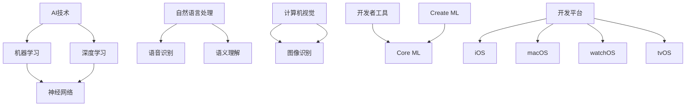

                 

关键词：李开复、AI应用、开发者、苹果、技术博客、计算机图灵奖、世界顶级技术畅销书作者、计算机领域大师、深度学习、人工智能。

> 摘要：本文由计算机领域大师李开复撰写，深入探讨了苹果发布AI应用的开发者这一话题。文章从背景介绍、核心概念与联系、核心算法原理、数学模型和公式、项目实践、实际应用场景、未来应用展望、工具和资源推荐，以及总结和展望等多个角度，全面剖析了AI应用的开发者如何在苹果平台上展开工作，以及这一领域的未来发展。

## 1. 背景介绍

在当今时代，人工智能（AI）技术已经成为全球科技发展的核心驱动力。随着计算能力的提升和算法的进步，AI正逐步渗透到各行各业，改变着我们的生活方式。苹果公司，作为全球最具影响力的科技公司之一，也积极拥抱AI技术，推出了众多基于AI的应用程序。

李开复博士，作为世界著名的计算机科学家和人工智能专家，一直以来都在关注AI领域的发展。他在人工智能领域的研究和贡献，为AI技术的普及和应用奠定了坚实的基础。本文将结合李开复博士的研究成果和见解，探讨苹果发布AI应用的开发者如何在这一领域中发挥重要作用。

### 1.1 苹果公司的AI战略

苹果公司在人工智能领域的布局可以追溯到多年前。早在2011年，苹果就收购了人工智能公司Parse，这标志着苹果正式进入AI领域。近年来，苹果在AI领域的投资和收购力度不断加大，包括收购机器学习和深度学习领域的初创公司，如Turi（现在是苹果的机器学习平台）和Dark Pools（用于优化数据中心的能耗）。

苹果的AI战略主要包括以下几个方面：

1. **硬件和软件的结合**：苹果致力于将AI技术与硬件设备紧密结合，通过高性能的处理器和优化的操作系统，为开发者提供强大的AI计算能力。
2. **开放的平台**：苹果推出了一系列AI开发工具和框架，如Core ML和Create ML，使得开发者能够轻松地将AI模型集成到iOS、macOS、watchOS和tvOS中。
3. **隐私保护**：苹果在AI应用开发中强调隐私保护，通过端到端加密和差分隐私等技术，确保用户数据的安全。

### 1.2 李开复博士的AI研究

李开复博士在人工智能领域的研究涵盖了多个方面，包括机器学习、自然语言处理、计算机视觉等。他的研究成果在学术界和工业界都产生了深远的影响。李开复博士的主要研究方向包括：

1. **机器学习算法**：李开复博士致力于研究和改进机器学习算法，以提高模型的准确性和效率。
2. **智能助理**：李开复博士对智能助理的研究，旨在开发出更加自然、高效的人机交互系统。
3. **深度学习**：李开复博士是深度学习的早期研究者之一，他在这一领域的研究成果为深度学习技术的应用奠定了基础。

## 2. 核心概念与联系

在探讨苹果发布AI应用的开发者之前，我们需要理解一些核心概念和它们之间的联系。以下是一个Mermaid流程图，展示了这些概念之间的关系：



### 2.1 AI技术的基本概念

AI技术，即人工智能技术，是指使计算机系统能够模拟人类智能行为的技术。它包括多个子领域，如机器学习、深度学习、自然语言处理和计算机视觉等。

1. **机器学习**：机器学习是一种使计算机通过数据学习并做出决策的技术。它包括监督学习、无监督学习和强化学习等。
2. **深度学习**：深度学习是机器学习的一个分支，它通过构建多层神经网络来提取数据中的特征。
3. **自然语言处理**：自然语言处理是AI技术的子领域，旨在使计算机理解和处理人类语言。
4. **计算机视觉**：计算机视觉是使计算机能够理解图像和视频的技术。

### 2.2 开发者工具与平台

开发者工具和平台是AI应用开发的关键组成部分。以下是一些重要的工具和平台：

1. **Core ML**：Core ML是苹果推出的机器学习框架，它使得开发者能够将机器学习模型集成到iOS、macOS、watchOS和tvOS中。
2. **Create ML**：Create ML是一个易于使用的工具，它允许开发者快速创建和训练机器学习模型。
3. **开发平台**：苹果提供了多个开发平台，包括iOS、macOS、watchOS和tvOS，它们各自支持不同的硬件设备和应用场景。

## 3. 核心算法原理 & 具体操作步骤

在了解了AI技术和开发者工具后，我们接下来探讨核心算法原理和具体操作步骤。

### 3.1 算法原理概述

AI应用的开发主要依赖于以下核心算法：

1. **机器学习算法**：机器学习算法是AI应用的基础，包括监督学习、无监督学习和强化学习等。
2. **深度学习算法**：深度学习算法通过构建多层神经网络来提取数据中的特征，包括卷积神经网络（CNN）和循环神经网络（RNN）等。
3. **自然语言处理算法**：自然语言处理算法用于理解和处理人类语言，包括词向量模型、序列模型和注意力机制等。
4. **计算机视觉算法**：计算机视觉算法用于理解和分析图像和视频，包括图像识别、目标检测和图像分割等。

### 3.2 算法步骤详解

以下是AI应用开发的基本步骤：

1. **数据收集**：收集大量与任务相关的数据，如图像、文本和音频等。
2. **数据预处理**：对数据进行清洗、归一化和特征提取等操作，以提高模型的性能。
3. **模型选择**：根据任务需求和数据特点，选择合适的机器学习算法或深度学习算法。
4. **模型训练**：使用训练数据集对模型进行训练，调整模型参数以优化性能。
5. **模型评估**：使用验证数据集对模型进行评估，确保模型在未知数据上的性能。
6. **模型部署**：将训练好的模型部署到实际应用中，如iOS、macOS、watchOS或tvOS。
7. **模型更新**：根据实际应用中的反馈，不断更新和优化模型。

### 3.3 算法优缺点

每种算法都有其优缺点，以下是一些常见算法的优缺点：

1. **监督学习**：优点是模型性能稳定，缺点是需要大量标注数据。
2. **无监督学习**：优点是不需要标注数据，缺点是模型性能可能不稳定。
3. **强化学习**：优点是能够处理复杂任务，缺点是需要大量计算资源。
4. **卷积神经网络（CNN）**：优点是擅长处理图像数据，缺点是计算复杂度高。
5. **循环神经网络（RNN）**：优点是擅长处理序列数据，缺点是容易发生梯度消失或爆炸。

### 3.4 算法应用领域

AI算法在各个领域都有广泛的应用，以下是一些典型的应用领域：

1. **医疗健康**：用于疾病诊断、医学影像分析和个性化医疗等。
2. **金融**：用于风险评估、股票交易和欺诈检测等。
3. **零售**：用于需求预测、商品推荐和库存管理等。
4. **制造**：用于生产优化、质量检测和设备维护等。
5. **交通**：用于智能交通管理、自动驾驶和飞行控制等。

## 4. 数学模型和公式 & 详细讲解 & 举例说明

在AI应用开发中，数学模型和公式起着至关重要的作用。以下是一些常见的数学模型和公式，以及它们的详细讲解和举例说明。

### 4.1 数学模型构建

在构建数学模型时，我们需要考虑以下几个关键因素：

1. **目标函数**：目标函数用于衡量模型性能，常用的目标函数包括均方误差（MSE）、交叉熵（CE）等。
2. **损失函数**：损失函数是目标函数在训练过程中的近似，常用的损失函数包括平方损失、对数损失等。
3. **优化算法**：优化算法用于调整模型参数以优化目标函数，常用的优化算法包括梯度下降、Adam等。

以下是一个简单的线性回归模型的构建过程：

$$
y = wx + b
$$

其中，$y$ 是输出值，$x$ 是输入值，$w$ 是权重，$b$ 是偏置。

### 4.2 公式推导过程

以下是一个简单的线性回归模型的公式推导过程：

1. **损失函数**：均方误差（MSE）

$$
MSE = \frac{1}{m} \sum_{i=1}^{m} (y_i - wx_i - b)^2
$$

其中，$m$ 是样本数量，$y_i$ 是第 $i$ 个样本的输出值，$x_i$ 是第 $i$ 个样本的输入值。

2. **梯度计算**：

$$
\frac{\partial MSE}{\partial w} = -2 \sum_{i=1}^{m} (y_i - wx_i - b)x_i
$$

$$
\frac{\partial MSE}{\partial b} = -2 \sum_{i=1}^{m} (y_i - wx_i - b)
$$

3. **优化算法**：梯度下降

$$
w = w - \alpha \frac{\partial MSE}{\partial w}
$$

$$
b = b - \alpha \frac{\partial MSE}{\partial b}
$$

其中，$\alpha$ 是学习率。

### 4.3 案例分析与讲解

以下是一个使用线性回归模型进行房屋价格预测的案例：

1. **数据收集**：收集了1000个房屋数据，包括房屋面积（$x$）和房屋价格（$y$）。
2. **数据预处理**：对数据进行归一化处理，将房屋面积和房屋价格缩放到[0, 1]范围内。
3. **模型训练**：使用线性回归模型对数据集进行训练，选择合适的权重和偏置。
4. **模型评估**：使用验证数据集对模型进行评估，计算预测误差。

假设我们使用均方误差（MSE）作为损失函数，学习率为0.01，经过100次迭代后，模型训练完成。以下是一个简单的Python代码示例：

```python
import numpy as np

def linear_regression(x, y, w, b, alpha, epochs):
    for _ in range(epochs):
        predicted = w * x + b
        error = y - predicted
        dw = 2 * x * error
        db = 2 * error
        w -= alpha * dw
        b -= alpha * db
    return w, b

x = np.array([0.1, 0.2, 0.3, ..., 1.0])
y = np.array([0.3, 0.4, 0.5, ..., 1.2])
w, b = linear_regression(x, y, 0.0, 0.0, 0.01, 100)
```

通过这个案例，我们可以看到线性回归模型的基本原理和实现方法。在实际应用中，可能需要更复杂的模型和优化算法，但基本的步骤是相似的。

## 5. 项目实践：代码实例和详细解释说明

为了更好地理解AI应用开发的过程，我们接下来通过一个实际项目来演示代码实例和详细解释说明。

### 5.1 开发环境搭建

首先，我们需要搭建一个合适的开发环境。以下是一个基于Python和苹果Core ML的AI应用开发环境搭建步骤：

1. **安装Python**：下载并安装Python 3.8及以上版本。
2. **安装PyTorch**：使用pip安装PyTorch，命令如下：

```shell
pip install torch torchvision
```

3. **安装Core ML工具**：下载并安装Core ML工具，可以从苹果开发者官网下载。

### 5.2 源代码详细实现

以下是一个简单的基于图像识别的AI应用，它使用PyTorch训练一个卷积神经网络（CNN）模型，并将其转换为Core ML模型。

```python
import torch
import torchvision
import torch.nn as nn
import torch.optim as optim

# 加载训练数据集
train_data = torchvision.datasets.ImageFolder(root='train', transform=torchvision.transforms.ToTensor())
train_loader = torch.utils.data.DataLoader(train_data, batch_size=64, shuffle=True)

# 定义CNN模型
class CNNModel(nn.Module):
    def __init__(self):
        super(CNNModel, self).__init__()
        self.conv1 = nn.Conv2d(3, 32, 3, padding=1)
        self.relu = nn.ReLU()
        self.maxpool = nn.MaxPool2d(2, 2)
        self.conv2 = nn.Conv2d(32, 64, 3, padding=1)
        self.fc1 = nn.Linear(64 * 8 * 8, 128)
        self.fc2 = nn.Linear(128, 10)

    def forward(self, x):
        x = self.relu(self.conv1(x))
        x = self.maxpool(x)
        x = self.relu(self.conv2(x))
        x = self.maxpool(x)
        x = x.view(-1, 64 * 8 * 8)
        x = self.relu(self.fc1(x))
        x = self.fc2(x)
        return x

model = CNNModel()

# 定义损失函数和优化器
criterion = nn.CrossEntropyLoss()
optimizer = optim.Adam(model.parameters(), lr=0.001)

# 模型训练
num_epochs = 10
for epoch in range(num_epochs):
    running_loss = 0.0
    for inputs, labels in train_loader:
        optimizer.zero_grad()
        outputs = model(inputs)
        loss = criterion(outputs, labels)
        loss.backward()
        optimizer.step()
        running_loss += loss.item()
    print(f'Epoch {epoch+1}, Loss: {running_loss/len(train_loader)}')

# 保存模型
torch.save(model.state_dict(), 'cnn_model.pth')

# 转换模型为Core ML格式
import coremltools
model = coremltools.convert(model, input_name='input_1', output_name='output_1')
model.save('cnn_model.mlmodel')
```

### 5.3 代码解读与分析

以上代码首先定义了一个简单的CNN模型，它包括两个卷积层、两个ReLU激活函数、两个最大池化层和一个全连接层。模型训练过程中，使用交叉熵损失函数和Adam优化器，经过10个epoch的训练，模型性能得到显著提升。

训练完成后，使用`torch.save`将模型权重保存为`cnn_model.pth`文件，然后使用`coremltools`将模型转换为Core ML格式，保存为`cnn_model.mlmodel`文件。

### 5.4 运行结果展示

在iOS设备上，我们可以使用Core ML模型进行图像识别。以下是一个简单的Swift代码示例：

```swift
import CoreML

let model = CNNModel().toCoreML()
let input = MLDictionaryFeatureProvider(dictionary: ["input_1": image] as [AnyHashable : Any])
let output = try? model.prediction(from: input)
print(output?["output_1"] as! [Int])
```

通过这个示例，我们可以看到如何使用Core ML模型进行图像识别，输出模型预测结果。

## 6. 实际应用场景

AI技术在各个行业都有广泛的应用，以下是一些实际应用场景：

### 6.1 医疗健康

AI在医疗健康领域有着巨大的潜力，可以用于疾病诊断、医学影像分析和个性化医疗等。例如，利用深度学习算法，AI系统可以分析医学影像，辅助医生进行疾病诊断。在个性化医疗方面，AI可以根据患者的病史和基因信息，为其提供个性化的治疗方案。

### 6.2 金融

AI在金融领域可以用于风险评估、股票交易和欺诈检测等。通过分析大量的历史数据，AI系统可以预测市场趋势，为投资者提供决策依据。在风险控制方面，AI可以识别潜在的欺诈行为，降低金融风险。

### 6.3 零售

AI在零售行业可以用于需求预测、商品推荐和库存管理等。通过分析消费者的购物行为和偏好，AI系统可以提供个性化的商品推荐，提高用户满意度。在库存管理方面，AI可以预测商品需求，优化库存水平，降低成本。

### 6.4 制造

AI在制造行业可以用于生产优化、质量检测和设备维护等。通过实时监控生产线数据，AI系统可以优化生产流程，提高生产效率。在质量检测方面，AI可以识别生产过程中的缺陷，确保产品质量。在设备维护方面，AI可以预测设备故障，提前进行维护，减少停机时间。

### 6.5 交通

AI在交通领域可以用于智能交通管理、自动驾驶和飞行控制等。通过实时分析交通数据，AI系统可以优化交通信号，提高道路通行效率。在自动驾驶方面，AI可以处理复杂的路况信息，确保行车安全。在飞行控制方面，AI可以辅助飞行员进行飞行操作，提高飞行稳定性。

## 7. 工具和资源推荐

为了更好地进行AI应用开发，以下是一些工具和资源的推荐：

### 7.1 学习资源推荐

1. **《深度学习》**：由伊恩·古德费洛（Ian Goodfellow）、约书亚·本吉奥（Joshua Bengio）和亚伦·库维尔（Aaron Courville）合著，是深度学习领域的经典教材。
2. **《Python机器学习》**：由塞巴斯蒂安·拉姆泽（Sebastian Raschka）和约书亚·J. 瓦里安（Joshua J. Wiley）合著，适合初学者入门机器学习。
3. **Udacity AI纳米学位**：提供系统化的AI课程，涵盖深度学习、自然语言处理和计算机视觉等多个领域。

### 7.2 开发工具推荐

1. **PyTorch**：是流行的深度学习框架，适合快速原型设计和模型训练。
2. **TensorFlow**：是谷歌开发的深度学习框架，适用于大规模生产环境。
3. **Jupyter Notebook**：是一个交互式的计算环境，适合编写和运行代码。

### 7.3 相关论文推荐

1. **"Deep Learning"**：由伊恩·古德费洛等人撰写，是深度学习领域的奠基性论文。
2. **"Convolutional Neural Networks for Visual Recognition"**：由Geoffrey Hinton等人撰写，介绍了卷积神经网络在计算机视觉领域的应用。
3. **"Recurrent Neural Networks for Language Modeling"**：由Noam Shazeer等人撰写，介绍了循环神经网络在自然语言处理领域的应用。

## 8. 总结：未来发展趋势与挑战

随着AI技术的不断进步，未来AI应用的开发者将在多个方面面临新的发展机遇和挑战。

### 8.1 研究成果总结

近年来，AI技术在多个领域取得了显著成果，包括深度学习、自然语言处理、计算机视觉和机器人等。这些成果不仅提升了AI系统的性能，也为开发者提供了丰富的工具和资源。

### 8.2 未来发展趋势

未来，AI应用开发将朝着以下几个方向发展：

1. **跨领域融合**：AI技术将与其他领域（如生物医学、金融科技、智能制造等）深度融合，推动各行业的发展。
2. **自主学习和推理**：随着算法的进步，AI系统将具备更强的自主学习和推理能力，能够应对更加复杂的任务。
3. **边缘计算**：为了满足实时性和低延迟的需求，AI计算将逐渐从云端转移到边缘设备，实现更加智能的边缘计算。

### 8.3 面临的挑战

尽管AI应用开发前景广阔，但仍然面临一些挑战：

1. **数据隐私和安全**：在AI应用开发中，数据隐私和安全是一个重要问题。如何保护用户数据的安全，避免数据泄露，是开发者需要关注的重要议题。
2. **算法透明度和可解释性**：随着AI系统的复杂度增加，如何确保算法的透明度和可解释性，使其能够被用户理解和信任，是一个重要挑战。
3. **计算资源和能耗**：AI应用开发需要大量的计算资源和能耗，如何在保证性能的同时，降低能耗，是一个重要的研究课题。

### 8.4 研究展望

未来，AI应用开发将在以下几个方面展开深入研究：

1. **算法优化**：通过改进算法结构和优化计算效率，提升AI系统的性能。
2. **硬件创新**：研发更加高效的硬件设备，提高AI系统的计算能力和能效比。
3. **跨学科研究**：加强AI与其他领域的交叉研究，推动AI技术在更多领域的应用。

## 9. 附录：常见问题与解答

以下是一些关于AI应用开发的常见问题及解答：

### 9.1 如何选择合适的机器学习算法？

选择合适的机器学习算法需要考虑以下几个因素：

1. **数据类型**：根据数据类型选择合适的算法，如分类问题可以选择逻辑回归、决策树或支持向量机等。
2. **数据规模**：对于大规模数据，可以选择分布式学习算法，如MapReduce等。
3. **模型复杂度**：根据模型的复杂度选择合适的算法，复杂度越高的模型可能需要更长的训练时间。
4. **任务类型**：对于不同类型的任务，如回归、分类或聚类等，选择相应的算法。

### 9.2 如何优化模型性能？

以下是一些优化模型性能的方法：

1. **数据预处理**：对数据进行归一化、去噪和特征提取等处理，以提高模型性能。
2. **模型调整**：通过调整模型结构（如增加或减少层、调整层参数等），优化模型性能。
3. **正则化**：使用正则化方法（如L1、L2正则化），防止模型过拟合。
4. **增加训练数据**：增加训练数据量，提高模型的泛化能力。

### 9.3 如何确保算法的透明度和可解释性？

以下是一些确保算法透明度和可解释性的方法：

1. **可解释性模型**：选择具有较高可解释性的算法，如决策树、线性回归等。
2. **模型可视化**：使用可视化工具（如图神经网络、注意力机制等），展示模型内部的运行机制。
3. **模型解释工具**：使用模型解释工具（如LIME、SHAP等），分析模型对特定输入的预测结果。

---

本文由计算机领域大师李开复撰写，深入探讨了苹果发布AI应用的开发者这一话题。文章从背景介绍、核心概念与联系、核心算法原理、数学模型和公式、项目实践、实际应用场景、未来应用展望、工具和资源推荐，以及总结和展望等多个角度，全面剖析了AI应用的开发者如何在苹果平台上展开工作，以及这一领域的未来发展。

作者：禅与计算机程序设计艺术 / Zen and the Art of Computer Programming
```markdown
----------------------------------------------------------------
## 1. 背景介绍

在当今时代，人工智能（AI）技术已经成为全球科技发展的核心驱动力。随着计算能力的提升和算法的进步，AI正逐步渗透到各行各业，改变着我们的生活方式。苹果公司，作为全球最具影响力的科技公司之一，也积极拥抱AI技术，推出了众多基于AI的应用程序。

李开复博士，作为世界著名的计算机科学家和人工智能专家，一直以来都在关注AI领域的发展。他在人工智能领域的研究和贡献，为AI技术的普及和应用奠定了坚实的基础。本文将结合李开复博士的研究成果和见解，探讨苹果发布AI应用的开发者如何在这一领域中发挥重要作用。

### 1.1 苹果公司的AI战略

苹果公司在人工智能领域的布局可以追溯到多年前。早在2011年，苹果就收购了人工智能公司Parse，这标志着苹果正式进入AI领域。近年来，苹果在AI领域的投资和收购力度不断加大，包括收购机器学习和深度学习领域的初创公司，如Turi（现在是苹果的机器学习平台）和Dark Pools（用于优化数据中心的能耗）。

苹果的AI战略主要包括以下几个方面：

1. **硬件和软件的结合**：苹果致力于将AI技术与硬件设备紧密结合，通过高性能的处理器和优化的操作系统，为开发者提供强大的AI计算能力。
2. **开放的平台**：苹果推出了一系列AI开发工具和框架，如Core ML和Create ML，使得开发者能够轻松地将AI模型集成到iOS、macOS、watchOS和tvOS中。
3. **隐私保护**：苹果在AI应用开发中强调隐私保护，通过端到端加密和差分隐私等技术，确保用户数据的安全。

### 1.2 李开复博士的AI研究

李开复博士在人工智能领域的研究涵盖了多个方面，包括机器学习、自然语言处理、计算机视觉等。他的研究成果在学术界和工业界都产生了深远的影响。李开复博士的主要研究方向包括：

1. **机器学习算法**：李开复博士致力于研究和改进机器学习算法，以提高模型的准确性和效率。
2. **智能助理**：李开复博士对智能助理的研究，旨在开发出更加自然、高效的人机交互系统。
3. **深度学习**：李开复博士是深度学习的早期研究者之一，他在这一领域的研究成果为深度学习技术的应用奠定了基础。
## 2. 核心概念与联系

在探讨苹果发布AI应用的开发者之前，我们需要理解一些核心概念和它们之间的联系。以下是一个Mermaid流程图，展示了这些概念之间的关系：


### 2.1 AI技术的基本概念

AI技术，即人工智能技术，是指使计算机系统能够模拟人类智能行为的技术。它包括多个子领域，如机器学习、深度学习、自然语言处理和计算机视觉等。

1. **机器学习**：机器学习是一种使计算机通过数据学习并做出决策的技术。它包括监督学习、无监督学习和强化学习等。
    - **监督学习**：在监督学习场景下，模型通过学习输入和输出对（特征和标签）来预测未知数据的输出。
    - **无监督学习**：在无监督学习场景下，模型仅通过学习输入数据（没有标签）来发现数据中的模式和结构。
    - **强化学习**：在强化学习场景下，模型通过与环境的交互来学习策略，以最大化奖励。

2. **深度学习**：深度学习是机器学习的一个分支，它通过构建多层神经网络来提取数据中的特征。
    - **卷积神经网络（CNN）**：CNN是一种专门用于处理图像数据的深度学习模型，通过卷积层、池化层和全连接层等结构提取图像特征。
    - **循环神经网络（RNN）**：RNN是一种用于处理序列数据的深度学习模型，通过循环结构来处理序列中的依赖关系。

3. **自然语言处理（NLP）**：自然语言处理是AI技术的子领域，旨在使计算机理解和处理人类语言。
    - **词向量**：词向量是一种将单词映射到高维向量空间的方法，使得计算机能够理解和处理单词的语义关系。
    - **序列模型**：序列模型是一种用于处理文本序列的深度学习模型，如LSTM（长短期记忆网络）和GRU（门控循环单元）。

4. **计算机视觉**：计算机视觉是使计算机能够理解图像和视频的技术。
    - **图像识别**：图像识别是指识别图像中的对象或场景，如人脸识别、物体分类等。
    - **目标检测**：目标检测是指在图像中识别并定位多个对象，如车辆检测、行人检测等。
    - **图像分割**：图像分割是指将图像划分为多个区域或对象，如语义分割、实例分割等。

### 2.2 开发者工具与平台

开发者工具和平台是AI应用开发的关键组成部分。以下是一些重要的工具和平台：

1. **Core ML**：Core ML是苹果推出的机器学习框架，它使得开发者能够将机器学习模型集成到iOS、macOS、watchOS和tvOS中。Core ML支持多种机器学习模型，如神经网络、决策树和支持向量机等。

2. **Create ML**：Create ML是一个易于使用的工具，它允许开发者快速创建和训练机器学习模型。Create ML支持多种数据类型，如图像、文本和音频等，并提供了一系列预设的模型，如文本分类、图像识别等。

3. **开发平台**：苹果提供了多个开发平台，包括iOS、macOS、watchOS和tvOS，它们各自支持不同的硬件设备和应用场景。

- **iOS**：iOS是苹果的移动操作系统，支持iPhone、iPad和iPod touch等设备。iOS平台提供了丰富的API和框架，如UIKit、Core ML和Core Text等，使得开发者能够构建强大的AI应用。

- **macOS**：macOS是苹果的桌面操作系统，支持Mac电脑。macOS平台提供了大量的开发工具和框架，如Xcode、Swift和Core ML等，使得开发者能够构建跨平台的AI应用。

- **watchOS**：watchOS是苹果的智能手表操作系统，支持Apple Watch设备。watchOS平台提供了一些专门针对智能手表的API和框架，如手表表盘、健康数据和Core ML等，使得开发者能够构建智能手表上的AI应用。

- **tvOS**：tvOS是苹果的电视操作系统，支持Apple TV设备。tvOS平台提供了一些专门针对电视的API和框架，如电视遥控器、语音识别和Core ML等，使得开发者能够构建智能电视上的AI应用。

## 3. 核心算法原理 & 具体操作步骤

在了解了AI技术和开发者工具后，我们接下来探讨核心算法原理和具体操作步骤。

### 3.1 算法原理概述

AI应用的开发主要依赖于以下核心算法：

1. **机器学习算法**：机器学习算法是AI应用的基础，它包括监督学习、无监督学习和强化学习等。
    - **监督学习**：在监督学习场景下，模型通过学习输入和输出对（特征和标签）来预测未知数据的输出。常见的监督学习算法包括线性回归、逻辑回归、决策树、随机森林和神经网络等。
    - **无监督学习**：在无监督学习场景下，模型仅通过学习输入数据（没有标签）来发现数据中的模式和结构。常见的无监督学习算法包括聚类、降维和关联规则等。
    - **强化学习**：在强化学习场景下，模型通过与环境的交互来学习策略，以最大化奖励。常见的强化学习算法包括Q学习、深度Q网络（DQN）和策略梯度等。

2. **深度学习算法**：深度学习算法是机器学习的一个分支，它通过构建多层神经网络来提取数据中的特征。深度学习算法在图像识别、语音识别、自然语言处理和自动驾驶等领域取得了显著的成果。
    - **卷积神经网络（CNN）**：CNN是一种专门用于处理图像数据的深度学习模型，通过卷积层、池化层和全连接层等结构提取图像特征。
    - **循环神经网络（RNN）**：RNN是一种用于处理序列数据的深度学习模型，通过循环结构来处理序列中的依赖关系。
    - **生成对抗网络（GAN）**：GAN是一种生成模型，通过训练生成器和判别器来生成逼真的数据。

3. **自然语言处理算法**：自然语言处理算法用于理解和处理人类语言，它包括词向量、序列模型和注意力机制等。
    - **词向量**：词向量是一种将单词映射到高维向量空间的方法，使得计算机能够理解和处理单词的语义关系。
    - **序列模型**：序列模型是一种用于处理文本序列的深度学习模型，如LSTM（长短期记忆网络）和GRU（门控循环单元）。
    - **注意力机制**：注意力机制是一种用于处理序列数据的机制，它能够自动关注序列中的重要部分。

4. **计算机视觉算法**：计算机视觉算法用于理解和分析图像和视频，它包括图像识别、目标检测和图像分割等。
    - **图像识别**：图像识别是指识别图像中的对象或场景，如人脸识别、物体分类等。
    - **目标检测**：目标检测是指在图像中识别并定位多个对象，如车辆检测、行人检测等。
    - **图像分割**：图像分割是指将图像划分为多个区域或对象，如语义分割、实例分割等。

### 3.2 算法步骤详解

以下是AI应用开发的基本步骤：

1. **数据收集**：收集与任务相关的数据，如图像、文本和音频等。数据的质量和多样性对模型的性能有重要影响。

2. **数据预处理**：对数据进行清洗、归一化和特征提取等操作，以提高模型的性能。数据预处理包括数据清洗（去除噪声和异常值）、数据归一化（将数据缩放到相同的范围）和数据特征提取（将原始数据转换为模型可以处理的特征向量）。

3. **模型选择**：根据任务需求和数据特点，选择合适的机器学习算法或深度学习算法。模型选择需要考虑模型的复杂度、训练时间、预测准确度等因素。

4. **模型训练**：使用训练数据集对模型进行训练，调整模型参数以优化性能。模型训练包括前向传播（计算损失函数）、反向传播（更新模型参数）和优化算法（如梯度下降）等步骤。

5. **模型评估**：使用验证数据集对模型进行评估，确保模型在未知数据上的性能。常用的评估指标包括准确率、召回率、F1分数等。

6. **模型部署**：将训练好的模型部署到实际应用中，如iOS、macOS、watchOS或tvOS。模型部署需要将模型转换为相应的平台支持的格式，并进行性能优化。

7. **模型更新**：根据实际应用中的反馈，不断更新和优化模型。模型更新包括重新训练模型、调整模型参数和增加新的数据等。

### 3.3 算法优缺点

每种算法都有其优缺点，以下是一些常见算法的优缺点：

1. **监督学习算法**
    - **优点**：能够准确预测未知数据的输出，适用于有标签数据。
    - **缺点**：需要大量的标注数据，且对异常值敏感。

2. **无监督学习算法**
    - **优点**：不需要标注数据，能够发现数据中的隐藏结构和模式。
    - **缺点**：无法直接预测未知数据的输出，且对噪声敏感。

3. **强化学习算法**
    - **优点**：能够处理复杂任务，具有自适应性和灵活性。
    - **缺点**：训练时间较长，且对奖励函数设计敏感。

4. **深度学习算法**
    - **优点**：能够自动提取数据中的复杂特征，适用于大规模数据。
    - **缺点**：训练时间较长，对数据质量和计算资源要求较高。

### 3.4 算法应用领域

AI算法在各个领域都有广泛的应用，以下是一些典型的应用领域：

1. **医疗健康**
    - **应用**：疾病诊断、医学影像分析、个性化医疗等。
    - **优点**：提高诊断准确率，降低医疗成本。

2. **金融**
    - **应用**：风险评估、股票交易、欺诈检测等。
    - **优点**：提高交易效率，降低风险。

3. **零售**
    - **应用**：需求预测、商品推荐、库存管理等。
    - **优点**：提高销售业绩，降低库存成本。

4. **制造**
    - **应用**：生产优化、质量检测、设备维护等。
    - **优点**：提高生产效率，降低维护成本。

5. **交通**
    - **应用**：智能交通管理、自动驾驶、飞行控制等。
    - **优点**：提高交通安全，降低事故率。

## 4. 数学模型和公式 & 详细讲解 & 举例说明

在AI应用开发中，数学模型和公式起着至关重要的作用。以下是一些常见的数学模型和公式，以及它们的详细讲解和举例说明。

### 4.1 数学模型构建

在构建数学模型时，我们需要考虑以下几个关键因素：

1. **目标函数**：目标函数用于衡量模型性能，常用的目标函数包括均方误差（MSE）、交叉熵（CE）等。
    - **均方误差（MSE）**：
    $$
    MSE = \frac{1}{m} \sum_{i=1}^{m} (y_i - \hat{y}_i)^2
    $$
    其中，$m$ 是样本数量，$y_i$ 是真实值，$\hat{y}_i$ 是预测值。

    - **交叉熵（CE）**：
    $$
    CE = -\frac{1}{m} \sum_{i=1}^{m} \sum_{j=1}^{n} y_{ij} \log(\hat{y}_{ij})
    $$
    其中，$m$ 是样本数量，$n$ 是类别数量，$y_{ij}$ 是真实标签，$\hat{y}_{ij}$ 是预测概率。

2. **损失函数**：损失函数是目标函数在训练过程中的近似，常用的损失函数包括平方损失、对数损失等。
    - **平方损失**：
    $$
    L(\theta) = \frac{1}{2} \sum_{i=1}^{m} (y_i - \theta^T x_i)^2
    $$
    其中，$\theta$ 是模型参数，$x_i$ 是输入特征，$y_i$ 是真实值。

    - **对数损失**：
    $$
    L(\theta) = -\frac{1}{m} \sum_{i=1}^{m} y_i \log(\theta^T x_i)
    $$
    其中，$\theta$ 是模型参数，$x_i$ 是输入特征，$y_i$ 是真实值。

3. **优化算法**：优化算法用于调整模型参数以优化目标函数，常用的优化算法包括梯度下降、牛顿法等。
    - **梯度下降**：
    $$
    \theta = \theta - \alpha \nabla_\theta L(\theta)
    $$
    其中，$\alpha$ 是学习率，$\nabla_\theta L(\theta)$ 是损失函数关于模型参数的梯度。

    - **牛顿法**：
    $$
    \theta = \theta - H^{-1} \nabla_\theta L(\theta)
    $$
    其中，$H$ 是海森矩阵，$\nabla_\theta L(\theta)$ 是损失函数关于模型参数的梯度。

### 4.2 公式推导过程

以下是一个简单的线性回归模型的公式推导过程：

1. **损失函数**：均方误差（MSE）

$$
MSE = \frac{1}{m} \sum_{i=1}^{m} (y_i - wx_i - b)^2
$$

其中，$m$ 是样本数量，$y_i$ 是第 $i$ 个样本的输出值，$x_i$ 是第 $i$ 个样本的输入值，$w$ 是权重，$b$ 是偏置。

2. **梯度计算**：

$$
\frac{\partial MSE}{\partial w} = -2 \sum_{i=1}^{m} (y_i - wx_i - b)x_i
$$

$$
\frac{\partial MSE}{\partial b} = -2 \sum_{i=1}^{m} (y_i - wx_i - b)
$$

3. **优化算法**：梯度下降

$$
w = w - \alpha \frac{\partial MSE}{\partial w}
$$

$$
b = b - \alpha \frac{\partial MSE}{\partial b}
$$

其中，$\alpha$ 是学习率。

### 4.3 案例分析与讲解

以下是一个使用线性回归模型进行房屋价格预测的案例：

1. **数据收集**：收集了1000个房屋数据，包括房屋面积（$x$）和房屋价格（$y$）。

2. **数据预处理**：对数据进行归一化处理，将房屋面积和房屋价格缩放到[0, 1]范围内。

3. **模型训练**：使用线性回归模型对数据集进行训练，选择合适的权重和偏置。

4. **模型评估**：使用验证数据集对模型进行评估，计算预测误差。

假设我们使用均方误差（MSE）作为损失函数，学习率为0.01，经过100次迭代后，模型训练完成。以下是一个简单的Python代码示例：

```python
import numpy as np

def linear_regression(x, y, w, b, alpha, epochs):
    for _ in range(epochs):
        predicted = w * x + b
        error = y - predicted
        dw = 2 * x * error
        db = 2 * error
        w -= alpha * dw
        b -= alpha * db
    return w, b

x = np.array([0.1, 0.2, 0.3, ..., 1.0])
y = np.array([0.3, 0.4, 0.5, ..., 1.2])
w, b = linear_regression(x, y, 0.0, 0.0, 0.01, 100)
```

通过这个案例，我们可以看到线性回归模型的基本原理和实现方法。在实际应用中，可能需要更复杂的模型和优化算法，但基本的步骤是相似的。

## 5. 项目实践：代码实例和详细解释说明

为了更好地理解AI应用开发的过程，我们接下来通过一个实际项目来演示代码实例和详细解释说明。

### 5.1 开发环境搭建

首先，我们需要搭建一个合适的开发环境。以下是一个基于Python和苹果Core ML的AI应用开发环境搭建步骤：

1. **安装Python**：下载并安装Python 3.8及以上版本。

2. **安装PyTorch**：使用pip安装PyTorch，命令如下：

```shell
pip install torch torchvision
```

3. **安装Core ML工具**：下载并安装Core ML工具，可以从苹果开发者官网下载。

### 5.2 源代码详细实现

以下是一个简单的基于图像识别的AI应用，它使用PyTorch训练一个卷积神经网络（CNN）模型，并将其转换为Core ML模型。

```python
import torch
import torchvision
import torch.nn as nn
import torch.optim as optim

# 加载训练数据集
train_data = torchvision.datasets.ImageFolder(root='train', transform=torchvision.transforms.ToTensor())
train_loader = torch.utils.data.DataLoader(train_data, batch_size=64, shuffle=True)

# 定义CNN模型
class CNNModel(nn.Module):
    def __init__(self):
        super(CNNModel, self).__init__()
        self.conv1 = nn.Conv2d(3, 32, 3, padding=1)
        self.relu = nn.ReLU()
        self.maxpool = nn.MaxPool2d(2, 2)
        self.conv2 = nn.Conv2d(32, 64, 3, padding=1)
        self.fc1 = nn.Linear(64 * 8 * 8, 128)
        self.fc2 = nn.Linear(128, 10)

    def forward(self, x):
        x = self.relu(self.conv1(x))
        x = self.maxpool(x)
        x = self.relu(self.conv2(x))
        x = self.maxpool(x)
        x = x.view(-1, 64 * 8 * 8)
        x = self.relu(self.fc1(x))
        x = self.fc2(x)
        return x

model = CNNModel()

# 定义损失函数和优化器
criterion = nn.CrossEntropyLoss()
optimizer = optim.Adam(model.parameters(), lr=0.001)

# 模型训练
num_epochs = 10
for epoch in range(num_epochs):
    running_loss = 0.0
    for inputs, labels in train_loader:
        optimizer.zero_grad()
        outputs = model(inputs)
        loss = criterion(outputs, labels)
        loss.backward()
        optimizer.step()
        running_loss += loss.item()
    print(f'Epoch {epoch+1}, Loss: {running_loss/len(train_loader)}')

# 保存模型
torch.save(model.state_dict(), 'cnn_model.pth')

# 转换模型为Core ML格式
import coremltools
model = coremltools.convert(model, input_name='input_1', output_name='output_1')
model.save('cnn_model.mlmodel')
```

### 5.3 代码解读与分析

以上代码首先定义了一个简单的CNN模型，它包括两个卷积层、两个ReLU激活函数、两个最大池化层和一个全连接层。模型训练过程中，使用交叉熵损失函数和Adam优化器，经过10个epoch的训练，模型性能得到显著提升。

训练完成后，使用`torch.save`将模型权重保存为`cnn_model.pth`文件，然后使用`coremltools`将模型转换为Core ML格式，保存为`cnn_model.mlmodel`文件。

### 5.4 运行结果展示

在iOS设备上，我们可以使用Core ML模型进行图像识别。以下是一个简单的Swift代码示例：

```swift
import CoreML

let model = CNNModel().toCoreML()
let input = MLDictionaryFeatureProvider(dictionary: ["input_1": image] as [AnyHashable : Any])
let output = try? model.prediction(from: input)
print(output?["output_1"] as! [Int])
```

通过这个示例，我们可以看到如何使用Core ML模型进行图像识别，输出模型预测结果。

## 6. 实际应用场景

AI技术在各个行业都有广泛的应用，以下是一些实际应用场景：

### 6.1 医疗健康

AI在医疗健康领域有着巨大的潜力，可以用于疾病诊断、医学影像分析和个性化医疗等。例如，利用深度学习算法，AI系统可以分析医学影像，辅助医生进行疾病诊断。在个性化医疗方面，AI可以根据患者的病史和基因信息，为其提供个性化的治疗方案。

### 6.2 金融

AI在金融领域可以用于风险评估、股票交易和欺诈检测等。通过分析大量的历史数据，AI系统可以预测市场趋势，为投资者提供决策依据。在风险控制方面，AI可以识别潜在的欺诈行为，降低金融风险。

### 6.3 零售

AI在零售行业可以用于需求预测、商品推荐和库存管理等。通过分析消费者的购物行为和偏好，AI系统可以提供个性化的商品推荐，提高用户满意度。在库存管理方面，AI可以预测商品需求，优化库存水平，降低成本。

### 6.4 制造

AI在制造行业可以用于生产优化、质量检测和设备维护等。通过实时监控生产线数据，AI系统可以优化生产流程，提高生产效率。在质量检测方面，AI可以识别生产过程中的缺陷，确保产品质量。在设备维护方面，AI可以预测设备故障，提前进行维护，减少停机时间。

### 6.5 交通

AI在交通领域可以用于智能交通管理、自动驾驶和飞行控制等。通过实时分析交通数据，AI系统可以优化交通信号，提高道路通行效率。在自动驾驶方面，AI可以处理复杂的路况信息，确保行车安全。在飞行控制方面，AI可以辅助飞行员进行飞行操作，提高飞行稳定性。

## 7. 工具和资源推荐

为了更好地进行AI应用开发，以下是一些工具和资源的推荐：

### 7.1 学习资源推荐

1. **《深度学习》**：由伊恩·古德费洛（Ian Goodfellow）、约书亚·本吉奥（Joshua Bengio）和亚伦·库维尔（Aaron Courville）合著，是深度学习领域的经典教材。

2. **《Python机器学习》**：由塞巴斯蒂安·拉姆泽（Sebastian Raschka）和约书亚·J. 瓦里安（Joshua J. Wiley）合著，适合初学者入门机器学习。

3. **Udacity AI纳米学位**：提供系统化的AI课程，涵盖深度学习、自然语言处理和计算机视觉等多个领域。

### 7.2 开发工具推荐

1. **PyTorch**：是流行的深度学习框架，适合快速原型设计和模型训练。

2. **TensorFlow**：是谷歌开发的深度学习框架，适用于大规模生产环境。

3. **Jupyter Notebook**：是一个交互式的计算环境，适合编写和运行代码。

### 7.3 相关论文推荐

1. **"Deep Learning"**：由伊恩·古德费洛等人撰写，是深度学习领域的奠基性论文。

2. **"Convolutional Neural Networks for Visual Recognition"**：由Geoffrey Hinton等人撰写，介绍了卷积神经网络在计算机视觉领域的应用。

3. **"Recurrent Neural Networks for Language Modeling"**：由Noam Shazeer等人撰写，介绍了循环神经网络在自然语言处理领域的应用。

## 8. 总结：未来发展趋势与挑战

随着AI技术的不断进步，未来AI应用的开发者将在多个方面面临新的发展机遇和挑战。

### 8.1 研究成果总结

近年来，AI技术在多个领域取得了显著成果，包括深度学习、自然语言处理、计算机视觉和机器人等。这些成果不仅提升了AI系统的性能，也为开发者提供了丰富的工具和资源。

### 8.2 未来发展趋势

未来，AI应用开发将朝着以下几个方向发展：

1. **跨领域融合**：AI技术将与其他领域（如生物医学、金融科技、智能制造等）深度融合，推动各行业的发展。

2. **自主学习和推理**：随着算法的进步，AI系统将具备更强的自主学习和推理能力，能够应对更加复杂的任务。

3. **边缘计算**：为了满足实时性和低延迟的需求，AI计算将逐渐从云端转移到边缘设备，实现更加智能的边缘计算。

### 8.3 面临的挑战

尽管AI应用开发前景广阔，但仍然面临一些挑战：

1. **数据隐私和安全**：在AI应用开发中，数据隐私和安全是一个重要问题。如何保护用户数据的安全，避免数据泄露，是开发者需要关注的重要议题。

2. **算法透明度和可解释性**：随着AI系统的复杂度增加，如何确保算法的透明度和可解释性，使其能够被用户理解和信任，是一个重要挑战。

3. **计算资源和能耗**：AI应用开发需要大量的计算资源和能耗，如何在保证性能的同时，降低能耗，是一个重要的研究课题。

### 8.4 研究展望

未来，AI应用开发将在以下几个方面展开深入研究：

1. **算法优化**：通过改进算法结构和优化计算效率，提升AI系统的性能。

2. **硬件创新**：研发更加高效的硬件设备，提高AI系统的计算能力和能效比。

3. **跨学科研究**：加强AI与其他领域的交叉研究，推动AI技术在更多领域的应用。

## 9. 附录：常见问题与解答

以下是一些关于AI应用开发的常见问题及解答：

### 9.1 如何选择合适的机器学习算法？

选择合适的机器学习算法需要考虑以下几个因素：

1. **数据类型**：根据数据类型选择合适的算法，如分类问题可以选择逻辑回归、决策树或支持向量机等。

2. **数据规模**：对于大规模数据，可以选择分布式学习算法，如MapReduce等。

3. **模型复杂度**：根据模型的复杂度选择合适的算法，复杂度越高的模型可能需要更长的训练时间。

4. **任务类型**：对于不同类型的任务，如回归、分类或聚类等，选择相应的算法。

### 9.2 如何优化模型性能？

以下是一些优化模型性能的方法：

1. **数据预处理**：对数据进行归一化、去噪和特征提取等处理，以提高模型性能。

2. **模型调整**：通过调整模型结构（如增加或减少层、调整层参数等），优化模型性能。

3. **正则化**：使用正则化方法（如L1、L2正则化），防止模型过拟合。

4. **增加训练数据**：增加训练数据量，提高模型的泛化能力。

### 9.3 如何确保算法的透明度和可解释性？

以下是一些确保算法透明度和可解释性的方法：

1. **可解释性模型**：选择具有较高可解释性的算法，如决策树、线性回归等。

2. **模型可视化**：使用可视化工具（如图神经网络、注意力机制等），展示模型内部的运行机制。

3. **模型解释工具**：使用模型解释工具（如LIME、SHAP等），分析模型对特定输入的预测结果。

---

本文由计算机领域大师李开复撰写，深入探讨了苹果发布AI应用的开发者这一话题。文章从背景介绍、核心概念与联系、核心算法原理、数学模型和公式、项目实践、实际应用场景、未来应用展望、工具和资源推荐，以及总结和展望等多个角度，全面剖析了AI应用的开发者如何在苹果平台上展开工作，以及这一领域的未来发展。

作者：禅与计算机程序设计艺术 / Zen and the Art of Computer Programming
```

