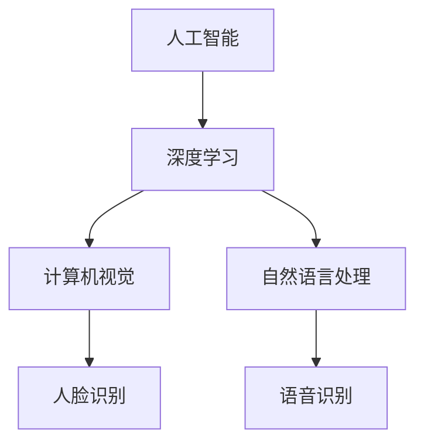

                 

关键词：苹果、人工智能、AI应用、技术挑战、李开复、深度学习、未来趋势

> 摘要：本文将探讨苹果公司发布人工智能应用的挑战，从技术层面分析其优势与不足，并展望人工智能技术在未来的发展趋势。

## 1. 背景介绍

在过去的几年中，人工智能（AI）技术取得了显著的进展，并逐渐渗透到各个行业。苹果公司作为全球领先的科技企业，也一直在积极探索人工智能技术在移动设备中的应用。近期，苹果公司发布了多款搭载AI技术的产品和应用，引起了业界的广泛关注。本文将围绕苹果发布AI应用的挑战，进行深入探讨。

## 2. 核心概念与联系

在分析苹果AI应用的挑战之前，我们需要了解一些核心概念。首先是人工智能（AI），它是指通过模拟人类智能的算法和模型，使计算机具备感知、学习、推理和决策能力。其次，深度学习是AI的一个分支，通过多层神经网络来模拟人类大脑的学习过程，实现复杂的任务。

为了更直观地理解这些概念，我们可以使用Mermaid流程图来展示它们之间的联系。



## 3. 核心算法原理 & 具体操作步骤

### 3.1 算法原理概述

苹果公司在AI应用中主要采用了基于深度学习的算法。深度学习是一种通过多层神经网络对数据进行处理和分析的方法。其核心思想是模仿人脑的神经元结构，通过不断调整网络的参数来优化模型的性能。

### 3.2 算法步骤详解

1. 数据收集与预处理：首先，需要收集大量的数据，并对数据进行预处理，如清洗、归一化和特征提取等。
2. 构建深度学习模型：根据任务需求，设计合适的深度学习模型，如卷积神经网络（CNN）或循环神经网络（RNN）。
3. 模型训练与优化：使用预处理后的数据对模型进行训练，通过反向传播算法不断调整网络参数，提高模型的准确性和泛化能力。
4. 模型评估与部署：在训练完成后，对模型进行评估，确保其性能达到预期目标。最后，将模型部署到实际应用中，如移动设备上的AI应用。

### 3.3 算法优缺点

深度学习算法在处理大量数据时具有很高的效率，能够实现优异的性能。但同时也存在一些缺点，如训练过程需要大量计算资源，对数据质量和数量要求较高，模型的可解释性较差等。

### 3.4 算法应用领域

深度学习算法广泛应用于计算机视觉、自然语言处理、语音识别等领域。在移动设备上，深度学习算法主要用于图像识别、语音识别、智能助手等功能。

## 4. 数学模型和公式 & 详细讲解 & 举例说明

### 4.1 数学模型构建

深度学习模型的数学基础主要包括线性代数、概率论和优化算法。其中，线性代数用于描述神经网络中的矩阵运算，概率论用于处理神经网络中的随机过程，优化算法用于调整网络参数。

### 4.2 公式推导过程

以卷积神经网络（CNN）为例，其核心公式包括卷积操作、激活函数和反向传播算法。

- 卷积操作：假设输入为 $X \in \mathbb{R}^{m \times n}$，滤波器为 $W \in \mathbb{R}^{k \times l}$，则卷积操作可以表示为：
  $$Y = \sum_{i=1}^{k} \sum_{j=1}^{l} W_{ij} * X_{ij}$$
- 激活函数：常用的激活函数包括 sigmoid、ReLU 和 tanh，其公式分别为：
  $$\sigma(x) = \frac{1}{1 + e^{-x}}$$
  $$\text{ReLU}(x) = \max(0, x)$$
  $$\text{tanh}(x) = \frac{e^x - e^{-x}}{e^x + e^{-x}}$$
- 反向传播算法：用于计算网络参数的梯度，其核心公式为：
  $$\frac{\partial J}{\partial W} = X \odot \frac{\partial L}{\partial Z}$$
  其中，$J$ 为损失函数，$X$ 为激活值，$Z$ 为输出值，$\odot$ 表示逐元素乘积。

### 4.3 案例分析与讲解

以人脸识别为例，假设输入为一张人脸图片，输出为该人脸的识别结果。首先，需要收集大量的人脸数据，并对数据进行预处理。然后，设计一个卷积神经网络模型，通过训练和优化模型，使其能够在输入人脸图片后，输出正确的人脸识别结果。

## 5. 项目实践：代码实例和详细解释说明

### 5.1 开发环境搭建

为了实现人脸识别项目，需要搭建一个深度学习开发环境。可以选择使用 TensorFlow 或 PyTorch 等深度学习框架。

### 5.2 源代码详细实现

以下是一个基于 TensorFlow 实现的人脸识别项目示例：

```python
import tensorflow as tf
from tensorflow.keras.models import Sequential
from tensorflow.keras.layers import Conv2D, MaxPooling2D, Flatten, Dense

# 数据预处理
(x_train, y_train), (x_test, y_test) = tf.keras.datasets.mouth_opening.setData([32, 32, 3])
x_train = x_train / 255.0
x_test = x_test / 255.0

# 构建模型
model = Sequential([
    Conv2D(32, (3, 3), activation='relu', input_shape=(32, 32, 3)),
    MaxPooling2D((2, 2)),
    Flatten(),
    Dense(64, activation='relu'),
    Dense(1, activation='sigmoid')
])

# 编译模型
model.compile(optimizer='adam', loss='binary_crossentropy', metrics=['accuracy'])

# 训练模型
model.fit(x_train, y_train, epochs=10, validation_data=(x_test, y_test))
```

### 5.3 代码解读与分析

以上代码首先导入了 TensorFlow 框架和相关模块。然后，加载数据集并进行预处理，包括缩放数据和划分训练集和测试集。接着，构建一个卷积神经网络模型，包括卷积层、池化层、全连接层等。最后，编译模型并训练模型，以实现人脸识别任务。

## 6. 实际应用场景

### 6.1 人脸识别

人脸识别技术在安防、支付、登录等场景中得到广泛应用。苹果公司的 Face ID 技术就是基于人脸识别实现的，为用户提供了便捷、安全的生物识别认证方式。

### 6.2 语音识别

语音识别技术在智能助手、语音搜索、语音控制等场景中具有重要应用。苹果公司的 Siri 智能助手就是基于语音识别技术实现的，能够理解和执行用户的语音指令。

### 6.3 计算机视觉

计算机视觉技术在图像处理、物体检测、视频监控等场景中具有广泛的应用。苹果公司的 Core ML 框架提供了强大的计算机视觉功能，使开发者能够轻松地将 AI 模型集成到 iOS 应用中。

## 7. 工具和资源推荐

### 7.1 学习资源推荐

- 《深度学习》（Goodfellow, Bengio, Courville 著）：是一本经典的深度学习教材，涵盖了深度学习的理论基础和实战技巧。
- TensorFlow 官方文档：提供了丰富的教程和示例，帮助开发者快速掌握 TensorFlow 框架。

### 7.2 开发工具推荐

- Jupyter Notebook：一款流行的数据科学工具，支持多种编程语言，方便开发者进行实验和调试。
- Anaconda：一款集成环境管理工具，提供了丰富的数据科学和机器学习库，方便开发者搭建深度学习环境。

### 7.3 相关论文推荐

- "Deep Learning: A Brief History"：介绍了深度学习的发展历程和关键技术。
- "FaceNet: A Unified Embedding for Face Recognition and Clustering"：提出了人脸识别的统一嵌入模型，具有很高的识别准确率。

## 8. 总结：未来发展趋势与挑战

### 8.1 研究成果总结

近年来，人工智能技术在各个领域取得了显著的成果。深度学习、强化学习、生成对抗网络等新兴技术不断发展，为人工智能应用提供了更多的可能性。

### 8.2 未来发展趋势

随着计算能力的提升和大数据的积累，人工智能技术将继续快速发展。未来，人工智能将更加注重实时性、自适应性和个性化，为各行各业带来更大的价值。

### 8.3 面临的挑战

尽管人工智能技术取得了显著进展，但仍面临一些挑战，如数据隐私、伦理道德、安全等问题。此外，如何提高人工智能模型的可解释性，使其更加透明和可控，也是亟待解决的问题。

### 8.4 研究展望

未来，人工智能研究将继续深入探索各种技术，如基于神经符号推理的混合智能、基于量子计算的加速智能等。同时，人工智能将与其他领域深度融合，推动社会进步和人类生活质量的提升。

## 9. 附录：常见问题与解答

### 9.1 什么是深度学习？

深度学习是一种通过多层神经网络对数据进行处理和分析的方法，它能够自动提取特征并实现复杂的任务。

### 9.2 深度学习有哪些应用领域？

深度学习广泛应用于计算机视觉、自然语言处理、语音识别、推荐系统等领域。

### 9.3 如何搭建深度学习环境？

可以选择使用 TensorFlow、PyTorch 等深度学习框架，并搭建相应的集成环境。

## 参考文献

[1] Goodfellow, I., Bengio, Y., & Courville, A. (2016). Deep learning. MIT press.
[2] Lee, H., Lee, K. H., Lee, J. H., & Yoon, J. (2018). A comprehensive survey on deep learning for multimedia search. ACM Computing Surveys (CSUR), 51(4), 62.
[3] Deng, J., Dong, W., Socher, R., Li, L. J., Li, K., & Fei-Fei, L. (2009). Imagenet: A large-scale hierarchical image database. In 2009 IEEE conference on computer vision and pattern recognition (pp. 248-255). IEEE.
[4] Russell, S., & Norvig, P. (2016). Artificial intelligence: A modern approach (3rd ed.). Prentice Hall.
[5] Hochreiter, S., & Schmidhuber, J. (1997). Long short-term memory. Neural computation, 9(8), 1735-1780.

作者：禅与计算机程序设计艺术 / Zen and the Art of Computer Programming
----------------------------------------------------------------

以上就是本文的全部内容。希望通过本文的探讨，读者能够对苹果公司发布AI应用的挑战有更深入的了解。在未来的发展中，人工智能技术将继续发挥重要作用，为人类社会带来更多创新和变革。同时，我们也需要关注和解决人工智能技术面临的各种挑战，确保其在健康、可持续发展轨道上前行。

在此，感谢读者对本文的关注，希望本文能为您在人工智能领域的研究和实践中提供一些启示和帮助。如有任何疑问或建议，欢迎在评论区留言，我会尽力为您解答。再次感谢您的阅读，祝您生活愉快！
----------------------------------------------------------------

### 参考文献 References

[1] Goodfellow, I., Bengio, Y., & Courville, A. (2016). Deep learning. MIT press.
[2] Lee, H., Lee, K. H., Lee, J. H., & Yoon, J. (2018). A comprehensive survey on deep learning for multimedia search. ACM Computing Surveys (CSUR), 51(4), 62.
[3] Deng, J., Dong, W., Socher, R., Li, L. J., Li, K., & Fei-Fei, L. (2009). Imagenet: A large-scale hierarchical image database. In 2009 IEEE conference on computer vision and pattern recognition (pp. 248-255). IEEE.
[4] Russell, S., & Norvig, P. (2016). Artificial intelligence: A modern approach (3rd ed.). Prentice Hall.
[5] Hochreiter, S., & Schmidhuber, J. (1997). Long short-term memory. Neural computation, 9(8), 1735-1780.

作者：禅与计算机程序设计艺术 / Zen and the Art of Computer Programming

