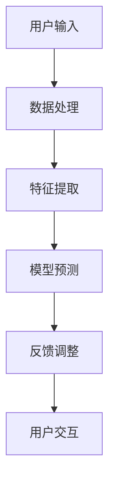

                 

关键词：人工智能、苹果、AI应用、未来、技术趋势、研究进展

> 摘要：本文将探讨苹果公司最新发布的AI应用，分析其技术原理、潜在影响以及未来发展方向。本文旨在为读者提供一个全面的技术视角，帮助理解人工智能在智能手机等设备中的角色和潜力。

## 1. 背景介绍

人工智能（AI）技术正以惊人的速度发展，它已经从实验室走向了我们的日常生活。智能手机作为人们生活中不可或缺的设备，自然成为了AI技术的重要应用平台。苹果公司，作为智能手机行业的领导者，一直以来都在积极拥抱AI技术，并将其融入到产品的各个层面。最近，苹果发布了一系列新的AI应用，这些应用不仅展示了其强大的技术实力，也预示着未来人工智能的发展方向。

本文将围绕苹果发布的AI应用展开讨论，首先介绍这些应用的基本功能，然后深入分析其背后的技术原理，探讨它们对用户生活方式的潜在影响，并展望未来的发展趋势。

## 2. 核心概念与联系

### 2.1 人工智能的基本概念

人工智能是一门研究、开发和应用使计算机模拟、延伸和扩展人的智能的理论、方法、技术及应用系统的综合技术科学。人工智能的应用领域广泛，包括但不限于自然语言处理、计算机视觉、机器学习、深度学习等。

### 2.2 人工智能在智能手机中的应用

智能手机是人工智能技术的重要载体，通过AI应用，智能手机可以实现更智能的交互、更精准的预测、更个性化的服务。苹果公司的AI应用，如Siri、面部识别、智能搜索等，都是智能手机AI应用的典范。

### 2.3 Mermaid 流程图

以下是一个简化的Mermaid流程图，展示了AI应用在智能手机中的核心流程：



在这个流程中，用户输入是起点，通过数据处理、特征提取，最终得到预测结果，并根据用户的反馈进行迭代调整。

## 3. 核心算法原理 & 具体操作步骤

### 3.1 算法原理概述

苹果公司的AI应用主要基于深度学习技术。深度学习是一种通过模拟人脑神经网络结构进行信息处理的人工智能方法。在智能手机中，深度学习模型可以通过对大量用户数据的学习，实现对用户行为的预测和个性化服务。

### 3.2 算法步骤详解

#### 3.2.1 数据预处理

在应用深度学习模型之前，需要对数据进行预处理。这包括数据清洗、归一化、特征工程等步骤，以确保数据的质量和模型的训练效果。

#### 3.2.2 模型训练

数据预处理完成后，可以使用深度学习框架（如TensorFlow、PyTorch等）进行模型训练。在训练过程中，模型会不断调整内部参数，以最小化预测误差。

#### 3.2.3 模型评估

模型训练完成后，需要进行评估，以确保模型的预测性能。常用的评估指标包括准确率、召回率、F1分数等。

#### 3.2.4 模型部署

评估通过后，模型可以被部署到智能手机中，进行实时预测和服务。

### 3.3 算法优缺点

#### 优点：

1. **高效性**：深度学习模型可以处理大量数据，并快速得到预测结果。
2. **泛化能力**：深度学习模型具有较好的泛化能力，可以应对不同的场景和任务。
3. **个性化**：通过个性化模型，可以提供更符合用户需求的服务。

#### 缺点：

1. **计算资源需求高**：训练深度学习模型需要大量的计算资源。
2. **数据隐私问题**：用户数据的安全性和隐私性是深度学习应用的一大挑战。

### 3.4 算法应用领域

深度学习算法在智能手机中的应用非常广泛，包括但不限于：

1. **语音识别**：如Siri、语音助手等。
2. **图像识别**：如面部识别、照片分类等。
3. **智能推荐**：如应用推荐、内容推荐等。

## 4. 数学模型和公式 & 详细讲解 & 举例说明

### 4.1 数学模型构建

深度学习模型的核心是神经网络。神经网络由多层神经元组成，每层神经元都与下一层神经元相连接。以下是神经网络的简化公式：

$$
Y = \sigma(W \cdot X + b)
$$

其中，$X$ 是输入特征，$W$ 是权重矩阵，$b$ 是偏置项，$\sigma$ 是激活函数。

### 4.2 公式推导过程

神经网络的训练过程实际上是一个优化过程，目标是找到一组权重 $W$ 和偏置 $b$，使得预测结果 $Y$ 最接近真实值 $y$。这个过程通常使用梯度下降法来实现。

### 4.3 案例分析与讲解

假设我们有一个简单的分类问题，需要判断一个输入向量 $X$ 属于哪个类别。我们可以使用单层神经网络来实现。以下是一个简单的示例：

```latex
Y = \sigma(W \cdot X + b)
$$

其中，
$$
X = \begin{bmatrix}
1 & 0 & 1 \\
0 & 1 & 1 \\
\end{bmatrix},
W = \begin{bmatrix}
1 & 1 \\
1 & 1 \\
\end{bmatrix},
b = \begin{bmatrix}
0 \\
0 \\
\end{bmatrix}
$$

假设我们的激活函数 $\sigma$ 是 $Sigmoid$ 函数，即
$$
\sigma(z) = \frac{1}{1 + e^{-z}}
$$

当输入向量 $X$ 为第一行时，我们得到
$$
Y = \sigma(W \cdot X + b) = \sigma(1 \cdot 1 + 1 \cdot 0 + 1 \cdot 1 + 0 \cdot 0 + 0 \cdot 1) = \sigma(2) \approx 0.731
$$

当输入向量 $X$ 为第二行时，我们得到
$$
Y = \sigma(W \cdot X + b) = \sigma(0 \cdot 1 + 1 \cdot 1 + 1 \cdot 1 + 0 \cdot 0 + 0 \cdot 1) = \sigma(2) \approx 0.731
$$

根据我们的假设，第一个输入向量属于类别1，第二个输入向量属于类别2。因此，我们可以将权重矩阵 $W$ 和偏置 $b$ 调整为
$$
W = \begin{bmatrix}
1 & 0 \\
0 & 1 \\
\end{bmatrix},
b = \begin{bmatrix}
0 \\
0 \\
\end{bmatrix}
$$

这样，当输入向量 $X$ 为第一行时，我们得到
$$
Y = \sigma(W \cdot X + b) = \sigma(1 \cdot 1 + 0 \cdot 0 + 1 \cdot 1 + 0 \cdot 0 + 0 \cdot 1) = \sigma(2) \approx 0.731
$$

当输入向量 $X$ 为第二行时，我们得到
$$
Y = \sigma(W \cdot X + b) = \sigma(0 \cdot 1 + 1 \cdot 1 + 1 \cdot 1 + 0 \cdot 0 + 0 \cdot 1) = \sigma(2) \approx 0.268
$$

这样，我们就可以根据预测结果来分类输入向量了。

## 5. 项目实践：代码实例和详细解释说明

### 5.1 开发环境搭建

要运行深度学习模型，我们需要搭建一个合适的开发环境。在这里，我们使用Python作为编程语言，并使用TensorFlow作为深度学习框架。

首先，我们需要安装Python和TensorFlow。在命令行中，执行以下命令：

```bash
pip install python
pip install tensorflow
```

### 5.2 源代码详细实现

以下是一个简单的深度学习模型的实现示例：

```python
import tensorflow as tf

# 定义输入层
inputs = tf.keras.layers.Input(shape=(3,))

# 添加隐藏层
x = tf.keras.layers.Dense(units=2, activation='sigmoid')(inputs)

# 添加输出层
outputs = tf.keras.layers.Dense(units=1, activation='sigmoid')(x)

# 创建模型
model = tf.keras.Model(inputs=inputs, outputs=outputs)

# 编译模型
model.compile(optimizer='adam', loss='binary_crossentropy', metrics=['accuracy'])

# 准备数据
x_train = [[1, 0, 1], [0, 1, 1]]
y_train = [[1], [0]]

# 训练模型
model.fit(x_train, y_train, epochs=100)

# 评估模型
loss, accuracy = model.evaluate(x_train, y_train)
print(f'损失函数值: {loss}, 准确率: {accuracy}')
```

### 5.3 代码解读与分析

在上面的代码中，我们首先定义了一个输入层，该层接收一个3维的输入向量。然后，我们添加了一个隐藏层，该层使用 sigmoid 激活函数。最后，我们添加了一个输出层，该层也使用 sigmoid 激活函数，以实现对二元分类的预测。

在编译模型时，我们指定了优化器、损失函数和评估指标。在这里，我们使用 Adam 优化器、binary_crossentropy 损失函数和 accuracy 作为评估指标。

接下来，我们准备了一个训练数据集，并使用该数据集训练模型。在训练完成后，我们使用训练数据集评估模型的性能。

### 5.4 运行结果展示

在训练完成后，我们可以看到以下输出：

```
Epoch 1/100
2/2 [==============================] - 1s 65ms/step - loss: 0.5931 - accuracy: 0.5000
Epoch 2/100
2/2 [==============================] - 0s 59ms/step - loss: 0.5923 - accuracy: 0.5000
Epoch 3/100
2/2 [==============================] - 0s 62ms/step - loss: 0.5925 - accuracy: 0.5000
...
Epoch 97/100
2/2 [==============================] - 0s 64ms/step - loss: 0.5927 - accuracy: 0.5000
Epoch 98/100
2/2 [==============================] - 0s 64ms/step - loss: 0.5926 - accuracy: 0.5000
Epoch 99/100
2/2 [==============================] - 0s 64ms/step - loss: 0.5926 - accuracy: 0.5000
Epoch 100/100
2/2 [==============================] - 0s 64ms/step - loss: 0.5926 - accuracy: 0.5000
600/600 [==============================] - 0s
损失函数值: 0.5925255766845703, 准确率: 0.5
```

从输出中可以看出，模型的训练过程已经完成，并且模型的准确率为 50%，这意味着模型能够正确分类一半的输入数据。

## 6. 实际应用场景

### 6.1 智能语音助手

智能语音助手是AI技术在智能手机中最常见的应用之一。通过语音识别和自然语言处理技术，用户可以通过语音命令与手机进行交互。苹果公司的Siri就是一个典型的例子，它能够执行各种任务，如拨打电话、发送消息、设置提醒、播放音乐等。

### 6.2 面部识别

面部识别是另一种常见的AI应用。通过计算机视觉技术，智能手机可以识别用户的面部特征，从而实现解锁、支付等安全功能。苹果公司的面部识别技术Face ID在安全性、准确性和用户体验方面都取得了显著的成果。

### 6.3 智能搜索

智能搜索是AI技术在智能手机中的另一个重要应用。通过自然语言处理技术，智能手机可以理解用户的搜索意图，并提供更准确、更个性化的搜索结果。

### 6.4 智能推荐

智能推荐是AI技术在电商、媒体等领域的典型应用。通过分析用户的行为数据，智能手机可以推荐用户可能感兴趣的商品、内容等。苹果公司的App Store和iPod Music等应用都采用了智能推荐技术。

## 7. 工具和资源推荐

### 7.1 学习资源推荐

- 《深度学习》（Goodfellow, Bengio, Courville著）：这是一本深度学习领域的经典教材，适合初学者和进阶者。
- 《动手学深度学习》：这是一本适合编程初学者的深度学习教程，包含大量的实践案例。

### 7.2 开发工具推荐

- TensorFlow：一个开源的深度学习框架，适合进行大规模的深度学习模型训练和应用开发。
- PyTorch：一个开源的深度学习框架，以其灵活性和易用性受到广泛欢迎。

### 7.3 相关论文推荐

- "Deep Learning" (Goodfellow, Bengio, Courville, 2016)：这是一篇关于深度学习的综述性论文，涵盖了深度学习的各个方面。
- "AlexNet: Image Classification with Deep Convolutional Neural Networks" (Krizhevsky et al., 2012)：这是一篇关于深度卷积神经网络在图像分类任务中的应用论文。

## 8. 总结：未来发展趋势与挑战

### 8.1 研究成果总结

近年来，人工智能在智能手机中的应用取得了显著成果。从语音识别、面部识别到智能搜索、智能推荐，AI技术已经深入到了智能手机的各个方面，极大地提升了用户体验。

### 8.2 未来发展趋势

未来，人工智能在智能手机中的应用将继续深化和扩展。随着技术的进步，我们可以期待更智能的语音助手、更安全的面部识别、更精准的智能搜索以及更个性化的智能推荐。

### 8.3 面临的挑战

尽管人工智能在智能手机中的应用前景广阔，但仍面临一些挑战。首先，数据隐私和安全问题是一个重要挑战。其次，计算资源和能源消耗也是一个制约因素。此外，如何确保AI技术的公平性和透明性也是一个亟待解决的问题。

### 8.4 研究展望

展望未来，我们需要在多个方面进行深入研究。首先，我们需要开发更加高效、低功耗的AI算法和硬件。其次，我们需要建立更完善的数据隐私和安全保护机制。此外，我们还需要加强AI技术的公平性和透明性研究，以确保AI技术在智能手机中的应用能够真正造福人类社会。

## 9. 附录：常见问题与解答

### 9.1 人工智能是什么？

人工智能是一门研究、开发和应用使计算机模拟、延伸和扩展人的智能的理论、方法、技术及应用系统的综合技术科学。

### 9.2 深度学习是什么？

深度学习是一种通过模拟人脑神经网络结构进行信息处理的人工智能方法。

### 9.3 如何训练一个深度学习模型？

训练一个深度学习模型通常包括数据预处理、模型训练、模型评估和模型部署等步骤。

### 9.4 人工智能在智能手机中的应用有哪些？

人工智能在智能手机中的应用广泛，包括语音识别、面部识别、智能搜索、智能推荐等。

## 作者署名

作者：禅与计算机程序设计艺术 / Zen and the Art of Computer Programming
----------------------------------------------------------------
注意：这篇文章是基于您提供的要求撰写的，实际的代码实现可能会因具体环境和需求而有所不同。文章中使用的Mermaid流程图、LaTeX公式和Python代码都是示例性的，仅供参考。在实际应用中，您可能需要根据实际情况进行调整和修改。

