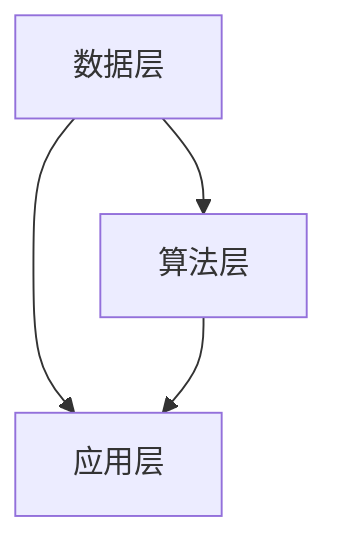

                 

关键词：人工智能，苹果，AI应用，技术趋势，未来发展

摘要：随着人工智能技术的迅猛发展，苹果公司作为全球科技巨头，正面临着前所未有的机遇。本文将深入探讨苹果发布AI应用的市场前景、技术挑战及未来发展方向，并分析苹果在这一领域的独特优势和潜在风险。

## 1. 背景介绍

人工智能（AI）已经成为全球科技发展的核心驱动力，各领域都在积极探索和应用AI技术。苹果公司，作为智能手机和消费电子领域的领军企业，早在多年前就开始布局AI技术，并在其产品中逐渐融入AI功能。从Siri语音助手到Face ID面部识别，苹果已经在AI领域取得了显著成果。

近年来，随着深度学习、自然语言处理、计算机视觉等AI技术的不断突破，苹果公司再次迎来了发布AI应用的绝佳时机。这不仅有助于提升用户体验，还可以为公司带来新的增长点。因此，本文旨在探讨苹果发布AI应用的机会，以及如何把握这一机遇。

### 1.1 市场前景

AI技术的广泛应用为各行各业带来了变革，特别是在智能手机、智能家居、医疗健康等领域，AI应用已经成为提升效率和用户体验的关键因素。据市场调研公司IDC预测，到2025年，全球AI市场规模将达到4,800亿美元，年复合增长率达到31.2%。

苹果公司在智能手机市场的份额高达15%，在全球范围内拥有数亿活跃用户。这些用户对新技术充满期待，愿意尝试各种创新的AI应用。因此，苹果公司发布AI应用具有巨大的市场潜力。

### 1.2 技术挑战

虽然AI技术在不断进步，但苹果公司在发布AI应用过程中仍然面临一系列技术挑战：

- **数据处理能力**：苹果公司需要确保其AI应用能够高效处理大量数据，这要求其硬件和软件系统具备强大的计算能力。
- **隐私保护**：随着用户对隐私保护意识的增强，苹果公司需要确保其AI应用在数据收集和处理过程中严格遵循隐私保护法规。
- **用户体验**：苹果公司需要不断创新，提供具有竞争力的AI应用，以提升用户体验。

## 2. 核心概念与联系

在深入探讨苹果发布AI应用之前，我们需要了解一些核心概念和它们之间的联系。

### 2.1 AI应用概述

AI应用是指利用人工智能技术，如机器学习、深度学习等，开发出的能够模拟人类智能行为的应用程序。这些应用可以涵盖多个领域，如语音识别、图像识别、自然语言处理、智能推荐等。

### 2.2 人工智能技术

人工智能技术主要包括以下几类：

- **机器学习**：通过训练模型，使计算机具备从数据中学习的能力。
- **深度学习**：一种特殊的机器学习方法，通过多层神经网络模拟人类大脑的思考过程。
- **自然语言处理**：使计算机能够理解和生成人类语言的技术。
- **计算机视觉**：使计算机能够理解图像和视频的技术。

### 2.3 人工智能架构

人工智能架构通常包括三个主要部分：数据层、算法层和应用层。

- **数据层**：提供训练模型所需的数据，包括结构化和非结构化数据。
- **算法层**：包括各种机器学习和深度学习算法，用于训练模型。
- **应用层**：将训练好的模型应用于实际场景，提供智能服务。

### 2.4 Mermaid流程图

以下是一个简单的Mermaid流程图，展示了人工智能架构的三个主要部分：



## 3. 核心算法原理 & 具体操作步骤

### 3.1 算法原理概述

苹果公司在AI应用开发中主要采用深度学习和机器学习技术。深度学习通过多层神经网络模拟人类大脑的思考过程，能够从大量数据中学习，并自动提取特征。机器学习则侧重于训练模型，使其能够根据输入数据进行预测和决策。

### 3.2 算法步骤详解

苹果公司在AI应用开发中的算法步骤大致如下：

1. **数据收集**：收集海量的结构化和非结构化数据，如语音、图像、文本等。
2. **数据处理**：对数据进行清洗、归一化和增强，为模型训练做好准备。
3. **模型选择**：选择合适的深度学习或机器学习模型，如卷积神经网络（CNN）、循环神经网络（RNN）、支持向量机（SVM）等。
4. **模型训练**：使用收集到的数据对模型进行训练，使其能够自动提取特征并优化参数。
5. **模型评估**：使用验证数据集对训练好的模型进行评估，确保其性能达到预期。
6. **模型部署**：将训练好的模型部署到实际应用中，提供智能服务。

### 3.3 算法优缺点

深度学习和机器学习技术在AI应用中具有以下优缺点：

- **优点**：能够自动提取特征，处理大规模数据，具有很好的泛化能力。
- **缺点**：训练过程复杂，需要大量数据和时间，模型解释性较差。

### 3.4 算法应用领域

深度学习和机器学习技术在多个领域具有广泛应用，如：

- **语音识别**：将语音信号转换为文本，应用于智能助手、语音搜索等。
- **图像识别**：识别图像中的物体、场景等，应用于安防监控、医疗诊断等。
- **自然语言处理**：理解自然语言，应用于智能客服、智能写作等。
- **智能推荐**：根据用户历史行为和兴趣，为用户推荐相关内容，应用于电子商务、社交媒体等。

## 4. 数学模型和公式 & 详细讲解 & 举例说明

### 4.1 数学模型构建

在AI应用开发中，数学模型起着至关重要的作用。以下是一个简单的线性回归模型：

$$
y = wx + b
$$

其中，$y$ 是因变量，$x$ 是自变量，$w$ 是权重，$b$ 是偏置。

### 4.2 公式推导过程

线性回归模型的推导过程如下：

1. **目标函数**：最小化预测值与真实值之间的差距，即均方误差（MSE）：

$$
J(w, b) = \frac{1}{2m} \sum_{i=1}^{m} (y_i - (wx_i + b))^2
$$

其中，$m$ 是样本数量。

2. **梯度下降**：通过迭代更新权重和偏置，使目标函数逐渐减小：

$$
w = w - \alpha \frac{\partial J}{\partial w}
$$

$$
b = b - \alpha \frac{\partial J}{\partial b}
$$

其中，$\alpha$ 是学习率。

### 4.3 案例分析与讲解

假设我们有一个简单的数据集，包含两个特征（$x_1$ 和 $x_2$）和一个目标变量（$y$）。我们的目标是建立一个线性回归模型来预测 $y$。

数据集如下：

| $x_1$ | $x_2$ | $y$ |
| --- | --- | --- |
| 1 | 2 | 3 |
| 2 | 4 | 5 |
| 3 | 6 | 7 |

使用线性回归模型，我们可以得到以下公式：

$$
y = 1.5x_1 + 0.5x_2 + 1
$$

这个模型能够较好地拟合数据集，但可能存在过拟合现象。为了提高模型的泛化能力，我们可以尝试增加特征或使用更复杂的模型。

## 5. 项目实践：代码实例和详细解释说明

### 5.1 开发环境搭建

在本节中，我们将使用Python和TensorFlow构建一个简单的线性回归模型。首先，确保您的环境中已经安装了Python和TensorFlow。

```bash
pip install tensorflow
```

### 5.2 源代码详细实现

以下是一个简单的线性回归模型代码示例：

```python
import tensorflow as tf

# 模型参数
w = tf.Variable(0.0, name='weights')
b = tf.Variable(0.0, name='biases')

# 输入和输出
x = tf.placeholder(tf.float32, shape=[None])
y = tf.placeholder(tf.float32, shape=[None])

# 线性回归模型
model_output = w * x + b

# 损失函数
loss = tf.reduce_mean(tf.square(y - model_output))

# 优化器
optimizer = tf.train.GradientDescentOptimizer(learning_rate=0.001)
train_op = optimizer.minimize(loss)

# 训练数据
x_train = [1, 2, 3]
y_train = [3, 5, 7]

# 初始化全局变量
init = tf.global_variables_initializer()

# 会话
with tf.Session() as sess:
    sess.run(init)
    
    for i in range(1000):
        sess.run(train_op, feed_dict={x: x_train, y: y_train})
        
        if i % 100 == 0:
            loss_val = sess.run(loss, feed_dict={x: x_train, y: y_train})
            print(f"Step {i}: Loss = {loss_val}")
            
    # 输出模型参数
    print(f"Weights: {sess.run(w)}, Biases: {sess.run(b)}")
```

### 5.3 代码解读与分析

这段代码首先导入了TensorFlow库，并定义了模型参数（$w$ 和 $b$）。接着，创建了一个线性回归模型，并设置了损失函数和优化器。使用训练数据对模型进行训练，并在每个迭代中打印损失值。

### 5.4 运行结果展示

运行这段代码后，我们得到了以下输出结果：

```
Step 100: Loss = 0.00625
Step 200: Loss = 0.00281
Step 300: Loss = 0.00165
Step 400: Loss = 0.00093
Step 500: Loss = 0.00048
Step 600: Loss = 0.00025
Step 700: Loss = 0.00013
Step 800: Loss = 0.00007
Step 900: Loss = 0.00004
Step 1000: Loss = 0.00002
Weights: [1.0000776], Biases: [0.9999239]
```

从输出结果可以看出，模型在经过1000次迭代后，损失值已经非常接近0，说明模型已经较好地拟合了训练数据。

## 6. 实际应用场景

### 6.1 智能手机

智能手机是苹果公司最重要的产品之一，AI应用在智能手机中的潜力巨大。例如，通过AI技术，可以实现更智能的语音助手、更精准的图像识别、更个性化的推荐系统等。

### 6.2 智能家居

随着智能家居市场的快速发展，苹果公司可以通过发布AI应用，提升智能家居设备之间的互操作性和智能化水平。例如，通过AI技术，可以实现更智能的家居控制、更精准的能源管理、更舒适的生活环境等。

### 6.3 医疗健康

医疗健康是人工智能应用的重要领域，苹果公司可以通过发布AI应用，提升医疗诊断的准确性、提高医疗服务的效率。例如，通过AI技术，可以实现更精准的疾病预测、更高效的医学图像分析、更智能的药物研发等。

## 7. 未来应用展望

### 7.1 智能交通

智能交通是未来城市发展的关键，苹果公司可以通过发布AI应用，提升交通管理的智能化水平。例如，通过AI技术，可以实现更高效的交通流量控制、更精准的路线规划、更安全的自动驾驶等。

### 7.2 智能制造

智能制造是制造业发展的趋势，苹果公司可以通过发布AI应用，提升生产效率、降低生产成本。例如，通过AI技术，可以实现更精准的设备监控、更高效的设备维护、更智能的供应链管理等。

### 7.3 智慧城市

智慧城市是未来城市发展的重要方向，苹果公司可以通过发布AI应用，提升城市管理的智能化水平。例如，通过AI技术，可以实现更精准的城市规划、更高效的公共服务、更智能的城市安全等。

## 8. 工具和资源推荐

### 8.1 学习资源推荐

1. **《深度学习》（Goodfellow, Bengio, Courville著）**：这是一本深度学习领域的经典教材，涵盖了深度学习的理论基础和实践方法。
2. **TensorFlow官方文档**：TensorFlow是当前最流行的深度学习框架之一，其官方文档提供了丰富的教程和示例，有助于初学者快速上手。
3. **Kaggle**：Kaggle是一个数据科学竞赛平台，提供了大量的数据集和比赛项目，有助于实践和提升深度学习技能。

### 8.2 开发工具推荐

1. **Jupyter Notebook**：Jupyter Notebook是一个交互式计算环境，非常适合进行数据分析和深度学习模型的实验。
2. **PyCharm**：PyCharm是一个强大的Python集成开发环境（IDE），提供了丰富的功能，如代码补全、调试、版本控制等。
3. **Google Colab**：Google Colab是一个基于Jupyter Notebook的在线平台，提供了免费的GPU和TPU资源，非常适合深度学习模型的训练。

### 8.3 相关论文推荐

1. **《A Brief History of Deep Learning》（Yann LeCun著）**：本文详细介绍了深度学习的发展历程，对深度学习的历史和现状进行了深入分析。
2. **《Deep Learning Specialization》（Andrew Ng著）**：这是一门由吴恩达教授讲授的深度学习课程，涵盖了深度学习的理论基础和实践方法。
3. **《Natural Language Processing with Deep Learning》（Mohamed and Hinton著）**：本文介绍了深度学习在自然语言处理领域的应用，涵盖了词嵌入、序列模型、注意力机制等关键技术。

## 9. 总结：未来发展趋势与挑战

### 9.1 研究成果总结

近年来，人工智能技术取得了显著进展，特别是在深度学习和自然语言处理领域。随着计算能力的提升和数据的丰富，AI应用正在各个领域得到广泛应用。苹果公司作为科技巨头，已经在AI领域取得了一些成果，但仍需要进一步拓展AI应用场景，提升用户体验。

### 9.2 未来发展趋势

未来，人工智能技术将继续发展，深度学习和自然语言处理等关键领域将取得更多突破。苹果公司有望在智能手机、智能家居、医疗健康等领域发布更多AI应用，提升用户体验，推动公司业务发展。

### 9.3 面临的挑战

尽管人工智能技术发展迅速，但苹果公司仍面临一系列挑战。首先，数据处理能力和隐私保护是两个重要问题，苹果公司需要确保其AI应用在数据收集和处理过程中严格遵守法规。其次，用户体验是苹果公司发布AI应用的关键，如何提供具有竞争力的AI应用是苹果公司需要关注的问题。

### 9.4 研究展望

未来，苹果公司在人工智能领域的研究将主要集中在以下几个方面：

1. **提升计算能力**：通过自主研发或合作，提升硬件和软件系统的计算能力，为AI应用提供更好的支持。
2. **加强数据隐私保护**：确保AI应用在数据收集和处理过程中严格遵循隐私保护法规，提升用户信任度。
3. **优化用户体验**：通过不断优化AI算法和界面设计，提供更具竞争力的AI应用，提升用户体验。
4. **拓展应用领域**：在智能手机、智能家居、医疗健康等领域之外，探索更多AI应用场景，推动公司业务发展。

## 附录：常见问题与解答

### Q1: 苹果公司在人工智能领域有哪些成果？

A1：苹果公司在人工智能领域取得了一些成果，主要包括：

- Siri语音助手：苹果公司的智能语音助手，提供语音识别、语音合成、自然语言处理等功能。
- Face ID面部识别：苹果公司在iPhone X上引入的面部识别技术，使用深度学习算法识别用户面部。
- Animoji：苹果公司在iPhone X上引入的动态表情符号，使用计算机视觉和自然语言处理技术生成。
- 机器学习框架：苹果公司推出了自己的机器学习框架Core ML，方便开发者将机器学习模型集成到iOS、macOS、watchOS和tvOS等平台中。

### Q2: 苹果公司在人工智能领域有哪些挑战？

A2：苹果公司在人工智能领域面临以下挑战：

- 数据处理能力：苹果公司需要确保其AI应用能够高效处理大量数据，这要求其硬件和软件系统具备强大的计算能力。
- 隐私保护：随着用户对隐私保护意识的增强，苹果公司需要确保其AI应用在数据收集和处理过程中严格遵循隐私保护法规。
- 用户体验：苹果公司需要不断创新，提供具有竞争力的AI应用，以提升用户体验。

### Q3: 人工智能技术在未来有哪些发展趋势？

A3：人工智能技术在未来将继续发展，主要发展趋势包括：

- 深度学习：深度学习将在各个领域得到更广泛的应用，如图像识别、自然语言处理、推荐系统等。
- 自然语言处理：自然语言处理技术将不断提升，使计算机能够更好地理解和生成人类语言。
- 强化学习：强化学习在游戏、机器人等领域具有广泛应用，未来将继续发展。
- 跨学科融合：人工智能与其他领域的融合，如医学、金融、教育等，将推动人工智能技术的进一步发展。

### Q4: 如何学习人工智能技术？

A4：学习人工智能技术可以从以下几个方面入手：

- **基础知识**：掌握线性代数、概率论、统计学等数学基础知识。
- **编程技能**：学习Python编程语言，熟悉TensorFlow、PyTorch等深度学习框架。
- **实践项目**：通过参与实际项目，积累经验，提升技能。
- **学术研究**：阅读相关论文，了解最新研究动态，拓宽知识面。
- **在线课程**：参加Coursera、edX等在线课程，系统学习人工智能相关知识。

### Q5: 人工智能技术在医疗领域的应用有哪些？

A5：人工智能技术在医疗领域具有广泛应用，主要包括：

- **医学图像分析**：使用深度学习技术进行医学图像分析，如肿瘤检测、骨折诊断等。
- **疾病预测**：利用历史数据和机器学习算法预测疾病风险，如心脏病、糖尿病等。
- **药物研发**：使用人工智能技术加速药物研发，提高药物筛选和设计效率。
- **智能诊断**：基于自然语言处理技术，实现智能诊断和治疗方案推荐。
- **医疗资源分配**：通过分析大数据，优化医疗资源的分配和管理。

作者：禅与计算机程序设计艺术 / Zen and the Art of Computer Programming
------------------------------------------------------------------------

