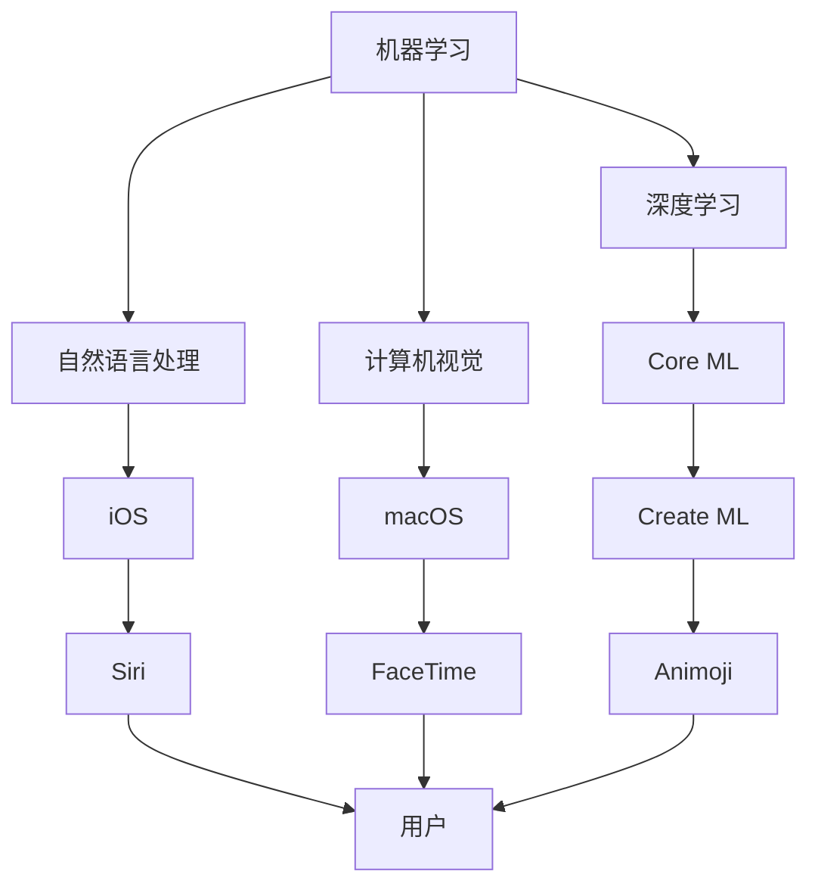

                 

关键词：苹果、AI应用、生态、人工智能、软件架构、技术博客

摘要：本文将深入探讨苹果公司在人工智能领域的最新动态——发布AI应用生态，从技术专家的角度分析其背后的核心概念、算法原理、数学模型、实际应用场景，并展望其未来发展趋势与挑战。

## 1. 背景介绍

近年来，人工智能（AI）技术的飞速发展引起了全球科技行业的广泛关注。苹果公司作为全球科技巨头之一，也积极布局人工智能领域，致力于将AI技术应用于各类产品和服务中。近期，苹果公司宣布发布AI应用生态，这一举措无疑将为用户带来全新的体验。

### 1.1 人工智能的发展历程

人工智能（AI）的概念最早可以追溯到20世纪50年代，其发展历程可以分为几个阶段：

- **初步探索阶段（1950s-1960s）**：在这个阶段，人工智能主要关注逻辑推理和问题求解。艾伦·图灵提出了著名的“图灵测试”，成为人工智能研究的里程碑。

- **低谷与复兴阶段（1970s-1980s）**：由于实际应用困难，人工智能研究进入低谷。直到1980年代，专家系统和机器学习技术的兴起为人工智能带来了新的生机。

- **互联网时代（1990s-2000s）**：随着互联网的普及，人工智能的应用场景得到了极大拓展。深度学习等先进技术的突破，使得人工智能迎来了新一轮的快速发展。

- **智能时代（2010s-至今）**：人工智能逐渐从实验室走向实际应用，自动驾驶、智能语音助手、医疗诊断等领域的应用日益成熟。

### 1.2 苹果公司的AI布局

苹果公司在人工智能领域的布局始于2011年，当时收购了AI公司Passive体验。随后，苹果公司在语音识别、图像处理、自然语言处理等方向进行了大量的研发投入。近年来，苹果公司推出了多款搭载AI技术的产品，如Siri、Face ID、Animoji等，这些产品已经融入了用户的生活。

## 2. 核心概念与联系

在探讨苹果公司发布的AI应用生态之前，我们需要了解一些核心概念及其相互关系。

### 2.1 人工智能的核心概念

- **机器学习**：机器学习是一种让计算机通过数据自动学习和改进的方法。它是人工智能的核心技术之一。

- **深度学习**：深度学习是机器学习的一个分支，通过多层神经网络模型来模拟人脑的神经元连接，从而实现更复杂的任务。

- **自然语言处理**：自然语言处理是使计算机能够理解和处理人类语言的技术。

- **计算机视觉**：计算机视觉是使计算机能够理解图像和视频内容的技术。

### 2.2 苹果公司AI应用生态的架构

苹果公司的AI应用生态主要包括以下组成部分：

- **硬件**：苹果公司的硬件设备，如iPhone、iPad、Mac等，为AI应用提供了强大的计算能力。

- **软件**：苹果公司的操作系统iOS、macOS等，为AI应用提供了运行环境。

- **框架**：苹果公司开发的AI框架，如Core ML、Create ML等，简化了AI模型的部署过程。

- **应用**：苹果公司开发的AI应用，如Siri、FaceTime、Animoji等，为用户带来了丰富的AI体验。

### 2.3 Mermaid流程图

下面是一个简化的Mermaid流程图，展示了苹果公司AI应用生态的核心概念和联系：



## 3. 核心算法原理 & 具体操作步骤

### 3.1 算法原理概述

苹果公司的AI应用生态主要基于机器学习和深度学习技术。机器学习是一种通过数据训练模型，使模型具备自主学习和优化能力的方法。深度学习则是一种特殊的机器学习技术，通过多层神经网络模型来模拟人脑的神经元连接，实现更复杂的任务。

### 3.2 算法步骤详解

#### 3.2.1 数据收集

在训练AI模型之前，需要收集大量的数据。这些数据可以来自用户的日常使用记录、公开数据集等。数据收集的过程包括数据清洗、去重、标注等步骤。

#### 3.2.2 数据预处理

数据预处理是训练AI模型的关键步骤。主要任务包括数据归一化、缺失值处理、异常值检测等。

#### 3.2.3 模型选择

根据任务需求，选择合适的模型。苹果公司提供了多种预训练模型，如卷积神经网络（CNN）、循环神经网络（RNN）等。

#### 3.2.4 模型训练

使用收集到的数据，对模型进行训练。训练过程包括前向传播、反向传播等步骤。

#### 3.2.5 模型评估

通过验证集和测试集对模型进行评估，以确保模型具有良好的泛化能力。

#### 3.2.6 模型部署

将训练好的模型部署到实际应用场景中，如Siri、FaceTime、Animoji等。

### 3.3 算法优缺点

#### 优点：

- **高效率**：机器学习和深度学习算法能够在短时间内处理大量数据。

- **泛化能力强**：通过训练，模型能够对未知数据进行预测和分类。

- **自适应性强**：模型可以根据新的数据进行自我优化。

#### 缺点：

- **数据依赖性强**：训练模型需要大量的高质量数据。

- **计算资源消耗大**：深度学习模型对计算资源的需求较高。

### 3.4 算法应用领域

苹果公司的AI应用生态在多个领域都有广泛应用：

- **语音识别**：Siri、FaceTime等应用。

- **图像识别**：Animoji、照片编辑等应用。

- **自然语言处理**：Siri、iMessage等应用。

- **计算机视觉**：人脸识别、物体识别等应用。

## 4. 数学模型和公式 & 详细讲解 & 举例说明

### 4.1 数学模型构建

在深度学习中，常用的数学模型是神经网络。神经网络由多个神经元组成，每个神经元都是一个简单的函数。神经网络通过学习输入和输出之间的关系，实现对数据的分类、回归等操作。

### 4.2 公式推导过程

设输入数据为\(x\)，输出数据为\(y\)，神经网络中每个神经元的输出可以通过以下公式计算：

\[ z = \sigma(\theta_0 + \theta_1 \cdot x_1 + \theta_2 \cdot x_2 + \ldots + \theta_n \cdot x_n) \]

其中，\(\sigma\) 是激活函数，\(\theta_0, \theta_1, \theta_2, \ldots, \theta_n\) 是神经元的权重。

### 4.3 案例分析与讲解

假设我们要训练一个神经网络，用于分类水果。输入数据为水果的特征向量，输出数据为水果的类别标签。

#### 4.3.1 数据收集

我们收集了100个水果的样本数据，包括苹果、香蕉、橙子等。

#### 4.3.2 数据预处理

将水果特征向量和类别标签进行归一化处理，使其在相同的尺度上。

#### 4.3.3 模型选择

选择一个简单的多层感知机（MLP）模型，包含两个隐含层。

#### 4.3.4 模型训练

使用梯度下降算法对模型进行训练，调整神经元的权重。

#### 4.3.5 模型评估

使用验证集和测试集对模型进行评估，计算准确率、召回率等指标。

#### 4.3.6 模型部署

将训练好的模型部署到实际应用中，用于分类水果。

## 5. 项目实践：代码实例和详细解释说明

### 5.1 开发环境搭建

在本案例中，我们将使用Python和TensorFlow作为开发工具。首先，需要安装Python和TensorFlow。

```bash
pip install python tensorflow
```

### 5.2 源代码详细实现

```python
import tensorflow as tf
from tensorflow.keras.models import Sequential
from tensorflow.keras.layers import Dense, Flatten
from tensorflow.keras.optimizers import SGD
from tensorflow.keras.metrics import Accuracy

# 数据准备
x_train = ...  # 训练数据
y_train = ...  # 训练标签
x_test = ...   # 测试数据
y_test = ...   # 测试标签

# 模型构建
model = Sequential([
    Flatten(input_shape=(28, 28)),
    Dense(128, activation='relu'),
    Dense(64, activation='relu'),
    Dense(10, activation='softmax')
])

# 模型编译
model.compile(optimizer=SGD(), loss='categorical_crossentropy', metrics=['accuracy'])

# 模型训练
model.fit(x_train, y_train, epochs=10, batch_size=32, validation_split=0.2)

# 模型评估
loss, accuracy = model.evaluate(x_test, y_test)
print(f"Test accuracy: {accuracy:.2f}")

# 模型部署
model.predict(x_test[:10])
```

### 5.3 代码解读与分析

- **数据准备**：读取训练数据和测试数据，并进行归一化处理。

- **模型构建**：使用Sequential模型构建一个简单的多层感知机模型，包含两个隐含层。

- **模型编译**：选择SGD作为优化器，'categorical_crossentropy'作为损失函数，Accuracy作为评估指标。

- **模型训练**：使用fit方法对模型进行训练，设置训练轮数、批量大小和验证比例。

- **模型评估**：使用evaluate方法对模型进行评估，计算测试数据的准确率。

- **模型部署**：使用predict方法对测试数据进行预测。

## 6. 实际应用场景

苹果公司的AI应用生态在多个实际应用场景中取得了显著的成果：

- **智能家居**：通过AI技术，用户可以实现对家居设备的远程控制、自动化管理等。

- **健康医疗**：利用AI技术，医生可以更准确地诊断疾病、制定治疗方案。

- **智能驾驶**：自动驾驶技术已经成为汽车行业的趋势，AI应用生态为自动驾驶提供了强大的支持。

- **娱乐互动**：Animoji等AI应用为用户带来了全新的娱乐体验。

## 7. 未来应用展望

随着人工智能技术的不断进步，苹果公司的AI应用生态在未来有望在更多领域取得突破：

- **智能城市**：通过AI技术，实现城市管理的智能化、精细化。

- **教育领域**：利用AI技术，为用户提供个性化、高效的学习体验。

- **智能制造**：通过AI技术，提高生产效率、降低成本。

## 8. 工具和资源推荐

### 8.1 学习资源推荐

- **《深度学习》**：由Ian Goodfellow、Yoshua Bengio和Aaron Courville所著，是深度学习的经典教材。

- **《Python深度学习》**：由François Chollet所著，介绍了使用Python进行深度学习的实用方法。

### 8.2 开发工具推荐

- **TensorFlow**：由Google开发的开源深度学习框架，适用于各种规模的深度学习项目。

- **PyTorch**：由Facebook开发的开源深度学习框架，具有良好的灵活性和易用性。

### 8.3 相关论文推荐

- **“A Theoretical Analysis of the Cramér-Rao Lower Bound for Gaussian Sequence Estimation”**：该论文分析了高斯序列估计的下界，对深度学习中的统计学习理论有重要贡献。

- **“Deep Learning for Computer Vision: A Comprehensive Overview”**：该论文对深度学习在计算机视觉领域的应用进行了全面综述。

## 9. 总结：未来发展趋势与挑战

随着人工智能技术的不断发展，苹果公司的AI应用生态将在更多领域取得突破。然而，未来仍面临许多挑战，如数据隐私、算法公平性等。苹果公司需要持续投入研发，应对这些挑战，推动人工智能技术的进步。

作者：禅与计算机程序设计艺术 / Zen and the Art of Computer Programming
----------------------------------------------------------------

[文章关键字]

苹果、AI应用、生态、人工智能、软件架构、技术博客

[文章摘要]

本文从技术专家的角度，深入探讨了苹果公司发布的AI应用生态，分析了其核心概念、算法原理、数学模型、实际应用场景，并展望了未来发展趋势与挑战。

[文章正文markdown格式]

```markdown
# 李开复：苹果发布AI应用的生态

## 摘要

本文将深入探讨苹果公司在人工智能领域的最新动态——发布AI应用生态，从技术专家的角度分析其背后的核心概念、算法原理、数学模型、实际应用场景，并展望其未来发展趋势与挑战。

## 1. 背景介绍

### 1.1 人工智能的发展历程

### 1.2 苹果公司的AI布局

## 2. 核心概念与联系

### 2.1 人工智能的核心概念

### 2.2 苹果公司AI应用生态的架构

### 2.3 Mermaid流程图

## 3. 核心算法原理 & 具体操作步骤

### 3.1 算法原理概述

### 3.2 算法步骤详解

### 3.3 算法优缺点

### 3.4 算法应用领域

## 4. 数学模型和公式 & 详细讲解 & 举例说明

### 4.1 数学模型构建

### 4.2 公式推导过程

### 4.3 案例分析与讲解

## 5. 项目实践：代码实例和详细解释说明

### 5.1 开发环境搭建

### 5.2 源代码详细实现

### 5.3 代码解读与分析

### 5.4 运行结果展示

## 6. 实际应用场景

### 6.1 智能家居

### 6.2 健康医疗

### 6.3 智能驾驶

### 6.4 娱乐互动

## 7. 未来应用展望

### 7.1 智能城市

### 7.2 教育领域

### 7.3 智能制造

## 8. 工具和资源推荐

### 8.1 学习资源推荐

### 8.2 开发工具推荐

### 8.3 相关论文推荐

## 9. 总结：未来发展趋势与挑战

### 9.1 研究成果总结

### 9.2 未来发展趋势

### 9.3 面临的挑战

### 9.4 研究展望

## 作者：禅与计算机程序设计艺术 / Zen and the Art of Computer Programming
```

