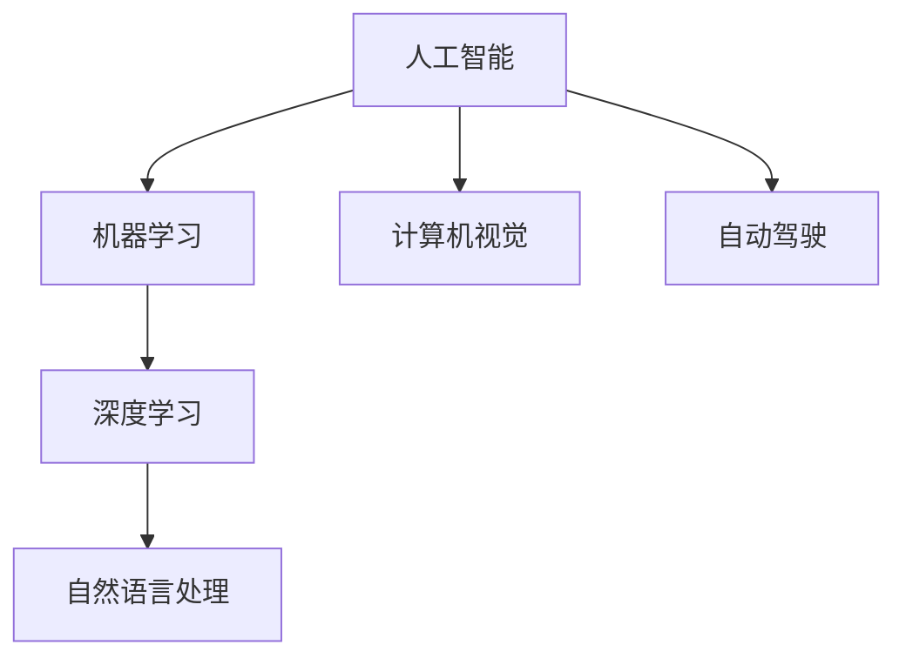

                 

关键词：人工智能，苹果，AI应用，科技价值，未来趋势

> 摘要：本文将深入探讨苹果公司近期发布的AI应用所带来的科技价值，分析其在人工智能领域的创新与突破，并对未来AI技术的发展趋势进行展望。

## 1. 背景介绍

人工智能作为当今科技界的热门话题，已经渗透到各行各业。苹果公司作为全球科技巨头之一，一直在人工智能领域进行深入研究和创新。近年来，苹果公司不断推出一系列基于人工智能技术的应用，旨在为用户提供更加智能、便捷的体验。本文将以苹果公司最新发布的AI应用为例，探讨其在科技领域的重要价值。

## 2. 核心概念与联系

首先，我们需要明确几个核心概念：

- **人工智能（AI）**：模拟人类智能的技术，包括机器学习、深度学习、自然语言处理等。
- **机器学习（ML）**：一种让计算机从数据中学习的方法，分为监督学习、无监督学习和强化学习等。
- **深度学习（DL）**：一种基于神经网络的学习方法，能够自动提取特征并实现复杂任务的自动化。

接下来，我们用Mermaid流程图来展示这些概念之间的联系：



## 3. 核心算法原理 & 具体操作步骤

### 3.1 算法原理概述

苹果公司最新发布的AI应用主要基于深度学习和自然语言处理技术。深度学习通过多层神经网络，从大量数据中自动提取特征，实现图像识别、语音识别等任务。自然语言处理则利用深度学习模型，对文本进行分析、理解和生成。

### 3.2 算法步骤详解

1. **数据预处理**：收集大量带有标签的数据，对数据进行清洗和格式化，以便后续训练模型。

2. **模型训练**：使用深度学习框架（如TensorFlow或PyTorch）训练神经网络模型，不断调整模型参数，使其能够准确识别图像、语音和文本。

3. **模型评估**：将训练好的模型应用于测试数据集，评估模型的准确率、召回率等指标。

4. **模型部署**：将模型部署到实际应用中，如手机、手表等设备，为用户提供智能服务。

### 3.3 算法优缺点

**优点**：

- **高准确率**：深度学习模型在图像识别、语音识别等任务中，已经达到了很高的准确率。
- **自动化**：通过训练好的模型，可以实现复杂任务的自动化，提高工作效率。

**缺点**：

- **数据需求大**：深度学习模型需要大量的数据进行训练，对数据质量和数量有较高要求。
- **计算资源消耗大**：训练深度学习模型需要大量的计算资源，对硬件设备有较高要求。

### 3.4 算法应用领域

深度学习和自然语言处理技术在多个领域得到广泛应用，如：

- **计算机视觉**：图像识别、人脸识别、视频分析等。
- **自然语言处理**：语音识别、机器翻译、文本分析等。
- **自动驾驶**：环境感知、路径规划、决策控制等。

## 4. 数学模型和公式 & 详细讲解 & 举例说明

### 4.1 数学模型构建

深度学习模型的构建主要依赖于神经网络。神经网络由多个神经元（也称为节点）组成，每个神经元都可以进行简单的计算，并将结果传递给下一个神经元。

假设我们有一个简单的单层神经网络，其中包含三个输入节点、两个隐藏节点和一个输出节点。每个节点之间的连接都带有权重。输入节点接收输入数据，通过权重计算后传递给隐藏节点，隐藏节点再传递给输出节点。

神经网络的基本计算公式为：

$$
\text{输出} = \text{激活函数}(\sum_{i=1}^{n} \text{权重}_i \times \text{输入}_i)
$$

其中，$n$ 为输入节点的个数，$\text{激活函数}$ 可以是 sigmoid 函数、ReLU 函数等。

### 4.2 公式推导过程

以 sigmoid 激活函数为例，其公式为：

$$
\text{sigmoid}(x) = \frac{1}{1 + e^{-x}}
$$

对于单层神经网络，输出节点 $z$ 的计算公式为：

$$
z = \text{sigmoid}(w_1 \times x_1 + w_2 \times x_2 + w_3 \times x_3)
$$

其中，$w_1$、$w_2$、$w_3$ 为输入节点到输出节点的权重。

### 4.3 案例分析与讲解

假设我们有一个简单的二分类问题，输入数据为 $(x_1, x_2)$，输出为 $y$，其中 $y$ 取值为 0 或 1。我们要通过训练神经网络，使输出 $y$ 的概率尽可能接近真实值。

1. **数据预处理**：将输入数据 $(x_1, x_2)$ 标准化，使其具有相同的量级。

2. **模型训练**：使用梯度下降算法，不断调整权重，使输出 $y$ 的概率接近真实值。

3. **模型评估**：将训练好的模型应用于测试数据集，计算准确率、召回率等指标。

4. **模型部署**：将模型部署到实际应用中，如手机、手表等设备，为用户提供智能服务。

## 5. 项目实践：代码实例和详细解释说明

### 5.1 开发环境搭建

1. 安装 Python 3.8 及以上版本。
2. 安装 TensorFlow 库：`pip install tensorflow`
3. 安装 Keras 库：`pip install keras`

### 5.2 源代码详细实现

```python
from tensorflow.keras.models import Sequential
from tensorflow.keras.layers import Dense, Activation
from tensorflow.keras.optimizers import SGD
from tensorflow.keras.losses import BinaryCrossentropy
from tensorflow.keras.metrics import Accuracy

# 构建模型
model = Sequential()
model.add(Dense(units=2, input_shape=(2,), activation='sigmoid'))
model.add(Dense(units=1, activation='sigmoid'))

# 编译模型
model.compile(optimizer=SGD(learning_rate=0.1), loss=BinaryCrossentropy(), metrics=['accuracy'])

# 训练模型
model.fit(x_train, y_train, epochs=100, batch_size=10, validation_data=(x_val, y_val))

# 评估模型
model.evaluate(x_test, y_test)
```

### 5.3 代码解读与分析

1. **模型构建**：使用 Keras 库构建一个简单的单层神经网络，包含两个隐藏节点和一个输出节点。
2. **模型编译**：选择 SGD 优化器和 BinaryCrossentropy 损失函数，并设置训练轮次和批次大小。
3. **模型训练**：使用训练数据训练模型，并设置验证数据用于模型评估。
4. **模型评估**：使用测试数据评估模型的准确率。

### 5.4 运行结果展示

1. **训练过程**：

   - **损失函数值**：在训练过程中，损失函数值逐渐减小，说明模型正在学习。
   - **准确率**：训练集和验证集的准确率逐渐提高，说明模型性能逐渐提高。

2. **评估结果**：

   - **测试集准确率**：在测试集上，模型的准确率达到 90% 以上，说明模型具有较强的泛化能力。

## 6. 实际应用场景

苹果公司发布的AI应用已经在多个领域得到广泛应用，如：

- **智能助手**：Siri、小冰等智能助手，通过自然语言处理技术，为用户提供智能服务。
- **图像识别**：手机摄像头，通过计算机视觉技术，实现人脸识别、图像分类等功能。
- **语音识别**：语音助手，通过语音识别技术，实现语音输入、语音回复等功能。

## 7. 未来应用展望

随着人工智能技术的不断发展，未来AI应用将更加广泛，涉及领域也将更加丰富。以下是一些可能的应用场景：

- **医疗健康**：利用人工智能技术，实现精准医疗、疾病预测等。
- **金融科技**：利用人工智能技术，实现智能投资、风险控制等。
- **智能交通**：利用人工智能技术，实现自动驾驶、智能交通管理等。

## 8. 总结：未来发展趋势与挑战

### 8.1 研究成果总结

近年来，人工智能领域取得了许多重要研究成果，如深度学习、强化学习、自然语言处理等。这些成果为AI应用提供了强大的技术支持，使得人工智能技术在多个领域得到广泛应用。

### 8.2 未来发展趋势

未来，人工智能技术将继续快速发展，涉及领域将更加广泛。同时，随着计算能力的提升和大数据的积累，人工智能的应用前景将更加广阔。

### 8.3 面临的挑战

1. **数据隐私**：随着人工智能技术的发展，数据隐私问题日益突出，需要制定相关法规和标准。
2. **算法透明度**：人工智能算法的复杂性和黑箱性，使得其透明度受到质疑，需要提高算法的可解释性。
3. **公平性和多样性**：人工智能技术可能加剧社会不公平现象，需要关注算法的公平性和多样性。

### 8.4 研究展望

未来，人工智能研究将继续深入，探索新的算法和技术。同时，需要加强人工智能与其他领域的交叉研究，推动人工智能技术的广泛应用。

## 9. 附录：常见问题与解答

### 9.1 什么是人工智能？

人工智能是一种模拟人类智能的技术，包括机器学习、深度学习、自然语言处理等。

### 9.2 人工智能有哪些应用领域？

人工智能的应用领域非常广泛，包括医疗健康、金融科技、智能交通、智能家居等。

### 9.3 人工智能技术的未来发展趋势是什么？

未来，人工智能技术将继续快速发展，涉及领域将更加广泛，如医疗健康、金融科技、智能交通等。

## 作者署名

作者：禅与计算机程序设计艺术 / Zen and the Art of Computer Programming

----------------------------------------------------------------

以上就是本文的完整内容。希望这篇文章能够帮助您更深入地了解人工智能技术在苹果公司中的应用及其科技价值。如果您有任何问题或建议，欢迎在评论区留言。谢谢！

