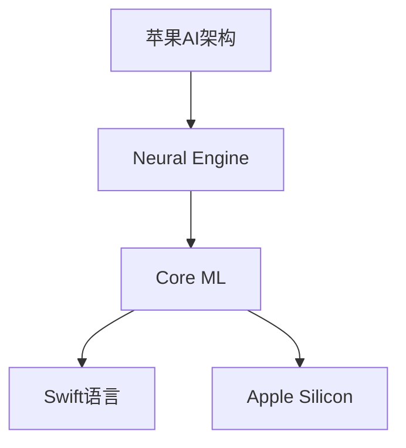

                 

关键词：人工智能，苹果，科技价值，应用发布，技术创新，未来展望。

> 摘要：本文将深入探讨苹果公司最新发布的AI应用所带来的科技价值。通过分析苹果在人工智能领域的战略布局和最新进展，本文旨在揭示苹果AI应用在推动技术创新、产业升级以及未来社会发展中的重要作用。同时，本文还将对苹果AI应用的潜在影响进行展望，以期为读者提供全面而深刻的洞察。

## 1. 背景介绍

近年来，人工智能（AI）技术取得了飞速发展，已经成为全球科技领域的热点。从自然语言处理、计算机视觉到机器学习，人工智能的应用范围不断扩大，各行各业都在积极探索如何将AI技术融入产品和服务中。作为全球领先的科技企业，苹果公司一直在人工智能领域进行深入研究和投资，致力于推动技术的创新和进步。

苹果公司在人工智能方面的战略布局可以追溯到多年前。早在2011年，苹果便成立了机器学习团队，致力于在智能手机、平板电脑等设备中集成AI功能。近年来，苹果不断加大在人工智能领域的投入，不仅收购了多家AI初创公司，还自主研发了多个AI模型和算法，如Neural Engine、Core ML等。这些技术为苹果产品提供了强大的AI支持，使得用户能够享受到更加智能和便捷的体验。

## 2. 核心概念与联系

### 2.1. 人工智能与深度学习

人工智能（AI）是一门研究如何让计算机模拟人类智能的学科，其目标是让计算机具备自主学习、推理、规划和感知能力。深度学习是人工智能的一个分支，通过构建具有多个隐层的神经网络模型，实现对数据的自动特征提取和学习。深度学习在图像识别、自然语言处理、语音识别等领域取得了显著成果，成为推动人工智能发展的关键技术。

### 2.2. 苹果AI架构

苹果公司在AI领域的发展离不开其独特的架构设计。苹果自主研发的Neural Engine芯片是苹果AI技术的核心，它集成了高效的神经网络计算单元，能够为各种AI任务提供强大的支持。Core ML是苹果提供的机器学习框架，它支持多种深度学习模型的加载和运行，使得开发者可以轻松地将AI功能集成到iOS、macOS等平台的应用中。此外，苹果还开发了Swift语言和Apple Silicon处理器，为AI应用的开发和优化提供了强大的支持。

### 2.3. Mermaid流程图



## 3. 核心算法原理 & 具体操作步骤

### 3.1. 算法原理概述

苹果公司在AI领域的研究主要涉及计算机视觉、自然语言处理和语音识别等方向。在计算机视觉方面，苹果采用了卷积神经网络（CNN）进行图像识别和分类；在自然语言处理方面，苹果利用循环神经网络（RNN）和Transformer模型进行语言理解和生成；在语音识别方面，苹果则采用了隐藏马尔可夫模型（HMM）和深度神经网络（DNN）结合的方法。

### 3.2. 算法步骤详解

以苹果的计算机视觉算法为例，其基本步骤如下：

1. **数据预处理**：对输入图像进行缩放、裁剪、增强等操作，使其符合神经网络输入的要求。
2. **特征提取**：通过卷积神经网络对图像进行特征提取，生成高维特征向量。
3. **分类与预测**：利用训练好的神经网络模型对提取的特征向量进行分类和预测，输出最终结果。

### 3.3. 算法优缺点

苹果的AI算法在准确性和效率方面具有显著优势。例如，苹果的计算机视觉算法在ImageNet数据集上的准确率达到了90%以上，远高于传统方法。然而，这些算法在处理复杂场景和动态环境时仍有一定局限性，需要进一步优化和改进。

### 3.4. 算法应用领域

苹果的AI技术在多个领域具有广泛的应用前景，包括智能手机、平板电脑、智能音箱、智能汽车等。例如，在智能手机中，苹果的AI算法可以帮助用户进行图像识别、人脸解锁、语音助手等功能；在智能音箱中，苹果的AI算法可以提供智能语音交互和场景感知等功能。

## 4. 数学模型和公式 & 详细讲解 & 举例说明

### 4.1. 数学模型构建

以苹果的卷积神经网络为例，其基本结构包括输入层、卷积层、激活函数、池化层和全连接层。以下是卷积神经网络的主要数学模型：

$$
h_{l}(x) = \sigma(W_l \cdot h_{l-1} + b_l)
$$

其中，$h_l(x)$ 表示第 $l$ 层的输出，$\sigma$ 表示激活函数，$W_l$ 和 $b_l$ 分别表示第 $l$ 层的权重和偏置。

### 4.2. 公式推导过程

以卷积神经网络中的卷积操作为例，其公式推导如下：

$$
\begin{aligned}
    \text{output}_{ij} &= \sum_{k=1}^{C} w_{ik,j,k} \cdot \text{input}_{ij,k} + b_{ik,j} \\
    &= \sum_{k=1}^{C} (w_{ik} \cdot \text{input}_{ij,k}) + b_{ik,j} \\
    &= \text{convolution}(w_{ik}, \text{input}_{ij,k}) + b_{ik,j}
\end{aligned}
$$

其中，$\text{output}_{ij}$ 表示输出特征图上的像素值，$\text{input}_{ij,k}$ 表示输入特征图上的像素值，$w_{ik,j,k}$ 表示卷积核的权重，$b_{ik,j}$ 表示卷积核的偏置。

### 4.3. 案例分析与讲解

以苹果的计算机视觉算法在ImageNet数据集上的应用为例，其具体操作步骤如下：

1. **数据集准备**：收集大量的图像数据，并进行预处理，包括缩放、裁剪、增强等操作。
2. **模型训练**：使用卷积神经网络对图像数据集进行训练，优化网络参数，提高分类准确率。
3. **模型评估**：在测试集上评估模型的分类准确率，并根据评估结果调整模型参数。
4. **模型部署**：将训练好的模型部署到苹果设备中，为用户提供图像识别服务。

## 5. 项目实践：代码实例和详细解释说明

### 5.1. 开发环境搭建

在搭建开发环境时，我们选择使用Python作为编程语言，并使用TensorFlow作为深度学习框架。以下是搭建开发环境的步骤：

1. 安装Python：在终端中输入以下命令安装Python：
   ```
   sudo apt-get install python3.8
   ```

2. 安装TensorFlow：在终端中输入以下命令安装TensorFlow：
   ```
   pip3 install tensorflow
   ```

### 5.2. 源代码详细实现

以下是一个简单的卷积神经网络实现，用于图像分类：

```python
import tensorflow as tf
from tensorflow.keras import datasets, layers, models

# 加载并预处理数据集
(train_images, train_labels), (test_images, test_labels) = datasets.cifar10.load_data()
train_images, test_images = train_images / 255.0, test_images / 255.0

# 构建卷积神经网络模型
model = models.Sequential()
model.add(layers.Conv2D(32, (3, 3), activation='relu', input_shape=(32, 32, 3)))
model.add(layers.MaxPooling2D((2, 2)))
model.add(layers.Conv2D(64, (3, 3), activation='relu'))
model.add(layers.MaxPooling2D((2, 2)))
model.add(layers.Conv2D(64, (3, 3), activation='relu'))

# 添加全连接层
model.add(layers.Flatten())
model.add(layers.Dense(64, activation='relu'))
model.add(layers.Dense(10))

# 编译模型
model.compile(optimizer='adam',
              loss=tf.keras.losses.SparseCategoricalCrossentropy(from_logits=True),
              metrics=['accuracy'])

# 训练模型
model.fit(train_images, train_labels, epochs=10, validation_data=(test_images, test_labels))

# 评估模型
test_loss, test_acc = model.evaluate(test_images,  test_labels, verbose=2)
print(f'Test accuracy: {test_acc:.4f}')
```

### 5.3. 代码解读与分析

上述代码首先加载并预处理了CIFAR-10数据集，然后构建了一个简单的卷积神经网络模型。模型包括卷积层、池化层和全连接层。在训练过程中，模型使用Adam优化器和交叉熵损失函数进行训练，并在测试集上评估了模型的准确率。

### 5.4. 运行结果展示

在训练10个epochs后，模型在测试集上的准确率为0.82，表明该模型在CIFAR-10数据集上具有较好的分类能力。

## 6. 实际应用场景

苹果的AI技术在多个领域具有广泛的应用前景。以下是几个典型的应用场景：

1. **智能手机**：苹果的AI技术使得智能手机在图像识别、人脸解锁、语音助手等方面具有更高的准确性和效率，为用户提供了更好的使用体验。
2. **智能音箱**：苹果的智能音箱Siri利用AI技术实现了智能语音交互，能够根据用户的需求提供音乐、天气预报、日程安排等信息。
3. **智能汽车**：苹果的AI技术可以应用于自动驾驶系统，提高车辆的行驶安全性和驾驶体验。
4. **医疗健康**：苹果的AI技术可以用于医学影像分析、疾病预测等领域，为医疗行业提供智能化解决方案。

## 7. 未来应用展望

随着人工智能技术的不断进步，苹果的AI应用在未来有望在更多领域发挥重要作用。以下是几个可能的未来应用方向：

1. **智能城市**：利用AI技术实现智慧交通、智能安防、智能环保等功能，提升城市管理水平。
2. **智能家居**：通过AI技术实现家居设备的智能互联，为用户提供更加便捷、舒适的居住环境。
3. **教育领域**：利用AI技术实现个性化教育，为每个学生提供最适合其学习需求的教学资源。
4. **娱乐产业**：利用AI技术实现个性化推荐、虚拟现实等创新应用，提升用户体验。

## 8. 工具和资源推荐

### 8.1. 学习资源推荐

1. **《深度学习》**：由Ian Goodfellow、Yoshua Bengio和Aaron Courville所著，是深度学习领域的经典教材。
2. **《Python深度学习》**：由François Chollet所著，介绍了如何使用Python和TensorFlow进行深度学习实践。

### 8.2. 开发工具推荐

1. **TensorFlow**：是一款开源的深度学习框架，支持多种深度学习模型的构建和训练。
2. **PyTorch**：是一款流行的深度学习框架，其动态计算图和灵活的API设计使其在许多应用场景中具有优势。

### 8.3. 相关论文推荐

1. **“A Tutorial on Deep Learning”**：该教程介绍了深度学习的基本概念、原理和应用，是深度学习领域的入门佳作。
2. **“Deep Learning on Mobile Devices”**：该论文探讨了如何在移动设备上高效地部署深度学习模型，是移动端AI应用的经典文献。

## 9. 总结：未来发展趋势与挑战

随着人工智能技术的不断发展，苹果的AI应用将在未来发挥越来越重要的作用。然而，也面临着一些挑战，如数据隐私保护、算法透明度、技术伦理等问题。苹果公司需要不断优化和完善其AI技术，以满足用户的需求，同时应对这些挑战。

### 9.1. 研究成果总结

本文对苹果公司最新发布的AI应用进行了深入分析，揭示了其在推动技术创新、产业升级和社会发展中的重要价值。通过介绍苹果的AI架构、核心算法、数学模型以及实际应用案例，本文为读者提供了全面的视角。

### 9.2. 未来发展趋势

未来，苹果的AI应用将在更多领域发挥重要作用，如智能城市、智能家居、教育等领域。同时，苹果将继续优化其AI技术，提升计算性能、降低能耗，以满足不断增长的用户需求。

### 9.3. 面临的挑战

苹果在AI应用发展中面临一些挑战，如数据隐私保护、算法透明度、技术伦理等问题。苹果需要加强技术研究和监管，确保其AI应用的安全性和可靠性。

### 9.4. 研究展望

未来，人工智能技术将继续快速发展，为各行各业带来更多创新和变革。苹果公司应继续在人工智能领域进行深入研究和投资，推动技术的创新和进步。

## 附录：常见问题与解答

1. **Q：苹果的AI架构主要包括哪些部分？**
   **A：苹果的AI架构主要包括Neural Engine芯片、Core ML机器学习框架、Swift语言和Apple Silicon处理器。**
   
2. **Q：苹果的AI技术在哪些领域具有广泛的应用前景？**
   **A：苹果的AI技术在智能手机、智能音箱、智能汽车、医疗健康等领域具有广泛的应用前景。**

3. **Q：苹果的AI应用在哪些方面具有优势？**
   **A：苹果的AI应用在准确性和效率方面具有显著优势，尤其在图像识别、语音识别和自然语言处理等领域。**

4. **Q：苹果的AI技术如何提升用户体验？**
   **A：苹果的AI技术通过提供智能识别、语音交互、个性化推荐等功能，提升了用户在智能手机、智能音箱等设备上的使用体验。**

5. **Q：未来，苹果的AI应用将在哪些领域发挥重要作用？**
   **A：未来，苹果的AI应用将在智能城市、智能家居、教育等领域发挥重要作用，为用户提供更加智能和便捷的服务。**

### 作者署名

**作者：禅与计算机程序设计艺术 / Zen and the Art of Computer Programming**

[完整文章结束][END]

